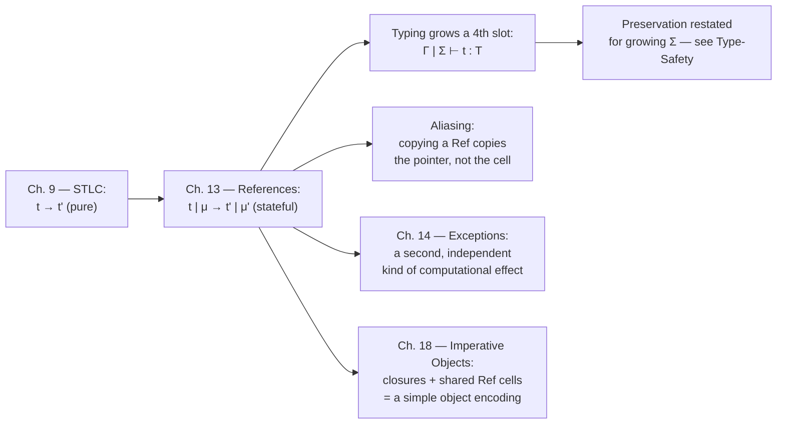

[[book-guidelines|↩ Back to guidelines]]

## Why a purely functional core can't model this

Everything built up through Chapters 9–12 — the simply typed lambda-calculus plus records, sums, `let`, even general recursion via `fix` — has one property in common: evaluating a term never changes the *meaning* of any other term still lying around. A closure captures its free variables' values once, and that's that. This is a genuinely nice property (it's most of why equational reasoning about these calculi is tractable), but it can't express something almost every real program needs: a piece of state that persists and changes across multiple, textually separate operations.

Concretely: you cannot write a counter. Not "a function that returns successive numbers when reapplied" (that's easy — thread an accumulator through recursive calls) but "an object `c` such that calling `incc()` now and `decc()` later, from unrelated parts of the program, observably communicate through `c`" — with no argument-passing between them. Pierce's own motivating example (§13.1) is exactly this: two functions `incc` and `decc`, closed over a shared cell, that manipulate a piece of state neither one explicitly threads to the other. A pure calculus has no channel for that. If you want it, you need a new *kind* of thing — not a value, but a place a value can live and be overwritten in.

That's a **reference**: not the value itself, but a location that currently holds a value and can be made to hold a different one later, while every other reference to that same location sees the change. This one move — decoupling "the thing" from "the name that currently points at the thing" — is also precisely what makes **aliasing** possible, and aliasing is where most of the chapter's genuine difficulty lives.

## The store: evaluation now needs a second thing to carry around

Before references, small-step evaluation was a single-argument transformation, $t \to t'$. Once terms can allocate mutable cells, evaluating a term can have a side effect that later evaluation steps — of the *same* term or a *completely different* term — need to see. So the evaluation relation grows a second, threaded component: the **store** (or heap) $\mu$, a partial function from an abstract set of locations $L$ to values. Pierce is deliberately abstract about what a location "is" — not an integer, not a byte offset, just an opaque token you can look up in $\mu$ — precisely so the formalism doesn't accidentally justify things like pointer arithmetic (footnote, §13.3: knowing location $n$ holds a `Float` tells you nothing about location $n+4$; this is exactly the class of bug that makes raw pointer arithmetic a notorious safety hole in C).

The single-step relation is restated as

$$t \mid \mu \longrightarrow t' \mid \mu'$$

read "term $t$ with store $\mu$ steps to term $t'$ with (possibly different) store $\mu'$." Every existing rule has to be re-stated to thread $\mu$ through unchanged where there's no side effect:

$$
\frac{}{(\lambda x{:}T_{11}.t_{12})\ v_2 \mid \mu \longrightarrow [x \mapsto v_2]t_{12} \mid \mu} \quad \text{(E-AppAbs)}
$$
$$
\frac{t_1 \mid \mu \longrightarrow t_1' \mid \mu'}{t_1\, t_2 \mid \mu \longrightarrow t_1'\, t_2 \mid \mu'} \quad \text{(E-App1)}
\qquad
\frac{t_2 \mid \mu \longrightarrow t_2' \mid \mu'}{v_1\, t_2 \mid \mu \longrightarrow v_1\, t_2' \mid \mu'} \quad \text{(E-App2)}
$$

Note `E-AppAbs` returns $\mu$ literally unchanged — beta-reduction itself has no effect; the two congruence rules just propagate whatever effect happened underneath. This is the general shape: a machine state used to be just "the term left to evaluate" (a program counter); now it's "the term plus the current store."

**What breaks without this:** if you tried to keep evaluation single-threaded (no store parameter) but still add `ref`/`:=`/`!`, you'd have no way to express that assigning through one variable is visible when dereferencing through an *alias* of it — each subterm would evaluate in blissful ignorance of what any other subterm did to "the same" cell, because there'd be no shared structure for "the same cell" to refer to.

## Locations join the syntax of values

The result of allocating a reference has to be *something* — a term you can go on computing with, pass to a function, store in a record. Pierce's move is to add a new syntactic category of value: the location itself.

$$
v ::= \lambda x{:}T.t \mid \texttt{unit} \mid l \qquad \text{(values, extended with locations } l\text{)}
$$
$$
t ::= x \mid \lambda x{:}T.t \mid t\,t \mid \texttt{unit} \mid \texttt{ref}\,t \mid {!t} \mid t\!:=\!t \mid l \qquad \text{(terms, extended)}
$$

Two things worth flagging explicitly, because they're easy to skim past:

1. **Locations are *terms* the reduction machinery produces, not something a programmer writes.** You never see a literal `l` in source code — it only ever shows up as an intermediate result once evaluation starts allocating. The extended grammar is a grammar of an *intermediate* language, one step more concrete than the surface syntax.
2. A location is a value of type `Ref T` — not the boxed contents. This is the formal cash-out of the earlier informal claim: a reference is "a name for a place," and the place's *current* contents is a separate thing you get to only by dereferencing.

### The three operations, operationally

**Allocation.** `ref t1` first reduces `t1` to a value, then — the interesting step — picks a location $l$ *not already in the domain of* $\mu$ (a "fresh" location) and extends the store:

$$
\frac{}{{\texttt{ref}}\ v_1 \mid \mu \longrightarrow l \mid (\mu, l \mapsto v_1)} \qquad l \notin \operatorname{dom}(\mu) \qquad \text{(E-RefV)}
$$

The *term* that results is just $l$; the interesting output is the *store*, which now has one more binding than before. This is the formal source of the phenomenon Type-Safety.md calls "the growing store": every allocation strictly extends $\operatorname{dom}(\mu)$, and nothing in this evaluation relation ever shrinks it — see the Garbage Collection remark below.

**Dereference.** `!t1` reduces `t1` to a value; once that value is a location $l$, look it up:

$$
\frac{\mu(l) = v}{{!l} \mid \mu \longrightarrow v \mid \mu} \qquad \text{(E-DerefLoc)}
$$

Dereferencing anything that *isn't* a location once fully reduced (a function, `unit`) is not covered by any rule — the machine simply gets stuck there, and it's exactly progress (§13.5.7, restated for stores) that guarantees a well-typed term never reaches that state.

**Assignment.** `t1 := t2` reduces `t1` to a location, then `t2` to any value, then overwrites:

$$
\frac{}{l\!:=\!v_2 \mid \mu \longrightarrow \texttt{unit} \mid [l \mapsto v_2]\mu} \qquad \text{(E-Assign)}
$$

where $[l \mapsto v_2]\mu$ means "$\mu$, except $l$ now maps to $v_2$." The resulting *term* is the trivial `unit` value — assignment's payload is entirely in the store it leaves behind. Pierce notes this dovetails with the sequencing sugar `t1; t2` from §11.3 (defined as `(λ_:Unit. t2) t1`): because `:=` produces `unit`, you can chain assignments left-to-right with `;` and the typechecker will reject accidentally discarding a *non-trivial* result.

### The type `Ref T`

Typing has to answer: what does a location's type even mean, given that its contents can change? Pierce's resolution (after showing why the naive "look up the type of `μ(l)` on demand" rule is both inefficient and outright non-terminating on cyclic stores — see [[Type-Safety]] for the full argument) is that a location's type is fixed once, at allocation time, and tracked separately in a **store typing** $\Sigma$. Given that, the rules for the reference-manipulating constructs are exactly what you'd expect:

$$
\frac{\Gamma \mid \Sigma \vdash t_1 : T_1}{\Gamma \mid \Sigma \vdash \texttt{ref}\ t_1 : \texttt{Ref}\ T_1} \ \text{(T-Ref)}
\quad
\frac{\Gamma \mid \Sigma \vdash t_1 : \texttt{Ref}\ T_{11}}{\Gamma \mid \Sigma \vdash {!t_1} : T_{11}} \ \text{(T-Deref)}
$$
$$
\frac{\Gamma \mid \Sigma \vdash t_1 : \texttt{Ref}\ T_{11} \qquad \Gamma \mid \Sigma \vdash t_2 : T_{11}}{\Gamma \mid \Sigma \vdash t_1 := t_2 : \texttt{Unit}} \ \text{(T-Assign)}
$$

`T-Ref` doesn't need to touch $\Sigma$ at all — the concrete location doesn't exist yet at typing time, it's only born at evaluation time; $\Sigma$ records associations for *already-allocated* cells. All the machinery for how $\Sigma$ itself is built, why it has to be allowed to grow ($\Sigma' \supseteq \Sigma$) as evaluation proceeds, and the full preservation/progress argument that makes this all sound, is developed in [[Type-Safety]] — that article owns the proof; this one just needs the punchline: **every location, once allocated, keeps the same type for its entire lifetime**, even though its *contents* changes freely. `Ref T` is a promise about the type of whatever currently lives at that location, not about any particular value.

## Aliasing: the whole point, and the whole danger

Here is the crux of why references are a genuinely different kind of feature, not just "assignment sugar." Consider:

```
r = ref 5;      (* r : Ref Nat *)
s = r;          (* s : Ref Nat — copies the reference, NOT the cell *)
s := 82;
!r;             (* => 82 *)
```

Binding `s = r` copies the *arrow* — the location — not the boxed `5`. After the copy, `r` and `s` are two independent names pointing at the *same* store slot; Pierce calls them **aliases**. Mutating through one is visible through the other, immediately, with no communication step written anywhere in the program text. This is simultaneously the entire *reason* references are useful (§13.1's `incc`/`decc` example — closures sharing a cell as an implicit communication channel, which Pierce explicitly flags as "we have constructed a simple kind of object," foreshadowing Chapter 18) and the entire source of the reasoning difficulty that pure calculi don't have: `(r := 1; r := !s)` is equivalent to the single assignment `r := !s` — *unless* `r` and `s` happen to be aliases, in which case the first assignment silently affects the second read. You cannot tell which case you're in by looking at the syntax; you need to know the aliasing structure, which is exactly the kind of fact type systems in this book are otherwise very good at making syntactically visible and this one, by default, is not.

**What breaks without tracking this:** every equational-reasoning trick that worked for the pure calculus (β-reduction preserves meaning, a subterm can be replaced by anything semantically equal to it) becomes conditional on alias information you don't have locally. This is precisely the "shared state" hazard Pierce names in §13.1 and gestures at in the chapter notes (§13.6) as the research area of *alias analysis* / Reynolds's "syntactic control of interference" — a problem serious enough to have spawned its own subfield (separation logic among the later developments cited).

**Rust's contrasting bet.** It's worth pausing on this because TAPL's `Ref T` and Rust's reference types make almost opposite design choices about the same underlying hazard. TAPL's `Ref T` is exactly one thing: an unconstrained pointer to a mutable cell — you can have as many aliases as you like, and the type system says nothing about *how many* or *who's allowed to write*. Rust instead makes the aliasing structure itself part of the type:

```rust
let r: &mut i32 = &mut cell;   // exclusive access: no other alias can exist
                                 // simultaneously, statically enforced
let s: &i32 = &cell;            // shared access: aliasing permitted, mutation
                                 // forbidden while this alias lives
```

Rust's borrow checker is, in effect, a static alias analysis of exactly the kind Pierce's chapter notes describe as an open research problem — TAPL's simply typed `Ref T` corresponds most closely to Rust's `Rc<RefCell<T>>` (shared ownership, aliasing allowed, mutation moved to a *runtime* check rather than eliminated), which is the escape hatch Rust reaches for precisely when you need TAPL-style unrestricted aliasing and are willing to trade the static guarantee for a runtime panic on violation. Seeing `RefCell`'s `borrow_mut()` panic ("already borrowed") is a very direct, runtime echo of the exact hazard TAPL's `Ref T` leaves completely unchecked.

**Python's version of the same bug.** The infamous mutable-default-argument gotcha is aliasing in miniature — the same "copying the reference, not the cell" phenomenon:

```python
def append_item(item, target=[]):   # default list created ONCE, at def time
    target.append(item)
    return target

append_item(1)   # [1]
append_item(2)   # [1, 2]  -- surprise: same list object as before!
```

`target=[]` is evaluated once, at function-definition time, and every call that omits the argument gets the *same* list — an alias, not a fresh copy. This is a direct real-world instance of exactly the phenomenon formalized by `E-RefV` allocating one location that every subsequent unqualified use of `target` resolves to.

## Garbage and unreachable locations

`E-RefV` only ever *extends* $\operatorname{dom}(\mu)$ — nothing in the evaluation rules ever removes a binding. Pierce is explicit that this doesn't threaten correctness (by definition, garbage is exactly the part of the store no longer reachable, so it "cannot play any further role in evaluation") but does mean a naive evaluator can exhaust memory in a case a smarter one, reclaiming unreachable cells, would handle fine. The chapter deliberately leaves this as unmodeled: no deallocation primitive is given.

That absence is a design choice, not an oversight, and Pierce is unusually direct about why (§13.1): giving programmers an explicit `free` operation is "extremely difficult" to reconcile with type safety, because of the **dangling-reference problem** — free a `Ref Nat` cell, reallocate the same storage as a `Ref Bool`, and now two typed names (one `Ref Nat`, one `Ref Bool`) alias the same underlying memory with incompatible typing assumptions. This is exactly the exercise the chapter poses (13.1.3): show how this leads to a type-safety violation. Relying on a garbage collector — as ML and Java both do — sidesteps the problem entirely by never letting a location's claimed type and its actual runtime type diverge; the location is simply retained as long as it's reachable at its original type.

## Synthesis: a genuine fork in the book

Every chapter before this one stayed inside a single semantic mold: substitution-based, side-effect-free reduction, where a term's meaning is fully determined by its own structure and its free variables' bindings. Chapter 13 is the first place that mold visibly cracks — evaluation now depends on, and mutates, something *outside* the term being evaluated. Structurally, this is why the typing judgment had to grow a component ($\Gamma \mid \Sigma \vdash t : T$) rather than just a new type constructor: mutable state isn't a new *kind of value*, it's a new *kind of context*.



Two forward pointers the book makes explicit and worth carrying forward: the `incc`/`decc`-sharing-a-cell pattern from §13.1 is literally the seed of the object encodings in Chapter 18 (a record of closures over shared mutable state *is* an object, in miniature); and exceptions (Chapter 14) are introduced immediately after as "another kind of computational effect," reusing the same rhetorical move (something else needed alongside pure substitution to model real languages) but a structurally different mechanism (non-local control transfer, not shared mutable storage).

For the broader project of building a verifier over Hoare-triple-style specifications: everything proved sound in the *pure* fragment of this book (substitution lemma, preservation, progress) had an implicit hidden assumption — that a term's free variables fully determine what it can observe. References break that assumption, and this chapter is the first place the book has to pay for it, by making the store and store typing first-class citizens of the judgment. A verifier that only reasons about pure functional code never needs this; a verifier that wants to check specifications over code with mutable references needs, at minimum, this chapter's move (state threaded explicitly through the semantics and [[The-Simply-Typed-Lambda-Calculus#The typing relation|the typing relation]]) as a starting point, and — once aliasing enters the picture, per the discussion above — realistically needs something closer to separation logic's frame rule to keep local reasoning about one reference from silently going stale because of a write through an alias elsewhere. That's a strictly harder problem than anything TAPL's simply typed `Ref T` is built to solve on its own; TAPL gives you the semantics that makes the problem precise, not the proof technique that tames it.
