[[book-guidelines|↩ Back to guidelines]]

## Why this chapter has to come before any type system

TAPL's real subject is type systems, but Chapter 2 and the early sections of Chapter 3 exist because you cannot prove anything rigorous about a language until you can answer three boring-sounding questions precisely:

1. What, exactly, *is* the set of well-formed programs?
2. What does it mean for a claim like "`t` evaluates to `t'`" to be *true*?
3. How do you prove something holds for *every* program, when there are infinitely many of them and no upper bound on their size?

Sloppy answers to these are exactly where hand-wavy language semantics comes from. A BNF grammar like

```
t ::= true | false | if t then t else t | 0 | succ t | pred t | iszero t
```

looks precise, but it's really just a human-readable abbreviation. It doesn't by itself tell you *why* `succ (succ 0)` is a term but `succ succ 0` (without the inner term being closed off) is not, nor does it give you a proof method for statements about "all terms." Chapter 2 supplies the general mathematical toolkit (induction on naturals, closure, relations), and Chapter 3 shows, with a genuinely tiny language, how that toolkit turns into three concrete techniques that recur, unchanged in spirit, in every chapter of the book: **inductive definitions of syntax**, **structural induction**, and **induction on derivations**. Everything from progress-and-preservation proofs (Ch. 8 onward) to the coinductive machinery of Chapter 21 is a variation on what's set up here.

What breaks without this: without a precise notion of "the set of terms," a proof by "obviously, this holds for all terms" is not a proof — it's an assertion. The entire discipline of the book (safety proofs, typechecking algorithms, metatheory) depends on being able to write "by induction on `t`" and have that be a real, checkable inference step, not a rhetorical flourish.

---

## 1. Inductively defined sets: three equivalent views

TAPL's running example is the tiny language of booleans and numbers. Pierce gives *three* definitions of the same set of terms $T$, deliberately, to show they coincide — and each view is useful for a different purpose later.

### 1a. As the smallest closed set

> **Definition 3.2.1.** The set of terms is the smallest set $T$ such that
> 1. $\{\texttt{true}, \texttt{false}, 0\} \subseteq T$;
> 2. if $t_1 \in T$, then $\{\texttt{succ}\ t_1, \texttt{pred}\ t_1, \texttt{iszero}\ t_1\} \subseteq T$;
> 3. if $t_1, t_2, t_3 \in T$, then $\texttt{if}\ t_1\ \texttt{then}\ t_2\ \texttt{else}\ t_3 \in T$.

The word **smallest** is doing all the work. Any of infinitely many sets satisfy clauses (1)–(3) — for instance, the set of *all* strings satisfies them trivially, since "closed under these rules" only says what must be included, not what must be excluded. If you dropped "smallest," you'd get no guarantee that some bizarre term like a free-floating `%` symbol isn't secretly a term too. "Smallest" is what turns a set of closure conditions into an exact characterization — it's the difference between "$T$ contains at least these things" and "$T$ contains exactly these things and nothing else."

This is also precisely why proofs *by induction* on $T$ are valid at all: induction works only because there is nothing in $T$ except what the rules put there.

### 1b. As inference rules

The same definition, written in the "natural deduction" notation used throughout the book (Definition 3.2.2):

$$
\dfrac{}{\texttt{true} \in T} \qquad \dfrac{}{\texttt{false} \in T} \qquad \dfrac{}{0 \in T}
$$
$$
\dfrac{t_1 \in T}{\texttt{succ}\ t_1 \in T} \qquad \dfrac{t_1 \in T}{\texttt{pred}\ t_1 \in T} \qquad \dfrac{t_1 \in T}{\texttt{iszero}\ t_1 \in T}
$$
$$
\dfrac{t_1 \in T \quad t_2 \in T \quad t_3 \in T}{\texttt{if}\ t_1\ \texttt{then}\ t_2\ \texttt{else}\ t_3 \in T}
$$

Rules with nothing above the line are called **axioms**; the generic term **inference rule** covers axioms and multi-premise rules alike. Pierce also flags a subtlety worth internalizing: what's written above is really a *rule schema* — each metavariable ($t_1$, $t_2$, $t_3$) stands for "any term whatsoever," so each schema is shorthand for infinitely many concrete rule instances.

### 1c. As an iterative construction

The third view builds $T$ from the bottom up, which is the one that makes "smallest" concrete rather than mysterious (Definition 3.2.3):

$$
S_0 = \varnothing \qquad S_{i+1} = \{\texttt{true}, \texttt{false}, 0\} \cup \{\texttt{succ}\ t_1, \texttt{pred}\ t_1, \texttt{iszero}\ t_1 \mid t_1 \in S_i\} \cup \{\texttt{if}\ t_1\ \texttt{then}\ t_2\ \texttt{else}\ t_3 \mid t_1, t_2, t_3 \in S_i\}
$$

$$
S = \bigcup_i S_i
$$

$S_0$ is empty, $S_1$ is just the three constants, $S_2$ adds everything buildable with one operator applied to constants, and so on — $S$ is the limit. Pierce then proves $T = S$ (Proposition 3.2.6) by showing each is a subset of the other; the "$S \subseteq T$... no wait, any set satisfying the closure conditions contains $S$" direction is itself a proof by (complete) induction on $i$, which is the first real payoff of Chapter 2's induction axioms.

**Why three views, not one?** View (a) is what you reach for when proving general facts ("$T$ is the smallest set closed under..."); view (b) is the notation you'll actually read and write for the rest of the book (typing rules, evaluation rules, [[Subtyping|subtyping]] rules are *all* inductive definitions in this style); view (c) is what justifies that induction over $T$ terminates — each element has a finite "stage" $i$ at which it first appears, which is exactly its *depth*.

### Grounding: the enum *is* the inductive definition

If you've ever written a recursive-descent-parsed AST as a Rust `enum`, you've already used view (b) without naming it:

```rust
enum Term {
    True,
    False,
    Zero,
    Succ(Box<Term>),
    Pred(Box<Term>),
    IsZero(Box<Term>),
    If(Box<Term>, Box<Term>, Box<Term>),
}
```

This `enum` *is* the smallest-set definition, enforced by the compiler rather than by an English sentence: there is no way to construct a `Term` value except through one of these seven constructors, each of which demands well-formed `Term`s in its recursive positions. Rust's exhaustive `match` is only sound because the enum is closed — the "smallest set" guarantee is what makes a `match` without a wildcard arm compile. If `Term` were "open" (imagine a `dyn Term` trait object anyone could implement), you could never write an exhaustive `match`, and structural induction over it would be unsound — this is the concrete shape of "what breaks without minimality."

Lean's `inductive` keyword names this construct directly, and is the most literal translation of Definition 3.2.1/3.2.2 — Lean's kernel *is* built around exactly this "smallest set closed under constructors" semantics:

```lean
inductive Term where
  | true    : Term
  | false   : Term
  | zero    : Term
  | succ    : Term → Term
  | pred    : Term → Term
  | isZero  : Term → Term
  | ite     : Term → Term → Term → Term
```

When Lean's kernel typechecks a use of `Term.rec` (the eliminator it auto-generates from this declaration), it is mechanically enforcing exactly the "smallest set" property: an eliminator only needs to handle these seven cases because the kernel guarantees no others exist. This is worth sitting with, since it's the seed of the connection to your elaborator project: *inductive type declarations, judgment forms defined by inference rules, and closed Rust enums are three syntaxes for the same underlying mathematical object* — a set defined as the least fixed point of a monotone rule set.

---

## 2. Induction on natural numbers: the base case for everything else

Chapter 2 (§2.4) gives three induction principles over $\mathbb{N}$ that Pierce treats as *axioms* — not because they need no justification, but because they're taken as primitive starting points for everything downstream:

**Ordinary induction:**
$$
\text{If } P(0), \text{ and for all } i,\ P(i) \Rightarrow P(i+1), \text{ then } P(n) \text{ holds for all } n.
$$

**Complete induction** (no separate base case; the induction hypothesis ranges over *all* smaller numbers):
$$
\text{If, for each } n,\ \big(\forall i < n.\ P(i)\big) \Rightarrow P(n), \text{ then } P(n) \text{ holds for all } n.
$$

**Lexicographic induction** on pairs, generalizing complete induction to tuples ordered by "first component, ties broken by second":
$$
\text{If, for each pair } (m,n),\ \big(\forall (m',n') < (m,n).\ P(m',n')\big) \Rightarrow P(m,n), \text{ then } P(m,n) \text{ holds for all } (m,n).
$$

Pierce is explicit that complete induction is the pattern used in the $T = S$ proof above: "we suppose that the desired predicate holds for all numbers strictly less than $i$... In essence, every step here is an induction step." That remark is a preview of structural induction on terms below — structural induction *is* complete induction, transported from $\mathbb{N}$ onto the "size" or "depth" of a term.

[[Bounded-Quantification#Grounding|Grounding]]: in Rust, ordinary induction is what justifies proving a property of a recursive function by induction on the recursion depth of, e.g., a factorial; complete induction is what you reach for once the recursive call isn't simply "n − 1" but something with an unpredictable smaller argument — the pattern behind proving termination of, say, the Ackermann-adjacent or Euclidean-GCD-style functions. In Lean, all three collapse into `Nat.rec` / `Nat.strong_induction_on` — complete induction is literally a derived lemma proved *from* the primitive `Nat.rec`, which is worth noting as a contrast: TAPL takes complete induction as a bare axiom, whereas a proof assistant derives it from something more primitive still.

---

## 3. Structural induction on terms

Section 3.3 transports the natural-number induction principles onto terms, and gives *three* equivalent induction principles (Theorem 3.3.4):

$$
\textbf{Induction on depth: } \text{if, for each } s,\ \big(\forall r.\ \text{depth}(r) < \text{depth}(s) \Rightarrow P(r)\big) \Rightarrow P(s), \text{ then } P(s)\ \forall s.
$$
$$
\textbf{Induction on size: } \text{if, for each } s,\ \big(\forall r.\ \text{size}(r) < \text{size}(s) \Rightarrow P(r)\big) \Rightarrow P(s), \text{ then } P(s)\ \forall s.
$$
$$
\textbf{Structural induction: } \text{if, for each } s,\ \big(\forall r \text{ an immediate subterm of } s \Rightarrow P(r)\big) \Rightarrow P(s), \text{ then } P(s)\ \forall s.
$$

These are *interderivable* — Pierce notes they give "a simpler structure for the proof at hand" in different situations, but prove the same class of statements. Structural induction is the one used almost everywhere in practice, "since it works on terms directly, avoiding the detour via numbers." Depth induction earns its keep only when you need to reason about something that isn't a strict immediate-subterm relationship (a case that recurs, importantly, in Chapter 21's coinductive treatment of infinite trees, where "immediate subterm" stops making sense but "finite depth" still can, in restricted ways).

$\text{depth}$ and $\text{size}$ are themselves defined inductively, exactly mirroring the term grammar — this recursion-follows-the-grammar shape is the single most reused pattern in the entire book:

$$
\text{size}(\texttt{true}) = \text{size}(\texttt{false}) = \text{size}(0) = 1
$$
$$
\text{size}(\texttt{succ}\ t_1) = \text{size}(\texttt{pred}\ t_1) = \text{size}(\texttt{iszero}\ t_1) = \text{size}(t_1) + 1
$$
$$
\text{size}(\texttt{if}\ t_1\ \texttt{then}\ t_2\ \texttt{else}\ t_3) = \text{size}(t_1) + \text{size}(t_2) + \text{size}(t_3) + 1
$$

The book's worked example, Lemma 3.3.3 ($|\text{Consts}(t)| \le \text{size}(t)$ — a term has no more distinct constants than nodes), is a template worth internalizing because every safety proof later in the book has this exact shape: a base case (constants) that's immediate, and inductive cases that apply the hypothesis to each subterm and combine the results "in some completely obvious way." Pierce's own closing remark is important calibration: for routine structural inductions, "simply writing 'by induction on $t$' constitutes a perfectly acceptable proof" — the machinery exists so you can *skip* restating it every time, not so you write it out in full generality forever.

### Grounding: structural induction is structural recursion, mechanically

The `Consts` and `size` functions translate directly, and their Rust implementations *are* proofs-by-construction that the function is well-defined on all of `Term` — because the `match` is exhaustive over a closed enum, termination and totality come for free from the recursive structure matching the inductive structure:

```rust
use std::collections::HashSet;

fn size(t: &Term) -> usize {
    match t {
        Term::True | Term::False | Term::Zero => 1,
        Term::Succ(t1) | Term::Pred(t1) | Term::IsZero(t1) => size(t1) + 1,
        Term::If(t1, t2, t3) => size(t1) + size(t2) + size(t3) + 1,
    }
}
```

In Lean, the `induction` tactic *is* structural induction on terms, generated automatically from the `inductive` declaration's constructors — proving a lemma like `size_ge_one : ∀ t, size t ≥ 1` by `induction t` produces exactly the case split TAPL writes out by hand (`Case: t = true`, `Case: t = succ t1`, …), with the induction hypothesis for `succ`/`pred`/`isZero`/`ite` supplied automatically for their recursive subterm positions. This is the precise mechanism: Lean's `Term.rec` eliminator, generated from the `inductive` block in §1, *is* Theorem 3.3.4's structural induction principle, reified as a term of the proof language rather than left as an informal proof technique.

---

## 4. Derivations and induction on derivations

The final piece is the most subtle, and it's introduced almost in passing (§3.5.1–3.5.4) via the one-step evaluation relation for booleans:

$$
\dfrac{}{\texttt{if true then}\ t_2\ \texttt{else}\ t_3 \to t_2} \text{(E-IfTrue)} \qquad
\dfrac{}{\texttt{if false then}\ t_2\ \texttt{else}\ t_3 \to t_3} \text{(E-IfFalse)}
$$
$$
\dfrac{t_1 \to t_1'}{\texttt{if}\ t_1\ \texttt{then}\ t_2\ \texttt{else}\ t_3 \to \texttt{if}\ t_1'\ \texttt{then}\ t_2\ \texttt{else}\ t_3} \text{(E-If)}
$$

**Definition 3.5.3** defines $\to$ exactly the way $T$ was defined in §1: the one-step evaluation relation is *the smallest binary relation on terms satisfying these rules*. This is the same "sets defined by inference rules" idea from Section 1, just applied to a *relation* on terms instead of the set of terms itself — and it's the pattern behind every judgment form in the rest of the book: typing ($\Gamma \vdash t : T$), subtyping ($S <: T$), kinding, and multi-step evaluation are all defined this same way.

Because $\to$ is the smallest such relation, every derivable evaluation statement $t \to t'$ has a **derivation tree**: a finite tree whose leaves are instances of axioms (E-IfTrue, E-IfFalse) and whose internal nodes are instances of rules-with-premises (E-If), built by consistently substituting terms for metavariables. Pierce's worked example, abbreviating $s = \texttt{if true then false else false}$, $t = \texttt{if}\ s\ \texttt{then true else true}$, $u = \texttt{if false then true else true}$, shows the derivation witnessing $\texttt{if}\ t\ \texttt{then false else false} \to \texttt{if}\ u\ \texttt{then false else false}$:

<svg viewBox="0 0 760 210" xmlns="http://www.w3.org/2000/svg" font-family="Georgia, serif" font-size="15">
  <text x="380" y="30" text-anchor="middle" fill="#888">s → false</text>
  <line x1="230" y1="42" x2="530" y2="42" stroke="#888" stroke-width="1.5"/>
  <text x="545" y="47" fill="#888" font-size="13" font-style="italic">E-IfTrue</text>

  <text x="380" y="80" text-anchor="middle" fill="#888">t → u</text>
  <line x1="140" y1="92" x2="620" y2="92" stroke="#888" stroke-width="1.5"/>
  <text x="635" y="97" fill="#888" font-size="13" font-style="italic">E-If</text>

  <text x="380" y="135" text-anchor="middle" fill="#888">if t then false else false → if u then false else false</text>
  <line x1="40" y1="147" x2="720" y2="147" stroke="#888" stroke-width="1.5"/>
  <text x="735" y="152" fill="#888" font-size="13" font-style="italic">E-If</text>
</svg>

Each horizontal bar is one rule application; the tree is read bottom-to-top as "conclusion justified by premise(s) above." Pierce notes this particular tree looks unusually thin — no branching — only because no rule in this tiny system has more than one premise; typing derivations later in the book, with rules like `T-If` needing three separate typing judgments, produce genuinely branching trees.

This directly justifies **induction on derivations**: since every derivable statement has a finite derivation tree, you can prove a property $P$ of the relation by showing $P$ holds at every possible "last rule used," assuming it already holds of the (structurally smaller) derivations of the premises. TAPL's worked example is the **Determinacy Theorem** (3.5.4): if $t \to t'$ and $t \to t''$, then $t' = t''$. The proof is a case split on the last rule used to derive $t \to t'$ — E-IfTrue forces $t$'s guard to be `true`, which rules out E-IfFalse and E-If for the *other* derivation by inspection of what those rules require, leaving only E-IfTrue again; the E-If case recurses via the induction hypothesis on the (smaller) premise derivation. This case-by-case elimination — "given the conclusion, what must the last rule and its premises have been?" — is exactly what the book later formalizes by name as a **generation lemma** (also called an inversion lemma, e.g. for [[The-Simply-Typed-Lambda-Calculus#The typing relation|the typing relation]] in Ch. 9 §9.3): rule induction proves universal properties of a judgment, while generation lemmas extract the *necessary preconditions* implied by a specific instance of that judgment being derivable. Both are two sides of the same fact — that the judgment is the *smallest* relation closed under its rules.

### Grounding: the evaluation relation as an inductive `Prop`, and matching as case-splitting on the last rule

Rust's pattern matching over an enum of evaluation "reasons" is the mechanical analogue of case-splitting on the last rule used — a small-step evaluator *is* a constructive witness that a derivation tree exists:

```rust
fn step(t: &Term) -> Option<Term> {
    match t {
        Term::If(t1, t2, t3) => match t1.as_ref() {
            Term::True  => Some((**t2).clone()),               // E-IfTrue
            Term::False => Some((**t3).clone()),               // E-IfFalse
            _ => step(t1).map(|t1p|                              // E-If
                Term::If(Box::new(t1p), t2.clone(), t3.clone())),
        },
        _ => None, // already a value / no rule applies
    }
}
```

Determinacy here isn't just provable — it's *structural*: because `step` is a total function (not a relation), it can never return two different results for the same input; TAPL's Theorem 3.5.4 is the proof that this "smallest relation" behaves like a *function*, which is exactly the property this Rust code assumes for free by construction. This gap — proving determinacy as a theorem about a relation, versus getting it for free from a function's totality — is worth noticing: it's the same gap between a *specification* (the inductive relation, closer to what a Hoare-triple checker needs to reason about) and an *implementation* (the deterministic evaluator).

Lean makes the relation/derivation-tree correspondence completely literal, because an inductive `Prop` in Lean is *defined* the same way TAPL defines $\to$ — as the smallest relation closed under given constructors, and a proof term of `Step t t'` *is* a derivation tree:

```lean
inductive Step : Term → Term → Prop where
  | ifTrue  {t2 t3} : Step (.ite .true t2 t3) t2
  | ifFalse {t2 t3} : Step (.ite .false t2 t3) t3
  | ifCong  {t1 t1' t2 t3} : Step t1 t1' →
      Step (.ite t1 t2 t3) (.ite t1' t2 t3)

theorem determinacy {t t' t'' : Term} (h1 : Step t t') (h2 : Step t t'') : t' = t'' := by
  induction h1 with
  | ifTrue        => cases h2 <;> rfl
  | ifFalse       => cases h2 <;> rfl
  | ifCong h1 ih  => cases h2 <;> simp_all
```

`induction h1` performs induction on the *derivation* of `Step t t'`, exactly as TAPL's proof does by hand — each case of the `induction` tactic corresponds to "what was the last rule used." `cases h2` inside each branch is the generation/inversion step: given that `t` has a certain shape (forced by the first derivation), it eliminates the impossible shapes `h2` could have taken. This is the cleanest available illustration of why "induction on derivations" and "generation lemmas" are the same underlying mechanism wearing two names — in Lean they are literally the same two tactics (`induction`, `cases`) applied to the same inductive family.

---

## Where this leads

```mermaid
flowchart TD
    A["Ch 2 — induction axioms\n(ordinary, complete, lexicographic)"] --> B["Ch 3 §3.2 — inductive\ndefinitions of syntax"]
    B --> C["Ch 3 §3.3 — structural\ninduction on terms"]
    B --> D["Ch 3 §3.5 — judgments as\nsmallest relations + derivations"]
    D --> E["induction on derivations\n+ generation/inversion lemmas"]
    C --> F["Ch 8–9 — typing relation,\ncanonical forms, inversion"]
    E --> F
    F --> G["progress + preservation\n= type safety (Ch 8, 9, 13...)"]
    E --> H["Ch 21 — coinduction:\nswap 'smallest' for 'largest'\nrelation closed under the rules"]
```



Every judgment form defined for the rest of the book — the typing relation $\Gamma \vdash t : T$ (Ch. 8, 9), the subtype relation $S <: T$ (Ch. 15), kinding (Ch. 29) — is introduced exactly the way $\to$ was here: as the smallest relation closed under a set of inference rules, proved about by structural or rule induction, and picked apart by generation/inversion lemmas. The **progress** and **preservation** theorems that constitute [[Type-Safety|type safety]] (first appearing in Ch. 8) are themselves proved by induction on typing derivations, with a generation lemma (there, an "inversion of typing" lemma) supplying exactly the case analysis this chapter's Determinacy proof modeled. The one deliberate exception, flagged explicitly by Pierce and worth pre-empting here: Chapter 21 needs to reason about *infinite* regular trees (equi-[[Recursive-Types|recursive types]]), where "smallest closed relation" stops being the right notion (an infinite object can't be built up from a finite base case) — that's where the book swaps induction for **coinduction**, defining a relation as the *largest* one consistent with the rules instead. Everything in this chapter is the inductive half of that later contrast.

For the standing project: this chapter is the direct ancestor of both target systems. The "judgment form defined by inference rules, proved by rule induction, picked apart by generation lemmas" pattern *is* the shared skeleton of a type checker and a proof checker — a Hoare-triple verifier's soundness proof will have exactly this shape (induction on a derivation of the triple's validity, with a generation lemma per Hoare rule), and an elaborator's `isDefEq`/unification routine is, underneath, deciding membership in an inductively (or, for definitional equality with reduction, sometimes coinductively) defined relation exactly like $\to$ here. The Rust `Term`/`step` pair above is close to a minimal skeleton for the checker side; the Lean `inductive`/`induction`/`cases` triad above is close to a minimal skeleton for the elaborator-adjacent proof-search side — recognizing that they're two views of the same construction is the main payoff of this chapter.
