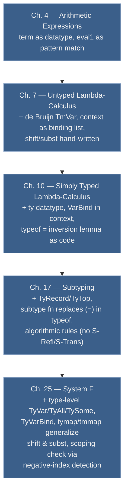

# ML Implementation Techniques

[[book-guidelines|↩ Back to guidelines]]

## Why this topic isn't really "one chapter"

TAPL has five chapters titled "An ML Implementation of ___," and Pierce tells you explicitly that they're a matched set: "readers who do not intend to work with the implementations... can skip this chapter and all later chapters with the phrase 'ML Implementation' in their titles." That's a tell. These aren't five independent case studies — they're five snapshots of the *same* implementation, taken as the calculus it implements grows: arithmetic expressions (Ch. 4), the untyped lambda-calculus (Ch. 7), the simply typed lambda-calculus (Ch. 10), [[Subtyping|subtyping]] (Ch. 17), and System F (Ch. 25). Each chapter adds a layer on top of the previous one's code, and each layer forces the *implementation technique itself* — not just the language it's implementing — to grow up a little.

That's the real subject here: how do you mechanically turn an inference-rule definition on paper into working code, and what has to change about *how* you do that as the object language gains binders, types, subtyping, and quantifiers? There are four recurring moves, and this article follows each one across all five chapters rather than re-deriving it five times:

1. **Terms and types become datatypes** — one constructor per grammar production.
2. **Contexts become [[Recursive-Types#Lists|lists]] of bindings** — and the payload each binding carries grows with the type system.
3. **Shifting and substitution get unified into a single generic mapping function** — because as binders multiply, hand-writing recursive-descent boilerplate for each one stops scaling.
4. **Typechecking becomes a syntax-directed recursive function** — a direct transcription of an *inversion lemma*, not of the typing rules as stated.

If you're building a verifier or an elaborator, this is worth reading closely: it's the actual blueprint. Every one of these four moves reappears, barely disguised, in any real typechecker or proof kernel you'll write, including — as the closing synthesis argues — the specific projects motivating this study.

## Move 1: Terms and types as datatypes

### The core idea

The starting complaint TAPL implicitly answers is: a BNF grammar and an inductively-defined relation are precise, but they're inert. You can't run them. The first and most literal implementation step is to notice that an inductive grammar definition and an algebraic datatype definition are *the same object* wearing different notation — a grammar production
$$
t ::= \texttt{true} \mid \texttt{false} \mid \texttt{if } t \texttt{ then } t \texttt{ else } t \mid 0 \mid \texttt{succ}\ t \mid \texttt{pred}\ t \mid \texttt{iszero}\ t
$$
just *is* a sum type with one variant per alternative, each variant's payload matching the number and kind of subterms drawn.

### Chapter 4: the first transliteration

Pierce calls this out directly for the arithmetic-expression grammar of Chapter 3 (p. 24): the OCaml declaration is "a straightforward transliteration of the grammar."

```ocaml
type term =
    TmTrue of info
  | TmFalse of info
  | TmIf of info * term * term * term
  | TmZero of info
  | TmSucc of info * term
  | TmPred of info * term
  | TmIsZero of info * term
```

Notice the `info` field riding along on every constructor — that's not part of the mathematical syntax at all; it's source-position metadata for error messages, present in every implementation chapter but irrelevant to the underlying algorithms. It's worth flagging on first sight so it doesn't look like it's doing semantic work later.

The corresponding derived predicates — "is this a numeric value," "is this a value at all" — are then just structural recursion by pattern match:

```ocaml
let rec isnumericval t = match t with
    TmZero(_) → true
  | TmSucc(_,t1) → isnumericval t1
  | _ → false
```

This is the whole idea in miniature: *the shape of the recursive function mirrors the shape of the inductive definition it's implementing.* There is no clever algorithm here, and that's the point — inductively-defined syntax gives you the recursion scheme for free.

### The pattern grows: binders, then types, then quantifiers

Chapter 7's untyped lambda-calculus adds a genuinely new ingredient: a *binding* constructor, `TmAbs`. Chapter 6 had already made the representational decision that matters here — using de Bruijn indices instead of variable names, so a bound occurrence carries a small integer (distance to its binder) rather than a name string:

```ocaml
type term =
    TmVar of info * int * int
  | TmAbs of info * term
  | TmApp of info * term * term
```

The second `int` on `TmVar` isn't part of the math at all — it's a debugging invariant (the expected length of the enclosing context), checked on every print so that a forgotten shift shows up immediately as `[bad index]` rather than as a silent wrong answer. That's a nice example of an implementation adding structure the formalism doesn't need, purely for engineering robustness.

Chapter 10 (simply typed lambda-calculus) adds a *type* datatype alongside the term datatype, built by the identical transliteration move:

```ocaml
type ty =
    TyBool
  | TyArr of ty * ty

type term =
    TmTrue of info
  | TmFalse of info
  | TmIf of info * term * term * term
  | TmVar of info * int * int
  | TmAbs of info * string * ty * term      (* now carries a ty annotation *)
  | TmApp of info * term * term
```

Chapter 17 (subtyping) extends `ty` with record types and a top type, and Chapter 25 (System F) extends it again with *type-level* variables and quantifiers — `TyVar`, `TyAll`, `TySome` — using the exact same de Bruijn-index trick for type variables that Chapter 6 used for term variables:

```ocaml
type ty =
    TyVar of int * int
  | TyArr of ty * ty
  | TyAll of string * ty
  | TySome of string * ty
```

**What breaks without this uniform treatment:** if each chapter invented a bespoke representation for its new syntax instead of extending the same datatype-per-grammar discipline, the later "generic mapping function" trick (Move 3) wouldn't be generic — it would need bespoke shifting/substitution code for every new binder shape, and that code duplication is exactly the failure mode TAPL is trying to head off. The datatype discipline is what makes the later moves possible at all.

### Grounding

**Rust.** This maps almost mechanically onto an `enum`:

```rust
enum Term {
    True,
    False,
    If(Box<Term>, Box<Term>, Box<Term>),
    Var(usize, usize),          // (de Bruijn index, context length check)
    Abs(String, Box<Ty>, Box<Term>),
    App(Box<Term>, Box<Term>),
}

enum Ty {
    Bool,
    Arr(Box<Ty>, Box<Ty>),
}
```

The `Box` indirection is Rust's answer to OCaml's implicit heap-allocated sum types — a recursive enum needs it because the compiler must know the size of `Term` up front, and `Term` containing `Term` directly would be infinite-sized. `isnumericval` becomes a `match` arm exactly like the OCaml, and this is precisely the AST representation a Rust verifier's parser would hand to its typechecker.

**Lean.** Lean's `inductive` is, if anything, an even more literal rendering of "the set defined by these grammar productions is the smallest set closed under these constructors" than OCaml's `type` — that phrase from Chapter 2's inductive-definition machinery *is* Lean's semantics for `inductive`:

```lean
inductive Term where
  | var   : Nat → Term
  | abs   : String → Ty → Term → Term
  | app   : Term → Term → Term
```

**Python**, for a quick untyped sketch where the ceremony of tags matters less than the recursion:

```python
class Var: 
    def __init__(self, idx): self.idx = idx
class Abs:
    def __init__(self, ty, body): self.ty, self.body = ty, body
class App:
    def __init__(self, t1, t2): self.t1, self.t2 = t1, t2
```

## Move 2: contexts as lists of bindings

### The core idea

A typing judgment $\Gamma \vdash t : T$ needs somewhere to keep track of "variable $x$ has assumed type $S$" while walking into the scope of a binder. On paper, $\Gamma$ is written as a sequence $x_1{:}T_1, x_2{:}T_2, \ldots$. The implementation move is almost embarrassingly direct: a context *is* a list, and extending it is *cons*.

```ocaml
type context = (string * binding) list

let addbinding ctx x bind = (x,bind) :: ctx
```

### What a "binding" carries grows with the type system

Here's where the synthesis across chapters actually pays off — the same `context` type is reused throughout, but the `binding` type it's built from is extended at exactly the points where the type system gets richer, and TAPL is explicit about tracking this:

- **Chapter 7** (untyped): bindings carry *nothing*. `type binding = NameBind`. The context here exists purely to support converting between named surface syntax and nameless internal terms during parsing/printing — it isn't doing any typing work yet.
- **Chapter 10** (simply typed): a new constructor is added, `VarBind of ty`, so that a lookup can recover a variable's assumed type. The old `NameBind` constructor is *kept*, not replaced, because parsing and printing still don't care about types — this is a nice small lesson in not over-generalizing a data type prematurely.
  ```ocaml
  type binding =
      NameBind
    | VarBind of ty
  ```
- **Chapter 25** (System F): a third constructor, `TyVarBind`, is added for type-variable bindings introduced by `∀` and `∃`. It carries no payload — "unlike term variables, type variables in this system are not annotated with any additional assumptions" — but Pierce flags that a system with *bounded* quantification (Chapter 26) or *higher kinds* (Chapter 29) would need to attach data here. The binding type is, in effect, a running ledger of "what does the type system need to remember about a name," and it grows exactly in step with the judgment forms.
  ```ocaml
  type binding =
      NameBind
    | VarBind of ty
    | TyVarBind
  ```

**What breaks without a real context type:** without a structured lookup keyed by de Bruijn index, `getTypeFromContext` couldn't exist as a total, well-typed function — you'd be threading an untyped association list and hoping the tags matched at every call site. TAPL's `getbinding`/`getTypeFromContext` pair even builds in a runtime consistency check (pattern-matching for `VarBind` specifically and calling `error` otherwise) precisely because later chapters *will* add other binding shapes, and a context lookup expecting one kind can legitimately encounter another.

### Grounding

**Rust**, where the binding ledger is a natural `enum` and the context a `Vec` used as a stack (push = extend the scope, and de Bruijn indices count from the end):

```rust
enum Binding {
    NameBind,
    VarBind(Ty),
    TyVarBind,
}
type Context = Vec<(String, Binding)>;

fn get_type_from_context(ctx: &Context, i: usize) -> &Ty {
    match &ctx[ctx.len() - 1 - i].1 {
        Binding::VarBind(ty) => ty,
        _ => panic!("wrong binding kind"),
    }
}
```

**Lean**, where this is exactly the shape of a `LocalContext` in Lean's own elaborator — a list of local declarations, each carrying a type (and, for `let`-bound locals, a value), looked up by de Bruijn index during type inference. If you're building a metavariable-unification elaborator, this *is* the data structure your unifier's occurs-check and instantiation logic will walk.

**Python:**

```python
# context is a list of (name, binding) pairs, most-recent-first
def add_binding(ctx, name, binding):
    return [(name, binding)] + ctx
```

## Move 3: generic shifting and substitution via mapping functions

### The problem this solves

De Bruijn indices (Chapter 6) remove the alpha-conversion headache, but they introduce a new one: an index's *meaning* is "distance to my binder," so moving a term underneath a new binder, or substituting one term inside another, requires renumbering free variables — this is *shifting*. Chapter 7 implements this the direct way, one recursive walk per operation:

```ocaml
let termShift d t =
  let rec walk c t = match t with
      TmVar(fi,x,n) → if x>=c then TmVar(fi,x+d,n+d) else TmVar(fi,x,n+d)
    | TmAbs(fi,x,t1) → TmAbs(fi, x, walk (c+1) t1)
    | TmApp(fi,t1,t2) → TmApp(fi, walk c t1, walk c t2)
  in walk 0 t

let termSubst j s t =
  let rec walk c t = match t with
      TmVar(fi,x,n) → if x=j+c then termShift c s else TmVar(fi,x,n)
    | TmAbs(fi,x,t1) → TmAbs(fi, x, walk (c+1) t1)
    | TmApp(fi,t1,t2) → TmApp(fi, walk c t1, walk c t2)
  in walk 0 t
```

Pierce points out immediately what's staring you in the face: these two functions are *identical except at the `TmVar` leaf*. Every non-variable constructor just recurses structurally, bumping the cutoff `c` under each binder. That structural-recursion skeleton is pure boilerplate — it depends only on the *shape* of the term datatype, not on whether you're shifting or substituting.

### The generalization: `tmmap`/`tymap`

The fix is to abstract the one varying part — what to do at a variable — into a function parameter, `onvar`, and factor the shared skeleton out into a single generic mapper:

```ocaml
let tymap onvar c tyT =
  let rec walk c tyT = match tyT with
      TyArr(tyT1,tyT2) → TyArr(walk c tyT1, walk c tyT2)
    | TyVar(x,n) → onvar c x n
    | TyAll(tyX,tyT2) → TyAll(tyX, walk (c+1) tyT2)
    | TySome(tyX,tyT2) → TySome(tyX, walk (c+1) tyT2)
  in walk c tyT
```

Shifting and substitution are now both just *particular instantiations* of `onvar`:

```ocaml
let typeShiftAbove d c tyT =
  tymap (fun c x n → if x>=c then TyVar(x+d,n+d) else TyVar(x,n+d)) c tyT

let typeSubst tyS j tyT =
  tymap (fun j x n → if x=j then (typeShift j tyS) else (TyVar(x,n))) j tyT
```

This isn't a cosmetic refactor — it's a genuine change in what "adding a construct to the language" costs. Without `tmmap`, adding a new binder-containing constructor means touching *every* function that walks terms (shift, substitute, free-variable collection, ...) to add a case bumping the cutoff correctly. With it, you touch `tmmap` once, and every instantiation of it inherits the fix automatically. Chapter 25's `tmmap` shows the pattern maturing further: because a *term* now contains two different flavors of variable-like leaves — term variables (`TmVar`) and type annotations embedded in terms (the `ty` inside `TmAbs`, `TmTApp`, `TmPack`) — the generic mapper needs *two* callbacks instead of one:

```ocaml
let tmmap onvar ontype c t =
  let rec walk c t = match t with
      TmVar(fi,x,n) → onvar fi c x n
    | TmAbs(fi,x,tyT1,t2) → TmAbs(fi,x, ontype c tyT1, walk (c+1) t2)
    | TmApp(fi,t1,t2) → TmApp(fi, walk c t1, walk c t2)
    | TmTAbs(fi,tyX,t2) → TmTAbs(fi,tyX, walk (c+1) t2)
    | TmTApp(fi,t1,tyT2) → TmTApp(fi, walk c t1, ontype c tyT2)
    | TmPack(fi,tyT1,t2,tyT3) → TmPack(fi, ontype c tyT1, walk c t2, ontype c tyT3)
    | TmUnpack(fi,tyX,x,t1,t2) → TmUnpack(fi,tyX,x, walk c t1, walk (c+2) t2)
  in walk c t
```

Notice `TmUnpack`'s cutoff bump of `c+2`, not `c+1` — unpacking `let {X,x} = t1 in t2` binds *two* names at once (a type variable and a term variable), and the generic mapper has to get that binder arithmetic exactly right or every substitution under an existential silently corrupts indices. This is the load-bearing detail a hand-rolled, one-off substitution function is most likely to get wrong precisely because it's easy to eyeball as "just like the `TmAbs` case."

Composite operations are then just short compositions built on top of the primitives, e.g. beta-reduction's substitute-then-adjust dance:

```ocaml
let termSubstTop s t =
  termShift (-1) (termSubst 0 (termShift 1 s) t)
```

which literally encodes: shift the argument up by one (to pass under the binder being eliminated), substitute it for variable 0, then shift the whole result down by one (because that binder is now gone).

**What breaks without this:** hand-duplicated shift/subst code for every new binder-bearing construct is exactly the kind of code that silently drifts — one clause gets the cutoff bump right, a sibling clause added six months later doesn't, and you get a substitution bug that only manifests on deeply-nested terms. This is also, not coincidentally, one of the most common classes of real bugs in hand-rolled typecheckers and proof kernels.

### Grounding

**Rust** — this is a textbook case for the visitor/fold pattern, since Rust doesn't have OCaml's light-weight closures-as-first-class-arguments feel quite as naturally but the idea transfers directly via a trait or a plain function pointer:

```rust
fn term_map(
    onvar: &dyn Fn(usize, usize, usize) -> Term,  // (cutoff, index, ctx-len)
    c: usize,
    t: &Term,
) -> Term {
    match t {
        Term::Var(x, n) => onvar(c, *x, *n),
        Term::Abs(name, ty, t1) => Term::Abs(name.clone(), ty.clone(), Box::new(term_map(onvar, c + 1, t1))),
        Term::App(t1, t2) => Term::App(Box::new(term_map(onvar, c, t1)), Box::new(term_map(onvar, c, t2))),
    }
}

fn term_shift(d: isize, t: &Term) -> Term {
    term_map(&|c, x, n| /* bump x if x >= c */ todo!(), 0, t)
}
```

If you're writing a Rust verifier, this `term_map` (or its fold/visitor cousin) is exactly the piece of infrastructure you want *once*, shared by shifting, substitution, and free-variable collection, rather than three near-duplicate recursive functions.

**Lean.** This generic-mapping idea is a De Bruijn-index-management pattern Lean's own kernel implements internally (its `Expr` substitution and `liftLooseBVars` machinery is doing exactly this job under the hood, with the same cutoff-tracking discipline). Conceptually:

```lean
def termMap (onVar : Nat → Nat → Nat → Term) (c : Nat) : Term → Term
  | .var x n   => onVar c x n
  | .abs nm ty t1 => .abs nm ty (termMap onVar (c+1) t1)
  | .app t1 t2 => .app (termMap onVar c t1) (termMap onVar c t2)
```

**Python**, minimal illustration of instantiating the same mapper for both operations:

```python
def term_map(onvar, c, t):
    if isinstance(t, Var):
        return onvar(c, t.idx)
    if isinstance(t, Abs):
        return Abs(t.ty, term_map(onvar, c + 1, t.body))
    if isinstance(t, App):
        return App(term_map(onvar, c, t.t1), term_map(onvar, c, t.t2))

def shift(d, t):
    return term_map(lambda c, x: Var(x + d if x >= c else x), 0, t)
```

## Move 4: syntax-directed typechecking as a recursive function

### The core idea, and a subtlety worth pausing on

The naive expectation is that `typeof` is "just" the typing rules typed into OCaml. Pierce is careful to correct this: `typeof` is better understood as a transcription of the *inversion lemma*, not of the rules themselves. The typing rules, read forward, tell you sufficient conditions for a term to have a type; they don't, individually, tell you that a term is *not* well typed, since some other rule might apply. The inversion lemma is the converse direction — for each syntactic form, the *exact* (necessary) conditions a well-typed instance of that form must satisfy — and it's *that* direction that a deterministic function can implement, because a function has to commit to an answer for every input.

This distinction sounds pedantic until you notice its practical payoff, called out explicitly in Chapter 10: at the level of $\lambda_\to$ the difference is invisible because the inversion lemma follows immediately from the rules. In later, richer systems — anything with subtyping, in particular — proving inversion takes real work, precisely because reading the algorithm back out of the declarative rules is no longer automatic. That's the seam where Chapter 17 has to do something the earlier chapters didn't.

### Chapter 10: the clean case

```ocaml
let rec typeof ctx t =
  match t with
    TmTrue(fi) → TyBool
  | TmFalse(fi) → TyBool
  | TmIf(fi,t1,t2,t3) →
     if (=) (typeof ctx t1) TyBool then
       let tyT2 = typeof ctx t2 in
       if (=) tyT2 (typeof ctx t3) then tyT2
       else error fi "arms of conditional have different types"
     else error fi "guard of conditional not a boolean"
  | TmVar(fi,i,_) → getTypeFromContext fi ctx i
  | TmAbs(fi,x,tyT1,t2) →
      let ctx' = addbinding ctx x (VarBind(tyT1)) in
      let tyT2 = typeof ctx' t2 in
      TyArr(tyT1, tyT2)
  | TmApp(fi,t1,t2) →
      let tyT1 = typeof ctx t1 in
      let tyT2 = typeof ctx t2 in
      (match tyT1 with
          TyArr(tyT11,tyT12) →
            if (=) tyT2 tyT11 then tyT12
            else error fi "parameter type mismatch"
        | _ → error fi "arrow type expected")
```

Each match arm corresponds to exactly one typing rule, and the recursive structure of `typeof` follows the recursive structure of the *term*, not of the derivation — that's what "syntax-directed" means operationally: dispatch purely on the outermost constructor of the term, no guessing, no backtracking. TAPL flags a deliberate detail: `=` is written prefix, `(=)`, specifically so that later versions of `typeof` can drop in a *different* comparison in the same textual slot — which is exactly what happens next.

### Chapter 17: type equality becomes subtype checking

Adding subtyping means the application rule's naive equality check (`tyT2 = tyT11`) is too strict — an argument doesn't need the exact parameter type, only a subtype of it. The change is a single, surgical swap:

```ocaml
| TmApp(fi,t1,t2) →
    let tyT1 = typeof ctx t1 in
    let tyT2 = typeof ctx t2 in
    (match tyT1 with
        TyArr(tyT11,tyT12) →
          if subtype tyT2 tyT11 then tyT12          (* was: (=) tyT2 tyT11 *)
          else error fi "parameter type mismatch"
      | _ → error fi "arrow type expected")
```

and `subtype` is itself the by-now-familiar move applied one level up — it's a syntax-directed *algorithmic* rendering of the declarative subtyping relation of Chapter 16, with the two "algorithmically annoying" rules (`S-Refl`, `S-Trans`) explicitly removed, since a naive transcription of `S-Trans` would try substituting an unbounded intermediate type and never terminate:

```ocaml
let rec subtype tyS tyT =
   (=) tyS tyT ||
   match (tyS,tyT) with
     (TyRecord(fS), TyRecord(fT)) →
       List.for_all
         (fun (li,tyTi) →
            try let tySi = List.assoc li fS in subtype tySi tyTi
            with Not_found → false)
         fT
   | (_,TyTop) → true
   | (TyArr(tyS1,tyS2),TyArr(tyT1,tyT2)) → (subtype tyT1 tyS1) && (subtype tyS2 tyT2)
   | (_,_) → false
```

The reflexivity check at the top (`(=) tyS tyT ||`) is presented as an optimization rather than a soundness necessity — most real-world subtype checks compare a type to itself — but it's also a preview of a recurring implementation habit: fast-path structural equality before falling into the expensive recursive case. Notice, too, the contravariance built directly into the code: `subtype tyT1 tyS1` swaps the operands for function-argument position — this is exactly the moment where "subtyping is a partial order that happens to flip direction in negative positions" stops being a sentence in the text and becomes a line of code you could get backwards.

### Chapter 25: typechecking with binder-introducing rules

System F's `typeof` shows the pattern reaching its most binder-heavy form. Type abstraction and existential unpacking both extend the *context*, not just recurse on subterms — and both then have to *shift the resulting type back down* to compensate for the type variable that's about to go out of scope:

```ocaml
| TmTAbs(fi,tyX,t2) →
    let ctx = addbinding ctx tyX TyVarBind in
    let tyT2 = typeof ctx t2 in
    TyAll(tyX,tyT2)
| TmUnpack(fi,tyX,x,t1,t2) →
    let tyT1 = typeof ctx t1 in
    (match tyT1 with
        TySome(tyY,tyT11) →
          let ctx' = addbinding ctx tyX TyVarBind in
          let ctx'' = addbinding ctx' x (VarBind tyT11) in
          let tyT2 = typeof ctx'' t2 in
          typeShift (-2) tyT2
      | _ → error fi "existential type expected")
```

The `typeShift (-2)` is not cosmetic — it's the mechanism that *detects a scoping error*. If the existentially-bound type variable `X` actually escapes into the type of the body `t2` (a genuine type error — `X` isn't in scope in the surrounding context), the two-step-down shift will try to construct a type variable with a negative index. TAPL's fix is to make `typeShiftAbove` itself defensive:

```ocaml
let typeShiftAbove d c tyT =
  tymap
    (fun c x n → if x>=c then
                    if x+d<0 then err "Scoping error!"
                    else TyVar(x+d,n+d)
                 else TyVar(x,n+d))
    c tyT
```

This is a genuinely elegant piece of engineering: a *soundness condition from the metatheory* (an existential's bound variable must not escape) is enforced not by a separate side-check bolted onto `typeof`, but as a natural consequence of arithmetic on de Bruijn indices going out of range. The implementation technique and the type-safety argument are, at this point, the same code.

**What breaks without syntax-directedness:** if `typeof` had to search over which rule to apply — rather than dispatching immediately on the term's outermost constructor — it wouldn't be a deterministic, terminating function at all; it'd be a proof-search procedure, with all the backtracking and non-termination risk that implies. The entire reason $\lambda_\to$, subtyping-with-algorithmic-rules, and System F admit clean `typeof` functions is that their type *systems* were designed (or algorithmically restated, in the subtyping case) to have this property. That design constraint is itself worth carrying forward: **a type system you intend to actually implement should be syntax-directed, or algorithmically restated until it is** — and if it can't be, that's a warning sign about the checker you're about to build.

### Grounding

**Rust**, the shape any Hoare-triple or contract verifier's core dispatch loop will have:

```rust
fn typeof_(ctx: &Context, t: &Term) -> Result<Ty, TypeError> {
    match t {
        Term::True | Term::False => Ok(Ty::Bool),
        Term::Var(i, _) => get_type_from_context(ctx, *i).clone().ok_or(TypeError::UnboundVar),
        Term::Abs(x, ty1, body) => {
            let ctx2 = extend(ctx, x.clone(), Binding::VarBind(ty1.clone()));
            let ty2 = typeof_(&ctx2, body)?;
            Ok(Ty::Arr(Box::new(ty1.clone()), Box::new(ty2)))
        }
        Term::App(t1, t2) => {
            let ty1 = typeof_(ctx, t1)?;
            let ty2 = typeof_(ctx, t2)?;
            match ty1 {
                Ty::Arr(t11, t12) if subtype(&ty2, &t11) => Ok(*t12),
                Ty::Arr(..) => Err(TypeError::ParamMismatch),
                _ => Err(TypeError::ExpectedArrow),
            }
        }
    }
}
```

Using `Result` instead of OCaml's exception-raising `error` is the idiomatic Rust translation, and it's a strict improvement for a verifier that needs to report — not just abort on — a type error.

**Lean.** This is the shape of a *bidirectional* typechecker's `check`/`infer` split, which is precisely one of the standing threads in the learning-goals project: `typeof` above is doing pure *inference* (synthesizing a type from a term with no expected type as input), while the `if (=) tyT2 tyT11` and `subtype tyT2 tyT11` checks are, structurally, *checking* moves (verifying a computed type against an expected one) folded into the inference function rather than split out. Lean's own elaborator keeps these as genuinely separate `inferType`/`isDefEq`-style entry points; TAPL's simpler setting gets away with fusing them, but the seam is visible in exactly the spot the application rule computes `tyT2` and then checks it.

**Python**, a five-line illustrative sketch (not load-bearing, just orienting):

```python
def typeof(ctx, t):
    if isinstance(t, Var): return lookup(ctx, t.idx)
    if isinstance(t, Abs):
        ty2 = typeof([(t.name, t.ty)] + ctx, t.body)
        return Arr(t.ty, ty2)
    if isinstance(t, App):
        ty1, ty2 = typeof(ctx, t.t1), typeof(ctx, t.t2)
        assert isinstance(ty1, Arr) and subtype(ty2, ty1.arg)
        return ty1.ret
```

## The shape of the whole progression



Each arrow is not just "more features" — it's a specific pressure on one of the four moves: Chapter 7 forces contexts and de Bruijn bookkeeping into existence; Chapter 10 forces `typeof` and typed bindings into existence; Chapter 17 forces the inversion-lemma-as-code idea to confront a *non-trivial* algorithmic restatement (subtyping isn't syntax-directed as originally stated — it has to be re-derived into a form that is); Chapter 25 forces shifting and substitution to generalize from one flavor of variable to two, and shows a soundness condition falling directly out of arithmetic on indices.

## Where this leads

Within the book, this technique isn't a side-quest — it's the mechanism by which *every* subsequent extension (references and stores in Ch. 13, exceptions in Ch. 14, [[Recursive-Types|recursive types]], [[Bounded-Quantification|bounded quantification]] in Ch. 26, higher kinds in Ch. 29) gets specified: TAPL consistently follows "here's the calculus on paper" with "here's the OCaml," and by Chapter 26 onward it increasingly just says "extend the implementation from Chapter X in the obvious way," trusting that you've internalized these four moves well enough to do it yourself. This topic is the transferable skill the later chapters assume you already have.

For the two engineering targets behind this study, the transfer is close to direct:

- **The Rust verifier**: the datatype-per-grammar-production move (Move 1), the context-as-binding-list move (Move 2), and the syntax-directed `typeof` move (Move 4) are, essentially unmodified, the architecture of any Hoare-triple or contract checker's core — AST enum, typing-context stack, recursive `check`/`infer` dispatch. The generic `tmmap`/`tymap` pattern (Move 3) is specifically the piece worth building *before* you need it: if the verifier's specification language grows binders (quantified preconditions, bound logic variables in contracts), a hand-duplicated shift/substitute pair per new binder is exactly the bug class Chapter 25 is implicitly warning against.
- **The elaborator**: Move 4's inversion-lemma framing is a clean statement of why *inference* functions must be total and deterministic while *checking* can lean on them — the seam between `typeof`'s pure inference clauses and its embedded subtype/equality checks is a small, concrete preview of the infer/check split that a bidirectional, Miller-pattern-unification elaborator needs to make explicit and first-class, rather than fused as TAPL's simpler setting can afford to.

Read as a set, these five short chapters are less "implementation appendix" and more "the compiled version of the metatheory you just proved" — which is exactly the intuitive [[Bounded-Quantification#Grounding|grounding]] the book advertises them for at the outset.
