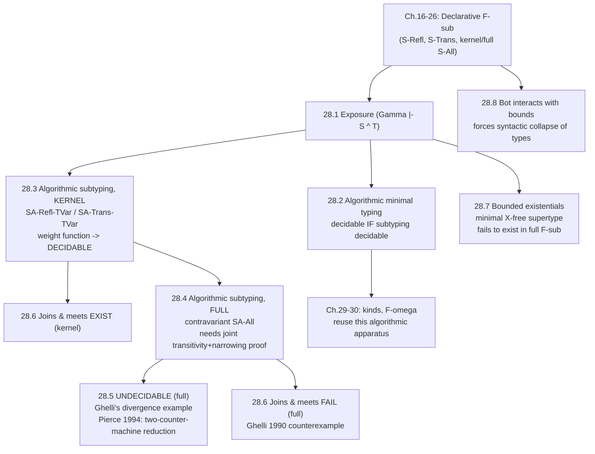

[[book-guidelines|↩ Back to guidelines]]

## Why this chapter has to exist

Chapter 26 gave you $F_{<:}$ — System F plus [[Subtyping|subtyping]] plus bounded quantifiers ($\forall X \mathrel{<:} T_1.\, T_2$, "a type function whose argument must be a subtype of $T_1$"). That chapter proved $F_{<:}$ *sound* (well-typed programs don't get stuck) using purely *declarative* rules — rules written as a specification of which typing/subtyping judgments hold, with no concern for how a machine would check them. Two of those rules are unrunnable as written: `S-Refl` (any type is a subtype of itself — fires everywhere, tells you nothing about which rule to try next) and `S-Trans` (if $S <: Q$ and $Q <: T$ then $S <: T$ — mentions a $Q$ that appears nowhere in the conclusion, so an algorithm reading the rule bottom-up would have to guess it out of thin air).

This is exactly the gap between a spec and an implementation. Chapter 16 already solved it once, for the simply-typed lambda calculus with subtyping: drop `S-Refl` and `S-Trans`, patch the remaining rules to recover what was lost, prove the patched ("algorithmic") system equivalent to the original. Chapter 28 redoes that whole exercise for $F_{<:}$ — and discovers that this time the story doesn't end cleanly. Kernel $F_{<:}$ (the version from Chapter 26 where two quantifiers can only be compared if their bounds are *syntactically identical*) behaves exactly like the simple case: decidable subtyping, decidable typing, and it even keeps joins/meets. Full $F_{<:}$ (the version that lets quantifier bounds vary contravariantly, which is the mathematically "obvious" and more expressive generalization) turns out to have an **undecidable** subtype relation. That's the headline result of the chapter, and it's one of the more startling findings in TAPL: a system that looks like a small, natural tweak to something decidable turns out to be Turing-complete in its type checker.

If you're building a checker or an elaborator, this chapter is a cautionary tale worth internalizing at the level of design instinct, not just as a fact to recall: *"more expressive subtyping rule" and "still decidable" are not free to assume together.* You have to actually prove decidability, and sometimes you can't.

---

## 28.1 Exposure: the missing piece for finding minimal types

**The problem.** Chapter 16's minimal-typing algorithm for simply-typed lambda calculus with subtyping computes, for every subterm, the *smallest* type it can be assigned — and for an application $t_1\, t_2$, it does this by computing the minimal type of $t_1$ and requiring it to *already be* an arrow type. That's fine when there are no type variables. But $F_{<:}$ has them, and now the minimal type of a term can be a variable that merely *behaves like* an arrow type once you look at its bound. Pierce's example:

$$
f = \lambda X \mathrel{<:} \mathtt{Nat}\to\mathtt{Nat}.\ \lambda y{:}X.\ y\ 5
$$

Inside the body, $y$'s minimal type is $X$ — a bare variable, not an arrow type. But $y$ is applied to $5$, and that's well-typed only because $X \mathrel{<:} \mathtt{Nat}\to\mathtt{Nat}$, so $y$ *can* be used as a `Nat -> Nat` function via subsumption (`T-Sub`). The algorithm needs a mechanical way to say "chase this variable's bound until you hit something that isn't a variable anymore, and that's the real minimal arrow type."

**The fix: exposure.** Define $\Gamma \vdash S \Uparrow T$ ("S exposes to T under $\Gamma$") to mean "T is the least non-variable supertype of S." Two rules define it (Figure 28-1):

$$
\frac{T \text{ is not a variable}}{\Gamma \vdash T \Uparrow T} \quad(\textsf{XA-Other})
\qquad\qquad
\frac{X\mathrel{<:}T \in \Gamma \quad \Gamma \vdash T \Uparrow T'}{\Gamma \vdash X \Uparrow T'} \quad(\textsf{XA-Promote})
$$

In words: if a type is already not a variable, it exposes to itself; if it's a variable, look up its bound and recurse. This is a *total function* — every type has exactly one exposure, because promotion strictly decreases the "how many variable-hops until a real shape" count.

**Lemma 28.1.1 (Exposure).** If $\Gamma \vdash S \Uparrow T$, then (1) $\Gamma \vdash S <: T$, and (2) if $\Gamma \vdash S <: U$ for any non-variable $U$, then $\Gamma \vdash T <: U$. In other words, $T$ really is the *smallest* non-variable thing above $S$ — everything else non-variable above $S$ is also above $T$. This is the property that makes exposure usable as a subroutine: whatever real shape you need (arrow, quantifier), exposure finds the tightest bound with that shape.

**[[Existential-Types#What breaks without it|What breaks without it]]:** without exposure, the minimal-typing algorithm simply cannot typecheck `f` above — it would look at $y$'s type `X`, see it isn't syntactically an arrow, and reject a program that the declarative system accepts. Exposure isn't a nicety; it's the difference between an algorithm that's *sound* (accepts only well-typed programs — easy) and one that's also *complete* (accepts every well-typed program — the hard direction, and the one exposure exists for).

**[[Bounded-Quantification#Grounding|Grounding]] (Rust).** This is precisely what a type checker does when it "normalizes" or "widens" a type parameter to its bound before doing shape-based dispatch. If you've ever implemented generics with trait bounds and had to ask "what concrete capability does `T: Fn(i32) -> i32` actually give me here," exposure is the formal version of "follow the bound until you get a shape you can pattern-match on":

```rust
// A minimal exposure procedure over a context of variable->bound bindings.
#[derive(Clone, Debug)]
enum Ty {
    Top,
    Arrow(Box<Ty>, Box<Ty>),
    Var(String),
}

struct Ctx(Vec<(String, Ty)>); // X <: T bindings, most-recent last

impl Ctx {
    fn bound_of(&self, x: &str) -> Option<&Ty> {
        self.0.iter().rev().find(|(name, _)| name == x).map(|(_, t)| t)
    }

    // Gamma |- S ^ T : promote until we hit a non-variable shape.
    fn expose(&self, s: &Ty) -> Ty {
        match s {
            Ty::Var(x) => {
                let bound = self.bound_of(x).expect("unbound type variable");
                self.expose(bound) // XA-Promote
            }
            other => other.clone(), // XA-Other
        }
    }
}
```

**[[ML-Implementation-Techniques#Grounding|Grounding]] (Lean).** Lean's elaborator does the same move under a different name: `whnf` (weak head normal form reduction) unfolds definitions/metavariables until the head is a concrete constructor the elaborator can pattern-match on, before deciding whether something is a function type, a structure, etc. `Γ ⊢ S ⇑ T` is exposure-for-subtyping; `whnf` is exposure-for-reduction. Both exist for the same reason: the surface syntax of a type can hide its usable shape behind one layer of indirection (a variable bound, a `def`), and the algorithm needs a canonical way to peel that layer off before proceeding.

---

## 28.2 Minimal Typing: the algorithm, patched with exposure

Figure 28-2 gives the algorithmic typing relation $\Gamma \vdash_{\!\Uparrow} t : T$ (the little up-arrow on the turnstile distinguishes "algorithmic" judgments from the original declarative ones — useful bookkeeping once both are in play). It's structurally identical to the simply-typed case, with exposure inserted exactly at the two places where a term's "shape" needs to be checked:

$$
\frac{\Gamma \vdash_{\!\Uparrow} t_1 : T_1 \quad \Gamma \vdash_{\!\Uparrow} T_1 \Uparrow T_{11}{\to}T_{12} \quad \Gamma \vdash_{\!\Uparrow} t_2 : T_2 \quad \Gamma \vdash_{\!\Uparrow} T_2 <: T_{11}}{\Gamma \vdash_{\!\Uparrow} t_1\, t_2 : T_{12}} \quad(\textsf{TA-App})
$$

$$
\frac{\Gamma \vdash_{\!\Uparrow} t_1 : T_1 \quad \Gamma \vdash_{\!\Uparrow} T_1 \Uparrow \forall X \mathrel{<:} T_{11}.\,T_{12} \quad \Gamma \vdash_{\!\Uparrow} T_2 <: T_{11}}{\Gamma \vdash_{\!\Uparrow} t_1[T_2] : [X \mapsto T_2]T_{12}} \quad(\textsf{TA-TApp})
$$

"Typecheck the function, expose its type to an arrow (or quantifier), then check the argument matches" — exactly the intuition from §28.1, wired directly into the term-application and type-application rules.

**Theorem 28.2.1 (Minimal typing).** (1) If $\Gamma \vdash_{\!\Uparrow} t : T$ then $\Gamma \vdash t : T$ (the algorithm is *sound*: whatever it outputs really is derivable declaratively). (2) If $\Gamma \vdash t : T$ then $\Gamma \vdash_{\!\Uparrow} t : M$ for some $M$ with $\Gamma \vdash M <: T$ (the algorithm is *complete*, and moreover always finds the *minimal* such type — $M$, not just some supertype of it). The proof is a structural induction on typing derivations, and the interesting cases — `T-App` and `T-TApp` — are exactly where exposure and the inversion lemma for subtyping (26.4.10, "if a non-variable type is a supertype of an arrow/quantifier, it must itself be an arrow/quantifier of matching shape") do the real work.

**Corollary 28.2.2 (Decidability of typing).** Kernel $F_{<:}$ typing is decidable *given a decidable subtype relation*. This is a conditional result — it reduces the typing question to the subtyping question and says "as long as you can solve subtyping, you can solve typing." That conditional is exactly why §28.3–28.5 (does *subtyping* terminate?) is the real crux of the chapter, not a side detail.

---

## 28.3 Subtyping in Kernel $F_{<:}$: making it algorithmic

Same diagnosis as Chapter 16: drop `S-Refl` and `S-Trans`, they're not syntax-directed. But this time dropping them loses real content, because $F_{<:}$ has judgments — like $\Gamma \vdash X <: X$ — that are provable *only* by reflexivity, and judgments like $\Gamma \vdash Z <: W$ (with $\Gamma = W\mathrel{<:}\mathtt{Top}, X\mathrel{<:}W, Y\mathrel{<:}X, Z\mathrel{<:}Y$) that require chaining several bound-lookups via transitivity. The fix is to replace both dropped rules with narrow, syntax-directed substitutes that capture exactly their *essential* uses:

$$
\overline{\Gamma \vdash_{\!\Uparrow} X <: X} \quad(\textsf{SA-Refl-TVar})
\qquad\qquad
\frac{X\mathrel{<:}U \in \Gamma \quad \Gamma \vdash_{\!\Uparrow} U <: T}{\Gamma \vdash_{\!\Uparrow} X <: T} \quad(\textsf{SA-Trans-TVar})
$$

`SA-Refl-TVar` recovers reflexivity, but only where reflexivity is actually needed (on bare variables — for other shapes, structural recursion supplies it). `SA-Trans-TVar` recovers the "look up a variable's bound, then keep going" pattern of transitivity — the *only* place, Pierce shows, where transitivity was doing indispensable work. Everywhere else (arrows, quantifiers), transitivity can be eliminated by rearranging subderivations. The full algorithmic rule set (Figure 28-3) is `SA-Top`, `SA-Refl-TVar`, `SA-Trans-TVar`, `SA-Arrow` (structural, contravariant/covariant as usual), and `SA-All` (kernel form — bounds must match exactly, only the bodies get compared, under the extended context).

Two lemmas earn the right to call this "equivalent to the declarative system":

- **28.3.1 (Reflexivity)**: $\Gamma \vdash_{\!\Uparrow} T <: T$ for every $T$ — provable even though the general reflexivity axiom is gone, by induction on the structure of $T$.
- **28.3.2 (Transitivity)**: if $\Gamma \vdash_{\!\Uparrow} S <: Q$ and $\Gamma \vdash_{\!\Uparrow} Q <: T$ then $\Gamma \vdash_{\!\Uparrow} S <: T$ — provable even though the general transitivity rule is gone, by induction on the *combined size* of the two derivations, case-splitting on their final rules. The delicate case is two `SA-All`s stacked: the quantifier bounds on both sides must be syntactically identical in kernel $F_{<:}$, so once you know $S = \forall X\mathrel{<:}U_1.S_2$ and $T = \forall X\mathrel{<:}U_1.T_2$, you can just recurse on the bodies under the same extended context $\Gamma, X\mathrel{<:}U_1$. **This syntactic-identity requirement is exactly what makes kernel's transitivity proof easy — remember it, because §28.4 is what happens when you remove it.**

Then **Theorem 28.3.3 (Soundness and completeness)**: $\Gamma \vdash S <: T$ iff $\Gamma \vdash_{\!\Uparrow} S <: T$, riding on top of 28.3.1 and 28.3.2.

**Termination, made rigorous with a weight function.** It's not enough that the algorithmic rules look "smaller premises, bigger conclusion" — you have to prove it. Definition 28.3.4 assigns every type a natural-number weight relative to a context:

$$
\begin{aligned}
\text{weight}_\Gamma(X) &= \text{weight}_{\Gamma_1}(U) + 1 &&\text{if } \Gamma = \Gamma_1, X\mathrel{<:}U, \Gamma_2\\
\text{weight}_\Gamma(\mathtt{Top}) &= 1\\
\text{weight}_\Gamma(T_1\to T_2) &= \text{weight}_\Gamma(T_1) + \text{weight}_\Gamma(T_2) + 1\\
\text{weight}_\Gamma(\forall X\mathrel{<:}T_1.T_2) &= \text{weight}_{\Gamma, X\mathrel{<:}T_1}(T_2) + 1
\end{aligned}
$$

A variable's weight is defined in terms of its *bound's* weight, plus one — so chasing a chain of bounds strictly decreases weight, and every algorithmic rule's conclusion has strictly greater weight than its premises (Theorem 28.3.5). That gives **Corollary 28.3.6: subtyping in kernel $F_{<:}$ is decidable.**

**Grounding (Rust).** The weight function is precisely a well-founded termination measure, the kind you'd hand to Rust's borrow-and-recursion checker (informally) or write down as a proof obligation for a `fn subtype(ctx, s, t) -> bool` that must not loop forever:

```rust
fn weight(ctx: &Ctx, t: &Ty) -> u32 {
    match t {
        Ty::Top => 1,
        Ty::Arrow(t1, t2) => weight(ctx, t1) + weight(ctx, t2) + 1,
        Ty::Var(x) => weight(ctx, ctx.bound_of(x).unwrap()) + 1,
        // Forall case would extend ctx with X<:T1 before recursing into T2.
    }
}

// SA-Trans-TVar strictly decreases weight(X) to weight(bound), so a
// recursive subtype-checker that always looks up bounds via this rule
// is guaranteed to terminate — this is *why* it's safe to write it as
// ordinary (non-fuel-limited) recursion in the kernel system.
fn subtype(ctx: &Ctx, s: &Ty, t: &Ty) -> bool {
    match (s, t) {
        (_, Ty::Top) => true,                              // SA-Top
        (Ty::Var(x), Ty::Var(y)) if x == y => true,        // SA-Refl-TVar
        (Ty::Var(x), _) => {
            let u = ctx.bound_of(x).unwrap().clone();
            subtype(ctx, &u, t)                             // SA-Trans-TVar
        }
        (Ty::Arrow(s1, s2), Ty::Arrow(t1, t2)) =>
            subtype(ctx, t1, s1) && subtype(ctx, s2, t2),   // SA-Arrow
        _ => false,
    }
}
```

**Grounding (Lean).** This is the well-founded-recursion story Lean makes you confront explicitly every time you write a recursive function whose termination isn't structural on the syntax alone — you supply a `termination_by` measure and Lean's kernel demands a decreasing proof, exactly the role `weight` plays here by hand. It's also a nice illustration of why Lean's own definitional-equality checker (`isDefEq`) has to be so careful about which reductions it's allowed to perform eagerly versus lazily: an unprincipled "unfold whatever you can" strategy is precisely the failure mode kernel $F_{<:}$'s weight function is designed to rule out.

---

## 28.4 Subtyping in Full $F_{<:}$: transitivity gets hard

Full $F_{<:}$'s algorithmic subtyping (Figure 28-4) changes exactly one rule — `SA-All` becomes contravariant in the bound:

$$
\frac{\Gamma \vdash_{\!\Uparrow} T_1 <: S_1 \quad \Gamma, X\mathrel{<:}T_1 \vdash_{\!\Uparrow} S_2 <: T_2}{\Gamma \vdash_{\!\Uparrow} \forall X\mathrel{<:}S_1.S_2 <: \forall X\mathrel{<:}T_1.T_2} \quad(\textsf{SA-All, full})
$$

Everything else is unchanged. This one-rule change is exactly what breaks the transitivity proof. Stack two of these rules:

$$
\frac{\Gamma \vdash Q_1<:S_1 \quad \Gamma,X{\mathrel{<:}}Q_1 \vdash S_2<:Q_2}{\Gamma \vdash \forall X{\mathrel{<:}}S_1.S_2 <: \forall X{\mathrel{<:}}Q_1.Q_2}
\qquad
\frac{\Gamma \vdash T_1<:Q_1 \quad \Gamma,X{\mathrel{<:}}T_1 \vdash Q_2<:T_2}{\Gamma \vdash \forall X{\mathrel{<:}}Q_1.Q_2 <: \forall X{\mathrel{<:}}T_1.T_2}
$$

To combine these into $\Gamma \vdash \forall X\mathrel{<:}S_1.S_2 <: \forall X\mathrel{<:}T_1.T_2$, the bound subderivations combine fine by the induction hypothesis (they don't mention $X$). But the two *body* subderivations live in **different contexts** — one has $X\mathrel{<:}Q_1$, the other $X\mathrel{<:}T_1$ — so the induction hypothesis for transitivity (which needs both derivations in the *same* context) simply doesn't apply. This is the direct cost of allowing the bound to vary: kernel's transitivity proof relied on the syntactic-identity of bounds precisely to avoid this mismatch.

**The fix: narrowing, and proving it jointly with transitivity.** Narrowing (Lemma 26.4.5) says a subtyping judgment stays valid if you replace a context bound by one of its *subtypes* — so you can narrow the $\Gamma, X\mathrel{<:}Q_1 \vdash S_2 <: Q_2$ subderivation down to $\Gamma, X\mathrel{<:}T_1 \vdash S_2 <: Q_2$ (since $T_1 <: Q_1$), putting both bodies in the same context. But naive narrowing enlarges the derivation — every use of `S-TVar` on the narrowed variable gets a fresh transitivity step spliced in — and transitivity is exactly the property under construction. Circular, unless you're careful about *what* decreases.

The resolution (Lemma 28.4.2) is to prove **transitivity and narrowing simultaneously**, by induction on the size of the *intermediate type $Q$*:

1. If $\Gamma \vdash_{\!\Uparrow} S <: Q$ and $\Gamma \vdash_{\!\Uparrow} Q <: T$, then $\Gamma \vdash_{\!\Uparrow} S <: T$.
2. If $\Gamma, X\mathrel{<:}Q, \Delta \vdash_{\!\Uparrow} M <: N$ and $\Gamma \vdash_{\!\Uparrow} P <: Q$, then $\Gamma, X\mathrel{<:}P, \Delta \vdash_{\!\Uparrow} M <: N$.

At each induction step, part (2) for a given $Q$ is allowed to assume part (1) already holds *for that same $Q$*; part (1) is allowed to use part (2) only for *strictly smaller* $Q$'s. This lets the `SA-All` case of transitivity call narrowing (part 2, on the smaller bound $Q_1$) to align the two contexts, then finish with transitivity (part 1, on the now-smaller body type $Q_2$). It's a genuinely subtle induction — the kind of proof where getting the induction metric wrong makes the whole argument circular — and it's the price full $F_{<:}$ pays for its more permissive `SA-All`.

**What this buys you, mechanically:** soundness/completeness for full $F_{<:}$'s algorithmic subtyping (same statement as Theorem 28.3.3, now resting on 28.4.2 instead of 28.3.2). What it does **not** buy you is termination — nothing in §28.4 gives a weight function, because none exists.

---

## 28.5 Undecidability of Full $F_{<:}$: the headline result

Soundness and completeness say the algorithmic and declarative relations agree on *which statements are provable*. They say nothing about whether the algorithm *halts* when a statement is *not* provable. For full $F_{<:}$, it doesn't always.

**Ghelli's diverging example.** Define the abbreviation $\neg S \stackrel{\text{def}}{=} \forall X\mathrel{<:}S.X$ — a syntactic device (Pierce is explicit: "the reader is cautioned not to look for semantic intuitions" — $\neg$ here is not logical negation, it's a gadget that flips subtyping direction). Its key property:

$$
\Gamma \vdash \neg S <: \neg T \iff \Gamma \vdash T <: S \tag{Fact 28.5.2}
$$

Now let $T = \forall X\mathrel{<:}\mathtt{Top}.\,\neg(\forall Y\mathrel{<:}X.\,\neg Y)$ and try to build a derivation, bottom-to-top, for $X_0\mathrel{<:}T \vdash_{\!\Uparrow} X_0 <: \forall X_1\mathrel{<:}X_0.\,\neg X_1$:

$$
\begin{aligned}
X_0{\mathrel{<:}}T &\vdash_{\!\Uparrow} X_0 &<:&\ \forall X_1{\mathrel{<:}}X_0.\neg X_1\\
X_0{\mathrel{<:}}T &\vdash_{\!\Uparrow} \forall X_1{\mathrel{<:}}\mathtt{Top}.\neg(\forall X_2{\mathrel{<:}}X_1.\neg X_2) &<:&\ \forall X_1{\mathrel{<:}}X_0.\neg X_1\\
X_0{\mathrel{<:}}T, X_1{\mathrel{<:}}X_0 &\vdash_{\!\Uparrow} \neg(\forall X_2{\mathrel{<:}}X_1.\neg X_2) &<:&\ \neg X_1\\
X_0{\mathrel{<:}}T, X_1{\mathrel{<:}}X_0 &\vdash_{\!\Uparrow} X_1 &<:&\ \forall X_2{\mathrel{<:}}X_1.\neg X_2\\
&\vdots
\end{aligned}
$$

Each subgoal has the *same shape* as the last but a strictly longer context. The crucial "re-bounding" happens between lines 2 and 3: $X_1$'s bound changes from $\mathtt{Top}$ (line 2) to $X_0$ (line 3), because the whole left-hand side of line 2 is $X_0$'s own upper bound — the algorithm walks in a circle that gets longer every lap, never reaching a base case. Weight-based termination is exactly what this destroys: there's no measure that decreases, because the algorithm keeps manufacturing bigger and bigger *contexts* to satisfy premises, and full `SA-All`'s contravariant bound-matching gives it room to do that.

**It's not just this one algorithm.** Pierce (1994) proves something stronger: *no* sound-and-complete algorithm for full $F_{<:}$'s declarative subtype relation terminates on all inputs — undecidability is a property of the relation itself, not an artifact of a particular (badly designed) algorithm. The proof sketch reduces the halting problem for **two-counter machines** to subtyping statements:

- Definition 28.5.3 sets up *positive* and *negative* occurrences of a type inside another (the same polarity idea behind Curry-Howard reading $S\to T$ as $\neg S \lor T$: contravariant positions are "negative").
- Fact 28.5.4 exploits polarity to justify substituting a type variable's instantiation directly into both sides of a subtyping statement when the polarities line up right.
- Putting a `Top`-bounded triple of quantifiers together with nested $\neg$'s encodes a **two-register machine**: two of the quantified variables hold "register contents" ($P$, $Q$), and a third position holds an "instruction" (a permutation pattern on the bound variable order) that gets *consumed* by one step of the algorithmic derivation and produces a fresh subgoal with the registers swapped (or otherwise transformed) and the next instruction exposed. Theorem 28.5.5 (Pierce, 1994): for every two-counter machine $M$, there's a subtyping statement $S(M)$ derivable in full $F_{<:}$ iff $M$ halts. Since two-counter-machine halting is undecidable, so is full $F_{<:}$ subtyping.

**A subtlety worth sitting with.** Undecidability of the *relation* does not make the sound-and-complete *semi-algorithm* from §28.4 wrong. If $\Gamma \vdash S <: T$ is declaratively true, the algorithm terminates and says yes — always. If it's false, the algorithm either says no (detects an outright clash, like `Top <: S->T`) or *diverges* — and there is no way, in general, to tell "this will never terminate" apart from "just keep waiting" from the outside. This is the classic shape of a semi-decision procedure, the same shape as the halting problem itself: recognizing "yes" is easy, recognizing "no" is not always possible in finite time.

**Practical epilogue (Pierce editorializes here, worth keeping).** The chapter is honest that undecidability, in practice, turns out to be a survivable defect: triggering divergence requires a goal with three specific, unusual structural properties that real programs essentially never produce by accident, and plenty of shipped type systems (ML/Haskell's principal-type inference is expensive; C++ template resolution and $\lambda$Prolog are themselves undecidable) live with worse. Pierce flags the **loss of joins and meets** (next section) as the practically bigger cost of moving to full $F_{<:}$ — a nice reminder that "undecidable" and "unusable" are not synonyms, and that the metatheoretic property engineers should worry about most isn't always the flashiest one.

---

## 28.6 Joins and Meets: kernel keeps them, full loses them

Chapter 16 established why joins matter operationally: `if`-expressions with branches of different (but related) types need *some* common type to assign to the whole expression, and the *smallest* common supertype (the join, $S \lor T$) is the tightest, most useful choice a compiler can make without extra annotation. Kernel $F_{<:}$ has joins for every pair of types, and meets ($S \land T$, the largest common *subtype*) whenever one exists at all — Figure 28-5 gives a simultaneous, structurally-recursive algorithm for both (first-matching-clause semantics: if $S <: T$, the join is just $T$; if one side is a variable, promote it via its bound and recurse; if both are arrows, join the codomains and *meet* the domains contravariantly; if both are quantifiers with the same kernel-style bound, recurse into the bodies under the extended context; otherwise the join defaults to `Top` and the meet fails). Termination again rides on the weight function from §28.3.4 — total weight strictly decreases on every recursive call.

**Propositions 28.6.1–28.6.2** verify the algorithm actually computes joins/meets in the mathematical sense: the computed $J$ is an upper bound of both inputs and is *below every other* upper bound (dually for meets and lower bounds). The proofs are inductions on algorithmic subtyping derivations and lean on the same case-by-case structure as the transitivity proof — SA-Top, SA-Refl-TVar, SA-Trans-TVar, then the structural cases for arrows and quantifiers.

**Full $F_{<:}$ loses this.** Exercise 28.6.3 (attributed to Ghelli, 1990) is the standard counterexample: with $S = \forall X\mathrel{<:}Y{\to}Z.\,Y{\to}Z$, $T = \forall X\mathrel{<:}Y_0{\to}Z_0.\,Y_0{\to}Z_0$, and context $\Gamma = Y\mathrel{<:}\mathtt{Top}, Z\mathrel{<:}\mathtt{Top}, Y_0\mathrel{<:}Y, Z_0\mathrel{<:}Z$, there is no single meet of $S$ and $T$ — the full `SA-All` rule's freedom to vary the bound means multiple incomparable common subtypes can exist with no unique "biggest" one among them. Per Pierce's own editorial aside above, this — not the undecidability — is the defect implementers actually feel: a language that can't compute a principal join for an `if`-branch has to either reject the program, demand an annotation, or make an arbitrary (and non-principal) choice.

**Grounding (Rust).** This is the same shape of problem Rust's trait-coherence and lifetime-variance machinery is built to sidestep: Rust deliberately does *not* try to compute "the join of two types" for branch unification the way $F_{<:}$'s type checker does — `if`/`match` arms in Rust must literally coincide (up to trivial coercions), precisely because a general subtyping lattice rich enough to need joins is exactly the kind of system that can lose them, as this section demonstrates.

---

## 28.7 Bounded Existentials: a targeted complication

[[Existential-Types|Existential types]] ($\{\exists X\mathrel{<:}T_{11}, T_{12}\}$, "some hidden type satisfying this bound, packaged with a value of this type") have an elimination rule where the bound variable $X$ is in scope for typechecking the body $t_2$ of a `let {X,x} = t1 in t2`, but **must not** appear in the result type $T_2$ — because $X$ goes out of scope at the `in`. Declaratively this is fine: subsumption lets you promote $t_2$'s type to *any* $X$-free supertype before applying `T-Unpack`. Algorithmically it's a problem: what if the *minimal* type of $t_2$ happens to mention $X$? Example: `t = let {X,x} = p in x` where `p : {∃X, Nat->X}`. The minimal type of the body `x` is `Nat->X` — it mentions the bound variable — yet declaratively `x` can also be typed `Nat->Top` or `Top`, both $X$-free, both legal.

A complete algorithm can't just fail here. It needs to find the **minimal $X$-free supertype** of the offending type — written $R_{X,\Gamma}(T)$ — and Exercise 28.7.1 (solution due to Ghelli and Pierce, 1998) confirms such a minimal element always exists in kernel $F_{<:}$. This slots into the algorithmic unpacking rule as one more exposure-like widening step before returning. In full $F_{<:}$, Ghelli and Pierce (1998) exhibit a type/context/variable triple where the set of $X$-free supertypes has **no minimal element at all** — so [[The-Simply-Typed-Lambda-Calculus#The typing relation|the typing relation]] for full $F_{<:}$ with bounded existentials doesn't even have minimal types in the sense §28.2 relied on. It's the same underlying phenomenon as the lost joins/meets: full $F_{<:}$'s permissiveness keeps buying expressiveness at the cost of exactly the finiteness/uniqueness properties an algorithm needs to hold onto.

---

## 28.8 Bounded Quantification and the Bottom Type

Adding a minimal type $\mathtt{Bot}$ (§15.4, subtype of everything) interacts with [[Bounded-Quantification|bounded quantification]] in a way that's easy to miss: inside $\forall X\mathrel{<:}\mathtt{Bot}.\,T$, the variable $X$ is *forced* to be a synonym for $\mathtt{Bot}$ — $X <: \mathtt{Bot}$ by the quantifier's own bound, and $\mathtt{Bot} <: X$ by rule `S-Bot` (Bot is below everything, including $X$) — so $X$ and $\mathtt{Bot}$ are mutually subtypes, hence interchangeable under the subtype relation even though they're syntactically distinct. Consequences ripple outward: $\forall X\mathrel{<:}\mathtt{Bot}.\,X{\to}X$ and $\forall X\mathrel{<:}\mathtt{Bot}.\,\mathtt{Bot}{\to}\mathtt{Bot}$ become equivalent types despite looking nothing alike, and if a context binds $X\mathrel{<:}\mathtt{Bot}$ and $Y\mathrel{<:}\mathtt{Bot}$, then $X{\to}Y$ and $Y{\to}X$ become equivalent too — without either type ever mentioning `Bot` in its surface syntax. Pierce notes the essential metatheoretic properties of kernel $F_{<:}$ survive this (details deferred to Pierce, 1997a) but flags it as a genuine wrinkle: subtyping's syntactic notion of "equivalence" (mutual subtyping) can silently collapse types that look structurally unrelated, purely as a side effect of a `Bot` bound propagating through a chain of variables. Any implementation that assumes "syntactically different quantified types are semantically different" needs to know this is false in the presence of `Bot`.

---

## Where this leads



This chapter is the load-bearing wall under everything TAPL later calls "an implementation" of a subtyping-with-polymorphism language: Chapters 29–30 ($F^\omega$, kinding) and the ML-implementation chapter (27) both assume you already know how to turn a declarative subtype relation into a terminating checker, and both inherit the kernel-vs-full cautionary tale as a design decision they have to make explicitly rather than get for free.

For the standing projects this vault is tracking: **this is the single most direct precedent in the book for "decidability is not automatic, and where it fails is exactly where naive elaboration would loop."** A Rust verifier's subtype/entailment checker is, structurally, exactly the algorithmic relation of §28.3/28.4 — the weight-function termination argument (§28.3.4) is the template for *any* termination proof you'll need to write for your own checker's recursive descent through bounds and contexts, and Ghelli's divergence example (§28.5) is the template for what a termination bug in that checker will *look like at runtime*: not a crash, but silent, ever-growing context accumulation. For the elaborator/unification project, exposure (§28.1) is the closest thing in this book to a formal spec of "widen this metavariable/type-variable until you can pattern-match on its head" — precisely the move an implementation of `whnf`-driven unification performs before attempting to unify two type-formers, and the narrowing-plus-transitivity joint induction (§28.4.2) is worth remembering as the canonical example of a metatheoretic proof that looks circular until you find the right decreasing measure — a skill that transfers directly to proving termination/soundness of a custom unifier.
