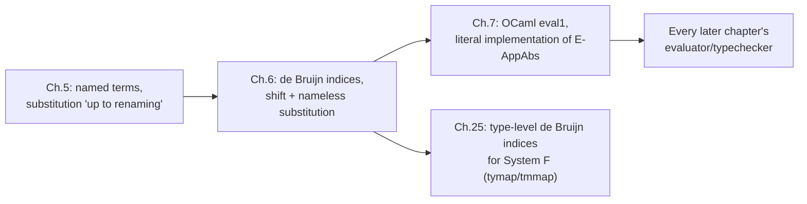

[[book-guidelines|↩ Back to guidelines]]

## What breaks if you actually try to implement Chapter 5

Chapter 5 got away with something. Every definition of substitution, every statement of a beta-reduction rule, was quietly qualified with "we work up to renaming of bound variables" — meaning if two terms differ only in the spelling of a bound variable ($\lambda x. x$ versus $\lambda y. y$), they're treated as *the same term*. That convention is completely reasonable for doing proofs on paper. It is not something you can leave implicit in code.

Concretely, three things go wrong the moment you try to write an interpreter that represents terms symbolically, the way the book did in Chapter 5:

1. **Alpha-equivalence has to become an actual equality check**, not a background assumption. If your term representation is `Var String`-based, then $\lambda x.x$ and $\lambda y.y$ are *different values* in memory (different strings), and every piece of code that compares terms, memoizes them, or pattern-matches on their shape now has to first normalize away bound-variable spelling — or worse, silently gets this wrong.
2. **Substitution has to actively avoid capture**, and doing that correctly is fiddly. The textbook example: substituting $s$ for $x$ in $t = \lambda y. x$ is fine if $y$ doesn't occur free in $s$, but if $s = y$ itself (i.e., you're computing $[x \mapsto y](\lambda y. x)$), naively substituting gives $\lambda y. y$ — the free occurrence of $y$ in $s$ has been *captured* by the binder it was substituted underneath, becoming bound when it should have stayed free. The usual fix is to rename the bound variable on the fly during substitution, which means every substitution call is secretly also running a "pick a fresh name" subroutine.
3. **The alternative "keep all bound names globally distinct" discipline (the Barendregt convention)** doesn't survive substitution either: substituting a term $s$ into two different places duplicates $s$'s bound variables, so the invariant has to be restored by a renaming pass after *every* reduction step. You've traded "capture bugs" for "an extra [[Normalization|normalization]] pass you must remember to run everywhere."

Pierce's diagnosis is sharp: bugs in named-variable implementations tend to fail *quietly* — a captured variable produces a term that still typechecks, still evaluates, and just silently computes the wrong thing, sometimes not surfacing for months. He wants a representation that instead fails **loudly** when the plumbing is wrong.

De Bruijn's answer, introduced in this chapter (1972): **delete the names entirely.** A variable occurrence doesn't need to carry a name if it can instead point directly, structurally, at its binder. Do that, and alpha-equivalent terms become *literally* the same term (not just equivalent under some side convention) — there is no name left to differ. Capture becomes impossible to *accidentally* introduce because there's no name available to accidentally reuse. The tradeoff is that you now owe the reader (and the implementer) a precise renumbering discipline whenever a term moves in or out of a binder's scope — which is exactly what §6.2 (shifting and substitution) exists to nail down.

## De Bruijn indices: variables as "distance to binder"

**The idea (§6.1).** Replace a named variable occurrence with a natural number $k$ meaning "the variable bound by the $k$-th enclosing $\lambda$, counting outward starting from 0." So:

$$
\lambda x.\, x \quad\rightsquigarrow\quad \lambda.\, 0
$$
$$
\lambda x.\lambda y.\, x\,(y\,x) \quad\rightsquigarrow\quad \lambda.\lambda.\, 1\,(0\,1)
$$

In the second example, the outer bound variable $x$ becomes $1$ everywhere it occurs (one $\lambda$ between the occurrence and its binder), and the inner bound variable $y$ becomes $0$ (zero $\lambda$s between). These numeric variables are the **de Bruijn indices**; compiler writers call the same idea "static distance." Note Pierce's own footnote: the numbers count $\lambda$-binders from the point of use *outward*, i.e., "how many binders do I have to walk past to reach mine" — this is the detail that makes shifting (below) work at all.

**[[Bounded-Quantification#Grounding|Grounding]] it in Rust.** The named representation is the obvious enum:

```rust
enum NamedTerm {
    Var(String),
    Abs(String, Box<NamedTerm>),
    App(Box<NamedTerm>, Box<NamedTerm>),
}
```

The nameless representation drops the `String` from `Var` and from `Abs` entirely — a binder no longer needs a name, because nothing refers to it by name anymore:

```rust
enum Term {
    Var(usize),               // de Bruijn index
    Abs(Box<Term>),           // no name field at all
    App(Box<Term>, Box<Term>),
}
```

`Var(1)`, `Var(0)` above are exactly the indices in $\lambda.\lambda.\,1\,(0\,1)$. This is a genuinely smaller, dumber data structure than the named one — and that's the point: there is less state to get inconsistent.

**Well-formedness as a counting invariant (§6.1.2).** The book is careful to define the *set* of nameless terms not as one flat set but as a family $\{T_0, T_1, T_2, \dots\}$, where $T_n$ is "terms with at most $n$ free variables, numbered $0$ through $n-1$":

$$
\begin{aligned}
&k \in T_n \quad \text{whenever } 0 \le k < n \\
&t_1 \in T_n,\ n>0 \implies \lambda.\,t_1 \in T_{n-1} \\
&t_1, t_2 \in T_n \implies (t_1\,t_2) \in T_n
\end{aligned}
$$

This is exactly Chapter 2's inductive-definition machinery ([[Inductive-Definitions-and-Proof-Techniques|see that article]]) applied to a family indexed by a number instead of a single set. Why bother? Because it turns "is this a legal free variable index" into a checkable arithmetic condition — $k$ must satisfy $0 \le k < n$ — rather than "is this name declared somewhere," a question that under a purely structural representation you could otherwise get wrong silently. **This is the load-bearing idea for anyone building a checker**: a nameless representation makes *context length* itself the well-formedness certificate for variable references, the same role a symbol table's domain plays for named variables, except now it's just an integer you can bounds-check.

```rust
// A minimal well-formedness check mirroring T_n membership:
// `depth` = number of enclosing binders passed so far (the length
// of the current naming context); a free variable's index must be
// less than depth + (number of names in the ambient context).
fn is_well_formed(t: &Term, depth: usize, free_ctx_len: usize) -> bool {
    match t {
        Term::Var(k) => *k < depth + free_ctx_len,
        Term::Abs(t1) => is_well_formed(t1, depth + 1, free_ctx_len),
        Term::App(t1, t2) =>
            is_well_formed(t1, depth, free_ctx_len) &&
            is_well_formed(t2, depth, free_ctx_len),
    }
}
```

**Naming contexts for free variables (§6.1, 6.1.3).** A closed term needs no external information to number its variables — every occurrence has a binder inside the term. But an *open* term (one with free variables) needs an assignment of indices to those free names, fixed once and agreed on everywhere: a **naming context** $\Gamma$. Pierce's example:

$$
\Gamma = x{:}4,\ y{:}3,\ z{:}2,\ a{:}1,\ b{:}0
$$

Under this $\Gamma$, $x\,(y\,z)$ becomes $4\,(3\,2)$, and $\lambda w.\, y\, w$ becomes $\lambda.\,4\,0$ (the free $y=3$ shifts to $4$ once you're inside one more binder — more on why below). Written compactly as a sequence $\Gamma = x_n, x_{n-1}, \dots, x_0$, the rightmost name gets index $0$ — matching the "count binders right-to-left, from point of use outward" convention. This is precisely a de Bruijn-index version of what a compiler's symbol table / typing context does for named variables — same job (resolve a name to its binding site), numeric encoding instead of a hash map lookup.

Pierce also proves a fact worth internalizing directly: **two named terms are alpha-equivalent if and only if they have the same de Bruijn representation.** Alpha-equivalence, which under the named representation was an extra relation you had to define, close under, and quotient by, has simply *disappeared* as a separate concept — nameless terms that are syntactically identical are, by construction, exactly the terms that used to be "the same up to renaming." A term equality check (`==` on the `Term` enum, or `deriving Eq`) now *is* an alpha-equivalence check, for free.

## Shifting: renumbering indices when a term crosses a binder boundary

Deleting names bought you free alpha-equivalence, but it didn't remove the underlying arithmetic problem — it moved it. Names never needed renumbering because a name is invariant no matter how many binders you nest it under. An index is *not* invariant: $x$ at index $3$ under $\Gamma$ above becomes index $4$ the moment you wrap the whole term in one more $\lambda$, because there's now one more enclosing binder between the occurrence and its home. **Shifting** is the operation that performs this renumbering correctly.

**Why you need it, concretely (§6.2).** Substitution $[j \mapsto s]t$ eventually recurses under a binder: computing $[j \mapsto s](\lambda.\,t_1)$ requires substituting into $t_1$, which now lives one binder deeper than $t$ did. Any free variable in $s$ that refers to something in the *outer* context must have its index bumped by one to keep pointing at the same thing — the naming context it's being dropped into is one variable longer. But you must **not** bump indices in $s$ that refer to binders *inside* $s$ itself — those are already correctly numbered relative to their own local binders and moving them would break them. Pierce's example: if $s = 2\,(\lambda.\,0)$ (i.e., $s = z\,(\lambda w.\,w)$, with $z$ at index $2$ in the outer context), shifting must touch the free $2$ but leave the bound $0$ alone.

This is exactly why shifting carries a **cutoff** $c$: indices below $c$ are "local" (bound within the piece of term already traversed) and are left alone; indices at or above $c$ are "free relative to this subterm" and get shifted. The cutoff starts at $0$ and increments by one every time the shift recursion walks under a $\lambda$.

$$
\uparrow^d_c(k) =
\begin{cases}
k & \text{if } k < c \\
k + d & \text{if } k \ge c
\end{cases}
\qquad
\uparrow^d_c(\lambda.\,t_1) = \lambda.\, \uparrow^d_{c+1}(t_1)
\qquad
\uparrow^d_c(t_1\,t_2) = \uparrow^d_c(t_1)\ \uparrow^d_c(t_2)
$$

$\uparrow^d(t)$ abbreviates $\uparrow^d_0(t)$ — shift everything by $d$, cutoff $0$, used when you don't yet know how deep you are (e.g., at the top level of a substitution call).

```rust
fn shift(d: i64, c: usize, t: &Term) -> Term {
    match t {
        Term::Var(k) => {
            if *k < c { Term::Var(*k) }
            else { Term::Var((*k as i64 + d) as usize) }
        }
        Term::Abs(t1) => Term::Abs(Box::new(shift(d, c + 1, t1))),
        Term::App(t1, t2) => Term::App(
            Box::new(shift(d, c, t1)),
            Box::new(shift(d, c, t2)),
        ),
    }
}
```

Note `d` is signed (`i64`) even though indices are unsigned: §6.3 uses a *negative* shift ($\uparrow^{-1}$) to renumber downward after a binder is consumed by beta-reduction — the well-formedness lemma (Exercise 6.2.3: if $t$ is an $n$-term, $\uparrow^d_c(t)$ is an $(n{+}d)$-term) is exactly what guarantees this negative shift can never actually produce a negative (ill-formed) index in a well-typed evaluation sequence, which is worth sitting with: shifting is not just bookkeeping, it's a renumbering whose correctness is itself a small theorem.

## Substitution on nameless terms

With shifting in hand, substitution $[j \mapsto s]t$ — "replace the variable at index $j$ with the term $s$, everywhere in $t$" — is almost the naive structural recursion you'd expect, plus exactly one shift call:

$$
[j \mapsto s]k =
\begin{cases}
s & \text{if } k = j \\
k & \text{otherwise}
\end{cases}
\qquad
[j \mapsto s](\lambda.\,t_1) = \lambda.\, [\,j{+}1 \mapsto \uparrow^1(s)\,]\,t_1
\qquad
[j \mapsto s](t_1\,t_2) = [j\mapsto s]t_1\ [j \mapsto s]t_2
$$

The `Abs` case is where the whole chapter's machinery earns its keep, and it's worth reading both parts separately:

- **$j{+}1$** — the variable we're now hunting for, one level under the binder we just entered, has shifted up by one (same reasoning as in the naming-context example above: crossing one more binder bumps every outer index by one).
- **$\uparrow^1(s)$** — the term we're substituting *in* must itself be shifted up by one before it's placed under this new binder, for exactly the free-variable-renumbering reason from the shifting section: $s$ is about to be dropped one binder deeper than the context it was built in, so any free variable inside $s$ referring to that outer context needs to track the change.

Forget either half and you get a subtly wrong substitution that will typecheck, evaluate, and produce garbage — precisely the "quiet failure" mode this whole nameless scheme exists to convert into a loud one (miss the shift, and you'll usually get an out-of-range or wrong-target index that blows up immediately instead of silently misbehaving).

```rust
fn subst(j: usize, s: &Term, t: &Term) -> Term {
    match t {
        Term::Var(k) => {
            if *k == j { s.clone() } else { Term::Var(*k) }
        }
        Term::Abs(t1) => {
            let shifted_s = shift(1, 0, s);
            Term::Abs(Box::new(subst(j + 1, &shifted_s, t1)))
        }
        Term::App(t1, t2) => Term::App(
            Box::new(subst(j, s, t1)),
            Box::new(subst(j, s, t2)),
        ),
    }
}
```

Compare this to what "avoid capture during substitution" required in the named representation: a fresh-name generator, an occurs-check against $s$'s free variables, and a rename-then-recurse case for `Abs`. Here the `Abs` case is *unconditional* — one shift, no case analysis on whether some name happens to collide with another. That's the entire payoff of the chapter in one side-by-side comparison.

## Evaluation: beta-reduction over nameless terms

The only evaluation rule from Chapter 5 that mentions variable names at all is beta-reduction, so it's the only one that needs restating (§6.3):

$$
(\lambda.\,t_{12})\,v_2 \longrightarrow \uparrow^{-1}\big([\,0 \mapsto \uparrow^{1}(v_2)\,]\,t_{12}\big) \qquad \text{(E-AppAbs)}
$$

Read outside-in:

1. $\uparrow^1(v_2)$ — shift the argument up by one before substituting it under the binder $\lambda.\,t_{12}$, for the same reason as the `Abs` case of substitution above: $t_{12}$'s context is one binder deeper than $v_2$'s.
2. $[\,0 \mapsto \uparrow^1(v_2)\,]t_{12}$ — substitute the (now-shifted) argument for index $0$, the innermost bound variable, exactly the one $\lambda.$ used to bind.
3. $\uparrow^{-1}(\cdots)$ — the outer $\lambda$ is now *gone* (consumed by the reduction), so the context is one variable *shorter* than it was; every remaining free variable that used to refer past that binder needs its index decremented by one to keep pointing at the same thing. This is the negative shift flagged above.

Pierce's own worked example makes the "not 1, but 0" trap vivid:

$$
(\lambda.\,1\,0\,2)\,(\lambda.\,0) \longrightarrow 0\,(\lambda.\,0)\,1 \qquad \text{(not } 1\,(\lambda.\,0)\,2\text{)}
$$

The free variable at index $2$ in the body becomes $1$ in the result — it doesn't keep its old number, because the binder count around it just dropped. Get the direction of this final shift wrong (or omit it) and every subsequent step in a chain of reductions accumulates off-by-one errors that are exactly the kind of "fails months later" bug the named representation was prone to — except now the fix is one arithmetic rule, checkable and easy to unit-test in isolation, rather than a scattered discipline of "remember to pick fresh names everywhere."

```rust
// One step of call-by-value beta-reduction, nameless form.
fn step_app_abs(t12: &Term, v2: &Term) -> Term {
    let v2_shifted = shift(1, 0, v2);
    let substituted = subst(0, &v2_shifted, t12);
    shift(-1, 0, &substituted)
}
```

## Naming and printing: the inverse direction

The chapter closes by flagging (via exercises 6.1.5 and its neighbors) that nameless terms need two conversion functions to be usable at the boundary of a real system: `removenames`$_\Gamma$, converting a parsed, named term into nameless form under a context $\Gamma$, and `restorenames`$_\Gamma$, converting a nameless term back into a printable named one (choosing fresh, non-colliding names for each binder as it goes). These are meant to be genuine inverses — `removenames` after `restorenames` is the identity on nameless terms, and the reverse holds *up to alpha-renaming* on named terms (which is exactly the equivalence nameless terms collapse in the first place).

The architectural point: **nameless indices are an internal representation, not a surface syntax.** A parser produces named terms (because that's what a human writes and reads); an evaluator/typechecker operates on nameless terms internally (because that's what's safe and cheap to manipulate); a pretty-printer converts back to named form at the boundary (because that's what a human wants to read back). This parse → nameless → \[typecheck / evaluate\] → restore-names → print pipeline is exactly the shape Chapter 7's OCaml implementation follows, and it's the shape essentially every real compiler or proof-assistant frontend follows too.

## Where this leads

Structurally: this chapter's shift/subst pair is a direct dependency of every subsequent evaluation-rule restatement in the book — Chapter 7's `eval1` implements E-AppAbs literally as written above, and the same shift/subst pattern reappears, generalized to a `tmmap`-style generic traversal, for every later extension (types with type variables in Chapter 25's System F implementation, for instance, needs the identical shifting discipline applied to *type*-level de Bruijn indices).



This is close to the most directly "you will write this exact code" moment TAPL offers a compiler/verifier project: any Rust term representation for a real checker needs a canonical, comparison-friendly encoding of bound variables, and de Bruijn indices plus this shift/subst pair *are* that encoding — not an analogy for it. Substitution correctness under a nameless representation is also the precise mechanism underneath later soundness arguments (progress/preservation, and eventually Hoare-triple-style substitution lemmas) that assume "substituting a well-formed term into a well-formed term yields a well-formed term" — Exercise 6.2.6's claim ($s, t \in T_n,\ j \le n \implies [j\mapsto s]t \in T_n$) is the base case of that whole family of arguments.
