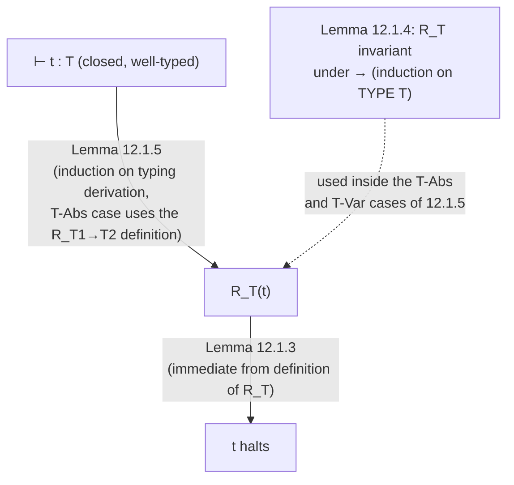

[[book-guidelines|↩ Back to guidelines]]

## The claim, and why it's not obvious

Every well-typed term of the simply typed lambda-calculus ($\lambda_\to$) — no exceptions, no escape hatches — evaluates to a normal form in finitely many steps. There is no well-typed infinite loop. That's a startling thing for a Turing-complete-*feeling* language to be true of, and Pierce is careful to flag exactly why it stops being true the moment you touch the language again: add `fix` (general recursion, §11.11) or unrestricted [[Recursive-Types|recursive types]] (Ch. 20) and the guarantee is gone immediately — `fix (\x:A. x)` typechecks at type `A` and runs forever. Normalization is a property of *this specific, deliberately weak* calculus, not of "well-typed programs" as a general idea. It's also not implied by [[Type-Safety|type safety]]: progress and preservation together only promise a well-typed term never gets *stuck* — they say nothing about whether it ever *finishes*. A term can step forever, safely, forever taking well-typed steps to well-typed terms, and progress+preservation is completely satisfied by that. Termination is a strictly stronger and logically independent claim, and it needs its own proof.

**[[Existential-Types#What breaks without it|What breaks without it]]:** if $\lambda_\to$ typechecking ever had to run terms to decide anything (it doesn't, but plenty of later systems' metatheory does), non-termination would make that undecidable. This is exactly why the chapter matters beyond STLC itself: System $F^\omega$'s typechecking algorithm (§30.3) needs to *reduce type-level expressions to normal form* to compare two types for equality, and that only terminates because the type-level fragment of $F^\omega$ is, syntactically, a copy of $\lambda_\to$. The Chapter 12 proof is reused, essentially verbatim, to make an actual typechecker in a later chapter terminate.

## Why the obvious proof attempt fails

The natural first move is structural induction on the term (or on its typing derivation): show every subterm normalizes, then argue the whole term does. Pierce poses this as an exercise (12.1.1) precisely because working through *why* it fails is the entire motivation for everything that follows.

Try it on application, $t_1\,t_2$ where $t_1 \to^* \lambda x.t_{12}$ and $t_2 \to^* v_2$. The induction hypothesis gives you that $t_1$ and $t_2$ individually halt. But the next step is $(\lambda x.t_{12})\,v_2 \to [x \mapsto v_2]t_{12}$ — a **substitution**. Substituting a normalized argument into a normalized function body can create brand-new redexes that weren't present in either piece, and in principle duplicate them (if $x$ occurs many times in $t_{12}$, each occurrence gets its own copy of $t_2$). Knowing "$t_1$ halts" and "$t_2$ halts" as isolated facts tells you nothing about whether the *combination* halts, because reduction can transiently **grow** the term — a beta-reduction is not size-decreasing in general, only in the aggregate, eventually. Ordinary structural induction has no hook to reach that "eventually": the induction hypothesis is too weak at exactly the case (application) that does the interesting work.

This is a shape of failure worth internalizing on its own, independent of normalization: **an induction fails not because the theorem is false, but because you're inducting on the wrong invariant, and the fix is to strengthen the hypothesis until it's self-supporting through the hard case.** That's the whole technique this chapter teaches.

## The fix: define "well-behaved" by induction on types, not terms

Tait's idea (this method is due to Tait 1967, later generalized to System F by Girard, and the call-by-value adaptation used here is due to Martin Hofmann) is to stop trying to prove "$t$ halts" directly and instead define a much stronger predicate — indexed by *type*, not by term structure — and prove the strong predicate holds of every well-typed term. If the strong predicate implies halting, you're done, and because it's stronger it turns out to be provable where the naive statement wasn't.

Fix a single base type $A$ for the calculus in this chapter (TAPL's simplification; the technique generalizes). Pierce defines, for each type $T$, a set $R_T$ of closed terms of type $T$ (**Definition 12.1.2**), read as a predicate $R_T(t)$ meaning "$t \in R_T$":

$$
\begin{aligned}
R_A(t) &\iff t \text{ halts.} \\
R_{T_1 \to T_2}(t) &\iff t \text{ halts, and } \forall s.\ R_{T_1}(s) \implies R_{T_2}(t\,s).
\end{aligned}
$$

Read the function-type clause carefully — it's the entire trick. It's not enough for a function to halt. It has to halt **and**, whenever handed any argument that is itself well-behaved (recursively, at the smaller type $T_1$), produce a well-behaved result. This is what supplies the missing hook for the application case: instead of only knowing "$t_1$ halts" as an inert fact, membership in $R_{T_1 \to T_2}$ hands you a *guarantee about what happens when you apply it* — which is exactly the operation the naive proof got stuck on.

The $R_T$ sets go by several names in the literature that are worth knowing on sight: **reducibility candidates**, **saturated sets**, or — because there's only one predicate per type here rather than a relation between multiple things — **logical predicates** (the general family is "logical relations"). The recursion is on the *structure of the type*, not the term: $R_{(A\to A)\to(A\to A)}$ is built out of $R_{A \to A}$ which is built out of $R_A$. This is why the definition has to be indexed by type at all — a term's own syntactic structure gives you no natural well-founded recursion that reaches into "what happens when I apply this," but the type does, because every arrow points to strictly smaller types.

**Rust/Lean [[Bounded-Quantification#Grounding|grounding]].** This is a purely proof-theoretic construction, but its *shape* is one you'll meet again as a working technique, not just history: it's a **logical relation defined by recursion on types**, the exact same recipe used to prove compiler correctness (source/target term pairs related type-by-type) and used inside Lean's own metatheory to state things like "definitional equality is preserved by well-typed contexts." In Lean, you'd sketch the definition as a type-indexed proposition:

```lean
-- sketch only — not a literal Lean definition, illustrating the shape
def R : (T : Ty) → Term → Prop
  | .base,      t => Halts t
  | .arrow T1 T2, t => Halts t ∧ ∀ s, R T1 s → R T2 (.app t s)
```

The recursive call `R T1 s` on a *strictly smaller type* is precisely what makes this well-founded — Lean's own kernel accepts structurally recursive definitions of this shape for the same reason this chapter's induction-on-types goes through.

## The two-lemma skeleton of the proof

TAPL splits the argument into exactly two pieces, and the whole theorem falls out of composing them.

**Step 1 — everything in $R_T$ halts (Lemma 12.1.3).** Immediate from the definition: $R_A(t)$ *is* "$t$ halts," and $R_{T_1\to T_2}(t)$ explicitly includes "$t$ halts" as a conjunct. So membership in $R_T$, at any type, is already strong enough to hand you termination directly — no further work needed here. This half is trivial by design; all the difficulty is pushed into Step 2.

**Step 2 — every well-typed term is in $R_T$ (the hard half).** This is where the induction-on-typing-derivations actually goes through, but it needs one more piece of scaffolding first.

*Invariance under evaluation (Lemma 12.1.4).* If $t : T$ and $t \to t'$, then $R_T(t) \iff R_T(t')$ — reduction doesn't change whether a term is well-behaved. Proved by induction on the *type* $T$ (not the term): for base type it's immediate ($t$ halts iff $t'$ does, since they're one step apart on the same reduction path); for $T_1 \to T_2$, applying $t$ or $t'$ to the same well-behaved argument $s$ gives results that are themselves one reduction step apart at type $T_2$, so the type-$T_2$ induction hypothesis closes the loop. This lemma is what lets you freely swap between a term and any of its reducts without disturbing the property you're tracking — indispensable, since the abstraction case below reasons about a term *before* substitution while wanting to conclude something about it *after*.

*The substitution lemma, generalized to open terms (Lemma 12.1.5).* Here's the second and more subtle strengthening the proof needs. $R_T$ was defined only for **closed** terms — but the induction has to go through the $\lambda x{:}T_1.t_2$ case, where $t_2$ is *open* (it has $x$ free), so "$R_{T_2}(t_2)$" isn't even well-formed as stated. The fix (in Pierce's words, "a standard trick") is to generalize the statement to cover every closed instance of an open term:

> If $x_1{:}T_1, \dots, x_n{:}T_n \vdash t : T$ and $v_1, \dots, v_n$ are closed values with $R_{T_i}(v_i)$ for each $i$, then $R_T([x_1 \mapsto v_1]\cdots[x_n \mapsto v_n]\,t)$.

This is proved by ordinary induction on the typing derivation, and now every case is tractable:
- **T-Var:** immediate — substituting $x_i$ just gives back $v_i$, and $R_{T_i}(v_i)$ was assumed.
- **T-Abs:** the case that broke the naive proof. The substituted abstraction is already a value, so it already halts; what remains is to show that applying it to *any* well-behaved argument $s$ produces a well-behaved result — exactly the recursive obligation the definition of $R_{T_1 \to T_2}$ demands. Here the induction hypothesis (now available at the smaller *derivation*, but crucially stated over *all* closing substitutions) is applied with the environment extended by one more binding $x \mapsto v$ where $v$ is $s$ reduced to a value — Lemma 12.1.3 gets you that halting value, Lemma 12.1.4 lets you transport $R_{S_1}$-membership onto it, and the IH plus one more application of 12.1.4 (evaluation-invariance, run in reverse to go from the reduced-and-substituted form back to the actual application term you care about) closes the case.
- **T-App:** the IH gives you $R_{T_{11}\to T_{12}}$ of the (substituted) function and $R_{T_{11}}$ of the (substituted) argument — and now the definition of $R_{T_{11}\to T_{12}}$ *directly* hands you $R_{T_{12}}$ of the application. This is the payoff: the case that was an unprovable dead end under naive induction is now a one-line unfolding of a definition.

**Normalization (Theorem 12.1.6)** falls out as a corollary with zero extra work: instantiate Lemma 12.1.5 with $n = 0$ (a closed term needs no substitutions), giving $R_T(t)$ directly from $\vdash t : T$; then Lemma 12.1.3 says everything in $R_T$ halts. Done.



## What this technique is actually an instance of

Step back from the specific lemmas and notice the general move, because it's one you will use again: the theorem you want ("$t$ halts") is too weak to be proved by induction on its own, so you invent a *stronger*, auxiliary statement (membership in $R_T$) whose induction hypothesis is exactly self-sufficient at every case — including the one, application, that defeated the original attempt — and then you recover the original weak theorem as a corollary by specializing the strong one. The strengthening isn't arbitrary: it's built by looking at exactly where the weak proof got stuck (needing to know something about *behavior under application*, not just *termination in isolation*) and baking that missing fact directly into the definition.

This is the same move that shows up, later in the book and beyond it, any time a proof needs a logical relation rather than a bare inductive property: System F's strong normalization (§23.5, Girard) is the direct generalization of this exact argument to polymorphic types (quantifying $R_T$ over type substitutions as well); $F^\omega$'s confluence-based safety proof (§30.3) needs an analogous reduction-based argument at the level of types. If you go on to build the Rust verifier or the elaborator described by your own project goals, expect this pattern to recur under the name **logical relations** or **realizability**: whenever an inductive proof of a property $P$ fails at a "higher-order" case (functions, and later metavariables applied to arguments), the fix is almost always to replace $P$ with a type- or kind-indexed family that says "$P$, and $P$ is preserved by every operation this type supports" — not to push harder on the original induction.

## Where this leads

Chapter 12 is a closed detour — Pierce even says up front it can be skipped without consequence for later chapters — but it pays for itself twice. First, it's the reason [[The-Simply-Typed-Lambda-Calculus|the simply typed lambda-calculus]] on its own can never express unrestricted recursion (Chapter 11's `fix` operator is a genuinely new primitive, not derivable, precisely *because* deriving it would break this theorem). Second, the reducibility-candidates technique is reused nearly verbatim as the metatheoretic engine behind System F's strong normalization (Girard, §23.5) and behind why the $F^\omega$ typechecking algorithm (§30.3) is even decidable — type-level reduction there has to terminate, and it terminates for the same structural reason terms do here. Recognize this proof shape — strengthen the induction hypothesis by indexing a predicate on types rather than terms — and you'll see it again anywhere a naive induction dies at a higher-order case.
