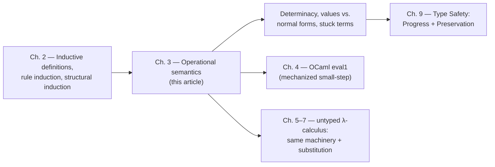

[[book-guidelines|↩ Back to guidelines]]

## Why you can't just say "the program runs and produces a value"

Every language implementation already has *some* notion of "how a program runs" — an interpreter, a compiler backend, a mental model in the maintainer's head. The problem is that an informal notion isn't a notion you can *prove things about*. If you want to prove, say, that a well-typed program never crashes with a segfault-equivalent error, you need a mathematically precise object to state that claim about: a relation, defined by rules, that you can do induction over.

That's what this chapter builds, using the smallest possible language — booleans and numbers, no variables, no functions — specifically so the *machinery* of defining and reasoning about evaluation isn't obscured by the complexity of the language itself. Everything here — the evaluation relation, the values/normal-forms distinction, determinacy, termination — reappears unchanged in spirit through the rest of the book, right up to the point (Chapter 9, [[Type-Safety|Type Safety]]) where it gets fused with a typing relation to prove real safety theorems.

Pierce actually opens by asking a broader question first: **what does "semantics" even mean**, and which of the standard three formalization styles should a language-implementer's book commit to?

## Three ways to say what a program means

1. **Operational semantics** — define a small abstract machine whose states are terms of the language itself (not some low-level bytecode), and a transition function that says how one state steps to the next. The meaning of a program is the state the machine eventually halts in.
2. **Denotational semantics** — map each term directly onto some pre-existing mathematical object (a number, a function between domains) via an interpretation function, sidestepping the notion of "steps" entirely.
3. **Axiomatic semantics** — skip evaluation altogether and take a set of provable laws about the program *as* its definition; the meaning of a term is whatever can be proved about it.

TAPL commits to (1), exclusively, for a pragmatic reason: denotational semantics needs deep domain theory to handle nondeterminism/concurrency, axiomatic semantics struggles with procedures, and operational semantics — despite being historically regarded as "the crude one" — turned out (via Plotkin's 1981 Structural Operational Semantics and Kahn's 1987 Natural Semantics) to be simple, flexible, and to compose well with type systems. Every later chapter's "evaluation rules" are operational semantics in this sense.

**What breaks without an explicit choice of style:** if you don't commit to one formalization, "type safety" has no fixed target — you can't prove a theorem about "the meaning of a program" without first pinning down what an evaluation *step* is. Progress and Preservation (Chapter 9) are literally theorems about the evaluation relation defined in this chapter.

## The evaluation relation: small-step operational semantics

### Setup: terms, values, and the machine-state idea

Take the tiny boolean fragment first (Figure 3-1 in the book — call it system $\mathcal{B}$):

$$
t ::= \texttt{true} \mid \texttt{false} \mid \texttt{if } t \texttt{ then } t \texttt{ else } t \qquad \text{(terms)}
$$
$$
v ::= \texttt{true} \mid \texttt{false} \qquad \text{(values)}
$$

**Values** are the subset of terms that count as *finished* results — the possible final states of the machine. Here that's just the two constants. The metavariable $v$ is reserved for values throughout the book, exactly the way $t$ is reserved for arbitrary terms.

The evaluation relation itself is written $t \to t'$, read "$t$ evaluates to $t'$ *in one step*." Three rules define it:

$$
\text{if true then } t_2 \text{ else } t_3 \to t_2 \qquad \text{(E-IfTrue)}
$$
$$
\text{if false then } t_2 \text{ else } t_3 \to t_3 \qquad \text{(E-IfFalse)}
$$
$$
\frac{t_1 \to t_1'}{\text{if } t_1 \text{ then } t_2 \text{ else } t_3 \to \text{if } t_1' \text{ then } t_2 \text{ else } t_3} \qquad \text{(E-If)}
$$

Notice the division of labor: **E-IfTrue/E-IfFalse are computation rules** — they do the actual work of collapsing a conditional once its guard is a literal `true`/`false`. **E-If is a congruence rule** — it doesn't compute anything itself, it just says "if the guard can take a step, the whole `if` can take that same step underneath it." Congruence rules are how the definition threads evaluation *into* subterms in a specific, deterministic order — here, guard-first, and there is deliberately no rule letting you evaluate inside the `then`/`else` branches before the guard resolves. The *absence* of rules is as load-bearing as their presence: `true` and `false` don't appear on any rule's left-hand side, so they simply don't evaluate further — which is exactly what makes them values rather than some other kind of stuck term.

**What breaks without congruence rules:** you'd only be able to evaluate top-level redexes, never reduce inside a compound term — the machine could take zero steps on `if (if true then true else true) then 0 else 0` even though the guard is obviously reducible. Congruence rules are what let single-step evaluation "reach into" a term's structure.

Formally (Def. 3.5.3), $\to$ is defined as **the smallest binary relation on terms satisfying these rules** — the same "smallest set closed under rules" idea from Chapter 2's inductive definitions, just applied to a relation instead of a set. A judgment $t \to t'$ is *derivable* exactly when you can build a **derivation tree** for it: leaves are instances of the axioms (E-IfTrue/E-IfFalse), internal nodes are instances of E-If. Because no rule here has more than one premise, these trees never branch — they're really just chains, though the terminology becomes meaningful once typing rules (with multiple premises) show up later.

The book's own worked example, abbreviating $s = \texttt{if true then false else false}$, $t = \texttt{if } s \texttt{ then true else true}$, $u = \texttt{if false then true else true}$:

<svg viewBox="0 0 620 220" xmlns="http://www.w3.org/2000/svg" style="max-width:100%;height:auto;font-family:ui-monospace,Menlo,Consolas,monospace;font-size:14px">
  <style>
    .box { fill: none; stroke: #7a7a7a; stroke-width: 1.2; }
    .lbl { fill: #6b6b6b; font-size: 12px; font-style: italic; }
    .term { fill: currentColor; }
    .rule { stroke: #7a7a7a; stroke-width: 1; }
  </style>
  <text x="10" y="30" class="term">s → false</text>
  <line x1="10" y1="40" x2="150" y2="40" class="rule"/>
  <text x="160" y="38" class="lbl">E-IfTrue</text>

  <text x="70" y="80" class="term">t → u</text>
  <line x1="10" y1="90" x2="220" y2="90" class="rule"/>
  <text x="230" y="88" class="lbl">E-If</text>

  <text x="30" y="150" class="term">if t then false else false → if u then false else false</text>
  <line x1="10" y1="160" x2="560" y2="160" class="rule"/>
  <text x="570" y="158" class="lbl">E-If</text>
</svg>

Each rule application is stacked as a premise sitting above the line that licenses the next conclusion — exactly the "if we've established what's above the line, we may derive what's below it" reading of inference rules from Chapter 2.

### Determinacy: the machine never has a choice

**Theorem (3.5.4, Determinacy of one-step evaluation).** If $t \to t'$ and $t \to t''$, then $t' = t''$.

The proof is by **induction on the derivation** of $t \to t'$ — the exact proof technique the book set up in Chapter 2 and Chapter 3's induction-on-terms material. You case-split on which rule was used *last* in the derivation, and in each case argue the *other* derivation of $t \to t''$ had no choice but to use the same rule (because the rules' left-hand-side patterns are mutually exclusive — a term can't simultaneously start with a `true` guard and a `false` guard). In the E-If case, the induction hypothesis is applied to the *subderivation* for the guard, which is strictly smaller — the textbook shape of a rule-induction proof.

Grounded in Rust: determinacy is precisely the property that lets you implement evaluation as a **total function**, not a relation you'd need backtracking search over.

```rust
enum Term {
    True,
    False,
    If(Box<Term>, Box<Term>, Box<Term>),
}

/// One step of evaluation, or None if `t` is already a normal form.
/// Determinacy is *why* this can return `Option<Term>` instead of `Vec<Term>` —
/// there is never more than one possible next state.
fn step(t: &Term) -> Option<Term> {
    match t {
        Term::If(t1, t2, _) if matches!(**t1, Term::True) => Some((**t2).clone()),
        Term::If(t1, _, t3) if matches!(**t1, Term::False) => Some((**t3).clone()),
        Term::If(t1, t2, t3) => {
            let t1p = step(t1)?;               // E-If: recurse into the guard
            Some(Term::If(Box::new(t1p), t2.clone(), t3.clone()))
        }
        Term::True | Term::False => None,      // values: no rule applies
    }
}
```

Each `match` arm corresponds one-for-one to an inference rule — this is exactly the correspondence the book itself draws out explicitly in Chapter 4 when it presents the OCaml `eval1` function. Rust's `match` exhaustiveness checker is, in effect, forcing you to confirm you've covered every syntactic form — a nice mechanized echo of "the evaluation relation is defined by cases on the grammar."

### Values, normal forms, and the gap between them (stuck terms)

Two theorems relate "value" (a syntactic category, defined by the grammar) to "normal form" (a semantic property: *no rule applies*):

**Theorem 3.5.7.** Every value is in normal form. (True by inspection — the rules' left-hand sides are all `if`-shaped, so `true`/`false` can never match one.)

**Theorem 3.5.8.** In *this* system, every normal form is also a value — proved by structural induction: if $t$ isn't a value, it must be an `if`, and either its guard is a literal (so E-IfTrue/E-IfFalse fires) or its guard itself isn't a normal form (so E-If fires via the induction hypothesis). Either way, $t$ isn't a normal form.

The book flags immediately that **this converse will fail in richer languages**, and that's the whole point of introducing the terminology now: once arithmetic operators are added, a term like `succ true` is a normal form (no rule matches it) but *not* a value (it's not a well-formed number or boolean). Terms in this gap are called **stuck**:

$$
\text{A closed term } t \text{ is } \textbf{stuck} \text{ if it is a normal form but not a value.}
$$

This is the single most important definition in the chapter, because **"stuck" is the formal stand-in for "runtime error."** Type safety, defined three chapters later, is precisely the claim that a well-typed term can *never* reach a stuck state — only values or further reducible terms. Pierce underlines this by noting that if Theorem 3.5.7 (values ⊆ normal forms) ever failed for some later extension of the language, "the language definition is simply broken" — a value that could still take a step would be a contradiction in the definition itself.

Grounded in Rust: this maps onto the difference between "my `step` function returns `None`" and "my `step` function returns `None` *and the term is a legal value of my language*." If you extend `Term` with a `Succ(Box<Term>)` constructor and don't reject `Succ(True)` at the type level, `step` will happily return `None` for it — silently "succeeding" at producing garbage. This is exactly the motivation, several chapters later, for making illegal states unrepresentable via typing rather than trusting the evaluator to catch them at runtime.

### Multi-step evaluation, and evaluation actually terminates

Chaining single steps together:

$$
\to^* \;\; \text{is the reflexive, transitive closure of } \to.
$$

i.e. the smallest relation such that $t \to t'$ implies $t \to^* t'$, $t \to^* t$ always holds, and $\to^*$ composes. With this in hand, **uniqueness of normal forms** (3.5.11) — if $t \to^* u$ and $t \to^* u'$ with both $u, u'$ normal, then $u = u'$ — falls straight out of determinacy by an easy induction on the length of the reduction sequence; the book calls it a corollary, not a new proof.

The chapter's last theorem before big-step semantics is **termination**: every term reduces, in finitely many steps, to *some* normal form. The proof technique is the general-purpose one used across the whole field:

> Pick a well-founded set $S$ and a **termination measure** $f$ mapping machine states into $S$, such that every step strictly decreases $f$. An infinite reduction sequence would produce an infinite strictly-decreasing chain in $S$ — impossible if $S$ is well-founded (e.g. the naturals under $<$).

Here $f = \mathrm{size}(t)$ (number of AST nodes) works trivially, since every rule strictly shrinks the term. The book flags explicitly that this is a *fragile* argument — it fails the moment you add general recursion (`fix`, Chapter 11), and Chapter 12's [[Normalization|normalization]] proof for the *typed* lambda-calculus needs a genuinely more sophisticated measure (reducibility candidates) because "smaller AST" is no longer a valid decreasing quantity once terms can grow during evaluation (e.g. `(λx. x x x) (λx. x x x)`-style duplication).

## Big-step semantics and the abstract-machine framing

Pierce relegates this to an exercise (3.5.17), but it's conceptually a full alternative presentation style worth treating on equal footing, since later chapters and other texts freely switch between the two.

**Small-step (structural operational semantics, Plotkin)** — the style used throughout TAPL — models "the machine" as a term that gets rewritten one micro-step at a time, and *derives* the notion "$t$ evaluates to $v$" only indirectly, via the reflexive-transitive closure $\to^*$.

**Big-step (natural semantics, Kahn)** — instead directly defines a relation $t \Downarrow v$, "$t$ evaluates to final value $v$," in one shot, with rules that recursively demand their subterms already evaluate to values:

$$
v \Downarrow v \qquad \text{(B-Value)}
$$
$$
\frac{t_1 \Downarrow \texttt{true} \quad t_2 \Downarrow v_2}{\text{if } t_1 \text{ then } t_2 \text{ else } t_3 \Downarrow v_2} \qquad \text{(B-IfTrue)}
$$
$$
\frac{t_1 \Downarrow \texttt{false} \quad t_3 \Downarrow v_3}{\text{if } t_1 \text{ then } t_2 \text{ else } t_3 \Downarrow v_3} \qquad \text{(B-IfFalse)}
$$

and analogous rules for `succ`/`pred`/`iszero` on numeric values. The book's own exercise asks you to prove $t \to^* v \iff t \Downarrow v$ — the two styles are provably equivalent for this language, but they are *not* interchangeable tools:

- **Small-step gives you a handle on individual machine states**, which is exactly what you need to state Progress ("a well-typed non-value term can always take a step") and Preservation ("a step preserves well-typedness") as separate theorems about *one* step at a time. Big-step has no notion of "one step" to hang those theorems on.
- **Big-step is the natural shape of a recursive-descent interpreter** — the derivation rules for $\Downarrow$ are, almost verbatim, the case arms of a recursive `eval` function that returns a value directly rather than "the next state."

This is the **abstract machine** framing the Topic List flags: "operational semantics specifies the behavior of a language by defining a simple abstract machine for it... a state of the machine is just a term, and its behavior is a transition function." Small-step evaluation *is* that abstract machine, made completely literal: states are terms, `step` is the transition function, and the "final state" the machine halts in (a normal form) is the meaning of the program. Whether you observe that machine one micro-step at a time (small-step) or ask only for its eventual answer (big-step) is a presentational choice, not a difference in what's being computed.

Grounded in Python (a quick illustrative sketch, not load-bearing): big-step semantics corresponds almost exactly to the naive tree-walking interpreter every language implementer writes first —

```python
def eval_bigstep(t):
    match t:
        case True_() | False_():
            return t                       # B-Value
        case If(t1, t2, t3):
            v1 = eval_bigstep(t1)
            if isinstance(v1, True_):
                return eval_bigstep(t2)     # B-IfTrue
            else:
                return eval_bigstep(t3)     # B-IfFalse
```

Compare this to the Rust `step` function above: `step` returns `Option<Term>` (one micro-step, possibly none); `eval_bigstep` returns a value directly and recurses to completion. The former is what you need if you ever want to *prove* something about intermediate states (progress/preservation); the latter is what you'd actually ship as an interpreter.

## Synthesis: where this sits in the book's structure



Everything downstream in TAPL reuses this chapter's vocabulary unchanged: every later system gets its own $t \to t'$ relation defined by computation + congruence rules, its own notion of values, and — crucially — its own notion of *stuck* term, which becomes the precise thing a type system is required to rule out. **Progress**, the first half of Chapter 9's safety theorem, is stated as "if $\vdash t : T$ then either $t$ is a value or $t \to t'$ for some $t'$" — a direct negation of "$t$ is stuck," using the exact terminology defined here. **Preservation**, the second half, is a statement about a single step of *this* $\to$ relation preserving typability — it presupposes the small-step, one-step-at-a-time framing rather than the big-step one, which is precisely why TAPL commits to small-step semantics as its default style even though the two are provably equivalent for this toy language.

**Bearing on the standing projects:** this chapter is effectively the *specification* of what your Rust verifier's evaluator has to implement, and the small-step/big-step distinction maps directly onto a design decision you'll face there. If the verifier only needs to *run* checked programs, a big-step interpreter (the `eval_bigstep` shape) is simpler and faster to write. But if the verifier needs to *prove* progress/preservation-style soundness theorems about its own type system — which is exactly what "checking program correctness against logic-clause specifications" requires — you need the small-step `step: Term -> Option<Term>` formulation, because soundness proofs are proofs about individual steps, not about the whole evaluation at once. The Rust `step` function sketched above, and the determinism argument behind returning `Option<Term>` rather than a set of successors, is close to a minimal skeleton for that piece of the toolchain. The "stuck vs. normal form" distinction is also the natural vocabulary for distinguishing "the specification's proof search failed cleanly" from "the checked program hit undefined behavior" — worth carrying forward as terminology even outside TAPL's toy language.
