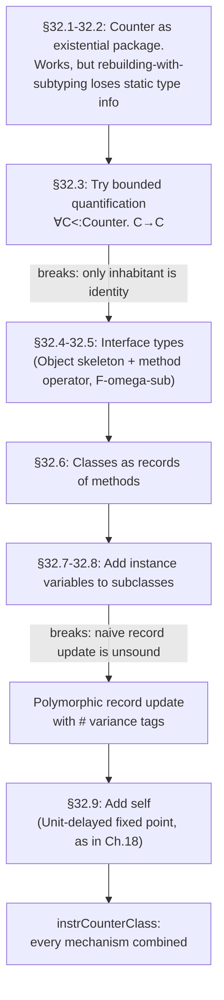

# Purely Functional Object Encodings

[[book-guidelines|↩ Back to guidelines]]

## The problem this chapter is solving

Chapter 24 showed that an object is, at bottom, an existential package: hide a state type behind an `∃`, ship a record of methods that operate on that hidden type, and you have encapsulation for free — nobody outside the package can inspect or depend on the concrete representation. Chapter 27 then went and encoded the *imperative* version of objects, using references so that "sending a message" could mutate state in place, the way objects behave in Java or Python.

This chapter asks a harder question: can you get real object-oriented programming — [[Subtyping|subtyping]] between object types, classes, subclassing, inheritance, methods that call each other via `self` — *without* mutation? Purely functionally, where "changing" an object's state means producing a brand-new object with different guts?

The motivation isn't nostalgia for referential transparency. It's diagnostic: building this model forces you to isolate exactly which pieces of OO semantics are inherently about *aliasable, mutable state* and which are just about *types*. The answer the chapter arrives at is that almost none of it is inherently about mutation — but getting there exposes two real gaps in the type theory built up to that point (plain `F_<:` and record subtyping), and each gap forces the introduction of a genuinely new mechanism. That's the throughline of the whole chapter: a running `Counter` example that keeps breaking as you push it further, and each break motivating one new tool.



## 32.1–32.2 — The starting point: Counter as an existential package

Recall the object type from §24.2:

$$
\texttt{Counter} = \{\exists X, \{\texttt{state}:X,\ \texttt{methods}:\{\texttt{get}:X\to\texttt{Nat}, \texttt{inc}:X\to X\}\}\}
$$

An element of this type is a package: some concrete hidden representation type $X$, a value of that type (`state`), and a record of functions (`methods`) that only know how to operate on `X`. To build one, fix the representation to `CounterR = {x:Nat}` and pack:

```
c = {*CounterR,
     {state = {x=5},
      methods = {get = λr:CounterR. r.x,
                 inc = λr:CounterR. {x=succ(r.x)}}}} as Counter;
⊢ c : Counter
```

**Why the pieces are shaped this way.** In an imperative object, `inc` mutates a field and returns nothing meaningful. Here there is no mutation, so `inc` must *return a new state* — and "sending" a message means: unpack the package, apply the method to the current state, and (for methods that "change" something) repackage the new state with the *same* methods into a fresh object of the same type:

```
sendget  = λc:Counter. let {X,body} = c in body.methods.get(body.state);
sendinc  = λc:Counter. let {X,body} = c in
             {*X, {state = body.methods.inc(body.state),
                   methods = body.methods}} as Counter;
```

`sendget : Counter → Nat`, `sendinc : Counter → Counter`. This is the whole vocabulary needed to build compound behavior like `addthree = λc:Counter. sendinc (sendinc (sendinc c))`.

**Subtyping comes for free.** Because `Counter` is built purely from existentials and records, the existing subtyping rule for existentials,

$$
\dfrac{\Gamma, X<:U \vdash S_2 <: T_2}{\Gamma \vdash \{\exists X<:U, S_2\} <: \{\exists X<:U, T_2\}} \quad \text{(S-Some)}
$$

plus record-width subtyping, immediately gives you: a `ResetCounter` (same fields plus a `reset` method) is a subtype of `Counter`, with zero extra machinery. You can build a `ResetCounter` object and pass it anywhere a `Counter` is expected via subsumption. This is object subtyping — "every reset-counter is usable as a counter" — derived, not stipulated.

**Rust framing.** This existential package is exactly a `Box<dyn Trait>` where the trait fixes an *interface* and the concrete type behind the box is erased. `sendinc` consuming `self` by value and returning a new `Self`-shaped value mirrors Rust's "builder"/typestate idiom (`fn inc(self) -> Self`) rather than `&mut self` — the purely functional discipline maps onto Rust's ownership-transfer style much more naturally than onto mutation.

```rust
trait CounterMethods<S> { fn get(&self, s: &S) -> u64; fn inc(&self, s: S) -> S; }
struct Counter<S> { state: S, methods: Box<dyn CounterMethods<S>> }
// "existential X" == erasing S behind a trait object / generic boundary
```

**What breaks without this.** If objects were just records of methods closed over mutable state (no existential), you'd have no way to hide the representation type from clients — anyone could pattern-match on the concrete state and depend on it, defeating encapsulation. The existential is doing real work, not decoration.

## 32.3 — Why bounded quantification alone fails

The `sendinc`/`addthree` split above has an annoying cost: once you upcast a `ResetCounter` to `Counter` and call `addthree`, you get back a plain `Counter` — you've lost the fact that it was really a `ResetCounter`. This is the classic subsumption-loses-precision problem, and Chapter 26 built [[Bounded-Quantification|bounded quantification]] exactly to solve it.

The natural fix: give `sendinc` the type $\forall C<:\texttt{Counter}.\ C \to C$ — "for *any* subtype $C$ of `Counter`, take a `C` and give back a `C`" — so instantiating at `ResetCounter` preserves the more specific type through the whole computation.

```
addthree = λC<:Counter. λc:C. sendinc [C] (sendinc [C] (sendinc [C] c));
⊢ addthree : ∀C<:Counter. C → C
rc3 = addthree [ResetCounter] rc;   ⊢ rc3 : ResetCounter   -- precision preserved!
```

Great — except **you cannot actually implement `sendinc` at that type.** Try to write the honest unpack/repackage body under a bound `C<:Counter`:

```
sendinc = λC<:Counter. λc:C.
  let {X,body} = c in
    {*X, {state = body.methods.inc(body.state), methods = body.methods}} as C;
⊢ Error: existential type expected
```

The type ascription `as C` fails because `C` is a *type variable*, not literally an existential type — the typechecker has no way to know that "every subtype of an existential type is an existential type" (and in fact repackaging soundly at exactly type `C` would be *wrong*: consider a subtype of `Counter` that adds an extra field `junk:Bool` — the freshly built package obviously doesn't have that field, so it cannot honestly have type `C` for arbitrary `C<:Counter`).

The only term Pierce can actually produce at type $\forall C<:\texttt{Counter}.\ C\to C$ is `wrongsendinc = λC<:Counter. λc:C. c` — the identity. This isn't an accident of this one example: **in pure $F_{<:}$, the type $\forall C<:T.\ C\to C$ is inhabited only by the identity function** (provable via a denotational model, Robinson and Tennent 1988). Bounded quantification alone cannot express "transform an object while preserving its exact subtype" for any non-trivial transformation.

**What breaks without a fix here:** you'd be stuck choosing between (a) precise types but no interesting polymorphic operations over object hierarchies, or (b) interesting operations but only at the price of forgetting subtype information every time you use them. Neither is acceptable for a real OO discipline. Pierce names three ways out — move to $F^{\omega}_{<:}$ with higher-order bounded quantification, add primitives that manufacture more inhabitants of $\forall C<:T.C\to C$, or add references (already explored in Ch. 27) — and this chapter commits to the first plus a new update primitive, precisely to stay purely functional.

**Lean framing.** This is a sharp illustration of why *definitional* transparency matters for what a type can prove: `∀C<:Counter.C→C` looks like it should support "increment," but the type itself carries no evidence connecting `C` to the existential structure needed to repackage a value of type `C`. It's the polymorphism analogue of a proof obligation nothing in your context can discharge — the type is inhabited, but only vacuously.

## 32.4–32.5 — Interface types: splitting the skeleton from the interface

The fix is to stop quantifying over whole object types and instead quantify over just the *method interface*, treated as a first-class type operator. Split `Counter` into two pieces:

$$
\texttt{CounterM} = \lambda R.\ \{\texttt{get}: R\to\texttt{Nat},\ \texttt{inc}:R\to R\} \qquad \texttt{Object} = \lambda M{::}{*}{\Rightarrow}{*}.\ \{\exists X,\ \{\texttt{state}:X,\texttt{methods}: M\, X\}\}
$$

`CounterM` has kind $*\Rightarrow*$: it's a *method interface parameterized over the representation type*. `Object` has kind $(*\Rightarrow*)\Rightarrow *$: it's the *fixed skeleton* common to all objects — existential packaging plus the state/methods pair — parameterized over which interface fills it in. Then `Counter = Object CounterM`, and unfolding the application really does beta-reduce to the original definition: substitute `CounterM` for `M`, then substitute `X` for `R` inside it.

Why does this need $F^{\omega}_{<:}$ (higher-order bounded quantification, Ch. 30–31) rather than plain $F_{<:}$? Because `CounterM` mentions the existentially-bound `X` — pulling it out as a free-standing entity requires abstracting the interface *itself* over `X`, i.e., treating it as a function from representation types to record types. Quantifying over "sub-interfaces of `CounterM`" is now quantifying over a *type operator*, which is exactly what higher-order bounded quantification gives you: $M <: \texttt{CounterM}$ where both sides have kind $*\Rightarrow*$.

This split also gives you **interface subtyping** as a separate, meaningful relation from object-type subtyping: `ResetCounterM <: CounterM` (as operators) is what actually licenses `ResetCounter <: Counter` (as full object types) — genuine subtyping between the *varying* part, decoupled from the *fixed* boilerplate. (Pierce notes this is closely related to *matching*, Bruce et al. 1997; Abadi–Cardelli 1995/1996 — matching being the idea that "refines the interface of" and "is a subtype of" can be usefully pulled apart.)

Now `sendinc` typechecks, because it abstracts over sub-*interfaces*, not sub-*types*:

```
sendinc = λM<:CounterM. λc:Object M.
  let {X, b} = c in
    {*X, {state = b.methods.inc(b.state), methods = b.methods}} as Object M;
⊢ sendinc : ∀M<:CounterM. Object M → Object M
```

Read this as: "give me a method interface that refines counters, then an object with exactly that interface, and I'll hand back an object with the *same* interface" — the repackaging `as Object M` now works because `Object M` really is (unfolds to) an existential type, for any fixed operator `M`.

```
sendget [CounterM] (sendinc [CounterM] c);              ⊢ 6 : Nat
sendget [ResetCounterM]
  (sendreset [ResetCounterM] (sendinc [ResetCounterM] rc));   ⊢ 0 : Nat
```

**Rust framing.** This is uncannily close to associated-type-parameterized traits: instead of one monomorphic trait, you define a trait *schema* generic over the "self-representation" type, then a generic wrapper (`Object<M>`) that erases the representation but keeps the schema. It's the type-operator-level version of `impl<R> Counter for Wrapper<R>`.

**Lean framing.** `Object` is a $\Pi$-like abstraction one universe level up from ordinary functions — it's abstracting a *family of record types indexed by a type operator*, structurally the same move as building a typeclass parameterized over a structure-shaped argument rather than over a bare type. This is a genuinely $F_4$-flavored construction (the book notes `Object` and the later `Class` operator technically live in $F_4$, since their argument has kind $(*\Rightarrow*)\Rightarrow*$ — one level past the $F_3$ that the rest of the book's examples inhabit).

## 32.6 — Classes as records of methods

With interfaces separated out, a *class* (no `self` yet) becomes almost trivial: since state is threaded explicitly through every method (rather than closed over, as in the imperative encoding of Ch. 18), a class doesn't need to know the initial state at all — it's just the record of methods itself.

```
counterClass = {get = λr:CounterR. r.x, inc = λr:CounterR. {x=succ(r.x)}} as CounterM CounterR;
⊢ counterClass : CounterM CounterR
```

Building an instance means pairing a concrete initial state with the class:

```
c = {*CounterR, {state = {x=0}, methods = counterClass}} as Counter;
```

And subclassing is just building a new method-record that copies fields wholesale from a `super`:

```
resetCounterClass =
  let super = counterClass in
  {get = super.get, inc = super.inc, reset = λr:CounterR. {x=0}} as ResetCounterM CounterR;
```

This is genuinely just record extension — no new type-theoretic machinery yet. Two things are still missing to match the expressiveness reached for imperative objects in Chapter 18: subclasses that add *instance variables* (§32.7–32.8), and `self` (§32.9).

## 32.7 — Polymorphic record update: the second gap

Suppose you want `backupCounterClass`, a subclass of `resetCounterClass` that remembers a saved value so `reset` can revert to it instead of to zero. This needs a bigger state type — `{x:Nat, old:Nat}` instead of `{x:Nat}`. Now reusing `inc` from the superclass runs into trouble: `inc` for `ResetCounter` has type `{x:Nat} → {x:Nat}`, but `inc` for `BackupCounter` needs `{x:Nat,old:Nat} → {x:Nat,old:Nat}`. Same *code*, different *type* — because `inc` doesn't care whether extra fields exist, only that `x` does.

The natural fix: give `inc` a polymorphic type, $\forall S<:\{\texttt{x}:\texttt{Nat}\}.\ S \to S$ — "works for any record type that at least has an `x` field, and returns something of the *same* type." But this is the exact same shape of problem as §32.3: **in pure $F_{<:}$, $\forall S<:\{x:\texttt{Nat}\}.S\to S$ is inhabited only by the identity.** You can't write the real `inc` at this type using ordinary functional record construction, for the same reason as before — building a fresh record from scratch and claiming it has the caller's exact (possibly wider) type `S` is unsound in general.

**The new primitive.** Rather than reach for higher-order quantification again (there's nothing higher-order to exploit here — records aren't type operators), Pierce introduces *polymorphic record update*: if `r : R` has a field `x:T` and `t:T`, then

$$
r \leftarrow x = t
$$

means "a record just like `r`, except its `x` field now holds `t`" — a clone-with-one-field-changed, not a mutation. This lets you write the shared `inc` body directly:

```
f = λX<:{a:Nat}. λr:X. r←a = succ(r.a);
```

**Why the obvious typing rule is unsound.** The naive rule

$$
\dfrac{\Gamma \vdash r:R \quad \Gamma \vdash R<:\{l_j{:}T_j\} \quad \Gamma \vdash t : T_j}{\Gamma \vdash r \leftarrow l_j = t : R}
$$

looks reasonable but breaks under **depth subtyping**. Take `s = {x={a=5,b=6}, y=true} : {x:{a:Nat,b:Nat}, y:Bool}`. By depth subtyping this has type `{x:{a:Nat}, y:Bool}` too (the inner `x` field is allowed to "forget" its `b` component). The naive rule would then let you derive `s←x={a=8} : {x:{a:Nat,b:Nat}, y:Bool}` — claiming the *original*, wider type — but the term actually reduces to `{x={a=8}, y=true}`, which has silently lost field `b`. **This is a real type-soundness bug, not a pedantic nitpick**: the claimed type promises a field that the value no longer has.

**The fix: variance-tagged fields.** Annotate each record field with a tag $\iota \in \{\#, \varepsilon\}$: `#` marks a field as *invariant/updatable*, the empty tag marks it *covariant/fixed* (ordinary depth subtyping still allowed). The refined rules (Figure 32-1):

$$
\dfrac{\text{for each } i\ \ \Gamma\vdash S_i<:T_i \quad \text{if } \iota_i=\#,\ \Gamma\vdash T_i<:S_i}{\Gamma \vdash \{\iota_i\, l_i{:}S_i^{\,i\in 1..n}\} <: \{\iota_i\, l_i{:}T_i^{\,i\in 1..n}\}} \ \text{(S-RcdDepth)}
$$

$$
\dfrac{\ }{\Gamma \vdash \{\ldots \#l_i{:}S_i \ldots\} <: \{\ldots l_i{:}S_i \ldots\}} \ \text{(S-RcdVariance)} \qquad \dfrac{\Gamma\vdash r:R \quad \Gamma\vdash R<:\{\#l_j{:}T_j\} \quad \Gamma\vdash t:T_j}{\Gamma\vdash r\leftarrow l_j = t : R} \ \text{(T-Update)}
$$

`#`-tagged fields get *invariant* subtyping (both directions), which blocks exactly the "forget the wider inner shape" move that caused the soundness bug — a `#`-field can never be silently narrowed via depth subtyping, so an update through a subtype can't secretly drop information the original type promised. `S-RcdVariance` lets you *downgrade* a `#` field to ordinary covariant once you no longer intend to update it. The soundness anchor is:

> **Fact 32.7.1.** If $\vdash R <: \{\#l:T_1\}$, then $R = \{\ldots \#l:R_1\ldots\}$ with $\vdash R_1<:T_1$ **and** $\vdash T_1<:R_1$ — i.e., an updatable field's type in any subtype is *exactly* (up to mutual subtyping) the type it has in the bound, never a narrowed one.

With the fix, the earlier function becomes well-typed with a real, non-identity implementation:

```
f = λX<:{#a:Nat}. λr:X. r←a = succ(r.a);
⊢ f : ∀X<:{#a:Nat}. X → X
f [{#a:Nat,b:Bool}] {#a=0, b=true};   ⊢ {#a=1, b=true} : {#a:Nat, b:Bool}
```

**Rust framing.** The `#`/invariant distinction is precisely Rust's variance story for mutable references: `&mut T` is invariant in `T` for exactly the analogous reason — if it were covariant, you could upcast a `&mut Vec<Cat>` to `&mut Vec<Animal>` and then write a `Dog` into it through the wider reference, corrupting the `Vec<Cat>`. `#` is TAPL's purely-functional echo of `&mut`'s invariance rule, arrived at by an almost identical counterexample shape (widen, write, get an ill-typed value back through the narrow view).

```rust
fn update_a<T: HasA + Clone>(r: &T, new_a: u32) -> T { let mut c = r.clone(); c.set_a(new_a); c }
// generic-but-only-through-the-fields-you've-bounded ~= X<:{#a:Nat}. X -> X
```

**Lean framing.** `r ← l = t` is definitionally a structure-update (`{ r with l := t }` in Lean's structure syntax) — but Lean's version is safe *by construction* because structure fields aren't subject to arbitrary width/depth subtyping in the first place; TAPL is reconstructing, from first principles inside a subtyping-based calculus, the exact invariance discipline that Lean's structure system gets "for free" from having no structural subtyping at all. Seeing *why* the naive rule needs a patch here is a good rehearsal for reasoning about soundness of any update/mutation operator layered onto a subtyping relation — the same move (spot where depth-subtyping plus write compose unsoundly, then force invariance) recurs anywhere a checker needs to validate in-place update against a structural/subtyping discipline.

## 32.8 — Adding instance variables in subclasses

Polymorphic update turns classes themselves into polymorphic functions over the representation type, bounded by the fields they actually need:

```
CounterR = {#x:Nat};
counterClass = λR<:CounterR.
  {get = λs:R. s.x, inc = λs:R. s←x=succ(s.x)} as CounterM R;
⊢ counterClass : ∀R<:CounterR. CounterM R
```

Subclassing now composes cleanly across *widening* representations — `resetCounterClass` still just needs `CounterR`, but `backupCounterClass` needs the wider `BackupCounterR = {#x:Nat, #old:Nat}`, and it reuses `resetCounterClass`'s `inc`/`get` at that wider instantiation for free:

```
BackupCounterR = {#x:Nat, #old:Nat};
backupCounterClass = λR<:BackupCounterR.
  let super = resetCounterClass [R] in
  {get = super.get, inc = super.inc,
   reset = λs:R. s←x=s.old,
   backup = λs:R. s←old=s.x} as BackupCounterM R;
⊢ backupCounterClass : ∀R<:BackupCounterR. BackupCounterM R
```

This is the payoff the whole polymorphic-update detour was for: a subclass can add instance variables while still inheriting method implementations whose code never changes — only the *bound* on the representation type widens as you go down the class hierarchy.

## 32.9 — Classes with self

The last ingredient, `self`, lets one method in a class call *another* method of the same object — including overridden versions in subclasses — the defining feature of OO-style dynamic dispatch (as opposed to plain function composition). Chapter 18 solved this for the imperative encoding with a fixed point; the same trick works here, purely functionally, because a class is just a function, and functions have fixed points.

The class now takes an extra `self` parameter of type `Unit → CounterM R` — the `Unit →` wrapper exists purely to *delay* evaluation, exactly as in §18.9, so that taking the fixed point doesn't force an infinite unrolling before any method is actually called:

```
counterClass = λR<:CounterR. λself: Unit→CounterM R. λ_:Unit.
  {get = λs:R. s.x, inc = λs:R. s←x=succ(s.x)} as CounterM R;

c = {*CounterR, {state = {#x=0}, methods = fix (counterClass [CounterR]) unit}} as Object CounterM;
```

`fix` ties the knot: `self` inside the body ends up referring to the *final*, possibly-overridden, method table — that's what makes overriding actually override. `setCounterClass` demonstrates a method calling *other* methods through `self`, including a method (`get`) it didn't itself define:

```
setCounterClass = λR<:CounterR. λself: Unit→SetCounterM R. λ_:Unit.
  let super = counterClass [R] self unit in
  {get = super.get,
   set = λs:R. λn:Nat. s←x=n,
   inc = λs:R. (self unit).set s (succ((self unit).get s))} as SetCounterM R;
```

Note `inc` here calls `(self unit).set` and `(self unit).get` — not `super`'s versions — so if a further subclass overrides `set`, calling `inc` on that subclass automatically goes through the *overridden* `set`. This is exactly the semantic content of dynamic dispatch, achieved with nothing but a fixed point over records of functions.

The chapter closes by combining every mechanism at once — interfaces, classes, instance variables via update, and self via fixed point — in `instrCounterClass`, a subclass that counts how many times `set` (and hence `inc`, which is implemented via `set`) has been called:

```
InstrCounterR = {#x:Nat, #count:Nat};
instrCounterClass = λR<:InstrCounterR. λself: Unit→InstrCounterM R. λ_:Unit.
  let super = setCounterClass [R] self unit in
  {get = super.get,
   set = λs:R. λn:Nat. let r = super.set s n in r←count=succ(r.count),
   inc = super.inc,
   accesses = λs:R. s.count} as InstrCounterM R;

ic = {*InstrCounterR,
      {state = {#x=0,#count=0}, methods = fix (instrCounterClass [InstrCounterR]) unit}}
     as Object InstrCounterM;
sendaccesses [InstrCounterM] (sendinc [InstrCounterM] ic);   ⊢ 1 : Nat
```

`accesses` correctly reports `1` even though the caller invoked `inc`, not `set` — because `inc` is `super.inc`, which is defined (two classes up) in terms of `self`'s `set`, which is *this* class's counting `set`. Self-dispatch threading through several layers of inheritance, entirely without mutation.

**Rust/Python framing.** The `Unit →`-delayed `fix` is structurally the same trick used to build recursive/self-referential closures in languages without native `fix`: in Rust you'd reach for `Rc<RefCell<...>>` to tie the knot at runtime (ironically reintroducing the very mutable aliasing this chapter is trying to avoid — a good concrete illustration of *why* the purely functional route needs a real fixed-point combinator rather than a shortcut); in Python, a `self`-closing-over-itself trick via a mutable cell in an enclosing scope does the same job informally.

**Lean framing.** `fix` here is a genuine (partial, coinductively-flavored) recursion operator on a record of functions — the same shape as building `WellFounded.fix` or a manually threaded `PartialFunction` in Lean when you need a self-referential definition that the kernel's termination checker won't accept directly as plain structural recursion. The `Unit →` wrapper is the purely-syntactic analogue of Lean's own need to guard recursive/coinductive definitions against being forced eagerly.

## 32.10 — Historical notes (brief)

Pierce traces two lineages: recursively-defined records (Cardelli 1984, then Kamin–Reddy, Cook–Palsberg, Mitchell) as an early purely-functional object model, which worked well for untyped denotational semantics but caused trouble typing uniformly; and existential-based encodings (Pierce–Turner 1994, then Hofmann–Pierce 1995) — the lineage this chapter belongs to — culminating in a faithful encoding by Abadi–Cardelli–Viswanathan (1996) of Abadi–Cardelli's primitive object calculus using bounded existentials plus [[Recursive-Types|recursive types]]. The chapter's own extension of this model to multiple inheritance (Compagnoni–Pierce 1996) needs intersection types on top of $F^{\omega}_{<:}$. A separate, unrelated tradition — row-variable polymorphism (Wand, Rémy, Vouillon) — solves the same instance-variable problem differently and underlies OCaml's actual object system, which is worth knowing about if you ever wonder why OCaml objects look nothing like this encoding even though they solve the identical problem.

## Where this leads, and why it matters here

Structurally, this chapter is a closing synthesis for a huge swath of the book: it revisits [[Existential-Types|existential types]] (Ch. 24), bounded quantification (Ch. 26), higher-order subtyping (Ch. 31), and the imperative-objects-with-self material (Ch. 18) — reusing every one of them, plus one genuinely new primitive (polymorphic update), to reconstruct full OO semantics without state. The two "gaps" it exposes and patches — $\forall C<:T.C\to C$ collapsing to the identity, and naive record update being unsound under depth subtyping — are not idiosyncrasies of object encodings. They are the same failure mode recurring at two different levels (whole types, then record fields): *a subtyping relation that lets you "forget" structure will let you write an update that's honest about the wide view but dishonest about the narrow one, unless something (higher-order abstraction in the first case, an invariance tag in the second) blocks the forgetting exactly where an update needs to happen.*

For a checker/verifier project, that's the load-bearing idea to keep: **any time your type system supports subsumption (width/depth subtyping, coercion, upcasting) *and* some form of in-place update or "modify-preserving-type" operation, you need to independently verify that the two interact soundly** — Fact 32.7.1's mutual-subtyping condition on `#`-fields is a template for the kind of invariant a Rust-style borrow checker or Hoare-triple verifier needs to state and prove about any field/reference it allows both to be widened *and* written through. The `self`-via-`fix` construction, meanwhile, is the purely functional face of dynamic dispatch — worth remembering the next time an elaborator or interpreter needs to resolve a method call through an overridden implementation without literal object mutation available.
