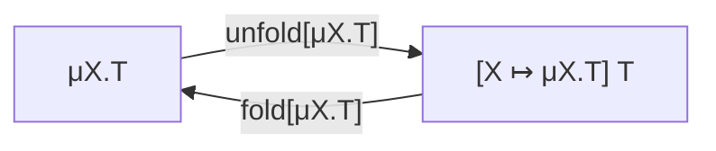
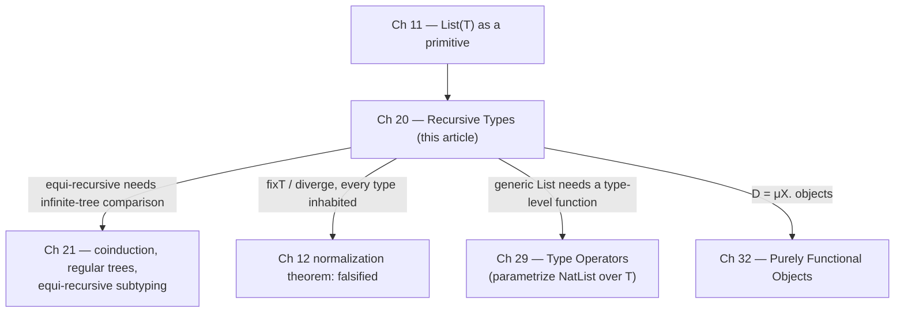

[[book-guidelines|↩ Back to guidelines]]

## The problem: a type that needs to mention itself

Go back to `List(T)` from §11.12 — lists were handed to you as a built-in
type constructor, typing and evaluation rules included for free. That was a
white lie. A list of numbers is really nothing more than a value built from
tools you already have: variants (`§11.10`) and tuples (`§11.7`). A `NatList`
is either the tag `nil` carrying nothing interesting, or the tag `cons`
carrying a number and *another list*:

$$
\texttt{NatList} = \texttt{<nil:Unit, cons:\{Nat,...\}>}
$$

Try to fill in that second field honestly and you hit the wall immediately:

$$
\texttt{NatList} = \texttt{<nil:Unit, cons:\{Nat,NatList\}>}
$$

The right-hand side mentions `NatList` — the very name you're defining. This
is not an ordinary definition (a new label for something you already
understand); it's a *recursive equation*, and nothing in the simply typed
calculus up to Chapter 19 tells you what to do with one. Ban it, and every
structure that "may grow to arbitrary size but has a simple, regular
structure" — lists, queues, binary trees, ASTs, streams — has to go back to
being a hard-wired primitive, one `List(T)`-style extension per shape. That
doesn't scale, and it's exactly the itch **recursive types** exist to
scratch: a *general* mechanism for defining self-referential types, so that
lists, trees, and streams all become instances of one construct instead of a
zoo of special cases.

**What this equation actually specifies.** Read `NatList = <nil:Unit,
cons:{Nat,NatList}>` not as an assignment but as a *description of an
infinite tree* — substitute the right-hand side for every occurrence of
`NatList` on the right-hand side, forever:

```
{nil: Unit, cons: {Nat, {nil: Unit, cons: {Nat, {nil: Unit, cons: {Nat, ...}}}}}}
```

That's a well-defined (if unbounded) object, and it's exactly the same move
as the recursive equation defining the factorial function on p. 52: you make
it into a proper, closed definition by pulling the "loop" onto the
right-hand side with an explicit binder. For types, that binder is $\mu$:

$$
\texttt{NatList} = \mu X.\, \texttt{<nil:Unit, cons:\{Nat,X\}>}
$$

Read aloud: "`NatList` is the infinite type satisfying $X =
\texttt{<nil:Unit,cons:\{Nat,X\}>}$." The bound variable $X$ stands for "the
whole type we're defining, recursively" — every free occurrence of $X$
inside $T$ in $\mu X.T$ is a placeholder for $\mu X.T$ itself.

**What breaks without indirection, concretely.** This isn't just a
type-theory nicety — every mainstream statically typed language runs into
the identical wall at the *implementation* level, and solves it the same way
TAPL is about to. A direct, un-indirected self-reference has no finite
representation a compiler could lay out in memory:

```rust
// This does not compile — Rust requires every type to have a
// statically-known, finite size, and this type's size would depend
// on its own size.
enum NatList {
    Nil,
    Cons(u64, NatList),   // error[E0072]: recursive type has infinite size
}
```

The fix Rust forces on you is indirection through a pointer:

```rust
enum NatList {
    Nil,
    Cons(u64, Box<NatList>),
}
```

`Box<NatList>` is a heap pointer of fixed size (one word), so `NatList`
itself now has a finite size regardless of how deep the list goes. Hold on
to this — it will turn out to be *exactly* what TAPL's `fold`/`unfold`
machinery is doing at the type level: introducing one layer of indirection
(an isomorphism to a differently-shaped type) so that a self-referential
definition becomes usable.

## Examples first, formalities second

TAPL deliberately works through a run of examples in the lighter,
annotation-free **equi-recursive** style (defined precisely below) before
introducing [[Higher-Order-Subtyping#The formal rules|the formal rules]] — the point being that the *idea* of recursive
types is independent of which formal treatment you pick.

### Lists

With `NatList = μX.<nil:Unit, cons:{Nat,X}>` in hand, the constructors and
destructors are exactly the case-analysis code you'd expect:

```
nil  = <nil=unit> as NatList;                              ⊢ nil  : NatList
cons = λn:Nat. λl:NatList. <cons={n,l}> as NatList;         ⊢ cons : Nat → NatList → NatList

isnil = λl:NatList. case l of <nil=u> ⇒ true | <cons=p> ⇒ false;   ⊢ isnil : NatList → Bool
hd    = λl:NatList. case l of <nil=u> ⇒ 0    | <cons=p> ⇒ p.1;     ⊢ hd    : NatList → Nat
tl    = λl:NatList. case l of <nil=u> ⇒ l    | <cons=p> ⇒ p.2;     ⊢ tl    : NatList → NatList
```

The typechecker silently unfolds `NatList` to `<nil:Unit,cons:{Nat,NatList}>`
whenever it needs to typecheck a `case` on it — this silent unfolding is the
equi-recursive convenience the next section names explicitly. A recursive
`sumlist` built from `fix`, `isnil`, `hd`, `tl` sums a list exactly as you'd
write it in any functional language. Pierce also flags something worth
sitting with: `NatList` is an *infinitely long type expression*, yet every
*value* of that type is a finite list — nothing in the term language (no
pairing, tagging, or call-by-value `fix`) can build an infinitely deep cons
chain. The infinity lives in the type, not (yet) in the values.

**Lean [[Bounded-Quantification#Grounding|grounding]].** This is precisely what an `inductive` declaration gives
you, except Lean makes the recursive equation, the fold, and the case
analysis all first-class and checked:

```lean
inductive NatList where
  | nil  : NatList
  | cons : Nat → NatList → NatList
```

`NatList.cons` *is* the `fold` — it takes a `Nat × NatList` (modulo currying)
and produces a `NatList`. Pattern-matching on a `NatList` (or `NatList.rec`,
the auto-generated recursor) *is* the `unfold` — it takes a `NatList` apart
into the shape `Nat → NatList → NatList` you can case on. You never see
`fold`/`unfold` written explicitly in Lean source, but the kernel is
inserting exactly TAPL's isomorphism witnesses under the hood every time you
write a constructor application or a `match`.

### Hungry functions, streams, and processes

TAPL then pushes past lists to show recursive types typing things that
*aren't* inductively-finite data at all. A "hungry function" absorbs
arguments forever, each application handing back another hungry function:

$$
\texttt{Hungry} = \mu A.\, \texttt{Nat} \to A
$$

```
f = fix (λf: Nat→Hungry. λn:Nat. f);        ⊢ f : Hungry
f 0 1 2 3 4 5;                              ⊢ <fun> : Hungry
```

A more useful variant is `Stream`, functions that consume `Unit` and hand
back a number *and* a new stream — a lazy, on-demand infinite sequence:

$$
\texttt{Stream} = \mu A.\, \texttt{Unit} \to \{\texttt{Nat}, A\}
$$

```
hd = λs:Stream. (s unit).1;      ⊢ hd : Stream → Nat
tl = λs:Stream. (s unit).2;      ⊢ tl : Stream → Stream

upfrom0 = fix (λf: Nat→Stream. λn:Nat. λ_:Unit. {n, f (succ n)}) 0;
hd (tl (tl (tl upfrom0)));       ⊢ 3 : Nat
```

`Process = μA. Nat→{Nat,A}` generalizes this further to a stateful reactive
process (feed it a number, get a number and a new process back), used to
build a running-sum accumulator. Streams are the case where a genuinely
*infinite* value exists at a recursive type — nothing stops `upfrom0` from
being unfolded forever, because the "next" element is only computed on
demand (behind a `λ_:Unit`), not eagerly materialized.

**Rust/Python grounding.** Rust's `Iterator` trait is the nominal,
"iso-recursive" cousin of `Stream` — an infinite `Stream` is idiomatically an
`impl Iterator<Item = u64>` that never returns `None`. In Python, where there
is no static type system to negotiate with, the same laziness falls straight
out of a generator:

```python
def stream_from(n):
    while True:
        yield n
        n += 1
```

No `fold`/`unfold`, no $\mu$ — dynamic typing sidesteps the whole
self-reference problem, because there's no static type equation to solve in
the first place. That's the tradeoff recursive types exist to buy back for a
*statically* typed language.

### Purely functional objects

Rearranging `Process` (a recursive function returning a tuple) into a
recursive *record* containing a function gives objects:

$$
\texttt{Counter} = \mu C.\, \{\texttt{get}{:}\texttt{Nat}, \texttt{inc}{:}\texttt{Unit}\to C\}
$$

Calling `inc` doesn't mutate — it returns a *new* `Counter`, and the
recursive type is exactly what lets you say the new object has "the same
type as the original" without naming `Counter` on the right twice by hand.
Because it's a record rather than a bare function, `Counter` extends
naturally to more methods (`dec`, and later `backup`/`reset` in the
exercises) — the same purely-functional object idiom this book returns to in
Chapter 32.

## Recursive values from recursive types: the well-typed `fix`

This is the section where recursive types stop being "a convenience for
data" and reveal something sharper. Chapter 9's Exercise 9.3.2 showed that
typing $x\,x$ (self-application) requires $x$ to have a function type whose
domain is $x$'s own type — no *finite* type has that property. A recursive
type does:

$$
\texttt{fix}_T = \lambda f{:}T\to T.\ \big(\lambda x{:}(\mu A.A\to T).\ f\,(x\,x)\big)\ \big(\lambda x{:}(\mu A.A\to T).\ f\,(x\,x)\big)
$$

$$
\vdash \texttt{fix}_T : (T \to T) \to T
$$

Erase the types and this is *literally* the untyped fixed-point combinator
from p. 65. The trick is entirely in how $x$ is typed: at type $\mu A.A\to
T$, unfolding gives $(\mu A.A\to T)\to T$ — a function whose domain is (an
unfolding of) $x$'s own type — so `x x` typechecks. No finite type could
close this loop; the infinite type does it "perfectly," in Pierce's words.

**This is the crack that lets divergence in.** A well-typed `fix` for every
type $T$ means you can write

$$
\texttt{diverge}_T = \lambda \_{:}\texttt{Unit}.\ \texttt{fix}_T\,(\lambda x{:}T.\,x) \;:\; \texttt{Unit}\to T
$$

a well-typed, non-terminating term at *every* type $T$. Two consequences,
both load-bearing for everything downstream in the type-theory literature:

1. **Strong [[Normalization|normalization]] dies.** Chapter 12 proved every well-typed
   simply-typed term terminates; recursive types kill that proof outright —
   `diverge` is a counterexample by construction.
2. **Every type becomes inhabited.** Under Curry–Howard (§9.4), "type $T$ is
   inhabited" reads as "proposition $T$ is provable." If *every* type has a
   term, then *every* proposition in the corresponding logic is "provable" —
   the logic is inconsistent. Systems with unrestricted recursive types are
   therefore useless as logics, even though they're perfectly good
   programming languages.

**Why this matters for a verifier, concretely (not just abstractly).** If
you are building a system that treats types-as-propositions and wants
*proof* out of a well-typed term — the Hoare-triple / dependent-contract
checker this vault is ultimately aimed at — point 2 is exactly the failure
mode you must design around. Unrestricted, unguarded self-reference in the
type former is what breaks consistency. This is precisely why Lean, Coq, and
Agda impose a **strict positivity** condition on `inductive` declarations:
the type being defined may only occur in *positive* (covariant, "output")
position in each constructor's argument types, never negative
("input"/contravariant) position. `Hungry = μA. Nat→A` is fine (positive: $A$
is the codomain). But the type that actually builds `fix`,

$$
D = \mu A.\, A \to T,
$$

has $A$ in the *domain* — a negative occurrence — and that is exactly the
shape the positivity checker exists to reject:

```lean
-- Lean refuses this: `A` occurs to the left of an arrow in its own
-- constructor, i.e. negatively. This is not a syntactic nitpick — it is
-- the kernel refusing to let you build TAPL's fixT and diverge terms,
-- which would make every proposition provable.
inductive Bad where
  | mk : (Bad → Nat) → Bad   -- error: non-positive occurrence of 'Bad'
```

So: TAPL's "recursive types break normalization and inhabit every type" and
Lean's "strict positivity restriction on inductives" are the *same fact*,
seen from two ends. TAPL shows you the disease (§20.1's `fixT`); Lean's
kernel shows you the cure (reject the type former that causes it). If your
own verifier's judgment forms ever admit a general $\mu$ without a
positivity check, you have silently reintroduced this inconsistency.

### Embedding the untyped lambda-calculus

The same trick, generalized, lets you embed the *entire* untyped
lambda-calculus inside a statically typed language with recursive types.
Let

$$
D = \mu X.\, X \to X,
$$

with injection `lam = λf:D→D. f as D : D` and application `ap = λf:D. λa:D.
f a : D` (unfolding `f`'s type recovers a function to apply). Every closed
untyped term $M$ compiles to an element $M^\star$ of $D$ by structural
translation ($x^\star = x$, $(\lambda x.M)^\star = \texttt{lam}(\lambda
x{:}D.M^\star)$, $(MN)^\star = \texttt{ap}\,M^\star\,N^\star$) — including the
untyped $Y$ combinator itself, `fixD`. Extending `D` to a variant
`<nat:Nat, fn:X→X>` lets `ap` case on whether it received a number or a
function, diverging (or raising an exception) on a mismatch — Pierce notes
this is *exactly* the run-time tag check a dynamically-typed language like
Scheme performs. In this precise sense, a statically typed language with
recursive types "includes" untyped/dynamically-typed computation as a
special case: $D$ is the type-theoretic analogue of the universal domains
used in denotational semantics of the untyped lambda-calculus.

## Iso-recursive vs. equi-recursive: the formal treatments

Everything above dodged one question: is $\mu X.T$ *literally the same
type* as its one-step unfolding $[X \mapsto \mu X.T]T$, or merely
*isomorphic* to it? The two answers are the two standard formal treatments
of recursive types (the names — a recent, "pleasantly mnemonic" coinage —
are due to Crary, Harper, and Puri, 1999):

**1. Equi-recursive.** $\mu X.T$ and its unfolding are *definitionally
equal* — interchangeable in every context, because they denote the same
infinite tree. The typechecker is responsible for silently accepting a term
of one where the other is expected. This is the style used informally
throughout §20.1 above. Its virtue: allowing type *expressions* to be
infinite is the *only* change needed to the declarative system you already
have — safety theorems and proofs carry over untouched, as long as they
don't rely on induction over type expressions (which, unsurprisingly, no
longer works over an infinite tree). Its cost: a typechecker can't literally
store or compare infinite trees, so *implementing* equi-recursive
typechecking needs real machinery — regular-tree representations and
coinductive [[Subtyping|subtyping]]/equality algorithms, the subject of the whole of
Chapter 21.

**2. Iso-recursive.** $\mu X.T$ and its unfolding are *different but
isomorphic* types, and the isomorphism has to be invoked explicitly, in both
directions, by name:

$$
\texttt{unfold}[\mu X.T] : \mu X.T \to [X \mapsto \mu X.T]\,T
\qquad
\texttt{fold}[\mu X.T] : [X \mapsto \mu X.T]\,T \to \mu X.T
$$



The full calculus $\lambda^\mu_\to$ (Figure 20-1) extends $\lambda_\to$ with:

$$
\begin{array}{lll}
t ::= \ldots \mid \texttt{fold}\,[T]\,t \mid \texttt{unfold}\,[T]\,t
& \qquad
v ::= \ldots \mid \texttt{fold}\,[T]\,v
& \qquad
T ::= \ldots \mid X \mid \mu X.T
\end{array}
$$

$$
\dfrac{t_1 \to t_1'}{\texttt{fold}\,[T]\,t_1 \to \texttt{fold}\,[T]\,t_1'} \;(\textsc{E-Fld})
\qquad
\dfrac{t_1 \to t_1'}{\texttt{unfold}\,[T]\,t_1 \to \texttt{unfold}\,[T]\,t_1'} \;(\textsc{E-Unfld})
$$

$$
\texttt{unfold}\,[S]\,(\texttt{fold}\,[T]\,v_1) \to v_1 \;(\textsc{E-UnfldFld})
$$

$$
\dfrac{U = \mu X.T_1 \qquad \Gamma \vdash t_1 : [X\mapsto U]T_1}{\Gamma \vdash \texttt{fold}\,[U]\,t_1 : U} \;(\textsc{T-Fld})
\qquad
\dfrac{U = \mu X.T_1 \qquad \Gamma \vdash t_1 : U}{\Gamma \vdash \texttt{unfold}\,[U]\,t_1 : [X\mapsto U]T_1} \;(\textsc{T-Unfld})
$$

**E-UnfldFld is the whole isomorphism, operationally.** `unfold` meeting a
`fold` head-on just annihilates — you get the underlying value back,
untouched. (Note the rule doesn't require the two type annotations to
literally match; that's only guaranteed at run time *because* the program
was well-typed to begin with — checking it again would mean invoking the
typechecker during evaluation.)

**What breaks without the annotations.** Iso-recursive typing is
*notationally heavier* — every constructor use needs an explicit `fold`,
every case analysis needs an explicit `unfold` — but the payoff is that
typechecking stays a simple, syntax-directed, structural procedure: no
infinite-tree comparison, no coinduction, nothing beyond what Chapters 8–11
already gave you. In practice the annotations get absorbed into other
syntax you were writing anyway: an ML `datatype`/Rust `enum` constructor
application is an implicit `fold`, and a `match`/pattern-match arm is an
implicit `unfold`; a Java (or Rust) method call on an object of a
self-referential class implicitly `unfold`s the object's type to get at its
method table. That's why the iso-recursive style, despite the extra
ceremony on paper, is what essentially every mainstream statically typed
language actually implements.

Rewriting the `NatList` example in fully explicit iso-recursive style makes
the fold/unfold bookkeeping concrete:

```
NLBody = <nil:Unit, cons:{Nat,NatList}>;

nil  = fold [NatList] (<nil=unit> as NLBody);
cons = λn:Nat. λl:NatList. fold [NatList] <cons={n,l}> as NLBody;

isnil = λl:NatList. case unfold [NatList] l of
                       <nil=u> ⇒ true | <cons=p> ⇒ false;
hd    = λl:NatList. case unfold [NatList] l of
                       <nil=u> ⇒ 0    | <cons=p> ⇒ p.1;
tl    = λl:NatList. case unfold [NatList] l of
                       <nil=u> ⇒ l    | <cons=p> ⇒ p.2;
```

Compare directly against §20.1's equi-recursive version above — the *terms*
built are the same values; only the annotation burden differs.

**Rust grounding for `fold`/`unfold`, done for real.** The `Box<NatList>`
indirection from the opening section is Rust's version of `fold`/`unfold`:
`Cons(n, Box::new(rest))` is the `fold` (nominal constructor wrapping one
layer), and matching `Cons(n, rest)` — with `*rest` to deref the box — is
the `unfold`. The self-application example from §20.1 makes the same point
in a sharper, minimal form: Rust cannot express `μA.A→i32` directly (an
unnameable, unbounded type), but a `struct` wrapper gives you exactly the
iso-recursive isomorphism by hand:

```rust
// SelfApp is nominally isomorphic to `SelfApp -> i32`, via the two
// operations below — this *is* fold/unfold, spelled with Rust's own
// nominal-type machinery instead of an anonymous μ-type.
struct SelfApp<'a>(Box<dyn Fn(SelfApp<'a>) -> i32 + 'a>);

fn apply<'a>(f: SelfApp<'a>, x: SelfApp<'a>) -> i32 {
    (f.0)(x)   // "unfold": recover the function hidden inside f
}
// SelfApp(Box::new(some_closure)) is the corresponding "fold".
```

This is precisely the shape of trick used to write fixed-point combinators
in Rust: wrap the self-applying closure in a newtype so the compiler has a
finite type to check against, then `fold` in and `unfold` out at each
self-application site — mechanically identical to `fold [μA.A→T]` /
`unfold [μA.A→T]` in $\lambda^\mu_\to$.

## Subtyping, previewed

Recursive types interact with subtyping (Chapter 15) in a way that can't be
settled by the tools available in this chapter. Given `Even <: Nat`, what's
the relation between $\mu X.\texttt{Nat}\to(\texttt{Even}\times X)$ and
$\mu X.\texttt{Even}\to(\texttt{Nat}\times X)$? Reasoning about the
equi-recursive "infinite unfolding" directly — reading both types as
infinite reactive processes and applying ordinary contravariant-argument /
covariant-result subtyping at every level — makes the first a subtype of the
second (it demands less of its argument, promises more of its result, at
every depth). Formalizing that "in the limit" argument rigorously needs
coinduction, which is the subject of Chapter 21.

## Where this leads



- **Immediate dependency (Ch 21):** the equi-recursive style used casually
  throughout §20.1 is only *justified* once Chapter 21 gives you a
  coinductive definition of subtyping/equality over infinite (regular)
  trees, plus a decidable algorithm for checking it. This chapter shows you
  the destination; the next shows you why you're allowed to get there.
- **Undoes Chapter 12:** the normalization theorem for $\lambda_\to$ is not
  amended here — it's simply false once $\mu$-types are added, via
  $\texttt{fix}_T$/$\texttt{diverge}_T$. Any future work with recursive
  types has to give up on termination guarantees the earlier chapters
  provided for free.
- **Feeds the verifier/elaborator project directly:** the iso- vs.
  equi-recursive choice is a live design decision, not a historical
  footnote, for exactly the systems this vault is aimed at. Iso-recursive
  `fold`/`unfold` is a *decidable, syntax-directed* typing discipline — the
  same property you want from a Hoare-triple checker's judgment forms if you
  want typechecking (and thus verification) to terminate predictably.
  Equi-recursive convenience pushes the burden onto the typechecker/unifier
  to decide type equality over unbounded structure — structurally the same
  problem your elaborator's `isDefEq`-style unifier faces whenever
  definitional equality has to look through recursive `def`s or unfold
  metavariable-headed terms. And the strict-positivity story above is not
  optional background: it is the actual soundness condition your verifier's
  type formers must satisfy if you ever let users define their own
  recursive predicates/types, on pain of reproducing `diverge_T` and making
  every proposition provable.
- **Generalizes later:** the `#1: We ignore … how to give a single, generic
  definition of lists with elements of an arbitrary type T` aside in the
  chapter's own footnote is a direct pointer to Chapter 29's type operators
  — recursive types plus type-level abstraction is what finally lets you
  write one polymorphic `List` instead of a fresh `μX...` per element type.
