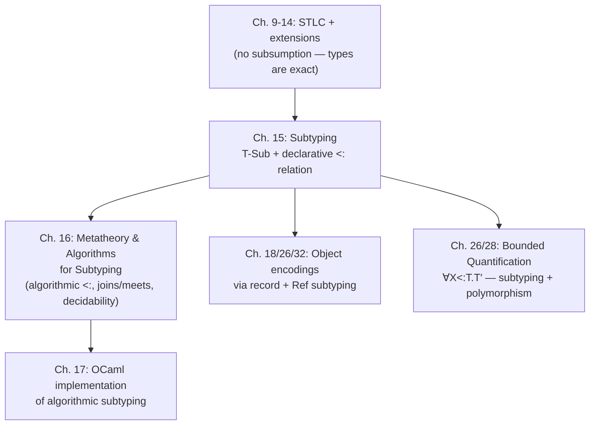

[[book-guidelines|↩ Back to guidelines]]

## What breaks without it

Take the simply typed lambda-calculus exactly as Chapter 9 left it — no subtyping, just `T-Var`, `T-Abs`, `T-App`, plus the record and function extensions of Chapter 11. Now typecheck this term:

```
(λr:{x:Nat}. r.x) {x=0, y=1}
```

The function only ever looks at `r.x`. Nothing about its body cares whether `r` also happens to have a `y` field. And yet `T-App` demands that the argument's type match the parameter's type *exactly*:

$$
\frac{\Gamma \vdash t_1 : T_{11}\to T_{12} \qquad \Gamma \vdash t_2 : T_{11}}{\Gamma \vdash t_1\,t_2 : T_{12}} \quad(\text{T-App})
$$

`{x=0,y=1}` has type `{x:Nat,y:Nat}`, the function expects `{x:Nat}`, and those are different types under `T-App`'s premise — so the term is rejected, full stop. This is exactly the failure mode the [[Type-Safety]] article's "uniqueness of types" property predicts: without subsumption, every well-typed term has one type and one derivation, and "one type" means no wiggle room. The rejection here isn't catching a real bug; it's the type system being needlessly rigid about a program a human can see is fine. Multiply this by every function that takes a record, an object, or a callback, and you get a type system nobody wants to program in — which is exactly why virtually no real language stops at plain STLC.

**Subtyping is the fix.** The idea: define a relation $S <: T$ ("S is a subtype of T") meaning *any value of type S can be used safely wherever a value of type T is expected* — and add exactly one new typing rule that lets you use it.

## The subsumption rule

$$
\frac{\Gamma \vdash t : S \qquad S <: T}{\Gamma \vdash t : T} \quad(\text{T-Sub})
$$

Read T-Sub literally: if `t` has type `S`, and `S` is a subtype of `T`, then `t` also has type `T`. This is the *only* new typing rule Chapter 15 adds — subtyping doesn't touch `T-App`, `T-Abs`, or any evaluation rule. All the actual work is deciding what goes in the `<:` relation, and once `{x:Nat,y:Nat} <: {x:Nat}` is a theorem, T-Sub derives `⊢ {x=0,y=1} : {x:Nat}` and the motivating example typechecks.

Pierce calls this reading of `<:` the **principle of safe substitution**. A looser but often more intuitive reading: think of a type as *the set of values it describes*, and read $S <: T$ as "the set $S$ is a subset of the set $T$." Both readings coincide for the rules in this chapter (Pierce flags in §15.6 that other, coercion-based readings exist too — more on that below).

**What breaks without T-Sub specifically:** you could imagine trying to solve the rigidity problem by baking a special case into `T-App` alone ("argument type just needs `⊆`-compatible fields"). That doesn't generalize — you'd need a parallel special case in every rule that consumes a term at a given type (assignment, record construction, list elements, ...). T-Sub factors this into one rule plus a separately-specified relation, so every other typing rule stays untouched and *automatically* benefits from whatever `<:` turns out to mean.

## The subtype relation itself: a preorder, built type-constructor by type-constructor

`<:` is defined by inference rules, exactly like the evaluation and typing relations before it — the smallest relation closed under the rules below. Two structural rules apply regardless of type shape:

$$
S <: S \quad(\text{S-Refl}) \qquad\qquad \frac{S <: U \qquad U <: T}{S <: T} \quad(\text{S-Trans})
$$

Reflexive and transitive — a **preorder**, not a partial order (as we'll see, it's not antisymmetric: distinct types can be subtypes of each other). Everything else is added per type constructor.

### Records: width, depth, and permutation

This is where the intuition needs the most care, because the direction is counterintuitive at first: **the type with *more* fields is the subtype.**

$$
\{l_i:T_i\ ^{i\in 1..n+k}\} <: \{l_i:T_i\ ^{i\in 1..n}\} \quad(\text{S-RcdWidth})
$$

Read a record type `{x:Nat}` not as "exactly the fields x" but as "*at least* a field x of type Nat" — the set of all records satisfying that. `{x:Nat,y:Nat}` is a more demanding (more informative) specification, so it describes a smaller set of values — a proper subset — hence a subtype. Width subtyping formalizes "it's safe to forget trailing fields you don't need."

Depth subtyping lets field *types* vary covariantly, field by field:

$$
\frac{\text{for each } i \quad S_i <: T_i}{\{l_i:S_i\ ^{i\in 1..n}\} <: \{l_i:T_i\ ^{i\in 1..n}\}} \quad(\text{S-RcdDepth})
$$

And permutation says field order is semantically irrelevant, because the only thing you can do with a record is project a named field:

$$
\frac{\{k_j:S_j\ ^{j\in 1..n}\}\text{ is a permutation of }\{l_i:T_i\ ^{i\in 1..n}\}}{\{k_j:S_j\ ^{j\in 1..n}\} <: \{l_i:T_i\ ^{i\in 1..n}\}} \quad(\text{S-RcdPerm})
$$

S-RcdPerm is precisely what breaks antisymmetry: `{a:Nat,b:Bool} <: {b:Bool,a:Nat}` and vice versa, yet they're not the same type syntactically.

These three rules capture genuinely separate freedoms — some languages (Pierce notes Abadi and Cardelli's object calculus) allow depth and permutation but not width. Combined with S-Trans, they let you build derivations that drop, narrow, and reorder fields all at once:

```
S-RcdWidth                                   S-RcdWidth
{a:Nat,b:Nat} <: {a:Nat}     {m:Nat} <: {}
──────────────────────────   ──────────────  S-RcdDepth
{x:{a:Nat,b:Nat},y:{m:Nat}} <: {x:{a:Nat},y:{}}
```

**Rust/TypeScript contrast, not mapping.** This is a case where forcing a Rust analogy would mislead. Rust has *no* structural width/depth/permutation subtyping between distinct structs — `struct Point2 { x: f64, y: f64 }` and `struct Point3 { x: f64, y: f64, z: f64 }` are unrelated nominal types, full stop, even though `Point3` obviously has "more information" than `Point2`. Rust solves the "accept more than exactly T" problem a completely different way: **traits and generics**. A function that only needs an `x` field takes a type parameter bounded by a trait exposing `x`:

```rust
trait HasX { fn x(&self) -> f64; }

fn get_x<R: HasX>(r: &R) -> f64 { r.x() }
```

This is *structural in effect* (any type implementing `HasX` works) but *nominal in mechanism* (you must explicitly `impl HasX for Point3`). TAPL's records are the more honest analogue to TypeScript, whose object types really are structural:

```ts
function getX(r: { x: number }): number { return r.x; }
getX({ x: 1, y: 2 });  // fine — width subtyping, unannotated, unavoidable
```

TypeScript accepting `{x: 1, y: 2}` where `{x: number}` is expected is literally S-RcdWidth plus T-Sub, unannotated and automatic — that's genuinely what Pierce's rules describe, unlike Rust's trait-based workaround.

### Functions: contravariant in, covariant out — and *why*

$$
\frac{T_1 <: S_1 \qquad S_2 <: T_2}{S_1 \to S_2 <: T_1 \to T_2} \quad(\text{S-Arrow})
$$

Notice the argument-type premise runs *backwards*: to get $S_1{\to}S_2 <: T_1{\to}T_2$ you need $T_1 <: S_1$ (supertype direction) but $S_2 <: T_2$ (subtype direction, matching the outer relation). This is not an arbitrary rule to memorize — it falls straight out of what T-Sub is supposed to guarantee: *substitutability*.

Say you have `f : S1 → S2` and a context expects something of type `T1 → T2`. For it to be safe to hand `f` to that context, two things must hold:

1. **Every argument the context might pass in has type `T1`.** For `f` to accept it without surprise, `f` must be willing to take anything of type `T1`. `f` already accepts everything of type `S1`. So we need $T_1 <: S_1$ — every `T1` is also usable as an `S1`. If it were the other way ($S_1 <: T_1$), the context could pass some `T1`-typed value that isn't actually an `S1`, and `f` would choke on it. **This is why argument position is contravariant**: the substitutability requirement flows from the *caller's* obligation, which is opposite in direction to the *callee's* declared input type.
2. **Every result `f` returns must be usable as a `T2`.** `f` promises results of type `S2`. The context expects to use results as `T2`. So we need $S_2 <: T_2$ — same direction as the outer relation, hence **covariant**.

The mnemonic: a function is safer to substitute in if it demands *less* of its caller (accepts a wider range of arguments — contravariant, "be liberal in what you accept") and promises *more* to its caller (returns a narrower, more specific range of results — covariant, "be conservative in what you produce"). This is Postel's-law-shaped for a reason — it's the exact same substitutability argument, formalized.

**Where this bites in practice, and where Rust actually does show it:** unlike records, Rust *does* have variance, just at the lifetime level rather than for user-defined structural subtyping. `fn(&'a str)` is contravariant in `'a`; a function usable wherever `fn(&'static str)` is expected must accept *any* shorter-lived `&'a str` too — same argument, same direction. Rust's variance rules for `fn(T) -> U` types are literally S-Arrow specialized to lifetimes: contravariant in argument position, covariant in return position. If you've ever fought a "expected fn pointer, found a different fn pointer" lifetime error, that's the compiler enforcing exactly this rule.

### `Top`: the universal supertype

$$
S <: \text{Top} \quad(\text{S-Top})
$$

`Top` is a maximal element — everything is a subtype of it. It corresponds to `Object` in Java/C#, `object` in Python (loosely), `Any` in TypeScript's unsound-if-abused sense. Pierce notes it's not strictly *necessary* — you can build the whole safety story without it — but it's convenient, and becomes load-bearing once [[Bounded-Quantification|bounded quantification]] arrives (unbounded `∀X.T` gets recovered as `∀X<:Top.T` — see the closing synthesis).

The book also introduces (and then largely sets aside) a dual **`Bottom`** type, subtype of everything, uninhabited by any closed value — useful for typing non-returning expressions like `raise`/`error`, but it complicates algorithmic typing enough that Pierce omits it from the rest of the book (deferred to §16.4, §28.8).

### Preserving type safety through subsumption

Adding T-Sub is not free — it changes what the [[Type-Safety]] proofs have to account for, even though the final *theorem statements* (progress, preservation) are unchanged. Two structural facts do the load-bearing work:

- **Inversion of subtyping** (Lemma 15.3.2): if $S <: T_1 \to T_2$, then $S$ itself must be an arrow type $S_1 \to S_2$ with $T_1 <: S_1$ and $S_2 <: T_2$; if $S$ is a subtype of a record type, $S$ must itself be a record with at least those fields, appropriately related. This is what lets the **canonical forms lemma** still pin down the *shape* of a value even though its type might have been reached via several T-Sub steps.
- **Substitution lemma**, restated and reproved with a new case for T-Sub — mechanically routine, but every proof by induction on typing derivations in this chapter now needs a T-Sub case, and preservation's `E-AppAbs` case specifically needs subtyping-inversion to line up the actual argument type with what the function body expects.

This is the "brief extra argument" the book-level goals flag as worth naming explicitly: subsumption doesn't threaten safety, but every metatheoretic proof from Chapter 9 onward needs exactly one more case, following the same pattern. See [[Type-Safety]] for the full progress/preservation machinery this slots into.

## Interaction with other constructors: the variance table

Not every type constructor gets to choose its variance freely — safety constrains it. TAPL surveys several:

| Constructor | Variance | Why |
|---|---|---|
| Record `{...}` fields | covariant | reading a field is the only operation; a narrower field type is always safely usable |
| Function argument | **contravariant** | caller substitutability (derived above) |
| Function result | covariant | callee substitutability (derived above) |
| `List T` | covariant | you can only read elements out |
| `Ref T` | **invariant** | both read *and* write — see below |
| `Source T` (read-only capability) | covariant | read-only, same argument as `List` |
| `Sink T` (write-only capability) | contravariant | write-only, same argument as function *argument* position |

The `Ref` case is the sharpest illustration of *why* variance isn't a stylistic choice. `Ref T` supports both `!` (read, needs covariance: a `Ref S` used for reading is safe as a `Ref T` if $S<:T$) and `:=` (write, needs contravariance: safe if $T<:S$, so nothing gets written that violates what other holders expect to read back out). Both must hold simultaneously, forcing:

$$
\frac{S_1 <: T_1 \qquad T_1 <: S_1}{\text{Ref}\ S_1 <: \text{Ref}\ T_1} \quad(\text{S-Ref})
$$

i.e., $S_1$ and $T_1$ must be mutually subtypes — invariant. Reynolds's Forsythe refines this by splitting `Ref T` into `Source T` (covariant, read-only) and `Sink T` (contravariant, write-only) capabilities, each independently variant because each only supports one of the two operations — `Ref T <: Source T` and `Ref T <: Sink T` recover the combined capability as a special case.

**Rust [[Bounded-Quantification#Grounding|grounding]], precisely because it's a contrast:** `&T` behaves like `Source T` (covariant — `&'static str` usable as `&'a str`), `&mut T` behaves like an *invariant* reference for essentially the `Ref` reason (through a `&mut T` you can both read and write, so soundness forces invariance in `T`, exactly mirroring S-Ref). This is precisely why Rust's borrow checker treats `&mut T` as invariant in `T` while `&T` is covariant — it's the same soundness argument TAPL just walked through, applied to Rust's own reference types.

Java's actual array covariance (`S-ArrayJava`, unsound, compensated by a runtime `ArrayStoreException` check on every store) is TAPL's own worked cautionary tale of what happens when you pick the *wrong* variance for a mutable container and patch soundness back in at runtime rather than in the type system.

## Coercion semantics: subtyping as compiled-away conversions (brief)

Everything so far treats subtyping as "semantically insignificant" — it doesn't change evaluation, only which terms typecheck (the **subset semantics**: `S <: T` means the values of `S` literally are values of `T`). §15.6 sketches an alternative: compile each use of T-Sub into an explicit **coercion function**, generated structurally from the subtyping derivation (S-Refl becomes `λx. x`; S-Top becomes "discard, return unit"; S-RcdWidth becomes "project down to the smaller record"; and so on), and physically transform values at runtime — e.g. re-tag an `Int` as a `Float`, or physically reorder record fields to avoid runtime field-lookup search.

This raises a genuine hazard called **coherence**: if a term is typable via two different subtyping derivations (e.g., promoting `Bool` to `String` via `Int` versus via `Float`, with different `intToString`/`floatToString` results), the two compiled coercions might behave *differently* — meaning program behavior would depend on an internal compiler choice invisible to the programmer. A coercion semantics is only acceptable if it's proven coherent (all derivations of the same judgment compile to behaviorally-equivalent terms).

## Intersection and union types (brief)

§15.7 extends the relation with $T_1 \wedge T_2$ (intersection, a greatest lower bound: $T_1\wedge T_2 <: T_1$, $T_1\wedge T_2<:T_2$, and anything below both is below the intersection) and $T_1 \vee T_2$ (union, dual). Intersections support finitary overloading — one operator with type $(\text{Nat}{\to}\text{Nat}{\to}\text{Nat}) \wedge (\text{Float}{\to}\text{Float}{\to}\text{Float})$ — but push expressive power far enough that, in a call-by-name setting, typability becomes exactly equivalent to [[Normalization|normalization]] of the underlying untyped term, which immediately makes full [[Type-Reconstruction|type reconstruction]] undecidable. Both are mentioned here as the relation's outer boundary, not developed further in this chapter.

## Where this leads



This chapter deliberately stopped at the *declarative* relation — reflexive, transitive, defined by rules that are elegant to state but not directly an algorithm (S-Refl and S-Trans apply everywhere, so a naive syntax-directed reader doesn't know when to stop). The sibling article [[Metatheory and Algorithms for Subtyping]] (Ch. 16) picks up exactly there: removing S-Refl/S-Trans in favor of syntax-directed rules that are provably equivalent, computing minimal types via **joins** (at `if`-branches — you need the least common supertype, not identical branch types) and **meets** (at function-argument positions), and establishing decidability.

**For the standing compiler/elaborator project:** this chapter is the concrete reason "just run unification" stops being enough the moment a language has subtyping. Plain Hindley-Milner unification asks "are these two types *equal*?" and fails otherwise; once `<:` exists, the right question at an application site is "is the argument's type a subtype of the parameter's type?" — a strictly weaker, directional check that unification's equality-only machinery can't express. This is exactly why real typecheckers with subtyping (or with any directional relation — bidirectional inference/checking is the same shape) move from unification to **constraint-based typing** with subtype constraints, solved by computing joins/meets rather than most-general unifiers. A Rust-style verifier that wants Hoare-triple-style "this value satisfies a weaker postcondition than required" reasoning will hit the identical join/meet computation this chapter is setting up — Chapter 16 is where that machinery actually gets built.
