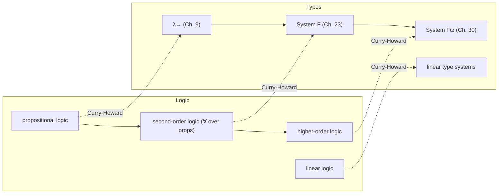

[[book-guidelines|↩ Back to guidelines]]

## Why this shows up in the middle of a typing chapter

TAPL introduces the Curry-Howard correspondence almost as an aside, tucked into §9.4 right after the properties-of-typing machinery for $\lambda_\to$. That placement is deliberate. Pierce has just finished giving you two typing rules for the function type $T_1 \to T_2$:

- `T-Abs` — how you *construct* a term of a function type (write a $\lambda$-abstraction).
- `T-App` — how you *use* a term of a function type (apply it to an argument).

He then names a pattern you'll see for every type constructor in the rest of the book: an **introduction rule** (how to build a value of the type) paired with an **elimination rule** (how to consume one). `T-Abs` introduces $\to$; `T-App` eliminates it. When an introduction form is fed directly into its own elimination form — a $\lambda$-abstraction immediately applied — you get a *redex*, an opportunity for computation.

That introduction/elimination vocabulary is not incidental terminology. It's borrowed wholesale from constructive logic, where every connective ($\land$, $\lor$, $\Rightarrow$, ...) also comes with an introduction rule (how to prove it) and an elimination rule (how to use a proof of it once you have one). Pierce's point in §9.4 is that this isn't a superficial naming coincidence — the typing rules of $\lambda_\to$ and the proof rules of a constructive propositional logic are, structurally, *the same rules*, just wearing different labels.

**What breaks if you miss this:** if you treat "introduction/elimination" as book jargon, you'll re-derive it by pattern-matching every chapter forward (products, sums, universals, existentials all get the same two-rule shape) instead of recognizing it as one idea applied uniformly. Worse, you'll miss *why* type systems for real languages can be designed by literally importing decades of proof theory — which is exactly what happens later with linear types (from linear logic) and [[Dependent-Types|dependent types]] (from higher-order logic).

## The core idea: proofs are programs, propositions are types

Constructive logic (as opposed to classical logic) insists that a proof of a proposition $P$ is not just an assertion that $P$ is true — it's *concrete evidence* for $P$. Curry and Howard's observation is that this evidence has a computational shape:

- A proof of $P \supset Q$ (implication) is a procedure: hand it a proof of $P$, it hands back a proof of $Q$. That's a function.
- A proof of $P \land Q$ (conjunction) is a proof of $P$ together with a proof of $Q$. That's a pair.

Under this reading, a well-typed term of the simply typed lambda-calculus *is* a proof of the proposition its type denotes. TAPL gives the correspondence as this table (preserved exactly, including its own cross-reference to §11.6 for products):

| Logic | Programming languages |
|---|---|
| proposition $P$ | type $T$ |
| proposition $P \supset Q$ | type $P \to Q$ |
| proposition $P \land Q$ | type $P \times Q$ (see §11.6) |
| proof of proposition $P$ | term $t$ of type $P$ |
| proposition $P$ is provable | type $P$ is inhabited (by some term) |

Two consequences fall out of this immediately, and TAPL flags both explicitly:

1. **Typechecking is proof-checking.** Deciding $\Gamma \vdash t : T$ is deciding whether $t$ is a valid proof term for proposition $T$ under the hypotheses in $\Gamma$. This is why type systems can be designed with the rigor of proof theory rather than ad hoc engineering.
2. **Reduction is proof simplification.** Beta-reduction ($\beta$-reduction) of lambda-terms corresponds to *cut elimination* in the logic — the proof-theoretic process of removing a detour where you prove something just to immediately use it. A redex (introduction fed straight into elimination) is exactly a cut; reducing it is exactly eliminating the cut.

This is why the correspondence has two names in the literature that both appear in TAPL: the **Curry-Howard correspondence** (or **isomorphism**) and the **propositions-as-types** analogy — the second name is arguably the more direct description of what's actually being claimed.

### Grounding: the identity function as a trivial proof

The cleanest instance is the type $A \to A$ — read logically, the proposition "$A$ implies $A$," which is trivially true no matter what $A$ is. Its (unique, up to convention) proof term is the identity function.

```rust
// The proposition A ⊃ A, proved by the term λx:A. x
fn identity<A>(x: A) -> A {
    x
}
```

There is exactly one "shape" of proof here — take the hypothesis, hand it straight back — and that's exactly why `identity` is the only reasonable implementation of this signature (this is a first taste of *parametricity*, developed properly in TAPL Chapter 23 on System F). In Rust, the type signature `fn identity<A>(x: A) -> A` isn't just documentation — under Curry-Howard it *is* a proposition, and the function body is its proof.

Lean makes this identification completely literal, because Lean's kernel is built directly on this correspondence — the `theorem` and `def` keywords produce the same kind of object internally:

```lean
-- As a program:
def identity (A : Type) (x : A) : A := x

-- As a proof, of the proposition A → A:
theorem A_implies_A (A : Prop) : A → A := fun x => x
```

The only difference between these two declarations in Lean is whether `A` lives in `Type` (a data type) or `Prop` (a proposition) — syntactically the proof term `fun x => x` and the program `x => x` are the identical lambda-term. This is not an analogy for Lean; `isDefEq`, Lean's definitional-equality checker, is doing the exact same job whether it's checking that two *programs* compute the same value or that two *proof terms* prove the same proposition — because to the kernel, there is no difference between the two questions.

### Grounding: conjunction as a pair, elimination as projection

The $P \land Q$ line of the table says a proof of a conjunction is a pair of proofs — and the introduction/elimination rules for $\times$ (given in full in TAPL §11.6, but previewable now) mirror `T-Abs`/`T-App` exactly: you *introduce* a pair by supplying both components, and you *eliminate* it by projecting one out.

```rust
// proposition P ∧ Q, proved by evidence for both P and Q
struct And<P, Q> {
    proof_p: P,
    proof_q: Q,
}

fn and_intro<P, Q>(p: P, q: Q) -> And<P, Q> {   // introduction: T-Pair
    And { proof_p: p, proof_q: q }
}

fn and_elim_left<P, Q>(pair: And<P, Q>) -> P {  // elimination: T-Proj1
    pair.proof_p
}
```

Every type constructor TAPL introduces from here forward will follow this same two-rule discipline — sums (`inl`/`inr` introduce, `case` eliminates, corresponding to $\lor$ in Chapter 11), universal quantification (type abstraction introduces, type application eliminates, corresponding to $\forall$ in Chapter 23), [[Existential-Types|existential types]] (pack introduces, unpack eliminates, corresponding to $\exists$ in Chapter 24). Once you've internalized the pattern here, those chapters are mostly "same shape, new connective."

## Not one logic — a family of correspondences

TAPL is explicit that this isn't a one-off cute fact about $\lambda_\to$ and propositional logic; it generalizes systematically as the type system gets richer:

- System F's parametric polymorphism (quantification over types) corresponds to second-order constructive logic (quantification over propositions).
- System $F^\omega$ corresponds to a higher-order logic.
- Girard's linear logic gives rise to linear type systems (tracking resource usage — a value used exactly once).
- Modal logics inform frameworks for staged/run-time code generation.

The correspondence, in other words, is a two-way street between type theory and proof theory: a new logic suggests a new type system, and a new type system reveals a logic it was implicitly encoding all along.



## Where this leads

Structurally, §9.4 is the seed of a pattern that recurs for the rest of the book: every new type constructor TAPL adds — products and sums in Chapter 11, universals in Chapter 23, existentials in Chapter 24, dependent Pi-types in Chapter 30 — gets introduced by giving its introduction and elimination rules, and each of those pairs is *also* a logical connective's proof rules wearing a type-theoretic hat. Chapter 24's existential types, for instance, correspond to $\exists$, and Chapter 30's brief look at dependent types is exactly the point where propositions-as-types stops being a comment on the side and becomes the design principle of the whole system (a dependent Pi-type $\Pi x{:}T_1.T_2$ *is* a universally quantified proposition whose truth can depend on the specific witness $x$).

This is precisely the isomorphism a Lean-style elaborator is built on top of. Lean's kernel does not have a separate "proof checker" and "type checker" — it has one typing judgment, and `Prop`-sorted terms happen to be the ones we call proofs. When Lean's `isDefEq` decides whether two terms are definitionally equal, or its unifier resolves an implicit argument, it is manipulating proof terms and program terms by the same rules, because after Curry-Howard there is no formal distinction between them. Anyone building a smaller version of that machinery — a bidirectional elaborator, a metavariable unifier, a Hoare-triple checker that treats a specification as a proposition to be proved by a well-typed term — is building directly on the equivalence TAPL states in this one short section: *checking a proof is checking a type, and constructing a proof is writing a program.*
