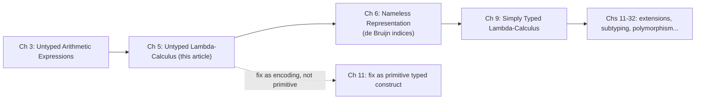

[[book-guidelines|↩ Back to guidelines]]

## Why you need this before you need types

Chapter 3 of TAPL gave you a language of arithmetic expressions and booleans — enough to build an evaluator and prove things about it, but not enough to write a *program*. There's no way to abstract a computation into a reusable, parameterized unit. If you wanted "the thing that squares its input," you were out of luck; the language had no notion of a function.

The untyped lambda-calculus fixes exactly that gap, and it does it in the most extreme way possible: instead of adding "functions" as one more feature bolted onto arithmetic, it throws arithmetic away and rebuilds everything — booleans, numbers, pairs, even recursion — out of nothing but functions. Pierce calls it the "computational substrate" for the rest of the book (p. 51) for a reason: every typed language TAPL builds later is this calculus plus a type system layered on top. If you don't have a precise mental model of what's happening here — what a redex is, why substitution is harder than it looks, what call-by-value actually commits you to — every later chapter's typing rules will look like arbitrary symbol-pushing instead of "the thing that rules out the bad cases of *this*."

There's a second reason the book front-loads this material: the untyped lambda-calculus is Turing-complete. That's simultaneously the payoff (you can encode essentially any computation) and the danger (some terms simply never finish evaluating — there is no algorithm that decides in advance which ones). Keep that tension in the back of your mind through this whole article; it's the entire reason Chapter 9 onward exists. A type system's real job is to sacrifice some of this expressive power in exchange for the *guarantee* that well-typed programs cannot get stuck (though, as you'll see, not the guarantee that they terminate — general recursion survives typing intact).

## The syntax: three things, that's it

Pierce gives the grammar as an inductive definition (Definition 5.3.1, p. 69) — the same "smallest set closed under these rules" pattern from Chapter 2 applied to a new alphabet:

$$
t ::= \quad x \;\mid\; \lambda x.\,t \;\mid\; t\ t
$$

In words: a term is a *variable*, an *abstraction* $\lambda x.t$ (a function of one argument $x$, with body $t$), or an *application* $t_1\, t_2$ (applying $t_1$ to $t_2$). That's the entire syntax of the calculus. No numbers, no `if`, no loops — Pierce is explicit that "in its pure form, the lambda-calculus has no built-in constants or primitive operators" (p. 55). Everything computational happens by substituting an argument into a function body.

Two parsing conventions keep the linear notation readable: application associates to the left ($s\ t\ u$ means $(s\ t)\ u$), and abstraction bodies extend as far right as possible ($\lambda x.\lambda y.\, x\, y\, x$ means $\lambda x.\,(\lambda y.\,((x\,y)\,x))$). These are exactly the precedence rules a parser encodes — the book is drawing your attention to the distinction between *concrete syntax* (the string you type) and *abstract syntax* (the tree the parser builds), the same distinction that turns `1+2*3` into one tree rather than another.

**Rust [[Bounded-Quantification#Grounding|grounding]].** The AST is a direct, one-clause-per-production `enum`:

```rust
enum Term {
    Var(String),                  // x
    Abs(String, Box<Term>),       // λx. t
    App(Box<Term>, Box<Term>),    // t1 t2
}
```

This `enum` — not the string `"λx. x y"` — is what every rule in this chapter and every typing rule in Chapters 8 onward actually operates on. Keep this representation in mind; Chapter 6 will replace the `String` in `Abs`/`Var` with a numeric index for reasons this article builds toward.

## Currying: how "multiple arguments" fits into a one-argument syntax

Nothing above lets you write a two-argument function directly. Pierce's answer (§5.2, "Multiple Arguments," p. 58) is the move you already know from Haskell or Rust closures: a function of two arguments is really a function that takes one argument and *returns a function* that takes the second one.

$$
f = \lambda x.\,\lambda y.\, s \qquad\text{instead of}\qquad f = \lambda(x,y).\,s
$$

Applying $f$ to both arguments one at a time, $f\, v\, w$, parses (by left-associativity) as $(f\, v)\, w$, and reduces first to a function waiting for $w$, then to the fully-substituted result. Pierce credits this transformation — multi-argument functions rewritten as chains of one-argument functions — to Haskell Curry, hence *currying*. In Rust terms this is precisely what `|x| move |y| body(x, y)` gives you: a closure returning a closure.

## Bound, free, and why "the same function" is a real question

Before anything computes, you need to know which occurrences of a variable name refer to which binder. Pierce's definitions (p. 55):

- An occurrence of $x$ is **bound** if it sits inside the body $t$ of an abstraction $\lambda x.t$ — that $\lambda x$ is its *binder*, and $t$ is the binder's *scope*.
- An occurrence of $x$ is **free** if no enclosing abstraction on $x$ binds it.
- A term with no free variables is **closed**, also called a **combinator**. The simplest one is the identity function, $\mathrm{id} = \lambda x.\, x$.

The reason this matters immediately, rather than being pure bookkeeping: bound-variable *names* are supposed to be meaningless. $\lambda x.\,x$, $\lambda y.\,y$, and $\lambda\text{franz}.\,\text{franz}$ should all be "the same function." This intuition has a name — **alpha-equivalence** — and Pierce will show you shortly that a naive treatment of substitution actually violates it if you're not careful. That's not a pedantic aside; it's the single trickiest correctness issue in this entire chapter.

**What breaks without tracking free/bound correctly:** if your implementation ever conflates "the $x$ that's a parameter here" with "the $x$ that's a parameter over there," you get *variable capture* — silently wrong results that look like they typecheck (there's no type system yet to catch them!) and evaluate to a plausible-looking but incorrect term. This is exactly the class of bug that plagues naive macro systems and hand-rolled substitution code; the whole point of the formal machinery below is to rule it out permanently.

## Operational semantics: beta-reduction and where a step is allowed to happen

The single computation rule of the calculus is **beta-reduction**:

$$
(\lambda x.\, t_{12})\ t_2 \;\longrightarrow\; [x \mapsto t_2]\, t_{12}
$$

A term of the shape $(\lambda x. t_{12})\, t_2$ — a lambda applied to an argument — is called a **redex** ("reducible expression"), and $[x \mapsto t_2]\,t_{12}$ means "the term obtained by replacing all free occurrences of $x$ in $t_{12}$ by $t_2$." Example: $(\lambda x.\,x)\,y \to y$.

A term can contain many redexes at once, and different **evaluation strategies** disagree about *which one* gets reduced first. Pierce works through all four on the same example, $\mathrm{id}\,(\mathrm{id}\,(\lambda z.\,\mathrm{id}\,z))$ where $\mathrm{id} = \lambda x.\,x$:

| Strategy | Rule | Result on the example |
|---|---|---|
| **Full beta-reduction** | reduce *any* redex, anywhere, in any order | $\lambda z.\,z$ (order-independent here, but not always confluent to the same *number of steps*) |
| **Normal order** | always reduce the leftmost, outermost redex | $\lambda z.\,z$ |
| **Call by name** | like normal order, but never reduce *inside* an abstraction | stops at $\lambda z.\,\mathrm{id}\,z$ — this is already a normal form under this strategy |
| **Call by value** | reduce only the outermost redex, and only once its argument is already a value | stops at $\lambda z.\,\mathrm{id}\,z$, same as call-by-name here |

Call-by-name is *non-strict* (a.k.a. lazy) — arguments are substituted in unevaluated, and only forced if actually used; Haskell's real strategy, **call-by-need**, is an optimized variant that additionally memoizes the first evaluation of each argument so it isn't redone. Call-by-value is *strict* — arguments are always reduced to a value before the call proceeds, whether or not the body uses them, matching what most mainstream languages (and your intuition about function calls) actually do.

**TAPL's own choice, and why it matters for the rest of the book:** Pierce commits to call-by-value throughout — "because it is found in most well-known languages and because it is the easiest to enrich with features such as exceptions... and references" (p. 58). This isn't a neutral choice you can skim past: every evaluation rule, every progress/preservation proof, and every `eval1` function in the book's OCaml implementations assumes call-by-value from here on.

Formally (Figure 5-3, p. 72), the pure calculus's values are exactly the abstractions ($v ::= \lambda x.t$), and the small-step relation is three rules:

$$
\dfrac{t_1 \to t_1'}{t_1\, t_2 \to t_1'\, t_2} \;(\text{E-App1})
\qquad
\dfrac{t_2 \to t_2'}{v_1\, t_2 \to v_1\, t_2'} \;(\text{E-App2})
\qquad
(\lambda x.\,t_{12})\, v_2 \to [x \mapsto v_2]\,t_{12} \;(\text{E-AppAbs})
$$

The choice of metavariables *is* the evaluation-order specification: E-App1 fires on any application whose left side isn't yet a value; E-App2 needs the left side pinned to a value $v_1$ before it can touch the right side; E-AppAbs needs *both* sides settled — $v_2$ a value — before substituting. Together, these three rules deterministically reduce $t_1$ to a value, then $t_2$ to a value, then perform the application. This is congruence-rules-plus-one-computation-rule, the exact same shape as the arithmetic-expressions semantics from Chapter 3 — a pattern you'll see over and over for the rest of the book.

```rust
// A direct transcription of E-App1 / E-App2 / E-AppAbs.
// Returns None when `t` is already a value (no rule applies) — a stuck-or-done signal,
// same role as `eval1` returning `NoRuleApplies` in the book's OCaml.
fn step(t: &Term) -> Option<Term> {
    match t {
        Term::App(t1, t2) => {
            if let Term::Abs(x, body) = t1.as_ref() {
                if is_value(t2) {
                    return Some(subst(x, t2, body)); // E-AppAbs
                }
            }
            if !is_value(t1) {
                let t1p = step(t1)?;
                return Some(Term::App(Box::new(t1p), t2.clone())); // E-App1
            }
            let t2p = step(t2)?;
            Some(Term::App(t1.clone(), Box::new(t2p))) // E-App2
        }
        _ => None, // variables and abstractions are already values/stuck
    }
}
fn is_value(t: &Term) -> bool { matches!(t, Term::Abs(_, _)) }
```

## Encoding data as behavior: booleans, pairs, numerals

Section 5.2 is the chapter's proof-by-demonstration that "no built-in data types" doesn't mean "no data" — you represent a value by *what it does when applied*, not by a tag.

**Church booleans.** A boolean is a function that picks one of two arguments:

$$
\mathrm{tru} = \lambda t.\,\lambda f.\, t \qquad \mathrm{fls} = \lambda t.\,\lambda f.\, f
$$

There's no separate "if" combinator needed — $b\, v\, w$ *is* the conditional: `test` (p. 59) is defined as $\lambda l.\lambda m.\lambda n.\,l\,m\,n$ and literally does nothing but apply $b$ to its two branches. `and` becomes $\lambda b.\lambda c.\, b\, c\, \mathrm{fls}$: "if $b$, return $c$; otherwise return false" — ordinary short-circuiting logic, expressed with zero primitives beyond application.

**Pairs.** Built on booleans: $\mathrm{pair} = \lambda f.\lambda s.\lambda b.\, b\, f\, s$, with $\mathrm{fst} = \lambda p.\, p\,\mathrm{tru}$ and $\mathrm{snd} = \lambda p.\,p\,\mathrm{fls}$. A pair *is* a function waiting for a boolean to decide which of its two closed-over components to release.

**Church numerals.** A number $n$ is represented as "apply the first argument, $n$ times, to the second":

$$
c_0 = \lambda s.\lambda z.\, z \qquad c_1 = \lambda s.\lambda z.\, s\,z \qquad c_2 = \lambda s.\lambda z.\, s\,(s\,z) \qquad \ldots
$$

Successor, addition, and multiplication all fall out of composing this "apply $s$, $n$ times" behavior:

$$
\mathrm{scc} = \lambda n.\lambda s.\lambda z.\, s\,(n\,s\,z) \qquad
\mathrm{plus} = \lambda m.\lambda n.\lambda s.\lambda z.\, m\,s\,(n\,s\,z) \qquad
\mathrm{times} = \lambda m.\lambda n.\, m\,(\mathrm{plus}\,n)\,c_0
$$

`times` is worth pausing on: `plus` is curried, so `plus n` *by itself* is already "the function that adds $n$." Passing that as the thing $m$ applies, starting from $c_0$, means "add $n$ to itself, $m$ times" — multiplication for free from addition plus currying, no new machinery.

Testing for zero needs a genuine trick, and *predecessor* needs an even cleverer one — applying a "shift a `(prev, cur)` pair forward" function $n$ times and reading off the first component (Figure 5-1, p. 62):

$$
\mathrm{iszro} = \lambda m.\, m\,(\lambda x.\,\mathrm{fls})\,\mathrm{tru} \qquad
\mathrm{prd} = \lambda m.\,\mathrm{fst}\,(m\,\mathrm{ss}\,\mathrm{zz}), \quad \mathrm{zz}=\mathrm{pair}\,c_0\,c_0,\ \ \mathrm{ss} = \lambda p.\,\mathrm{pair}\,(\mathrm{snd}\,p)\,(\mathrm{plus}\,c_1\,(\mathrm{snd}\,p))
$$

Predecessor being *harder* than successor is a real and recurring phenomenon in this style of encoding — you can only "look forward" by iterating, so "looking backward by one" requires carrying the previous value along for the ride.

**A worth-noting subtlety: encodings under call-by-value don't reduce as far as you'd expect.** Because call-by-value refuses to step *inside* an abstraction, `scc c1` does not evaluate all the way down to (a term syntactically identical to) `c2` — it stops one redex short, "under a lambda," even though the leftover term is behaviorally indistinguishable from $c_2$ (p. 64). This is precisely why Pierce introduces the enriched calculus $\lambda_{NB}$ (pure $\lambda$ plus the primitive booleans/numbers of Chapter 3) alongside conversion functions like `realnat = λm. m (λx. succ x) 0` — forcing all the latent computation by supplying the extra arguments a Church numeral is still waiting for. It's a small, concrete lesson in why "behaviorally equivalent" and "syntactically identical" are different relations, one you'll meet again as soon as a type system needs a notion of type equality.

**Python sketch**, because seeing this run is worth a thousand equations:

```python
tru  = lambda t: lambda f: t
fls  = lambda t: lambda f: f
c0   = lambda s: lambda z: z
def scc(n): return lambda s: lambda z: s(n(s)(z))
def to_int(n): return n(lambda x: x + 1)(0)

c3 = scc(scc(scc(c0)))
print(to_int(c3))  # 3
```

## Divergence: $\omega$, and why Turing-completeness is a two-edged sword

$$
\Omega = (\lambda x.\, x\, x)\,(\lambda x.\, x\,x)
$$

This term contains exactly one redex, and reducing it produces $\Omega$ again, verbatim. It never reaches a normal form — it **diverges**. There's nothing pathological about the syntax that produces this; $\lambda x.\,x\,x$ is a perfectly well-formed term (self-application, applying a function to itself), and $\Omega$ is what happens when you apply that term to itself. **This is the first concrete appearance of the tension flagged in the introduction**: the calculus is expressive enough to encode any computable function, and that same expressiveness makes non-termination unpreventable by syntax alone.

## The fixed-point combinator: recursion without a recursion construct

There is no `let rec` in this calculus, and yet Pierce derives one:

$$
\mathrm{fix} = \lambda f.\, (\lambda x.\, f\,(\lambda y.\, x\,x\,y))\,(\lambda x.\, f\,(\lambda y.\, x\,x\,y))
$$

(This is the call-by-value–safe fixed-point combinator, sometimes called $Z$; the simpler call-by-name $Y = \lambda f.\,(\lambda x.\, f\,(x\,x))\,(\lambda x.\, f\,(x\,x))$ would just diverge immediately under call-by-value evaluation, since $Y\,g$ tries to reduce $x\,x$ before $g$ ever gets a chance to stop it — footnote 7, p. 65.)

Given $g = \lambda\mathrm{fct}.\lambda n.\, \dots \mathrm{fct}\,(\dots) \dots$ — a function that takes "the function to call recursively" as an explicit extra argument — $\mathrm{factorial} = \mathrm{fix}\,g$ produces genuine recursion. The mechanism (Figure 5-2, p. 67): `fix g` unrolls to `h h` where `h = λx. g (λy. x x y)`, and one more step yields `g fct` where `fct = λy. h h y` is a "self-replicator" — the key invariant is $\mathrm{fct}\,n \to^* g\,\mathrm{fct}\,n$. Every time the body calls `fct`, it gets handed a fresh copy of exactly this self-replicating structure, so the unrolling can continue indefinitely. This is worth sitting with, because it's a genuinely clever piece of engineering hiding behind three lines of lambda syntax — not something you're expected to derive on sight.

**What this buys, and what it costs:** `fix` lets you write any recursive function without a primitive recursion construct — but it also means the untyped calculus's expressiveness has no ceiling: `fix (λx. x)` diverges just as readily as `fix factorial-body` terminates. Nothing in the syntax distinguishes "productive recursion" from "infinite loop." Chapter 11 will reintroduce `fix` as a *primitive*, typed operator precisely because encoding it this way, once you have types, becomes impossible to type at all — a first hint of the tradeoffs coming in Part II.

## Substitution: the trap, and the fix, done properly

This is the part of the chapter Pierce spends the most care on, and for good reason — it's the piece of "obvious" machinery that turns out not to be obvious at all.

**Attempt 1 — naive recursion on structure:**

$$
[x \mapsto s]\,x = s \qquad [x\mapsto s]\,y = y\ (x\neq y) \qquad [x\mapsto s](\lambda y.t_1) = \lambda y.\,[x\mapsto s]t_1 \qquad [x\mapsto s](t_1\,t_2) = ([x\mapsto s]t_1)([x\mapsto s]t_2)
$$

This looks fine and passes ordinary examples, but recurses straight through abstractions without checking whether $y = x$. Concretely: $[x \mapsto y](\lambda x.\, x) = \lambda x.\, y$ — this is simply *wrong*, since substituting into $\lambda x.\,x$ (which has no free $x$ to substitute into at all — $x$ here is bound!) should be a no-op, and instead the naive rule mangled the body.

**Attempt 2 — stop at re-binding:** add a case so that substituting under $\lambda y.t_1$ when $y = x$ leaves $t_1$ untouched (the substitution variable has gone out of scope). Better, but still broken:

$$
[x \mapsto z](\lambda z.\, x) = \lambda z.\, z
$$

Substituting `z` for `x` in "the constant function that always returns `x`" turned it into the identity function. The free variable `z` in the thing being substituted got silently *captured* by the bound `z` already present in the target term. This is **variable capture** — free variables of $s$ becoming accidentally bound when $s$ lands inside a scope that happens to reuse one of its names.

**The real fix: capture-avoiding substitution plus alpha-conversion.** Pierce's Convention 5.3.4 states the deal plainly: *"Terms that differ only in the names of bound variables are interchangeable in all contexts"* — i.e., you're always free to rename a bound variable ($\alpha$-conversion) before substituting, so that the bound names of the target and the free names of what's being substituted in never collide. Once you adopt that convention, the final, correct definition (Definition 5.3.5, p. 71) can drop the special case entirely and simply require the side condition to hold by construction:

$$
[x\mapsto s]x = s
$$
$$
[x\mapsto s]y = y \quad\text{if } y \neq x
$$
$$
[x\mapsto s](\lambda y.\,t_1) = \lambda y.\, [x\mapsto s]t_1 \quad\text{if } y\neq x \text{ and } y\notin FV(s)
$$
$$
[x\mapsto s](t_1\,t_2) = [x\mapsto s]t_1\ [x\mapsto s]t_2
$$

where free variables are themselves defined by structural recursion (Definition 5.3.2):

$$
FV(x) = \{x\} \qquad FV(\lambda x.\,t_1) = FV(t_1)\setminus\{x\} \qquad FV(t_1\,t_2) = FV(t_1)\cup FV(t_2)
$$

Pierce is candid that this "informal convention" is a deliberate simplification for the sake of readable proofs and examples (Key Question in the guidelines: it's exactly this tradeoff). Chapter 6's de Bruijn-index representation is the book's answer to making substitution total, unambiguous, and machine-implementable without an implicit renaming convention hanging over every proof — indices simply have no names left to collide.

**Rust [[ML-Implementation-Techniques#Grounding|grounding]] — this is load-bearing, not decorative.** A real capture-avoiding substitution needs a fresh-name generator and an explicit alpha-rename step whenever a binder's name shadows a free variable of what's being substituted:

```rust
fn subst(x: &str, s: &Term, t: &Term) -> Term {
    match t {
        Term::Var(y) if y == x => s.clone(),
        Term::Var(y) => Term::Var(y.clone()),
        Term::App(t1, t2) => Term::App(
            Box::new(subst(x, s, t1)),
            Box::new(subst(x, s, t2)),
        ),
        Term::Abs(y, t1) if y == x => Term::Abs(y.clone(), t1.clone()), // x now shadowed: stop
        Term::Abs(y, t1) if free_vars(s).contains(y) => {
            // capture risk: alpha-rename the binder before recursing
            let y2 = fresh(y, &free_vars(s));
            let t1_renamed = subst(y, &Term::Var(y2.clone()), t1);
            Term::Abs(y2, Box::new(subst(x, s, &t1_renamed)))
        }
        Term::Abs(y, t1) => Term::Abs(y.clone(), Box::new(subst(x, s, t1))),
    }
}
```

If you skip the `fresh`/rename branch, you have reproduced exactly the "Attempt 2" bug above, and it will silently corrupt terms rather than crash — the most dangerous kind of bug to have in code that later needs to be *trusted* (as it will be, once it's part of a verifier).

## Where this leads



Two concrete threads carry forward directly:

- **Substitution and capture-avoidance are the direct ancestor of the substitution machinery any verifier or elaborator needs.** The exact bug you just saw — a free variable silently captured by a reused bound name — is the bug that shows up in Hoare-triple soundness proofs (substituting a witness term into a precondition) and in an elaborator's handling of binders during unification (a metavariable's solution capturing a locally-bound name it shouldn't see). The informal "up to alpha-conversion" convention Pierce leans on here is precisely the convention Chapter 6's de Bruijn indices exist to eliminate — worth reading next specifically because it turns this chapter's hand-wavy "rename as needed" into a total, unambiguous operation implementable without a fresh-name supply at all.
- **Beta-reduction under a fixed evaluation strategy is what a kernel's definitional-equality check is doing.** When a type checker (Lean's included) asks "are these two types the same up to computation," it is running exactly the E-App1/E-App2/E-AppAbs machinery above (plus more reduction rules for its richer term language) to reduce both sides toward a common normal form. The `isDefEq`-style check you'll eventually build for an elaborator has this chapter's `step` function at its core.

The chapter's other big idea — that booleans, pairs, and numbers are all *encodable* rather than primitive — mostly serves a different purpose going forward: it's the baseline TAPL keeps returning to whenever it wants to ask "does this new type system feature let me type an *encoding* of X, or do I need to add X as a primitive?" (see the recursive-types chapter's revisiting of exactly this question for `fix`). Keep Church encodings in mind less as a programming technique you'll use directly, and more as the book's recurring benchmark for how expressive a calculus is before any types are added at all.
