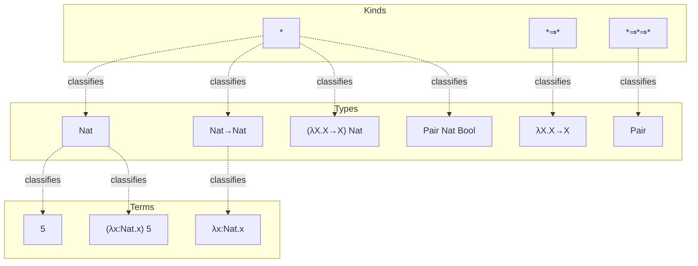

[[book-guidelines|↩ Back to guidelines]]

# Type Operators and Kinding

## The problem: types have been quietly hiding functions all along

Go back through the earlier chapters of TAPL and you'll find abbreviations like

$$
\mathtt{CBool} = \forall X.\, X \to X \to X
$$

and

$$
\mathtt{Pair}\; Y\; Z = \forall X.\, (Y \to Z \to X) \to X
$$

`CBool` is just a name standing in for a fixed type — see it, replace it, done. `Pair`, though, is different in kind (pun intended): it takes arguments. `Pair Nat Bool` isn't a lookup, it's a *substitution* — you replace `Y` with `Nat` and `Z` with `Bool` in the body. That's a function. Not a function over *values* — a function over *types*, computed entirely at the level of type expressions, before any term ever runs.

And it's not just a notational convenience the book invented. Look at `Ref T` or `Array T`. These are built into the language, but they behave exactly the same way: give them a type, they give you back a type. `Ref` is a function that, for every type `T`, produces "the type of reference cells holding a `T`." Pierce's point in this chapter is that abbreviations like `Pair` and built-in constructors like `Ref` are the same phenomenon wearing different clothes — both are **type operators**, functions living at the type level.

**What breaks without this.** As long as type-level functions stay informal ("mentally substitute the arguments"), you can't reason about them the way you reason about everything else in the book: no typing rules, no evaluation rules, no safety theorem, no algorithm a typechecker could run. If a language wants to let *programmers* define their own `Pair`-like operators (not just consume a fixed built-in list like `Ref` and `Array`), someone has to nail down: what does it mean to apply one type function to another? When are two differently-written type expressions "the same type"? And — this is the sting — once you allow applying types to types, what stops someone from writing something as meaningless as `Bool Nat` (applying a non-function type as if it were one)? At the term level `true 6` is caught by the type system. At the type level, nothing is watching yet. This chapter builds the watcher.

## Abstraction and application, one level up

The fix is to reuse the exact same tools the book already built for terms — abstraction and application — but write them over type expressions instead of over values.

$$
\lambda X.\, \{a\!:\!X,\, b\!:\!X\}
$$

is a function that, given a type `T`, yields the record type `{a:T, b:T}`. Apply it: `(λX.{a:X,b:X}) Bool`. Multi-argument type operators curry exactly like term-level functions do:

$$
\mathtt{Pair} = \lambda Y.\, \lambda Z.\, \forall X.\, (Y \to Z \to X) \to X
$$

`Pair S T` really means `(λY. λZ. ∀X.(Y→Z→X)→X) S T` — two applications in a row, each one substituting a type for a bound type variable, precisely mirroring how `(λx. λy. e) s t` unfolds at the term level.

**A terminology trap the book flags explicitly.** Because the notation is deliberately reused, the phrase "type abstraction" becomes ambiguous. It might mean a term-level abstraction whose *argument* is a type — `λX.t`, the System F construct from Chapter 23 (a value, at runtime, that happens to take a type as input). Or it might mean an abstraction *at the level of types* — `λX.T`, an operator like `Pair`, which is not a term at all and is never evaluated at runtime. TAPL disambiguates by calling the second one a "type-level abstraction" or "operator abstraction." Keep the two apart: one produces a value when applied, the other produces a type.

**Rust [[Bounded-Quantification#Grounding|grounding]].** Rust doesn't have first-class type-level lambdas, but a generic type constructor is the closest everyday analogue to a type operator: `struct Pair<Y, Z>(Y, Z)` is a *function from two types to a type* — you can't use `Pair` on its own as a type, only `Pair<Nat, Bool>`, exactly the proper-type-vs-operator distinction below. A trait with an associated type, `trait Container { type Item; }`, is closer still to a genuine type-level function computed from context.

**Python grounding.** If you wanted to actually *run* type-level beta-reduction as a five-line interpreter (which is exactly what a typechecker does internally), it's just substitution:

```python
def subst_type(var, arg, ty):
    match ty:
        case TVar(x) if x == var: return arg
        case TVar(x): return ty
        case Arrow(t1, t2): return Arrow(subst_type(var, arg, t1), subst_type(var, arg, t2))
        case OpApp(TAbs(x, _, body), t2) if x == var:
            return subst_type(var, arg, body)  # beta-reduce
        case OpApp(t1, t2):
            return OpApp(subst_type(var, arg, t1), subst_type(var, arg, t2))
```

This is the entire computational content of `Q-AppAbs` below — a mechanical rewrite, no cleverness required.

## Definitional equivalence: when are two type expressions "the same type"?

Once type expressions can be applied and reduced, the same type can be spelled many different ways. If `Id = λX.X`, then

$$
\mathtt{Nat} \to \mathtt{Bool},\quad \mathtt{Nat} \to \mathtt{Id\ Bool},\quad \mathtt{Id\ Nat} \to \mathtt{Id\ Bool},\quad \mathtt{Id\ (Id\ (Id\ Nat} \to \mathtt{Bool))}
$$

are all names for the same arrow type. To make "the same type" precise, TAPL introduces a **definitional equivalence** relation, written $S \equiv T$. The load-bearing clause is:

$$
(\lambda X {::} K_{11}.\, T_{12})\; T_2 \;\equiv\; [X \mapsto T_2]\, T_{12} \qquad \text{(Q-AppAbs)}
$$

— a type-level operator applied to an argument is equivalent to its body with the argument substituted in. The rest of the equivalence rules (`Q-Refl`, `Q-Symm`, `Q-Trans`, and congruence rules `Q-Arrow`, `Q-Abs`, `Q-App` that let equivalence propagate into subexpressions) just make $\equiv$ into a proper equivalence relation that respects the syntax.

Definitional equivalence earns its keep via one new typing rule:

$$
\frac{\Gamma \vdash t : S \qquad S \equiv T \qquad \Gamma \vdash T :: *}{\Gamma \vdash t : T} \qquad \text{(T-Eq)}
$$

If a term has type $S$, and $S$ is definitionally the same type as $T$, the term also has type $T$. Note the shape: this is structurally identical to [[Subtyping#The subsumption rule|the subsumption rule]] `T-Sub` from Chapter 15 ($t:S$, $S <: T$, therefore $t:T$) — except the relation doing the work is equivalence instead of a subtype ordering. Pierce calls this out explicitly, and it's worth sitting with: **[[Subtyping|subtyping]] and definitional equivalence are two different answers to the same underlying question** — "when can I use a term of type $S$ where type $T$ was expected?" One answer says "when $S$ is narrower" (subtyping); the other says "when $S$ and $T$ are secretly the same type written differently" (equivalence).

**This is the single most load-bearing idea in the chapter for anyone building an elaborator.** `Q-AppAbs` plus the congruence rules is, almost verbatim, what Lean's kernel calls **definitional equality** (`isDefEq`), and the reduction it performs — normalizing a type-level redex like `(λX::K.T) T2` down to `[X↦T2]T` — is exactly `whnf` (weak-head normal form reduction) at the type level. When Lean's elaborator decides that `List Nat` and `(fun α => List α) Nat` are "the same type" without you ever writing a proof of it, that decision is `T-Eq` in disguise. If you're building a bidirectional elaborator with metavariable unification, this is the machinery your unifier calls every time it needs to check whether two type-level expressions it has produced (possibly through different paths — one from inference, one from an expected-type annotation) actually denote the same type. Definitional equality is the thing that lets unification *stop* — it's the base case underneath which everything else (including the harder problem of higher-order pattern unification) is built.

**Lean grounding, concretely.** In Lean's kernel, definitional equality between two expressions `e1 ≡ e2` is checked by reducing both to weak-head normal form and comparing; beta-reduction — `(fun x => b) a ≡ b[x := a]` — is precisely `Q-AppAbs`. The kernel's `isDefEq` function is the algorithmic (decidable, terminating-on-well-typed-input) counterpart to the declarative relation $\equiv$ defined here, in the same sense that Chapter 16's algorithmic subtyping was the decidable counterpart to declarative subtyping. `rfl` proofs in Lean succeed exactly when the two sides reduce to a common form under this relation — if you've ever been surprised that `rfl` closes a goal with no explicit reasoning, it closed because $S \equiv T$ held according to rules just like these.

## Kinds: the types of types

Definitional equivalence handles *sameness*; it does nothing about *nonsense*. Applying one proper type to another — `Bool Nat` — is exactly as meaningless as applying `true` to `6` at the term level, but nothing said so yet. TAPL's fix, again, is to reuse a tool that already exists one level down: just as arrow types classify terms by their arity/shape, **kinds** classify type expressions by their arity/shape.

Kinds are built from one atomic kind and one constructor:

$$
* \qquad\qquad K_1 \Rightarrow K_2
$$

- $*$ (pronounced "type") is the kind of **proper types** — types that can actually classify terms, like `Bool` and `Bool→Bool`.
- $* \Rightarrow *$ is the kind of ordinary one-argument type operators (functions from proper types to proper types), like `Ref` or `λX.X→X`.
- $* \Rightarrow * \Rightarrow *$ is the kind of two-argument operators, like `Pair`.
- $(*\Rightarrow*) \Rightarrow *$ is the kind of a function that consumes a type *operator* and produces a proper type — a **higher-order type operator**. These are rare in ordinary programming (TAPL flags them as "somewhat esoteric") but show up load-bearingly in the purely-functional object encoding of Chapter 32.

"Kinds are the types of types" is not a slogan — the kinding system is, structurally, a *copy of the simply typed lambda-calculus one level up*. Compare the kinding rules to the original typing rules for $\lambda_\to$ (Chapter 9) and the correspondence is exact, symbol for symbol:

$$
\frac{X{::}K \in \Gamma}{\Gamma \vdash X :: K} \;\text{(K-TVar)} \qquad
\frac{\Gamma, X{::}K_1 \vdash T_2 :: K_2}{\Gamma \vdash \lambda X{::}K_1.\,T_2 :: K_1 \Rightarrow K_2} \;\text{(K-Abs)}
$$

$$
\frac{\Gamma \vdash T_1 :: K_{11} \Rightarrow K_{12} \qquad \Gamma \vdash T_2 :: K_{11}}{\Gamma \vdash T_1\, T_2 :: K_{12}} \;\text{(K-App)} \qquad
\frac{\Gamma \vdash T_1 :: * \qquad \Gamma \vdash T_2 :: *}{\Gamma \vdash T_1 \to T_2 :: *} \;\text{(K-Arrow)}
$$

`K-TVar` looks up a bound type variable's kind, `K-Abs` types an operator abstraction with an arrow kind, `K-App` checks that the argument's kind matches what the operator expects (this is exactly what rejects `Bool Nat` — `Bool :: *`, not `* ⇒ anything`, so `K-App`'s premise fails), and `K-Arrow` insists that both sides of an arrow type be *proper* types (kind $*$) — you can't build `T1 → T2` if `T1` is itself an unapplied operator.

Since almost every bound type variable ends up with kind $*$, TAPL keeps the informal shorthand `λX.T` for the fully annotated `λX::*.T`.

### Three levels, stacked

The book earns this picture with a running example (`Pair`, `Nat`, `λX.X→X`, `5`) shown growing across the section — the point being that **each level classifies the one below it**, the same relationship repeated twice:



Terms are classified by types; types (including operators) are classified by kinds. `Pair` itself is never a type that a term inhabits — asking "what terms have type `Pair`?" is as malformed as asking "what values have type `λx.x`?" at the term level. Only after `Pair` is fully applied (`Pair Nat Bool`, kind $*$) does it become something a term can actually have.

**A word choice to hold onto.** TAPL uses "type" loosely from here on to mean *any* type-level expression — proper types and operators alike — and reserves "proper type" for the kind-$*$ subset, i.e. the things that can actually classify a term. When you see "type" without qualification in later chapters, check which one is meant.

## The system: $\lambda^\omega$

Putting it together, TAPL names the resulting calculus $\lambda^\omega$ — "the simply typed lambda-calculus with type operators." Its term level is unchanged from Chapter 9 (variables, abstraction, application — no new term constructs; quantified types `∀X.T` are deliberately left out until Chapter 30). What's new lives entirely in the type and kind levels:

**Syntax additions:** types now include type variables `X`, operator abstraction `λX::K.T`, operator application `T T`, alongside the familiar arrow type `T→T`. Contexts can bind either a term variable (`x:T`) or a type variable with its kind (`X::K`).

**Three judgment forms now coexist:**

| Judgment | Reads as | Classifies |
|---|---|---|
| $\Gamma \vdash T :: K$ | "type $T$ has kind $K$" | types, by kind |
| $S \equiv T$ | "$S$ and $T$ are definitionally equivalent" | — |
| $\Gamma \vdash t : T$ | "term $t$ has type $T$" | terms, by type |

**Typing gets one new obligation.** The old `T-Abs` rule for term abstraction now carries an extra premise: whenever a type annotation `T` appears in a term (as in `λx:T.t`), the system must check $\Gamma \vdash T :: *$ — the annotation must be a *well-kinded, proper* type, not an operator and not nonsense. This maintains an invariant threaded through the whole system: **whenever $\Gamma \vdash t : T$ is derivable, $\Gamma \vdash T :: *$ is derivable too** — every type a term can validly have is guaranteed well-kinded. `T-Eq` carries the same kinding premise for the same reason.

**Evaluation is untouched at the term level** (`E-App1`, `E-App2`, `E-AppAbs` — ordinary call-by-value beta-reduction on terms); type-level reduction only ever happens *inside* the definitional-equivalence judgment, at typechecking time, never at runtime. This is a distinction worth being precise about: term evaluation is a runtime process; type-level reduction (via `Q-AppAbs`) is a compile-time process the typechecker performs while deciding $S \equiv T$. They share a reduction *pattern* (both are beta-reduction) but occupy entirely different phases.

## Why real languages don't give you the whole thing

TAPL is candid that $\lambda^\omega$'s full generality — arbitrary user-defined type operators of arbitrary kind — is rarely exposed wholesale. Java gives you a handful of *built-in* operators (`Array`) with no way to define your own. ML/OCaml bundles type operators into the `datatype`/`type` mechanism:

```
type 'a Tyop = tyoptag of ('a -> 'a);
```

is really the type operator `Tyop = λX. ⟨tyoptag: X→X⟩` wearing a tag. The tag isn't cosmetic — it's the mechanism that keeps typechecking tractable. Every place the typechecker would otherwise need to invoke `Q-AppAbs` silently to unfold `Tyop Nat` into `Nat→Nat`, ML instead forces an explicit `tyoptag` constructor to appear in the program. The *programmer* marks the unfolding point, so the *typechecker* never has to search for it. This is the same trade Chapter 20 made for [[Recursive-Types|recursive types]] (equi- vs. iso-recursive) — trading a little surface convenience for a typechecker that doesn't have to guess when to reduce.

**What breaks without this restriction.** A typechecker for unrestricted $\lambda^\omega$ has to decide $S \equiv T$ by normalizing arbitrary type-level expressions and comparing results — always terminating here, since $\lambda^\omega$'s type-level reduction is strongly normalizing (types can't diverge the way `Ω` diverges at the term level, because there's no type-level fixed-point combinator yet), but still a real computation the checker must perform at every use site. Bundling operators into tagged datatype declarations sidesteps that computation entirely by making every reduction point syntactically visible.

The chapter closes by gesturing at how much bigger this design space gets: record kinds, row kinds (for row-polymorphic record systems), power kinds (an alternate presentation of subtyping), singleton kinds (kinds with exactly one inhabiting type — related to definitions, and to ML module systems with sharing constraints), and dependent kinds (the kind-level analogue of the [[Dependent-Types|dependent types]] of Chapter 30). $\Rightarrow$ is "the only [kind constructor] we have space to discuss," not the only one that exists.

## Where this leads

Kinding and definitional equivalence are the prerequisite machinery, not the destination. Chapter 30 (Higher-Order Polymorphism, System $F^\omega$) takes type operators and makes them **first-class** — passable as arguments to polymorphic functions, quantifiable over — which is exactly the extra step that requires proving *confluence* of type-level reduction (this chapter's reduction was simple enough not to need it) before preservation and progress can go through. Chapter 31 then lifts subtyping itself pointwise over type operators, needing kinding and equivalence as the scaffolding subtyping now has to respect. And the purely-functional object encoding of Chapter 32 is where higher-order type operators — the "somewhat esoteric" kind $(*\Rightarrow*)\Rightarrow*$ case mentioned in passing here — turn out to be exactly the tool that splits an object type into a fixed skeleton plus a varying method-interface operator.

For the elaborator project specifically: this chapter is where "the type checker for types" and "the term type checker" are shown to be the *same pattern* recurring one level up — a fact Pierce underlines by literally reusing rule shapes (`K-TVar`/`K-Abs`/`K-App` mirror `T-Var`/`T-Abs`/`T-App`; `T-Eq` mirrors `T-Sub`). That recurrence is not incidental: it's the same reason a dependently-typed kernel like Lean's needs universe-checking (an analogue of kinding, for the universe hierarchy) and definitional equality (this chapter's $\equiv$, generalized to a much richer term language) as two separate but structurally parallel judgments underneath every single type-checking step it performs.
