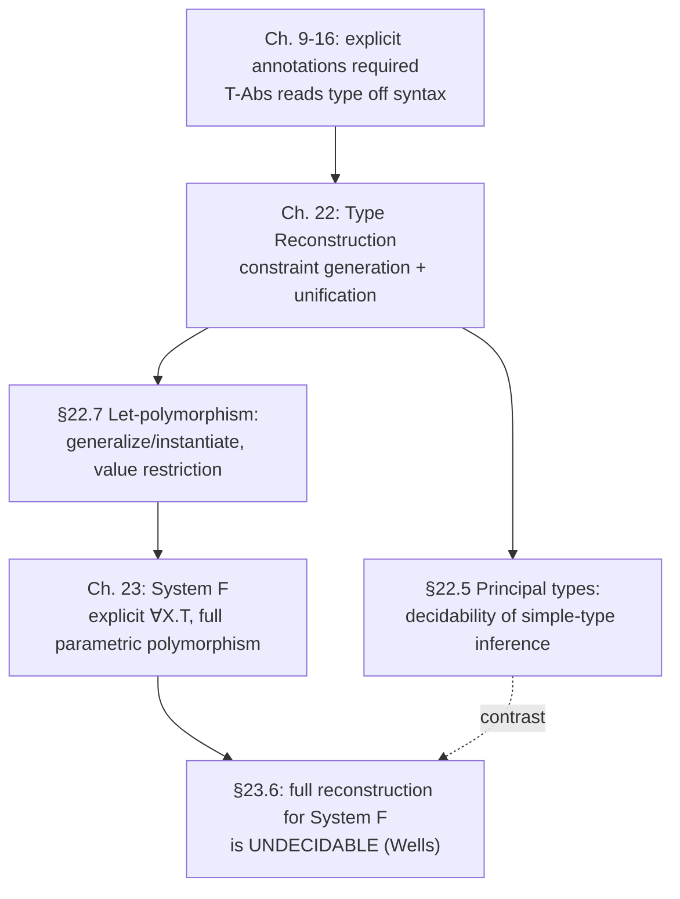

[[book-guidelines|↩ Back to guidelines]]

## What breaks without it

Every typechecking algorithm the book has built so far — from Chapter 8's arithmetic expressions through Chapter 16's algorithmic [[Subtyping|subtyping]] — leans on one crutch: **every lambda-abstraction is explicitly annotated with its argument type.** `T-Abs` reads the domain type straight off the syntax:

$$
\frac{\Gamma, x{:}T_1 \vdash t_2 : T_2}{\Gamma \vdash \lambda x{:}T_1.t_2 : T_1 \to T_2} \quad(\text{T-Abs})
$$

Take away the annotation — write `λx. x 0` instead of `λx:Nat→Nat. x 0` — and this rule has nothing to read. Yet ML and Haskell programmers write `fun x -> x + 1` all day without ever naming a type. Somewhere between the programmer's bare syntax and a well-typed derivation, a substantial amount of work has to happen: the compiler has to *invent* the missing types. That's the problem this chapter solves, restricted (per §22 opening) to simple types only — records and subtyping combined with reconstruction are flagged as "significant challenges" and deferred to further reading (§22.8).

The chapter's own running example (§22.2) is worth sitting with before any formalism: `λf:Y. λa:X. f (f a)` is *not* well typed as written — `Y` and `X` are just uninterpreted placeholder types, and nothing forces `Y` to be a function type at all. But if you're willing to *choose* values for `X` and `Y`, several choices work: `Y ↦ Nat→Nat, X ↦ Nat` gives a well-typed term of type `(Nat→Nat)→Nat→Nat`; so does the more conservative `Y ↦ X→X`, which commits to nothing about what `X` actually is. This second choice is special — it's the "most general" fix, the one that rules out the fewest future possibilities. Type reconstruction is precisely the algorithmic problem of finding that most general fix.

## Type variables and substitutions (§22.1)

The book already has a source of placeholder types on hand: the uninterpreted base types from §11.1 (recall these have no introduction or elimination rules — they're inert names). This chapter repurposes them as **type variables**: things that can be substituted or instantiated by other types.

**Definition 22.1.1.** A *type substitution* $\sigma$ is a finite mapping from type variables to types, written $[X \mapsto T, Y \mapsto U]$. Application is homomorphic over type structure:

$$
\sigma(X) = \begin{cases} T & \text{if } (X\mapsto T)\in\sigma \\ X & \text{otherwise}\end{cases}
\qquad \sigma(\text{Nat}) = \text{Nat} \qquad \sigma(T_1\to T_2) = \sigma T_1 \to \sigma T_2
$$

Two details the book flags as easy to get wrong:

- **Simultaneity.** `[X↦Bool, Y↦X→X]` sends `Y` to `X→X`, *not* to `Bool→Bool` — the substitution's own right-hand sides aren't recursively re-substituted against each other. This matters for composition: $\sigma \circ \gamma$ is defined so that $(\sigma\circ\gamma)S = \sigma(\gamma S)$, i.e. apply $\gamma$ first, *then* $\sigma$ to the result.
- **No variable capture to worry about.** Unlike term substitution (Chapter 5, where you have to dodge capturing free variables under a binder), type substitution has no binding construct in the target language — nothing in `Bool`, `Nat`, or `T1→T2` binds a type variable. (That changes the moment universal types `∀X.T` show up in Chapter 23.)

The theorem that licenses everything downstream: **substitution preserves typing** (22.1.2) — if $\Gamma \vdash t : T$, then for *any* $\sigma$, $\sigma\Gamma \vdash \sigma t : \sigma T$. In other words, if a term typechecks with some variables left abstract, every way of concretizing those variables still typechecks. This is what makes it sound to search for *some* substitution that makes a term typable, rather than having to re-derive typing from scratch for each candidate instantiation.

**[[Bounded-Quantification#Grounding|Grounding]] (Rust).** A type substitution is exactly an environment `HashMap<TyVar, Type>` used by a `subst(ty: &Type, env: &HashMap<TyVar, Type>) -> Type` function that walks the type AST — the same shape as an `applySubst` walking a `enum Type { Var(TyVar), Nat, Bool, Arrow(Box<Type>, Box<Type>) }`. Composition `σ ∘ γ` is exactly `apply_then_apply`, and getting the order backwards (applying `σ` to `γ`'s *keys* instead of its *values*) is a classic off-by-one bug in a first unifier implementation.

## Two views of type variables (§22.2)

The chapter pauses to name a fork that recurs throughout the rest of the book. Given a term `t` with type variables, there are two entirely different questions you can ask:

1. **"Are *all* instances well typed?"** — hold the variables abstract, and demand the term work for every possible substitution. This is the road to **parametric polymorphism** (Chapter 23): `λf:X→X. λa:X. f (f a)` has type `(X→X)→X→X`, and *every* concrete instantiation of `X` still typechecks. Universal quantification `∀X.T` will be the formal notation for "works for all X" — that's Chapter 23's subject, not this one's.
2. **"Does *some* instance work?"** — the term as written may not even be typable, and the question is whether a clever choice of substitution can rescue it. This is **type reconstruction**, this chapter's subject.

These are genuinely dual questions, not two phrasings of the same thing, and it's worth being explicit about why they diverge: universal quantification asks the type system to guarantee safety uniformly across an infinite family of instantiations chosen by *the term's caller*; reconstruction asks the type system to search, on the term's behalf, for *one* instantiation (ideally the most general one) that the term's own author left implicit. The same syntactic device — a type variable — supports both readings, and which reading is intended is exactly what §22.7's let-polymorphism has to pin down (see below).

**Definition 22.2.1 (Solution).** A *solution* for $(\Gamma, t)$ is a pair $(\sigma, T)$ such that $\sigma\Gamma \vdash \sigma t : T$. This is the formal shape of "some instantiation works." Example 22.2.2 makes concrete how non-unique this can be: for $\Gamma = f{:}X, a{:}Y$ and $t = f\,a$, both $([X\mapsto Y\to\text{Nat}], \text{Nat})$ and $([X\mapsto Y\to Z], Z)$ (leaving $Z$ free) are solutions — the second is strictly more general, committing to less.

This is exactly where the book connects reconstruction to real language design: the ML recipe is to let the programmer write bare, untyped-lambda-calculus syntax, and during parsing annotate every un-annotated `λx.t` as `λx:X.t` with a fresh `X` — then hand the whole term to the reconstruction algorithm to find the most general values for all the `X`'s. (The wrinkle — that this "story becomes a little more complicated" with let-polymorphism — is exactly §22.6–22.7's business.)

## Constraint-based typing (§22.3)

Rather than checking types outright, the algorithm generates equations to be checked *later*. The key move happens at application: given $t_1\,t_2$, instead of demanding $t_1$ already have the syntactic form $T_2\to T_{12}$ (which it can't, since some of its type is still unknown), the algorithm invents a **fresh type variable** $X$, records the equation $T_1 = T_2\to X$, and reports $X$ as the application's type. Deferred checking, not immediate checking — that's the whole idea.

**Definition 22.3.1.** A *constraint set* $C$ is a set of equations $\{S_i = T_i\}$. A substitution $\sigma$ *unifies* an equation $S=T$ if $\sigma S$ and $\sigma T$ are syntactically identical types, and unifies $C$ if it unifies every equation in it.

**Definition 22.3.2.** The *constraint typing relation* $\Gamma \vdash t : T \mid_X C$ ("t has type T under Γ whenever C is satisfied") is given by rules like:

$$
\frac{\Gamma \vdash t_1 : T_1 \mid_{X_1} C_1 \qquad \Gamma \vdash t_2 : T_2 \mid_{X_2} C_2 \qquad X\ \text{fresh}}
     {\Gamma \vdash t_1\,t_2 : X \mid_{X_1\cup X_2\cup\{X\}} C_1\cup C_2\cup\{T_1 = T_2\to X\}} \quad(\text{CT-App})
$$

The $X$-subscripts (bookkeeping for which type variables were freshly introduced where) exist purely to guarantee two disjointness properties: a freshly-chosen variable in a rule's conclusion differs from every variable chosen in its subderivations, and two subderivations of the same rule choose disjoint variable sets. On a first pass, Pierce says, just ignore the subscripts — the *content* of the rules is what to focus on. The crucial structural fact: unlike ordinary typechecking (which can outright reject a term), **constraint generation never fails.** For any $\Gamma, t$ there's always *some* $T, C$ such that $\Gamma \vdash t : T \mid C$ — it just might produce an unsatisfiable $C$. Rejection is deferred all the way to the unification step.

Worked example from the text: for $t = \lambda x{:}X{\to}Y.\ x\ 0$, the algorithm produces the single constraint $\{\text{Nat}\to Z = X\to Y\}$ (from applying `x` to `0`, `x`'s domain must equal `Nat`, and the codomain becomes the fresh result variable `Z`) with overall result type $(X\to Y)\to Z$. The substitution $[X\mapsto\text{Nat}, Y\mapsto\text{Bool}, Z\mapsto\text{Bool}]$ satisfies it, giving `(Nat→Bool)→Bool` as a possible type.

**Soundness and completeness (22.3.5, 22.3.7).** This machinery is only useful if it's provably equivalent to plain declarative typing. The book proves it both ways: every solution to the generated $(S, C)$ *is* a solution to $(\Gamma, t)$ in the Definition 22.2.1 sense (soundness — proved by straightforward induction on the constraint-derivation), and every solution to $(\Gamma, t)$ *extends* to a solution of $(S, C)$ (completeness — the trickier direction, needing careful bookkeeping of which variables were freshly introduced where, via the `σ\X` "restriction, undefined outside X" notation of 22.3.6). Corollary 22.3.8 packages both directions: $(\Gamma, t)$ has a solution iff $(\Gamma, t, S, C)$ does. This is the same soundness/completeness pattern the reader has already seen for algorithmic subtyping in Chapter 16 — an algorithm is worthless without a proof that it computes exactly what the declarative spec asked for.

**What breaks without constraint generation being deferred:** if you tried to check-and-fail eagerly the moment you saw `f a` before knowing `f`'s full type, you'd have no principled way to handle `f`'s type still containing free variables determined by *later* parts of the term (e.g. by how `f` is used elsewhere, or in a bigger enclosing context). Deferring to a global constraint-solving pass is what lets information from anywhere in the term inform the type of any other part.

## Unification and most general unifiers (§22.4)

Constraint generation only produces the equations — solving them is a separate, purely syntactic problem: **unification** (Robinson, 1971), applied here to type expressions via the Hindley/Milner recipe.

$$
\text{unify}(C) =
\begin{cases}
[\,] & \text{if } C=\emptyset \\
\text{unify}(C') & \text{if } S=T,\ C = \{S=T\}\cup C' \\
\text{unify}([X\mapsto T]C')\circ[X\mapsto T] & \text{if } S=X,\ X\notin FV(T) \\
\text{unify}([X\mapsto S]C')\circ[X\mapsto S] & \text{if } T=X,\ X\notin FV(S) \\
\text{unify}(C'\cup\{S_1=T_1, S_2=T_2\}) & \text{if } S=S_1\to S_2,\ T=T_1\to T_2 \\
\text{fail} & \text{otherwise}
\end{cases}
$$

Read this as a worklist algorithm: pick any equation out of $C$; if the two sides are already identical, discard it; if one side is a bare variable not occurring in the other side, eliminate that variable everywhere (substitute it out) and remember the elimination; if both sides are arrow types, decompose into two smaller equations on the components; otherwise (`Nat` vs. an arrow type, say) the constraint set is unsatisfiable and the whole computation fails.

**The occurs check.** The side conditions $X\notin FV(T)$ (and symmetrically for $T=X$) are the **occurs check**. Without it, a constraint like $X = X\to X$ would produce the substitution $[X \mapsto X\to X]$ — a *cyclic* substitution that denotes an infinite type, which makes no sense for the finite type expressions this chapter is scoped to. (Pierce notes in passing: if you *did* extend to infinite/[[Recursive-Types|recursive types]] in the sense of Chapters 20–21, the occurs check could legitimately be dropped — cyclic substitutions would then denote perfectly good regular trees.)

**Definitions 22.4.1–22.4.2 (specificity and mgu).** $\sigma$ is *less specific than* (more general than) $\sigma'$, written $\sigma \sqsubseteq \sigma'$, if $\sigma' = \gamma\circ\sigma$ for some $\gamma$ — i.e. $\sigma'$ can be obtained from $\sigma$ by applying further substitution on top. A **principal unifier** (most general unifier, mgu) for $C$ is a $\sigma$ that satisfies $C$ and is $\sqsubseteq$ every other satisfying substitution. "Most general" here means concretely: any other solution is obtainable from this one by substituting further into it — the mgu commits to the least.

**Theorem 22.4.5.** `unify` always terminates (proved via a well-founded lexicographic measure: number of distinct variables, then total size of the types — each recursive call strictly decreases it, either by eliminating a variable or shrinking a type), fails exactly on non-unifiable inputs, and on success returns a genuine most general unifier (not just *a* unifier). This last property — returning the *principal* solution, not merely *a* solution — is the load-bearing fact that makes type reconstruction well-defined and unique-up-to-renaming rather than an arbitrary choice among many valid answers.

**[[ML-Implementation-Techniques#Grounding|Grounding]] (Lean).** This is precisely metavariable unification as Lean's own elaborator performs it — a first-order, syntactic special case of what Lean's kernel `isDefEq` does when comparing two expressions containing unassigned metavariables `?m`. Lean's version has to go further (it unifies terms, not just simply-typed type expressions, and has to deal with definitional equality, reducibility, and non-pattern metavariables), but the shape is identical: decompose structurally, eliminate a bare metavariable against a non-occurring term, and fail (or postpone) on a mismatch. The occurs check here is the direct ancestor of the check Lean's unifier must perform before assigning `?m := e` — assigning a metavariable to a term that mentions itself is exactly as nonsensical there as it is here.

```rust
// The core of `unify`, Rust-shaped: a worklist over equality constraints.
use std::collections::HashMap;

#[derive(Clone, Debug, PartialEq)]
enum Ty { Var(String), Nat, Arrow(Box<Ty>, Box<Ty>) }

fn occurs(x: &str, t: &Ty) -> bool {
    match t {
        Ty::Var(y) => x == y,
        Ty::Nat => false,
        Ty::Arrow(a, b) => occurs(x, a) || occurs(x, b),
    }
}

fn apply(subst: &HashMap<String, Ty>, t: &Ty) -> Ty {
    match t {
        Ty::Var(x) => subst.get(x).cloned().unwrap_or_else(|| t.clone()),
        Ty::Nat => Ty::Nat,
        Ty::Arrow(a, b) => Ty::Arrow(Box::new(apply(subst, a)), Box::new(apply(subst, b))),
    }
}

fn unify(mut constraints: Vec<(Ty, Ty)>) -> Result<HashMap<String, Ty>, String> {
    let mut subst: HashMap<String, Ty> = HashMap::new();
    while let Some((s, t)) = constraints.pop() {
        match (&s, &t) {
            (a, b) if a == b => {}
            (Ty::Var(x), _) if !occurs(x, &t) => {
                for (_, ty) in subst.iter_mut() { *ty = apply(&HashMap::from([(x.clone(), t.clone())]), ty); }
                for (a, b) in constraints.iter_mut() {
                    *a = apply(&HashMap::from([(x.clone(), t.clone())]), a);
                    *b = apply(&HashMap::from([(x.clone(), t.clone())]), b);
                }
                subst.insert(x.clone(), t.clone());
            }
            (_, Ty::Var(y)) if !occurs(y, &s) => constraints.push((t, s)), // symmetric case
            (Ty::Arrow(s1, s2), Ty::Arrow(t1, t2)) => {
                constraints.push((*s1.clone(), *t1.clone()));
                constraints.push((*s2.clone(), *t2.clone()));
            }
            _ => return Err(format!("cannot unify {:?} with {:?}", s, t)),
        }
    }
    Ok(subst)
}
```

(This sketch eagerly propagates each elimination into the remaining worklist and the substitution built so far — a direct, if not maximally efficient, transliteration of the book's `unify(C') ∘ [X↦T]` composition step.)

## Principal types (§22.5)

The pieces now assemble: constraint generation produces $(S, C)$; unification either fails (term untypable, no matter what) or produces an mgu $\sigma$; $\sigma S$ is then a valid type for the term.

**Definition 22.5.1.** A *principal solution* for $(\Gamma, t, S, C)$ is a solution $(\sigma, T)$ such that every other solution $(\sigma', T')$ satisfies $\sigma \sqsubseteq \sigma'$. When $(\sigma, T)$ is principal, $T$ (i.e. $\sigma S$) is called a **principal type** of $t$ under $\Gamma$ — the single most general type derivable for the term, from which every other valid typing can be recovered by further instantiation.

**Theorem 22.5.3 / Corollary 22.5.4.** If $(\Gamma, t, S, C)$ has *any* solution, it has a principal one, computed by unification — and hence, by Corollary 22.3.8's soundness/completeness bridge, **it is decidable whether a term is typable at all** in this simply-typed setting, and if so its most general type is computable. This decidability result is the payoff of the whole soundness/completeness/mgu-existence chain: reconstruction for simple types isn't just "an algorithm that often works," it's a complete, terminating decision procedure.

The book flags (footnote to 22.5.3, and Exercise 22.5.6) two important caveats: *principal types* are not the same notion as *principal typings* (a subtlety about environments, deferred to later reading), and extending this cleanly to records is genuinely hard — exactly the kind of feature-interaction difficulty the chapter's opening warned about.

## Implicit type annotations (§22.6)

So far the algorithm still assumed the parser inserts a *fresh* type variable for every un-annotated abstraction before reconstruction begins. §22.6 makes this official as a first-class syntactic form, rather than sugar, adding a rule directly to the constraint-typing relation:

$$
\frac{X\ \text{fresh} \qquad \Gamma, x{:}X \vdash t_1 : T \mid_X C}
     {\Gamma \vdash \lambda x.t_1 : X\to T \mid_{X\cup\{X\}} C} \quad(\text{CT-AbsInf})
$$

Why not just treat `λx.t` as syntactic sugar for `λx:X.t` with some fixed invisible `X`? Because sugar would force *every occurrence* of a duplicated bare abstraction to share the *same* variable, while CT-AbsInf, applied once per occurrence, mints a fresh variable each time. This distinction is inert for a single occurrence — but it is exactly the mechanism let-polymorphism needs, because let-polymorphism's whole trick (next section) is checking multiple *copies* of the same right-hand side, each needing independently choosable type variables.

## Let-polymorphism (§22.7)

This is where the chapter's ideas earn their keep, and where the book's own motivating failure is worth reproducing in full because the "obvious" fixes genuinely don't work.

**The problem.** Define `double`, applying its argument twice:

```
let double = λf:Nat→Nat. λa:Nat. f(f(a)) in
double (λx:Nat. succ (succ x)) 2;
```

Fine for `Nat`, fine (separately) for `Bool` — but you cannot use *the same* `double` for both in one program without writing two copies, `doubleNat` and `doubleBool`, identical except for annotations. Even annotating `double`'s parameters with a shared type variable `X` doesn't rescue this:

```
let double = λf:X→X. λa:X. f(f(a)) in
let a = double (λx:Nat. succ (succ x)) 1 in
let b = double (λx:Bool. x) false in ...
```

The `a`-use generates $X\to X = \text{Nat}\to\text{Nat}$; the `b`-use generates $X\to X = \text{Bool}\to\text{Bool}$. Same `X`, two incompatible demands — unsatisfiable, so the whole program is rejected. **What went wrong:** `X` is being asked to play *two* logically distinct roles (one per use site) under one shared name, so the two uses spuriously interfere with each other even though nothing about the *program's actual meaning* links them.

**The fix, in two moves.** First, change `let`'s *typing* rule (not its meaning, just how types are computed) to conceptually substitute the right-hand side into the body before typechecking:

$$
\frac{\Gamma \vdash [x\mapsto t_1]t_2 : T_2}{\Gamma \vdash \texttt{let } x{=}t_1 \texttt{ in } t_2 : T_2} \quad(\text{T-LetPoly})
$$

with the matching constraint-typing rule `CT-LetPoly`. This mirrors the *evaluation* rule for call-by-value `let` ($\texttt{let }x{=}v_1\texttt{ in }t_2 \to [x\mapsto v_1]t_2$, `E-LetV`) — but applied one level earlier, at typing time, and applied *syntactically* rather than only to already-reduced values. Second, rewrite `double` using the implicit-annotation form from §22.6:

```
let double = λf. λa. f(f(a)) in
let a = double (λx:Nat. succ (succ x)) 1 in
let b = double (λx:Bool. x) false in ...
```

Now `CT-LetPoly` makes *two independent copies* of `double`'s body (one per use site), and `CT-AbsInf`, applied separately to each copy, mints a *fresh* type variable for `f` and `a` in each — precisely the freedom that sharing one syntactic `X` denied. Constraint solving proceeds independently per copy: one copy resolves to `Nat`, the other to `Bool`, no interference.

**Two practical flaws with this literal substitute-then-check scheme, and their fixes:**

1. **Unused bindings never get checked.** `let x = <utter garbage> in 5` typechecks fine, because if `x` is never used, `[x↦t1]t2` never mentions `t1` at all, and `t1` is simply never typechecked. Fix: add an explicit premise `Γ ⊢ t1 : T1` to `T-LetPoly` (and correspondingly to `CT-LetPoly`), forcing the right-hand side to be checked regardless of use.
2. **Exponential blowup.** If the let-body uses the bound variable $n$ times, the substitution duplicates the right-hand side $n$ times over — and if the right-hand side itself contains lets, this compounds multiplicatively. Literal substitute-then-check can cost time exponential in program size.

**The practical algorithm (generalize-and-instantiate).** Real implementations never literally substitute. Instead, for `let x = t1 in t2`:

1. Constraint-generate a type $S_1$ and constraints $C_1$ for $t_1$.
2. Unify $C_1$ to get $\sigma$; $\sigma S_1$ is $t_1$'s **principal type** $T_1$.
3. **Generalize** the variables of $T_1$ that don't also appear in $\Gamma$ (variables free in $\Gamma$ correspond to *real* external constraints and must **not** be generalized away — see below) into a **type scheme** $\forall X_1\ldots X_n.T_1$.
4. Extend the context with $x : \forall X_1\ldots X_n.T_1$ — the context now maps variables to type *schemes*, not bare types.
5. Each occurrence of $x$ in $t_2$ is **instantiated** independently: fresh variables $Y_1,\ldots,Y_n$ replace $X_1,\ldots,X_n$ per occurrence, exactly recovering the "fresh copy per use" behavior that made `double`'s two uses independent — without ever literally duplicating the term.

The book flags this "generalize, then instantiate per occurrence" as *formally equivalent* to the naive substitution scheme but "essentially linear" in practice — this generalize/instantiate split is precisely what real ML/Haskell/OCaml compilers implement as **Hindley–Milner** or **Damas–Milner** type inference (the chapter's own name for the mechanism, §22.7 opening).

**Why generalization must respect the context (the "don't generalize what's already constrained" caveat).** In `λf:X→X. λx:X. let g=f in g(x)`, generalizing `g`'s type `X→X` to `∀X.X→X` would let `g` be instantiated to different types at different call sites *even though `g` is really just `f`, whose type `X` is fixed by the enclosing `f:X→X` binder*. Concretely, doing so wrongly accepts:

```
(λf:X→X. λx:X. let g=f in g(0))
  (λx:Bool. if x then true else false)
  true;
```

— applying a `Bool→Bool` function to `0`. The rule is: only generalize variables that don't occur free in $\Gamma$; variables that do occur in $\Gamma$ encode a real, external constraint linking the let-binding to its surrounding context and must stay fixed.

**Grounding.** This generalize-at-`let`/instantiate-at-use split is exactly what a Rust-style bidirectional elaborator or a small Hindley-Milner engine implements as two distinct operations on a typing context of *schemes* rather than bare types — `generalize(ty, ctx) -> Scheme` and `instantiate(scheme) -> Type` (allocating fresh metavariables). It's also structurally the same move Lean's elaborator makes when it generalizes a `theorem` or `def`'s implicit universe/type-class metavariables into `∀`-bound parameters after elaborating the body, then re-instantiates them fresh at each call site.

**The exponential-worst-case surprise.** Even though the generalize/instantiate scheme is linear "in practice," Kfoury–Tiuryn–Urzyczyn (1990) and independently Mairson (1990) proved its *worst case* is exponential — witnessed by deeply nested lets *on the right-hand side* of other lets (unusual in ordinary code, where nesting happens in bodies), producing types that blow up exponentially relative to term size:

```ocaml
let f0 = fun x -> (x,x) in
  let f1 = fun y -> f0 (f0 y) in
    let f2 = fun y -> f1 (f1 y) in
      (* ... *)
        f5 (fun z -> z)
```

Each `fi` roughly squares the size of the type of `f(i-1)`, so `f5`'s type is astronomically large despite the program text growing only linearly.

**Soundness with mutable state: the value restriction.** Generalization interacts dangerously with side effects. Consider:

```
let r = ref (λx. x) in
(r:=(λx:Nat. succ x); (!r)true);
```

The right-hand side has principal type `Ref(X→X)`, generalized (since `X` is free nowhere else) to `∀X.Ref(X→X)`. Instantiating this once at `Ref(Nat→Nat)` for the assignment and again at `Ref(Bool→Bool)` for the dereference-and-apply is unsound: at runtime there is exactly **one** reference cell, allocated once, and the program ends up applying `succ` to `true`. The type system and the evaluation rule have drifted out of sync: typing behaves as if `let` substitutes-before-evaluating (as `T-LetPoly` assumes), but call-by-value evaluation only substitutes *after* reducing the right-hand side to a value — and here the right-hand side, `ref (λx.x)`, evaluates to a single fresh location shared by both later uses, not to two independent lambda-terms each free to be re-typed.

Pierce shows two ways to close the gap and picks one: you could change *evaluation* to match the (unsound) typing rule — literally substitute unevaluated right-hand sides — but this yields a genuinely different, "strange" non-call-by-value semantics (and the safe version of the ref example would evaluate to *two separate ref cells* rather than one, silently changing the program's meaning). Instead, the standard fix changes the *typing* rule to match evaluation: the **value restriction** — generalize a let-binding's free type variables only when its right-hand side is a syntactic value. `ref (λx.x)` is not a value (it's a `ref`-application awaiting evaluation), so under the restriction `r` gets the un-generalized type `X→X`; the first line's assignment then forces `X = Nat`, and the second line's use at `Bool` fails to unify — correctly rejected. Wright (1995) empirically confirmed this restriction costs almost nothing in practice (surveying a large Standard ML corpus, nearly all let-right-hand-sides were already syntactic values), which is why every major ML-family language adopts it.

## Notes (§22.8) and the discipline's lineage

Pierce traces principal types back to Curry's work in the 1950s, with Hindley (1969) giving the first reconstruction algorithm and Morris (1968) and Milner (1978) discovering closely related algorithms independently — hence "Hindley–Milner." Unification itself (Robinson, 1971) predates and outlives this application, being foundational across logic programming, automated theorem proving, and (per the standing project's interests) elaboration.

## Where this leads



Structurally, this chapter is a hinge. Everything before it in the book assumed types are given; everything from Chapter 23 onward studies **explicit** polymorphism (`∀X.T` as real syntax, not inferred), and §22.2's "two views of type variables" foreshadows exactly that split — the reconstruction view (find *some* instantiation) here, the parametric-polymorphism view (works for *all* instantiations) there. The chapter also draws its own sharp boundary: reconstruction for the simply-typed core is *decidable* (Corollary 22.5.4), while full reconstruction for System F is *undecidable* (Wells, cited forward in §23.6) — let-polymorphism is deliberately the point on this spectrum that keeps inference decidable and (usually) fast while still buying genuine, if restricted, polymorphism.

**For the standing compiler/elaborator project:** this chapter is close to the literal mechanism the project's second target needs. Constraint generation + unification + the occurs check is first-order unification exactly as it appears in a metavariable-based elaborator, and the generalize/instantiate split at `let` is the direct ancestor of how a bidirectional elaborator would generalize a definition's type after checking its body and re-instantiate fresh metavariables at each call site — the same "don't generalize what the context still constrains" discipline (§22.7's `g=f` caveat) that a real implementation needs to get right for soundness. The value restriction is also a preview of a recurring theme worth flagging explicitly: whenever generalization/quantification meets an *effectful* operation (here, `ref`; in a dependently-typed or Hoare-triple setting, anything that can fail or mutate state), the type system's soundness argument has to track evaluation order precisely, not just typing derivations in isolation — exactly the kind of "plumbing" the standing project's Hoare-triple verifier will need to get right for its own effectful constructs. Unification here is strictly first-order (no unification *under* a binder, no higher-order patterns) — it's the tractable floor that Miller's pattern unification generalizes upward from when metavariables can appear applied to bound variables, which is the harder problem the elaborator project will eventually need beyond what this chapter covers.
