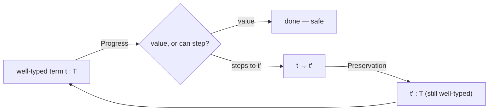
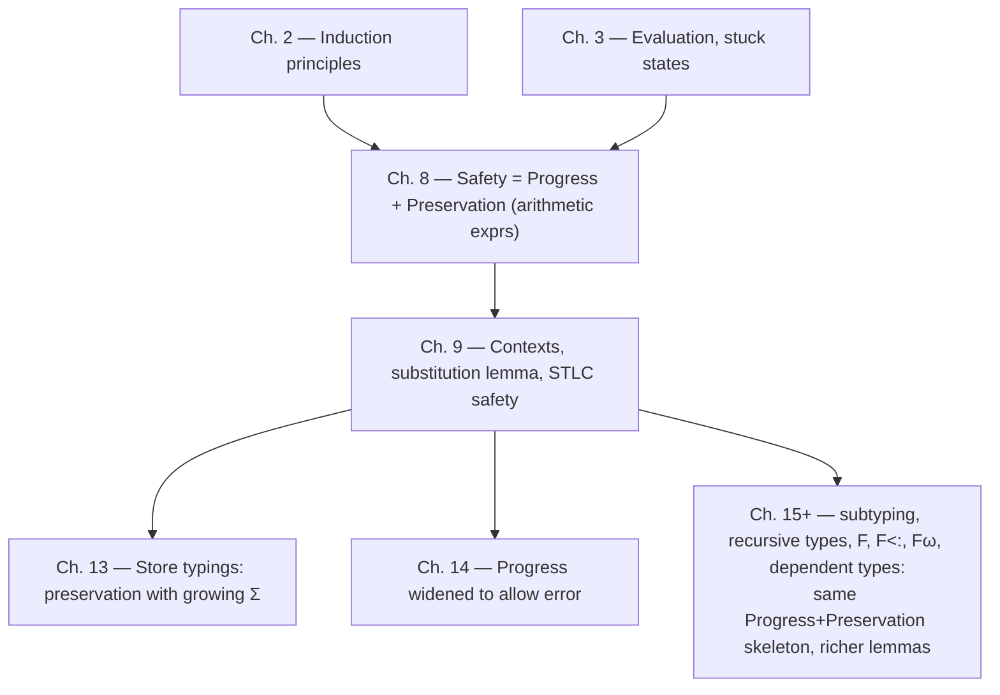

[[book-guidelines|↩ Back to guidelines]]

## What "going wrong" even means

Before you can prove a program can't go wrong, you need a precise, non-circular definition of *wrong*. Pierce sets this up back in Chapter 3, and it's worth restating because everything in this article hangs off it: a small-step evaluation relation $t \to t'$ is a set of rules, and a term is either

- **a value** — evaluation is finished, nothing more to do, or
- **stuck** — no evaluation rule applies, and it's *not* a value.

`pred (succ (pred false))` reduces one step and then jams: `pred false` matches no rule. That's stuck. It is emphatically different from a term that is a normal form because it's *finished* — the distinction matters because "stuck" is exactly the formal stand-in for "the program crashed with a type error at runtime, and there's no handler for that." A dynamically-typed language will happily construct evaluators where stuck states simply don't arise (because runtime checks turn every potential stuck state into a controlled error), but a language with a *static* type system is making a much stronger claim: that it can look at the syntax of a program, without running it, and certify that it will never reach a stuck configuration. That claim is called **type safety** (or **soundness**), and Milner's famous slogan for it — "well-typed programs cannot go wrong" — is the promise every type system in the rest of the book has to keep.

**[[Existential-Types#What breaks without it|What breaks without it]]:** if you don't have a theorem here, "type checker" is just a heuristic — a linter that happens to reject some bad programs. The entire reason a Rust compiler can let you write `unsafe`-free code and trust that `pred false`-shaped bugs are structurally impossible is that someone proved a theorem of exactly this shape for Rust's (much larger) type system. Without it, static types are a suggestion, not a guarantee.

## The typing relation as a judgment, not a function

Pierce's typing relation is written $t : T$ in Chapter 8 (arithmetic expressions) and generalizes to $\Gamma \vdash t : T$ in Chapter 9 once terms have free variables. Read this as a **judgment**: "under the assumptions $\Gamma$, the term $t$ has type $T$." It is defined, exactly like the evaluation relation, as the smallest relation closed under a set of inference rules — for example:

$$
\frac{\Gamma, x{:}T_1 \vdash t_2 : T_2}{\Gamma \vdash \lambda x{:}T_1.\,t_2 : T_1 \to T_2} \quad(\text{T-Abs})
\qquad
\frac{\Gamma \vdash t_1 : T_{11}\to T_{12} \qquad \Gamma \vdash t_2 : T_{11}}{\Gamma \vdash t_1\,t_2 : T_{12}} \quad(\text{T-App})
$$

The topic-list phrase "the subsumption-free typing relation" is Pierce's way of flagging that at this stage there is no rule letting you widen a term's type after the fact — no `T-Sub` (that arrives in Chapter 15 with [[Subtyping|subtyping]]). This has a sharp consequence proved in both chapters: **Uniqueness of Types** — every well-typed term has *exactly one* type, and exactly one derivation deriving it. That single-derivation property is what makes typechecking here a simple structural recursion rather than a search problem; once subsumption is added later, both properties break, and typechecking becomes real work (Chapter 16).

**Rust [[Bounded-Quantification#Grounding|grounding]].** A typing judgment is precisely what a typechecker's `infer`/`check` functions compute. Model contexts $\Gamma$ as a `Vec<(String, Type)>` or, better, a persistent/rc-shared association list (context extension `Γ, x:T` is *not* mutation — it's a new context that shares structure with the old one, which is exactly what an immutable cons-list or `im::Vector` gives you for free):

```rust
enum Type {
    Bool,
    Arrow(Box<Type>, Box<Type>),
}

enum Term {
    Var(String),
    Abs(String, Type, Box<Term>),
    App(Box<Term>, Box<Term>),
    True,
    False,
    If(Box<Term>, Box<Term>, Box<Term>),
}

type Context = Vec<(String, Type)>;

fn typeof_term(ctx: &Context, t: &Term) -> Result<Type, String> {
    match t {
        Term::Var(x) => ctx.iter().rev()
            .find(|(name, _)| name == x)
            .map(|(_, ty)| ty.clone())
            .ok_or_else(|| format!("unbound variable {x}")),
        Term::Abs(x, ty1, body) => {
            let mut ctx2 = ctx.clone();
            ctx2.push((x.clone(), ty1.clone()));
            let ty2 = typeof_term(&ctx2, body)?;
            Ok(Type::Arrow(Box::new(ty1.clone()), Box::new(ty2)))
        }
        Term::App(t1, t2) => match typeof_term(ctx, t1)? {
            Type::Arrow(t11, t12) => {
                let ty2 = typeof_term(ctx, t2)?;
                if *t11 == ty2 { Ok(*t12) } else { Err("argument type mismatch".into()) }
            }
            _ => Err("not a function".into()),
        },
        // Bool, If, ...
        _ => todo!(),
    }
}
```

Note this function *is* the T-Var/T-Abs/T-App rules, read left-to-right as a recursive procedure — that correspondence (rules-as-code) is exactly what Chapter 10 and Chapter 27 of TAPL do explicitly with OCaml.

**Lean grounding.** Because this is genuinely proof-theoretic content, Lean is the more faithful mirror here. A typing judgment as an inductive relation over a de Bruijn-indexed (or intrinsically-typed) term is close to verbatim:

```lean
inductive HasType : Ctx → Term → Ty → Prop
  | var {Γ x T} : Ctx.find? Γ x = some T → HasType Γ (.var x) T
  | abs {Γ x T1 T2 t} :
      HasType ((x, T1) :: Γ) t T2 →
      HasType Γ (.abs x T1 t) (.arrow T1 T2)
  | app {Γ t1 t2 T11 T12} :
      HasType Γ t1 (.arrow T11 T12) →
      HasType Γ t2 T11 →
      HasType Γ (.app t1 t2) T12
```

This is directly the shape Lean's own kernel elaborator works with: a typing derivation *is* a proof term, and Lean's kernel typechecker is, structurally, a decision procedure for exactly this `HasType` relation over its own core calculus.

## Progress: "you're not stuck"

**Theorem (Progress, 8.3.2 / 9.3.5).** If $t$ is a closed, well-typed term ($\vdash t : T$ for some $T$), then either $t$ is a value, or there exists $t'$ with $t \to t'$.

The proof is induction on the *typing derivation*, not on the term's syntax — a distinction worth dwelling on. At each case you get to assume progress already holds for the immediate subterms (because their typing derivations are subderivations), and you push that assumption through the current rule. The only case requiring real work is application: given $t_1\,t_2$ with $t_1 : T_{11}\to T_{12}$, induction gives you that either $t_1$ steps (then `E-App1` fires) or $t_1$ is a value; if $t_1$ is a value *and* $t_2$ steps, `E-App2` fires; if both are values, you need to know $t_1$'s specific *shape* — that it's literally a $\lambda$-abstraction, not just "something of function type." That's what the **Canonical Forms Lemma** supplies:

> If $v$ has type $T_1 \to T_2$, then $v = \lambda x{:}T_1.\,t_2$ for some $x, t_2$.

Canonical forms is the load-bearing hinge between "the type says this is a function" and "the syntax is literally an abstraction, so `E-AppAbs` is guaranteed to apply." Without it, progress has a hole exactly where evaluation actually needs to *do* something.

Note also the sharpness of "closed": progress explicitly requires no free variables. `f true` where `f : Bool → Bool` is a perfectly well-typed *open* term that is stuck as a normal form (it's not a value, and no rule fires) — but this isn't a counterexample to safety, because open terms aren't complete programs. This is a detail people skip past and then get confused later when reasoning about safety under a context of assumptions (exactly what you'll need for Hoare-triple-style verification, where your "context" is your set of preconditions/hypotheses, not an empty one).

**What breaks without it:** without progress, preservation alone is vacuous — a type system could have every well-typed term either evaluate correctly or *get permanently stuck*, and preservation would say nothing about it (a stuck term isn't a step, so preservation's hypothesis $t \to t'$ never fires and the theorem is trivially true). Progress is the theorem that actually rules out stuckness.

## Preservation: "stepping doesn't break your type"

**Theorem (Preservation / Subject Reduction, 8.3.3 / 9.3.9).** If $\Gamma \vdash t : T$ and $t \to t'$, then $\Gamma \vdash t' : T$.

Also proved by induction on the typing derivation, case-splitting on the evaluation rule that could have fired. Most cases are congruence cases (e.g. `E-If` steps the guard; you apply the induction hypothesis to the guard's subderivation and reassemble with `T-If`). The interesting case is the actual computation rule `E-AppAbs`: $(\lambda x{:}T_{11}.t_{12})\,v_2 \to [x \mapsto v_2]t_{12}$. Typing the result requires knowing that *substituting a well-typed value for a well-typed variable preserves well-typedness* — this is not free, and it's the one genuinely new lemma Chapter 9 has to add relative to Chapter 8:

**Lemma (Preservation of Types under Substitution, 9.3.8).** If $\Gamma, x{:}S \vdash t : T$ and $\Gamma \vdash s : S$, then $\Gamma \vdash [x \mapsto s]t : T$.

This is proved using two auxiliary structural lemmas that are almost boring on their own but indispensable in combination: **Permutation** (reordering $\Gamma$ doesn't change what's derivable) and **Weakening** (adding an unused binding to $\Gamma$ doesn't change what's derivable). You use them to line the contexts up correctly before invoking the induction hypothesis in the abstraction case of the substitution proof.

**What breaks without it:** if substitution didn't preserve typing, then function application — the one place where "plug this value into that body" actually happens — could silently produce a term whose type no longer matches what was promised at the call site. Progress would still tell you *this step* is fine, but the *next* application of progress would be reasoning about a term whose type is a lie.

**Rust grounding.** This is the theorem licensing something Rust programmers take completely for granted: that calling a well-typed function with a well-typed argument produces a well-typed (and hence "not about to blow up in a way `unsafe` wasn't invoked for") result, at every call site, transitively, for the whole call graph. Every time you write a generic function and instantiate it, you're relying on a substitution lemma for Rust's (much richer, trait-bounded) type system.

**Lean grounding.** This is where the connection to your elaborator project is most direct. Lean's kernel enforces exactly this invariant for `Expr` reduction: whnf-reduction, delta-unfolding, and beta-reduction during typechecking are all required to be type-preserving, and Lean's kernel *is* a preservation-theorem-respecting reduction engine — that's the entire content of it being trustworthy as a proof checker. "Subject reduction" here is the same property as saying Lean's definitional equality `isDefEq` never lets two terms of genuinely different types collapse into each other via reduction.

## Safety = Progress + Preservation

Put together, the two theorems give you exactly what you want:

$$
\vdash t_0 : T \;\land\; t_0 \to t_1 \to t_2 \to \cdots
\quad\Longrightarrow\quad
\text{every } t_i \text{ is either a value or steps further, and every } t_i : T.
$$

By induction on the length of the evaluation sequence: preservation keeps every intermediate term well-typed at the *same* type $T$ (or, in extended systems below, a type consistent with a growing store typing); progress guarantees that being well-typed means you're never stuck. A well-typed term therefore either runs forever or terminates in a value — it can never jam. Pierce attributes the slogan "safety = progress + preservation" to Robert Harper (with a related formulation by Wright and Felleisen, 1994) — it's worth knowing by name, because it is *the* standard proof architecture used for virtually every type system in the programming-languages literature, including every later chapter of this book.



The loop never exits through a "stuck, no rule applies, not a value" state — that state is exactly what the two theorems jointly rule out.

## Extending safety: state and exceptions

The chapter summary flags this explicitly, and it's the part of the topic that most resembles real engineering rather than idealized calculus.

**References (Ch. 13).** Once terms can allocate mutable cells, the typing judgment has to grow a fourth component: a *store typing* $\Sigma$, mapping locations to types, alongside the term context — written $\Gamma \mid \Sigma \vdash t : T$. The naive fix — "compute a location's type by looking up its current contents in the store" — fails for two concrete reasons Pierce walks through: it's asymptotically wasteful (recomputing nested location types over and over), and it flatly doesn't terminate on cyclic stores (e.g. two closures that reference each other), which arise in ordinary programs like doubly linked [[Recursive-Types#Lists|lists]]. The real fix decouples the store typing from the store's contents: $\Sigma$ records the type a location was *allocated* with, once, and preservation is restated to allow $\Sigma$ to *grow monotonically* as evaluation proceeds and new locations are created:

> **Preservation (13.5.3).** If $\Gamma \mid \Sigma \vdash t : T$, $\Gamma \mid \Sigma \vdash \mu$ (the store is well-typed w.r.t. $\Sigma$), and $t \mid \mu \to t' \mid \mu'$, then for some $\Sigma' \supseteq \Sigma$: $\Gamma \mid \Sigma' \vdash t' : T$ and $\Gamma \mid \Sigma' \vdash \mu'$.

The $\Sigma' \supseteq \Sigma$ is doing real work — it's the formal expression of "old locations keep their types, new ones get added," and it's what lets the theorem be re-applied over and over across an unboundedly growing store. Note the analogy this hands you almost for free: $\Sigma$ playing the role of a second, mutable-world context is structurally the same move as extending a context $\Gamma$ with a fresh binding, just tracked separately because it evolves at runtime rather than being fixed at typing time.

**Exceptions (Ch. 14).** Once a language has `raise`/uncaught errors, "well-typed programs get stuck" is no longer quite the right thing to rule out — a well-typed program is now *permitted* to terminate in an `error` state, provided that's a recognized, non-stuck outcome rather than an unhandled crash. Progress has to be restated:

> **Progress (14.1.2).** Suppose $t$ is a closed, well-typed normal form. Then either $t$ is a value, or $t = \mathtt{error}$.

This is the general pattern for adding any kind of controlled abnormal termination to a safety proof: you don't weaken preservation at all, and you don't weaken progress's *guarantee*, you just widen the set of outcomes progress is allowed to certify as "not actually stuck." This is exactly the move you'll need if your Rust verifier's calculus ever needs to reason about panics, `Result`-style early returns, or explicit failure states in Hoare-triple postconditions — the safety statement generalizes from "reduces to a value" to "reduces to a value or a recognized, well-typed abnormal-termination marker."

**Python sketch (illustrative only).** A tiny evaluator that mirrors the state-extension idea in miniature — a store as a dict, threaded through evaluation exactly as $\mu$ is threaded through the small-step rules:

```python
def eval_step(term, store):
    match term:
        case ("ref", v) if is_value(v):
            loc = fresh_location(store)
            store[loc] = v
            return ("loc", loc), store
        case ("deref", ("loc", l)):
            return store[l], store
        case ("assign", ("loc", l), v) if is_value(v):
            store[l] = v
            return ("unit",), store
        # congruence cases omitted
```

This is not meant as a faithful implementation — it's here only to make the "store threaded through evaluation, and [[The-Simply-Typed-Lambda-Calculus#The typing relation|the typing relation]] threaded alongside it" shape concrete before you go build the real thing in Rust.

## Where this leads

This chapter is the load-bearing keystone of the whole book's methodology, not just one topic among many. Every subsequent system TAPL develops — subtyping (Ch. 15–16), [[Recursive-Types|recursive types]] (Ch. 20–21), polymorphism (Ch. 23), [[Bounded-Quantification|bounded quantification]] (Ch. 26, 28), higher-order and [[Dependent-Types|dependent types]] (Ch. 30) — is validated by re-running this exact two-theorem pattern against a richer typing relation, usually with one or two new technical lemmas (a narrowing lemma for bounded quantification, confluence of type-level reduction for $F^\omega$) slotted in alongside canonical forms and substitution. If you understand *why* progress needs canonical forms and *why* preservation needs a substitution lemma here, you already understand the skeleton of every safety proof later in the book — only the case analysis gets bigger.



**For your two projects specifically:** this is the theorem your Rust verifier's whole correctness story rests on. If your verifier checks Hoare-triple-style specs by threading a typing/proof context, the substitution lemma here (9.3.8) is *literally* the mechanism that has to hold for your system too — it's what lets you say "the precondition established before a call still implies the postcondition after substituting the concrete arguments in." And the store-typing extension (13.5) is close to a template for how you'll need to state preservation once your verifier's context includes mutable state or heap-allocated resources: growing, monotone auxiliary typing information alongside the base context, not folded into it. On the elaborator side, preservation/subject-reduction is the same soundness property Lean's kernel reduction has to satisfy for `isDefEq` to be trustworthy — every unification/definitional-equality step your elaborator performs is implicitly claiming "this preserves the type," and this chapter is where that claim gets its first rigorous proof, in the simplest possible setting.
