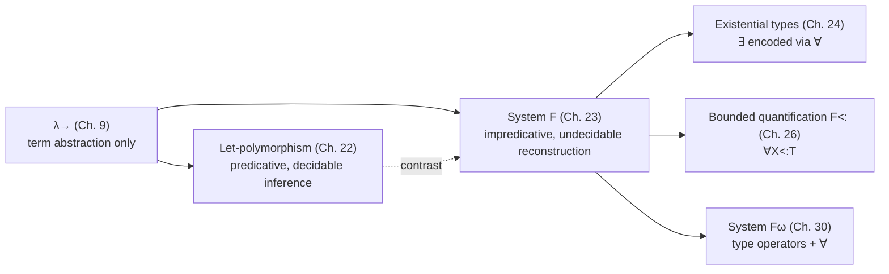

[[book-guidelines|↩ Back to guidelines]]

## What breaks without it: the cut-and-paste problem

TAPL opens the chapter with a small, deliberately annoying observation. In $\lambda_\to$ (the simply typed lambda-calculus), you can write a "doubling" function — apply `f` to `a` twice — but you have to write a *different* one for every type you want to double over:

```
doubleNat = λf:Nat→Nat. λx:Nat. f (f x);
doubleRcd = λf:{l:Bool}→{l:Bool}. λx:{l:Bool}. f (f x);
doubleFun = λf:(Nat→Nat)→(Nat→Nat). λx:Nat→Nat. f (f x);
```

Every one of these has *identical* program text. Only the type annotations differ. This is a straight violation of what Pierce calls the Abstraction Principle: functionality implemented in one place should stay implemented in one place, not be re-copied for every type it happens to be used at. $\lambda_\to$ gives you abstraction over *terms* (that's what $\lambda x{:}T.t$ is) but no abstraction over *types* — the thing that's actually varying here.

Chapter 22's let-polymorphism (Hindley–Milner) already patched part of this, but only for top-level `let`-bound definitions, and only implicitly (you never write the type variable yourself; the algorithm infers it and generalizes it for you). System F is what you get when you stop treating this as an inference problem and instead make type abstraction a first-class, explicit part of the syntax — a function can now take a *type* as an argument, not just a term, and it can do so anywhere a term abstraction could, not only at `let`.

## Type abstraction and type application

The move is exactly analogous to what $\lambda_\to$ already does for terms, one level up:

- $\lambda_\to$ has term abstraction $\lambda x{:}T.t$ (abstract a term out) and term application $t\,t$ (plug a term back in).
- System F adds **type abstraction** $\lambda X.t$ (abstract a *type* out of a term) and **type application** $t\,[T]$ (plug a concrete type back in).

Concretely, the polymorphic identity function is

$$\mathtt{id} = \lambda X.\, \lambda x{:}X.\, x \qquad \mathtt{id} : \forall X.\, X \to X$$

`id` is not itself a function you can hand a `Nat` to directly — its outermost binder abstracts over a *type*. You first instantiate it: `id [Nat]` substitutes `Nat` for `X` throughout the body, producing `λx:Nat. x`, an ordinary term of type `Nat→Nat`, which you can then apply as usual: `id [Nat] 0 ⤳ 0`.

This is the operational content of the new reduction rule:

$$(\lambda X.\,t_{12})\,[T_2] \longrightarrow [X \mapsto T_2]\,t_{12} \qquad \text{(E-TappTabs)}$$

— a direct type-level echo of ordinary beta-reduction $(\lambda x{:}T_{11}.t_{12})\,v_2 \longrightarrow [x\mapsto v_2]t_{12}$ (E-AppAbs). Where term-level substitution replaces a term variable with a term, type-level substitution replaces a *type* variable with a *type*, and it happens throughout the whole body — including inside any nested type annotations.

**What breaks without an explicit new construct here:** you might be tempted to think you can fake this with $\lambda_\to$ alone by, say, using a dummy value of a "generic" type. You can't — $\lambda_\to$'s typing rules give every term exactly one type built compositionally from its subterms' types, and there is no rule that lets a *type variable* stand for "whatever type you eventually pick." The type has to actually be a first-class citizen of the syntax for the abstraction to be expressible at all.

To classify polymorphic functions like `id`, we need a new form of type: the **universal type** $\forall X.T$. `id`'s type is $\forall X.\,X\to X$ — read: "for every type $X$ you choose, this yields a function of type $X\to X$." The typing rules mirror the term-level rules exactly, one level up:

$$
\frac{\Gamma,\,X \vdash t_2 : T_2}{\Gamma \vdash \lambda X.\,t_2 : \forall X.\,T_2} \;\text{(T-TAbs)}
\qquad\qquad
\frac{\Gamma \vdash t_1 : \forall X.\,T_{12}}{\Gamma \vdash t_1\,[T_2] : [X\mapsto T_2]\,T_{12}} \;\text{(T-TApp)}
$$

T-TAbs extends the context with a bare type-variable binding $X$ (no type annotation — type variables aren't classified by anything further in System F) and checks the body under it. T-TApp is substitution at the level of *types in the result type*, exactly mirroring how ordinary function application substitutes a term into a term.

**Rust [[Bounded-Quantification#Grounding|grounding]].** Rust's generics are the closest everyday analogue, though Rust erases and monomorphizes rather than doing real type-passing at runtime:

```rust
// id : ∀X. X → X
fn id<X>(x: X) -> X { x }

// instantiation ~ type application id [Nat]
let n: i64 = id::<i64>(0);

// double : ∀X. (X→X) → X → X
fn double<X>(f: impl Fn(X) -> X, a: X) -> X { f(f(a)) }
```

The turbofish `id::<i64>` *is* type application, spelled differently — you're supplying the argument to an implicit $\forall$. Rust's monomorphizer performs, at compile time, something close to the substitution $[X \mapsto T_2]T_{12}$ for every instantiation site, generating a fresh specialized copy — the mechanical inverse of what TAPL's type-erasure semantics (§23.7, below) does at the *term* level.

**Lean grounding.** Lean's `∀`/`Pi`-types make the correspondence to T-TAbs/T-TApp closer to literal, since Lean does not distinguish types from other sorts syntactically the way Rust's surface syntax does:

```lean
-- id : ∀ (X : Type), X → X
def id {X : Type} (x : X) : X := x

-- type application is genuinely explicit if you ask for it:
#check @id Nat 0   -- @id makes the implicit X argument explicit
```

`@id Nat 0` is exactly `id [Nat] 0` — Lean just defaults to inferring the type argument (implicit binder `{X : Type}`) the way most languages do, but the explicit form is always available and is precisely System F's `t [T]`.

## Varieties of polymorphism (§23.2)

Before committing to System F, Pierce places parametric polymorphism in a wider taxonomy (following Strachey 1967 and Cardelli & Wegner 1985) — worth internalizing because "polymorphism" means different things in different communities:

- **Parametric polymorphism** (this chapter's topic): one piece of code typed generically with type *variables*, later instantiated. Crucially, parametric definitions are **uniform** — every instance behaves identically, just specialized to a type. This uniformity is exactly what makes parametricity (§23.9, below) a theorem rather than a hope.
  - **Impredicative / first-class polymorphism** — the full power developed in this chapter, where a polymorphic function can appear anywhere a term can, including as an *argument* to another function.
  - **ML-style / let-polymorphism** — restricted to top-level `let`, weaker but decidably inferrable (Chapter 22).
- **Ad-hoc polymorphism**: a polymorphic *value* behaves *differently* at different types. Overloading is the paradigm case — the compiler or runtime picks a different implementation depending on argument type. Not uniform, in contrast to parametric polymorphism.
- **Subtype polymorphism** (Chapter 15): a single term gets many types via [[Subtyping#The subsumption rule|the subsumption rule]], by selectively forgetting information.

These aren't exclusive — Java mixes [[Subtyping|subtyping]], overloading, and ad-hoc `instanceof`-style dispatch but (at the time TAPL was written) lacked parametric polymorphism; Standard ML has parametric polymorphism plus simple arithmetic overloading but no subtyping. The functional-programming community's default reading of "polymorphism" is parametric; the OO community's default reading is subtype polymorphism, calling the parametric variant "generics" instead. Keep this glossary straight — it prevents a very common cross-community confusion.

## Church encodings at the level of types (§23.4)

Chapter 5 encoded booleans, numbers, and pairs as bare untyped lambda-terms. System F lets you do the *same* encodings, but now typed — and the encodings are a genuine stress-test of type abstraction/application, not just a curiosity.

**Booleans.** The untyped `tru = λt.λf.t` takes two arguments and returns one. To give it a single type, both arguments must have the *same* type — but that type has to be arbitrary, since `tru` doesn't inspect its arguments, just returns one:

$$\mathtt{CBool} = \forall X.\, X \to X \to X$$

$$\mathtt{tru} = \lambda X.\,\lambda t{:}X.\,\lambda f{:}X.\, t \qquad \mathtt{fls} = \lambda X.\,\lambda t{:}X.\,\lambda f{:}X.\, f$$

**Numbers.** Church numeral $n$ applies its first argument to its second, $n$ times. Typing this pins down:

$$\mathtt{CNat} = \forall X.\,(X\to X) \to X \to X$$

$$\mathtt{c_0} = \lambda X.\,\lambda s{:}X\to X.\,\lambda z{:}X.\, z \qquad \mathtt{c_2} = \lambda X.\,\lambda s{:}X\to X.\,\lambda z{:}X.\, s\,(s\,z)$$

with successor $\mathtt{csucc} = \lambda n{:}\mathtt{CNat}.\,\lambda X.\,\lambda s{:}X\to X.\,\lambda z{:}X.\, s\,(n\,[X]\,s\,z)$ — apply `n`'s own action *once more*.

**[[Recursive-Types#Lists|Lists]].** Generalizing numbers-as-unary-lists to lists of arbitrary elements, a list is represented as its own `fold_right`:

$$\mathtt{List}\ X = \forall R.\,(X\to R\to R) \to R \to R$$

`nil`, `cons`, and `isnil` fall out immediately from this shape. `head` is more delicate: applying a fold to extract the first element needs *something* to return on the empty list, and a naive fixed-point-based `diverge : ∀X. Unit → X` ends up being evaluated eagerly even for non-empty lists (because it's supplied as an *argument*, and arguments get evaluated before the fold "decides" whether to use them). The fix — wrapping the diverging branch behind an extra `Unit→X` and only forcing it with a final `unit` application at the very end — is a small but real lesson: **encoding laziness inside a strict, call-by-value calculus requires manually inserting the `Unit→X` thunks that a call-by-name language would give you for free.** `tail` needs the analogous Church-encoded pair type $\mathtt{Pair}\ X\ Y = \forall R.\,(X\to Y\to R)\to R$ to carry along "the list so far" during the fold.

The chapter's own framing of *why* this matters: these encodings show System F is, like the untyped lambda-calculus, computationally rich enough to express booleans/numbers/lists/pairs *without* needing them as primitives — which means a language design based on System F can add them as primitives purely for efficiency and nicer syntax, without changing what's fundamentally expressible. (Contrast: adding *references*, as Chapter 13 does, is a genuine change in computational power/character, not just convenience.)

**Rust grounding — Church encoding as a design pattern, not just a curiosity.** The closure-based encoding is directly expressible, and it's a nice window into how "data via functions" looks with an explicit generic parameter standing in for the eliminator's result type:

```rust
// CBool ~ ∀X. X → X → X, but Rust closures aren't polymorphic values themselves,
// so we express the *scheme* as a generic function:
fn tru<X>(t: X, _f: X) -> X { t }
fn fls<X>(_t: X, f: X) -> X { f }

// CNat ~ ∀X. (X→X) → X → X : a Church numeral as a fold
fn c0<X>(_s: impl Fn(X) -> X, z: X) -> X { z }
fn csucc<X>(n: impl Fn(&dyn Fn(X)->X, X)->X) -> impl Fn(&dyn Fn(X)->X, X) -> X {
    move |s, z| s(n(s, z))   // sketch — real Rust needs boxed/dyn closures throughout
}
```
The friction here (Rust needs `dyn`/boxing to make the encoding's *value* — not just the scheme — genuinely first-class and storable) is itself informative: it's exactly the gap between System F's impredicative $\forall$, which can appear anywhere in a type including nested inside a closure's captured environment, and Rust's generics, which are resolved at compile time and don't produce runtime-polymorphic values without an explicit `dyn` escape hatch.

**Python grounding (quick sketch, not load-bearing):**

```python
tru = lambda t, f: t
fls = lambda t, f: f
c0  = lambda s, z: z
c2  = lambda s, z: s(s(z))
csucc = lambda n: lambda s, z: s(n(s, z))
```
Untyped Python reproduces the *terms* exactly (this is literally Chapter 5's untyped encoding) — the interesting content of the System F version is entirely in the type annotations layered on top, which Python has no way to express.

## Basic properties (§23.5)

System F inherits $\lambda_\to$'s safety shape almost unchanged: **Preservation** (if $\Gamma \vdash t:T$ and $t \to t'$ then $\Gamma \vdash t':T$) and **Progress** (a closed, well-typed term is either a value or can step) both extend the Chapter 9 proofs straightforwardly, left as exercises in the text.

**[[Normalization|Normalization]]** is the interesting one. Every well-typed System F term terminates — no `fix`, and yet the language is expressive enough to write sorting functions (Exercise 23.4.12). This is genuinely surprising, and it's why Girard's 1972 proof (extending the reducibility-candidates method of Chapter 12 to quantified types) was a landmark result, not a routine corollary. In fact presentations with full beta-reduction get the stronger property of *strong* normalization — every reduction path terminates, not just some path.

## Erasure, typability, and type reconstruction (§23.6) — the load-bearing undecidability result

This is the section with the sharpest teeth, and it directly answers one of the guidelines' key questions: *why is [[Type-Reconstruction|type reconstruction]] undecidable for System F, when typechecking an already-annotated term is entirely routine?*

Define erasure exactly as in §9.5, but now also stripping type abstractions/applications:

$$
\mathrm{erase}(x) = x \quad
\mathrm{erase}(\lambda x{:}T_1.t_2) = \lambda x.\,\mathrm{erase}(t_2) \quad
\mathrm{erase}(t_1\,t_2) = \mathrm{erase}(t_1)\,\mathrm{erase}(t_2)
$$
$$
\mathrm{erase}(\lambda X.\,t_2) = \mathrm{erase}(t_2) \qquad
\mathrm{erase}(t_1\,[T_2]) = \mathrm{erase}(t_1)
$$

An untyped term $m$ is **typable** in System F if some well-typed $t$ erases to $m$. **Type reconstruction** asks: given $m$, does such a $t$ exist (and can we find it)?

> **Theorem (Wells, 1994).** It is undecidable whether an arbitrary closed untyped term is typable in System F.

This settled a problem open since the early 1970s, negatively. The book's own remark on *why* is instructive from the elaborator angle in the learning goals: typechecking an *explicitly* annotated term is a straightforward syntax-directed procedure (each construct's typing rule reads off directly from the term's shape), but *reconstructing the missing annotations* — in particular, the missing type-application arguments — is a search problem over an infinite space of candidate types, and for System F that search is provably unbounded in general.

A sharper, still-undecidable variant: **partial erasure** $\mathrm{erase}_p$ leaves ordinary type annotations intact and even marks *where* type applications occurred (`t₁ []`), but omits the actual type arguments. Even reconstructing just those missing brackets is undecidable (**Boehm, 1985/1989**) — and Boehm's proof works by reduction to *higher-order unification*, which is exactly the class of unification problem the learning-goals project cares about (Miller's pattern unification is the tractable fragment of exactly this space). TAPL notes that this negative result nonetheless *seeded* useful partial-reconstruction techniques (Pfenning's work building on Huet's semi-algorithm for higher-order unification), and surveys several pragmatic middle grounds: datatype-constructor-driven partial reconstruction (Perry; Läufer–Odersky), and **local type inference** (Pierce and Turner, 1998) — a bidirectional-flavored approach combining subtyping and impredicative polymorphism that propagates type information locally from a term's immediate context rather than solving global constraints.

**This is directly load-bearing for the elaborator project.** The point that "typechecking an annotated term is easy, reconstructing the annotations is what's hard/undecidable" is exactly the inference-vs-checking split that bidirectional typing formalizes, and it's the reason real elaborators (Lean's included) don't attempt full System-F-style reconstruction — they instead demand enough local annotations (or exploit restricted fragments, see §23.8 below) to make the search tractable, then use metavariable unification only within that restricted, terminating regime.

**Rust grounding.** This is precisely why Rust requires the turbofish or a type ascription at call sites where inference can't pin down a generic parameter from argument types alone (`Default::default()` needs `let x: Foo = ...` or `::<Foo>()`) — Rust's local, syntax-directed (Hindley-Milner-adjacent, not full System F) inference is deliberately *not* attempting the undecidable general problem; it infers only within a fragment designed to always terminate quickly.

## Erasure and evaluation order (§23.7) — a subtlety about *when* type abstraction matters at runtime

You might assume type abstractions/applications are purely compile-time bookkeeping — erase them all after typechecking and run the resulting untyped term. That's mostly true, but not quite, once you add side effects. Consider, with an exception primitive `error`:

```
let f = (λX.error) in 0;     -- evaluates to 0: λX.error is a *value*, error's body never runs
let f = error in 0;          -- raises an exception immediately, if error itself is erased away
```

`λX.error` is a syntactic value (a type abstraction is a value, just like a term abstraction) — under call-by-value, values don't get evaluated further, so the `error` inside is never triggered. But naive full erasure turns `λX.error` into bare `error`, which *is* evaluated immediately. **Type abstractions are not semantically inert under call-by-value with effects — they act as evaluation barriers**, exactly the way an un-applied `λx.t` does. The fix is a value-respecting erasure $\mathrm{erase}_v$ that turns type abstractions into ordinary (dummy-argument) term abstractions rather than deleting them outright, which provably commutes with evaluation (Theorem 23.7.2). This is a small but sharp instance of a recurring theme in the book: syntactic sugar/erasure transformations are only sound once you've checked they preserve evaluation *order*, not just typing.

## Fragments of System F (§23.8) — prenex and rank-2 polymorphism

Full System F's undecidable reconstruction is often too expensive a price for language design, motivating restricted fragments with tractable — sometimes decidable — reconstruction:

- **Prenex polymorphism** (ML-style let-polymorphism, Chapter 22, viewed as a System F fragment): type variables range only over quantifier-free types (**monotypes**), and quantified types (**polytypes**/type schemes) may never appear to the *left* of an arrow — i.e., you can't take a polymorphic function as an argument to another function. This is exactly the restriction that makes Hindley–Milner reconstruction decidable.
- **Rank-2 polymorphism** (Leivant, 1983): a type is rank $\le 2$ if no path from the root of its syntax tree to a $\forall$ passes to the *left* of two or more arrows. So $(\forall X.X\to X)\to \mathtt{Nat}$ is rank 2 (one arrow to its left, then the quantifier appears, but only one level "inside" an argument position), but $((\forall X.X\to X)\to\mathtt{Nat})\to\mathtt{Nat}$ is not (two arrows deep). Rank-2 is strictly more expressive than prenex/ML (it types strictly more untyped terms) while having the *same* reconstruction complexity class as ML (DExptime-complete, Kfoury & Tiuryn 1990). Reconstruction for rank 3 and above is undecidable (Kfoury & Wells 1999) — rank 2 is precisely the frontier where tractability breaks.

**Why this matters for the elaborator project:** these rank restrictions are a template for how any bidirectional/reconstruction system draws its tractability boundary — not "how expressive is the type system" in the abstract, but "how deep can quantifiers nest on the left of an arrow before search blows up." The same shape of question (how much can implicit/higher-rank polymorphism you allow before unification becomes undecidable) recurs directly in the design of GHC's `RankNTypes` and in any implicit-argument elaborator that has to decide how aggressively to allow higher-order metavariables.

## Parametricity (§23.9)

Return to `CBool = ∀X.X→X→X`. Pierce makes an observation that looks almost too simple to be a theorem: *given only the type*, you can reconstruct `tru` and `fls` almost mechanically. A value of type $\forall X.X\to X\to X$ must start with $\lambda X$ (that's what inhabits a $\forall$), then take two arguments of the *same*, now-abstract type $X$ (that's what the arrow structure forces), and must return *something* of type $X$ — but the only values of type $X$ available anywhere in scope are the two arguments themselves, since $X$ is an uninterpreted parameter with no constructors. So the function can only return one of its two arguments, verbatim. There is (up to the extensional behavior of terms like $(\lambda b{:}\mathtt{CBool}.b)\,\mathtt{tru}$, which just relay to `tru`/`fls`) essentially nothing else `CBool` could contain.

This is a specific instance of **parametricity** (Reynolds 1974, 1983): a polymorphic function's behavior at every instantiation is *uniform* — it can't inspect or branch on which concrete type it was instantiated at, because at the point it's written, that type is just an opaque variable with no operations attached. Parametricity is what makes "free theorems" (Wadler's phrase) possible: from the *type* $\forall X.\,X\to X$ alone, with zero knowledge of the implementation, you can prove the only inhabitant is the identity function — the type itself is a proof obligation.

**This is a direct, explicitly load-bearing connection to the verifier project.** Parametricity is the formal principle behind "a function can't do anything type-specific to a value it knows nothing about" — which is exactly the guarantee a Hoare-triple-style contract system wants to exploit when reasoning about generic/polymorphic code: if a function's signature is $\forall X.\,X \to X$, no separate correctness proof is needed per instantiation, because the *type alone* pins down the behavior. Any verifier reasoning about polymorphic Rust generics is implicitly leaning on parametricity every time it treats a generic function's behavior as uniform across type arguments rather than re-verifying it per monomorphization.

## Impredicativity (§23.10)

A definition is **impredicative** if it involves a quantifier ranging over a domain that includes the very thing being defined. In $T = \forall X.\,X\to X$, the bound variable $X$ ranges over *all* types — including $T$ itself. That's not a corner case: it's routinely exercised (`selfApp` above instantiates a $\forall X.X\to X$ argument *at* $\forall X.X\to X$ itself). ML's let-polymorphism, by contrast, is **predicative** (or *stratified*): type variables there range only over monotypes, which by construction never contain quantifiers — so a type scheme can never be instantiated at another (or the same) type scheme. This is precisely the same restriction identified as "prenex polymorphism" in §23.8; impredicativity and rank are two views of the same underlying restriction.

Pierce traces the terminology to Russell and Poincaré's analysis of Russell's Paradox: a membership condition is impredicative if it refers back to the very collection it's supposed to be carving out (the paradigm case being "the set of all sets that don't contain themselves"). System F's impredicativity is the *benign*, well-typed cousin of that same self-reference shape — it's exactly what buys the extra expressive power over ML (self-application, Church-encoded data at the type level, `selfApp`, `quadruple`), and exactly what makes reconstruction undecidable, per §23.6. Impredicativity and decidable-reconstruction are, in this system, directly in tension — you cannot have both, and every fragment in §23.8 is a specific way of giving up some impredicativity to buy back decidability.

**Lean grounding.** Lean's own universe hierarchy is a deliberate, disciplined retreat from unrestricted impredicativity for `Type`-valued quantification (to avoid the Girard/Reynolds-style paradoxes that unrestricted impredicative `Type : Type` would reintroduce), while keeping `Prop` impredicative (a `∀`-quantified `Prop` can quantify over all `Prop`s, including itself) because propositions carry no computational content to exploit for a paradox the way `Type` would. Seeing System F's impredicativity spelled out here is the cleanest possible motivation for *why* Lean bothers stratifying `Type 0 : Type 1 : Type 2 : ...` at all — it's containing exactly the same self-reference System F embraces at the term level, just at the level of kinds instead.

## Where this leads



System F sits at a hinge point in the book: everything from Chapter 24 onward that involves quantification builds directly on top of it. [[Existential-Types|Existential types]] (next chapter) are shown to be *encodable* in terms of universals via a continuation-passing-style translation — so understanding $\forall$ deeply here means Chapter 24's $\exists$ is almost free. [[Bounded-Quantification|Bounded quantification]] (Chapter 26) is System F's $\forall X.T$ refined with a subtyping bound $\forall X{<:}T.T'$, needed once objects/subtyping enter the picture. System $F^\omega$ (Chapter 30) adds type operators on top of the same quantifier machinery. And the whole undecidable-reconstruction story here is the direct reason later, more implementable systems (bounded quantification, kinding) keep having to negotiate how much of System F's power to keep versus trade away for algorithmic tractability — a negotiation that is, structurally, the same one any implicit-argument elaborator has to make.
