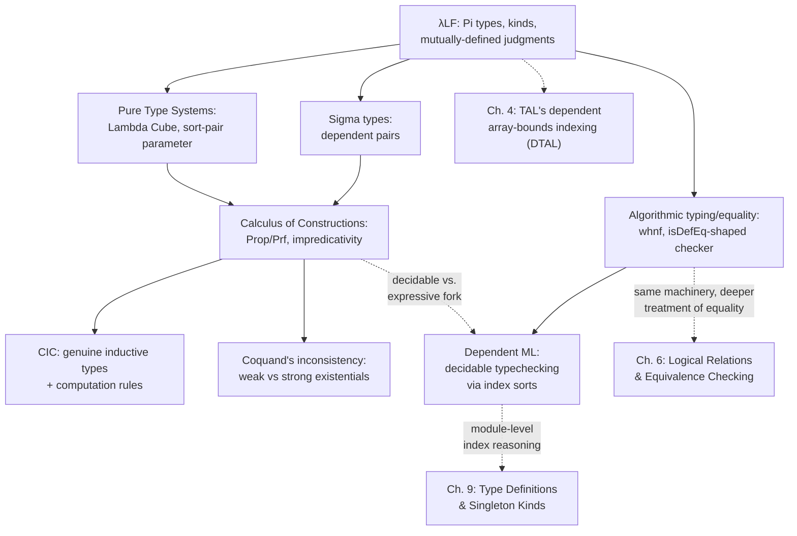

# Dependent Types

[[book-guidelines|↩ Back to guidelines]]

## Why would a type ever need to look at a value?

Every type system you've used professionally draws a hard line between the world of *types* and the world of *values*. A type like `Vec<i32>` describes a shape — "some sequence of 32-bit integers" — but it says nothing about *how many*. The length is a value, computed and known only when the program runs. Types are static; lengths are dynamic. Never the twain shall meet.

Except that this separation throws away information you often already have. Consider indexing:

```rust
fn first(v: &Vec<i32>) -> i32 {
    v[0] // panics if v is empty
}
```

`v[0]` is a partial function pretending to be total. The type signature `&Vec<i32> -> i32` is a lie: it promises an `i32` for *every* vector, including the empty one, where no such `i32` exists. The language has two options, both unsatisfying: panic at runtime, or return `Option<i32>` and push the burden of case-analysis onto every caller, forever, even in the overwhelming majority of call sites where the caller *already knows* the vector is non-empty because they just built it three lines up.

The problem is that "non-empty" is a fact about a *value* — but the *type* `Vec<i32>` has no way to talk about it. What if it could? What if the type of a vector could mention its own length, so that "first element of a non-empty vector" became a type that only *has* well-typed calls when non-emptiness is actually known?

That is the entire premise of dependent types: **let types be functions of terms, not just of other types.** Once a type can depend on a *value* — not just abstract over other types the way `Vec<T>` abstracts over `T` — you can push runtime invariants into the type checker and make certain classes of bugs *unrepresentable*, not just detected. This chapter (Aspinall and Hofmann, ATAPL Chapter 2) builds up the theory of this idea from the ground up: from the first motivating examples, through a minimal formal calculus ($\lambda LF$), through increasingly expressive systems (Calculus of Constructions, Pure Type Systems), and finally to the hard practical question — can you actually build a type checker for this that always terminates?

---

## 1. Pi types: functions whose result type varies with the argument

### The motivating example: vectors

The book's own running example is a length-indexed vector type:

$$\mathrm{Vector} :: \mathrm{Nat} \to *$$

Read the double colon as "has kind." This says `Vector` is not itself a type — it's a *type family*: a function that, given a natural number $k$, produces the type $\mathrm{Vector}\ k$, whose members are vectors of exactly $k$ elements. ($*$, pronounced "star," is the kind of proper types — the kind that classifies `Nat`, `Vector 3`, `Bool`, and so on. It's the dependent-types analogue of Rust's/Haskell's kind `Type`.)

To build vectors, the book gives:

$$\mathrm{init} : \Pi n{:}\mathrm{Nat}.\ \mathrm{data} \to \mathrm{Vector}\ n$$

This is the first appearance of the chapter's central piece of notation: the **dependent product type**, or **Pi type**, written $\Pi x{:}S.T$. Say it out loud as "the type of functions that take an $x$ of type $S$ and return something of type $T$, where $T$ is allowed to mention $x$." It generalizes the ordinary function-arrow type $S \to T$ — in fact $S \to T$ is literally *defined* as an abbreviation:

$$S \to T \;=\; \Pi x{:}S.T \quad \text{where } x \text{ does not occur free in } T$$

The generalization is that when $x$ *does* occur free in $T$, the result type is allowed to *vary with the argument*. `init k t` has type `Vector k` — a different type for every different `k`. In simply-typed lambda calculus this is inexpressible; the codomain of a function type is one fixed type, full stop.

**What breaks without this:** without Pi types, `init` can only be given the type `Nat -> data -> Array`, where `Array` is some single, length-erased array type. The moment you erase the length from the type, you also erase your ability to statically rule out the empty-vector-indexing bug from the introduction. You're back to runtime panics or `Option`-laundering.

Compare this carefully to `System F`'s universal type $\forall X.T$ (what Rust calls a generic `fn foo<T>(...)`). There, the thing you're abstracting over is a *type*, and applying a polymorphic function means supplying a *type argument* (`t A : [X ↦ A]T`). With Pi types, you abstract over a *term*, and applying the function supplies a *term* — but the type still gets substituted through, exactly the same way. The book puts this precisely: "in System F ... type variation occurs only with type arguments, whereas in dependent type theory it may occur with term-level arguments." Rust's generics and lifetimes are both instances of the System-F style — you'll never see `Vec<N>` where `N` is a runtime `usize` in stable Rust (const generics are the nearest approximation, and we'll come back to exactly how far they fall short).

The book's second worked example, `first`, is the payoff:

$$\mathrm{first} : \Pi n{:}\mathrm{Nat}.\mathrm{Vector}(n+1) \to \mathrm{data}$$

"`first` can never be applied to an empty vector — non-emptiness is expressed within [[Typed-Assembly-Language#The type system|the type system]] itself." There is no default value, no exception, no `Option`. The type $\mathrm{Vector}(n+1)$ is simply not inhabited by the empty vector for any $n$, so a well-typed call site is a proof, checked at compile time, that the vector being passed is non-empty.

### Grounding: Lean's Pi type is not an analogy, it *is* this

This is the one place in the whole chapter where "grounding in Lean" isn't a metaphor — Lean's function-type syntax *is* $\lambda LF$'s Pi type, spelled slightly differently:

```lean
-- Πn:Nat. data → Vector n   becomes, verbatim:
def init : (n : Nat) → Data → Vector n := sorry

-- Πn:Nat.Vector(n+1) → data   becomes:
def first : (n : Nat) → Vector (n + 1) → Data := sorry
```

`(n : Nat) → Vector n` *is* $\Pi n{:}\mathrm{Nat}.\mathrm{Vector}\ n$ — Lean just writes the binder with parentheses-and-arrow instead of $\Pi$-and-dot. When `n` doesn't occur in the result, Lean lets you drop the name and write the ordinary arrow, which is exactly the book's $S \to T$ abbreviation rule. There is no separate "generic type parameter" mechanism in Lean the way there is in Rust — polymorphism (`{α : Type}`) and dependency (`(n : Nat)`) are both just Pi types, differing only in what sort the domain lives in. That uniformity is precisely what Section 2.7 (Pure Type Systems) below formalizes.

### Grounding: Rust's const generics, and where they stop

Rust's `[T; N]` with `const N: usize` is the closest stable-Rust gets to a Pi type indexed by a term:

```rust
fn first<const N: usize>(v: [i32; N + 1]) -> i32 {
    v[0] // provably safe: N + 1 >= 1, so index 0 always exists
}
```

This compiles and *is* sound for the same reason the book's `first` is sound — the type `[i32; N + 1]` is uninhabited when the array would need negative length, so the caller must supply a genuinely non-empty array. But the resemblance stops the instant you need to *compute* with the index in the type: Rust's const-generic expressions are a narrow, closed set of arithmetic operations that the compiler can verify at monomorphization time, not a general dependent product over an arbitrary term language. You cannot write a Rust function whose return array length is `fibonacci(N)`, because Rust has no notion of *definitional equality* between arbitrary computations in types — which is exactly the machinery this chapter spends its algorithmic sections building. Const generics are $\lambda LF$'s $\mathrm{Vector}$ family with the "type family application" restricted to a decidable arithmetic fragment — which, as we'll see in §6 below, is basically what Dependent ML does on purpose.

---

## 2. The Curry–Howard correspondence: propositions ARE types

The vector example motivates Pi types from a *programming* angle. The book's second motivating thread comes from *logic*, and it's the one that makes dependent types indispensable for anyone building a proof checker: the **Curry–Howard correspondence**, a.k.a. "propositions as types."

### The core identification

Under Curry–Howard, a proposition $A$ is *identified* with a type, and "$A$ has a proof" is identified with "the type $A$ is inhabited" — some term has that type. A constructive proof of $A \Rightarrow B$ is a *procedure* turning any proof of $A$ into a proof of $B$ — which is exactly what a function of type $A \to B$ is. The book gives the classic worked example: the propositional tautology

$$((A\to B)\to A) \to (A\to B) \to B$$

is inhabited by $\lambda f.\lambda u.u(f\,u)$ — you can check by hand that this term typechecks, and the fact that it typechecks *is* the proof.

This correspondence only becomes *dependent* once you go to first-order logic. A predicate $B$ over $A$ is a type-valued function on $A$ — a proof of $\forall x{:}A.B(x)$ is a procedure that, given an arbitrary $x{:}A$, produces a proof of $B(x)$. Under Curry–Howard this is identified, term-for-term, with the dependent product:

$$\forall x{:}A.B(x) \quad \longleftrightarrow \quad \Pi x{:}A.B(x)$$

**Universal quantification just *is* the Pi type.** This is why $\lambda LF$ — a purely first-order dependent calculus with no other bells or whistles — already "corresponds to the $\forall,\to$-fragment of first-order predicate calculus," in the book's words.

Martin-Löf pushed the correspondence further and gave type-theoretic counterparts to the other logical connectives:

- **Existential quantification $\leftrightarrow$ Sigma types.** A constructive proof of $\exists x{:}A.B(x)$ is a *witness* $a{:}A$ together with a proof of $B(a)$ — i.e., a pair. This is the $\Sigma$-type $\Sigma x{:}A.B(x)$, covered formally in §4 below.
- **Equality $\leftrightarrow$ identity types.** $\mathrm{Id}\ t_1\ t_2$ is the type of proofs that $t_1$ equals $t_2$.

The book packages both into a single elegant example: the type of proofs that some binary operation $m$ is associative,

$$\Sigma m{:}T\to T\to T.\ \Pi x{:}T.\Pi y{:}T.\Pi z{:}T.\ \mathrm{Id}\ (m(x,m(y,z)))\ (m(m(x,y),z))$$

is literally an ordinary type in this system — "package up types with axioms restricting their elements," in the book's phrasing. A term of this type is *simultaneously* an operation and a proof that it's associative. This is the whole appeal of dependent types to the verification-minded engineer: specifications and implementations live in the *same* language, checked by the *same* type checker.

### What breaks without this

Without dependent products, you can encode `∀` in simply-typed lambda calculus only up to a fixed, finite arity, or by cheating with `Prop`-erased polymorphism (System F's `∀X.T`, which quantifies over *types*, not *terms*, so it can express `∀x:Bool.P` for the two-element `Bool` by brute enumeration but nothing infinite or genuinely term-indexed). Without Sigma types, you cannot express "here is a value together with a proof about that specific value" — you're forced either to erase the proof (and just trust it, unchecked) or bolt it on as a separate, unlinked side-condition that the type system can't connect back to the value it's about.

### Grounding: Lean is a direct, working implementation

Lean's `∀` *is* notation for `Pi`, and it type-checks propositions and programs in the same kernel:

```lean
-- ∀x:A.B(x)  is  Πx:A.B(x)  is  (x : A) → B x
theorem modus_ponens {A B : Prop} (f : A → B) (a : A) : B := f a

-- Σ-types: an explicit witness paired with a proof about it
example : Σ n : Nat, n > 3 := ⟨5, by decide⟩

-- The associativity example from the book, verbatim in spirit:
structure AssocOp (T : Type) where
  op : T → T → T
  assoc : ∀ x y z : T, op x (op y z) = op (op x y) z
```

`AssocOp` above is exactly the book's $\Sigma m{:}T\to T\to T.\ \Pi x\,y\,z.\ \mathrm{Id}\ \ldots$ — Lean's `structure` sugar over a nested `Sigma`, and its `∀ ... , op x (op y z) = op (op x y) z` field is exactly $\Pi x{:}T.\Pi y{:}T.\Pi z{:}T.\mathrm{Id}(\ldots)(\ldots)$. There is genuinely no gap between "the chapter's formalism" and "how Lean is built" here — this *is* Lean's kernel, described in ATAPL's own notation a decade before Lean existed.

---

## 3. Logical frameworks: representing OTHER type theories inside your type theory

The chapter's third motivating example is more meta: use dependent types not to represent *data*, but to represent *other formal systems* — their syntax, their judgments, and their proof rules. The running example is representing simply typed lambda calculus itself:

```
Ty  :: *
Tm  :: Ty → ∗
base  : Ty
arrow : Ty → Ty → Ty
app : ΠA:Ty.ΠB:Ty.Tm(arrow A B) → Tm A → Tm B
lam : ΠA:Ty.ΠB:Ty.(Tm A → Tm B) → Tm(arrow A B)
```

`Ty` is a type of object-language type expressions; `Tm A` is the type of object-language terms *of* type `A` — so ill-typed object terms are literally unrepresentable, by construction, because `Tm` only has inhabitants at well-typed object types.

The genuinely striking move is `lam`: it represents object-language lambda-abstraction using a *meta-level function* `Tm A → Tm B` as the argument. To represent a binder, you use a binder — the framework's own variable-binding machinery does double duty as the represented language's variable-binding machinery, so you get correct handling of scoping, alpha-equivalence, and capture *for free*, without writing a single line of de Bruijn-index bookkeeping. This technique is called **higher-order abstract syntax (HOAS)**, and the design principle behind the Edinburgh Logical Framework (Harper, Honsell, Plotkin 1993) that formalizes it is the slogan **judgments-as-types**: a logic's judgments (well-formedness, derivability, evaluation) are represented as type families, and a *derivation* of a judgment is represented as a *member* of that type.

**What breaks without dependent types here:** in a non-dependent setting you'd need `app` to be parameterized separately for every pair of object types `(A, B)`, or erase type information into a single untyped `Tm` and re-check well-typedness by hand at every use — precisely the bookkeeping burden that dependent kinding (`Tm : Ty → *`) eliminates by construction.

### Grounding: this is your elaborator's design pattern

This section is directly load-bearing for a Lean-style elaborator project. Lean's own kernel and the meta-language `Expr` you'd build for a from-scratch elaborator face exactly this representation choice — de Bruijn indices (first-order, easy to substitute, awkward to read) versus HOAS-style meta-functions for binders (readable, "free" alpha-equivalence, harder to pattern-match on). Most real implementations, including Lean's, use de Bruijn indices at the kernel level precisely *because* full HOAS complicates unification and requires the host language itself to have functions as first-class values that you can pattern-match apart — but the *judgments-as-types* idea (representing "is well-typed," "evaluates to," "is defeq to" as indexed type/relation families whose proof terms *are* the derivations) is exactly the shape of a bidirectional type checker's internal judgment structure, which is where §5 below becomes the concrete payoff.

---

## 4. $\lambda LF$: the minimal formal system

With the motivations in hand, the book commits to a single concrete calculus, $\lambda LF$ ("lambda LF" — based on a simplified Edinburgh LF), and builds *all* of its metatheory on top of it before extending. $\lambda LF$ is deliberately minimal: "pure," meaning it has only $\Pi$-types (no Sigma yet), and "first-order," meaning it has no higher-order type operators (no $F^\omega$-style type-to-type functions).

### Syntax: terms, types, kinds, contexts

$$
\begin{aligned}
t &::= x \mid \lambda x{:}T.t \mid t\ t &&\text{(terms — same as simply-typed }\lambda^\to\text{)}\\
T &::= X \mid \Pi x{:}T.T \mid T\ t &&\text{(types)}\\
K &::= * \mid \Pi x{:}T.K &&\text{(kinds)}\\
\Gamma &::= \emptyset \mid \Gamma, x{:}T \mid \Gamma, X{::}K &&\text{(contexts)}
\end{aligned}
$$

Note carefully: **terms are unchanged from simply-typed lambda calculus.** All the new machinery lives in the *types*. A type is either a type variable $X$ (which may itself be a proper type or a whole type family — `Vector` is one such $X$, declared with kind $\mathrm{Nat}\to *$), a dependent product $\Pi x{:}T_1.T_2$, or a **type family application** $T\ t$ — applying a type family like `Vector` to a term like `k` to get the concrete type `Vector k`.

**Kinds exist to separate two very different things that are easy to conflate:** a *proper type* (kind $*$ — something a term can actually have, like `Vector 3` or `Bool`) versus a *type family* (kind $\Pi x{:}T.K$ — a function from terms to types, like `Vector` itself, which is not itself the type of anything). Without this distinction you could accidentally write something like "a value of type `Vector`" (missing the length argument), which is meaningless the same way "a value of type `fn(usize) -> Type`" would be meaningless in a language with first-class types.

### The rules: three mutually-defined judgments

Figure 2-1 (reproduced faithfully) defines three judgment forms, and — this is the structurally important point — **they are mutually recursive**:

$$
\dfrac{\Gamma \vdash S :: *\qquad \Gamma, x{:}S \vdash t : T}{\Gamma \vdash \lambda x{:}S.t : \Pi x{:}S.T}\ \text{(T-Abs)}
\qquad\qquad
\dfrac{\Gamma \vdash t_1 : \Pi x{:}S.T\qquad \Gamma \vdash t_2 : S}{\Gamma \vdash t_1\,t_2 : [x \mapsto t_2]T}\ \text{(T-App)}
$$

T-Abs checks well-formedness of the domain type `S` using the *kinding* judgment ($\Gamma \vdash S :: *$) — but kind-formation (Wf-Pi) in turn invokes *typing* to check applications inside kinds (K-App uses $\Gamma \vdash t : T$). So: typing calls kinding calls well-formedness calls typing. All three judgments — kind formation $\Gamma \vdash K$, kinding $\Gamma \vdash T{::}K$, and typing $\Gamma \vdash t{:}T$ — must be defined *simultaneously*. This mutual recursion is the price of admission for dependency: once types can contain terms, you can no longer check "is this a type" without also checking "is this term well-typed," which is a qualitative jump in proof technique (simultaneous induction, or induction on total derivation height, rather than separate straightforward inductions).

The application rule T-App substitutes the argument into the result type — $[x \mapsto t_2]T$ — which is *the* mechanism by which "the result type varies with the argument": literally substitution.

### Definitional equality: the central design fork of the whole chapter

T-App and K-App both need a **conversion rule** — T-Conv, K-Conv — to convert between equivalent types, because after substitution you frequently land on a type that's *equal to but not syntactically identical to* the type you actually need. The book poses the deep question directly: what should "equal" mean here?

Two easy cases: $T((\lambda x{:}S.x)\,z) \equiv T\,z$ (beta-equivalence), and $\mathrm{Vector}(3+4) \equiv \mathrm{Vector}\ 7$ (arithmetic reduction). Both feel obviously fine to accept. But then: suppose $f{:}\mathrm{Nat}\to\mathrm{Nat}$ happens to satisfy $f\ x = 7$ for all $x$ — should $\mathrm{Vector}(f\ x) \equiv \mathrm{Vector}\ 7$ be accepted? This *is* true, but establishing it requires a proof, potentially an arbitrary one.

The book lays out the fork precisely:

- **Martin-Löf's position (adopted here):** equate only what's *definitionally* obvious — $\beta$ and $\eta$ reduction, nothing more. Typechecking stays **decidable**, because checking equivalence reduces to a terminating computation.
- **NuPrl's position:** allow *as many* equalities as possible, including ones requiring arbitrary proof. More expressive, but **typechecking becomes undecidable**.

$\lambda LF$ takes the Martin-Löf road, and — notably — chooses to define equivalence *declaratively and typed* (Figure 2-2, mirroring the shape of the typing rules) rather than as compatible closure of untyped $\beta\eta$-reduction, "more extensible... avoids the need to establish properties of untyped reduction." The two interesting rules among the otherwise purely-structural congruence rules are Q-Beta and Q-Eta:

$$
\dfrac{\Gamma, x{:}S \vdash t : T \qquad \Gamma \vdash s : S}{\Gamma \vdash (\lambda x{:}S.t)\,s \equiv [x\mapsto s]t : [x\mapsto s]T}\ \text{(Q-Beta)}
\qquad
\dfrac{\Gamma \vdash t : \Pi x{:}S.T \qquad x \notin FV(t)}{\Gamma \vdash \lambda x{:}T.t\,x \equiv t : \Pi x{:}S.T}\ \text{(Q-Eta)}
$$

**This decidable-vs-expressive fork is the single thread that runs through the entire rest of the chapter.** It resurfaces verbatim when comparing CC/CIC (rich, undecidable-typechecking-adjacent systems built for constructive mathematics) against Dependent ML (deliberately impoverished, decidable-by-construction, built for everyday programming). Every later design decision in the chapter is this same trade-off wearing a different hat.

### Basic properties, and why strong normalization matters so much here

Figure 2-1/2-2's system enjoys the metatheoretic properties you'd expect from any well-behaved type theory — Permutation and Weakening (reordering/extending the context is harmless), Substitution (substituting a well-typed term for a variable preserves any judgment), and Agreement (every well-formed judgment's *components* are themselves well-formed — e.g. if $\Gamma \vdash t : T$ then $\Gamma \vdash T{::}*$). These are routine, and the book states them without dwelling.

**Strong normalization is not routine, and it's the load-bearing theorem of the whole section.** General $\beta$-reduction $\to_\beta$ (reduction allowed *inside* abstractions, not just at the top level) is proved strongly normalizing on well-typed $\lambda LF$ terms — no infinite reduction sequence exists. The proof technique is elegant: define an erasure map $(-)^\natural$ from $\lambda LF$ into ordinary simply-typed lambda calculus (forgetting all the term-dependency: $(\Pi x{:}S.T)^\natural = S^\natural \to T^\natural$, and $(T\ t)^\natural = T^\natural$ — type family application just erases to the family's own erased type). Show reduction-preservation, then borrow strong normalization for *plain* STLC — a much older, easier result — for free.

Why does this matter so much? Because **strong normalization is what makes definitional equality checkable by computation at all.** If reduction might not terminate, "reduce both sides to normal form and compare" is not an algorithm — it's a Turing-complete undecidable search. Confluence (also stated, Theorem 2.3.6) then guarantees that whichever *order* you reduce in, you land on the *same* normal form, so "the" normal form $nf(t)$ is well-defined and comparison is a well-posed function, not merely a relation you'd have to search.

**What breaks without strong normalization:** definitional equality checking degenerates into potentially-nonterminating computation — precisely the situation the book flags for Cayenne later (§6), where typechecking is only semi-decidable and the checker may simply run forever on a bad program.

---

## 5. Algorithmic typing and equality — where this becomes a real checker

Section 2.4 is the section every reader building an actual verifier should read twice. The declarative rules of Figure 2-1/2-2 describe *what* is true; they are not, by themselves, an algorithm — T-Conv and K-Conv can be applied at any point, non-deterministically, which is exactly the shape of rule that a naive implementation can't just "run." The book's move is the standard one in type-system engineering: reformulate everything *syntax-directed* (Figures 2-3, 2-4), so each syntactic form of term/type/kind has exactly one applicable rule, and prove afterward that the algorithmic system agrees with the declarative one.

### Weak head normal form: reduce only as much as you must

The key efficiency move is **weak head reduction** $\to_{wh}$ — a strict *subset* of full $\beta$-reduction that only reduces in "head position":

$$
\dfrac{t_1 \to_{wh} t_1'}{t_1\,t_2 \to_{wh} t_1'\,t_2}\ \text{(WH-App1)}
\qquad
(\lambda x{:}T_1.t_1)\,t_2 \to_{wh} [x\mapsto t_2]t_1\ \text{(WH-AppAbs)}
$$

Notice what's *missing* compared to full $\beta$-reduction: no reduction under abstractions, no reduction of the argument before application. `whnf(t)` computes just enough to expose the term's outermost structure — is it a lambda, an application-of-a-variable, whatever — without wastefully normalizing subterms nobody's going to inspect. This existence-and-uniqueness result (Theorem 2.4.1) follows directly from strong normalization plus determinism of $\to_{wh}$.

### Algorithmic equivalence: the shape of `isDefEq`

The algorithmic term-equivalence judgment $\Gamma \vdash_\triangleright s \equiv t$ is defined mutually with a weak-head-normal-form comparison $\Gamma \vdash_\triangleright s \equiv_{wh} t$:

$$
\dfrac{\Gamma \vdash \mathrm{whnf}(s) \equiv_{wh} \mathrm{whnf}(t)}{\Gamma \vdash_\triangleright s \equiv t}\ \text{(QA-WH)}
$$

and then structurally on whnf'd terms — matching variable-to-variable, application-to-application (QA-App), abstraction-to-abstraction (QA-Abs) — **plus two rules that handle eta by asymmetric expansion when only one side is a lambda**:

$$
\dfrac{\Gamma, x{:}S \vdash_\triangleright s\,x \equiv t \qquad t \text{ not a } \lambda}{\Gamma \vdash_\triangleright \lambda x{:}S.s \equiv_{wh} t}\ \text{(QA-Nabs1)}
$$

**This is precisely the algorithm sketch of `isDefEq` in a Lean-style kernel.** Reduce both sides to weak head normal form (lazily — don't over-compute), compare heads structurally, recurse on subterms, and handle eta by expanding the non-lambda side on the fly rather than requiring both sides to already be in eta-long form. If you are building the meta-programming elaborator described in the project's learning goals, this section *is* the specification of the term-equality primitive your unifier will call constantly — every metavariable-assignment check, every implicit-argument resolution, bottoms out in exactly this WHNF-then-structural-compare loop.

### Soundness, completeness, termination — the three things a real checker must prove

The book states, and largely leaves as exercises, the three properties that turn "an algorithm we wrote down" into "a decision procedure we can trust":

- **Soundness (Lemma 2.4.2):** whatever the algorithm accepts really is derivable in the declarative system. (If your checker says yes, don't be lying.)
- **Completeness (Lemma 2.4.4):** whatever *is* derivable declaratively, the algorithm *will* find — up to computing an equivalent type $T'$ and then converting. (If your checker says no, it's not because it gave up too early.)
- **Termination (Theorem 2.4.7):** the algorithm halts on every input. This is the one that needs real technical machinery: a well-founded weight $w(\Delta \vdash_\triangleright s_1 \equiv_{wh} s_2) = \omega\cdot(\mu(s_1)+\mu(s_2)) + |s_1|+|s_2|+1$, ordinal-valued ($\omega^2$-valued, to be precise) so that *every* rule strictly decreases weight going from conclusion to premise — ruling out infinite algorithmic derivations even though the underlying reduction relation is only known to terminate, not bounded by a syntactically-obvious measure.

The subtlety flagged explicitly: equivalence-checking on *ill-typed* terms can genuinely loop forever (the book's example: $\Omega = \Delta\Delta$ where $\Delta = \lambda x{:}A.x\,x$ — self-application, the textbook non-terminating term). Termination of the algorithm is therefore *conditional* on being invoked only on already-well-typed terms — which is exactly why completeness is stated as "if $\Gamma \vdash t : T$ then [algorithm finds something]," never as an unconditional claim about arbitrary syntax.

### Grounding: a Rust sketch of the algorithmic core

This is squarely "checker/verifier-shaped" material — typing rules, judgment forms, substitution — which the learning-goals file marks as the material that should get real Rust weight, because it's the part that becomes actual production code.

```rust
enum Term {
    Var(usize),                       // de Bruijn index
    Lam(Box<Ty>, Box<Term>),          // λx:T. t
    App(Box<Term>, Box<Term>),
}

enum Ty {
    TyVar(String),
    Pi(Box<Ty>, Box<Ty>),             // Πx:T1. T2  (T2 may reference x)
    TyApp(Box<Ty>, Box<Term>),        // T applied to a term (family instantiation)
}

// Weak head reduction: expose head structure only, do the minimal work (WH-AppAbs / WH-App1)
fn whnf(t: Term) -> Term {
    match t {
        Term::App(f, a) => match whnf(*f) {
            Term::Lam(_, body) => whnf(subst(*body, 0, &a)), // WH-AppAbs
            f_whnf => Term::App(Box::new(f_whnf), a),         // WH-App1
        },
        other => other,
    }
}

// Algorithmic equivalence: whnf both sides, compare heads structurally (QA-WH + structural rules)
fn term_eq(ctx: &Ctx, s: &Term, t: &Term) -> bool {
    match (whnf(s.clone()), whnf(t.clone())) {
        (Term::Var(i), Term::Var(j)) => i == j,                    // QA-Var
        (Term::Lam(s1, s2), Term::Lam(_, t2)) =>
            term_eq(&ctx.extend(*s1), &s2, &t2),                    // QA-Abs
        (Term::App(s1, s2), Term::App(t1, t2)) =>
            term_eq(ctx, &s1, &t1) && term_eq(ctx, &s2, &t2),        // QA-App
        // (eta-handling QA-Nabs1/QA-Nabs2 omitted for brevity)
        _ => false,
    }
}
```

This is a direct, if simplified, transcription of Figures 2-3/2-4 — and it's structurally identical (same recursion shape, same reliance on a `whnf` primitive, same eta-handling problem) to what the book's own §2.9 reports the accompanying OCaml `deptypes` implementation does: mutually-defined `whnf`, `typeof`, `kindof`, `tyeqv`, `kindeqv`, `tmeqv`, "encoding the algorithmic rules using pattern matching." The book's own claim that "the implementation is a direct rendition of the syntax and rules described earlier" is the whole design philosophy this Rust sketch (and any real dependently-typed checker you write) should follow: keep the code's shape isomorphic to the paper rules, so that soundness/completeness arguments about the rules transfer to arguments about the code almost by inspection.

---

## 6. Sigma types: pairs where the second component's type depends on the first

Section 2.5 extends $\lambda LF$ with **dependent sum types**, $\Sigma x{:}T_1.T_2$ — "Sigma types" — the formal counterpart of the existential quantifier mentioned in §2 above.

$$
\dfrac{\Gamma \vdash \Sigma x{:}S.T :: *\qquad \Gamma \vdash t_1 : S \qquad \Gamma \vdash t_2 : [x\mapsto t_1]T}{\Gamma \vdash (t_1,t_2{:}\Sigma x{:}S.T) : \Sigma x{:}S.T}\ \text{(T-Pair)}
$$

Note the pair is written *annotated* with its full Sigma type, $(t_1, t_2{:}\Sigma x{:}S.T)$ — not just $(t_1,t_2)$. The book explains exactly why the annotation is unavoidable: given $S{:}T\to *$, $x{:}T$, $y{:}S\ x$, the pair $(x,y)$ could validly have *either* $\Sigma z{:}T.S\ z$ *or* $\Sigma z{:}T.S\ x$ as its type — the components alone don't pin down which family the second component's type was drawn from. (Notice this is a genuinely new phenomenon that doesn't exist for ordinary products $T_1 \times T_2$; it only shows up once the second component's type can *depend* on the first.)

When $x$ doesn't occur free in $T_2$, $\Sigma x{:}T_1.T_2$ degenerates to the ordinary cartesian product $T_1 \times T_2$ — exactly parallel to how $\Pi x{:}S.T$ degenerated to $S\to T$.

### Surjective pairing — the eta rule for Sigma

Beyond the obvious projection-reduction rules (Q-Proj1, Q-Proj2 — "the first/second component of a pair-with-annotation is that component," directly analogous to Beta for functions), there's a genuine eta-rule:

$$
\dfrac{\Gamma \vdash t : \Sigma x{:}S.T}{\Gamma \vdash (t.1, t.2{:}\Sigma x{:}S.T) \equiv t : \Sigma x{:}S.T}\ \text{(Q-SurjPair)}
$$

"Every pair equals the pair of its own projections" — every element of a Sigma type *is*, up to definitional equality, an actual pair; there's no way to have an inhabitant that "isn't really" a pair. This is the direct Sigma-type analogue of Q-Eta for Pi types (every function equals its own eta-expansion), and it's a real, non-trivial addition to the algorithmic equality checker: QA-Pair, QA-Pair-NE, QA-NE-Pair (Figure 2-6) all have to handle the case where one side of a comparison is a syntactic pair and the other isn't yet, expanding as needed — precisely the same asymmetric-expansion pattern the QA-Nabs rules used for functions.

### Grounding

```lean
-- The book's dependent pair, in Lean, is literally Sigma:
def dependentPair (T1 : Type) (T2 : T1 → Type) := Σ x : T1, T2 x

-- Surjective pairing is `Sigma.eta` in Lean's kernel — definitionally true, not proved by tactic:
example (p : Σ x : Nat, x > 0) : (⟨p.1, p.2⟩ : Σ x : Nat, x > 0) = p := rfl
```

`rfl` succeeding on that last line *is* Q-SurjPair firing — `rfl` asks the kernel to check definitional equality, and the surjective-pairing eta rule is baked directly into how Lean's `isDefEq` handles structure/Sigma types, exactly mirroring QA-Pair-NE / QA-NE-Pair.

---

## 7. The Calculus of Constructions: impredicativity, and where induction goes wrong

Section 2.6 extends $\lambda LF$ into the **Calculus of Constructions (CC)**, Coquand and Huet's 1988 system, originally conceived as a single unified setting for all of constructive mathematics. The extension is deceptively small: one new base type `Prop` (the kind of propositions and "datatypes," in the book's terminology — using "datatype" specifically to mean ordinary programming-language types, as opposed to types-of-proofs) and one new type family `Prf`, where `Prf p` is the type of proofs (or, for datatypes, members) of `p : Prop`. One new term former, `all x:T.t` (universal quantification), related to `Prf` by:

$$\mathrm{Prf}(\mathrm{all}\ x{:}T.t) \equiv \Pi x{:}T.\mathrm{Prf}\ t$$

### Impredicativity: quantifying over *all* propositions, including the one you're defining

The word to focus on is **impredicative**. CC's `all` quantifier lets you quantify over *all of `Prop`*, including propositions that themselves quantify over all of `Prop` — a proposition can be defined in terms of a quantifier ranging over a totality that includes itself. This sounds dangerous (and in a naive form, as we'll see below, it *is* dangerous) but used carefully it is what gives CC its startling expressive power. The book's showpiece example is defining the natural numbers *without any built-in inductive type mechanism at all* — pure Church-encoding inside `Prop`:

```
nat = all a:Prop.all z:Prf a.all s:Prf a → Prf a. a
zero = λa:Prop.λz:Prf a.λs:Prf a → Prf a.z : Prf nat
succ = λn:Prf nat.λa:Prop.λz:Prf a.λs:Prf a → Prf a.s(n a z s) : Prf nat → Prf nat
```

A natural number, under this encoding, *is* its own recursion principle — reified as a term. Existentials, Leibniz equality, essentially all of first-order predicate logic's connectives, fall out of the same impredicative-quantification trick.

### The catch: assumed induction breaks progress

Church-encoded `nat` gives you zero, successor, and the ability to fold — but genuine induction, `natInd`, has to be **postulated as an axiom**, not derived:

```
natInd : Πp:Prf nat → Prop.
           Prf(p zero)
        → (Πx:Prf nat.Prf(p x) → Prf(p(succ x)))
        → Πx:Prf nat.Prf(p x)
```

And this is where the chapter delivers its sharpest "what breaks without this" moment. Treating `natInd` as an unprovable, merely-assumed axiom **destroys the progress property** — the guarantee that every well-typed closed term either is already a value or can take a further reduction step. The book's concrete counterexample:

```
natInd (λx:Prf nat.nat) zero (λx:Prf nat.λy:Prf nat.zero) zero
```

This term is well-typed but does not reduce to a canonical form — it just sits there, stuck, because `natInd` is an opaque assumption with no computation rule attached to it. There is nothing to "unfold." **Assuming a principle as an axiom gives you the logical *consequences* of the principle, but not its *computational content*** — and in a system where "canonical form" is how you interpret proofs constructively, losing computational content is losing the whole point.

The fix — the **Calculus of Inductive Constructions (CIC)**, as implemented in Coq — is to make induction *genuine*: declare `nat` as an honest-to-goodness inductive type with constructors `zero`, `succ`, which automatically *generates* `natInd` together with real **computation (reduction) rules**:

$$
\mathrm{natInd}\ p\ h_z\ h_s\ \mathrm{zero} \equiv h_z \qquad \mathrm{natInd}\ p\ h_z\ h_s\ (\mathrm{succ}\ n) \equiv h_s\ n\ (\mathrm{natInd}\ p\ h_z\ h_s\ n)
$$

Now `natInd` reduces, and progress is restored — the crucial lesson is that **induction and normalization are not independent concerns**; a type theory's induction principles have to come with matching computation rules or the whole reduction-based notion of definitional equality (recall §4's central fork) stops making sense for terms that use them.

### Coquand's inconsistency result: why Sigma can't be reflected into Prop the way Pi was

CC reflects universal quantification into `Prop` via `all`/`Prf`. The tempting next move — do the same for existentials, introduce `ex y:T.t : Prop` with $\mathrm{Prf}(\mathrm{ex}\ y{:}T.t) \equiv \Sigma y{:}T.\mathrm{Prf}\ t$ — is where Coquand (1986) proved the system becomes **outright inconsistent**: all types become inhabited and strong normalization fails.

The mechanism, given in full in the chapter: define `prop = ex x:Prop.nat`. If `ex` genuinely reflects into `Prop` with real (strong, projectable) $\Sigma$-behavior, you get a map `i : Prop → Prf prop` (pair up any proposition with `zero`) and a *left inverse* `j : Prf prop → Prop` (project the first component back out). **You have just embedded the entire universe `Prop` into one of its own members** — `Prop` reflected into a member of itself, projectably. This is a type-theoretic mirror of the set-theoretic paradoxes that motivated the ZF axioms in the first place (no set of all sets); the book calls it out explicitly as "encod[ing], after some considerable effort, one of the set-theoretic paradoxes."

The resolution the book gives is a precise vocabulary distinction:

- **Weak sum / existential:** you get the *impredicative elimination rule* (System-F style: "to use an $\exists x.P(x)$, you supply a function that works for *any* possible witness, uniformly") but **no projections** — you cannot pull the witness back out as data. This is what `exists` (the earlier, safe encoding from §7) provides. Consistent.
- **Strong Sigma type:** genuine projections `.1`/`.2`, letting you actually extract the witness. This is what plain $\Sigma$-types (§4 above) provide when living at kind $*$ — **but reflecting them into `Prop` itself is exactly the move that's unsound.**

The chapter's own escape hatch: **"small" strong Sigma types remain safe** — $\sigma\ x{:}\mathrm{Prf}\ t_1.t_2 : \mathrm{Prop}$ is fine when $t_1, t_2$ are themselves already elements of `Prop` (not quantifying over all of `Prop` again), because that sidesteps the self-reflection that makes Coquand's paradox go through. This is a delicate, hard-won boundary — precisely the kind of thing you cannot get right by intuition alone, which is the entire argument for treating type-theoretic consistency as something requiring an actual proof, not a design vibe.

### Grounding

Lean's `Prop` is impredicative — exactly like CC's `Prop` — but Lean sidesteps Coquand's paradox by making `Prop` **proof-irrelevant** and restricting what can be projected out of a `Prop`-valued existential in a way that respects the weak/strong distinction above; Lean's `Exists` in `Prop` gives you `Exists.elim` (weak, impredicative-elimination style) but not a direct, computation-relevant `.1`/`.2` projection out of `Prop`-level existentials the way you get from a `Sigma` living in `Type`. This is the exact same fork the book draws between `exists` and the forbidden `ex`.

---

## 8. Pure Type Systems and the Lambda Cube: one framework to rule them all

By this point the chapter has built up $\lambda LF$, then extended it once with Sigma-types, then again with CC's `Prop`/`Prf`/`all`. The systems are related but each extension has been bespoke. Section 2.7 steps back and asks: is there a single, minimal, parametric framework that generates *all* of these (and more) as special cases?

### The unifying idea: one syntactic category, sorts instead of separate levels

**Pure Type Systems (PTS)** collapse terms, types, and kinds into **one single syntactic category** (still called `t` for uniformity, but now $T$ and $K$ are just $t$'s playing different roles), and introduce **sorts** — tokens $*$ (proper types) and $\square$ (kinds) — to classify what a term is, within the system itself rather than via a separate meta-level distinction:

$$
\dfrac{\Gamma \vdash S : s_i \qquad \Gamma, x{:}S \vdash T : s_j}{\Gamma \vdash \Pi x{:}S.T : s_j}\ \text{(T-Pi)}, \quad (s_i,s_j)\in\{(*,*),(*,\square)\}
$$

Six rules total (T-Star, T-Var, T-Abs, T-App, T-Pi, T-Conv) — genuinely minimal — with **one single parameter**: the set of allowed sort-pairs $(s_i,s_j)$ in T-Pi, controlling which combinations of "quantify over a $\_$ to produce a $\_$" are permitted. Turning that one knob reproduces an entire family of known calculi:

| System | Allowed $(s_i,s_j)$ pairs | Meaning |
|---|---|---|
| $\lambda^\to$ | $\{(*,*)\}$ | plain simply-typed lambda calculus |
| $\lambda P$ | $\{(*,*), (*,\square)\}$ | $\lambda LF$ — types depending on terms |
| $F$ | $\{(*,*), (\square,*)\}$ | System F — terms depending on types (polymorphism) |
| $F^\omega$ | $\{(*,*), (\square,*), (\square,\square)\}$ | + type operators (types depending on types) |
| CC | $\{(*,*), (*,\square), (\square,*), (\square,\square)\}$ | all four combinations at once |

Notice the pattern in the table: each row is a *subset* of the last, and CC is exactly the union of all four cell-combinations. This is Barendregt's **Lambda Cube** made literal — three independent "axes" of abstraction (term-depends-on-term, always present; type-depends-on-term, i.e. genuine dependency; term-depends-on-type, i.e. polymorphism; type-depends-on-type, i.e. higher-order type operators), and every corner of the cube is one particular subset of $\{(*,*),(*,\square),(\square,*),(\square,\square)\}$.

<svg viewBox="0 0 620 420" xmlns="http://www.w3.org/2000/svg" font-family="ui-monospace, monospace" font-size="15">
  <defs>
    <marker id="arrowhead" markerWidth="8" markerHeight="8" refX="6" refY="3" orient="auto">
      <path d="M0,0 L6,3 L0,6 Z" fill="#6b7280"/>
    </marker>
  </defs>
  <!-- cube vertices (isometric-ish projection) -->
  <!-- front-bottom-left  lambda-> : (150,320) -->
  <!-- front-bottom-right lambdaP  : (330,320) -->
  <!-- back-bottom-left   lambda-omega : (250,260) -->
  <!-- back-bottom-right  lambdaP-omega : (430,260) -->
  <!-- front-top-left     F        : (150,160) -->
  <!-- front-top-right    lambdaP2 : (330,160) -->
  <!-- back-top-left      F-omega  : (250,100) -->
  <!-- back-top-right     CC       : (430,100) -->

  <!-- back face edges (dashed, further away) -->
  <line x1="250" y1="260" x2="430" y2="260" stroke="#9ca3af" stroke-width="1.5" stroke-dasharray="4,3"/>
  <line x1="250" y1="100" x2="430" y2="100" stroke="#9ca3af" stroke-width="1.5" stroke-dasharray="4,3"/>
  <line x1="250" y1="260" x2="250" y2="100" stroke="#9ca3af" stroke-width="1.5" stroke-dasharray="4,3"/>
  <line x1="430" y1="260" x2="430" y2="100" stroke="#9ca3af" stroke-width="1.5" stroke-dasharray="4,3"/>

  <!-- connecting front-to-back edges -->
  <line x1="150" y1="320" x2="250" y2="260" stroke="#6b7280" stroke-width="1.8"/>
  <line x1="330" y1="320" x2="430" y2="260" stroke="#6b7280" stroke-width="1.8"/>
  <line x1="150" y1="160" x2="250" y2="100" stroke="#6b7280" stroke-width="1.8"/>
  <line x1="330" y1="160" x2="430" y2="100" stroke="#6b7280" stroke-width="1.8"/>

  <!-- front face edges (solid, prominent) -->
  <line x1="150" y1="320" x2="330" y2="320" stroke="#374151" stroke-width="2.2"/>
  <line x1="150" y1="160" x2="330" y2="160" stroke="#374151" stroke-width="2.2"/>
  <line x1="150" y1="320" x2="150" y2="160" stroke="#374151" stroke-width="2.2"/>
  <line x1="330" y1="320" x2="330" y2="160" stroke="#374151" stroke-width="2.2"/>

  <!-- axis arrows, labeled -->
  <line x1="150" y1="320" x2="330" y2="320" stroke="#b45309" stroke-width="0" />
  <line x1="60" y1="320" x2="140" y2="320" stroke="#b45309" stroke-width="2" marker-end="url(#arrowhead)"/>
  <text x="20" y="325" fill="#b45309" font-size="12">term→type</text>

  <line x1="150" y1="400" x2="150" y2="330" stroke="#0369a1" stroke-width="2" marker-end="url(#arrowhead)"/>
  <text x="90" y="415" fill="#0369a1" font-size="12">type→term (dependency)</text>

  <line x1="150" y1="320" x2="120" y2="270" stroke="#166534" stroke-width="2" marker-end="url(#arrowhead)"/>
  <text x="10" y="255" fill="#166534" font-size="12">type→type</text>

  <!-- vertex dots -->
  <circle cx="150" cy="320" r="5" fill="#111827"/>
  <circle cx="330" cy="320" r="5" fill="#111827"/>
  <circle cx="250" cy="260" r="5" fill="#6b7280"/>
  <circle cx="430" cy="260" r="5" fill="#6b7280"/>
  <circle cx="150" cy="160" r="5" fill="#111827"/>
  <circle cx="330" cy="160" r="5" fill="#111827"/>
  <circle cx="250" cy="100" r="5" fill="#6b7280"/>
  <circle cx="430" cy="100" r="5" fill="#b91c1c"/>

  <!-- vertex labels -->
  <text x="105" y="345" fill="#111827" font-weight="bold">λ→</text>
  <text x="335" y="345" fill="#111827" font-weight="bold">λP</text>
  <text x="205" y="285" fill="#4b5563">λω</text>
  <text x="435" y="285" fill="#4b5563">λPω</text>
  <text x="100" y="150" fill="#111827" font-weight="bold">F</text>
  <text x="335" y="150" fill="#111827">λP2</text>
  <text x="200" y="90" fill="#4b5563">Fω</text>
  <text x="440" y="90" fill="#b91c1c" font-weight="bold">CC</text>

  <text x="130" y="40" fill="#374151" font-size="17" font-weight="bold">The Lambda Cube</text>
  <text x="130" y="60" fill="#6b7280" font-size="12">bottom-front-left = simplest; CC (back-top-right) = all three axes at once</text>
</svg>

**What breaks without this framework:** without a uniform PTS treatment, every new type theory you invent needs its own bespoke soundness/completeness/normalization proofs from scratch, even when it differs from a known system by a single sort-pair. PTS gives you *parametric* metatheorems — prove properties once, generically, for the whole family, and instantiating a specific sort-pair set gets that specific system's properties as a corollary. (The book is honest that this promise is only partly delivered — "developing the meta-theory for PTSs has been surprisingly challenging," and CIC-style systems with inductive types plus quantification over kinds specifically resist the easy normalization-by-erasure trick that worked for pure CC.)

### The consistency knife-edge: T-TypeType

The PTS framework's other parameter — the axiom for the base sort ($\Gamma \vdash * : \square$ ordinarily) — exposes a second, sharper cliff-edge. Setting the axiom instead to

$$\Gamma \vdash * : * \quad \text{(T-TypeType)}$$

— "the sort of all types classifies itself" — combined with just the $\{(*,*)\}$ Pi-formation rule, yields a system where **all types are inhabited and normalization fails.** This is structurally the *exact same* self-reflection disease as Coquand's `ex`-into-`Prop` paradox from §7 — a universe reflected into itself, this time via `*:*` directly rather than via an existential encoding. It's a vivid, minimal illustration that "some universe classifies itself" is, on its own, already enough rope to hang consistency — the book notes drily that whether such "type-in-type" systems might nonetheless be *useful* as programming-language type systems (where you may not care about the logical interpretation at all) is "debatable" — a reminder that the consistency requirements of a *proof assistant* and the soundness requirements of a *programming language type system* are related but not identical bars.

---

## 9. Dependent ML: decidability by deliberately giving something up

Sections 2.1–2.7 chase expressiveness (CC, CIC, the full cube) at the cost of the undecidable-typechecking corner of the §4 fork. Section 2.8 turns the dial the other way: **Dependent ML (DML)**, Xi and Pfenning's system, deliberately sacrifices generality to keep typechecking decidable and *fast*, aimed squarely at production programming rather than mathematics.

### The core restriction: index sorts, not arbitrary types

DML's central design move: **dependency is only allowed on a restricted "index" sublanguage** — in the book's simplified presentation, integers and linear-inequality subsets of them ($\{x{:}I \mid P\}$) — never on arbitrary program terms.

$$
I ::= \mathrm{int} \mid \{x{:}I \mid P\} \qquad P ::= P\wedge P \mid i\le i \qquad i ::= x \mid q \mid qi \mid i+i
$$

Crucially, **term equality is completely decoupled from typechecking.** In $\lambda LF$/CC, checking $S\ t_1 \equiv S\ t_2$ meant normalizing arbitrary program terms and comparing — undecidable in general, once you have general recursion. In DML, checking `Vector[i] ≡ Vector[j]` reduces to checking the *semantic consequence* judgment $\Gamma \models i = j$ over integer arithmetic — a **constraint-solving problem**, decidable by standard methods (linear arithmetic decision procedures), with zero need to normalize the surrounding program at all.

$$
\dfrac{\Gamma \vdash_\triangleright S_1 \equiv S_2 \qquad \Gamma \models i_1 = i_2}{\Gamma \vdash_\triangleright S_1\ i_1 \equiv S_2\ i_2}\ \text{(DML-QIA-App)}
$$

This is the concrete instance of §4's fork resolved in the opposite direction from CC: give up the ability to index types by *arbitrary* computation, keep only *linear-arithmetic* indexing, and in exchange typechecking becomes as decidable as Presburger arithmetic (or, for the book's simplified linear-inequality fragment, straightforward integer LP).

### Worked example: `append`, and what the proof obligation actually looks like

```
append : Πm:int.Πn:int.Vector[m] → Vector[n] → Vector[m+n]
append-body = λm:int.λn:int.λl:Vector[m].λt:Vector[n].
    match l with
      nil → t
    | cons[r](x,y) → cons[r+n](x, append[r][n](y,t))
```

Typechecking the `nil` branch reduces to showing $\Gamma, m{=}0 \vdash n = m+n$ — trivial arithmetic — and the `cons` branch to showing $r+n+1 = m+n$ given $m = r+1$ — again trivial arithmetic, discharged by exactly the constraint solver, never by normalizing `append` itself (which, note, is recursive — normalizing it in the CC style might not even terminate in the untyped sense, though it would in the well-typed sense; DML sidesteps needing to care).

### `split`, and the honest limits of the restriction

The `split` example is worth dwelling on precisely because of what it *can't* express:

```
T(m) = Σp:int.Σq:{i | p+i=m}.Vector[p] * Vector[q]
split : Πm:int.Vector[m] → T(m)
```

`split`'s type guarantees the two output vectors' lengths sum to the input length — a genuine, checked invariant. But the book flags directly: "we cannot say that `p` is equal to the number of elements `x` from the input for which `test(x)` is true" — because that's a *non-linear*, data-dependent fact outside the restricted index sort. This is the concrete cost of the decidability trade: DML gets you length-safety essentially for free, but not arbitrary functional-correctness properties about *why* the split happened where it did. That's a real, felt limitation, not a hypothetical one — and it's exactly why the book bothers to include this example instead of stopping at the cleaner `append`.

### The `brake` example: singleton types as a bridge between "index" and "value"

The chapter's closing worked example is the most engineering-relevant one in the whole chapter: a safety-critical system call

```
brake : int * int → unit
```

where calling `brake(x,y)` is only safe when some linear-inequality proposition $P(x,y)$ holds (e.g. $x+y\le 10$, a "safe window"). The type-level index sort can express the constraint, but `x` and `y` here are *runtime values*, not compile-time index terms — so DML introduces **singleton types**, `Int(x)`, whose sole inhabitant *is* the runtime integer `x`, reflecting a value back into the index-term world:

```
plus : Πx,y:int.Int(x) → Int(y) → Int(x+y)
leq  : Πx,y:int. Int(x) → Int(y) → Bool(1+y-x)
brake : Πx,y:int|x+y<=10. Int(x) → Int(y) → unit

main-body = λx,y:int.λxx:Int(x).λyy:Int(y).
    if leq[x+y,10](plus[x,y](xx,yy))
        then brake[x,y](xx,yy)
        else brake[0,0](0,0)
```

The type of `main-body` typechecking *is the proof* that the safety window is never violated at the call site — the compiler will simply refuse to link a `main` that tries to call `brake` without first demonstrating (via `leq`, whose *return type* — `Bool(1+y-x)` — encodes the arithmetic result at the type level) that the constraint holds. This is Curry–Howard (§2) cashed out as an actual engineering safety mechanism, with a decidable (§9's whole point) checker behind it — as concrete a bridge between "type theory" and "systems verification" as the chapter offers.

**What breaks without this restriction:** full CC-style dependent typing applied naively to a general-recursion-capable programming language gives *undecidable* typechecking (Cayenne's approach — semi-decidable, best-effort, occasionally simply doesn't terminate). For a safety-critical system, "the compiler might hang instead of accepting or rejecting your program" is not an acceptable failure mode. DML's restriction exists precisely to rule that failure mode out, at the cost of expressiveness the `split` example makes concrete.

### Grounding

Rust's const generics (§1) are, in spirit, a much-weakened DML: index sort = `usize` arithmetic expressions over const generics, decidability guaranteed by restricting to a small closed grammar the compiler can normalize at monomorphization time — genuinely the same design philosophy as DML's linear-inequality index sorts, arrived at independently and decades later for entirely pragmatic (not foundational) reasons.

---

## 10. Where this leads

This chapter is the book's entry point into everything type-theoretically "deep" in the rest of ATAPL and its sibling literature. Concretely:



Inside ATAPL itself, this chapter's algorithmic-equality machinery (weak head reduction, definitional-equality-by-computation) is picked up and treated far more deeply in **Chapter 6 ([[Logical-Relations-and-Equivalence-Checking|Logical Relations and Equivalence Checking]])** — the "normalize-and-compare" strategy sketched here becomes the subject of a full proof-technique chapter, including completeness proofs the present chapter only gestures at. DML's singleton types resurface, generalized, in **Chapter 9 ([[Type-Definitions-and-Singleton-Kinds|Type Definitions and Singleton Kinds]])**, applied to ML module systems instead of numeric indices. And **Chapter 4 ([[Typed-Assembly-Language|Typed Assembly Language]])** name-checks DTAL, a dependently-typed variant of TAL that uses exactly this chapter's index-sort machinery to eliminate array-bounds checks at the assembly level — the `Vector`/`brake` pattern applied one abstraction layer lower.

### Synthesis: what's load-bearing for the standing projects

Two pieces of this chapter are directly load-bearing, not just thematically related, to the elaborator and verifier projects:

1. **Algorithmic typing/equality (§5) is a specification of `isDefEq`.** The mutual recursion between the "reduce to whnf" judgment and the "compare structurally" judgment, the asymmetric eta-expansion handling (QA-Nabs1/2, and their Sigma-type cousins QA-Pair-NE/QA-NE-Pair), and the ordinal-weight termination argument are *exactly* the shape of problem a Lean-style kernel's definitional-equality checker solves, and exactly the primitive a metavariable unifier needs as its innermost "are these two (possibly partially-instantiated) terms equal" test. Building a from-scratch elaborator means building this section, essentially verbatim, as real code.
2. **The decidable-vs-expressive fork (§4, resurfacing in §7 and resolved oppositely in §9) is the design question a Rust verifier/checker has to answer before writing a single line of code.** Do you want CC/CIC-style expressiveness with the risk of a checker that occasionally doesn't terminate, or DML-style restricted indexing with a guaranteed-decidable checker and an honestly-narrower specification language? The `brake` example is close in spirit to exactly the Hoare-triple/dependent-subtyping contracts the verifier project is aimed at — DML's pattern (index sorts as the *only* dependency, singleton types as the bridge from runtime value to compile-time index) is a directly reusable blueprint for how to add checked numeric contracts to a Rust-hosted verifier without inheriting general dependent-type undecidability.

The chapter doesn't resolve this tension — it *is* the tension, laid out with unusual clarity for a survey chapter. Which side of the §4 fork you land on for your own tools is, per this chapter's own argument, the single most consequential design decision you'll make.
