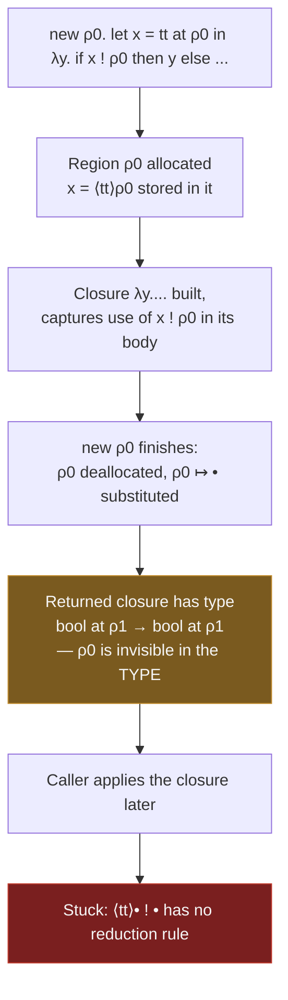
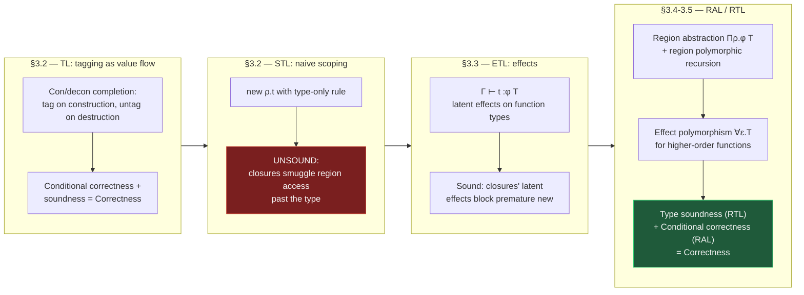

# Effect Types and Region-Based Memory Management

[[book-guidelines|↩ Back to guidelines]]

## Why does a type system need to talk about *how*, not just *what*?

A classical type judgment $\Gamma \vdash t : T$ tells you one thing: if $t$ evaluates to a value, that value has type $T$. It says nothing about *how* $t$ got there — what memory it touched, what files it opened, what exceptions it might raise along the way. For pure, terminating, side-effect-free computation that's fine. But most real programs are not pure, and the moment you want to reason statically about resource usage — specifically, about *when it is safe to reclaim memory* — a type alone is silent on the question that matters.

This chapter's central engineering problem is memory management without a garbage collector, but with the same safety guarantee a garbage collector gives you: never deallocate something that's still reachable. The traditional alternatives are stark:

- **Manual management** (`malloc`/`free`, or `new`/`delete`): fast, precise, but the compiler gives you zero help — dangling pointers and double-frees are entirely the programmer's problem.
- **Garbage collection**: safe by construction, but you pay in unpredictable pauses, runtime overhead, and loss of control over *when* memory is reclaimed — a poor fit for real-time systems, kernels, or anything with hard latency budgets.

**Region-based memory management** is a third way: allocate heap objects into coarse-grained *regions* (sub-heaps), and deallocate an entire region at once, in bulk, at a point the compiler can prove is safe. The catch is exactly "prove is safe" — and that's where effect types enter. You cannot decide when a region can die by looking at types alone, because a type describes a *value*, and the question "is this region still needed" is a question about a *computation's history of access*, not about the shape of its result. If you're building a Rust-style verifier, this should already feel familiar: this is precisely the problem Rust's borrow checker solves for stack frames and lifetimes, except this chapter builds the theory from first principles, including the failure modes Rust's design sidesteps.

The chapter's arc: start with a language that has no effects at all (§3.2), watch a naive attempt at scoped, stack-like allocation fail unsoundly (§3.2 continued), fix it by making effects explicit in [[Typed-Assembly-Language#The type system|the type system]] (§3.3), turn that fix into a full region-based memory system with region polymorphism (§3.4–3.5, culminating in the Tofte–Talpin system), automate the process of inserting region annotations (§3.6), and finally survey what breaks even in the fixed system and how practical implementations patch it (§3.7–3.8).

---

## Part 1 — Value flow by tagging: effects before they're effects

### The base language, BL

Section 3.2 starts with `BL` ("Finitary PCF"): a bog-standard simply typed, call-by-value lambda calculus with booleans and general recursion (`fix`). Nothing new here — it's the baseline against which everything else is measured, and every later language will define an *erasure* map back down to `BL` so we can ask "does adding annotations change what the program computes?"

### Tagging as a value-flow probe

The chapter's first move is deceptively simple. Extend `BL` to `TL` by adding two operations:

$$
t \text{ at } p \qquad\qquad t \mathrel{!} p
$$

read aloud as "tag $t$ with label $p$" and "untag $t$, asserting it carries label $p$." Operationally, `t at p` evaluates `t` to a value $v$ and produces a *tagged value* $\langle v \rangle_p$. The operation `t ! p` evaluates `t`, checks the tag matches $p$, and — if it does — strips the tag and returns $v$; if the tag doesn't match, evaluation **gets stuck**. This is deliberate: rather than raising a controlled error, the chapter treats a tag mismatch as an operational dead end, so that "type soundness" can be stated in the classical Wright–Felleisen style — *well-typed programs never get stuck.*

The typing rules (Figure 3-5 style, here for `TL`) simply propagate the tag into the type:

$$
\frac{\Gamma \vdash t : T}{\Gamma \vdash t \text{ at } p : T \text{ at } p} \text{ (T-Tag)}
\qquad\qquad
\frac{\Gamma \vdash t : T \text{ at } p}{\Gamma \vdash t \mathrel{!} p : T} \text{ (T-Untag)}
$$

Labels here are just atomic names (later they'll be reinterpreted as regions). The mechanism gives you free **value-flow information**: if `t ! ρ` type-checks, you know statically that the value flowing into `t` was constructed by some subterm tagged `at ρ`. This is a very cheap, "equational" (i.e., non-directional, order-insensitive) form of flow analysis — the labels don't track *when* things happen, only *which* constructor a value could have come from.

The book formalizes this via **erasure**: $\|t\|$ strips all tags/untags from a `TL` term, giving back a `BL` term. A **con/decon completion** is a way of *adding* tags to a `BL` term such that every value gets tagged exactly where it's constructed and untagged exactly where it's destructed (used as a function, tested as a boolean, etc.) — Figure 3-3's grammar pins this down precisely. The chapter proves (Theorem 3.2.11, **conditional correctness**) that a `TL` term's evaluation mirrors its erasure's `BL` evaluation, step for step, unless it gets stuck; and (Theorem 3.2.16, **soundness**) that well-typed `TL` terms never get stuck. Put together (Corollary 3.2.17): a well-typed, tagged program computes *exactly* what the underlying untagged program computes.

**What breaks without conditional correctness / soundness split.** This factoring — correctness = conditional correctness (a property purely of the *operational semantics*, provable without reference to any type system) plus soundness (a property purely of the *type system*) — is the chapter's methodological signature and it recurs at every later stage (§3.4, §3.5). Without it you'd have to reprove "the annotated program behaves like the original" from scratch every time you strengthen the type system, since the proof would be entangled with typing. By separating them, conditional correctness for `RAL` (Theorem 3.4.8) is proved once and for all, completely independent of which type system (if any) later gets bolted on top — the type system's only job, ever, is to rule out the "stuck" outcomes that conditional correctness itself is silent about.

### The unsound step: scoping regions naively

Now reinterpret labels as regions and add a *scoping* construct: `new ρ.t` allocates a fresh region, binds it to `ρ`, evaluates `t`, and then deallocates `ρ` — substituting a special dead marker `•` for `ρ` everywhere in the result. This is `STL` (Figure 3-4). The obvious-looking typing rule is:

$$
\frac{\Gamma \vdash t : T \qquad \rho \notin \mathrm{frv}(\Gamma, T)}{\Gamma \vdash \mathrm{new}\ \rho.t : T} \text{ (T-NewUnsound)}
$$

The intuition reads well: "if region $\rho$ doesn't appear free in the assumptions or the result type, then nothing outside $t$ needs $\rho$'s contents, so it's safe to deallocate $\rho$ when $t$ finishes." **And it's wrong.** Example 3.2.20 is the load-bearing counterexample of the whole chapter:

```
new ρ0. let x = tt at ρ0 in
        λy. if x ! ρ0 then y else ff at ρ1
```

This typechecks under (T-NewUnsound) — $\rho_0$ appears nowhere in the resulting function's type `bool at ρ1 → bool at ρ1`. But the *closure* captures a use of `x ! ρ0` in its body. When the region is deallocated, `ρ0` is rewritten to `•` inside the closure, and calling the returned function later gets stuck trying to reduce `⟨tt⟩• ! •`. The type — which only describes the *value* — has no way to see that the *computation triggered by calling this closure* still touches a region that's already gone. This is the chapter's crispest illustration of why classical types are the wrong tool for reasoning about deallocation: **the type of a closure says nothing about what happens when you call it.**



---

## Part 2 — Effects fix the closure problem

### Making access visible

The fix (§3.3) is to stop pretending the type of a term tells you everything about evaluating it, and introduce a second component alongside the type: the **effect**. The judgment becomes

$$
\Gamma \vdash t :^{\phi} T
$$

read "under assumptions $\Gamma$, evaluating $t$ may access the regions in $\phi$, and if it terminates, produces a value of type $T$." Here $\phi$ is a **finite set of region variables** — control-flow insensitive (no ordering recorded, just "this region might get touched somewhere during evaluation"). This is the crucial extra bit of information that types alone were missing: a description not of the *result*, but of the *computation's footprint*.

The abstraction rule is where the payoff shows up:

$$
\frac{\Gamma, x:T_1 \vdash t :^{\phi_2} T_2}{\Gamma \vdash \lambda x.t :^{\phi_1} T_1 \to \phi_2\, T_2} \text{ (TE-Abs)}
$$

Notice the function type itself now carries a **latent effect** $\phi_2$ — the effect that will occur *when the function is later called*, not when it's defined. This is exactly the missing piece from the `STL` counterexample: the closure's type now records "calling me touches $\rho_0$," so:

$$
\frac{\Gamma \vdash t :^{\phi,\rho} T \qquad \rho \notin \mathrm{frv}(\Gamma, T)}{\Gamma \vdash \mathrm{new}\ \rho.t :^{\phi - \{\rho\}} T} \text{ (TE-New)}
$$

The premise is still "$t$ has type $T$ with $\rho$ removable from its own top-level effect," but crucially, if the term produces a *closure* whose latent effect still mentions $\rho$, that latent effect is baked into the closure's function-type — which is part of $T$ — so $\rho \in \mathrm{frv}(T)$ and the rule simply fails to apply. The counterexample from §3.2 is provably *untypable* in `ETL` (Example 3.3.1): the let-expression gets effect type $\{\rho_0\}\,(\mathrm{bool\ at\ }\rho_1 \to^{\{\rho_0\}} \mathrm{bool\ at\ }\rho_1)$, and $\rho_0$ sits right there in the domain/codomain's latent effect, blocking (TE-New). Theorem 3.3.3 (soundness of `ETL`) then holds unconditionally.

**What breaks without latent effects specifically.** If you only tracked effects at the top level of a judgment (not inside function types), you'd correctly rule out region accesses in the term you're immediately looking at, but you'd still let a closure escape carrying a "time bomb" — exactly the `STL` bug. The insight to hold onto: *an effect system for a call-by-value language must attach effects to function types, not just to terms*, precisely because the danger of a function is deferred to its call site, and a plain type erases that deferral.

**Bidirectional-typing note (for the elaborator project).** The (TE-App) rule requires $\phi_2 \subseteq \phi$ — the callee's latent effect must be *contained in* the caller's ambient effect. This is a subsumption/subtyping-flavored check bolted onto an otherwise syntax-directed (inference-mode) system: you can read $\phi_2 \subseteq \phi$ as effect *checking* against an inferred latent effect, the same "infer, then check compatibility" shape that shows up constantly in bidirectional typing.

---

## Part 3 — Region-based memory management proper: RAL and region polymorphism

### From tags to regions with abstraction

Section 3.4 promotes the mechanism from a toy language to something that looks like a real compilation target: `RAL`, the Region-Annotated Language. Three primitives now exist explicitly: allocate a region, allocate a value in a region, deallocate a region. New machinery: **region abstraction** and **region application**,

$$
\lambda\rho.u \qquad\qquad t\,[\![p]\!]
$$

A region abstraction is a function parameterized not over *values* but over *which region to use*. This is the single most important addition for practicality, because it enables **region polymorphism** — and specifically **region-polymorphic recursion**: a recursive function's self-calls may instantiate its region parameters *differently* on each call. The book's Fibonacci example makes the necessity vivid:

```
fix fib. (λρi. (λρo. (λn.
    if new ρ. (n < (2 at ρ) then 1 at ρo)
    else new ρ1.
           new ρ2. fib[[ρ2]][[ρ1]] (new ρ. n -at ρ2 (2 at ρ))
       +at ρo new ρ3. fib[[ρ3]][[ρ1]] (new ρ. n -at ρ3 (1 at ρ))
    ) at ρi) at ρi) at ρf
```

Each recursive call gets *fresh, short-lived* regions ($\rho_2$, $\rho_3$) for its argument, rather than being forced to reuse `fib`'s own formal parameter region. **Without region-polymorphic recursion, every activation of `fib` would have to live in the same region as the top-level call** — meaning nothing ever gets deallocated until the entire recursion finishes, defeating the entire point of scoped allocation (Exercise 3.4.2 asks exactly this). Region polymorphism is to regions what generic/parametric polymorphism is to values: a mechanism for *reuse without forced sharing of lifetime*.

The book also introduces the compact `letrec f[ρ1,…,ρk](x) at ρ = t1 in t2` notation from the original Tofte–Talpin calculus, and shows it desugars into `RAL`'s more primitive `fix` + region abstraction. This combined construct is what enforces **let-polymorphism** discipline on region/effect generalization: every mention of `f` must fully instantiate its region and effect parameters, mirroring ML's classic let-polymorphism restriction (and its later relaxation into explicit System-F-style polymorphism in the chapter's own `RTL` presentation).

### Conditional correctness, again, but for real this time

Theorem 3.4.8 restates conditional correctness for `RAL`: if $\mathrm{eval}_R(t) \neq \mathrm{wrong}$, then $\mathrm{eval}_R(t) = \mathrm{eval}(\|t\|)$ — a region-annotated program that doesn't go wrong computes the same thing as its unannotated erasure. The proof is entirely about the *evaluation rules*; it holds for **every** `RAL` term, typed or not. This cleanly separates two very different failure modes that a naive analysis might conflate: "the annotations changed the meaning of my program" (ruled out unconditionally by conditional correctness) versus "the annotations are unsafe, i.e. access memory that's gone" (the only thing a type system needs to rule out). Proposition 3.4.6 even proves it's safe to *reuse* deallocated memory (replace dead `⟨…⟩•` values with fresh ones) as long as the program doesn't go wrong either way — this is the theoretical justification for actually recycling region storage in an implementation, not just conceptually "forgetting" it.

---

## Part 4 — The Tofte–Talpin type system (`RTL`): tying it all together

Section 3.5 assembles the full type system, `RTL`. The judgment now carries three kinds of polymorphism simultaneously:

$$
\Gamma \vdash t :^{\phi} T
\qquad\qquad
T ::= X \mid \mathrm{bool} \mid (T \to^{\phi} T,\, p) \mid (\Pi\rho.^{\phi} T,\, p) \mid \forall X.T \mid \forall\epsilon.T
$$

named in words: $X$ is a **type variable** (ordinary parametric polymorphism, generalized/instantiated by rules `RT-TGen`/`RT-TInst`, just like System F); $(T \to^{\phi} T, p)$ is a **function type tagged with the region $p$ where the closure itself lives** plus its latent effect $\phi$; $(\Pi\rho.^{\phi}T, p)$ is a **region-polymorphic type** — "give me a region and I'll produce something of type $T$ with effect $\phi$" — generalized/instantiated by `RT-RAbs`/`RT-RApp`; and $\forall\epsilon.T$ is **effect polymorphism**, generalized/instantiated by `RT-EGen`/`RT-EInst`.

### Why effect polymorphism specifically

The motivating example is `map`. In the region-free base language, `map : ∀α,β. (α→β) × α list → β list`. Once you add regions, applying the argument function has *some* effect $\phi$ — but you don't want to commit to a fixed $\phi$ in `map`'s own type, because that would force every caller's argument function to have exactly that effect. The fix:

$$
\forall\alpha,\beta.\forall\epsilon.\, (\alpha \to^{\epsilon} \beta) \times (\alpha\,\mathrm{list}, \rho) \to^{\{\rho,\rho'\}\cup\epsilon} (\beta\,\mathrm{list}, \rho')
$$

The effect variable $\epsilon$ is generalized over, so each call to `map` can instantiate it with whatever effect its particular argument function actually has. **What breaks without effect polymorphism**: without it, higher-order functions like `map` would need one effect annotation good for *every* possible caller — which in practice forces you to make it "large enough" to cover any use, keeping regions alive far longer than necessary and defeating the memory-management payoff entirely. Effect polymorphism is exactly what type polymorphism is to values, applied one level up: it lets a single definition of `map` serve callers with wildly different, statically distinct effects, the same way `∀α.` lets one definition of `map` serve callers with different element types.

### Type soundness, structurally

The soundness proof (Substitution Lemma 3.5.7, Subject Reduction / Preservation Proposition 3.5.8, Progress Proposition 3.5.9, culminating in Corollary 3.5.11) follows the textbook Wright–Felleisen recipe you'd recognize from any small-step soundness proof — but two lemmas are specific to effect systems and worth internalizing if you're building a verifier of your own:

- **Effect enlargement (Lemma 3.5.5):** if $\Gamma \vdash t :^{\phi} T$ and $\phi \subseteq \phi'$, then $\Gamma \vdash t :^{\phi'} T$. Effects are only ever a *sound over-approximation* of what actually happens — you can always claim "maybe more regions are touched than really are," never "fewer." This is the standard soundness-vs-precision trade-off of any static analysis, made explicit as an admissible rule.
- **Values have empty effect (Lemma 3.5.6):** if a *value* (not an arbitrary term) is well-typed with some effect $\phi$, it's also well-typed with effect $\emptyset$. Evaluating something that's already a value causes no further observable access — obvious operationally, but it's the technical linchpin that lets Subject Reduction go through cleanly at every beta-reduction step (you substitute a value, which brings zero extra effect baggage with it).

Corollary 3.5.11, **type soundness for `RTL`**, is the theorem this entire buildup exists to prove: a well-typed `RAL` program never goes `wrong` — i.e., never accesses a deallocated region. Combined with conditional correctness (Theorem 3.4.8), you get full **correctness**: a `TT`-annotated program computes exactly what its unannotated original computes, and never touches memory it shouldn't.



---

## Part 5 — Region inference: from annotation to automation

Section 3.6 addresses a practical question the previous sections dodge: who writes all these `new`, region abstractions, and applications? The trivial answer — one giant region for the whole program (Exercise 3.6.1) — always type-checks but never deallocates anything until the program finishes; it's "correct but worthless," the region-typing equivalent of a type checker that always infers `Object` for everything.

Real region inference (Tofte–Birkedal 1998) resembles Algorithm W: it builds the `RTL` typing tree for a hypothesized annotation, unifying types and region/effect metavariables as it goes, and collects **subset/membership constraints** ($\phi \subseteq \phi'$, $\rho \in \phi$) at points it can't yet resolve (analogous to deferred unification constraints in an elaborator). Once a subexpression's constraints show that some region variables appear *only* in effect position — never in the type or the ambient environment — a `new` can be soundly inserted around exactly that subexpression, and those constraints can be discharged.

For recursive functions the type scheme to abstract over is itself unknown up front, so the algorithm uses **Mycroft iteration**: guess an unconstrained polymorphic type scheme for the function, analyze the body under that optimistic assumption, and if the result doesn't match the guess, iterate with the new scheme until reaching a fixpoint. The original algorithm terminates by heuristically limiting how much generalization it attempts — at the cost of completeness (some programs get suboptimal, longer-lived regions than necessary). Birkedal–Tofte's later constraint-based reformulation achieves a weaker but still useful **restricted completeness** result. There's also an easier special case: for *first-order* programs (no function-typed arguments or results), effect polymorphism is provably unnecessary, because latent effects reduce to a bounded per-argument-position bit vector — this is a nice concrete illustration of how restricting the type discipline (dropping higher-order functions) can convert an open-ended fixpoint problem into a decidable, terminating one.

---

## Part 6 — What still breaks: the lexical-scoping straitjacket

Even with region polymorphism, `new`'s fundamental commitment — a region's lifetime is tied to the lexical structure of *one expression* — is too rigid for iterative code. Section 3.7's "Game of Life" example is the chapter's second load-bearing counterexample (after §3.2's `STL` bug), and it's worth internalizing because it's a completely different *kind* of failure than unsoundness: this time the program is perfectly type-safe, but it leaks memory and breaks tail-call optimization.

```
letrec life[ρn, ρg](n, g) =
  if n=0 then g
  else new ρn′
       in life[ρn′, ρg]((n-1) at ρn′, nextgen[ρg](g))
```

Two distinct problems, both caused by `new` binding a region's death to the completion of *its enclosing expression*:

1. **Broken tail recursion.** The recursive call to `life` sits *inside* a `new ρn′.…`, so after the call returns there's still work to do — deallocate `ρn′`. That's not a tail call anymore. Every iteration's `ρn′` piles up on the call stack, un-reclaimed until the whole recursion unwinds.
2. **A structural space leak.** Since `nextgen` must build its output generation in the *same* region as its input (there's no other region available at that scope), the region holding generation $k$ can only be deallocated once generation $k+1$'s consumer no longer needs it — chained all the way to the final result. Every intermediate generation survives to the end.

Both problems trace to one design decision: **region lifetime = lexical extent of `new`'s body.** This is worth sitting with, because it's the chapter's central and most transferable idea for a Rust-oriented reader: this is *exactly* the shape of the pre-NLL (non-lexical-lifetimes) Rust borrow checker's own well-documented over-conservatism — a borrow's scope tied to lexical structure rather than to a computed liveness range produces spurious "still borrowed" errors on code that's actually fine, for the same underlying reason. The Tofte–Talpin theory got here first, in 1997.

The chapter surveys three responses, each trading something away:

| Approach | Fix | What it costs |
|---|---|---|
| **ML Kit region resetting** (`atbot`/`attop`) | A local liveness analysis lets an allocation reset (empty out) a region before writing into it, instead of allocating a fresh one | Requires manual program rewriting (e.g. introducing a `copy` function) to expose the pattern the analysis can find; no published soundness proof for the storage-mode analysis itself |
| **Aiken–Fähndrich–Levien (AFL) early deallocation** | Decouples *allocation/deallocation* from `new` entirely — `new` just introduces a region *variable*; explicit `[[alloc ρ]]`/`[[free ρ]]` commands, placed by a separate data-flow analysis, do the actual work | Placement isn't always ideal (must match all call sites uniformly); still layered on top of TT's `new`-scoping discipline |
| **Henglein–Makholm–Niss (HMN) imperative regions** | Eliminates `new` altogether — regions are passed as explicit input/output parameters (`i: ρ`, `o: ρ'`), with a fresh typing judgment $\Psi \vdash \{\Delta_1;\Gamma_1\}\ t : T\ \{\Delta_2;\Gamma_2\}$ that lets a value's region-annotated type *change* over the course of evaluation | No `new`-scoping constraint to fight at all — cleanest fix — but the theory hasn't been extended to higher-order functions, and the machinery (Hoare-triple-shaped judgment with pre/post region contexts) is a genuinely new, separately-proved system, not a patch on TT |

**Load-bearing connection to the Hoare-triple project.** The HMN judgment $\Psi \vdash \{\Delta_1;\Gamma_1\}\ t : T\ \{\Delta_2;\Gamma_2\}$ is, structurally, a Hoare triple: a precondition on the store shape ($\Delta_1;\Gamma_1$), a command ($t$), and a postcondition ($\Delta_2;\Gamma_2$) — with regions playing the role of the mutable resource whose *availability* (not value) is what's being tracked pre/post. If your Rust verifier is meant to check Hoare-style contracts, this section is a direct ancestor: it's precisely "Hoare logic where the assertion language talks about which capabilities/regions are live," which is close kin to separation-logic-style resource tracking (`own(ρ)`, `dead(ρ)`) rather than pure value predicates.

Cyclone's approach, mentioned in passing here (and expanded in §3.8), sidesteps effect variables altogether with a **region subtyping** relation: $\rho$ *outlives* $\rho'$ if $\rho$'s lifetime encompasses $\rho'$'s, and a value in the longer-lived region can always be used where the shorter-lived one is expected. This "outlives" relation is, almost verbatim, Rust's `'a: 'b` lifetime-outlives bound.

---

## Part 7 — Practical systems: from theory to compilers

Section 3.8 closes the chapter by [[Dependent-Types#Grounding|grounding]] all of this in shipped systems:

- **ML Kit** (Standard ML): implements TT theory plus §3.7's region resetting and a **multiplicity analysis** that classifies each region as *finite* (provably holds at most one value — can be stack-allocated) or *infinite* (needs heap allocation). Because TT regions already follow a stack discipline aligned with expression structure, finite regions can literally live on the normal call stack — a direct efficiency payoff of the theory's stack-shaped lifetime discipline. A conservative garbage collector was later added as a safety net for code that resists region-friendly restructuring.
- **Cyclone**: a type-safe C dialect with three region kinds (global/heap, stack, and dynamic/lexically-scoped), using the `regions_of` type operator instead of effect variables — `regions_of` applied to a type variable stays abstract until instantiation, which is how the effect-propagation trick in `map`'s type gets reproduced without dedicated effect polymorphism. This is the chapter's most direct textual bridge to Rust: Cyclone was an explicit ancestor in the lineage that led to Rust's ownership/region system, and the `outlives` subtyping relation described in §3.7 is the direct formal ancestor of `'a: 'b`.
- **Other systems**: RegJava (Java), a region-annotated Prolog compiler (Makholm–Sagonas), and Gay–Aiken's RC — the last one notable for giving up static safety guarantees entirely in favor of **runtime reference counting** on regions, illustrating the general trade-off: static region typing buys compile-time safety at the cost of type-system complexity; runtime region reference-counting buys implementation simplicity at the cost of that guarantee.

---

## Grounding: this is Rust's lifetime system, minus the sugar

The workbench's priority is Rust, and this chapter is about as directly transferable as type theory gets. A rough dictionary:

| Tofte–Talpin / this chapter | Rust |
|---|---|
| Region variable $\rho$ | Lifetime parameter `'a` |
| `new ρ.t` (lexically scoped region) | A lexical scope / stack frame — implicit region in Rust, made explicit here |
| Region abstraction $\Pi\rho.\phi\,T$ | A generic function `fn f<'a>(...)` |
| Region-polymorphic recursion | Each recursive call to a generic function can instantiate `'a` freshly |
| Latent effect $\phi$ on a function type | Roughly: the set of lifetimes a closure's `Fn`/`FnMut`/`FnOnce` bound captures — Rust doesn't reify this as a separate effect annotation, but the borrow checker computes an analogous "what does calling this borrow" fact internally |
| `ρ outlives ρ'` (Cyclone) | `'a: 'b` |
| Effect polymorphism $\forall\epsilon.T$ (for `map`) | Higher-ranked trait bounds / `for<'a>` closures capturing borrows generically |
| §3.7's tail-recursion / space-leak failures under strict lexical `new` | Pre-NLL Rust's over-conservative borrow scopes; NLL is a real-world instance of "decouple liveness from lexical structure," exactly the move AFL and HMN make |
| HMN's $\{\Delta_1;\Gamma_1\}\ t : T\ \{\Delta_2;\Gamma_2\}$ judgment | The conceptual shape of a borrow-checker pass: a pre-state of live borrows, a statement, a post-state |

A small Rust sketch of the region-polymorphic Fibonacci idea, to make the correspondence concrete — the point isn't the arithmetic, it's that each call gets a fresh, independently-scoped allocation whose lifetime the compiler infers rather than requiring you to write region variables by hand:

```rust
// Each call to `fib` allocates its own local `Vec` — a fresh "region" —
// whose lifetime is exactly the call's stack frame. No two calls share
// a region; that's what region-polymorphic recursion is buying you.
fn fib(n: u64) -> u64 {
    if n < 2 {
        1
    } else {
        // `left`/`right` are each their own short-lived allocation,
        // deallocated at the end of *this* call, not the whole recursion.
        let left: Vec<u64> = vec![fib(n - 2)];
        let right: Vec<u64> = vec![fib(n - 1)];
        left[0] + right[0]
    }
}
```

Rust's borrow checker performs, automatically and per-function, roughly what §3.6's region-inference algorithm does by unification-based constraint solving over an explicit calculus — the chapter is useful precisely because it de-sugars the "magic" of `rustc`'s lifetime inference into an auditable typing-and-inference discipline you could, in principle, implement.

---

## Where this leads

This chapter is self-contained relative to the rest of the book (per the editor's design), but its internal machinery is a direct rehearsal for two things a Rust-oriented verifier will need:

1. **Effect systems as the general pattern for "types describe results, effects describe access."** Any checker that needs to reason about aliasing, borrowing, or resource lifetimes — not just region deallocation — will reinvent some version of a latent effect on function types. If your compiler pass needs "what does calling this closure touch," this chapter's `TE-Abs`/`RT-Abs` rules are the reference design.
2. **The HMN-style pre/post judgment as a template for Hoare-triple checking.** The chapter's imperative-regions calculus is, structurally, the smallest interesting instance of "track a resource's availability across statements via pre/postconditions" — exactly the shape you'll need if the Rust verifier is meant to check user-supplied Hoare-style contracts, just generalized from "is this region alive" to arbitrary logical predicates.

Within Part I of the book itself, this chapter sits alongside Chapter 1 (substructural types) as a second, independently-motivated route to the same underlying problem — safe, static resource management without a garbage collector — and the two are worth reading in tandem: Chapter 1's linear/ordered qualifiers attack the "used exactly once" discipline directly on values, while this chapter attacks "deallocate when nothing needs it anymore" via effects on computations. Part II ([[Typed-Assembly-Language|Typed Assembly Language]], Proof-Carrying Code) picks up the low-level-safety thread from a different angle — types on *machine code* rather than on a lambda calculus — and Chapter 4 in particular revisits memory safety (shared vs. unique pointers) with a flavor that rhymes with this chapter's region discipline but is decided independently.
