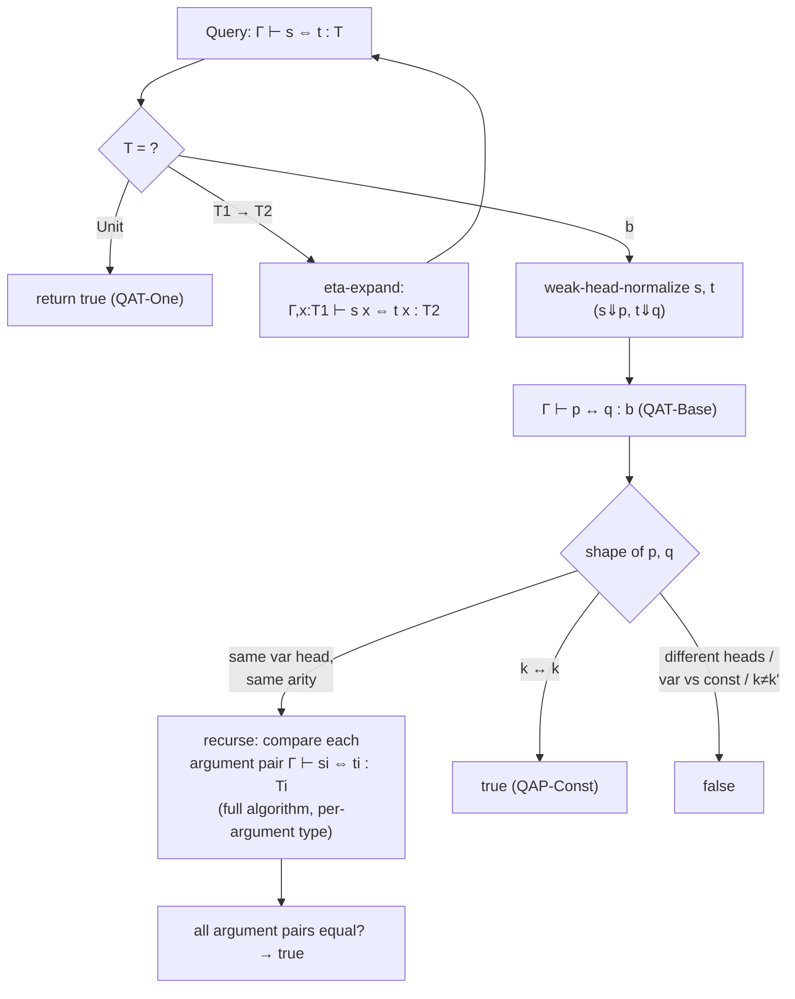

# Logical Relations and Equivalence Checking

[[book-guidelines|↩ Back to guidelines]]

## Why does an equality checker need a proof technique at all?

Suppose you're writing a type checker (or an elaborator, or a proof assistant kernel), and it needs to answer a question that comes up constantly: are these two terms *the same*? Not syntactically identical — `(λx. x) y` and `y` obviously aren't the same string — but equal in whatever sense [[Typed-Assembly-Language#The type system|the type system]] cares about. This is **definitional equivalence**, and every dependently-typed kernel, every `rfl`-checker, every unifier that needs to decide "does this metavariable's assigned value match what's expected" is built on top of some algorithm that answers this question.

The naive approach — normalize both terms, then compare the results for syntactic identity — is called **normalize-and-compare**, and it works fine for the plain simply typed lambda-calculus. But Karl Crary's chapter opens by showing, with a genuinely small and sharp example, that normalize-and-compare *breaks* the moment your language has any type whose equality depends on the type itself rather than on term structure. The stock example: a type `Unit` with exactly one inhabitant. Two variables `x:Unit` and `y:Unit` are equal — not because they reduce to the same normal form (they're already normal, and they're different variables) but because *any* two terms of type `Unit` must denote the same thing, since there's only one thing to denote. No amount of reduction will ever make the syntax of `x` match the syntax of `y`. The information that licenses the equality lives in the type, not in the term.

So you need a different strategy: a **type-directed algorithm** that consults the type as it walks down the terms, rather than reducing to normal form and hoping structural comparison suffices. Crary builds exactly such an algorithm for $\lambda^{\to}_b$ (the simply typed lambda-calculus with a base type, later extended with `Unit`), and it works — informally, it's clearly sound. But *proving* it complete (that it accepts every pair of terms that really are definitionally equal) turns out to require machinery well beyond ordinary structural induction. That machinery is **logical relations**, and this chapter is the cleanest, most self-contained worked example of the technique you'll find anywhere. It's also, not coincidentally, a blueprint for exactly the kind of code a `whnf`/`isDefEq`-style equality checker actually runs.

---

## Part 1: The equivalence problem and why normalize-and-compare isn't enough

### The base system

Figure 6-1 sets up $\lambda^{\to}_b$: variables, abstraction, application, and constants `k` of a single uninhabited-by-structure base type `b` (so the base type isn't trivial — there's actual content to compare). The **definitional equivalence** judgment is $\Gamma \vdash s \equiv t : T$ — "in context $\Gamma$, terms $s$ and $t$ are equivalent, as members of type $T$." It's defined by seven rules: three make it an equivalence relation (Q-Refl, Q-Symm, Q-Trans), two make it a congruence over the syntax (Q-Abs, Q-App), and two are the substantive rules:

- **Q-Beta**: $\Gamma \vdash (\lambda x{:}T_1.s_{12})\, s_2 \equiv [x \mapsto t_2]t_{12} : T_2$ — a beta-redex is equivalent to its contractum.
- **Q-Ext** (extensionality): $\Gamma \vdash s \equiv t : T_1 \to T_2$ follows from $\Gamma, x{:}T_1 \vdash s\,x \equiv t\,x : T_2$ — two functions are equal if they agree on all arguments (a fresh variable stands in for "all possible arguments").

Notice this judgment is defined *directly*, with no appeal to an operational semantics — hence "definitional" equivalence. The type $T$ at which you compare terms looks decorative here (none of these seven rules inspect it), but Crary flags this explicitly: it will matter enormously once `Unit` is added.

**What this connects to, immediately:** the book motivates term equivalence in $\lambda^{\to}_b$ by pointing out it's the same problem, "one level down," as *type* equivalence in $\lambda^\omega$ (higher-kinded types) — terms/types/kinds shift by one level, so an equivalence checker for terms is structurally the same artifact as a type-equivalence checker in a richer kind system. This is exactly the observation that generalizes to a dependently-typed kernel: the machinery that decides "are these two terms `Defeq`" is the *same* machinery (modulo universe bookkeeping) that a Lean-style kernel uses to decide type equality during type checking.

### Normalize-and-compare, and where it comes from

Figure 6-2 gives a **parallel reduction** relation $s \Rightarrow t$ (reduces possibly many redexes "in parallel," not just one at a time — this is a standard device for getting confluence proofs to go through more easily than with single-step reduction). Its symmetric-transitive closure is written $\Leftrightarrow^*$. The strategy needs three ingredients to work:

1. **Suitability** — $\Rightarrow$ must be derivable from the equivalence rules such that $\Gamma \vdash s \equiv t : T \iff s \Leftrightarrow^* t$ (for well-typed $s, t$).
2. **Confluence** — if $r \Rightarrow^* s$ and $r \Rightarrow^* t$, some $u$ exists with $s \Rightarrow^* u$ and $t \Rightarrow^* u$.
3. **Normalization** — every term has an effectively computable normal form.

Given confluence, Lemma 6.2.1 lets you decide $s \Leftrightarrow^* t$ by comparing normal forms $s'$ and $t'$ for syntactic identity. This is genuinely the algorithm most people picture when they hear "check if two terms are equal": reduce both sides fully, then `==` the results.

**What breaks without normalization+confluence:** if the reduction relation isn't confluent, comparing "a" normal form is meaningless — different reduction paths could produce different normal forms and you'd get a false negative. Exercise 6.2.3 makes this concrete: the rule QR-Eta (used to derive $\Rightarrow$ from Q-Ext) only preserves confluence for *well-typed* terms — feed it an ill-typed term and confluence can fail outright. This is a first hint that "type information is load-bearing," which is about to become the chapter's main theme.

### Where normalize-and-compare dies: the Unit type

Figure 6-3 adds a second base type, `Unit`, with a single term `unit`. Its equivalence rule is the crux of the whole chapter:

$$\dfrac{\Gamma \vdash s : \mathrm{Unit} \qquad \Gamma \vdash t : \mathrm{Unit}}{\Gamma \vdash s \equiv t : \mathrm{Unit}} \quad \text{(Q-Unit)}$$

Read this rule carefully: it doesn't inspect $s$ or $t$ at all beyond confirming they have type `Unit`. *Any* two terms of type `Unit` are equivalent, full stop — because `Unit` has exactly one inhabitant, so anything claiming to be a `Unit` value must denote it. Compare this to the strictly weaker rule Q-Unit-Weak, which only asserts `unit ≡ unit : Unit` — sound, but derivable already from Q-Refl, and useless for proving `x ≡ y : Unit` where `x` and `y` are two different free variables of type `Unit`. Yet that equivalence *does* hold under Q-Unit, and its derivation is genuinely two lines:

```
T-Var                              T-Var
x:Unit,y:Unit ⊢ x:Unit             x:Unit,y:Unit ⊢ y:Unit
─────────────────────────────────────────────────────────  Q-Unit
        x:Unit, y:Unit ⊢ x ≡ y : Unit
```

`x` and `y` are already in normal form and syntactically distinct — normalize-and-compare would say "no, not equal," and it would be *wrong*. The equivalence has nothing to do with the shape of `x` and `y`; it's forced entirely by their type. This is the concrete, minimal counterexample showing normalize-and-compare's blind spot: **it has no channel through which type information can influence the comparison.**

> **What breaks without type-directedness:** any type whose equational theory is not purely "structural" (i.e. any type with more equalities than syntactic identity of normal forms accounts for — unit types, but also things like proof-irrelevant propositions, or extensional function equality without eta as a rewrite rule) defeats a pure syntax-comparison algorithm. This is precisely the shape of problem a real elaborator hits with definitional proof irrelevance or subsingleton types.

---

## Part 2: A type-directed equivalence algorithm

Crary's fix: don't normalize blindly and then compare; drive the comparison **by the type**, and only normalize as much as the type currently under consideration demands.

### The two structural observations

1. **At `Unit`, return `true` immediately.** If $\Gamma \vdash s : \mathrm{Unit}$ and $\Gamma \vdash t : \mathrm{Unit}$, then Q-Unit gives you $\Gamma \vdash s \equiv t : \mathrm{Unit}$ for free — no term inspection needed.
2. **At $T_1 \to T_2$, eta-expand and recurse at $T_2$.** Turn the query "is $s \equiv t : T_1 \to T_2$?" into "is $s\,x \equiv t\,x : T_2$?" for a fresh $x$. The two queries are provably equivalent: Q-Ext gives you one direction, and Q-App plus a **Weakening Lemma** (6.4.1: $\Gamma \vdash s \equiv t : T \Rightarrow \Gamma, x{:}S \vdash s \equiv t : T$) gives you the other.

Repeatedly applying observation 2 reduces *any* equivalence query to one at base type `b`. So the only remaining work is deciding equivalence at `b`.

### Equivalence at base type: paths

At `b`, weak-head-normalize both sides. **Weak head normalization** reduces only the leftmost-outermost redex, repeatedly, stopping the instant the term is no longer headed by a redex — it does *not* keep reducing inside subterms once the head position is settled. Why stop early? Because if we're going to compare `x s1 ... sn` against `x t1 ... tn`, the comparison of `si` to `ti` is going to recursively re-invoke the *entire* type-directed algorithm anyway (with its own weak-head-normalization at whatever type `si` has) — so fully normalizing `si` up front, before we even know we need to, is wasted work if `si`'s type happens to be `Unit` (in which case the recursive call returns `true` without even looking at the term). This laziness is the algorithmic payoff of type-directedness: **you normalize exactly as much as the comparison structure demands, no more.**

A term of base type in weak head normal form is either a constant `k` or a **path**: $x\, s_1 \ldots s_n$ — a variable applied to a spine of arguments. (Abstractions are weak-head normal too, but they can't have type `b`, so they never arise here.) Comparing two terms at base type reduces to one of five shapes:

1. $x\,s_1 \ldots s_n \overset{?}{\equiv} x\,t_1\ldots t_n$ — same head variable, same arity (forced since both sides share the type $T$) — recurse on each $s_i \overset{?}{\equiv} t_i$ using the **full** algorithm (not syntactic comparison!) at $s_i$'s type.
2. $k \overset{?}{\equiv} k$ — same constant — `true`.
3. $x\,s_1\ldots s_m \overset{?}{\equiv} y\,t_1\ldots t_n$ with $x \ne y$ — `false` (nothing is known about distinct free variables, so nothing forces equality).
4. $x\,s_1\ldots s_n \overset{?}{\equiv} k$ — `false`.
5. $k \overset{?}{\equiv} k'$, $k \ne k'$ — `false`.

### The formal algorithm (Figure 6-4)

Four mutually defined judgments, exactly as the book presents them:

$$\Gamma \vdash s \Leftrightarrow t : T \quad \text{(algorithmic term equivalence — type-directed, inputs } \Gamma,s,t,T\text{)}$$

$$\dfrac{s\Downarrow p \quad t \Downarrow q \quad \Gamma \vdash p \leftrightarrow q : b}{\Gamma \vdash s \Leftrightarrow t : b}\ \text{(QAT-Base)} \qquad \dfrac{\Gamma, x{:}T_1 \vdash s\,x \Leftrightarrow t\,x : T_2}{\Gamma \vdash s \Leftrightarrow t : T_1 \to T_2}\ \text{(QAT-Arrow)} \qquad \dfrac{}{\Gamma \vdash s \Leftrightarrow t : \mathrm{Unit}}\ \text{(QAT-One)}$$

$$\Gamma \vdash p \leftrightarrow q : T \quad \text{(algorithmic path equivalence — structure-directed on the path, } T \text{ is an output)}$$

$$\dfrac{x{:}T \in \Gamma}{\Gamma \vdash x \leftrightarrow x : T}\ \text{(QAP-Var)} \qquad \dfrac{\Gamma \vdash p \leftrightarrow q : T_1{\to}T_2 \quad \Gamma \vdash s \Leftrightarrow t : T_1}{\Gamma \vdash p\,s \leftrightarrow q\,t : T_2}\ \text{(QAP-App)} \qquad \dfrac{}{\Gamma \vdash k \leftrightarrow k : b}\ \text{(QAP-Const)}$$

$$s \rightsquigarrow t \quad \text{(one weak head reduction step)}, \qquad s \Downarrow t \quad \text{(iterate to a weak head normal form)}$$

Note the elegant duality: **term equivalence** ($\Leftrightarrow$) is *type*-directed — it drives the type down toward `b`. **Path equivalence** ($\leftrightarrow$) is *structure*-directed — it drives the term's spine down toward a variable or constant, and the type comes out as a byproduct.



**What breaks without weak-head laziness:** if you fully normalized before comparing, you'd force reduction inside subterms whose equality could be settled instantly by their *type* (e.g. anything of type `Unit`) — needless work, and in a language with nontermination risk near function bodies, needless risk of divergence during a check that should have been trivial.

### This is exactly what a real kernel does

If you've ever looked at Lean's `whnf` and `isDefEq`, this is not an analogy — it's the same algorithm. `isDefEq` is type-directed in exactly this sense (eta for `Pi`-types unfolds analogously to QAT-Arrow), and `whnf` is precisely weak head normalization: reduce only enough to expose the head constructor, don't gratuitously reduce arguments you might not need. The "paths" of this chapter are what Lean's kernel calls "neutral terms" — a free variable (or metavariable, or opaque constant) applied to a spine — and the case split (variable-headed vs. variable-headed with matching heads vs. constant vs. mismatched) is exactly the shape of the neutral/neutral comparison branch inside a real `isDefEq`. In Rust terms, if you were implementing this, `s ⇓ t` is a `fn whnf(&self, term: &Term) -> Term` that pattern-matches on the term's head constructor and recurses only when it's a redex; `Γ ⊢ s ⇔ t : T` is `fn is_def_eq(&self, ctx: &Ctx, s: &Term, t: &Term, ty: &Type) -> bool` branching on `ty`'s shape first.

```rust
// Sketch: the shape of the type-directed comparison, à la Figure 6-4.
enum Ty { Unit, Base, Arrow(Box<Ty>, Box<Ty>) }

fn term_equiv(ctx: &Ctx, s: &Term, t: &Term, ty: &Ty) -> bool {
    match ty {
        Ty::Unit => true,                                  // QAT-One
        Ty::Arrow(t1, t2) => {                              // QAT-Arrow: eta-expand
            let x = ctx.fresh(t1);
            term_equiv(&ctx.extend(x, t1), &s.app(x), &t.app(x), t2)
        }
        Ty::Base => {                                        // QAT-Base
            let (p, q) = (whnf(ctx, s), whnf(ctx, t));
            path_equiv(ctx, &p, &q)                          // returns bool + implicit type
        }
    }
}
```

---

## Part 3: Soundness is easy; completeness is the hard direction

Two separate obligations:

- **Soundness**: if the algorithm says "yes," the terms really are definitionally equivalent — $\Gamma \vdash s \Leftrightarrow t : T \Rightarrow \Gamma \vdash s \equiv t : T$. (Left as Exercise 6.4.3; it's the "easy" direction because each algorithmic rule is a valid derived rule of the definitional system.)
- **Completeness** (Proposition 6.5.1): if the terms really are equivalent, the algorithm says "yes" — $\Gamma \vdash s \equiv t : T \Rightarrow \Gamma \vdash s \Leftrightarrow t : T$. This is what the rest of the chapter is about, and it's genuinely hard.

### The straightforward induction — and exactly where it dies

The natural plan: induct on the derivation of $\Gamma \vdash s \equiv t : T$. Alongside it you need Proposition 6.5.2 ($\Gamma \vdash t : T \Rightarrow \Gamma \vdash t \Leftrightarrow t : T$, needed for the Q-Refl case). Most rules go through with two supporting lemmas:

- **Lemma 6.5.3 (Algorithmic Symmetry)**: $\Gamma \vdash s \Leftrightarrow t : T \Rightarrow \Gamma \vdash t \Leftrightarrow s : T$ — needed for Q-Symm.
- **Lemma 6.5.4 (Algorithmic Transitivity)**: chains $\Leftrightarrow$ — needed for Q-Trans. (Proved by simultaneous induction with the analogous property for path equivalence — a recurring pattern: the term-level and path-level judgments are so entangled that you basically never get to induct on one without dragging the other along.)
- **Lemma 6.5.5 (Algorithmic Weak Head Closure)**: $\Gamma \vdash s \Leftrightarrow t : T$ and $s' \rightsquigarrow^* s$, $t' \rightsquigarrow^* t$ implies $\Gamma \vdash s' \Leftrightarrow t' : T$ — needed for Q-Abs, since the induction hypothesis gives you equivalence of the *bodies* but you need it for the (unreduced) eta-expansions.

But then **application** stops the whole proof cold. Consider Q-App:

$$\dfrac{\Gamma \vdash s_1 \equiv t_1 : T_1 \to T_2 \qquad \Gamma \vdash s_2 \equiv t_2 : T_1}{\Gamma \vdash s_1 s_2 \equiv t_1 t_2 : T_2}$$

The induction hypothesis hands you $\Gamma \vdash s_1 \Leftrightarrow t_1 : T_1 \to T_2$ and $\Gamma \vdash s_2 \Leftrightarrow t_2 : T_1$. You want $\Gamma \vdash s_1 s_2 \Leftrightarrow t_1 t_2 : T_2$. Inverting the first fact via QAT-Arrow gives you $\Gamma, x{:}T_1 \vdash s_1 x \Leftrightarrow t_1 x : T_2$ — but that compares $s_1$ and $t_1$ applied to a **fresh variable**, and the algorithm's behavior on `s1 x` vs `t1 x` is *entirely unrelated*, mechanically, to its behavior on `s1 s2` vs `t1 t2`. The induction hypothesis, as stated, simply carries no information about what happens when you apply related functions to a *specific, real* argument. This is the crux failure the whole rest of the chapter exists to repair.

> **What breaks without logical relations here:** you cannot patch this with a cleverer induction on the same relation. The problem isn't a missing lemma about $\Leftrightarrow$ — it's that $\Leftrightarrow$, as a bare relation, doesn't carry enough structure at arrow types to be inductively self-sufficient. You need a relation that is *by construction* closed under application.

---

## Part 4: Logical relations — the general technique

**Definition 6.6.1 (Logical relation).** A relation $R(s, t, T)$ (indexed by type, $s,t$ both of type $T$) is **logical** if whenever $R(s_1, t_1, T_1 \to T_2)$ and $R(s_2, t_2, T_1)$ hold, it follows that $R(s_1 s_2, t_1 t_2, T_2)$ holds too.

In words: relatedness of two applications $s_1 s_2$ and $t_1 t_2$ is *inherited* from relatedness of the pieces — the function parts related to each other, and the argument parts related to each other. It's called "logical" because it respects the type constructor's corresponding logical connective (arrow $\leftrightarrow$ implication). Section 6.5's crisis is now precisely diagnosable: **algorithmic equivalence, as currently proved, is not (yet, provably) logical.** You can't get $R(s_1 s_2, t_1 t_2, T_2)$ out of $R(s_1, t_1, T_1{\to}T_2)$ and $R(s_2, t_2, T_1)$ using only what you know about $\Leftrightarrow$ at this stage.

### The general strategy — the one that recurs throughout logical-relations proofs everywhere

1. **Define a new relation that *is* logical by construction** — you engineer the arrow-type clause to explicitly assert exactly the closure property you need.
2. **Show the logical relation implies algorithmic equivalence** (so it's strong enough to be useful for the theorem you actually want).
3. **Show definitional equivalence implies the logical relation** (so it actually captures all the equalities the type system asserts).

Chain these together and you get definitional equivalence $\Rightarrow$ logical relation $\Rightarrow$ algorithmic equivalence — completeness, with the logical relation as connective tissue that never appears in the final theorem statement. This three-step shape is worth internalizing on its own: it's the same shape used for strong normalization proofs (Tait's method — the reason the base type clause of a logical relation for normalization asserts "terminates," and the arrow clause asserts "maps terminating arguments to terminating results," giving you exactly enough closure to survive the application case that defeats direct induction there too).

### First attempt: logical equivalence by fiat

$$\Gamma \vdash s \text{ is } t : T \iff \begin{cases} T = \mathrm{Unit} \\ T = b \text{ and } \Gamma \vdash s \Leftrightarrow t : b \\ T = T_1 \to T_2 \text{ and, for all } s', t': \ \Gamma \vdash s' \text{ is } t' : T_1 \Rightarrow \Gamma \vdash s\,s' \text{ is } t\,t' : T_2 \end{cases}$$

This is manifestly logical (the arrow clause *is* the closure property, verbatim) and at base types it clearly entails algorithmic equivalence. Does it entail algorithmic equivalence at arrow types too? Chasing it through: to show $\Gamma \vdash s \Leftrightarrow t : T_1 \to T_2$ via QAT-Arrow you need $\Gamma, x{:}T_1 \vdash s\,x \Leftrightarrow t\,x : T_2$, which by induction on the (smaller) type $T_2$ follows from the logical fact $\Gamma, x{:}T_1 \vdash s\,x \text{ is } t\,x : T_2$, which by the definition's arrow clause follows from (a) $\Gamma, x{:}T_1 \vdash s \text{ is } t : T_1 \to T_2$ and (b) $\Gamma, x{:}T_1 \vdash x \text{ is } x : T_1$.

(b) will turn out fine. (a) is "almost" the hypothesis $\Gamma \vdash s \text{ is } t : T_1 \to T_2$ you started with — except the context has grown by one binding. You need: **logical equivalence is preserved when you extend the context.** This property is called **monotonicity**.

### Monotonicity fails — and it fails for a genuinely instructive reason

Lemma 6.6.2 (Algorithmic Monotonicity) confirms $\Leftrightarrow$ and $\leftrightarrow$ are both trivially monotone under context extension $\Gamma' \supseteq \Gamma$ (straightforward induction). Logical equivalence inherits this at `b` and trivially at `Unit`. But at $T_1 \to T_2$, tracing through the proof attempt of monotonicity for `is` reveals you need, at type $T_1$: not $\Gamma, x{:}S \vdash s' \text{ is } t' : T_1 \Rightarrow \Gamma \vdash s' \text{ is } t' : T_1$ (**antitonicity** — preservation under *shrinking* the context), which is straightforwardly false in general (Exercise 6.6.3 asks for a counterexample). The naive definition's arrow clause quantifies over $s', t'$ related *in the current context $\Gamma$* — but by the time you're inside an extended context $\Gamma, x{:}S$, the relevant $s', t'$ live in that bigger context, and there's no way back down.

This is a wonderfully clean failure to sit with: the definition is logical (closed under application) but not monotone (stable under context growth), and it turns out you need *both* simultaneously, and getting both simultaneously by "definition by fiat, case on the type" alone doesn't quite work on the first try.

---

## Part 5: The Kripke fix — quantify over all future contexts

**Definition 6.7.1 (Logical Equivalence, final).**

$$\Gamma \vdash s \text{ is } t : T \iff \begin{cases} T = \mathrm{Unit} \\ T = b \text{ and } \Gamma \vdash s \Leftrightarrow t : b \\ T = T_1 \to T_2 \text{ and, for all } \Gamma' \supseteq \Gamma \text{ and all } s', t': \ \Gamma' \vdash s' \text{ is } t' : T_1 \Rightarrow \Gamma' \vdash s\,s' \text{ is } t\,t' : T_2 \end{cases}$$

The single change: the arrow clause's closure property must hold not just in $\Gamma$, but in *every* extension $\Gamma' \supseteq \Gamma$. This buys **Lemma 6.7.2 (Logical Monotonicity)** essentially for free — it's now built into the definition's own quantifier, and the proof is a clean induction on $T$ (appealing to Algorithmic Monotonicity at the base case).

### Why "Kripke"

This is the chapter's most conceptually rich aside, and it's worth taking at face value rather than skimming past it as decoration. A relation built this way is called a **Kripke logical relation**, named after Kripke models for modal logic. In modal logic you distinguish *contingent* truths (true here and now, in this particular "world") from *necessary* truths (true in every world reachable from here). A Kripke model is a set of worlds with an accessibility relation between them; a necessary truth at a world $w$ holds at every world reachable from $w$.

The mapping onto this chapter is precise, not just poetic: read the typing context $\Gamma$ as a "world" — it names what variables (facts, resources) are available. Extending $\Gamma$ to $\Gamma'$ moves you to a "reachable" world (you've learned about more variables, but nothing you already knew stopped being true — this is exactly Weakening). Requiring the arrow clause to hold in every $\Gamma' \supseteq \Gamma$, not just $\Gamma$ itself, is exactly demanding that the relatedness of two functions be a *necessary* truth — stable under future context growth — rather than a merely contingent one that happens to hold now and might stop holding once you learn more variables exist. Exercise 6.6.4 (constructing a counterexample to monotonicity for the naive definition) is, in this reading, literally an example of an accidental/contingent equivalence that breaks in a reachable world.

If you've touched Kripke semantics for intuitionistic logic, or seen "Kripke-style" logical relations used to prove normalization for polymorphic or dependent calculi, this is the minimal, cleanest instance of the pattern — every later, more elaborate use of Kripke logical relations (parametricity models, logical relations for effects, step-indexed logical relations for recursive types) is this same monotonicity-under-context-extension idea, dressed up with extra bookkeeping.

---

## Part 6: The Main Lemma — closing the loop between logical and algorithmic equivalence

With a *monotone, logical* relation in hand, Crary proves the middle leg of the three-step strategy: logical equivalence implies algorithmic equivalence, and — simultaneously, because the proof needs it — algorithmic *path* equivalence implies logical equivalence.

**Lemma 6.8.1 (Main Lemma).**
1. If $\Gamma \vdash s \text{ is } t : T$ then $\Gamma \vdash s \Leftrightarrow t : T$.
2. If $\Gamma \vdash p \leftrightarrow q : T$ then $\Gamma \vdash p \text{ is } q : T$.

Why do you need clause 2 at all, if the goal is just clause 1? Because to close the arrow case of clause 1 you need to exhibit "$\Gamma, x{:}T_1 \vdash x \text{ is } x : T_1$" — a fresh variable related to itself — and the only way to *get into* logical equivalence for a bare variable is by promoting the trivial fact $\Gamma, x{:}T_1 \vdash x \leftrightarrow x : T_1$ (QAP-Var) up through clause 2. The two clauses are woven together in a single simultaneous induction on the type $T$: clause 1's arrow case uses clause 2 (to promote the fresh variable), and clause 2's arrow case uses clause 1 (to get algorithmic equivalence of the argument, which QAP-App needs). This entanglement — one half of the lemma feeding the other, both directions, inside the arrow case specifically — is the generic shape of essentially every logical-relations proof; it is not an accident of this particular chapter.

The proof at $T = b$ and $T = \mathrm{Unit}$ is immediate from the definitions. At $T = T_1 \to T_2$, clause 1 uses clause 2 (applied to $\Gamma, x{:}T_1 \vdash x \leftrightarrow x : T_1$) plus logical monotonicity to promote the ambient hypothesis into the extended context; clause 2 uses clause 1 (to turn $\Gamma' \vdash s \text{ is } t : T_1$ into $\Gamma' \vdash s \Leftrightarrow t : T_1$), then algorithmic monotonicity to lift $\Gamma \vdash p \leftrightarrow q : T_1 \to T_2$ into $\Gamma'$, then QAP-App to conclude $\Gamma' \vdash p\,s \leftrightarrow q\,t : T_2$.

---

## Part 7: The Fundamental Theorem — closing the loop with definitional equivalence

One leg remains: definitional equivalence $\Rightarrow$ logical equivalence. Before getting there, the structural properties proved for $\Leftrightarrow$ in Section 6.5 (symmetry, transitivity, weak-head closure) need analogs for `is` — Lemmas 6.9.1–6.9.3, each proved by induction on $T$, bottoming out in the corresponding algorithmic lemma at $T = b$.

### The last obstacle: Q-Beta and substitution

Attempting the obvious induction ($\Gamma \vdash s \equiv t : T \Rightarrow \Gamma \vdash s \text{ is } t : T$) on Q-Beta requires showing:

$$\Gamma \vdash (\lambda x{:}T_1.s_{12})\,s_2 \text{ is } [x \mapsto t_2]t_{12} : T_2$$

By logical weak head closure this reduces to $\Gamma \vdash [x \mapsto s_2]s_{12} \text{ is } [x \mapsto t_2]t_{12} : T_2$, and the induction hypothesis gives you $\Gamma, x{:}T_1 \vdash s_{12} \equiv t_{12} : T_2$ and $\Gamma \vdash s_2 \equiv t_2 : T_1$ — but nothing yet tells you that *substituting logically-equivalent-but-different terms into a fact about equivalent terms yields a logically equivalent result*. That's a genuinely new proposition ("logical equivalence is closed under logically equivalent substitutions"), and at this stage in the development there's no leverage to prove it directly.

**The fix is structural, not a patch**: build the substitution-closure property into the statement of the Fundamental Theorem itself, rather than trying to derive it as a side lemma afterward. This requires formalizing substitutions as first-class objects:

- **Definition 6.9.4**: a substitution is a function from variables to terms.
- **Definition 6.9.5**: $\gamma(t)$ is the result of simultaneously applying $\gamma$ to all free variables of $t$.
- **Definition 6.9.6**: $\gamma[x \mapsto t]$ extends $\gamma$ with a new binding at a fresh $x$.
- **Definition 6.9.7 (Logically equivalent substitutions)**: $\Gamma' \vdash \gamma \text{ is } \delta : \Gamma$ iff $\gamma, \delta$ share $\Gamma$'s domain and for every $x{:}T \in \Gamma$, $\Gamma' \vdash \gamma(x) \text{ is } \delta(x) : T$.

**Theorem 6.9.8 (Fundamental Theorem 1, for typing).** If $\Gamma \vdash t : T$ and $\Gamma' \vdash \gamma \text{ is } \delta : \Gamma$, then $\Gamma' \vdash \gamma(t) \text{ is } \delta(t) : T$.

**Theorem 6.9.9 (Fundamental Theorem 2, for equivalence).** If $\Gamma \vdash s \equiv t : T$ and $\Gamma' \vdash \gamma \text{ is } \delta : \Gamma$, then $\Gamma' \vdash \gamma(s) \text{ is } \delta(t) : T$.

Note the asymmetry deliberately baked into the statement — Theorem 2 conclusion pairs $\gamma$ applied to the *left* side with $\delta$ applied to the *right* side. This uniform "always under a pair of related substitutions" phrasing is precisely what makes the Q-Beta case tractable: the induction hypothesis for the body $s_{12} \equiv t_{12}$ now comes pre-equipped with an *extended pair of substitutions* $\gamma[x \mapsto \gamma(s_2)]$ and $\delta[x \mapsto \delta(t_2)]$ (built from the induction hypothesis on $s_2 \equiv t_2$), so the substitution-closure fact you needed is exactly what the theorem's own statement, applied one level deeper, hands you. This is the classic "strengthen the induction hypothesis" move — the original goal was too weak to be *self-sufficient* under induction, so it's restated in a form that carries its own scaffolding forward. Precisely the same move that made the Kripke monotonicity fix work (quantify over more, so the induction hypothesis becomes strong enough to use itself).

The T-Abs case of Theorem 6.9.8 is worth tracing because it's where the arrow-type machinery of Definitions 6.6.1/6.7.1 finally cashes out: given $\Gamma'' \supseteq \Gamma'$ and $\Gamma'' \vdash s' \text{ is } t' : T_1$, the goal reduces (via logical weak head closure) to $\Gamma'' \vdash [x \mapsto s']\gamma(t_2) \text{ is } [x \mapsto t']\delta(t_2) : T_2$ — which is exactly an application of the induction hypothesis to the *extended* substitutions $\gamma[x \mapsto s']$, $\delta[x \mapsto t']$ over the *extended* context $\Gamma, x{:}T_1$, using logical monotonicity to promote $\gamma \text{ is } \delta$ from $\Gamma'$ up to $\Gamma''$ first.

### Completeness, finally

**Corollary 6.9.11 (Completeness).** If $\Gamma \vdash s \equiv t : T$ then $\Gamma \vdash s \Leftrightarrow t : T$.

Proof: instantiate the Fundamental Theorem with $\gamma = \delta = $ the identity substitution on $\mathrm{dom}(\Gamma)$. The Main Lemma gives $\Gamma \vdash x \text{ is } x : T$ for every $x{:}T \in \Gamma$ (each variable is trivially path-equivalent to itself, promoted through clause 2), so $\Gamma \vdash \gamma \text{ is } \gamma : \Gamma$. The Fundamental Theorem then gives $\Gamma \vdash \gamma(s) \text{ is } \gamma(t) : T$, i.e. $\Gamma \vdash s \text{ is } t : T$ (identity substitution is a no-op), and the Main Lemma (clause 1) converts this to $\Gamma \vdash s \Leftrightarrow t : T$. $\blacksquare$

That's the whole proof: definitional equivalence $\to$ (Fundamental Theorem, via identity substitution) $\to$ logical equivalence $\to$ (Main Lemma) $\to$ algorithmic equivalence.

Exercise 6.9.12 closes the loop with a nice irony: algorithmic equivalence *is* actually logical after all — but you can only prove that fact once soundness and completeness are already established. The logical relation was necessary as scaffolding to get there; it doesn't survive as a permanent feature of the algorithm's specification.

---

## Extensions and where the technique stops working cleanly

Exercise 6.9.14 extends the whole apparatus to product types (Figures 6-5, 6-6: `Q-Pair`, `Q-Proj1/2`, `Q-Beta-Prod1/2`, `Q-Ext-Prod` on the definitional side; `QAT-Prod`, `QAP-Proj1/2`, `QAR-Beta-Prod1/2` on the algorithmic side) — and it goes through by the same recipe, adding a straightforward product clause to the logical relation.

Universal types (System F) do *not* extend so smoothly (Exercise 6.9.15, left as an open observation rather than a worked solution). This matters directly for anyone tracking where this technique's reach ends: once you quantify over types themselves inside a term, "define the logical relation by induction on the type" runs into the same self-referential difficulty that shows up everywhere impredicative polymorphism meets logical-relations-style proofs (it's the same family of difficulty Chapter 7's move to *operationally based* logical relations, and Reynolds-style relational parametricity, exist to manage).

---

## Where this leads

- **Chapter 7 ([[Typed-Operational-Reasoning|Typed Operational Reasoning]])** takes the logical-relations technique developed here and rebuilds it *operationally* — relating terms by their run-time behavior rather than by a type-directed algorithm — to prove contextual equivalence results for existential types (information hiding / abstract data types), where a purely syntactic/algorithmic notion of equivalence like this chapter's isn't expressive enough. The guidelines note explicitly that Chapter 7's own equivalence proof (for a language with self-referential `Self` types) has to *depart* from this chapter's logical-relations recipe precisely because algorithmic equivalence there fails to be obviously symmetric or transitive — a sharp illustration of how fragile the "the algorithm is nice enough to support this technique" assumption really is.
- **Chapter 9 ([[Type-Definitions-and-Singleton-Kinds|Type Definitions and Singleton Kinds]])** cites Stone and Harper's extension of Coquand's Kripke-logical-relation technique (the exact device built here) to prove completeness of an equivalence algorithm for singleton kinds — i.e., this chapter's method is not a one-off; it's the standard tool for proving *any* type-directed definitional-equality checker complete.
- More broadly: any chapter or later book relying on "the equivalence/type-checking algorithm is correct" as a background fact is implicitly resting on this style of argument.

## Synthesis: why this chapter is load-bearing for an elaborator

This chapter is close to a direct specification for the "trusted core" of a Lean-style elaborator or kernel. Three connections are worth stating explicitly:

1. **The equivalence algorithm of Figure 6-4 *is* `isDefEq`/`whnf`.** The type-directed dispatch (Unit/arrow/base), the eta-expansion-as-recursive-call at arrow types, and weak head normalization with laziness on subterms are not an analogy for how a real kernel's definitional-equality check works — they're a minimal, complete specification of it. Building a Rust type checker or verifier with a real `isDefEq` means implementing exactly this recursion, plus whatever extra type formers (products, sums, dependent products) your language has, each contributing its own QAT-rule.

2. **Logical relations are the standard proof technique for "my checker is complete," and completeness is exactly what soundness alone never gives you.** A checker that only proves soundness (accepts nothing false) but hasn't been shown complete (accepts everything true) is unusable in practice — every legitimate proof gets rejected by an incomplete `isDefEq`, and users experience this as "the kernel says my obviously-true `rfl` doesn't typecheck." If a Rust verifier's equality checker is going to be trusted, the completeness argument for it will very likely take this chapter's exact shape: define an auxiliary Kripke-monotone logical relation, prove it implies the algorithm, prove definitional equality implies it via a Fundamental-Theorem-over-simultaneous-substitutions argument.

3. **The monotonicity/Kripke-worlds framing is the right mental model for how a unifier's context grows during elaboration.** As an elaborator processes a term left to right, introducing new local hypotheses and metavariables, it is literally moving between "worlds" in exactly this chapter's sense — and any invariant your metavariable-assignment or pattern-unification logic depends on needs to survive under context extension the same way logical equivalence does here. If you ever find your elaborator's invariants breaking specifically when a new local variable or metavariable enters scope, that's the "failure of monotonicity" failure mode from Section 6.6, and the fix (Section 6.7's "quantify over all future extensions") is a direct template for how to repair it.
