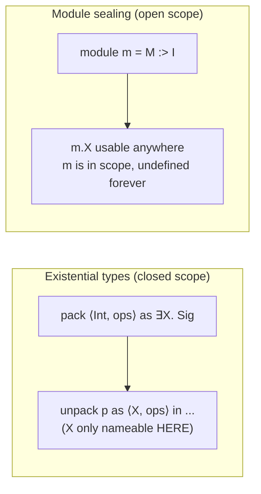
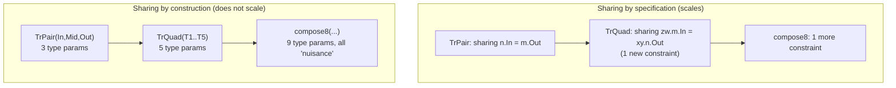

# ML-Style Module Systems

[[book-guidelines|↩ Back to guidelines]]

## Why does a type system need a *second* type system on top of it?

Suppose you're writing a large program. You have functions, values, types — the ordinary stuff a "core language" (say, System F, or the simply typed lambda calculus with extensions) gives you. At small scale this is enough. At large scale it isn't, for a reason that has nothing to do with expressiveness and everything to do with *organization*: you need to split the program into pieces that can be built, understood, and changed independently, by different people, without each piece needing to know the internals of every other piece.

That's what a **module system** is for. Harper and Pierce open the chapter with exactly this framing: a module (or *structure*) is a bundle of type, value, and procedure bindings; a program is a sequence of module bindings; and the interesting design question is *what mechanism lets one module depend on another without depending on its implementation*.

You already know the answer in outline, because it's the same answer as for ordinary functions: **separate the interface from the implementation.** A module's interface is called a **signature**. The novelty here — and the reason this needs a whole chapter's worth of type theory rather than a one-line analogy to function types — is that modules bind *types*, not just values. A signature has to describe not only "here's a function of type `Nat -> Nat`" but also "here's a type, and here's what you're allowed to know about it." That second kind of description is where almost everything interesting in this chapter comes from: how much do you reveal about a type component, and what does [[Typed-Assembly-Language#The type system|the type system]] have to do to stay sound once modules are allowed to hide type information from their clients?

**What breaks without a signature discipline at all:** if every module could see every other module's full implementation, you'd have exactly what you have when you `#include` all your C files into one translation unit — total coupling. Changing an internal data representation in module `A` could silently break type correctness in module `Z`, three files away, with no compiler error until the whole program is assembled. Signatures exist to make that impossible: a client is checked against `A`'s *signature*, never against `A`'s *body*.

## The core language, in the book's own words

The book gives a compact grammar (their Figure 8-1) worth carrying forward verbatim, since every later extension is layered on top of it:

$$
\begin{aligned}
P &::= B_1 \ldots B_n & \text{programs (binding sequences)}\\
B &::= \texttt{module } m\,[:I] = M \;\mid\; \texttt{signature } J = I & \text{module / signature bindings}\\
M &::= m \;\mid\; \texttt{mod}\{CB_1,\ldots,CB_n\} & \text{module variable / basic module}\\
I &::= J \;\mid\; \texttt{sig}\{CD_1,\ldots,CD_n\} & \text{signature variable / basic signature}\\
CB &::= \texttt{type } X = T \;\mid\; \texttt{val } x = t & \text{component bindings}\\
CD &::= \texttt{type } X\,[=T] \;\mid\; \texttt{val } x : T & \text{component declarations}
\end{aligned}
$$

Read this as: a module is a record of type-bindings and value-bindings (`m.X`, `m.x` project them out — these are ordinary core-language type/term expressions once you allow "select a component of a module" as a new production). A signature is the corresponding record of *declarations*: for a value you declare its type; for a type you may either give its definition (`type X = T`, a **transparent** declaration) or just assert that a type of that name exists (`type X`, an **opaque** declaration — this comes a few sections later, but it's worth flagging immediately since it's the single most consequential idea in the chapter).

Every component has both a *label* (external name, used by clients: `m.X`) and a *variable* (internal name, used within the module body). This distinction seems pedantic at first but turns out to matter technically once modules nest (§8.6) — internal names are ordinary bound variables, freely $\alpha$-renamable, while external names are part of the module's public contract and can't be renamed without breaking every client.

**Rust [[Dependent-Types#Grounding|grounding]].** The module/signature split maps cleanly onto Rust's own distinction between a `mod` (implementation) and a `trait` (interface) — with one caveat worth being precise about, since it will recur: Rust traits describe *sets of operations a type must support*, not *bundles of types-plus-values a namespace exports*. The ML notion of "signature" is closer to a `mod`'s public API surface — `pub type`, `pub fn`, `pub struct` — described independently of the `mod`'s body:

```rust
// A "signature" — describes what the module offers, not how.
// Rust doesn't literally have first-class signatures over modules
// (this is exactly the gap the chapter is implicitly gesturing at),
// but the closest honest analogy is a trait bundling associated types.
trait Ordered {
    type X;
    fn leq(a: &Self::X, b: &Self::X) -> bool;
}

// A "module" — an implementation providing those components.
mod nat_ordered {
    pub type X = u64;
    pub fn leq(a: &X, b: &X) -> bool { a <= b }
}
```

Rust's `mod` system is *nominal* and doesn't let you write "any module offering these two things" as a first-class value the way ML signatures do — that expressive gap (a signature as a first-class classifier of modules, matched structurally) is precisely why the chapter needs its own theory rather than pointing at an existing language feature. Keep this tension in mind; it resurfaces at almost every section.

## Signature matching: subtyping for modules

If a signature describes a module, the natural next question is: when does one signature *suffice in place of* another? This is **signature matching**, written $I <: J$ ("$I$ matches $J$"): every module implementing $I$ also implements $J$. It is exactly subtyping, specialized to signatures, and it is what lets a client written against a weaker/more general signature accept an implementation with a stronger/more specific one — ordinary subsumption.

The book distinguishes two disciplines for defining this relation:

- **Structural matching** — $I <: J$ holds purely because of what $I$ and $J$ syntactically require: every type declaration in $J$ must have a corresponding, equivalent one in $I$; every value declaration in $J$ must be matched by a value in $I$ at a subtype. No explicit declaration of "$I$ is a subtype of $J$" is needed anywhere in the program.
- **Nominal matching** — $I <: J$ holds only if the programmer has *explicitly declared* it somewhere (à la Java's `implements`/`extends`).

The book calls out a concrete cost of nominal matching: in Java, you cannot retroactively declare that an existing class implements a new interface without editing that class's source — a problem if the class ships in a library you don't control. Structural matching sidesteps this by definition, at the cost of allowing "unintended" matches you didn't anticipate.

The matching rules themselves permit width subtyping (extra components in the sub-signature are fine), depth subtyping (a component's own type can be a subtype), and permutation (reordering, subject to one wrinkle: you can't permute a value declaration ahead of a type declaration it depends on — order encodes a scoping/dependency constraint that plain record subtyping doesn't have to worry about).

**Rust grounding.** Rust trait bounds are exactly structural matching for the "value declarations" half of a signature (any type providing the right method signatures satisfies a trait bound, full stop, no explicit `impl Trait for T` needed... except Rust actually *does* require an explicit `impl` block, which is a nominal wrinkle Rust adds on top of otherwise-structural trait satisfaction — Rust is a genuine hybrid here). The type-declaration half — an associated type `type X` matching an associated type `type X = u64` — is closer to associated-type projection matching in trait resolution.

**What breaks without a matching relation at all (only exact signature equality):** every module would need to be re-typed against the *literal* signature it's declared against, with zero flexibility — no code reuse across "almost the same" interfaces, no passing a more-capable module where a less-capable one is expected. Matching is what turns "signatures" from bureaucratic paperwork into an actually useful abstraction boundary.

### Principal signatures

A module can implement many signatures (by matching/subsumption). If there's a single *most precise* one — a **principal signature** $I_M$ such that $M$ implements $I$ exactly when $I_M <: I$ — then "does $M$ implement $I$?" reduces to ordinary signature subtyping, which is decidable and syntax-directed. This is elegant but not guaranteed: the book flags that most real module languages *don't* have principal signatures for every module expression (this becomes sharply relevant later with the avoidance problem, and again in Chapter 9's treatment of definitions).

## The phase distinction: the load-bearing constraint of the whole chapter

Here is the crux the rest of the chapter keeps returning to, and it deserves to be stated before any of the machinery that enforces it.

Most languages are **statically typed**: type checking happens before, and independently of, execution. The book gives this a precise operational content rather than leaving it vague: a language respects the **phase distinction** if type checking never needs to test the equivalence of two *run-time* expressions. If it does — if deciding whether two types are equal requires "symbolic execution" of terms — the phase distinction is violated, and the book calls this **dependently typed** (a somewhat unusual use of that term; it names the semantic issue, not the syntactic occurrence of terms inside types — Chapter 2 of this volume covers genuinely dependently-typed languages in that fuller sense).

Why does this matter for modules specifically? Because a module binds *both* types and values. A type expression like `m.X` looks, syntactically, like it depends on the whole module `m` — including `m`'s dynamic, run-time parts. If the type checker had to inspect `m`'s value bindings (potentially involving arbitrary computation, side effects, non-termination) to determine what `m.X` means, static typing would be dead. **The entire technical apparatus of the chapter — translucent signatures, sealing, the determinate/indeterminate distinction — exists to let modules bind both types and values while still guaranteeing that type equivalence never needs to inspect a value.**

**[[Dependent-Types#What breaks without this|What breaks without this]] design principle:** you'd get a language where type checking a module might not terminate (because it has to partially evaluate the module's dynamic code to resolve a type), or where two type-checker runs on the same unchanged source could give different answers depending on run-time conditions. The book states the design principle explicitly: *a module system should be statically typed whenever its underlying core language is* — modularity should never be allowed to reintroduce a phase violation that the core language didn't already have.

This is where the chapter's engineering connects directly to the elaborator/unifier project in the standing learning goals: the phase distinction is the module-system incarnation of the same discipline that keeps `isDefEq`-style definitional-equality checking in a real elaborator decidable — you never want type-level equality checking to require running the program. Every mechanism below (determinacy, restricting type selection to determinate modules) is a specific technique for keeping a checker's equality-decision procedure clear of run-time computation, which is exactly the property an elaborator's kernel unifier needs to preserve when it decides definitional equality of types.

## First-class vs. second-class modules

A module expression is **first-class** if its type components aren't determined until run time; otherwise it's **second-class**. The book's example is a conditional:

```
if ...moon-is-full... then
  mod { type X = Int;  type Y = X→X; val x = 3;     val f = succ }
else
  mod { type X = Bool; type Y = X→X; val x = false; val f = not }
```

Here `X` really might be `Int` or `Bool` — undecidable statically, so this module is first-class. Contrast with a superficially similar conditional where both branches agree on `X = Bool`: syntactically it still *looks* like a conditional module, but its type components are, in fact, statically determined, so it counts as second-class despite the run-time branch. **Whether a module is first- or second-class is a semantic property of its evaluation behavior, not a syntactic property of its surface form.**

At this point in the development (before signatures can be abstract), the type system as given is too weak to type *any* first-class module: signatures must reveal type-component definitions, and a first-class module's type components have no single definition to reveal. Fixing this motivates the entire next section.

## Abstract type components — the chapter's central mechanism

### What breaks with only transparent signatures

A **transparent** signature reveals the definitions of all its type components. Two independent problems follow from restricting yourself to transparent signatures only:

1. **No first-class modules can be typed** (as just shown).
2. **Tight coupling.** If `M`'s signature exposes exactly how `M`'s types are represented, every client of `M` is implicitly coupled to that representation. Change the representation — even without changing `M`'s observable behavior — and every client's type-checking derivation may need re-examination. This defeats the entire point of having a signature in the first place: signatures were supposed to *decouple* clients from implementations.

### The fix: translucent signatures

The solution is to allow a type declaration in a signature to be either **transparent** (`type X = T`, revealing the definition) or **opaque** (`type X`, revealing only that a type by this name exists, at a given kind). A signature mixing both kinds of declaration is called **translucent** — it partially reveals its type components. Fully transparent and fully opaque signatures are the two extreme cases of one uniform mechanism.

```
signature I = sig {
  type X            -- opaque: hidden
  type Y = X → Nat  -- transparent: revealed, in terms of X
  val c : X
  val f : Y
}
```

Matching is generalized: an opaque declaration in the *super*-signature can be matched by either an opaque or a concrete declaration in the sub-signature — you're always allowed to "forget" a definition when weakening to a less informative signature, never the reverse.

This is the single mechanism the book credits with the most leverage in the whole chapter: from translucency alone, essentially for free, you get data abstraction, first-class modules, and — as later sections show — a natural encoding of signature *families* and coherent parameterized modules. The book is explicit that this is "the most significant step in the chapter," in terms of both power gained and proof-theoretic cost incurred.

### Sealing: the operator that actually creates abstraction

Declaring a translucent signature doesn't, by itself, hide anything — you need an operator that takes a module with a fully transparent (concrete) implementation and *restricts* what a client can see about it, per some chosen signature. That operator is **sealing**, written $M :> I$ ("seal $M$ with $I$"): well-formed only if $M$ implements $I$; the result is considered to implement $I$ (and, by subsumption, anything $I$ matches); and — crucially, reflecting the phase distinction — sealing has *no run-time effect*. A sealed module is evaluated by simply stripping the seal off and evaluating the module underneath. Sealing is a purely static, type-checking-time restriction on visibility, exactly parallel to term-level ascription (TAPL Ch. 11).

```
signature I = sig { type X; val c : X; val f : X → X }

module m : I = mod { type X = Int; val c = 0; val f = succ }
```

Here `m.X` is opaque to any client of `m` — even though internally `X` is `Int`, no code outside the module can exploit that fact. This is the mechanism that makes `m.c` and `m.f` usable only through each other (i.e. it's how you get a genuine abstract data type, not just an implementation-hiding convention).

The book takes care to distinguish this from the classical **existential types** account of data abstraction (Mitchell and Plotkin 1988; TAPL Ch. 24), even though the two are close analogically. Existential types impose **closed-scope abstraction**: to use an abstract package, you must "open" (`unpack`) it within a fixed lexical scope, and the abstract type is only nameable inside that scope. This is awkward for modules, because it forces you to nest the entire rest of your program inside an `unpack`, or "extrude" the scope of every abstract type all the way out to wherever it's used — exactly backwards from how you'd want to structure a program with many small abstractions defined near the top. The book's sealing mechanism instead gives **open-scope abstraction**: `M :> I` produces an indeterminate-but-still-usable module whose abstract type can be selected via `m.X` dot notation anywhere `m` is in scope, with no explicit unpacking construct at all. This is precisely why the book bothers reinventing the existential-types idea rather than just citing TAPL Ch. 24 and moving on — dot notation for abstract types is not something plain existentials give you, and dot notation turns out to be indispensable once you get to hierarchical and parameterized modules (§8.6, §8.8).



**Rust grounding.** This is the cleanest Rust correspondence in the whole chapter: sealing a module with an opaque type is *exactly* what a private struct field plus a `pub` newtype wrapper does.

```rust
mod symbol_table {
    // The representation (u64) is chosen internally...
    pub struct Symbol(u64);

    impl Symbol {
        pub fn intern(s: &str) -> Symbol { Symbol(hash(s) as u64) }
        pub fn eq(a: &Symbol, b: &Symbol) -> bool { a.0 == b.0 }
    }
    fn hash(s: &str) -> u64 { /* ... */ 0 }
}

// Client code: Symbol is "opaque" — no client can construct one except
// via `intern`, and no client can inspect the u64 inside. This is exactly
// M :> I with I hiding the representation of Symbol.
use symbol_table::Symbol;
fn f(a: Symbol, b: Symbol) -> bool { Symbol::eq(&a, &b) }
```

The privacy boundary (`pub struct Symbol(u64)` with a private field) plays the role of the seal; the `pub` API (`intern`, `eq`) plays the role of the revealed value declarations in $I$. Just as with sealing, this is enforced entirely at compile time and erased at run time — there is no tag, no dictionary, nothing — which is exactly the "sealing has no run-time effect" property the book insists on.

### Determinacy: why type selection has to be restricted

There's a subtlety lurking here that the book confronts head-on. Given `(M :> I).X` and `(N :> I).X` where `M` and `N` both implement `I` — should these be the *same* type? You want type equality to at least be reflexive, so if `M` and `N` happen to be equivalent modules, you'd want the equality to hold. But module equivalence is, in general, undecidable, *and* deciding it would require exactly the kind of run-time inspection the phase distinction forbids. The book's resolution: **prohibit type selection from sealed modules directly** — you can only select from a module *variable*, never from a sealed expression in place.

This generalizes to a broader classification: a module expression is **determinate** if its type components are statically known (so selection from it is safe), **indeterminate** otherwise. Basic module values are determinate (their type bindings are syntactically visible). Sealed modules are indeterminate — even though sealing might in principle be applied to a perfectly ordinary concrete module, the type system has to "assume the worst," because sealing is also the mechanism used to hide the identity of a first-class module's type components, and those really can be run-time-dependent. A module *variable*, once bound (module bindings force evaluation before binding), is always determinate — this is what licenses `m.X` even when `m`'s right-hand side was itself an indeterminate expression.

**What breaks without the determinacy restriction:** you could write a client that inspects `M.X` directly on a sealed expression, and if `M` were later replaced by an equivalent-but-differently-typed module `N` (representation independence should guarantee this is always safe!), the client's type correctness could silently break. Determinacy is what makes representation independence a theorem rather than a hope.

Two further, sharper consequences the book draws out via exercises: (1) if two syntactically identical implementations of an abstract type — say, two hash-table instances sharing code and representation but each with its own private mutable state — were treated as inducing the *same* abstract type, then values from one instance could leak into operations meant for the other, producing run-time errors representation independence was supposed to rule out. This is why sealing must always be indeterminate, never just "indeterminate unless it happens to look safe." (2) Determinacy is exactly what makes $\alpha$-renaming of a bound module variable enough to guarantee its abstract types are "new," distinct from every other type in the program regardless of representation coincidences — abstraction genuinely creates a fresh type, not just a fresh name for an old one.

## The avoidance problem

Consider a local module binding:

$$\texttt{let module } m = M \texttt{ in } M'$$

This should implement whatever `M'` implements — but what if `M'`'s principal signature mentions `m.X`, an abstract type belonging to the locally-scoped `m`? You can't export a signature that refers to a variable that's about to go out of scope. So what should the *whole expression's* signature be?

The book's worked example: with `I = sig { type X; val y : X }`, and

```
let module m = M :> I in mod { val z = m.y }
```

the body's principal signature is `sig { val z : m.X }` — but `m.X` can't survive past `m`'s scope. In general, you want the **least signature for $M'$ that does not mention $m$** — some super-signature of `sig { val z : m.X }` that "avoids" `m`. If the core language has a top type, `sig { val z : Top }` is *a* signature that avoids `m` — but it may throw away far more type information than necessary, and worse, the book gives a concrete construction (Exercise 8.5.9, with a type `X = λW. m.Z` referencing an abstract `Z`) showing that in general there can be *infinitely many* super-signatures avoiding `m`, no one of which is least. In that situation, avoiding `m` is not just hard — it's provably impossible to do losslessly: you must sacrifice type information to make the reference disappear.

This is the **avoidance problem** (Ghelli and Pierce, 1992, originally posed for System F-sub), and the book is candid that it has no fully satisfactory solution. It surveys three real design responses, each a genuine trade-off rather than a fix:

1. Only admit `let`-expressions for which a principal avoiding signature *does* happen to exist, reject the rest — but this makes well-formedness depend on a specific algorithm's success, which is exactly the kind of algorithm-dependence a declarative type system is supposed to avoid.
2. Require the programmer to write the signature explicitly at every `let` — solves nothing, just relocates the burden.
3. Prohibit abstract types from ever leaving the scope in which they're introduced (force all abstraction to be "global"), softened by systematically renaming locally-hidden types during elaboration ("name mangling") so the restriction is less visible in practice.

Real languages pick option 3 in disguise, in various forms — this is exactly why, per the guidelines' Key Questions for this chapter, the "principal signature of a `let`-body" is *not* always a well-defined notion even in a module system that otherwise enjoys principal signatures everywhere else. Chapter 9 revisits this exact problem (there renamed via "natural interfaces" and singleton kinds) as one of its central motivations.

## Module hierarchies

Modules can nest: a **submodule** is a module bound as a component of another module. This gives you two things for free once you extend implementation, matching, and determinacy recursively over submodule structure: namespace clustering (avoid global name clashes by grouping related bindings), and a natural way to represent *compound* abstractions — the book's running example is a dictionary built on top of an ordered-key type:

```
signature Ordered = sig { type X; val leq : X × X → Bool }

signature Dict = sig {
  module key : Ordered
  type Dict : * → *
  val new    : ∀V. Dict V
  val add    : ∀V. Dict V → key.X → V → Dict V
  val member : ∀V. Dict V → key.X → Bool
  val lookup : ∀V. Dict V → key.X → V
}
```

Note that `key.X` appears in the types of `add`/`member`/`lookup` — a signature can depend on a *preceding* submodule declaration within itself, exactly as later value declarations in the same module can depend on earlier type bindings. This is what makes `Πm:I₁.I₂` (functor signatures, below) a genuinely *dependent* signature form and not just a curried arrow.

The internal/external name distinction earns its keep here: without it, you cannot write a signature that holds both an outer type `X` and an inner submodule's type `X` abstract simultaneously — the inner declaration would shadow the outer one syntactically. Distinguishing internal name (bound, renamable) from external name (fixed, part of the label) resolves the shadowing:

```
sig {
  type X > X'                                  -- external label X, internal name X'
  module m : sig { type X > X"  val f : X" → X' }
}
```

**Rust grounding.** Nested modules (`mod outer { mod inner { ... } }`) with `pub` visibility give you the namespace-clustering half of this directly. The dependent-signature half — a later declaration's type mentioning an earlier submodule's associated type — is closer to associated-type projections in a trait bound chain (`T: Ordered, U: Dict<Key = T::X>`), though Rust's trait system doesn't let you write the fully general dependent form the book's $\Pi m{:}I_1.I_2$ signature expresses.

## Signature families: parameterization vs. fibration

Two dictionaries differing only in their key type currently force you to copy-paste the entire `Dict` signature, substituting the key module throughout. You want a **signature family** — one pattern, indexed, specialized per use. The book gives two representations:

**Parameterization** — treat a family as an explicit function from (a module implementing) an index signature to a signature:

```
signature DictP = λY:*. sig { module key : sig { type X = Y; val leq : X×X → Bool }; type Dict : *→*; ... }
signature Dict1 = DictP(key1.X)
```

**Fibration** — keep one generic signature and patch it post hoc with a `where` clause:

```
signature Dict1 = Dict where key.X = key1.X
```

(The terminology is borrowed, loosely, from category theory's indexed-category/fibration duality for representing families of categories — the book is explicit this is an analogy, not a technical claim.)

These look interchangeable for a single instantiation, and in isolation neither is a clear winner: parameterization is more familiar to functional programmers and needs no new signature machinery beyond λ-abstraction/application over signatures; fibration reuses the submodule mechanism you already have (translucency) and needs no separate "signature function" concept. **The decisive difference only shows up when you compose families, in §8.8's coherence discussion — this is a case where the book deliberately delays the payoff of a design choice to the next section**, which is worth flagging so the two sections read as one continuous argument rather than two separate topics.

## Module families: functors, and the coherence problem

A **functor** is a $\lambda$-abstraction of a module expression over a module variable of specified signature — literally "parameterized module," a term Burstall reportedly resisted on the grounds that we don't call `factorial` a "parameterized integer." Functor signatures need their own form, $\Pi m{:}I_1.I_2$ (domain $I_1$, range $I_2$, with $m$ bound in $I_2$) rather than a plain arrow $I_1 \to I_2$, precisely because the range typically needs to refer back to the argument's type components (`key.X` inside `DictFun`'s body, again).

$$
\texttt{signature DictFun} = \Pi\,\texttt{key}{:}\texttt{Ordered}.\; \texttt{sig}\{\, \texttt{type Dict}{:}{*}{\to}{*};\; \ldots \,\}
$$

This is exactly a dependent function type — the book cross-references Chapter 2's $\Pi$-types directly, and functor application is genuine dependent-type instantiation: applying `DictFun` to a module `M` with transparent signature `I' <: Ordered` lets you eliminate every `key.X` in the range by substituting `M`'s actual definition, contravariantly weakening the domain and covariantly specializing the range — the same subsumption-based reasoning ordinary function subtyping uses, just lifted to signatures.

### The coherence problem, worked through

Two "transformer" modules with matching input/output types compose fine by hand:

```
module ab = mod { type In = A; type Out = B; val f : In → Out = ... }
module bc = mod { type In = B; type Out = C; val f : In → Out = ... }
module ac = mod { type In = A; type Out = C; val f = λx:In. bc.f (ab.f x) }
```

But abstract this into a reusable `compose` functor over two arbitrary `Tr`-signature modules, and it breaks:

```
signature Tr = sig { type In; type Out; val f : In → Out }

module compose = λm:Tr. λn:Tr.
  mod { type In = m.In; type Out = n.Out; val f = λx:In. n.f (m.f x) }
```

`n.f` expects `n.In`; `m.f` produces `m.Out`; nothing forces these to agree. This is the **coherence problem**: separately-parameterized functor arguments need to *agree* on a shared type, and a naive functor signature has no way to express the requirement.

Two well-known fixes, both worked through in full by the book:

**Sharing by specification (ML-style)** — refine the second argument's signature using `where`, right at the point where `compose` is defined, so only compatible modules can even be passed:

```
module compose = λm:Tr. λn:(Tr where In = m.Out).
  mod { type In = m.In; type Out = n.Out; val f = λx:In. n.f (m.f x) }
```

Uncurried and symmetrized with `sharing` sugar (which the book is careful to note desugars, with zero added foundational complexity, straight back into `where`):

```
signature TrPair = sig { module m : Tr; module n : Tr; sharing n.In = m.Out }
```

**Sharing by construction (Pebble-style)** — instead factor the shared type out as an explicit extra parameter:

```
signature Tr = λIn:*. λOut:*. sig { val f : In → Out }
signature TrPair = λIn:*. λMid:*. λOut:*. sig { module m : Tr In Mid; module n : Tr Mid Out }
module compose = λIn λMid λOut. λp:TrPair In Mid Out. mod { val f = λx:In. p.n.f (p.m.f x) }
```

Here coherence is enforced simply because `m` and `n`'s signatures both mention the literal type variable `Mid`.

### Why one scales and the other doesn't

This is the chapter's sharpest "what breaks" story, so it's worth the worked example in full. Compose *four* transformers by nesting `compose` twice. In the fibered/sharing style, this is nearly free — package two `TrPair`s with one new sharing constraint relating the middle:

```
signature TrQuad = sig { module xy : TrPair; module zw : TrPair; sharing zw.m.In = xy.n.Out }
```

In the parameterized style, every "internal" coherence constraint that used to be hidden inside `TrPair` has to surface as an explicit type parameter to the *outer* signature too:

```
signature TrQuad = λT1 λT2 λT3 λT4 λT5. sig { module xy : TrPair T1 T2 T3; module zw : TrPair T3 T4 T5 }
```

Compose *eight* of these, and the type-parameter list keeps growing at every level of the hierarchy — the book calls these **nuisance parameters**: they carry no information a caller actually wants to supply, they exist purely to plumb sharing constraints from low-level functors up through every higher-level functor built on top of them, and maintaining that plumbing as a program evolves becomes impractical except for shallow functor hierarchies. This asymmetry — first observed by MacQueen in 1984, per the book, but "not widely recognized" since — is the payoff the signature-families section (§8.7) was building toward: **the representation you choose for signature families (parameterized vs. fibered) directly determines which coherence-enforcement techniques remain available to you, and only the fibered representation scales**, because a fibered signature is *itself* a signature that can be instantiated post hoc with a `where`/`sharing` clause exactly where the constraint is needed, rather than requiring every ancestor in the call graph to have anticipated and threaded it through in advance.



**Rust grounding — and where the analogy genuinely strains.** Rust's associated-type projections (`T: Trait<Assoc = U>`) are a form of sharing-by-specification: a trait bound can pin an associated type to a concrete value at the point where two generic parameters need to agree, without threading a separate type parameter for it. But Rust has no `where`-clause-on-a-signature analogous to `Tr where In = m.Out` applied *after the fact* to an already-defined trait — coherence constraints in Rust are expressed once, at the trait-bound site, not composably layered the way ML's fibered signatures allow. This is a case worth naming plainly rather than forcing: Rust's trait-coherence rules (the "orphan rules," in particular) solve a related-but-distinct problem — *global* uniqueness of `impl`s — not the *local* compositional-sharing problem this section is about. The honest takeaway is that ML's fibered signatures solve a design problem Rust's trait system doesn't fully have an equivalent mechanism for, precisely because Rust traits aren't first-class, substitutable module signatures.

### Generative vs. applicative functors

One more determinacy question: is a functor application $F(M)$ determinate? Two disciplines:

- **Generative** — every application "generates" a fresh abstract type, even if called twice with equivalent arguments. Necessary whenever the functor body has per-instance state (the book's example: a symbol-table functor backed by a hash table — two instances *must* have distinct `Symbol` types, or symbols from one table could leak into operations on the other, causing run-time errors).
- **Applicative** — all applications with *equivalent* arguments share one abstract type; `F(M).X` is a well-formed, determinate type expression. Only sound when the functor body is itself determinate (no internal sealing, no hidden state) — a functor whose body is indeterminate can *only* be generative, since re-sealing an already-hidden type at each call is the only way to make separate calls type-safely distinguishable.

Since determinate-body-and-nothing-else is a strictly stronger requirement, applicative functor signatures are naturally a **subtype** of the corresponding generative one (any applicative functor can safely be used wherever a generative one is expected, never the reverse — Exercise 8.8.5 asks you to show the converse is actually unsound, using the same private-state argument as the sealing-determinacy exercise earlier).

The book refines this once more: since sealing *inside* a functor body would force generativity even when you only wanted to hide a type from external clients (not force a fresh type per call), it distinguishes **static** sealing/indeterminacy (imposed once, at type-checking time — compatible with applicative functors) from **dynamic** sealing/indeterminacy (imposed at each run-time application — forces generativity). This is a genuinely subtle refinement worth sitting with: it separates "is this type hidden from clients" (a purely static property) from "does each use produce a fresh incarnation" (a property about the relationship between calls), which had previously been conflated into one notion of sealing.

## Advanced topics, briefly

The book closes with three topics it treats at survey depth rather than full formal depth — worth knowing they exist and roughly why they're hard, without expecting the same rigor as the sections above.

- **First-class modules.** Fully compatible with the framework: any core-language computation that produces a module must simply be treated as indeterminate. The harder question the book poses is why not just merge the core and module languages entirely — and the answer is that doing so naively (Harper and Lillibridge, 1994) makes type checking *undecidable*, from the interaction of subtyping, impredicative polymorphism, and sharing specifications; a later formalism (Dreyer, Crary, Harper 2003) achieves first-class modules without that cost, at greater technical complexity.
- **Higher-order modules** (functors taking functors as arguments). The `apply` functor example shows that giving one uniform type to `apply` forces a choice: if the functor argument is required applicative, sharing information about the result *is* expressible (`apply(f)(m).X` is legal and provably equal to `f(m).X`); if generative, that sharing information is unrecoverable, and `f(m).X` and `apply(f)(m).X`, while behaviorally the same value, are not known-equal *types* to the checker. There's no single functor signature that captures both cases without adding intersection types at the signature level.
- **Static vs. dynamic module equivalence, and recursive modules.** Static equivalence (equal iff static parts agree) is decidable and is what everything above assumes; dynamic equivalence (also comparing run-time parts) is strictly more discriminating but undecidable in general. Recursive modules relax the acyclic-dependency assumption from §8.1 — natural for mutually-referencing components, but reopens exactly the two problems that acyclicity was quietly preventing: type equations with no solution (e.g. $A = A \to \mathrm{Int}$) and initialization-order hazards (referencing a value before its definition has run).

## Comparison to real languages

The book is candid that Standard ML and OCaml each make a different, non-free trade against the ideal picture developed above:

- **Standard ML** (as formally defined): first-order, generative functors only; no built-in separate compilation (left to each implementation); avoidance handled by an internal "type names" mechanism generated during elaboration that has no source-language signature representation — so SML does **not**, in general, have principal (expressible) signatures.
- **Objective Caml**: higher-order, applicative functors; supports separate and incremental compilation; handles avoidance by simply *rejecting* well-typed-in-theory programs when its algorithm fails to find an avoiding signature — sacrificing principality for a decidable, practical checker.
- **Haskell type classes** are reframed, in this chapter's vocabulary, as a restricted, single-interpretation-per-type use of functors, with instance resolution as automatic (backchaining) functor application — illuminating, since it explains why type classes feel like "modules, but you never write the application."

Every real design in this survey gives something up (principality, or higher-order functors, or separate compilation) — there is no known formalism, as of the chapter's writing, that gets all of it simultaneously without added complexity.

## Where this leads

This chapter's translucent-signature-plus-sealing framework is the informal, prose-level account of exactly the machinery Chapter 9 ("[[Type-Definitions-and-Singleton-Kinds|Type Definitions and Singleton Kinds]]") formalizes rigorously: $\lambda^{LM}$ is a minimal calculus realizing the same translucent-sum idea with actual typing rules and metatheory, the **avoidance problem** resurfaces there nearly verbatim (as the non-existence of "natural interfaces" in general), and **singleton kinds** ($S(T)$, "the kind of types provably equal to $T$") turn out to be a more uniform way of expressing exactly the transparent/opaque distinction this chapter introduces informally via `type X` vs. `type X = T`. If this chapter is the "why," Chapter 9 is the "how, with proofs."

## Synthesis: why this chapter is worth the depth even though it's "just design"

Per the standing learning goals, this chapter is more architectural survey than mechanism-heavy proof development — most sections are deliberately informal, and the book says so outright. But two threads genuinely transfer to the two target projects, and are worth naming explicitly rather than left implicit:

1. **The phase distinction is the module-system-scale version of what an elaborator's definitional-equality checker must always preserve**: deciding type/signature equivalence must never require executing a program. Every mechanism in this chapter — translucency, sealing, determinacy — is a specific technique for keeping equality-checking clear of run-time computation. This is the same discipline a bidirectional elaborator's `isDefEq` needs, and seeing it worked out at the "modules as coarse-grained types" scale is a useful sanity check on the same discipline at the fine-grained term level.
2. **Functor signature matching (§8.8) is genuinely a unification-flavored problem**: checking whether a determinate module $M$ can be supplied as a functor argument against domain signature $I$, and then propagating the resulting substitution into the range signature, is structurally the same operation as checking an argument against a dependent function's domain type and specializing the codomain — the same shape of problem bidirectional type checking solves for ordinary dependent application. The coherence problem in particular — forcing two independently-typed arguments to agree on a shared type via `where`/`sharing` — is a first-order unification problem dressed up in signature syntax; recognizing it as such is exactly the kind of "this book's own machinery is doing unification's job without naming it" connection the learning goals ask to keep surfacing.

Everything else here — the historical comparison of SML vs. OCaml, the Haskell type-class framing, first-class/higher-order/recursive modules — is genuinely valuable design literacy, but doesn't bear directly on either target project, and the chapter itself treats those topics at survey depth rather than full formal rigor. No need to force a mechanism-level connection where the book doesn't provide one.
