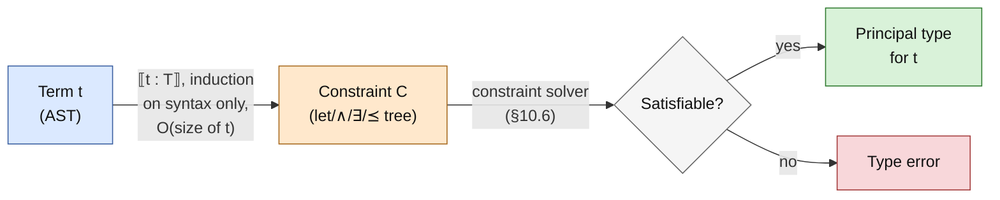

# ML Type Inference

[[book-guidelines|↩ Back to guidelines]]

## Why this chapter exists

Every working programmer who has used OCaml, Standard ML, Haskell, or Rust's own limited form of `let`-generalization has watched type inference work a small miracle: you write `let id = fun x -> x`, and the compiler doesn't just check that `id` is well-typed — it discovers that `id` is well-typed *at every type simultaneously*, without you writing a single annotation. Call `id` on an integer here, a string there, both uses typecheck. This is **let-polymorphism**, the signature feature separating ML-the-type-system from the simply-typed lambda calculus.

The textbook explanation of *how* this works usually goes through Robin Milner's algorithm W: walk the syntax tree, invent fresh type variables for unknowns, unify types as you go, and when you hit a `let`, generalize every type variable that isn't already pinned down by the surrounding context into a universally quantified type scheme. This works, and it's how most compilers are described in undergraduate courses. But Pottier and Rémy's chapter makes a case that this classical, *substitution*-based telling has three real defects, not just aesthetic ones:

1. **It conflates two separate questions** — "is this program correct?" and "how do I check that efficiently?" — into a single algorithm. You cannot state what W *means* without also describing what it *does*, step by step. That makes correctness proofs and efficiency arguments tangled together.
2. **It doesn't match what real compilers do.** Production implementations never build and apply substitutions wholesale (that's asymptotically catastrophic — a type substituted into a huge term costs time proportional to the term's size, applied who knows how many times). They mutate a union-find structure in place. A substitution-based specification and an in-place-mutation implementation are related only by an informal argument that "they compute the same thing," which is exactly the kind of gap where subtle bugs (and unsound optimizations) hide.
3. **It doesn't generalize.** The moment you want subtyping, or recursive types, or row-polymorphic records, the substitution-based story has to be rebuilt from scratch, because "type substitution" stops being the right notion of "what a partial solution to a typing problem looks like."

The chapter's fix is to introduce an explicit **constraint language** as a first-class intermediate representation, standing between "the program" and "is it well-typed." Type inference becomes two independent, separately-statable, separately-provable phases:

- **Constraint generation**: a simple, purely syntax-directed pass over the term, producing a logical formula (the constraint) that is provably equivalent to "this term is well-typed at this type."
- **Constraint solving**: an algorithm — unification extended with rank-based generalization — that decides whether the constraint is satisfiable, and if so, produces the principal (most general) type.

This is precisely the "front-end emits a spec, back-end discharges it" shape that shows up everywhere in verification tooling, and it is why this chapter earns a very deep read for anyone building a type checker or an elaborator: the constraint generator is a template for a compiler's inference pass, and the constraint solver is a template for the unifier underneath it, complete with the exact data-structure trick (integer *ranks* on union-find nodes) that makes real implementations fast.

---

## 10.1 What is ML? — the object of study, precisely

Before any of the machinery, the chapter is careful to disambiguate what "ML" even means, because the ambiguity is a genuine source of confusion in the literature:

- **ML-the-programming-language**: SML, OCaml, and their descendants — concrete languages with concrete semantics.
- **ML-the-type-system**: the Hindley–Milner discipline (decidable inference, principal types, based on first-order unification) — also adopted by Haskell, which is otherwise semantically unrelated to SML.
- **ML-the-calculus**: the minimal core calculus this chapter actually formalizes — variables, functions, application, and `let`, plus an abstract, pluggable set of *constants* (so that integers, pairs, references, etc. are all just particular choices of constant, added later in §10.7).

**Syntax and semantics (Figures 10-1, 10-2).** Expressions are $x \mid \lambda z.t \mid t\,t \mid \mathtt{let}\ z = t\ \mathtt{in}\ t$, plus constants $c$ and (at runtime only) memory locations $m$. Operational semantics is a small-step, call-by-value rewriting relation on *configurations* $t/\mu$ (a term paired with a store), defined via evaluation contexts $E$ that pin down evaluation order (left-to-right, call-by-value: a function's argument is fully reduced before the call fires). The key rules:

$$
(\lambda z.t)\ v \longrightarrow [z \mapsto v]t \qquad (\text{R-Beta})
\qquad\qquad
\mathtt{let}\ z = v\ \mathtt{in}\ t \longrightarrow [z \mapsto v]t \qquad (\text{R-Let})
$$

Note that `let` is given its *own* reduction rule rather than being defined as sugar for $(\lambda z.t_2)\,t_1$ — this is deliberate foreshadowing: the two constructs behave identically operationally, but the *type system* treats them very differently, which is exactly what makes ML more expressive than the simply-typed lambda calculus.

A configuration that cannot reduce further and isn't a value is **stuck** — e.g. $\widehat{+}\ \widehat{1}\ m$ (adding an integer to a memory location) or $\pi_1\ \widehat{2}$ (projecting out of a non-pair). A program **goes wrong** if it reduces to a stuck configuration. The entire point of [[Typed-Assembly-Language#The type system|the type system]], stated as plainly as this chapter ever gets, is to guarantee this never happens for well-typed programs.

### Damas–Milner (DM): the classical type system

Types are first-order terms over kinded type constructors; DM's rules (Figure 10-3):

$$
\dfrac{\Gamma(x)=S}{\Gamma\vdash x:S}\ \text{(dm-Var)}
\qquad
\dfrac{\Gamma;z:T\vdash t:T'}{\Gamma\vdash\lambda z.t:T\to T'}\ \text{(dm-Abs)}
\qquad
\dfrac{\Gamma\vdash t_1:T\to T'\quad \Gamma\vdash t_2:T}{\Gamma\vdash t_1\,t_2:T'}\ \text{(dm-App)}
$$

$$
\dfrac{\Gamma\vdash t_1:S\quad \Gamma;z:S\vdash t_2:T}{\Gamma\vdash \mathtt{let}\ z=t_1\ \mathtt{in}\ t_2:T}\ \text{(dm-Let)}
\qquad
\dfrac{\Gamma\vdash t:T\quad \bar X\#\mathrm{ftv}(\Gamma)}{\Gamma\vdash t:\forall\bar X.T}\ \text{(dm-Gen)}
\qquad
\dfrac{\Gamma\vdash t:\forall\bar X.T}{\Gamma\vdash t:[\bar X\mapsto\bar T]T}\ \text{(dm-Inst)}
$$

`dm-Gen` and `dm-Inst` — *generalization* and *instantiation* — are the two rules absent from the simply-typed lambda calculus, and they are what make ML's `let` strictly more powerful than $\lambda$-abstraction plus application. `dm-Let` typechecks $t_1$ once, generalizes its type into a *scheme* $\forall\bar X.T$, and binds that scheme (not a monotype) to $z$; every subsequent use of $z$ instantiates the scheme freely, possibly at different types each time. A plain $\lambda z.t_2$ applied to $t_1$ could never do this — `dm-Abs` only ever puts a monomorphic type $T$ into the environment.

**What breaks without the side condition on generalization** ($\bar X \# \mathrm{ftv}(\Gamma)$ — the generalized variables must not occur free in the environment). Example 10.1.20 in the book walks through the disaster precisely: from the valid judgment $z:X \vdash z:X$, an *unrestricted* generalization would let you conclude $z:X \vdash z:\forall X.X$, then instantiate at a fresh $Y$ to get $z:X \vdash z:Y$ — meaning $z$ can be treated as having a completely unrelated type $Y$ even though the environment says its type is $X$. Chaining this through `dm-Abs` and `dm-Gen` yields $\vdash \lambda z.z : \forall X\,Y.\, X \to Y$ — the identity function with *unrelated* argument and result types. Applying that (via two different instantiations) to $\widehat 0\ \widehat 0$ produces a stuck term with a "valid" type. The side condition exists precisely to block this: a type variable can only become polymorphic once it is truly local to the thing being generalized, not shared with an ambient assumption.

```rust
// The DM shape as a Rust sketch — this is exactly the structure a
// checker's environment and "generalize at let" pass has to implement.
enum Type {
    Var(TypeVarId),
    Arrow(Box<Type>, Box<Type>),
    Con(&'static str, Vec<Type>),
}

struct Scheme {
    quantified: Vec<TypeVarId>, // the bar-X in forall X-bar. T
    body: Type,
}

// dm-Gen's side condition, made operational:
fn generalize(env: &TypeEnv, ty: &Type) -> Scheme {
    let free_in_env: HashSet<TypeVarId> = env.free_type_vars();
    let quantified: Vec<TypeVarId> = ty.free_vars()
        .into_iter()
        .filter(|v| !free_in_env.contains(v)) // <- the whole safety argument lives here
        .collect();
    Scheme { quantified, body: ty.clone() }
}
```

**Efficiency remark worth flagging (10.1.21).** A naive `generalize` that recomputes `env.free_type_vars()` by walking the whole environment at every `let` gives *quadratic* time inference, because the environment can be linear in program size and this recomputation happens at every `let` node. The chapter's fix — tagging every type variable with an integer *rank* so that "does this variable occur free in the environment" becomes an $O(1)$ check — is one of the chapter's running threads, developed fully in §10.6. Keep this in your head; it resurfaces as the single most load-bearing implementation trick in the whole chapter.

DM enjoys two properties that make it practically indispensable: **soundness** ("well-typed programs don't go wrong") and the existence of a **principal type scheme** for every well-typed term — a single most-general type scheme from which every other valid typing follows by generalization/instantiation. Principal types are also why ML supports separate compilation cleanly: a module's exported type scheme, if principal, loses none of the module's potential reusability.

---

## 10.2 Constraints — the vocabulary the rest of the chapter runs on

This is the section that does the real conceptual work of the chapter, so it's worth slowing down.

### Why a constraint language, and not more substitutions?

Classical DM says "instance of $S$" is a syntactic, binary fact: either $T$ literally is $[\bar X \mapsto \bar T]T'$ for some substitution, or it isn't. The constraint-based reformulation instead makes "$T'$ is an instance of $\sigma$" into a *logical formula* — a constraint — whose truth depends on the meanings assigned to free type variables:

$$
\sigma \preceq T' \quad\text{stands for}\quad \exists\bar X.\,(D \wedge T \le T') \qquad \text{where } \sigma = \forall\bar X[D].T
$$

This single definitional move (Definition 10.2.3) is what lets subtyping, non-free equations (rows), and ordinary equality all live under one roof: instantiation is *always* "some existentially-quantified constraint holds," and what varies is only which predicates and models are plugged in.

**Syntax (Figure 10-4).** A *constrained type scheme* is $\forall\bar X[C].T$: universal quantifiers plus an attached constraint $C$ restricting which ground instantiations are legal. Constraints themselves:

$$
C, D ::= \mathtt{true} \mid \mathtt{false} \mid P\,T_1\ldots T_n \mid C \wedge C \mid \exists\bar X.C \mid \mathtt{def}\ x:\sigma\ \mathtt{in}\ C \mid x \preceq T
$$

Two forms deserve special attention because they are the chapter's real innovation over prior constraint-based presentations: `def x : σ in C` (**type scheme introduction**) and `x ⪯ T` (**type scheme instantiation constraint**, where the scheme is referenced *by name* rather than written out). Together they let a constraint stand in for an environment binding *without actually substituting anything* — `def x : σ in C` is provably equivalent to the capture-avoiding substitution `[x ↦ σ]C`, but as a syntactic form it defers that substitution, letting a solver choose *when and how* to perform it (e.g., after simplifying `σ`). This is precisely the mechanism that later (§10.4) delivers *linear-time* constraint generation: the naive approach of eagerly substituting an entire constraint into every occurrence of a `let`-bound variable is exactly the quadratic blowup the chapter is trying to avoid.

### Models: what a constraint actually means

A **model** (Definition 10.2.5) fixes, for each kind $\kappa$, a set of *ground types* $M_\kappa$, plus interpretations of every type constructor and predicate. Three worked examples matter:

- **Syntactic / free tree models** — ground types are ordinary finite trees (closed types). This is the setting where HM(X) collapses to ordinary DM.
- **Regular tree models** — ground types may be *infinite but regular* (finitely many distinct subtrees) — this is where equirecursive types live, revisited in §10.7.
- **Nonstructural subtyping models** — type constructors are related by a partial order $\Rrightarrow$ respecting per-direction variance (contravariant/covariant/invariant), giving genuine subtyping, e.g. record field presence (`pre T ≤ abs`).

Satisfaction $\varphi,\psi \models C$ (Figure 10-5) is defined compositionally over a ground assignment $\varphi$ (types → ground types) and ground environment $\psi$ (identifiers → ground type schemes, represented as upward-closed sets of ground types). From satisfaction, the chapter defines the two relations that carry every later proof:

$$
C_1 \Vdash C_2 \iff \forall \varphi,\psi.\ (\varphi,\psi\models C_1 \implies \varphi,\psi\models C_2) \qquad\text{(entailment)}
$$
$$
C_1 \equiv C_2 \iff C_1 \Vdash C_2 \text{ and } C_2 \Vdash C_1 \qquad\text{(equivalence)}
$$

Covariance, contravariance, and invariance of a type constructor with respect to one of its arguments are then *defined*, not just described, via equivalence: $F$ is covariant in argument $i$ iff $F\,\overline{T}[T_i] \le F\,\overline{T}[T_i'] \equiv T_i \le T_i'$. This is worth pausing on: subtyping variance stops being an ad hoc annotation and becomes a provable fact about the constraint calculus.

### The toolbox of equivalence laws (Figure 10-6)

The chapter proves roughly twenty algebraic laws over constraints — associativity/commutativity of $\wedge$, redundancy elimination, scope extrusion for $\exists$, and, most importantly for what follows, laws about `let`:

$$
\mathtt{let}\ x:\forall\bar X[C_1\wedge C_2].T\ \mathtt{in}\ C_3 \;\equiv\; C_1 \wedge (\mathtt{let}\ x:\forall\bar X[C_2].T\ \mathtt{in}\ C_3) \qquad\text{if } \bar X \# \mathrm{ftv}(C_1) \qquad \text{(C-LetAnd)}
$$

C-LetAnd says: if part of a type scheme's constraint doesn't mention the variables being generalized, hoist it out — instantiating the *smaller* remaining scheme is cheaper, because instantiation means *copying* the constraint, and you'd rather copy less. This is the constraint-level explanation for why `hmx-Gen` (§10.3) is more than a stylistic variant of the naive generalization rule — it's an efficiency-critical optimization made *visible and provable* in a way substitution-based presentations never surface.

Even more important is:

$$
\mathtt{let}\ x:\forall\bar X\bar Y[C_1].T\ \mathtt{in}\ C_2 \;\equiv\; \exists\bar Y.\, \mathtt{let}\ x:\forall\bar X[C_1].T\ \mathtt{in}\ C_2 \qquad \text{if } \bar Y\#\mathrm{ftv}(C_2) \text{ and } \exists\bar X.C_1 \text{ determines } \bar Y \qquad \text{(C-LetAll)}
$$

where "$C$ **determines** $\bar Y$" (Definition 10.2.14) means: fix a ground assignment for everything except $\bar Y$, and if $C$ holds, the values of $\bar Y$ are *forced*, uniquely. C-LetAll says: a sufficiently pinned-down type variable can be pulled out of the universal quantifier and treated as monomorphic (existentially bound outside) without changing meaning — **it makes no difference whether a fully-determined variable is generalized or not**. This is the theoretical justification for why the constraint solver (§10.6) can classify variables as "young" (genuinely polymorphic) vs. "old" (should stay outside the scheme) using nothing more than a *rank* comparison, in constant time per check. Example 10.2.16 shows precisely why the side condition is essential: without it, applying C-LetAll to a scheme that's *actually* polymorphic in $Y$ collapses two logically independent instantiations of $Y$ into one shared variable — turning `true` into `false`.

### Solved forms and the bridge back to classical unification

Restricting to *equality-only syntactic models* (no subtyping, closed terms), every satisfiable constraint is equivalent to a **solved form** — $\exists\bar Y.(\bar X = \bar T)$ where the left-hand sides are distinct variables absent from the right-hand sides — and every solved form is equivalent to a **canonical** one where the existentials are exactly the free variables of the right-hand sides. A canonical solved form corresponds exactly to an idempotent substitution, i.e. a **most general unifier** in the classical sense (Definition 10.2.22). This is the theorem that lets the chapter later prove HM(=) (constraints with only equality) is *the same type system* as DM, just phrased differently — the bridge from the new constraint machinery back to everything you already know about unification.

> **What breaks without a formal notion of equivalence/entailment.** Without $\equiv$ defined precisely (rather than "these constraints obviously mean the same thing"), none of the solver's rewriting steps in §10.6 could be proven meaning-preserving — you'd have an algorithm with no argument that it computes the right answer, only that it "looks reasonable."

---

## 10.3 HM(X) — a parameterized type system

HM(X) is a *family* of type systems, parameterized by $X$ = (type constructors, predicates, model) — exactly the parameter fixed by a choice of model in §10.2. The name signals its lineage: Hindley–Milner, generalized.

**Typing rules (Figure 10-7).** Judgments are four-place: $C, \Gamma \vdash t : \sigma$ — "under constraint assumption $C$ and environment $\Gamma$, $t$ has type scheme $\sigma$":

$$
\dfrac{\Gamma(x)=\sigma \quad C\Vdash \exists\sigma}{C,\Gamma\vdash x:\sigma}\ \text{(hmx-Var)}
\qquad
\dfrac{C,(\Gamma;z:T)\vdash t:T'}{C,\Gamma\vdash \lambda z.t : T\to T'}\ \text{(hmx-Abs)}
$$

$$
\dfrac{C\wedge D,\Gamma\vdash t:T \quad \bar X\#\mathrm{ftv}(C,\Gamma)}{C\wedge\exists\bar X.D,\Gamma\vdash t:\forall\bar X[D].T}\ \text{(hmx-Gen)}
\qquad\qquad
\dfrac{C,\Gamma\vdash t:T\quad C\Vdash T\le T'}{C,\Gamma\vdash t:T'}\ \text{(hmx-Sub)}
$$

The star of the show is `hmx-Gen`: unlike the naive version (`hmx-Gen′`, which copies the *entire* current constraint $D$ into the new scheme), `hmx-Gen` only requires the copied part $D$ to avoid the generalized variables $\bar X$ — the rest of the current assumption $C$ stays outside, un-duplicated. This is C-LetAnd, hard-wired into a typing rule. `hmx-Inst` drops a scheme's quantifier without touching a substitution at all (schemes are equal up to $\alpha$-renaming, so renaming does the substitution's job for free) — a genuinely different, more primitive operational reading of instantiation than DM's `dm-Inst`. `hmx-Sub` makes subsumption an explicit, provable step (`C ⊩ T ≤ T'`), useful even under equality-only models, since it lets a derivation exploit equations already recorded in `C`.

Figure 10-8 gives an *equivalent*, more syntax-directed presentation (generalization only at `let`, instantiation only at variable references) — a stepping stone toward the algorithmic story in §10.4.

**The correspondence theorems** are the payoff:

- **Theorem 10.3.6**: every DM judgment lifts trivially into every HM(X) — under the constant assumption `true`.
- **Theorem 10.3.7**: every HM(=) judgment (HM(X) specialized to an equality-only syntactic model) translates back down into a DM judgment, via a most general unifier of its constraint.

So HM(=) and DM are two notations for one type system, and every other HM(X) is a genuine extension of DM. This is exactly the parameterization axis the chapter needed: swap in subtyping, or a row model, and you get a strictly richer system that still specializes down to plain Hindley–Milner when you dial the parameter back to equality.

---

## 10.4 Constraint generation — the algorithm, made linear

Now the payoff for the def/let machinery of §10.2. A **type inference problem** is a triple $(\Gamma, t, T)$: does a satisfiable constraint $C$ exist with $C,\Gamma \vdash t : T$? Constraint generation computes, by induction *on the term alone* (no environment threaded through!), a constraint $\llbracket t : T \rrbracket$ that is **sound** ($\llbracket t:T\rrbracket, \Gamma \vdash t:T$ for the environment closed over via `let Γ in`) and **complete** (any valid $C$ entails $\llbracket t:T \rrbracket$) — i.e. the *least specific* constraint guaranteeing the typing.

**Figure 10-9, in full — this is the entire algorithm:**

$$
\begin{aligned}
\llbracket x : T \rrbracket &= x \preceq T \\
\llbracket \lambda z.t : T \rrbracket &= \exists X_1 X_2.\ (\mathtt{let}\ z:X_1\ \mathtt{in}\ \llbracket t : X_2\rrbracket \;\wedge\; X_1 \to X_2 \le T) \\
\llbracket t_1\,t_2 : T \rrbracket &= \exists X_2.\ (\llbracket t_1 : X_2 \to T\rrbracket \wedge \llbracket t_2 : X_2\rrbracket) \\
\llbracket \mathtt{let}\ z=t_1\ \mathtt{in}\ t_2 : T \rrbracket &= \mathtt{let}\ z : \forall X[\llbracket t_1:X\rrbracket].X\ \mathtt{in}\ \llbracket t_2 : T\rrbracket
\end{aligned}
$$

Read the `let` case carefully — it's the crux of the whole chapter. $\llbracket t_1 : X \rrbracket$ is (by soundness/completeness applied to itself) a *principal type scheme* for $t_1$: "$t_1$ has every type $X$ for which this constraint holds, and no others." Wrapping $\llbracket t_2 : T \rrbracket$ inside `let z : ∀X[⟦t₁:X⟧].X in []` gives every free occurrence `z ⪯ T'` inside $\llbracket t_2 : T \rrbracket$ the meaning $\forall X[\llbracket t_1{:}X\rrbracket].X \preceq T'$ — by Lemma 10.4.6 this is equivalent to $\llbracket t_1 : T' \rrbracket$. So *every use site of `z` effectively gets its own private copy of $t_1$'s typing constraint*, exactly simulating textual inlining of the `let`-body — **without ever duplicating source code or the constraint itself**. The duplication is deferred entirely to the solver, which chooses when (and how cheaply, after simplification) to perform it. This is why generation runs in linear time and space (Exercise 10.4.2): unlike the naive "compute a constraint, substitute it into the environment" approach, nothing here is copied eagerly.



This diagram *is* the chapter's central engineering claim: type inference is not one monolithic pass, it is a clean two-stage pipeline, and each stage has its own soundness/completeness proof, independent of the other.

**Theorems 10.4.4 (Soundness) and 10.4.8 (Completeness)** formalize exactly the guarantee sketched above, closing the loop: $t$ is well-typed with type $T$ under $\Gamma$ **iff** $\llbracket \Gamma \vdash t : T \rrbracket$ (i.e. `let Γ in ⟦t:T⟧`) is satisfiable.

**What breaks without the `def`/`let` constraint forms.** You'd be forced back to the "standard approach" the chapter explicitly rejects: define $\llbracket \Gamma \vdash t : T \rrbracket$ by induction with an explicit environment $\Gamma$ threaded through, generalizing at every `let` node and copying the resulting (unsimplified) constraint into the environment for every later variable occurrence. Simplification and generation become entangled, and the copying cost at each occurrence is proportional to the *unsimplified* constraint — precisely the quadratic-or-worse blowup Remark 10.1.21 warned about for the classical algorithm.

---

## 10.5 Type soundness — Wright–Felleisen syntactic method, and the value restriction

The chapter proves "well-typed programs do not go wrong" (Theorem 10.5.11) via the now-standard **Wright–Felleisen syntactic approach**: split the proof into

- **Subject reduction** (Theorem 10.5.8): well-typedness is preserved by reduction.
- **Progress** (Theorem 10.5.10): a well-typed configuration is never stuck.

Both are stated directly in terms of generated constraints rather than typing judgments — e.g. subject reduction is phrased via a relation $t/\mu \sqsubseteq t'/\mu'$ (Definition 10.5.4) requiring that the constraint for the reduct is entailed by the constraint for the original, up to extension of the store type and hiding of fresh variables for newly-allocated locations. A **term substitution lemma** (10.5.1) underlies subject reduction: `let z : ∀X̄[⟦t₂:T₂⟧].T₂ in ⟦t₁:T₁⟧` entails `⟦[z↦t₂]t₁ : T₁⟧` — i.e., substituting a term for a variable inside a program corresponds, at the constraint level, to instantiating that variable's `let`-generated scheme. Because the theorems here are stated purely in terms of the constraint apparatus, they transfer automatically to *both* HM(X) and DM via the correspondence theorems of §10.3 — one proof, two type systems.

### The value restriction — the sharpest "what breaks without this" in the chapter

Here is the book's own worked counterexample (a genuinely instructive unsoundness):

```
let r = ref (λz.z) in
let _ = (r := λz.(z +̂ 1̂)) in
!r true
```

This reduces to `true +̂ 1̂` — a stuck configuration. Yet, with the "obvious" polymorphic type schemes for `ref`, `!`, `:=` (Example 10.7.5) and *unrestricted* generalization at `let`, this program **typechecks**: `r` receives the polymorphic scheme $\forall X.\mathrm{ref}(X \to X)$, letting you write an `int → int` function into it and read back a `bool → bool` function. The bug: let-polymorphism is supposed to *simulate* textual duplication of the bound expression — but the operational semantics doesn't duplicate `ref (λz.z)` textually; it evaluates it **once** to a memory address $m$, and *only the address* gets duplicated by later instantiation. Both "copies" alias the same mutable cell — so the illusion of independent polymorphic uses breaks down exactly where mutation is involved.

The fix, the **value restriction** (Definition 10.5.6): only `let`-bindings whose right-hand side is already a **value** (or, in the relaxed version, a *nonexpansive* expression — one that provably allocates no new mutable storage, e.g. `c t₁...tₖ` for a pure destructor $c$) may be generalized. Anything else is typed monomorphically. This is a real, deliberate loss of expressiveness — some safe programs get rejected (e.g. `let f = c v in ...` where `c v` is a saturated-looking constructor application that happens to be syntactically a partial application) — traded for a dead-simple soundness argument instead of the far more complex "effect-aware" polymorphism schemes explored and abandoned in the 1980s–90s literature (Tofte, Leroy).

```rust
// The value restriction, operationalized: generalize only if the
// right-hand side provably can't allocate mutable state.
fn is_nonexpansive(e: &Expr) -> bool {
    match e {
        Expr::Value(_) => true,
        Expr::App(box Expr::Const(c), args) if is_pure_destructor(c) =>
            args.iter().all(is_nonexpansive),
        _ => false, // conservatively: anything else might allocate a `ref`
    }
}

fn typecheck_let(env: &mut TypeEnv, z: &str, rhs: &Expr, body: &Expr) -> Type {
    let rhs_ty = infer(env, rhs);
    let scheme = if is_nonexpansive(rhs) {
        generalize(env, &rhs_ty)   // full let-polymorphism
    } else {
        Scheme { quantified: vec![], body: rhs_ty } // monomorphic — the safety valve
    };
    env.bind(z, scheme);
    infer(env, body)
}
```

**This is directly load-bearing for a Rust verifier.** Any checker that combines let-polymorphism with mutable references (which a Hoare-triple-style verifier over an imperative Rust-like IR will) needs *some* answer to exactly this problem. [[Typed-Operational-Reasoning#The value restriction|The value restriction]] is the cheapest correct one; if your verifier wants to be less conservative, this section is the map of the design space (and its known dead ends) to study before reinventing it.

---

## 10.6 Constraint solving — unification, union-find, and the rank trick

This is the section with the most direct payoff for building a real type checker, so it gets the deepest treatment.

### Unification as multi-equation rewriting

Rather than binary equations $T_1 = T_2$, the solver works with **multi-equations** $T_1 = T_2 = \ldots = T_n$ (an $n$-ary equality predicate) — because that's what a union-find data structure actually represents: an equivalence class, not a single pairwise fact. A multi-equation is **standard** if its variable members are distinct and it has at most one non-variable member (i.e., it *is* a union-find equivalence class: a set of variable-pointers plus at most one term descriptor).

Figure 10-10's rewriting rules (a formalization of Huet's unification algorithm, specified nondeterministically as a rewriting system following Jouannaud and Kirchner):

$$
X = \epsilon \wedge X = \epsilon' \to X = \epsilon = \epsilon' \quad\text{(S-Fuse)}
\qquad
X = X = \epsilon \to X = \epsilon \quad\text{(S-Stutter)}
$$
$$
F\,\bar X = F\,\bar T = \epsilon \to \bar X = \bar T \wedge F\,\bar X = \epsilon \quad\text{(S-Decompose)}
\qquad
F\,\overline{T} = F'\,\overline{T'} = \epsilon \to \mathtt{false} \text{ if } F \ne F' \quad\text{(S-Clash)}
$$

S-Fuse merges two equivalence classes sharing a variable — the union-find "union" step. S-Decompose peels the head symbol off two unified terms whose head constructors match, deliberately requiring the copied sub-parts $\bar X$ to be *variables, not arbitrary terms* — a design choice that makes sharing explicit: a variable is a pointer to an equivalence class, so decomposing an equation only ever copies *pointers*, never whole subterms. S-Name-1 is the escape hatch, introducing a fresh variable to stand for a non-variable subterm precisely so S-Decompose stays applicable. S-Cycle is the classical occurs-check, applicable only for syntactic (finite-tree) models — turned off entirely for regular tree models, which is exactly how equirecursive types "come for free" in §10.7.

This rewriting system is proven strongly normalizing (10.6.4), meaning-preserving at every step (10.6.5), and every normal form is either `false` or a satisfiable standard conjunction of multi-equations (10.6.6) — the three properties that jointly say "this is a real decision procedure, and here's the proof."

### The full solver: stacks, states, and the ranks that make generalization cheap

On top of unification, the chapter builds a state-rewriting system for the *whole* constraint language (Figure 10-11). A **state** is a triple $\langle S; U; C\rangle$: a **stack** $S$ (a one-hole constraint context recording where we are — nested conjunction/existential/let/environment frames), a **unification constraint** $U$ (the union-find state accumulated so far), and an **external constraint** $C$ (what's left to examine). "Forward" rules (`S-Solve-Eq`, `S-Solve-And`, `S-Solve-Ex`, `S-Solve-Let`, ...) descend into $C$, growing the stack; when $C$ becomes `true`, "backward" rules pop frames, doing the real work.

The interesting case is popping a **let frame** — this is where generalization actually happens, and it's where the ranks from §10.1.21 finally pay off. The chapter distinguishes, at every let frame, **young** type variables (the ones about to be universally quantified — $\bar X$) from **old** ones (everything bound further out in the stack — $\mathrm{dtv}(S) \setminus \bar X$):

- **S-Name-2**: if the scheme's body isn't already a bare type variable, name it (push the term into the unification problem as an equation, and use the fresh variable as the body) — this makes sharing fully explicit before generalization proceeds.
- **S-Compress / S-UnName**: this *is* union-find path compression, stated as rewriting: an alias young variable gets replaced by its representative everywhere, and if it then has no remaining occurrences, it's dropped entirely along with its multi-equation. Critically, the rule never lets a *younger* variable become the representative for an older one — an older variable escaping into a younger scope would be a scoping bug.
- **S-LetAll** — the directed form of C-LetAll from §10.2: if a young variable $Y$ is *determined* (Lemma 10.6.7 gives the two syntactic patterns that guarantee this — e.g. $Y$ equated with, or dominated by, an already-free/old variable), promote it to old. **In rank terms: if $Y$'s rank exceeds the rank of the variable it just got equated with, lower $Y$'s rank to match.** This is exactly why ranks can live on multi-equations rather than individual variables, and why "is this variable free in the environment" (the check that made naive generalization quadratic in §10.1) becomes a single integer comparison.
- **S-Pop-Let**: once the scheme is fully simplified, split the accumulated unification constraint into $U_1$ (old variables only — stays outside, becomes the new "current" unification state) and $U_2$ (young variables only — becomes the scheme's attached constraint $\forall\bar X[U_2].X$). This split is Lemma 10.6.10's content, and its existence is *guaranteed* precisely because S-LetAll has already run to completion — without it, you might be stuck trying to partition a constraint that genuinely mixes old and young variables inseparably.

```
                Union-find with ranks: "young" vs "old"
                ═══════════════════════════════════════

    outer scope (rank 0, "old")
    ┌─────────────────────────────────────────┐
    │   Z ●───────┐                            │
    │             │                            │
    │   let x : ∀ ... in  ┌───── rank 1 ("young" here) ─────┐
    │                      │   Y ●──▶[Y=Z]  compressed away  │
    │                      │   X ●──▶ int → X'               │
    │                      │              │                  │
    │                      │              ▼                  │
    │                      │   X' ●──▶ int   (rank 1, kept:  │
    │                      │            not reachable from   │
    │                      │            an old variable)     │
    │                      └──────────────────────────────────┘
    └─────────────────────────────────────────┘

    S-LetAll: Y equated with old Z  ⟹  Y's rank drops to 0 (becomes "old").
    S-Compress/UnName: alias variables vanish via union-find path compression.
    What's left with rank 1 at S-Pop-Let time is exactly what gets
    universally quantified in the new type scheme.
```

**Remark 10.6.11 is the payoff statement.** ML type inference is DEXPTIME-complete in the worst case (Kfoury–Tiuryn–Urzyczyn 1990; Mairson–Kanellakis–Mitchell 1991) — so *asymptotically*, no algorithm can beat exponential time on adversarial inputs. Yet real programs behave beautifully, because (a) types stay small in practice and (b) `let`-nesting doesn't grow deep to the left, and McAllester (2003) proves the strategy described here — critically, *applying S-LetAll before S-Pop-Let, so that determined/shared variables and constraints aren't needlessly duplicated* — achieves linear time under those (realistic) bounded-size assumptions. The remark closes by naming three concrete ways production implementations lose this property: computing nongeneralizable variables the slow way (no ranks), failing to treat types as DAGs (losing sharing), or running the occurs check after *every* unification step instead of once per `let` (as S-Pop-Let does). This is a genuinely actionable checklist for implementing an efficient unifier.

```lean
-- Lean's own elaborator does something structurally identical when it
-- assigns metavariables during unification (`isDefEq`) and decides which
-- metavariables may be generalized into a theorem's implicit arguments.
-- The "young vs old" distinction here is the same shape as Lean's
-- metavariable *context depth* / local-context membership check: a
-- metavariable can only be generalized (turned into a bound variable in
-- the final term) if none of the *earlier*, still-open metavariable
-- contexts depend on it — exactly "not dominated by an old variable."

-- A minimal Lean sketch of the union-find + rank shape (illustrative,
-- not a literal transcription of Lean's implementation):
structure UFNode where
  parent : Nat        -- points to representative, or itself
  rank   : Nat         -- "how deep/old" this variable's binding scope is
  term   : Option Expr -- the descriptor, if this is a class representative

-- "is this variable generalizable at the current let/lambda frame?"
-- reduces, after path compression, to comparing `rank` against the
-- frame's own depth — an O(1) test, exactly as in S-LetAll.
def isYoung (node : UFNode) (currentDepth : Nat) : Bool :=
  node.rank ≥ currentDepth
```

**This section is the single most directly transferable piece of the chapter to both learning-goals targets.** For the Rust verifier: the constraint solver *is* the unification pass your type-checking or Hoare-triple-discharge engine needs, complete with the efficiency argument for why it won't blow up. For the Lean-style elaborator: the young/old, rank-based generalization test is a close structural cousin of how a real elaborator decides which metavariables get generalized into a term's implicit binders versus which remain constrained by an enclosing context — the same "is this variable's value truly local, or does an outer scope already pin it down" question, answered the same way (a depth/rank comparison instead of a full free-variable scan).

---

## 10.7 From ML-the-calculus to ML-the-language (lighter treatment)

Having built the theory around an abstract calculus with a pluggable constant set, the chapter now populates it. Integers, pairs, sums, references, and a fixpoint combinator `fix` are all added as ordinary constants with type schemes in $\Gamma_0$ (Exercises 10.7.1–10.7.6) — each verified against the two proof obligations of Definition 10.5.5 (constants' reduction behavior must respect subject reduction and progress). `letrec` desugars via `fix`, exposing a genuinely subtle point: the constraint generated for `letrec f = λz.t₁ in t₂` binds `f` **twice**, once monomorphically (inside `t₁`, so all recursive calls share one type) and once — after generalizing — polymorphically (inside `t₂`). *Polymorphic recursion*, where recursive calls could instantiate different types than the function's own signature, is strictly more expressive but reduces to semi-unification, which is undecidable (Kfoury–Tiuryn–Urzyczyn 1993) — so ML deliberately gives it up.

**Algebraic data types as a soundness trick, not just a naming convenience.** Example 10.7.7 shows the actual failure mode anonymous sums/products hit: encoding `list` as (informally) `unit + (X × list)` produces, under constraint generation, the equation $X = Y + (Z \times X)$ — cyclic, and **unsatisfiable** in a syntactic (finite-tree) model. Algebraic data types fix this not by adding recursive types but by declaring an **abstract**, isolated type constructor $D$ isomorphic to a sum/product — its data constructors' type schemes *fold* the unfolding into $D\,\bar X$ (e.g. `Cons : ∀X. X × list X → list X`), and its destructor's scheme *unfolds* $D\,\bar X$ back out. Because $D\,\bar X$ itself carries no subterms describing its branches, the generated constraint for code using `caselist` no longer contains a cyclic equation — recursion is available, but hidden behind an opaque, isorecursive boundary rather than exposed as a literal equirecursive type. This is precisely the isorecursive-vs-equirecursive distinction from TAPL Chapter 20, and the chapter explicitly notes the alternative (moving to a free *regular* tree model) gives equirecursive types "almost for free," but mainstream ML rejects it because it silently accepts nonsensical programs — the book's OCaml `-rectypes` `map` example types successfully at $\forall XYZ[Y{=}\mathrm{list}\,Y \wedge Z{=}\mathrm{list}\,Z].X \to Y \to Z$, which is well-typed but useless. OCaml's actual compromise, a **selective occurs check** (cycles allowed only through specific type constructors like object/variant markers), splits the difference.

---

## 10.8 Rows (lighter treatment)

Named algebraic data type declarations have one sharp limitation: two declarations must define *incompatible* types, so there's no way to write a single polymorphic record-field-access function that works across records of different (but overlapping) shapes — the type $\forall X\,Y.\,X \to Y$ that would be needed is unsound.

The fix is **rows**: a row is a (possibly infinite, but finitely representable) function from labels to types, built from two constructors — a *constant row* $\partial T$ (every field has type $T$) and *strict extension* $(\ell : T ; T')$ (field $\ell$ has type $T$, everything else follows $T'$, and $\ell$ must not already occur in $T'$). A new **row kind** $\mathrm{Row}(L)$ (versus ordinary $\mathrm{Type}$) enforces this discipline statically — you cannot write `(ℓ:T₁; ℓ:T₂; ...)` or apply a record constructor $\Pi$ to something that isn't a properly-formed row.

The **field-presence trick** — introducing `pre : Type ⇒ ◦` and `abs : ◦` as the *only* two type constructors of a dedicated kind `◦` — lets a field's type itself encode whether the field is present, moving what would otherwise be a runtime "does this record have field $\ell$?" check into the type system entirely: accessing through `pre⁻¹ : ∀X. pre X → X` cannot fail, because a field typed `abs` simply can't be projected. Polymorphic record operations get genuinely constant-size type schemes even over an infinite label set $\mathcal{L}$:

$$
\{\cdot\} : \forall X.\, X \to \Pi(\partial X)
\qquad
\{\cdot\ \mathtt{with}\ \ell=\cdot\} : \forall X\,X'\,Y.\, \Pi(\ell{:}X;Y) \to X' \to \Pi(\ell{:}X';Y)
\qquad
\cdot.\{\ell\} : \forall X\,Y.\, \Pi(\ell{:}X;Y) \to X
$$

— the row variable $Y$ quantifies over "everything else," letting extension/access at $\ell$ stay entirely agnostic to which other fields exist. The chapter extends the equivalence-law toolbox and the unification algorithm with row-specific rules (non-free equations, since rows commute — `(ℓ:T; ℓ':T'; ∂T'')` and `(ℓ':T'; ℓ:T; ∂T'')` denote the same function) and surveys the same trick applied to polymorphic variants (dual to records — sums instead of products) and structural object types with first-class message dispatch. This machinery is the theoretical backbone of OCaml's polymorphic variants and structural object types, both shipped features, not just research curiosities.

---

## Where this leads

Within this book, §10.6's constraint-solving machinery — union-find with ranks, and the young/old distinction for generalization — is the mechanism every later extension (recursive types via regular tree models, rows via non-free equations, subtyping via nonstructural models) plugs into *without modification*; only the underlying model and the primitive-constraint rules change. The type-soundness proof of §10.5, being stated purely at the constraint level, likewise transfers unchanged to every one of those extensions. If you go on to read about ML module systems (Chapter 8 of this same book) or effect/region systems (Chapter 3), you'll recognize the same constraint-generation/constraint-solving separation as the standard modern shape for *any* type-and-effect inference problem, not just Hindley–Milner.

## Synthesis: why this chapter is load-bearing for both projects

**For the Rust checker/verifier.** Constraint generation (§10.4) is close to a literal blueprint for an inference pass: walk the AST once, emit a constraint tree, never touch a substitution. The unification-with-multi-equations solver (§10.6) is a direct, implementable design for the union-find core of a real type checker, complete with the specific efficiency trick (rank-based young/old classification) that separates a checker that's fast in practice from one that's merely correct. And the value restriction (§10.5) is the concrete precedent to study — and either adopt or deliberately improve on — the moment your verifier needs to reconcile polymorphism (or generic contracts) with mutable state.

**For the Lean-style elaborator.** The entailment/equivalence apparatus of §10.2, and especially the "determines" predicate (Definition 10.2.14) underlying C-LetAll/S-LetAll, is unification's job wearing a different name — deciding when a metavariable's value is forced enough that it can be treated as resolved rather than left open. The rank-based young/old test is structurally the same move an elaborator makes when deciding which metavariables can be generalized into a term's implicit binders at the end of elaboration versus which remain owned by an outer, still-active context. Reading §10.6 with that correspondence in mind is arguably the fastest way into understanding what a "real" (efficient, incremental) unifier has to track beyond the bare mathematical definition of most-general-unifier.
