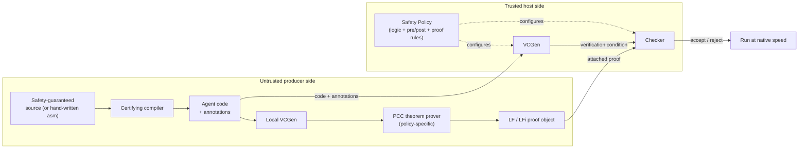
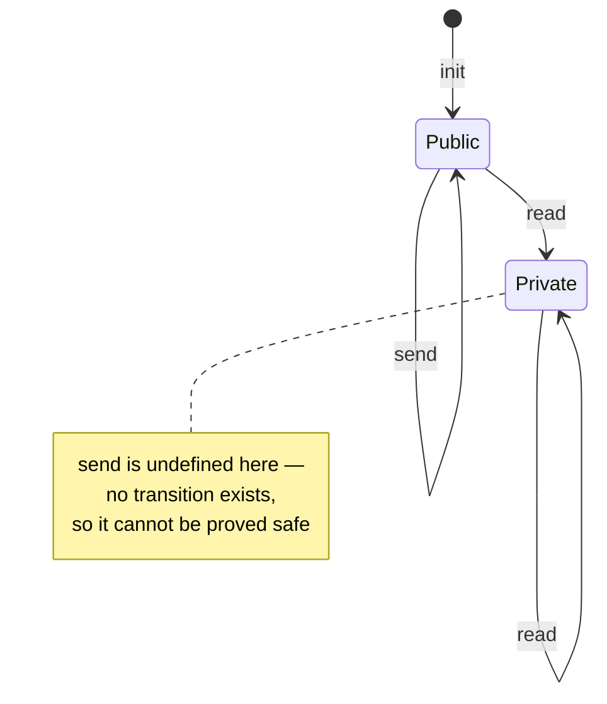

# Proof-Carrying Code

[[book-guidelines|↩ Back to guidelines]]

## Why this exists

Suppose you run a system that accepts and executes code from untrusted sources — a kernel loading device drivers, a browser running extensions, an operating system accepting mobile agents. You need a guarantee: this code will not corrupt memory, will not violate your safety policy. How do you get that guarantee cheaply, at load time, without either (a) trusting the code's author, or (b) paying a runtime interpretation/checking tax on every single instruction forever?

Two standard answers existed before this chapter's technique, and both have a real cost:

- **Sandboxing / interpretation** (a JVM bytecode interpreter, a runtime type checker on every array access): safe, but you pay the tax on *every execution*, forever, and you need a trusted interpreter or JIT sitting on the host.
- **A trusted compiler**: don't run untrusted binaries at all, only compile trusted source yourself. Safe, but useless the moment you actually want to run code you didn't compile — which is the whole point of an extensible or federated system.

Proof-Carrying Code (PCC) proposes a third option, and it's a genuinely clever inversion of where the *work* happens. Instead of the host doing expensive analysis (type inference, abstract interpretation, whatever it takes to convince itself the code is safe), the host asks the **untrusted producer** to do that work and hand over the *result* as a machine-checkable artifact: a formal proof that the code obeys the safety policy. Checking a proof is vastly cheaper than finding one — this is the same asymmetry that makes NP problems hard to solve but easy to verify. The host's job shrinks to: does this proof actually establish what it claims, using rules I'm willing to trust, about the actual code I received? That's a small, mechanical, syntax-directed check — no search, no inference, no trusting the producer's toolchain at all.

This is the central idea to hold onto before any notation shows up: **PCC moves the burden of discovery from the (many, performance-critical) checking sites to the (one-time, off-critical-path) production site**, while keeping the actual trust boundary — what gets *checked* on the host — small and simple.

> **[[Dependent-Types#What breaks without this|What breaks without this]] separation:** if the checker itself had to search for a safety argument (do type inference, run an abstract interpreter, whatever), you'd be back to paying analysis costs at every load, and — worse — the correctness of your whole security architecture would depend on the correctness of that analysis engine. PCC's checker only has to *verify* a given derivation against a fixed, small set of trusted proof rules. Bugs in the (untrusted, producer-side) theorem prover that *found* the proof can't compromise soundness — a buggy prover just fails to produce proofs that check, it can never produce a proof that checks but is wrong.

## The Touchstone architecture

The chapter frames everything around a concrete instantiation called the **Touchstone** PCC architecture. An **agent** — the untrusted code — arrives at the host along with **checking-support data**: annotations and a proof. Two trusted modules process it:

- **VCGen** (verification-condition generator): scans the agent's executable content, and at every instruction that *could* violate the safety policy (a memory read, a memory write, a function call) it emits a logical formula — a **verification condition** — whose validity is *equivalent to* that instruction executing safely in context.
- **Checker**: verifies that the attached proof actually establishes the verification condition, using only a fixed set of trusted proof rules specified by the safety policy.

Crucially, the **safety policy** itself is a pluggable configuration, not baked into the infrastructure: it fixes (i) the logic of symbolic expressions and formulas used to state verification conditions, (ii) preconditions/postconditions for the functions at the agent/host interface, and (iii) the proof rules usable in safety proofs. Swap the policy — Java bytecode typing rules, a privacy policy, whatever — and the same VCGen/Checker machinery runs unchanged.



Notice what crosses the trust boundary: the agent's *code*, its *annotations*, and its *proof* — all untrusted, all just data to be checked. What stays fixed and trusted on the host is small: VCGen's scanning logic and the Checker's proof-rule interpreter. Nothing about the producer's compiler, theorem prover, or toolchain needs to be trusted at all; only the *output* is checked, and it's checked against rules the host itself controls.

## A running example: summing a list of `maybepair`

The chapter grounds everything in one concrete agent, and it's worth carrying through the whole article because every later mechanism (symbolic evaluation, the soundness proof, the LF encoding) is defined *against* this example. The source, in OCaml:

```ocaml
type maybepair = Int of int | Pair of int * int
let rec sum(acc : int, x : maybepair list) =
  match x with
  | nil -> acc
  | (Int i) :: tail -> sum(acc + i, tail)
  | (Pair (l, r)) :: tail -> sum (acc + l + r, tail)
```

To compile this to assembly we need a concrete memory representation, and the representation choice is exactly what the safety policy will need to talk about:

- A list is either $0$ (empty) or a pointer to a two-word cell: word 0 holds the element, word 1 holds the tail.
- A `maybepair` element is either an odd integer $2x+1$ encoding `Int x` (tagged odd so it's distinguishable from a pointer), or an even-valued pointer to a two-word `Pair(x, y)` cell.

The assembly (using the same minimal instruction set as the [[Typed-Assembly-Language|Typed Assembly Language]] chapter, with a `return` in place of a general indirect jump):

```
sum:
Loop:
      if rx ≠ 0 jump LCons        ; Is rx empty?
      rR := racc
      return
LCons: rt := Mem[rx]              ; Load the first data
      if even(rt) jump LPair
      rt := rt div 2
      racc := racc + rt
      jump LTail
LPair: rs := Mem[rt]              ; Get the first pair element
      racc := Mem[racc + rs]
      rt := Mem[rt + 4]           ; and the second element
      racc := racc + rt
LTail: rx := Mem[rx + 4]
      jump Loop
```

This one function is the thread the rest of the chapter pulls on: what's the safety policy that lets this code touch memory the way it does, how does a checker verify each memory access is safe, and how is that verification represented so it can be shipped and checked cheaply?

## Formalizing the safety policy

### The logic

Before we can write verification conditions we need a language to write them *in*. The chapter fixes a small first-order logic of symbolic **expressions** $E$ and **formulas** $F$:

$$
F ::= \mathrm{true} \mid F_1 \wedge F_2 \mid F_1 \vee F_2 \mid F_1 \Rightarrow F_2 \mid \forall x.\,F \mid \exists x.\,F \mid \mathrm{addr}\ E_a \mid E_1 = E_2 \mid E_1 \neq E_2 \mid f\, E_1 \dots E_n
$$
$$
E ::= x \mid \mathrm{sel}\ E_m\ E_a \mid \mathrm{upd}\ E_m\ E_a\ E_v \mid f\, E_1 \dots E_n
$$

Two pieces of notation carry almost the whole weight here and are worth naming explicitly:

- $\mathrm{addr}\ E_a$ — "the expression $E_a$ denotes a currently valid memory address." VCGen emits this formula as the verification condition at every memory access, and (as we'll see) it is the *only* formula whose provability is allowed to license a memory access at all — that's the whole safety argument in one predicate.
- $\mathrm{sel}\ E_m\ E_a$ and $\mathrm{upd}\ E_m\ E_a\ E_v$ — read and (functional, not in-place) write on a *symbolic* memory expression $E_m$. `sel m a` is "the value at address $a$ in memory state $m$"; `upd m a v` is "a new memory state, like $m$ but with $v$ written at $a$." Because $\mathrm{upd}$ is functional rather than mutating, nested writes compose as ordinary term structure: writing $1$ at $a$ then $2$ at $b$ and reading back $c$ is literally $\mathrm{sel}\ (\mathrm{upd}\ (\mathrm{upd}\ m\ a\ 1)\ b\ 2)\ c$.

A safety policy then *extends* this base logic with its own vocabulary. For the type-safety policy on our example agent, that's word types, structure types, and a typing predicate:

$$
W ::= \mathrm{int} \mid \mathrm{ptr}\{S\} \mid \mathrm{list}\ W \mid \{x \mid F(x)\} \qquad S ::= W \mid W; S \qquad F ::= \dots \mid E : W \mid \mathrm{listinv}\ E_m
$$

$\{x \mid F(x)\}$ is a **comprehension type** (sometimes called a *set type*): the type of exactly those values satisfying predicate $F$. It's how the policy encodes a union type without adding a union-type primitive to the logic — `maybepair` becomes the comprehension "either odd, or an even pointer to two ints":

$$
\mathrm{mp\_list} \equiv \mathrm{list}\ \{y \mid \mathrm{even}(y) \Rightarrow y : \mathrm{ptr}\{\mathrm{int}; \mathrm{int}\}\}
$$

and $\mathrm{listinv}\ E_m$ says "memory state $E_m$ is consistent with the representation invariant for lists of pairs" — i.e. every address that's supposed to hold a typed value actually does, recursively. Notice the type language is *first-order* — `list` is a built-in recursive type constructor precisely so the logic itself doesn't need general recursion to state list-typing facts.

**Rust [[Dependent-Types#Grounding|grounding]].** This whole logic is exactly an AST you'd define for a small verifier's IR — and since one of the standing goals here is building a Rust verifier over Hoare-style specifications, it's worth writing it out as one:

```rust
enum Expr {
    Var(String),
    Sel(Box<Expr>, Box<Expr>),                 // sel E_m E_a
    Upd(Box<Expr>, Box<Expr>, Box<Expr>),       // upd E_m E_a E_v
    App(String, Vec<Expr>),                     // f E_1 .. E_n
}

enum Formula {
    True,
    And(Box<Formula>, Box<Formula>),
    Or(Box<Formula>, Box<Formula>),
    Implies(Box<Formula>, Box<Formula>),
    Forall(String, Box<Formula>),
    Exists(String, Box<Formula>),
    Addr(Expr),                  // addr E_a
    Eq(Expr, Expr),
    Neq(Expr, Expr),
    HasType(Expr, WordType),     // E : W
    ListInv(Expr),               // listinv E_m
}

enum WordType {
    Int,
    Ptr(Vec<WordType>),          // ptr{W1; W2; ...}  (structure type S)
    List(Box<WordType>),
    Comprehension(String, Box<Formula>), // {x | F(x)}
}
```

Function preconditions and postconditions are just formulas over argument/return registers plus a distinguished pseudo-register $r_M$ standing for the whole memory:

$$
\mathrm{Pre}_{sum} = r_x : \mathrm{mp\_list} \wedge \mathrm{listinv}\ r_M \qquad \mathrm{Post}_{sum} = \mathrm{listinv}\ r_M
$$

This *is* a Hoare triple, just spelled with register names instead of program-variable names. If you're building toward a verifier that checks Hoare triples against logic-clause specifications, this is the shape you're aiming at: a precondition, a postcondition, and — as we'll see in the next section — a mechanical procedure for reducing "does the code satisfy the postcondition given the precondition" to "is this one formula provable."

### The proof rules

The logic needs inference rules to reason in, split into **built-in** rules (fixed, part of the infrastructure: conjunction/implication introduction and elimination, plus two rules `mem0`/`mem1` for reasoning about `sel`/`upd`) and **policy-specific** rules (added per safety policy). For the type-safety policy, the interesting ones are:

$$
\dfrac{}{0 : \mathrm{list}\ W}\ (\text{nil}) \qquad
\dfrac{E : \mathrm{list}\ W \quad E \neq 0}{E : \mathrm{ptr}\{W; \mathrm{list}\ W\}}\ (\text{cons}) \qquad
\dfrac{E : \{y \mid F(y)\}}{F(E)}\ (\text{set})
$$

$$
\dfrac{E : \mathrm{ptr}\{W; S\}}{E : \mathrm{ptr}\{W\}}\ (\text{this}) \qquad
\dfrac{E : \mathrm{ptr}\{W; S\}}{E + 4 : \mathrm{ptr}\{S\}}\ (\text{next}) \qquad
\dfrac{A : \mathrm{ptr}\{W\} \quad \mathrm{listinv}\ M}{(\mathrm{sel}\ M\ A) : W}\ (\text{sel})
$$

$$
\dfrac{\mathrm{listinv}\ M \quad A : \mathrm{ptr}\{W\} \quad V : W}{\mathrm{listinv}\ (\mathrm{upd}\ M\ A\ V)}\ (\text{upd}) \qquad
\dfrac{A : \mathrm{ptr}\{W\}}{\mathrm{addr}\ A}\ (\text{ptraddr})
$$

`ptraddr` deserves its own callout because it is doing all of the actual safety-enforcement work in this policy:

> **This is the sole rule that can conclude `addr`.** Every other rule reasons about types; only `ptraddr` connects a typing judgment to an actual memory-access license. This means the entire safety argument for the agent reduces to: can you derive a pointer type for the address you're about to touch? If you can't, `addr` is unprovable, the verification condition fails, and the Checker rejects the code. **What breaks without this restriction**: if any rule *besides* `ptraddr` could conclude `addr` — even one that looked harmless — you'd have opened a side channel for unsound memory-access proofs that never actually established a type for the accessed location. The whole soundness argument later in the chapter hinges on `addr` meaning exactly "this address is in the domain of the memory typing," and `ptraddr` is the only door into that meaning.

Each safety policy carries its own set of rules like this — the chapter notes a full Java type-safety policy in the actual Touchstone implementation needed about 150 of them. But note the shape: this is a natural-deduction presentation of a *type system*, restated as a *proof system*. That equivalence — "a typing judgment is a provable formula, a typing derivation is a proof" — is the seed that grows into the whole Edinburgh LF section later.

## Verification-condition generation

### Why low-level type checking can't be syntax-directed

A high-level type checker for `match x with _ :: t -> e` can just look at the AST node: it packages the scrutinee, the pattern (with the variable it binds), and the body all in one place, and a straightforward traversal checks it. Compile that same match to assembly, though, and you get something like:

```
rt := rx
rt := rt + 4
if rx = 0 jump LNil
rt := Mem[rt]
...
```

and every one of the properties a syntax-directed checker relies on has evaporated:

- The logical operation (extract the tail, dereference it) is **spread across multiple, non-contiguous instructions**, interleaved with the code for the match arms.
- The address computation `rt + 4` is **split** from the load that uses it — you can't type-check either instruction in isolation, because each could appear in other contexts with different meanings.
- Registers are **reused with different types** at different points: `rt` holds an address before the load, a list after it.
- Because of conditionals, checking is inherently **path-sensitive**: whether `rt` even has a sensible type after the addition depends on which branch you're on.

> **What breaks without addressing this**: a checker that tried to type-check instructions one at a time, locally, the way a source-level checker walks an AST, would either reject perfectly safe code (because it can't see the connection between the address computation and the later load) or would have to fall back to bundling primitive operations into high-level "macro-instructions" the way the JVM bytecode verifier does — which is exactly the approach PCC is trying to avoid, because it constrains what the *producer's* compiler can optimize (JVML forbids splitting a bounds check from the array access it guards, for instance).

### Symbolic evaluation

The fix: stop trying to type-check instructions as you see them, and instead **remember** their effect until you reach a point where a real safety-relevant decision (a memory access, a return) has to be made. A **symbolic evaluator** is an interpreter that, instead of computing with concrete values, computes with *symbolic expressions*. It maintains a **symbolic state** $\sigma$: a mapping from register names to symbolic expressions, initialized with a fresh distinct variable per register (representing total ignorance about the entry state):

$$
\sigma_0 = \{r_t = t,\ r_x = x,\ r_M = m\}
$$

Running the three instructions above symbolically:

$$
\begin{aligned}
&\sigma = \{r_t = t,\ r_x = x,\ r_M = m\} \\
r_t := r_x \quad &\sigma = \{r_t = x,\ r_x = x,\ r_M = m\} \\
r_t := r_t + 4 \quad &\sigma = \{r_t = x+4,\ r_x = x,\ r_M = m\} \\
r_t := \mathrm{Mem}[r_t] \quad &\sigma = \{r_t = (\mathrm{sel}\ m\ (x+4)),\ r_x = x,\ r_M = m\}
\end{aligned}
$$

By the time we reach the load, the symbolic evaluator has *reconstructed* exactly the bundled expression `Mem[x + 4]` that a syntax-directed checker would have wanted to see as a single AST node — for free, as a side effect of interpretation. This is the trick: symbolic evaluation recovers bundled high-level structure from unbundled low-level instructions without ever needing to pattern-match on instruction sequences.

Conditionals are handled by extending the state with a running list of **path assumptions**. Adding the branch back in:

$$
\begin{aligned}
&\sigma = \{r_t = t,\ r_x = x,\ r_M = m\},\ A \\
r_t := r_x;\ r_t := r_t + 4 \quad &\sigma = \{r_t = x+4,\ \dots\},\ A \\
\texttt{if}\ r_x = 0\ \texttt{jump}\ L_{Nil} \quad &\text{(fallthrough)}\ \ \sigma = \{\dots\},\ A \wedge x \neq 0 \\
&\text{(at $L_{Nil}$)}\ \ \sigma = \{\dots\},\ A \wedge x = 0
\end{aligned}
$$

so the verification condition emitted at the fallthrough load is, in full:

$$
\forall t.\forall x.\forall m.\ (r_t = x \wedge r_x = x+4 \wedge r_M = m \wedge A \wedge x \neq 0) \Rightarrow \mathrm{addr}\ (x+4)
$$

Path-sensitivity here isn't a bolt-on feature — it falls straight out of tracking assumptions alongside the symbolic state.

### Loop invariants, and why VCGen needs them at all

Symbolic evaluation as described so far would simply *follow control flow* — which means it loops forever on a loop. VCGen needs to stop scanning at some point and treat the rest as "already handled." The mechanism is exactly the mechanism you'd expect from a proof by induction: **annotations**. At least one invariant predicate must be supplied — by the (untrusted!) agent producer — at every back-edge target in the control-flow graph, and VCGen treats reaching an invariant point as a stopping condition, generating a verification condition there instead of continuing to unroll.

For our example, the producer supplies at label `Loop`:

$$
\mathrm{Inv}_{\texttt{Loop}} = r_x : \mathrm{mp\_list} \wedge \mathrm{listinv}\ r_M
$$

and — for uniformity — treats the *entry* of every function as carrying an implicit invariant equal to its precondition, so `Inv`$_1$ = `Inv`$_2$ = $r_x : \mathrm{mp\_list} \wedge \mathrm{listinv}\ r_M$ in this example (`Dom(Inv) = {1, 2}`).

> **What breaks without invariant annotations**: VCGen either doesn't terminate on loopy code, or has to do its own (undecidable, in general) loop-invariant inference — which reintroduces exactly the analysis-on-the-host cost PCC exists to avoid. Annotations shift that discovery burden back to the producer, symmetrically with how proofs shift the *proving* burden to the producer. Note also that **the annotations themselves are untrusted** — they come from the same possibly-adversarial source as the code. That's fine: an invariant is used both as an *assumption* (when resuming symbolic evaluation from that point) and as a *proof obligation* (that it's re-established on every path back to it), exactly mirroring how an induction hypothesis is both assumed at the inductive step and required to be reestablished — a wrong invariant just produces an unprovable verification condition, never a false sense of safety.

### The symbolic evaluation function and the global VC

The chapter's core definition: given a program counter $i$ and symbolic state $\sigma$, $SE(i, \sigma)$ produces a formula capturing every verification condition from $i$ up to the next `return` or invariant:

$$
SE(i, \sigma) = \begin{cases}
SE(i+1, \sigma[r \leftarrow \sigma\, e]) & \text{if } \Pi_i = r := e \\[4pt]
(\sigma\, e \Rightarrow SE(L, \sigma) \,\wedge\, (\neg \sigma\, e) \Rightarrow SE(i+1, \sigma)) & \text{if } \Pi_i = \texttt{if } e\ \texttt{jump } L \\[4pt]
\mathrm{addr}\,(\sigma\, a) \wedge SE(i+1, \sigma[r \leftarrow \sigma(\mathrm{sel}\ r_M\ a)]) & \text{if } \Pi_i = r := \mathrm{Mem}[a] \\[4pt]
\mathrm{addr}\,(\sigma\, a) \wedge SE(i+1, \sigma[r_M \leftarrow \sigma(\mathrm{upd}\ r_M\ a\ e)]) & \text{if } \Pi_i = \mathrm{Mem}[a] := e \\[4pt]
\sigma\,\mathrm{Post} & \text{if } \Pi_i = \texttt{return} \\[4pt]
\sigma\,I & \text{if } \Pi_i = \texttt{INV } I
\end{cases}
$$

(Here $\sigma\,e$ means substitute register names in $e$ per $\sigma$, and $\sigma[r \leftarrow e]$ is $\sigma$ updated to map $r$ to $e$.) The global verification condition then closes over every invariant point:

$$
VC = \bigwedge_{i \in \mathrm{Dom}(Inv)} \forall x_1 \dots x_n.\ \sigma_0\, Inv_i \Rightarrow SE(i+1, \sigma_0), \quad \sigma_0 = \{r_1 = x_1, \dots, r_n = x_n\}
$$

In words: for every invariant point, assume the invariant holds (with fresh universally-quantified variables standing for the unknown register contents there), symbolically evaluate forward, and require that whatever you reach — the postcondition at a return, or the next invariant — follows.

**Engineering note that matters for anything you'd actually build**: the chapter is explicit that constructing this as one monolithic formula doesn't scale — for million-instruction agents the formula can run to hundreds of megabytes. The practical VCGen streams each verification condition to the Checker as soon as it's produced, discards it once checked, and resumes. If you're building a Rust verifier, this streaming discipline — never materializing the whole proof obligation set at once — is the difference between a toy and something that scales.

**Rust grounding.** A skeletal symbolic evaluator, with the streaming discipline baked in from the start:

```rust
struct SymState {
    regs: std::collections::HashMap<String, Expr>,
}

enum Outcome {
    Emit(Formula, Box<dyn FnOnce() -> Outcome>), // a VC to check, plus continuation
    Done,
}

fn symbolic_eval(pc: usize, prog: &Program, mut sigma: SymState) -> Outcome {
    match &prog.instr(pc) {
        Instr::Assign { dst, expr } => {
            let v = substitute(&sigma, expr);
            sigma.regs.insert(dst.clone(), v);
            symbolic_eval(pc + 1, prog, sigma)
        }
        Instr::Load { dst, addr } => {
            let a = substitute(&sigma, addr);
            let vc = Formula::Addr(a.clone());
            Outcome::Emit(vc, Box::new(move || {
                let mut sigma2 = sigma;
                sigma2.regs.insert(dst.clone(),
                    substitute(&sigma2, &Expr::Sel(Box::new(Expr::Var("rM".into())), Box::new(a))));
                symbolic_eval(pc + 1, prog, sigma2)
            }))
        }
        Instr::Return => Outcome::Emit(substitute_formula(&sigma, &prog.post), Box::new(|| Outcome::Done)),
        Instr::Invariant(inv) => Outcome::Emit(substitute_formula(&sigma, inv), Box::new(|| Outcome::Done)),
        // .. conditional, store, cases follow the same shape as SE
    }
}
```

The point of writing it this way — `Emit` yielding one formula plus a continuation, rather than building a `Vec<Formula>` — is that it *is* the streaming architecture: the caller can hand each `Formula` to a checker and drop it before asking for the next one.

## Soundness: why a provable VC actually means "safe"

None of the above is worth anything without a proof that a provable $VC$ really does rule out unsafe execution. The chapter's soundness argument is structured exactly like a type-soundness proof for a high-level language — Preservation-and-Progress, but staged through the symbolic-evaluator's bookkeeping instead of directly through typing derivations. This is worth dwelling on if you're aiming at a Hoare-triple verifier, because **this is literally the soundness proof for VCGen-as-a-Hoare-logic**, spelled out concretely rather than left as folklore.

**Semantics of the logic.** A memory typing $M$ is a mapping from valid addresses to word types, and $\models_M F$ ("formula $F$ holds under memory typing $M$") is defined structurally, e.g.:

$$
\models_M a : \mathrm{list}\ W \iff a = 0 \ \lor\ (M(a) = W \wedge M(a+4) = \mathrm{list}\ W) \qquad \models_M \mathrm{addr}\ a \iff a \in \mathrm{Dom}(M)
$$

Every proof rule's soundness reduces to a single semantic fact: for a rule with premises $H_1,\dots,H_m$ and conclusion $C$, you show $\models_M \forall \vec{x}.\ (H_1 \wedge \dots \wedge H_m) \Rightarrow C$. E.g. soundness of `sel` needs $\models_M \forall a.\forall W.\forall m.\ (a : \mathrm{ptr}\{W\}) \wedge \mathrm{listinv}\ m \Rightarrow (\mathrm{sel}\ m\ a) : W$, which unwinds directly from the definitions of `ptr` and `listinv`. This is exactly what you'd do to justify each rule of a program logic before ever using it in an automated prover.

**Operational semantics.** A small-step relation $(i, \rho) \leadsto (i', \rho')$ on program-counter/register-state pairs, deliberately left **undefined** on unsafe states (bad PC, invalid address) — "going wrong" is modeled as *getting stuck*, the same convention used for type soundness of high-level languages.

**The correspondence invariant.** This is the crux, and the one piece of notation genuinely worth sitting with:

$$
IH(i, \rho, \sigma, \varphi) \equiv \rho = \varphi \circ \sigma \ \wedge\ \models_M \varphi(SE(i, \sigma))
$$

In words: a *concrete* register state $\rho$ and a *symbolic* state $\sigma$ correspond at program counter $i$ (via a valuation $\varphi$ mapping $\sigma$'s free variables to concrete values) exactly when (1) evaluating the symbolic state under $\varphi$ reproduces the concrete state — $\rho = \varphi \circ \sigma$ — and (2) the formula that symbolic evaluation would emit from here is actually *true* under $\varphi$ and the memory typing. This is the induction hypothesis threaded through the whole proof, and it's the right one for a structural reason: it's precisely strong enough that "the current instruction's precondition is met" (needed for Progress) and "the invariant is preserved by taking one more step" (needed to continue the induction) both fall out of it directly, case by case on the instruction.

**Progress Theorem (5.4.4).** If $IH(i,\rho,\sigma,\varphi)$ holds and $\models_M VC$, then either $\Pi_i = \texttt{return}$ and $\models_M \rho\,\mathrm{Post}$, or the machine can take a step to $(i', \rho')$ with $IH(i', \rho', \sigma', \varphi')$ reestablished. Proved by cases on the instruction at $i$; the load case is illustrative: $IH$ gives you $\models_M \varphi(\mathrm{addr}\,(\sigma\,e))$, which by the semantics of `addr` is exactly $(\rho\, e) \in \mathrm{Dom}(M)$ — the *progress* condition the operational semantics needs to take the load step at all.

**Soundness of VCGen (5.4.3).** If the entry state satisfies the precondition and $\models_M VC$, execution from the start either runs forever or reaches a `return` in a state satisfying the postcondition — it never gets stuck. This is Progress, bootstrapped by induction on execution steps, with the base case supplied by the fact that the precondition is exactly the invariant at function entry.

**Lean grounding.** If you're building a Lean-style elaborator/checker alongside the Rust verifier, this theorem is worth restating in a form close to how you'd actually state and (eventually) prove it in Lean, because the *shape* — a correspondence relation carried as an induction hypothesis through a step relation, culminating in a progress-style disjunction — is the same shape as a Lean-formalized type-soundness proof:

```lean
-- Sketch, not a literal transcription of the book's untyped registers/values.
structure SymState where
  regs : String → Expr

def IH (M : MemTyping) (i : Nat) (ρ : String → Val) (σ : SymState) (φ : String → Val) : Prop :=
  (∀ r, ρ r = eval φ (σ.regs r)) ∧ satisfies M (subst φ (SE i σ))

theorem progress (prog : Program) (M : MemTyping)
    (hVC : satisfies M (globalVC prog)) (i : Nat) (ρ : String → Val)
    (σ : SymState) (φ : String → Val) (h : IH M i ρ σ φ) :
    (prog.instrAt i = Instr.ret ∧ satisfies M (subst ρ prog.post)) ∨
    ∃ i' ρ' σ' φ', prog.step (i, ρ) (i', ρ') ∧ IH M i' ρ' σ' φ' := by
  sorry -- case analysis on prog.instrAt i, mirroring §5.4's case split
```

## Representing and checking proofs: the Edinburgh Logical Framework

Soundness tells you a provable $VC$ is enough. It says nothing about how to *represent* a proof so a small, trusted, logic-independent piece of code can check it in one pass, without search, compactly. This section is the one most directly load-bearing for a Lean-style elaborator/kernel project, and it's worth flagging explicitly before diving in: **what LF does here is exactly what a dependently-typed proof kernel does, described from first principles rather than assumed as background.**

### Judgments as types, derivations as objects

The obvious approach — hand-write a proof representation and a checking algorithm specific to your logic — doesn't scale: you re-implement both for every new safety policy, and checker size grows with the number of proof rules (recall: ~150 rules for the real Java policy). Edinburgh LF (Harper, Honsell, Plotkin 1993) sidesteps this with a single, logic-independent idea: **represent a predicate as an LF *type*, and represent a proof of that predicate as an LF *object of that type***. Checking a proof then reduces to *type-checking an LF term* — one algorithm, reused for every logic you plug in.

LF itself is a small dependently-typed $\lambda$-calculus with three syntactic levels:

$$
K ::= \mathrm{Type} \mid \Pi x{:}A.K \qquad A ::= a \mid A\,M \mid \Pi x{:}A_1.A_2 \qquad M ::= x \mid c \mid M_1\,M_2 \mid \lambda x{:}A.M
$$

Objects are classified by types, types are classified by kinds, $\Pi x{:}A.B$ is the dependent function type (writing $A \to B$ when $x \notin \mathrm{FV}(B)$). A **signature** $\Sigma$ declares the type/object constants that encode a particular object logic. For our safety policy, the syntax gets one LF type constant per syntactic category (expressions $\iota$, formulas $o$, word types $w$, structure types $s$) and one LF object/type constant per constructor — e.g. `int : w`, `list : w → w`, `sel : ι → ι → ι`, `settype : (ι → o) → w`. Note the last one: representing the object-logic binder in `{x | F(x)}` as an *LF-level function* `ι → o` means α-equivalence and substitution in the object logic come **for free** from LF's own binding machinery — this "higher-order abstract syntax" trick is why binding-heavy logics are LF's sweet spot.

Proof rules become constants of a dependent function type, using a type family `pf : o → Type` indexed by *which formula* is being proved:

```
pf   : o → Type
andi : Πp:o.Πr:o. pf p → pf r → pf (and p r)
impi : Πp:o.Πr:o. (pf p → pf r) → pf (impl p r)
cons : ΠE:ι.ΠW:w. pf (hastype E (list W)) → pf (neq E zero)
                 → pf (hastype E (ptr (seq2 W (seq1 (list W)))))
```

Read `impi`'s type aloud: "given a proof of $p$ implies a proof of $r$ — an LF *function* from `pf p` to `pf r` — produce a proof of $p \Rightarrow r$." The hypothetical/schematic nature of implication introduction (the standard side condition "the assumption of $p$ must be local to this subproof") is captured *automatically* by LF-level variable binding and scoping — no separate bookkeeping needed. This is the payoff of "judgments as types, derivations as objects": a proof of $F \Rightarrow (F \wedge F)$ literally *is* the LF term

$$
\texttt{impi}\ \ulcorner F\urcorner\ (\texttt{and}\ \ulcorner F\urcorner\ \ulcorner F\urcorner)\ (\lambda x{:}\texttt{pf}\ \ulcorner F\urcorner.\ \texttt{andi}\ \ulcorner F\urcorner\ \ulcorner F\urcorner\ x\ x)
$$

and checking that this term has type $\texttt{pf}\ \ulcorner F \Rightarrow (F \wedge F)\urcorner$ *is* checking the proof — via the same four ordinary LF typing judgments ($\Gamma \vdash^{LF} A : K$, $\Gamma \vdash^{LF} M : A$, plus $\beta\eta$-equivalence on types and objects) that would check *any* LF term, regardless of which object logic's signature you loaded. Two **Adequacy Theorems** (5.5.3, 5.5.4) make this correspondence precise both ways: every closed formula/derivation has a well-typed LF representation, and — the direction PCC actually depends on — every closed, well-typed LF object of type $\texttt{pf}\ \ulcorner F \urcorner$ corresponds ($\beta\eta$-equivalently) to an actual derivation of $F$ in the encoded logic. That second direction is the whole safety guarantee: *if the LF checker accepts the proof object, a real derivation exists.*

Below is a self-contained derivation tree, laid out in the tree shape the natural-deduction rules suggest, for the actual verification condition `addr (sel m₁ x₁)` from the running example's Figure 5-8 — worth looking at once with the eventual LF encoding in mind, since every node here becomes one application in the flattened LF term above.

<svg viewBox="0 0 900 480" xmlns="http://www.w3.org/2000/svg" font-family="Georgia, serif" font-size="15">
  <style>
    .node { fill:#f4f4f2; stroke:#666666; stroke-width:1.2; rx:5; }
    .lbl { fill:#1a1a1a; }
    .rule { fill:#555555; font-style:italic; font-size:13px; }
    .line { stroke:#888888; stroke-width:1.3; }
  </style>

  <!-- leaves -->
  <rect class="node" x="20" y="20" width="160" height="34"/>
  <text class="lbl" x="100" y="42" text-anchor="middle">x₁ : mp_list</text>

  <rect class="node" x="200" y="20" width="90" height="34"/>
  <text class="lbl" x="245" y="42" text-anchor="middle">x₁ ≠ 0</text>

  <line class="line" x1="20" y1="70" x2="290" y2="70"/>
  <text class="rule" x="300" y="74">CONS</text>

  <rect class="node" x="40" y="80" width="260" height="34"/>
  <text class="lbl" x="170" y="102" text-anchor="middle">x₁ : ptr {maybepair; mp_list}</text>

  <rect class="node" x="330" y="80" width="130" height="34"/>
  <text class="lbl" x="395" y="102" text-anchor="middle">listinv m₁</text>

  <line class="line" x1="40" y1="130" x2="460" y2="130"/>
  <text class="rule" x="470" y="134">THIS</text>

  <rect class="node" x="120" y="140" width="220" height="34"/>
  <text class="lbl" x="230" y="162" text-anchor="middle">x₁ : ptr {maybepair}</text>

  <line class="line" x1="120" y1="190" x2="340" y2="190"/>
  <text class="rule" x="350" y="194">SEL</text>

  <rect class="node" x="130" y="200" width="230" height="34"/>
  <text class="lbl" x="245" y="222" text-anchor="middle">(sel m₁ x₁) : maybepair</text>

  <rect class="node" x="130" y="260" width="360" height="34"/>
  <text class="lbl" x="310" y="282" text-anchor="middle">even(sel m₁ x₁) ⇒ (sel m₁ x₁) : ptr{int;int}</text>

  <rect class="node" x="510" y="260" width="180" height="34"/>
  <text class="lbl" x="600" y="282" text-anchor="middle">even(sel m₁ x₁)</text>

  <line class="line" x1="130" y1="250" x2="245" y2="250"/>
  <text class="rule" x="255" y="254">SET</text>

  <line class="line" x1="130" y1="310" x2="690" y2="310"/>
  <text class="rule" x="700" y="314">IMPE</text>

  <rect class="node" x="270" y="320" width="230" height="34"/>
  <text class="lbl" x="385" y="342" text-anchor="middle">(sel m₁ x₁) : ptr {int;int}</text>

  <line class="line" x1="270" y1="370" x2="500" y2="370"/>
  <text class="rule" x="510" y="374">THIS</text>

  <rect class="node" x="300" y="380" width="180" height="34"/>
  <text class="lbl" x="390" y="402" text-anchor="middle">(sel m₁ x₁) : ptr {int}</text>

  <line class="line" x1="300" y1="430" x2="480" y2="430"/>
  <text class="rule" x="490" y="434">PTRADDR</text>

  <rect class="node" x="310" y="440" width="180" height="34" fill="#e8e8e0"/>
  <text class="lbl" x="400" y="462" text-anchor="middle" font-weight="bold">addr (sel m₁ x₁)</text>
</svg>

### The redundancy problem, and Implicit LF

The elegance of LF comes with a real cost: the fully-explicit term for even the tiny proof of $F \Rightarrow (F \wedge F)$ above contains **six** copies of $F$, versus three in the predicate itself. Redundancy compounds badly — for an $n$-way conjunction, the number of duplicated copies of a subterm ranges from $n \log n$ (perfectly balanced tree) to $n^2/2$ (degenerate, list-shaped tree). That's not just wasted bandwidth shipping the proof; every redundant copy has to be *re-type-checked and re-checked for equivalence* with the corresponding instance in the goal, so it's wasted checking time too.

The fix — **Implicit LF (LFi)** — is conceptually simple: most of these redundant subterms are recoverable from the *goal type* (the verification condition), which the Checker already trusts (VCGen produced it). So the producer replaces redundant subterms with a placeholder $*$, and the Checker's *type-checking* algorithm is modified to *reconstruct* them on the fly, purely from unification with the expected type at each step, rather than the producer shipping them explicitly.

$$
\texttt{impi}\ \ulcorner F\urcorner\ (\texttt{and}\ \ulcorner F\urcorner\ \ulcorner F\urcorner)\ (\lambda x{:}\texttt{pf}\ \ulcorner F\urcorner.\ \texttt{andi}\ \ulcorner F\urcorner\ \ulcorner F\urcorner\ x\ x)
\quad\longrightarrow\quad
\texttt{impi}\ *_1\ *_2\ (\lambda u{:}*_3.\ \texttt{andi}\ *_4\ *_5\ u\ u)
$$

Reconstruction proceeds top-down against the expected type. Matching `impi`'s result type $\texttt{pf}(\texttt{impl}\ p\ r)$ against the goal $\texttt{pf}\ (\texttt{impl}\ \ulcorner F\urcorner\ (\texttt{and}\ \ulcorner F \urcorner\ \ulcorner F\urcorner))$ instantiates $*_1 \equiv \ulcorner F\urcorner$, $*_2 \equiv \texttt{and}\ \ulcorner F\urcorner\ \ulcorner F\urcorner$ *for free*, leaving a residual constraint on the remaining explicit argument; recursing into that constraint recovers $*_3$ from the domain type of the expected function type, and so on down to the leaves, where the two occurrences of $u$ are checked by ordinary variable lookup (which does require checking $\ulcorner F\urcorner$ from the context against $\ulcorner F\urcorner$ from the goal for equivalence — the one place actual work still happens).

The formal device is a separate type system LFi (Figure 5-14) extending LF's rules with implicit abstraction $\lambda x{:}*.M$ and placeholder application $M\,*$, restricted so **placeholders can only appear as arguments, never in function position** — this sidesteps needing higher-order unification during reconstruction, which is the one thing that would have made this intractable in general. A **reconstruction relation** $M \nearrow M'$ relates an LFi term to one of its (possibly several) fully-explicit LF reconstructions, and:

**Theorem 5.5.5 (Soundness of LFi typing).** If $\Gamma \vdash^{i} M : A$ with $\Gamma, A$ placeholder-free, then there exists $M'$ with $M \nearrow M'$ and $\Gamma \vdash^{LF} M' : A$.

So every well-typed LFi term, however aggressively compressed, reconstructs to a genuinely well-typed (hence, by Adequacy, genuinely *proof-correct*) LF term. Compression is free — it costs nothing in trustworthiness, only in implementation complexity on the (trusted, but small) reconstruction algorithm.

> **This is directly the mechanism you'd want for a Lean-style elaborator.** Placeholders reconstructed by matching against an expected type, propagated top-down through applications, is *exactly* what metavariable-driven bidirectional elaboration does: a metavariable is a placeholder; unifying it against an expected type during checking is reconstruction; the restriction that placeholders can't appear in function position is a weak analogue of the pattern-unification restriction (Miller patterns) that keeps metavariable solving decidable rather than falling into general higher-order unification. If you're building the elaborator described in the standing learning goals, Implicit LF is a compact, fully worked historical example of "how far can type-directed reconstruction get you before you need real unification" — and the restriction it imposes to stay tractable (no placeholders in head position) is the same shaped restriction Miller patterns impose for the same reason.

**Lean grounding.** The correspondence is close enough to write down directly. An LF signature *is* a Lean `inductive` family plus a set of constants — here's the safety-policy fragment, transliterated:

```lean
-- ι, o, w, s are the LF base types; `pf` is the proof-irrelevant-looking
-- but very much relevant indexed family "proof of this formula."
axiom ι : Type
axiom o : Type
axiom w : Type

axiom hastype : ι → w → o
axiom listT   : w → w
axiom pf      : o → Type   -- "judgments as types"

axiom andi : ∀ (p r : o), pf p → pf r → pf (p.and r)
axiom impi : ∀ (p r : o), (pf p → pf r) → pf (p.impl r)
-- `impi`'s hypothesis `pf p → pf r` is literally a Lean function type —
-- the same mechanism Lean uses for ordinary hypothetical reasoning.

-- A concrete proof term, corresponding to the book's Figure 5-12:
def proofFimpFandF (F : o) : pf (F.impl (F.and F)) :=
  impi F (F.and F) (fun (u : pf F) => andi F F u u)
```

Type-checking `proofFimpFandF` in Lean's kernel is doing *exactly* what the PCC Checker does when it type-checks the corresponding LF term — Lean's kernel *is* an LF-style checker for a (much richer) logic, and `isDefEq` (Lean's definitional-equality check) is playing the role of the chapter's $\beta\eta$-equivalence judgment on LF objects. If you ever wondered what a minimal, from-scratch description of "what does a proof kernel actually have to do" looks like, this section of the chapter is close to as small as that gets while remaining honest.

## Proof generation: certifying compilers and the division of trust

Everything above assumes a proof already exists. Where does it come from? The chapter's answer leans on a structural observation: if the agent was compiled from a **safety-guaranteed high-level language** (one where [[Typed-Assembly-Language#The type system|the type system]] statically guarantees the safety policy), the high-level type checker *already contains* the safety argument — it just needs to be transcribed into the low-level logic.

Concretely: a **certifying compiler** emits, alongside the assembly, the loop-invariant annotations VCGen needs — which for a type-safety policy are essentially "conjunctions of type declarations for the registers live at this program point," information the compiler tracks anyway during code generation. Then a **PCC theorem prover**, specialized to the safety policy (the chapter's phrase: "little more than a type checker"), runs a *local copy* of VCGen over the annotated code and emits explicit (LF or LFi) proof objects for each resulting verification condition.


The **division of trust** this buys is worth stating precisely, because it's the entire economic argument for PCC: *everything* on the producer side — the certifying compiler, the local VCGen, the theorem prover — is untrusted. If any of it is buggy, the worst outcome is that it fails to produce a proof that checks (agent rejected); it can never produce a proof that checks but shouldn't. Only the receiver-side VCGen and Checker are trusted, and both are small, fixed, logic-parameterized pieces of code, independent of which policy or which producer toolchain is in play. This is the same insight that makes an embedded automated theorem prover in a verifier tractable to trust: the prover can be as heuristic, incomplete, or even occasionally buggy as you like, *as long as its output is independently checked* by a small, separately-verified checker. The theorem-proving component doesn't need to be trustworthy; only the checking component does.

## PCC beyond types: history-sensitive policies

Everything so far enforces a *state-independent* property: is this memory access, right now, licensed by a currently-derivable type? But some safety policies are inherently about *history* — a privacy policy that says "you may not `send` data over the network after you've `read` a local file," regardless of what type anything currently has. The chapter shows this generalizes with a small, contained extension, and it's worth walking through because it demonstrates that the "VCGen + Checker + safety policy" architecture isn't secretly type-system-specific — it's a general Hoare-logic machine that happens to have been demonstrated on type safety first.

The policy is a two-state automaton:



To track this, extend the symbolic evaluator with one more pseudo-register $r_H$, holding a **history expression**:

$$
H ::= x \mid \mathrm{event}\ V\ H \qquad V ::= \mathrm{init} \mid \mathrm{read} \mid \mathrm{send}
$$

and add two formulas plus three proof rules that encode the automaton's transition structure as provable facts about histories:

$$
\dfrac{}{\mathrm{publicState}\ (\mathrm{event}\ \mathrm{init}\ H)}\ (\text{init}) \qquad
\dfrac{\mathrm{publicState}\ H}{\mathrm{publicState}\ (\mathrm{event}\ \mathrm{send}\ H)}\ (\text{send}) \qquad
\dfrac{}{\mathrm{privateState}\ (\mathrm{event}\ \mathrm{read}\ H)}\ (\text{read})
$$

Notice there is *no rule* concluding `publicState (event send H)` from `privateState H` — the automaton's forbidden transition (send while private) is enforced purely by *absence*: there's simply no proof rule that could ever discharge the precondition of `send` once you're in the private state. The symbolic evaluator's handling of the two calls just threads $r_H$ forward and inserts a precondition check at `send`:

$$
SE(i,\sigma) = \begin{cases}
SE(i+1, \sigma[r_H \leftarrow \sigma(\mathrm{event}\ \mathrm{read}\ r_H)]) & \text{if } \Pi_i = \texttt{call read} \\
\mathrm{publicState}\ (\sigma\, r_H) \wedge SE(i+1, \sigma[r_H \leftarrow \sigma(\mathrm{event}\ \mathrm{send}\ r_H)]) & \text{if } \Pi_i = \texttt{call send}
\end{cases}
$$

**What this buys you, precisely stated by the chapter**: any safety policy enforceable by a run-time-checking interpreter can in principle be enforced by PCC instead — at zero runtime cost, since all the checking happens once, at load time. The catch, made explicit rather than glossed over: **every time the proof-rule set changes, the soundness proof has to be redone.** Extending the logic isn't free just because the *infrastructure* (VCGen's generic shape, the Checker's generic algorithm) is reusable — the soundness argument is a property of the specific rule set, not of the architecture.

## Where this leads

Within this book, Proof-Carrying Code sits as the payoff chapter for Typed Assembly Language (Chapter 4): TAL bakes safety guarantees into a type system that must be threaded through the whole compiler pipeline; PCC instead treats the type system (or *any* safety-relevant logic) as one more pluggable configuration on top of a general verification-and-proof-checking architecture, trading a more complex checker for a dramatically smaller burden on the code producer's compiler design. The chapter is explicit that this is a deliberate midpoint between JVML-style bytecode verification (simple checker, restrictive bytecode) and Foundational PCC (minimal checker, maximal producer burden) — worth remembering as a design-space map, not just a historical note, the next time you're deciding how much of a safety argument to push into a fixed checker versus a flexible logic.

For the standing project goals, this chapter is directly load-bearing on **both** targets, more concretely than most chapters in this book will be:

- **The Rust compiler/verifier target.** Verification-condition generation via symbolic evaluation *is* the mechanism for checking Hoare-style pre/postcondition specifications against low-level (or even mid-level IR) code — this chapter gives you the whole pipeline end to end: symbolic state threading, path-sensitive assumption tracking, the streaming architecture that keeps it scalable, and — critically — a fully worked soundness proof (the correspondence invariant $IH$, the Progress theorem) that is the template for proving *your own* VCGen sound once you build one. The proof-rule-as-data design (Figure 5-6, swappable per safety policy) is also a direct model for how to structure an embedded theorem prover's rule set as configuration rather than hard-coded logic.
- **The Lean-style elaborator target.** The Edinburgh LF section is close to a minimal specification of what a dependently-typed proof kernel has to do, and Implicit LF's placeholder reconstruction is a small, fully-worked instance of type-directed metavariable resolution — the same shape of problem your elaborator's unification will face, with the same shaped tractability restriction (no placeholders/metavariables in head position) that Miller patterns later generalize.

Both threads converge on the same underlying claim, which is really the chapter's thesis stated as an engineering principle: **checking is cheap, finding is expensive — so design your system so the expensive part happens once, off the critical path, and the critical path only ever has to check.**
