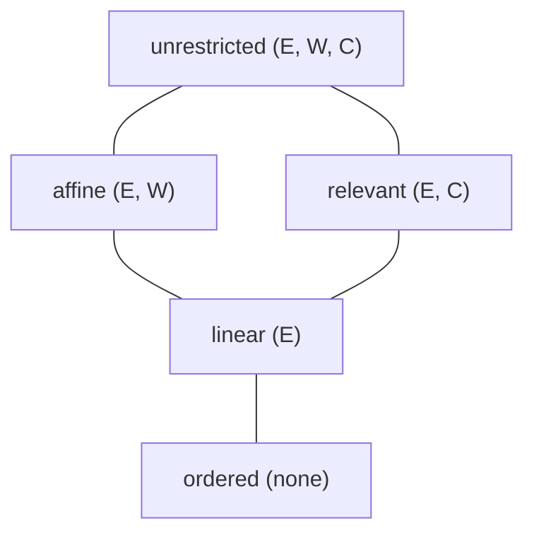
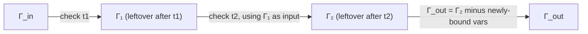

[[book-guidelines|↩ Back to guidelines]]

## Why would a type system ever want to be *less* powerful?

Every type system you've used casually — Java, Python, even vanilla Rust before you learned about `move` — treats variables the same way arithmetic treats numbers: once you have a value bound to a name, you can use that name as many times as you like, in whatever order you like, and if you never use it, that's fine too. This chapter's opening move is to notice that this permissiveness is not a law of nature. It's a *choice*, baked into the structural design of the typing judgment, and the chapter names the three specific freedoms that make it possible:

- **Exchange** — you can reorder the variables in your typing context $\Gamma$ (the list of "variable : type" assumptions) without breaking anything.
- **Weakening** — you can add assumptions to $\Gamma$ that the term never uses, and it still type-checks.
- **Contraction** — two identical assumptions can be collapsed into one; equivalently, a single assumption can be used as if there were two of it.

Ordinary type systems (the simply-typed lambda calculus in TAPL, and essentially everything you've worked with) grant all three. A **substructural type system** is one that revokes one or more of them. That's the entire definition — deceptively small, but it turns out to be exactly the right lever for statically tracking *resources*: things that must be used exactly once, or at most once, or in a specific order, because using them zero times leaks them and using them twice corrupts them.

**[[Dependent-Types#What breaks without this|What breaks without this]].** Consider a `free` function for manual memory management, or a `close` function for a file handle. Ordinary structural typing gives you no way to stop a client from writing `free(x); free(x)` (double-free) or from never calling `free(x)` at all (a leak), because exchange/weakening/contraction let a variable's assumption be used any number of times in any order. Abstract data types (hiding the representation of `file` behind an opaque interface) control *what* you can do to a file, but not *how many times* or *in what order* — nothing stops `read` after `close`. That's the gap substructural typing exists to close.

## The taxonomy: four ways to restrict structure

Revoking different subsets of {exchange, weakening, contraction} gives four named disciplines. The book's own naming:

| System | Exchange | Weakening | Contraction | Guarantee |
|---|:---:|:---:|:---:|---|
| **linear** | yes | no | no | used *exactly once* |
| **affine** | yes | yes | no | used *at most once* |
| **relevant** | yes | no | yes | used *at least once* |
| **ordered** | no | no | no | used *exactly once, in the order introduced* |
| **unrestricted** | yes | yes | yes | used any number of times, any order (ordinary typing) |

The book gives a Hasse-diagram mnemonic — unrestricted at the top (all three properties), affine and relevant as incomparable middle points (each gives up a different one), linear underneath both, and ordered at the very bottom giving up everything:



This diagram *is* a preorder, and the book formalizes it directly as a relation $q_1 \sqsubseteq q_2$ ("$q_1$ is more restrictive than $q_2$"), read as "system $q_1$ has fewer structural rules than $q_2$":

$$\mathrm{ord} \sqsubseteq \mathrm{lin} \qquad \mathrm{lin} \sqsubseteq \mathrm{rel} \qquad \mathrm{lin} \sqsubseteq \mathrm{aff} \qquad \mathrm{rel} \sqsubseteq \mathrm{un} \qquad \mathrm{aff} \sqsubseteq \mathrm{un}$$

plus reflexivity and transitivity. This ordering isn't just decorative — it becomes the machinery that governs *nesting* (can a $q_1$-qualified thing live inside a $q_2$-qualified thing?) in section 1.2.

**Rust [[Dependent-Types#Grounding|grounding]], made explicit up front.** If you've internalized Rust's ownership model, you already have working intuition for the *linear* row of this table, minus a wrinkle. Rust's `move` semantics say: a value can be used (read, passed by value, etc.) and afterward the binding is dead — using it again is a compile error ("use of moved value"). That's "at most once," i.e., **affine**, not linear — Rust does not force you to use a value at all (you can let a non-`Drop` value simply go out of scope unused). Where Rust gets *linear*-flavored behavior is via the `#[must_use]` lint and, more rigorously, via types that implement `Drop`: a `Drop` value is *guaranteed* to be consumed exactly once, either by an explicit move-out/consuming method or by the destructor running at scope end — you can't have it be silently forgotten (well — you can via `mem::forget`, which is exactly the kind of unsoundness-adjacent escape hatch this chapter's `discard`/`duplicate` examples are about). So: Rust's ownership discipline is affine by default, with `Drop` types behaving close to linear (the destructor is the "someone must use this" backstop). This chapter's linear calculus is thus the formal ancestor of exactly the checking algorithm rustc's borrow checker runs.

## A Linear Type System (§1.2): the chapter's core case study

### The two invariants that make linearity sound

The book states the entire soundness argument for linear typing as two invariants, and it's worth sitting with *why both* are needed — because each one, in isolation, has a concrete, nameable exploit.

1. **Linear variables are used exactly once along every control-flow path.**
2. **Less-restrictive (containing) structures cannot contain more-restrictive (contained) ones** — an unrestricted pair cannot hold a linear component, formalized via a containment predicate $q(T)$ ("type $T$ is compatible with qualifier $q$"): $q(T)$ holds iff $T = q'\,P$ (some pretype $P$ tagged with qualifier $q'$) and $q \sqsubseteq q'$.

**What breaks without invariant 1.** If a linear variable `x` (think: a file handle or a heap-allocated buffer with a `free` operation) could be referenced twice, you could write

```
(λz. λy. <free z, free y>) x x
```

Both `free z` and `free y` fire during evaluation, but `z` and `y` are aliases for the same underlying object — you free it twice. This is a double-free, full stop; [[Typed-Assembly-Language#The type system|the type system]]'s whole job is to make this term ill-typed.

**What breaks without invariant 2.** Suppose you allow a linear value `x` to be captured inside an *unrestricted* pair, `un <x,3>`. Because unrestricted things can be duplicated freely (that's what unrestricted *means*), you get the double-use exploit back through the side door:

```
let z = un <x,3> in
split z as x1,_ in
split z as x2,_ in
<free x1, free x2>
```

`z` gets split twice, extracting two aliases `x1` and `x2` of the same linear `x`, and now you're back to double-freeing. The lesson: "used exactly once" is a property of *program points*, but data structures let you smuggle a value from a strict context into a lax one, where the lax context's freedoms (weakening, contraction) undo the strict context's guarantee. Containment closes that door by making the type system statically reject any attempt to nest a stricter qualifier inside a looser one.

### Context splitting: the mechanism that enforces invariant 1

In an ordinary type system, when you type-check a term with two subterms (say, a pair `<t1, t2>`), you pass the *same* context $\Gamma$ to both subterms — that's exactly what weakening and contraction give you for free. In a linear system you can't do that: if `x` is linear and appears in both `t1` and `t2`, it would be used twice. So the book introduces **context splitting**, written $\Gamma = \Gamma_1 \circ \Gamma_2$: a relation (not a function — it's genuinely nondeterministic in the declarative presentation) that partitions $\Gamma$ so that each linear assumption goes to exactly one of $\Gamma_1$, $\Gamma_2$, while unrestricted assumptions get duplicated into *both* halves:

$$
\dfrac{}{\emptyset = \emptyset \circ \emptyset} \text{(M-Empty)}
\qquad
\dfrac{\Gamma = \Gamma_1 \circ \Gamma_2}{\Gamma, x{:}\mathrm{un}\,P = (\Gamma_1, x{:}\mathrm{un}\,P) \circ (\Gamma_2, x{:}\mathrm{un}\,P)} \text{(M-Un)}
$$
$$
\dfrac{\Gamma = \Gamma_1 \circ \Gamma_2}{\Gamma, x{:}\mathrm{lin}\,P = (\Gamma_1, x{:}\mathrm{lin}\,P) \circ \Gamma_2} \text{(M-Lin1)}
\qquad
\dfrac{\Gamma = \Gamma_1 \circ \Gamma_2}{\Gamma, x{:}\mathrm{lin}\,P = \Gamma_1 \circ (\Gamma_2, x{:}\mathrm{lin}\,P)} \text{(M-Lin2)}
$$

This shows up in every typing rule with more than one premise term. Pair introduction is the cleanest example:

$$
\dfrac{\Gamma_1 \vdash t_1 : T_1 \qquad \Gamma_2 \vdash t_2 : T_2 \qquad q(T_1) \qquad q(T_2)}{\Gamma_1 \circ \Gamma_2 \vdash q\,\langle t_1, t_2\rangle : q\,(T_1 * T_2)} \text{(T-Pair)}
$$

Every unrestricted variable used by either subterm is available to *both* (it got copied into both halves by M-Un); every linear variable is routed to exactly one subterm by the splitting relation. The variable rule then closes the loop by demanding that any *leftover* context around the variable be entirely unrestricted:

$$
\dfrac{\mathrm{un}(\Gamma_1, \Gamma_2)}{\Gamma_1, x{:}T, \Gamma_2 \vdash x : T} \text{(T-Var)}
$$

— i.e., you may only look up `x` if every *other* binding still in scope is droppable/reusable; a linear neighbor sitting unused would be a leak that this rule statically forbids.

**Rust correspondence.** Context splitting is the *typing-judgment-level* version of what the Rust borrow checker does dataflow-analysis-style: at a use of a moved-from value, it checks the value hasn't already been consumed on *any* path reaching that point, and if a value is captured by two closures or two branches, ownership must be split (one gets it, or it's cloned/shared via `Rc`/borrow). The declarative $\Gamma = \Gamma_1 \circ \Gamma_2$ relation is nondeterministic on paper — "guess a split" — precisely because a real algorithm can't guess; which is exactly the motivation for the algorithmic reformulation below, and it's the same problem rustc's MIR-based move-checker solves via a control-flow analysis rather than a guessed partition.

### An elimination form built for linearity: `split`

Notice the pair elimination form is `split t as x,y in t2`, *not* the two independent projections `π₁ t` / `π₂ t` you'd get in a normal calculus. Two independent projections would each count as a separate "use" of `t`, defeating "used exactly once." `split` extracts both components in a single elimination, counting as one use of the pair — a small but important syntactic design choice that recurs (arrays and reference counting later in the chapter face the identical problem and solve it with their own tricks, `swap` and `inc`/`dec`).

### From declarative to algorithmic: threading the context

The rules above are elegant but **not directly implementable** — a checker can't literally "guess" how to split $\Gamma$. Section 1.2's algorithmic reformulation is the part of the chapter most directly load-bearing for anyone building an actual type checker (which — per the standing project here — is exactly the target). The fix: instead of splitting a context *before* checking subterms, thread it as an **input/output pair**. The judgment becomes

$$\Gamma_{in} \vdash t : T ; \Gamma_{out}$$

read: "starting from input context $\Gamma_{in}$, term $t$ has type $T$, and after consuming whatever linear resources $t$ used, the leftover context is $\Gamma_{out}$." The first subterm of a compound term consumes some of $\Gamma_{in}$ and hands back $\Gamma_{out,1}$; the second subterm receives $\Gamma_{out,1}$ as *its* input, consumes further, and so on. No guessing — the context flows left to right (or, in evaluation order) through the term exactly like a linear resource itself.



This requires a **context difference operator** $\div$ rather than plain set removal, because variable-introducing rules (like `A-Abs`, which binds `x` for the function body, or `A-Split`, which binds `x,y`) need to (a) *check* that a linear parameter actually got consumed by the body — it must be *absent* from the body's output context — while (b) an unrestricted parameter is expected to still be present (unrestricted bindings never disappear on their own) and must be explicitly stripped back out so ordinary lexical scoping is preserved:

$$\Gamma \div \emptyset = \Gamma$$
$$\dfrac{\Gamma_1 \div \Gamma_2 = \Gamma_3 \qquad (x{:}\mathrm{lin}\,P) \notin \Gamma_3}{\Gamma_1 \div (\Gamma_2, x{:}\mathrm{lin}\,P) = \Gamma_3}$$
$$\dfrac{\Gamma_1 \div \Gamma_2 = \Gamma_3 \qquad \Gamma_3 = \Gamma_4, x{:}\mathrm{un}\,P, \Gamma_5}{\Gamma_1 \div (\Gamma_2, x{:}\mathrm{un}\,P) = \Gamma_4, \Gamma_5}$$

If the linear-variable-still-present side condition ever fires, $\div$ is simply *undefined* — which propagates to make the whole rule inapplicable. That's the "did you forget to use this linear variable" check implemented as a partial function rather than a boolean guard, a nice example of encoding an invariant into a judgment's *definedness* rather than an extra premise.

The chapter proves this reformulation correct with the standard two-sided theorem pair:

- **Algorithmic Soundness**: if $\Gamma_1 \vdash t : T ; \Gamma_2$ and $\Gamma_2$ has no leftover linear bindings, then $\Gamma_1 \vdash t : T$ in the declarative system.
- **Algorithmic Completeness**: if $\Gamma_1 \vdash t : T$ declaratively, there's *some* run of the algorithm producing $\Gamma_1 \vdash t : T ; \Gamma_2$ with $\Gamma_2$ linear-free.

together with structural lemmas for the algorithmic judgment itself (Algorithmic Monotonicity: unrestricted assumptions in the output equal those in the input, linear ones only shrink; Algorithmic Exchange, Weakening, and a Linear Strengthening lemma letting you drop an already-known-used linear binding from both ends of a derivation).

**This is exactly the shape of a bidirectional/algorithmic type-checker pass** — turning a nondeterministic specification into a deterministic, single-pass, context-threading algorithm, then proving the algorithm agrees with the spec. If your target is a Rust verifier that checks resource-usage contracts, this input/output-context judgment form is very close to what you'd implement directly: a `check` function taking an environment and handing back the residual environment, with a "no linear leftovers" check as the top-level success condition.

```rust
// Sketch: an algorithmic linear-context checker, closely mirroring Γ_in ⊢ t : T ; Γ_out
#[derive(Clone, Debug, PartialEq)]
enum Qual { Lin, Un }

#[derive(Clone, Debug, PartialEq)]
enum Ty { Bool(Qual), Pair(Qual, Box<Ty>, Box<Ty>) }

type Ctx = Vec<(String, Ty)>;

fn qual_of(t: &Ty) -> &Qual {
    match t { Ty::Bool(q) | Ty::Pair(q, _, _) => q }
}

/// Removes a binding, enforcing: linear bindings MUST be gone from `after`,
/// unrestricted bindings MUST still be present in `after` (then get pruned).
fn ctx_diff(mut after: Ctx, x: &str, ty: &Ty) -> Result<Ctx, String> {
    match qual_of(ty) {
        Qual::Lin => {
            if after.iter().any(|(n, _)| n == x) {
                return Err(format!("linear variable `{x}` not consumed"));
            }
            Ok(after)
        }
        Qual::Un => {
            let pos = after.iter().position(|(n, _)| n == x)
                .ok_or_else(|| format!("unrestricted `{x}` unexpectedly missing"))?;
            after.remove(pos);
            Ok(after)
        }
    }
}
```

### The abstract machine: what "used exactly once" buys you operationally

The chapter backs the static story with an explicit-store, small-step abstract machine (Figure 1-7/1-8) so that "linear values get deallocated on use" is not just a metaphor but an actual operational rule. The key device is the store-update function:

$$S \overset{\mathrm{lin}}{\sim} x = S_1, S_2 \quad \text{(where } S = S_1, x \mapsto v, S_2 \text{ — the binding for } x \text{ is removed)}$$
$$S \overset{\mathrm{un}}{\sim} x = S \quad \text{(unrestricted bindings are left alone)}$$

Every elimination rule that consumes a linear value threads its continuation through $S \overset{q}{\sim} x$, so linear deallocation is *literally wired into the operational semantics of using the value* — there's no separate garbage collector making the decision; the type discipline *is* the memory-management policy. Preservation and Progress theorems (1.2.11, 1.2.12) then give the usual "well-typed programs don't get stuck, and typing is preserved by evaluation" guarantees, now for a machine that's actively freeing memory as it runs.

## Extensions and Variations (§1.3): scaling linearity to a real language

### Sums, recursive types, and lists

Sums (`inl`/`inr`) and recursive types (`roll`/`unroll`) slot in with the qualifier attached to injections exactly as with pairs — except `roll`/`unroll` themselves carry **no qualifier of their own**; they're pure typing coercions with no runtime effect, since a recursive type by itself allocates nothing new. A telling design consequence: **recursive functions must be unrestricted**, because a closure that captures free variables gets reused on every recursive call — if a captured variable were linear, the second call would be a reuse violation. This is enforced structurally, exactly like the T-Abs containment check for `un` closures.

The canonical linear data structure, a linear list, shows the interplay of qualifiers cleanly:

```
type T llist = rec a. lin (unit + lin (T * lin a))
```

The spine is linear throughout (every cons cell must be consumed exactly once as you traverse), while the payload `T` can independently be linear or unrestricted.

**What breaks without care here — the space-leak trap.** A naive `map` over a linear list looks constant-space at first glance (each `split`/`case` frees exactly what the following `cons` reallocates), but a typical stack-based evaluator still pushes a stack frame per recursive call, giving $O(n)$ overhead despite the "one use each" discipline. The fix is the same one you'd reach for in any tail-recursive accumulator style: rewrite `map` as a tail-recursive `mapRev` (walking the input, building a reversed output) followed by a tail-recursive `reverse`, both compiled with guaranteed tail-call optimization. The book explicitly connects this "link reversal" technique to the **Deutsch–Schorr–Waite algorithm** for constant-space tree/graph traversal — the same trick mark-sweep garbage collectors use to walk the heap when there's no spare stack space to walk it with. This is a good concrete instance of the chapter's recurring theme: static linear discipline tells you *what's safe*, but you still need ordinary algorithmic craft (tail calls) to get the *complexity bound* you want.

### Parametric polymorphism — over types *and* over usage

Two independent axes of genericity show up:

- **Quantification over pretypes** $\forall a.T$ — ordinary type polymorphism, same idea as generics/`forall` anywhere else.
- **Quantification over qualifiers** $\forall p.T$ — genericity over *linear vs. unrestricted*, so one `map` implementation serves both a fully-linear list and a fully-unrestricted list (and everything in between).

Both use *explicit* abstraction (`q Λa.t`, `q Λp.t`) rather than ML-style implicit generalization, because — the chapter is candid about this — full linear type *inference* is a hard research problem, out of scope. The qualifier-polymorphism piece requires extending the $\sqsubseteq$ ordering conservatively so an unknown qualifier variable $p$ behaves safely in both directions:

$$\mathrm{lin} \sqsubseteq p \qquad p \sqsubseteq \mathrm{un}$$

i.e., "whatever $p$ turns out to be, it's at least as restrictive as unrestricted and at most as restrictive as linear" — which lets you write code generic over usage discipline without knowing, until instantiation, whether you're dealing with a droppable-anytime or must-use-once value. This is a genuine — if small-scale — instance of the same *bounded polymorphism* shape you see in subtyping-with-generics systems generally.

**Lean/type-theoretic angle.** If you've seen Lean 4's own multiplicity annotations on function arguments (relevant to its own quasi-linear handling for `Array` update-in-place optimization) or thought about how a dependently-typed elaborator would need a *third* kind of metavariable — one standing for an unknown usage qualifier, not an unknown type or unknown term — this is the toy-scale version of that problem. Qualifier polymorphism generalizing over `{lin, un}` is structurally the same move as universe polymorphism generalizing over `{Prop, Type}`: both add a second sort of "hole" the elaborator/unifier needs to solve for, sitting orthogonal to ordinary type inference.

### Arrays: when pattern-matching-style elimination doesn't scale

Pairs get the `split` trick because their shape is known at compile time. Arrays defeat this: length is a runtime quantity, so there's no way to write a compile-time pattern that "consumes" all $n$ elements as a single linear use. The book's real insight is to change *what the primitive operation does* rather than trying to force arrays into the pair mold: instead of `get`/`set`, provide a single **pointer-preserving swap**:

$$\texttt{swap}(a[i], t) : \mathrm{lin}\,(q\,\mathrm{array}(T) * T)$$

`swap(a[i], t)` replaces the array's `i`-th slot with `t` and hands back the array together with the *old* value that was there — crucially, the number of live pointers to everything involved is unchanged before and after the call. You never "extract" an element and leave a hole; you always swap something back in. This sidesteps linearity's static single-use bookkeeping entirely by making the *dynamic* invariant ("array always has exactly one pointer per slot") do the work instead. For abstract element types where you have no natural placeholder to swap in, the book uses **destructive reads**: type the array as `array(T + unit)`, so `inr ()` is always available as a dummy to swap in when you just want to *read*.

This is precisely the pattern behind `std::mem::replace` / `std::mem::take` in Rust — `mem::replace(&mut a[i], new_val)` returns the old value while leaving a valid value in its place, for exactly the reason the book gives: you can't leave a `&mut` slot "empty," so you always swap something in. `Vec::swap_remove` and `Option::take` are further instances of the same trick — a *dynamic, value-level* mechanism substituting for what a static, type-level pattern match can't express at unknown length.

### Reference counting: a third qualifier, sitting between `lin` and `un`

The book adds `rc` (reference-counted) with $\mathrm{lin} \sqsubseteq \mathrm{rc} \sqsubseteq \mathrm{un}$: any number of live pointers is allowed (unlike `lin`), but the count is tracked exactly (unlike `un`, which has no notion of count at all) via explicit `inc`/`dec`. The store gets a new value shape, $\mathrm{rc}(n)\,w$, tagging the live count directly. `dec` is where the interesting behavior lives: if the count is exactly 1, decrementing *runs a finalizer* on the value (treating it, at that moment, as linear — exactly one owner, safe to deallocate); if the count is $> 1$, it's just arithmetic. This is a completely faithful formal model of what `Rc<T>`/`Arc<T>` do in Rust: `Rc::strong_count`, cloning bumps it, dropping decrements it and only runs `Drop` at count 1 — the book's `rc` qualifier and its typing/operational rules (Figures 1-16, 1-17) are, almost line for line, a specification of `Rc`'s contract. The one difference worth flagging: the book's `inc`/`dec` are explicit terms the *programmer* writes (making the accounting visible in the type derivation), where Rust's `Rc::clone`/`Drop::drop` do the same bookkeeping implicitly, hidden behind operator/trait sugar.

## An Ordered Type System (§1.4): stack discipline as a strictly stronger constraint

Linear typing manages *heap* allocation: no inherent order, just "used exactly once, somewhere." **Ordered** typing goes one step further and manages *stack* allocation, by additionally forbidding exchange: ordered assumptions in $\Gamma$ must appear (and be consumed) in the same order they were pushed, with the rightmost entry representing the top of the stack.

**What breaks without this.** Suppose the store is split into a heap and a stack, and you allow arbitrary reordering (exchange) among stack-allocated bindings. Then a term could reference a value that's *not* at the top of the stack — but a real stack can only be popped from the top. Revoking exchange for ordered assumptions is precisely what keeps the type-level notion of "which values are accessible right now" synchronized with the machine-level LIFO discipline.

Two structural consequences fall directly out of this:

1. **`ord T1 → T2` is ill-formed** — functions live on the (unordered) heap, never on the stack, because a function value's *closure* would need to respect stack order in a way that doesn't compose with first-class functions being called from arbitrary points. Only pairs and base values can be `ord`.
2. **An explicit sequencing form `let x = t1 in t2` is required.** Once evaluation order has type-level consequences (which side of the stack ends up on top), you can no longer leave evaluation order implicit/unspecified the way you might in an unrestricted language — the syntax has to make it manifest.

Context splitting gets refined into two directional variants, $\Gamma =_1 \Gamma_1 \circ \Gamma_2$ and $\Gamma =_2 \Gamma_1 \circ \Gamma_2$, to route a contiguous run of ordered assumptions to the correct subterm depending on whether that subterm is evaluated *first* (closer to the stack's current top) or *second*. The pair-typing rule illustrates it directly:

$$
\dfrac{\Gamma_1 \vdash x_1 : T_1 \qquad \Gamma_2 \vdash x_2 : T_2 \qquad q(T_1) \qquad q(T_2)}{\Gamma_1 \circ \Gamma_2 \vdash q\,\langle x_1, x_2\rangle : q\,(T_1 * T_2)} \text{(T-OPair)}
$$

— structurally identical to (T-Pair), but now the *order* in which $\Gamma_1$ and $\Gamma_2$ appear in the split determines which of $x_1, x_2$ ends up nearer the stack top, and the typing derivation is only valid if that order matches how the two subterms were actually introduced.

**Where this sits on the $\sqsubseteq$ spectrum.** Ordered is *strictly more restrictive* than linear: $\mathrm{ord} \sqsubseteq \mathrm{lin}$. Every ordered program is trivially a valid linear program (drop the ordering requirement and you still have "used exactly once"), but not vice-versa. This is the same relationship as: every valid stack-discipline resource-usage pattern is a valid single-owner pattern, but single ownership doesn't imply stack discipline (a heap-allocated `Box<T>` is exactly-once-owned but *not* stack-ordered relative to other `Box` allocations). If you've ever wondered why Rust's stack-allocated locals get *automatic* drop-in-reverse-order semantics "for free" while heap allocations (`Box`, `Rc`) need general-purpose drop tracking — that asymmetry is exactly the ordered-vs-linear distinction. Rust's stack frames *are* an ordered-type-system-style discipline, just one the compiler enforces via the physical call stack rather than via an explicit `ord` qualifier in the surface language.

## Further Applications (§1.5): beyond memory

Two applications the chapter treats more briefly but which round out the picture of what "controlling number and order of uses" is good for:

**Bounding time, not just space.** By making list-processing `cons` require a scarce, non-duplicable resource token of type `R` (with *no introduction form* — you can't manufacture resources out of thin air, only receive them from an iterator's structural recursion), the language statically prevents any (first-order) definable function from *increasing* the size of its input across iterations. Combined with affine typing for user code, this yields a language in which every first-order definable function provably runs in polynomial time — a genuinely striking use of substructural typing as a **complexity-bounding mechanism**, not a memory-safety one. (Full soundness proof is out of scope for the chapter — it cites Hofmann's domain-theoretic development — but the mechanism, "the constructor that would let you blow up your input needs a linear/affine resource you can't duplicate," is worth internalizing as a general pattern.)

**Compiler optimizations from usage information.** Knowing a binding is used *at most once* (affine) licenses floating a `let` inside a lambda body and inlining without duplicating work; knowing something is used *at least once* (relevant/strict) licenses eager evaluation instead of building a lazy thunk. The book notes this is exactly how GHC uses strictness/usage analysis: infer affine/relevant usage as a type-inference pass, then run a type-directed program transformation using the inferred information. This is a nice closing of the loop — the same $\sqsubseteq$-ordered qualifier system built for memory safety turns out to also be the right vocabulary for a completely different compiler concern.

## Historical lineage (§1.6), briefly

Substructural *logics* predate substructural *type systems* by decades: Orlov's relevant logic (1928), Church's $\lambda I$-calculus (1941, the first substructural lambda calculus — abstraction only over variables that actually occur free in the body), Lambek's ordered logic (1958), Girard's linear logic (1987, control over both weakening and contraction while recovering full intuitionistic power through the "!" modality), and O'Hearn–Pym's bunched implications (1999). On the programming-languages side: Reynolds's syntactic control of interference, Lafont's linear abstract machine, Baker's linear-Lisp compilation, Chirimar–Gunter–Riecke's reference-counting interpretation of linear logic (the direct ancestor of this chapter's `rc` qualifier), Wadler's two-class linear/unrestricted system (the direct template for this chapter's presentation), and Wansbrough–Peyton Jones (GHC usage analysis). The ordered system traces to Polakow–Pfenning's ordered logic and Petersen–Harper–Crary–Pfenning's ordered lambda calculus. Real-world deployments cited: Concurrent Clean's uniqueness types, GHC's strictness analysis, and the capability-based systems Vault and Cyclone — both of which, notably, found pure linearity too restrictive in practice and added *coercions* to temporarily alias linear data, a design tension worth remembering if you ever build something similar.

## Where this leads

Within ATAPL itself, this chapter is largely self-contained — Pierce's editorial design keeps inter-chapter dependencies minimal — but its *methodology* (qualifier-annotated types, a containment predicate constraining nesting, an algorithmic reformulation via context-threading, soundness proved via Preservation + Progress against an explicit-store abstract machine) is the same skeleton Chapter 3 (Effect Types and Region-Based Memory Management) reuses for regions and effects, and it resurfaces conceptually whenever a later chapter needs to reason about "how many times is this used" as opposed to "what is the shape of this."

## Synthesis: why this chapter is load-bearing for the standing projects

**For the Rust verifier/checker project**, this chapter is about as directly load-bearing as source material gets. The declarative typing rules (context splitting, containment predicate) are the *specification*; the algorithmic reformulation ($\Gamma_{in} \vdash t : T ; \Gamma_{out}$, the $\div$ operator, Algorithmic Soundness/Completeness) is essentially a worked example of turning a resource-usage specification into an implementable, single-pass checking algorithm with a machine-checkable correctness argument — exactly the move a Hoare-triple-checking verifier needs to make for any resource-tracking obligation (linear capabilities, "this lock must be released," "this file must be closed"). The Rust-ownership correspondence isn't a stretch or a decoration: Rust's move checker *is* an affine type system, its `Drop` trait *is* close to a linear discipline with an escape hatch, and `Rc`/`Arc` *are* an implementation of exactly the `rc` qualifier this chapter formalizes. A verifier that wants to reason about Rust ownership at the specification level can lift these typing rules close to verbatim.

**For the elaborator/unifier project**, the connection is thinner but real: qualifier polymorphism ($\forall p.T$, with the extended ordering $\mathrm{lin} \sqsubseteq p \sqsubseteq \mathrm{un}$) is a small, concrete instance of "generalize over a non-type sort with its own partial order" — structurally analogous to universe polymorphism, and a reminder that a general-purpose elaborator's metavariable machinery may need to unify over more than one *kind* of unknown (types, terms, and here, usage qualifiers) simultaneously.
