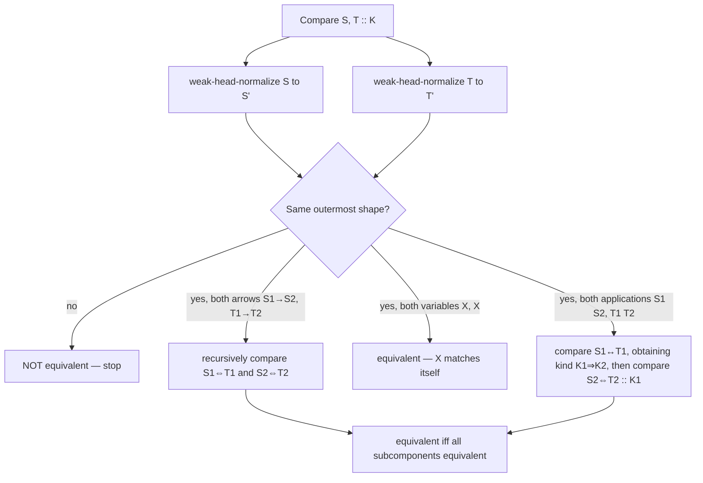

# Type Definitions and Singleton Kinds

[[book-guidelines|↩ Back to guidelines]]

## Why definitions can't just be sugar

Start with the naive position, because the chapter itself starts there and then dismantles it. Suppose you're building a type checker for a language with recursive and variant types, and a programmer writes

$$
\texttt{Nat} \overset{\text{def}}{=} \mu Y.\langle \texttt{zero}:\texttt{Unit}, \texttt{succ}:Y\rangle
$$

You could treat this as pure notation — a macro. Every time `Nat` appears in a type, the elaborator textually replaces it with the right-hand side before doing anything else. This is attractive because it means your *core* type theory never needs to know that definitions exist: soundness, decidability, everything you proved about the definition-free calculus transfers for free, because by the time the type checker sees anything, there are no definitions left. This is exactly how you'd implement `type` aliases in a toy language, and for a huge number of real cases it's exactly right.

It breaks in two ways, and the chapter's opening pages exist to make you feel both breaks concretely before it hands you any formalism.

**Break 1 — expansion isn't always desirable even when it's possible.** Once you allow recursive definitions that reference other definitions, naive substitution blows up the size of the type. A `List(List(Pair(Nat)))` can textually expand into something enormous, and if your error messages or your internal representation always show fully-expanded types, they become useless to a human and expensive to store. So even in the *easy* case — where substitution is mathematically valid — you might not want to perform it eagerly. You want definitions to be a first-class thing your algorithms reason about directly, short-circuiting the expansion when they can.

**Break 2 — expansion is sometimes not even possible.** This is the sharper break, and it's the one that motivates the whole chapter. Consider a module

```
module n = mod
             type t = Nat
             val x : t = 3
           end

module n' = n

module diag = λ(p : sig type t  val x : t end).
                mod type u = p.t × p.t
                    val y : u = {p.x, p.x}
                end

module nn = diag(n')
```

Nowhere in `n'` or `diag` or `nn` does the token `n.t` appear. Yet a correct type checker still has to know that `n'.t` is a synonym for `Nat` (because `n'` is defined to *be* `n`), and that `nn.u` is equal to `Nat × Nat` (because that's what `diag`'s body computes when instantiated at a module whose type component is `Nat`). The definition that matters here isn't attached to a variable name you can substitute for — it's attached to a *projection* out of a module value, and that projection can be reached indirectly, through aliasing (`n'`) and through functor application (`diag(n')`) that only pins down the concrete type once you know what was passed in. There is no single textual replacement step that eliminates "the definition of `n.t`" from the program, because the fact that `n.t` equals `Nat` is a derived, structural consequence of the whole configuration of module bindings — not a syntactic macro you can expand once and forget.

**What breaks without treating definitions as primitive:** you lose the ability to type-check perfectly ordinary ML/OCaml-style module code. Any language where `type t = ...` can appear inside a signature, get aliased, get passed through a functor, and still be expected to unify with its origin at the far end needs a type-equivalence judgment that *knows about definitions as data*, not just as a preprocessing pass. This is precisely the situation your Lean-style elaborator's `isDefEq` faces with `def`-introduced constants, `let`-bindings in local contexts, and reducible definitions unfolded lazily during unification — the same problem, wearing a module-systems costume.

The chapter's response is to build three successively more general calculi that treat definitions as intrinsic to the typing judgment rather than as sugar:

1. **$\lambda^{let}$** — definitions live directly in the typing context.
2. **$\lambda^{LM}$** — definitions live in module interfaces (translucent sums / manifest types).
3. **$\lambda^S$** — definitions are absorbed into the *kind* system itself, via singleton kinds.

And then it proves a translation (*phase-splitting*) showing $\lambda^{LM}$ reduces to $\lambda^S$ — that modules, despite looking like a genuinely new kind of entity, are secretly expressible using ordinary types and kinds once those kinds can talk about definitional equality.

All three systems are variants of $F^{\omega}_{\times\eta}$: higher-order polymorphic lambda calculus (types can be parameterized by types, i.e. type operators) extended with product types and full extensionality (eta) for both functions and pairs. Keep that base fixed in your head — everything below is "$F^\omega_{\times\eta}$ plus one new way of saying 'and this thing is *this* thing.'"

---

## 9.1 Definitions in the typing context — $\lambda^{let}$

### The idea, before the notation

In a call-by-value language with side effects, you already know why `let x = t1 in t2` can't be treated as `(λx:T1.t2) t1` blindly evaluated — evaluation order and effect timing matter. Pierce's TAPL calls this "closed-scope" sugar and it's usually fine for *terms* because beta-reduction happens at run time, once, in a controlled order.

Types don't have side effects, so you might expect `let X = T1 in T2` to reduce painlessly to `(λX::K1.T2) T1`. And it mostly does — until the `let` shows up *inside a term*, where the type abstraction that's supposed to stand in for it needs to be a genuine polymorphic abstraction, and polymorphic abstractions have to be well-typed *on their own*, independent of what they'll eventually be instantiated with. Concretely:

$$
\texttt{let } X = \texttt{Nat in } (\lambda x{:}X.\,x+1)(4)
$$

is a perfectly sensible program. But its proposed desugaring

$$
(\lambda X{::}*.\ (\lambda x{:}X.\,x+1)(4))[\texttt{Nat}]
$$

is *ill-typed*, because the inner subterm $\lambda X{::}*.\ (\lambda x{:}X.\,x{+}1)(4)$ must type-check for an *arbitrary* abstract $X$, and `x+1` requires `x` to have type `Nat`, not an arbitrary `X`. The instantiation happens too late to rescue the body. This is the same shape of problem you'll recognize from dependent-type systems: you cannot always route a definitional fact through a polymorphic parameter, because polymorphic abstraction bodies are checked generically, before instantiation, and generic checking doesn't get to see the definition.

**What breaks without primitive definitions:** ordinary, obviously-well-typed `let`-bound type synonyms inside terms become inexpressible as derived forms. You'd have to forbid this pattern entirely, which no real language does.

### The fix: put definitions in the context

$\lambda^{let}$ extends $F^\omega_{\times\eta}$ by letting a typing context entry record not just a type variable's *kind* but, optionally, its *definition*:

$$
\Gamma ::= \cdots \mid \Gamma, X{::}K{=}T
$$

and adds one new equivalence rule that makes a defined variable equal to what it stands for:

$$
\frac{X{::}K{=}T \in \Gamma \qquad \Gamma \vdash \diamond}{\Gamma \vdash X \equiv T :: K} \quad \text{(Q-Def)}
$$

Everything else — kinding, context validity — gets a parallel rule (`K-Def` looks up a defined variable's kind, exactly like `K-Var` does for an unadorned one; `CTX-Def` requires the definition itself to be well-kinded in the *preceding* context, which is what rules out circular definitions "for free").

The consequence that TAPL-style $F^\omega_{\times\eta}$ never has to face: **type equivalence is no longer purely structural.** It now depends on the context.

$$
X{::}*{=}\texttt{Int} \;\vdash\; \texttt{Int}\to X \equiv X \to \texttt{Int} :: *
$$

is provable — both sides reduce (via `Q-Def`) to $\texttt{Int} \to \texttt{Int}$ — but

$$
X{::}*{=}\texttt{Bool} \;\vdash\; \texttt{Int}\to X \equiv X\to\texttt{Int} :: *
\qquad\text{and}\qquad
X{::}* \;\vdash\; \texttt{Int}\to X \equiv X \to \texttt{Int} :: *
$$

are both *not* provable. Whether $\texttt{Int}\to X \equiv X \to \texttt{Int}$ isn't a fact about the two syntactic expressions in isolation — it's a fact about the two expressions *relative to a context*. In plain $F^\omega_{\times\eta}$ you could always decide equivalence by looking only at the two types themselves; here you can't.

Closed-scope `let` at the term level is recovered as a genuine typing rule rather than a derived form, threading the definition into the context for exactly the scope of the body:

$$
\frac{\Gamma \vdash T_1 :: K_1 \qquad \Gamma, X{::}K_1{=}T_1 \vdash t_2 : T_2 \qquad \Gamma \vdash T_2 :: *}{\Gamma \vdash \texttt{let } X{=}T_1 \texttt{ in } t_2 : T_2} \quad \text{(T-TLet)}
$$

The book leaves as an exercise (9.1.4) explaining why type soundness would fail if the side condition $\Gamma \vdash T_2 :: *$ were dropped — worth sitting with: without it, $T_2$ could mention $X$, and once you exit the `let`'s scope $X$ is gone, leaving a type that refers to a variable no longer in context. This is the module-systems version of a dangling pointer.

**Rust/Lean [[Dependent-Types#Grounding|grounding]].** A Rust type checker's internal representation of a type environment typically distinguishes exactly this: a `HashMap<TypeVar, TypeInfo>` where `TypeInfo` is either `Abstract(Kind)` or `Alias(Kind, Type)`. When you resolve a type variable during unification, you look it up and, if it's an alias, you get to unfold — but only if you *choose* to; the abstract case is the boundary you cannot cross no matter how hard you try. In Lean's kernel, the exact analogue is a `LocalContext` entry that can be a plain `LocalDecl.cdecl` (opaque, like $X{::}K$) or a `LocalDecl.ldecl` (a `let`-bound local, carrying both a type *and* a value — precisely $X{::}K{=}T$). `Q-Def` is what `isDefEq` does when it hits a free variable backed by a `let`: it's allowed to unfold it, the same way `Q-Def` licenses treating $X$ as $T$.

### Deciding equivalence without paying for full expansion

If definitions exist specifically to avoid writing out enormous types, then an equivalence-checking algorithm that always fully normalizes both sides (substituting every definition, everywhere) defeats the purpose — you'd blow up exactly the representation you were trying to keep small. The chapter's answer, imported wholesale from the equivalence-checking machinery of Chapter 6 (logical relations / weak head normalization), is to interleave reduction and comparison rather than normalize-then-compare.

**Delta-reduction.** This is the new primitive reduction step, alongside beta: rewriting a variable to its definition.

$$
\frac{X{::}K{=}T \in \Gamma}{\Gamma \vdash X \rightsquigarrow T}
$$

(Note the chapter's own footnote: some authors, e.g. Barendregt, use "delta-reduction" for a *different* thing — evaluating built-in primitives like `3+4 → 7`. In this chapter it always means "unfold a definition.")

**Weak head reduction and weak head normal form.** Reduce only the *outermost* redex — the head position — not underneath binders or inside already-irreducible structure. $\Gamma \vdash T_1 \Downarrow T_n$ means there's a finite chain $T_1 \rightsquigarrow T_2 \rightsquigarrow \cdots \rightsquigarrow T_n$ where $T_n$ has no more head redexes. This is deliberately weaker than full normalization: you stop as soon as you can see the type's outermost "shape" (is it an arrow? a product? an application of a still-unknown variable?), without descending into subcomponents you might not even need to inspect.

**Algorithmic type equivalence**, $\Gamma \vdash S \Leftrightarrow T :: K$: weak-head-normalize both sides, then compare structurally. If the two weak head normal forms have different shapes (one's an arrow, one's a product), stop immediately and report inequivalence — no need to recurse into subcomponents at all. If they have the same shape, recursively compare corresponding subcomponents (**structural equivalence**, $\Gamma \vdash T_1 \leftrightarrow T_2 \uparrow K$, which also reports back the shared kind).



This is exactly the "normalize-and-compare, but lazily and with short-circuiting" strategy — the same shape of algorithm as an interpreter's weak-head-normal-form reduction loop feeding into a structural equality check, which is precisely what `isDefEq` in Lean's elaborator does (it calls `whnf` repeatedly and compares heads before ever fully normalizing either side).

The chapter is explicit that the *correctness proof* for this algorithm is a direct transplant of Chapter 6's logical-relations technique — kind $*$ plays the role Chapter 6's base type $b$ played. The one real wrinkle: **substitutions used in the Fundamental Theorem now have to respect definitions.** If a substitution can map a *defined* variable $X$ to some unrelated type, the `Q-Def` case of the proof collapses. Definition 9.1.7 patches this by requiring, for related substitutions $\gamma, \delta$ agreeing on a context with a defined entry $X{::}K{=}T$, not just that $\gamma(X)$ and $\delta(X)$ be logically equivalent, but that $\gamma(X)$ and $\delta(T)$ be equivalent too (and symmetrically $\gamma(T)$ and $\delta(X)$) — i.e. the substitution has to be *consistent with the definition it's replacing*, not just internally coherent.

### The property F^ω never had: $X\,T_1 \equiv X\,T_2 \not\Rightarrow T_1 \equiv T_2$

This is the chapter's central "gotcha," and it's worth internalizing precisely because it's the kind of thing that silently breaks a naive unification algorithm. In ordinary $F^\omega_{\times\eta}$, if $X$ is a type operator variable, $X\,T_1 \equiv X\,T_2$ holds *iff* $T_1 \equiv T_2$ — applying the same (unknown, injective-as-far-as-you-know) function to two things only gives equal results if the things were equal. Once $X$ can be *defined*, this fails:

$$
X{::}(*\Rightarrow*){=}(\lambda Y{::}*.\ \texttt{Nat}) \;\vdash\; X\,\texttt{Nat} \equiv X\,\texttt{Bool}
$$

both sides reduce to `Nat`, regardless of the argument, because $X$'s definition simply ignores its argument. You might think you could special-case "operators whose definitions ignore their arguments," but Exercise 9.1.9 asks you to find $T_1, T_2, T_3$ pairwise inequivalent with $X\,T_1 \equiv X\,T_2$ but $X\,T_2 \not\equiv X\,T_3$ — i.e. the "ignoring" behavior can be argument-*dependent* in a way that defeats any simple syntactic special-casing.

**What breaks without noticing this:** a naive equivalence-checking optimization — "before expanding $X$'s definition, just check whether the arguments $T_1, T_2$ are already equivalent; if so, short-circuit to `true`" — is a sound speedup (if $T_1 \equiv T_2$ then certainly $X\,T_1 \equiv X\,T_2$), but the converse fails, so you cannot use *inequivalence* of arguments to conclude *inequivalence* of the applications. You must fall back to actually expanding $X$'s definition in that case. This is a direct warning shot for anyone implementing a unification algorithm: **unifying $X\,T_1$ against $X\,T_2$ by unifying $T_1$ against $T_2$ is unsound once $X$ is a definable/reducible head**, not a rigid constructor. This is precisely the distinction Miller pattern unification cares about — a metavariable or rigid head you can decompose versus a definitionally-transparent head you must unfold before decomposing. The footnote in the book makes the connection explicit: "the presence of definitions has consequences for unification as well... the most general substitution making $X\,T_1$ and $X\,T_2$ equal might not make $T_1$ and $T_2$ unify."

---

## 9.2 Definitions in module interfaces — $\lambda^{LM}$

### Why context-level definitions aren't enough

$\lambda^{let}$ handles "a variable is defined to be a type." But the motivating `n.t` example from the introduction needs more: a definition attached not to a bare variable, but to a *projection out of a module*, where the module itself might be a variable, or an application, or a pairing. You need a language of modules and interfaces where *interfaces* — not just contexts — can carry definitional information.

$\lambda^{LM}$ (Section 9.2) is Christopher Stone's minimalist formalization of exactly the ML-module ideas surveyed informally in Chapter 8 — translucent sums (Harper–Lillibridge) and manifest types (Leroy) — cut down to the smallest calculus that still exhibits the interesting phenomena. Modules here are **second-class**: they cannot be passed to ordinary term-level functions, and interfaces are not themselves types. This is a real restriction relative to full ML modules, but it's enough to carry the whole story.

### The primitives, built from the ground up

Rather than modules-with-arbitrary-named-components (as in real ML), $\lambda^{LM}$ builds everything from two primitives:

- $\lfloor t \rfloor$ — a module containing a single unnamed **term** $t$.
- $\lfloor T{::}K \rfloor$ — a module containing a single unnamed **type** $T$ of kind $K$.

with a projection operator `!` to extract the contents. Larger modules are built by module-level pairing $\langle M_1, M_2\rangle$ (with projections `.1`/`.2`) and functors $\lambda m{:}I.M$.

Interfaces mirror this: $\lfloor T\rfloor$ classifies a term-module containing something of type $T$; $\lfloor K\rfloor$ is the **opaque** interface for a type-module — "contains *some* type of kind $K$, no promises about which"; $\lfloor K{=}T\rfloor$ is the **transparent** interface — "contains a type of kind $K$, and specifically it's (equivalent to) $T$." This opaque/transparent split *is* the module-level analogue of $\lambda^{let}$'s $X{::}K$ vs. $X{::}K{=}T$ split — and note it directly encodes the Chapter 8 concepts of opaque vs. transparent signatures, now given precise formal rules.

Dependency shows up because a module pair's second component's interface may need to refer to the *value* of the first component — the module system's version of a dependent pair. $\Sigma m{:}I_1.I_2$ classifies pairs where the second component's interface $I_2$ may mention $m$, the first component, by name. Functor interfaces $\Pi m{:}I_1.I_2$ work the same way for functions. When $m$ doesn't actually occur free in $I_2$, these degrade to the non-dependent $I_1 \times I_2$ and $I_1 \to I_2$.

Re-encoding the introduction's `n` module:

$$
\langle \lfloor \texttt{Nat}{::}*\rfloor,\ \lfloor 3 \rfloor \rangle \;:\; \Sigma m{:}\lfloor *{=}\texttt{Nat}\rfloor.\ \lfloor \texttt{Nat}\rfloor
$$

— "a pair whose first component is (transparently) the type $\texttt{Nat}$, and whose second component is a natural number." And `diag`:

$$
\lambda m{:}(\Sigma m'{:}\lfloor *\rfloor.\lfloor {!}m'\rfloor).\ \langle \lfloor {!}m.1 \times {!}m.1 {::}*\rfloor,\ \lfloor \{{!}m.2,{!}m.2\}\rfloor \rangle
$$

exactly capturing "takes an opaque type + a value of that type, returns a pair type + a pair value." Its most-precise interface is dependent:

$$
\Pi m{:}(\Sigma m'{:}\lfloor *\rfloor.\lfloor {!}m'\rfloor).\ (\Sigma m''{:}\lfloor *{=}{!}m.1\times{!}m.1\rfloor. \lfloor {!}m''\rfloor)
$$

— note $m$ is bound in the *result*, exactly capturing that the returned type depends on which type was passed in.

### Subinterfaces, and the rule that makes hiding lawful

The subinterface relation $\Gamma \vdash I <: I'$ is where the real content is, and one rule is the linchpin of the entire information-hiding story:

$$
\frac{\Gamma \vdash T :: K}{\Gamma \vdash \lfloor K{=}T\rfloor <: \lfloor K\rfloor} \quad \text{(SI-Forget)}
$$

A module known to contain a specific type $T$ can always be used somewhere that only asks for "some type of kind $K$" — you're allowed to *forget* a fact you know. This single rule is what lets a sealed module hide its representation from clients while still, internally, remembering what the representation actually was — the formal core of data abstraction. Everything else about signature matching (Chapter 8's central topic) reduces to this asymmetric forgetting plus ordinary subtyping-style structural rules.

### The Self rules — proving a module is what it obviously is

Here's a subtlety that catches people who haven't thought carefully about determinacy. Suppose $W$ is a **determinate** module (syntactically guaranteed to have predictable type components — a variable, a primitive module, a pairing/projection of determinates; *not* an arbitrary computation, which could have effects or be ill-defined) and $W$ satisfies interface $\lfloor K\rfloor$. Intuitively $W$ should *also* satisfy the transparent interface $\lfloor K{=}{!}W\rfloor$ — "$W$ contains a type of kind $K$, specifically the type you get by projecting it out of $W$ itself." This is true, but not automatic from the other rules — you need a dedicated rule to license it:

$$
\frac{\Gamma \vdash W : \lfloor K\rfloor}{\Gamma \vdash W : \lfloor K{=}{!}W\rfloor} \quad \text{(M-Self)}
$$

plus `M-Self1`/`M-Self2` letting you apply this reasoning to *sub*modules of a larger determinate pair. Why does this matter practically? Because without it, ordinary dependent-application typing rules that you'd expect to be *admissible* (derivable, not needing to be primitive) actually fail. For instance, applying a functor $M_1 : \Pi m{:}I_1.I_2$ to an argument $W_2 : I_1$ should give a result typed at $[m \mapsto W_2]I_2$ — but $M$-`Apply`, the primitive rule, deliberately requires *non-dependent* interfaces, precisely because substituting an arbitrary module expression (not just a determinate one) into a type could produce an ill-formed type. The rule `M-Self` is exactly what lets you bridge this gap when the argument happens to be determinate: you first show $W_2 : \lfloor *{=}{!}W_2\rfloor$ via `M-Self`, weaken $M_1$'s interface to accept that specific type via subsumption and `SI-Forget`, and only then apply. The book works this derivation out explicitly (§9.2, deriving `M-ApplyW` as admissible) — it's a genuinely useful worked example of how "self-typing" threads dependent information through a system that otherwise refuses to substitute non-determinate things into types.

**What breaks without the Self rules:** dependent function application and dependent projection stop being usable in the ordinary way for the very common case where the argument or the pair really is just a concrete, known module — exactly the case you'd expect to be easiest.

### The avoidance problem returns, and "natural interface" as the fix for detecting definitions algorithmically

Chapter 8 already surfaced [[ML-Style-Module-Systems#The avoidance problem|the avoidance problem]] — the fact that `let module m = M in M'`-style local bindings don't always have a *most-specific* interface that avoids mentioning `m`. $\lambda^{LM}$ inherits this exactly (Exercise 9.2.3 asks you to exhibit a module with no most-precise interface even up to equivalence), which means type checking has to proceed without the crutch of "just compute the principal interface and compare."

The chapter's practical fix for *deciding equivalence* despite this is the notion of a **natural interface** — the most precise interface computable *without* invoking `M-Self`. Why exclude `M-Self` specifically? Because `M-Self` can always manufacture a self-referential "definition" — $m_1 : \lfloor{*}\rfloor \vdash m_1 : \lfloor{*}{=}{!}m_1\rfloor$ — which is trivially true and useless: saying "$m_1$'s type equals itself" tells an equivalence-checking algorithm nothing it didn't already know. A type projection $!W$ is said to *have a definition* $T$ exactly when $W$'s natural interface (computed without Self) is a transparent interface $\lfloor K{=}T\rfloor$. This mirrors $\lambda^{let}$'s weak head reduction directly: instead of looking up `X::K=T ∈ Γ`, you compute $W$'s natural interface and check whether it's transparent — the module-system analogue of "is this variable's context entry a `let`-binding."

---

## 9.3 Singleton kinds — $\lambda^S$

### Folding the choice into the kind itself

Step back and look at the pattern across both systems so far. $\lambda^{let}$: at every context entry, choose between "$X$ has kind $K$" and "$X$ has kind $K$ and equals $T$." $\lambda^{LM}$: at every interface, choose between "opaque, kind $K$" and "transparent, kind $K$, equals $T$." Both are instances of one deeper idea: *wherever a classifier (kind) is specified, allow the classifier itself to encode a specific value.*

$\lambda^S$ makes this literal by adding a new *kind* former:

$$
S(T) \quad \text{"the singleton kind of } T \text{"}
$$

which classifies **exactly** the types of kind $*$ that are provably equivalent to $T$. Not "types that look like $T$" — types *definitionally equal* to $T$, and up to that equivalence there is exactly one inhabitant. Instead of writing $Y{::}* $ or $Y{::}*{=}\texttt{Nat}$, you now just write $Y{::}*$ or $Y{::}S(\texttt{Nat})$ — the definition has migrated entirely into the kind annotation, and the context syntax itself needs no new form.

This is a genuinely elegant unification of two things that looked separate. Kinds classify types the way types classify terms; $\lambda^S$ says: kinds can be made as precise as "equal to this one specific type," the same way a dependent type system can make a *type* as precise as "equal to this one specific term" (which is exactly what a Lean `Eq`-based singleton, or a refinement type `{x : T // x = v}`, does one level down). If you've internalized Curry–Howard-style level-shifting, singleton kinds are the "one level up" analogue of that idea, made a first-class kind former instead of an encoded proposition.

### Dependent kinds appear because kinds can now mention types

Once kinds can refer to specific types, it becomes natural — almost forced — for kinds classifying compound types (pairs of types, type operators) to be *dependent*:

$$
\Sigma X{::}K_1.K_2 \quad\text{(kind of pairs of types, second component's kind may depend on the first)}
$$
$$
\Pi X{::}K_1.K_2 \quad\text{(kind of type operators, result kind may depend on the argument)}
$$

with non-dependent abbreviations $K_1 \times K_2$ and $K_1 \Rightarrow K_2$ when the dependency is vacuous. So a pair of types like $\{\texttt{Nat},\texttt{Nat}\}$ (a genuine *pair of types*, kind-wise — not to be confused with a *type of pairs* $T_1 \times T_2$) can carry any of:

- $* \times *$ — "some pair of two proper types," no information about what they are;
- $S(\texttt{Nat}) \times S(\texttt{Nat})$ — "both components are exactly $\texttt{Nat}$";
- $\Sigma X{::}*.\,S(X)$ — "some type $X$, paired with a *second* component that's the *same* type $X$" — this is genuinely more expressive than either extreme, because it constrains the relationship between the two components without pinning down either one absolutely.

That third example is worth pausing on: it's a kind expressing an *equational constraint between two things whose absolute value is unknown* — a dependent, relative specification, not just a definition. This is the module-systems / kind-systems shadow of what a metavariable-unification system does when it records "these two metavariables must denote the same term" without yet knowing what either one is.

### The Self rules, again, now at the level of kinds

The pattern from $\lambda^{LM}$'s `M-Self`/`M-Self1`/`M-Self2` recurs verbatim, dualized to kinds: `K-Self1`, `K-Self2`, `K-AbsSelf`. If $Y$ is known to have kind $* \times *$ (a pair of types), it *should* also be provable that $Y$ has kind $S(\pi_1 Y) \times S(\pi_2 Y)$ — "$Y$'s components equal, respectively, $Y$'s own projections" — trivially true, but not free without a dedicated rule. Similarly `K-AbsSelf` lets a type operator $Z :: * \Rightarrow *$ be shown to have kind $\Pi X{::}*.\,S(Z\,X)$ — "applied to any $X$, $Z$ returns exactly what $Z$ returns" (again trivial, but load-bearing). The book's summary line: *the three Self rules collectively ensure that types have every kind that their eta-expansions do.*

### The payoff nobody expects: beta-reduction becomes admissible, not primitive

Here is the single most surprising fact in the chapter, first noticed by Aspinall (1994), and it's worth working through *why* it's true rather than just citing it. $\lambda^S$'s equivalence rules, as given, do **not** include beta-reduction for type-operator application or the projection-reduction rules for pairs. And yet all three are *derivable*:

$$
\Gamma \vdash T_1 :: K_1 \qquad \Gamma \vdash T_2 :: K_2 \;\Longrightarrow\; \Gamma \vdash \pi_1\{T_1,T_2\} \equiv T_1 :: K_1 \quad\text{(Q-Beta-Fst, admissible)}
$$
$$
\Gamma, X{::}K_1 \vdash T_{12} :: K_{12} \quad \Gamma \vdash T_2 :: K_{12} \;\Longrightarrow\; \Gamma \vdash (\lambda X{::}K_{11}.T_{12})T_2 \equiv [X{\mapsto}T_2]T_{12} :: [X{\mapsto}T_2]K_{12} \quad\text{(Q-AppAbs, admissible)}
$$

The intuition: singleton-introduction (`K-SIntro`: any $T{::}*$ also has kind $S(T)$) plus the Self rules plus subsumption already give you a way to *prove* two things equivalent by showing they inhabit a common singleton kind — and it turns out $\pi_1\{T_1,T_2\}$ and $T_1$ can always be shown to share a singleton kind by this route, without ever invoking a dedicated reduction rule. Extensionality (eta) plus singletons is expressive enough to *simulate* beta. This is genuinely elegant, and it's a strong hint about how much semantic content is packed into extensionality once you also have precise-enough classifiers to exploit it.

### The real payoff: equivalence becomes classifier-relative, and stays decidable anyway

Here's the fact that makes $\lambda^S$ more than a cute reformulation — it's the fact the chapter has been building toward the entire time. Consider the type-level identity $\lambda X{::}*.X$ and the type-level constant function $\lambda X{::}*.\texttt{Nat}$. At the "obvious" kind $* \Rightarrow *$, these are *not* equivalent:

$$
\not\vdash (\lambda X{::}*.X) \equiv (\lambda X{::}*.\texttt{Nat}) :: (*\Rightarrow*)
$$

correctly — applied to $\texttt{Bool}$, one gives $\texttt{Bool}$ and the other gives $\texttt{Nat}$; they're genuinely different functions. But both functions, by subsumption, *also* inhabit the more precise kind $S(\texttt{Nat}) \Rightarrow *$ — "a function that will only ever be applied to something equal to $\texttt{Nat}$." Restricted to that domain, the two functions *do* agree (both return $\texttt{Nat}$ when the input is forced to be $\texttt{Nat}$), so by extensionality:

$$
\vdash (\lambda X{::}*.X) \equiv (\lambda X{::}*.\texttt{Nat}) :: (S(\texttt{Nat})\Rightarrow*)
$$

**Type equivalence is no longer just a property of two types — it's a property of two types *at a kind*, and the answer genuinely depends on which kind you ask at.** This propagates: given $Y :: (S(\texttt{Nat})\Rightarrow*)\Rightarrow*$, you can derive $Y(\lambda X{::}*.X) \equiv Y(\lambda X{::}*.\texttt{Nat}) :: *$ — two beta/eta-normal terms, syntactically incomparable, provably equal, where "$Y$" has no expandable definition at all. This is not a case that reduces to unfolding some hidden `let` — it's equivalence created *entirely* by the interaction of subsumption and extensionality with a precise classifier.

**What breaks if you don't take classifier-relativity seriously:** an equivalence checker (or a unifier) that decides "are $S$ and $T$ equal" by looking only at $S$ and $T$, ignoring the kind at which they're being compared, will simply be *wrong* on cases like this — not slow, not incomplete on some edge case, but unsound: it will report two provably-equal types as unequal (or vice versa depending on which direction you get careless in). Any implementation of definitional equality checking that carries a "current expected type/kind" through the comparison (bidirectional-style) is implicitly relying on exactly this fact — the kind you're checking *at* is not incidental context, it's a parameter of the judgment.

### Labeled singletons: generalizing beyond kind $*$

The built-in $S(T)$ only makes sense when $T :: *$. But $\lambda^{let}$ let you write $Y{::}(*\Rightarrow*){=}(\lambda X{::}*.X\to X)$ — a *defined type operator*, not a defined proper type. To recover this expressiveness, the chapter defines a **derived form** $S(T{::}K)$ — "the kind of things at kind $K$ equivalent to $T$" — by induction on the *size* of the classifying kind $K$ (Figure 9-9):

$$
S(T{::}*) \overset{\text{def}}{=} S(T)
\qquad
S(T{::}S(T')) \overset{\text{def}}{=} S(T)
$$
$$
S(T{::}\Pi X{::}K_1.K_2) \overset{\text{def}}{=} \Pi X{::}K_1.\,S(T\,X{::}K_2) \quad (X \notin FV(T))
$$
$$
S(T{::}\Sigma X{::}K_1.K_2) \overset{\text{def}}{=} S(\pi_1 T{::}K_1) \times S(\pi_2 T{::}[X{\mapsto}\pi_1 T]K_2)
$$

The recursive case for $\Pi$ is exactly the intuition you'd want: "$T'$ is equivalent to $T$ at kind $\Pi X{::}K_1.K_2$" unpacks to "for every argument $X$ of kind $K_1$, $T'X$ is equivalent to $T\,X$ at kind $K_2$" — extensional function equality made into a kind, recursively. This termination argument (well-founded on kind size, and the accompanying lemma that substitution never changes a kind's size) is a nice small pattern worth remembering any time you're defining something by structural recursion over a syntax that itself supports substitution — you need to check substitution doesn't secretly increase your measure.

Crucially, the *classifier* is still load-bearing even in the derived form. $\lambda X{::}*.X$ should have kind $S((\lambda X{::}*.\texttt{Nat})::S(\texttt{Nat})\Rightarrow*)$ but *not* kind $S((\lambda X{::}*.\texttt{Nat})::*\Rightarrow*)$ — same story as before, now packaged as one derived singleton rather than spelled out via subsumption each time.

### Why this equivalence algorithm needed a fundamentally different correctness proof

Every other equivalence algorithm in this chapter (and in Chapter 6) got its correctness proof from the same template: define a logical relation, show it's symmetric and transitive "by inspection" of its recursive clauses, then show it coincides with the algorithm. $\lambda^S$'s algorithm (Figure 9-10) breaks this template, and understanding *why* is one of the chapter's Key Questions made concrete.

The structural-equivalence judgment $\Gamma \vdash_\triangleright S \leftrightarrow T \uparrow K$ computes the **natural kind** of $S$ as a side effect of comparing $S$ against $T$ — but by symmetry it could just as well have computed the natural kind of $T$ instead. The two choices are provably *equivalent* kinds, but "equivalent" is not "identical," and which kind you get back gets threaded into the *context* for later recursive comparisons (deciding how deep to weak-head-reduce, what to compare arguments against). There is no a priori guarantee that starting from $S$'s natural kind versus $T$'s natural kind gives you the same answer, or even both terminate — the algorithm's own symmetry is not visible by inspection of its rules. And if the *algorithm* isn't obviously symmetric, a logical relation built to mirror it (the way Chapter 6's was) inherits the same doubt.

Stone and Harper's actual resolution (cited but not re-derived in this chapter) is a variant Kripke logical-relations technique adapted specifically to survive this asymmetry — a strictly more delicate proof than Chapter 6's. The takeaway for an implementer, independent of the proof machinery: **once your definitional-equality algorithm's intermediate steps depend on an arbitrarily-chosen "which side do I compute a derived fact from" decision, you can no longer assume symmetry/transitivity of the algorithm for free** — you need a real argument, not just structural induction on the rules. This is a genuine hazard for anyone implementing `isDefEq`-style bidirectional equality checking with singleton-like precision (e.g. if your elaborator's unifier ever infers "the natural type of the LHS" as a side effect of comparison and feeds it back into how it treats the RHS).

---

## Phase-splitting: modules are secretly singleton-kinded types and terms

### The claim

$\lambda^{LM}$ appeared to be a strictly richer universe than $\lambda^{let}$ — modules and interfaces are new syntactic sorts, sitting alongside (and, via the `!` projection and `K-MProj`, *depending on*) terms, types, and kinds. Section 9.3's second half makes a striking claim: this apparent richness is illusory. Every module can be mechanically split into a **static part** (a type, possibly of higher kind, capturing everything about the module's *type* components) and a **dynamic part** (a term, possibly polymorphic, capturing everything about its *value* components) — and this split is exactly what the **phase distinction** from Chapter 8 promises is possible: *types in modules depend only on other types*, never on values.

<svg viewBox="0 0 760 340" xmlns="http://www.w3.org/2000/svg" font-family="Helvetica, Arial, sans-serif">
  <style>
    text { fill: #1a1a1a; }
    .lbl { font-size: 13px; }
    .small { font-size: 11px; fill: #444444; }
  </style>
  <rect x="0" y="0" width="760" height="340" fill="#fbfbf9" stroke="none"/>

  <!-- lambda LM box -->
  <rect x="30" y="30" width="300" height="260" rx="10" fill="#eef3fb" stroke="#3b6ea5" stroke-width="2"/>
  <text x="180" y="55" text-anchor="middle" class="lbl" font-weight="bold">λ^LM (modules)</text>

  <rect x="55" y="80" width="250" height="55" rx="6" fill="#ffffff" stroke="#3b6ea5" stroke-width="1.5"/>
  <text x="180" y="102" text-anchor="middle" class="lbl">module M</text>
  <text x="180" y="120" text-anchor="middle" class="small">contains types + terms</text>

  <rect x="55" y="150" width="250" height="55" rx="6" fill="#ffffff" stroke="#3b6ea5" stroke-width="1.5"/>
  <text x="180" y="172" text-anchor="middle" class="lbl">interface I</text>
  <text x="180" y="190" text-anchor="middle" class="small">opaque ⌊K⌋ / transparent ⌊K=T⌋</text>

  <rect x="55" y="220" width="250" height="55" rx="6" fill="#ffffff" stroke="#3b6ea5" stroke-width="1.5"/>
  <text x="180" y="242" text-anchor="middle" class="lbl">projection !W</text>
  <text x="180" y="260" text-anchor="middle" class="small">type extracted from module</text>

  <!-- arrow -->
  <path d="M 335 160 L 420 160" stroke="#555555" stroke-width="2" fill="none" marker-end="url(#arrow)"/>
  <text x="377" y="145" text-anchor="middle" class="small" font-style="italic">phase-split |·|</text>
  <defs>
    <marker id="arrow" markerWidth="10" markerHeight="10" refX="8" refY="3" orient="auto">
      <path d="M0,0 L8,3 L0,6 z" fill="#555555"/>
    </marker>
  </defs>

  <!-- lambda S box -->
  <rect x="430" y="30" width="300" height="260" rx="10" fill="#f6efe8" stroke="#a5713b" stroke-width="2"/>
  <text x="580" y="55" text-anchor="middle" class="lbl" font-weight="bold">λ^S (types + kinds only)</text>

  <rect x="455" y="80" width="250" height="55" rx="6" fill="#ffffff" stroke="#a5713b" stroke-width="1.5"/>
  <text x="580" y="98" text-anchor="middle" class="lbl">|M|_s : static part</text>
  <text x="580" y="116" text-anchor="middle" class="small">a type, possibly higher-kinded</text>

  <rect x="455" y="150" width="250" height="55" rx="6" fill="#ffffff" stroke="#a5713b" stroke-width="1.5"/>
  <text x="580" y="168" text-anchor="middle" class="lbl">|M|_d : dynamic part</text>
  <text x="580" y="186" text-anchor="middle" class="small">a term, possibly polymorphic</text>

  <rect x="455" y="220" width="250" height="55" rx="6" fill="#ffffff" stroke="#a5713b" stroke-width="1.5"/>
  <text x="580" y="238" text-anchor="middle" class="lbl">|⌊K=T⌋|_s = S(|T| :: K)</text>
  <text x="580" y="256" text-anchor="middle" class="small">definition ⇒ singleton kind</text>

  <text x="380" y="315" text-anchor="middle" class="small">Phase-Splitting Theorem (9.3.13): the translation preserves well-formedness, typing, and equivalence</text>
</svg>

### How the split actually works

The translation $|\cdot|$ (Figure 9-11) is defined compositionally over every syntactic form:

- A module variable $m$ splits into a fresh type variable $X_m$ (its static part) and a fresh term variable $x_m$ (its dynamic part).
- A primitive term-module $\lfloor t\rfloor$: its static part is an arbitrary placeholder type $S_0$ of some fixed kind $K_0$ (there's genuinely no type content here — the placeholder is needed only so every module uniformly has *some* static part), and its dynamic part is just $t$.
- A primitive type-module $\lfloor T{::}K\rfloor$: symmetric — static part $T$ itself, dynamic part an arbitrary placeholder term $t_0$.
- A functor $\lambda m{:}I.M$: its dynamic part becomes a term that takes the argument's static part *and then* its dynamic part in sequence — $\lambda X_m{:}|I|_s.\,\lambda x_m{:}|I|_d(X_m).\,|M|_d$ — because a functor's *value*-level behavior can depend on both the types and the terms in its argument.
- A functor application $M_1\,M_2$'s dynamic part becomes a **polymorphic instantiation followed by ordinary application**: $(|M_1|_d\,[|M_2|_s])\,|M_2|_d$ — you first tell the (polymorphic) function what static type it's operating over, then hand it the corresponding value.
- Generative sealing $M :> I$ has **no direct equivalent** in $\lambda^S$ — $\lambda^S$ has no primitive generativity mechanism. But since sealing has no run-time effect (it's purely a static abstraction device), the translation simply erases the seal after using it, in $\lambda^{LM}$, to check that abstraction was respected. Implementations following this approach (the book cites FLINT and TILT, real Standard ML compilers) type-check in $\lambda^{LM}$ first and only then perform phase-splitting with sealing erased.
- Most tellingly for this article's throughline: **the transparent interface's static part becomes a singleton kind.**
$$
|\lfloor K{=}T\rfloor|_s = S(|T| :: K)
$$
  This is the whole chapter's arc landing in one equation — an equational fact about a module ("this component is exactly $T$") becomes, after phase-splitting, a purely type-and-kind-level fact expressed with a singleton kind. Modules never needed to be a fundamentally new kind of entity; they needed only ordinary types and kinds *rich enough to talk about definitional equality*, which is precisely what singleton kinds provide.

Worked concretely, `diag`'s static part becomes the type operator $\lambda X{::}*.\,X\times X$ (it takes a type, returns a pair type) and its dynamic part becomes the polymorphic term $\lambda X{::}*.\,\lambda x{:}X.\,\{x,x\}$ (it takes a type *and* a value of that type, returns a pair value) — this is exactly the informal "erase all the module ceremony and you're left with an ordinary polymorphic function" intuition, now made a theorem rather than an analogy.

### The Phase-Splitting Theorem

**Theorem 9.3.13** establishes that the translation is a faithful, meaning-preserving embedding: well-formed $\lambda^{LM}$ contexts translate to well-formed $\lambda^S$ contexts; well-kinded $\lambda^{LM}$ types translate to well-kinded $\lambda^S$ types at the *same* kind; $\lambda^{LM}$ type equivalence translates to $\lambda^S$ type equivalence; well-typed $\lambda^{LM}$ terms translate to well-typed $\lambda^S$ terms; and — the most delicate clauses — well-formed interfaces and subinterface/interface-equivalence judgments translate correctly for *both* the static kind and the dynamic type (parameterized appropriately by a fresh variable standing for "whatever the static part turns out to be").

**[[Dependent-Types#What breaks without this|What breaks without this]] theorem:** without a formal correctness proof, "modules compile away to ordinary polymorphic code" is folklore, not a guarantee — and a folklore compilation strategy for something as load-bearing as a language's entire module system is a liability. This theorem is exactly what licenses real compilers (the book cites FLINT for Standard ML, and TILT, which needed an extra twist adding explicit coercions when functor interfaces are made contravariant) to implement ML modules by translating them down to a core language with singleton kinds instead of building a separate, module-aware compilation pipeline.

---

## Where this leads

Within the book, this chapter is a hinge, not an endpoint. Chapter 8 gave you the *design* vocabulary for module systems (translucent signatures, sealing, the phase distinction, the avoidance problem) at an informal level; this chapter is where those concepts get *formal* typing rules, a decidable equivalence algorithm, and — via phase-splitting — a proof that the whole apparatus reduces to something no richer than "types and kinds, if kinds can express definitional equality." Chapter 10 ([[ML-Type-Inference|ML type inference]]) builds an entirely different, constraint-based machinery for *inferring* types, largely orthogonal to this chapter's concerns about *checking* equivalence in the presence of definitions — but both chapters share the deep theme that naive substitution-based reasoning about types breaks down once you take real language features (modules, let-polymorphism with effects) seriously, and both respond by making the previously-implicit mechanism (definitions; constraint solving) into an explicit object of study.

More broadly within the ATAPL volume: Chapter 6 ([[Logical-Relations-and-Equivalence-Checking|Logical Relations and Equivalence Checking]]) is the direct technical ancestor of everything here — weak head normalization, the normalize-and-compare strategy, and the entire proof template (define a logical relation, show it implies the algorithm, show the algorithm is correct) all get reused and then, in $\lambda^S$'s case, deliberately broken and repaired with a more delicate Kripke argument. If you found this chapter's algorithmic-equivalence sections legible, that's largely Chapter 6 having done the pedagogical groundwork.

## Synthesis: why this chapter is load-bearing for the elaborator project

This chapter is about as directly on-target for a Lean-style elaborator as ATAPL gets, and it's worth being explicit about the mapping rather than leaving it implicit in the Lean asides above:

- **$\lambda^{let}$'s context entries $X{::}K{=}T$ are exactly Lean's `let`-bound local declarations**, and `Q-Def`/delta-reduction is exactly what `isDefEq` does when unfolding a local `let` or a `def`-introduced constant during unification. The weak-head-reduce-then-compare-structurally algorithm of Figure 9-5 is essentially a hand-written specification of `whnf` interleaved with structural comparison — the actual control flow inside `isDefEq`.
- **The failure of $X\,T_1 \equiv X\,T_2 \Rightarrow T_1 \equiv T_2$ once $X$ is definable** is a precise, formal statement of why a unifier cannot blindly decompose an application headed by a possibly-reducible variable — this is the boundary between "rigid head, safe to project/decompose" and "flexible or transparent head, must consider unfolding" that pattern unification (and Lean's own unifier) has to track. Anyone implementing a metavariable-unification pass needs to classify heads this way before deciding whether decomposition is sound.
- **Classifier-relative equivalence in $\lambda^S$** — where $(\lambda X.X) \equiv (\lambda X.\texttt{Nat})$ holds at kind $S(\texttt{Nat})\Rightarrow*$ but not at $*\Rightarrow*$ — is a sharp illustration of why bidirectional type checking (checking *against* an expected type/kind, not just inferring and comparing afterward) isn't merely a convenient implementation strategy; in a system with singleton-like precision, it can be the difference between a sound and an unsound equality check. This is a strong argument, worth carrying into the compiler/verifier project, for threading expected-type information through equality/subtyping checks rather than computing types in isolation and comparing after the fact.
- **The asymmetric-natural-kind hazard in $\lambda^S$'s algorithm** — where the algorithm's own symmetry isn't visible from its rules — is a genuinely transferable implementation warning: any bidirectional or "infer as you go" equality/unification procedure that lets one side's inferred information feed into how the other side is processed needs an actual symmetry/transitivity argument, not an assumed one.
- **Phase-splitting's core equation, $|\lfloor K{=}T\rfloor|_s = S(|T|::K)$**, is a clean worked example of a broader move worth remembering for the compiler/verifier project: a feature that looks like it needs a whole new syntactic sort (modules) can sometimes be eliminated by finding the right *more expressive classifier* (singleton kinds) for the sorts you already have. Before adding a new AST node to a type checker, it's worth asking whether a richer kind/type annotation on existing nodes would do the same job with a correctness proof already available off the shelf.

Together, the three systems in this chapter are close to a minimal, complete case study in "what does it take to make definitional equality a first-class, decidably-checkable part of a type system's core judgment" — which is exactly the question at the center of building an `isDefEq`-grade elaborator core.
