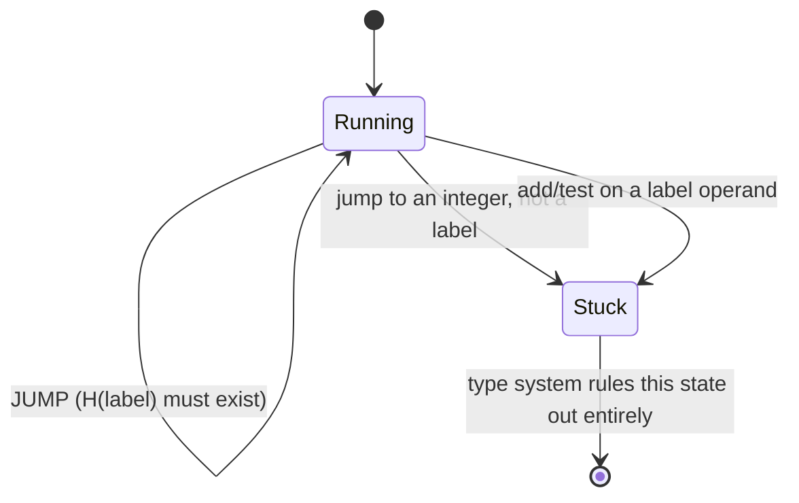
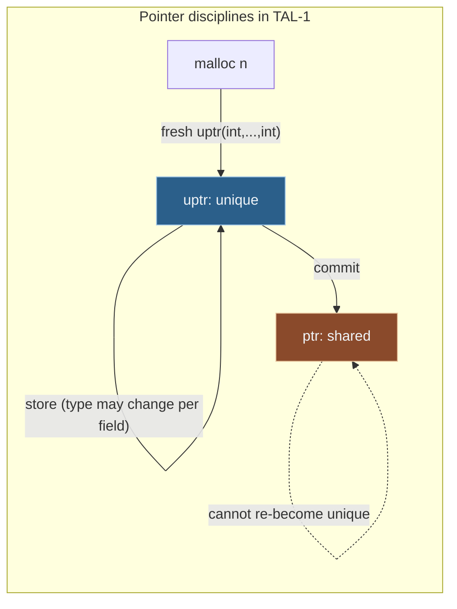

[[book-guidelines|↩ Back to guidelines]]

# Typed Assembly Language

## Why would you ever type-check *machine code*?

Start from the problem PCC (proof-carrying code) is trying to solve: you download a piece of code from somewhere you don't trust, and you're about to execute it on your machine. Before you run it, you want a cheap, mechanical way to know it won't do something "bad" — read memory it doesn't own, jump into the middle of someone else's function, corrupt the stack. Necula and Lee's insight was that the producer of the code, not the consumer, should do the expensive work of proving safety; the consumer just checks the proof, which can be made fast and (crucially) small enough to trust.

One extremely productive way to build such proofs is **type-preserving compilation**: a programmer writes in a high-level language (say ML), the source type-checks, and then a compiler pushes that type-correctness down through a chain of intermediate representations, all the way to the actual bytes the CPU executes — *transforming the type derivation alongside the code at every step*, rather than reconstructing it from scratch. If you can pull this off, the "proof" that the assembly is safe literally is a type derivation, and checking it is just running a type-checker.

But this demands something that doesn't obviously exist: **a type system for assembly language**. Assembly has no structured control flow, no static scoping, no notion of a "well-formed expression" — it's just registers, memory, and jumps. Two existing typed low-level languages, the JVM's bytecode (JVML) and Microsoft's CLI, sidestep the problem by baking in high-level abstractions (objects, methods, exceptions) directly into the abstract machine. That works, but it makes the machine "CISC-like": every source language has to be shoehorned into *this* machine's notion of a method call, and if your source language doesn't fit — the JVM famously has no tail calls, which is fatal for compiling functional languages efficiently — you're stuck.

Morrisett's chapter instead asks: can we build a "RISC-style" typed assembly language, whose type system is built from a small number of orthogonal, general-purpose type constructors (not "methods" and "objects"), expressive enough to reconstruct high-level features on demand rather than having them wired in? That's TAL. The chapter builds it in two layers — **TAL-0**, which only guarantees *control-flow safety*, and **TAL-1**, which adds *memory safety* — and then sketches how the same handful of constructors (mostly: polymorphism, existentials, and two flavors of pointer) scale up to objects, closures, and arrays.

If you're building a verifier that checks low-level or compiled code against contracts, this chapter is close to a blueprint: it is a from-scratch worked example of designing typing *judgments* for a machine with mutable state, proving *progress* directly as "the machine doesn't get stuck," and handling the aliasing problems that any Rust-like verifier has to solve eventually.

---

## Part 1 — TAL-0: making "jump to garbage" a type error

### What breaks without control-flow safety

Consider an abstract machine that just executes instructions and jumps around a heap of labeled instruction blocks. Nothing stops a `jump` instruction's operand from evaluating to an arbitrary integer instead of a valid code address. If that integer happens to be interpreted as an address, the machine starts executing whatever bytes live there — attacker-controlled data, say. This is the precise mechanism behind classic control-hijacking exploits. **Control-flow safety** is the property that a program can only ever transfer control to one of a well-defined, finite set of labeled entry points, never to an arbitrary address. It's foundational: any later dynamic check (e.g. "is this file handle open before I read from it?") is worthless if an attacker can jump *past* the check straight into the guarded routine.

### The abstract machine

TAL-0's syntax (the book's Figure 4-1) is deliberately tiny:

$$
\begin{aligned}
r &::= r_1 \mid \dots \mid r_k &&\text{(registers)}\\
v &::= n \mid \ell \mid r &&\text{(operands: integer literal, label, or register)}\\
\iota &::= r_d \mathrel{:=} v \mid r_d \mathrel{:=} r_s + v \mid \texttt{if } r \texttt{ jump } v &&\text{(instructions)}\\
I &::= \texttt{jump } v \mid \iota; I &&\text{(instruction sequences)}
\end{aligned}
$$

An instruction sequence is a list of instructions terminated by an unconditional jump — every basic block ends in a jump, never just falls off the end. A machine state is a triple $M = (H, R, I)$: a heap $H$ mapping labels to instruction sequences, a register file $R$ mapping registers to values, and the currently-executing instruction sequence $I$.

The single most important design decision in this whole chapter, and one worth internalizing, is this: **labels are kept abstract, distinct from integers.** The alternative — coercing labels to machine addresses via some function `intof`, so you can, e.g., compute jump targets arithmetically — is completely standard at the hardware level. But the book rejects it, for three reasons that generalize well beyond TAL:

1. It leaks information across an abstraction boundary you're trying to preserve (relevant if you care about e.g. address-space-layout secrecy).
2. It breaks alpha-equivalence of labels — if labels are literally integers, you can no longer freely rename them or relocate code, because two states that "should" be the same (up to renaming bound labels) are observably different.
3. It would force you to add a subtyping relation between labels and integers just to justify the coercion, complicating the type system for no real gain.

The payoff of keeping labels abstract is beautiful: safety reduces to a **progress** property. If you try to jump to an integer, or add an integer to a label, or branch on a label, the abstract machine simply has no applicable rewriting rule — it gets *stuck*. So "control-flow safety holds" becomes exactly "a well-typed machine state never gets stuck," which is a completely standard thing to prove by induction once you have a type system.

The operational semantics is four small-step rules (`JUMP`, `MOV`, `ADD`, `IF-EQ`/`IF-NEQ`), all completely conventional except that `R̂`, the lifting of the register file to operands, treats labels as opaque values that flow through unchanged — never coerced to numbers.



### The type system

Four type constructors carry the whole load (Figure 4-3):

$$
\tau ::= \mathrm{int} \mid \mathrm{code}(\Gamma) \mid \alpha \mid \forall\alpha.\tau
$$

- $\mathrm{int}$ classifies word-sized integers.
- $\mathrm{code}(\Gamma)$ classifies a label that, when jumped to, expects the register file to match the **register file type** $\Gamma$ — a total map from registers to types, e.g. $\{r_1 : \mathrm{int}, r_2 : \mathrm{code}(\Gamma')\}$. Read $\mathrm{code}(\Gamma)$ as "this label is a continuation that takes a $\Gamma$-shaped record of registers as its argument." This is the single most important conceptual move in the chapter: **a label's type is a precondition on the machine state at the moment you jump to it**, not a "function type" in the usual sense — there's no return type, because jumping never returns; the continuation you jump to is what "returns."
- $\alpha$ and $\forall\alpha.\tau$ add ML-style universal polymorphism over types.

There's also a **heap type** $\Psi$, mapping labels to their types — the global, fixed "signature" the whole program is checked against.

Five judgment forms build up compositionally (Figure 4-4):

| Judgment | Reads as |
|---|---|
| $\Psi \vdash v : \tau$ | value $v$ (an operand with no registers — an integer or label) has type $\tau$ |
| $\Psi; \Gamma \vdash v : \tau$ | operand $v$ (possibly a register) has type $\tau$, under register-file assumptions $\Gamma$ |
| $\Psi \vdash \iota : \Gamma_1 \to \Gamma_2$ | instruction $\iota$ transforms a register file of type $\Gamma_1$ into one of type $\Gamma_2$ |
| $\Psi \vdash I : \mathrm{code}(\Gamma)$ | instruction sequence $I$ is safe to run whenever the register file matches $\Gamma$ |
| $\vdash (H, R, I)$ | the whole machine state is well-formed |

The instruction judgment's "$\Gamma_1 \to \Gamma_2$" shape is exactly Hoare-triple thinking wearing a different hat: $\Gamma_1$ is the precondition on the registers, $\Gamma_2$ is the postcondition. `S-MOV` updates the destination register's type in the postcondition; `S-ADD` requires both operands to be `int`; `S-IF` is the rule that forces both branches to agree — the fall-through continuation and the jump target must produce *the same* $\Gamma_2$, because after the branch you don't statically know which path was taken. Instruction sequences compose (`S-SEQ`) by literally composing these Hoare-triple-shaped types, and a whole sequence gets typed `code(Γ)` when its first instruction expects Γ. The heap-typing rule `S-HEAP` is a mutual-recursion ("letrec") rule: every label gets to assume its own type and every other label's type while its body is checked, which is exactly how you'd type a set of mutually recursive functions in ML.

### Why you need polymorphism (not just "a plain type system")

Here's the "what breaks without it" moment for TAL-0's cleverest piece. Consider:

```
foo: r1 := bar;
     jump r1

bar: ...
```

What type can `bar` have? If `bar`'s type is some fixed `code(Γ)` with `Γ(r1) = code(Γ)`, you need `Γ(r1) = code(Γ)` to hold of *itself* — a genuinely circular equation with no solution in a simple type system (no subtyping, no polymorphism, no recursive types). **Jumping through a register** is completely ordinary in real assembly (it's how you implement indirect calls, returns, vtables), and a naive typed assembly language can't type it at all.

The book's fix: give `bar` a polymorphic type $\forall\alpha.\mathrm{code}\{r_1 : \alpha, \dots\}$. At the jump site, instantiate $\alpha$ with $\mathrm{code}(\Gamma)$ itself (rule `S-INST`), which is legal precisely because $\alpha$ was held abstract — the circularity dissolves because you're not solving an equation, you're substituting after the fact. The same trick handles **control-flow join points**: two different call sites jumping into the same label with registers of different types (one an `int`, one a `code` pointer) can both be accommodated if the target's type abstracts over that register with a type variable, instantiated differently at each call site.

The book names two alternative fixes and explains why it prefers polymorphism:

- A **$\mathrm{Top}$ type** with subtyping — "forget" a register's type by widening it to $\mathrm{Top}$, at the cost of the register becoming unusable until reassigned. This is what the original TAL paper actually used.
- **Recursive types** — solve $\Gamma(r_1) = \mathrm{code}(\Gamma)$ literally via $\mu$.

Polymorphism wins in this exposition because it buys you something none of the alternatives do for free: **callee-saves registers**, encoded as a *parametricity* argument. If a procedure's entry type is

$$
\forall \alpha.\{r_5 : \alpha,\; r_4 : \forall\beta.\mathrm{code}\{r_5:\alpha, r_4:\beta, \dots\}, \dots\}
$$

then, because $\alpha$ is held abstract throughout the procedure body and the return-address's type requires $r_5$ to *still* have type $\alpha$ on return, there is no way to manufacture a value of the abstract type $\alpha$ out of thin air — the procedure is statically forced to hand back exactly the value it was given (it may shuffle it into another register and use $r_5$ for scratch work along the way, but it must restore $\alpha$ before jumping to $r_4$). This is a direct instance of Wadler's "free theorems," transplanted to assembly: parametric polymorphism at the type level enforces a runtime invariant (preservation of a register's value) *without a single runtime check*.

> **Rust framing.** This is precisely the shape of Rust's borrow checker forcing a function to either consume or return-unchanged a value it can't inspect. If you write `fn identity<T>(x: T) -> T`, the type signature alone (no implementation needed) proves the function must return exactly the `x` it was given — there's no other well-typed implementation. TAL-0's callee-saves trick *is* that theorem, applied to a register instead of a function argument. If you're building a Rust-style verifier, this is worth internalizing early: parametricity is a cheap, static substitute for a whole class of "did you corrupt this?" runtime assertions.

```rust
// The "free theorem" in miniature. There is exactly one well-typed body:
fn callee_saves<T>(preserved: T, do_work: impl FnOnce() -> ()) -> T {
    do_work();
    preserved   // the type signature *forces* this; T is opaque, nothing else typechecks
}
```

### Soundness, proved as progress

The soundness proof (Theorem 4.2.10) is the template every subsequent extension reuses. It's stated as a single **progress** theorem — "if $\vdash M$ then there is some $M'$ with $M \to M'$ and $\vdash M'$" — rather than the more familiar preservation-then-progress split, because here progress *is* the safety property (a stuck state is exactly a control-flow violation) and preservation is folded into the same induction as a side effect. The supporting lemmas are exactly what you'd expect from a STLC-style soundness argument, just relabeled for the assembly setting:

- **Type Substitution** (substituting a type for a type variable preserves every judgment) — the analogue of the usual substitution lemma for polymorphic calculi.
- **Register Substitution** — looking up a well-typed register in a well-typed register file gives back a value of the expected type (the analogue of value substitution in a lambda-calculus soundness proof).
- **Canonical Values / Canonical Operands** — the classic "if it has type $\tau$, it must have this shape" lemmas: an `int`-typed value is literally a numeral; a `code(Γ)`-typed value is literally a label bound in the heap to a $\Gamma$-typed instruction sequence.

The proof itself is a case split on the head instruction of $I$, each case invoking Canonical Operands to know the operand's runtime shape matches its static type, then exhibiting the one machine-semantics rule that applies and re-establishing well-formedness via the corresponding typing rule inversion. It's short precisely because TAL-0 is so minimal — this is the "hello world" of low-level soundness proofs, and it's the shape every later extension (TAL-1, DTAL, TALx86) has to redo, just with more cases.

### Proof representation — a design constraint you can't dodge

The book flags something easy to miss: it's *not known whether type inference for TAL-0 is decidable* — the system as given permits something like polymorphic recursion (a label's type may need to be self-referentially instantiated), which is undecidable for the lambda calculus in general. The practical resolution, used throughout the rest of the chapter, is to require every label to carry an **explicit type annotation** and to make instantiation explicit in the syntax (`v[τ]`), yielding a fully **syntax-directed** checker — at most one rule ever applies to a given term, and the checker never has to guess a missing piece. This is the assembly-level echo of a familiar tension: full inference vs. bidirectional (checking-mode-driven) type systems. TAL sides entirely with checking mode, because at the machine-code level there's no human paying an annotation-burden cost — annotations are compiler output, consumed by a checker, never hand-written.

This is also where **proof-carrying code** proper enters: you can go further and ship, alongside the binary, an *explicit derivation tree* of well-formedness — proof and code shipped together, checked against each other. Necula's Touchstone compiler pioneered this; Appel and Felty's **foundational PCC** pushes it to the extreme of also shipping a soundness proof for the type system itself and a proof that the abstract machine faithfully models the concrete one, so the only things the code consumer must trust are the concrete-machine semantics and a general-purpose proof checker.

---

## Part 2 — TAL-1: adding memory, and the aliasing problem

### What breaks without a story for aliasing

TAL-0 has registers and code, but no allocated data — no tuples, records, or objects. Once you add mutable heap storage, you immediately face a problem that doesn't exist for registers: **aliasing**. Consider:

```
{r1:ptr(code(...)), r2:ptr(code(...))}
1. r3 := 0;
2. Mem[r1] := r3;
3. r4 := Mem[r2];
4. jump r4
```

If you naively track "the type of the memory location pointed to by `r1`" and update it locally whenever you write through `r1`, you'd correctly reject a program that overwrites through `r1` and then reads back through `r1` and jumps. But this program overwrites through `r1` and reads back through `r2` — and if `r1` and `r2` happen to be aliases for the *same* location (which the type system, in general, cannot statically know), the store through `r1` silently corrupts what `r2` "thinks" it's pointing at, and the jump through `r4` is now a jump to the integer `0`. Whether this program should type-check literally depends on run-time aliasing information the type system doesn't have. There's no complete decision procedure for "do these two pointers alias" — full-strength *alias types* (Smith, Walker, Morrisett 2000) exist and solve this precisely, but the book calls them "technically daunting," and most real compilers don't need that much power.

### The fix: two disjoint classes of pointer

TAL-1's answer is a controlled compromise — split every pointer into exactly one of two disciplines (Figure 4-6):

- **Shared pointers**, $\mathrm{ptr}(\sigma)$: freely aliasable — copy them wherever you like — but the *type of the contents must stay invariant* for the pointer's whole lifetime. This is exactly the discipline of an ML `ref` cell or, in Rust terms, a `&T` (or an `Rc<RefCell<T>>` whose `T` never structurally changes type): many readers, but the shape never mutates underneath them.
- **Unique pointers**, $\mathrm{uptr}(\sigma)$: the contents' type *may* change on every write — you can write an `int` where a `code` pointer used to be — but the pointer itself can never be copied, aliased, or duplicated. In Rust terms this is exactly `Box<T>`/move semantics or `&mut T`: at most one live reference, full freedom to change what it points at underneath (including, effectively, "changing its type" by overwriting the data with a differently-typed initializer during a multi-step construction).

The operational semantics enforces uniqueness at the level of the abstract machine itself, not just the type system: rule `MOV-1` has a side condition $\hat{R}(v) \ne \mathrm{uptr}(h)$ — a move instruction *cannot even execute* if the source holds a unique pointer. Storing a unique pointer into a tuple is likewise blocked at the semantics level (there's no rewriting rule for it — the machine gets stuck, by design, if you try). This is a really instructive move: rather than relying purely on static checking to forbid aliasing of unique pointers, the operational semantics itself is defined so that copying one is simply not an available transition — belt and suspenders.

$$
\sigma ::= \epsilon \mid \tau \mid \sigma_1, \sigma_2 \mid \rho
$$

**Allocated types** $\sigma$ describe the shape of a heap object as a (associative, $\epsilon$-unit) sequence of operand types — think "the layout of a tuple/struct" — as opposed to operand types $\tau$, which classify a single word-sized value (a register or a stack slot). $\rho$ abstracts over an allocated type of unknown size (a "rest of the tuple" or "rest of the stack" variable), the allocated-type analogue of $\alpha$.

The typing rules make the shared/unique asymmetry completely explicit and it's worth reading them as a matched pair:

$$
\frac{\Psi;\Gamma \vdash r_s : \tau_n \quad \tau_n \ne \mathrm{uptr}(\sigma') \quad \Psi;\Gamma \vdash r_d : \mathrm{ptr}(\tau_1,\dots,\tau_n,\sigma)}{\Psi \vdash \mathrm{Mem}[r_d+n] \mathrel{:=} r_s : \Gamma \to \Gamma} \; (\text{S-STS})
$$

$$
\frac{\Psi;\Gamma \vdash r_s : \tau \quad \tau \ne \mathrm{uptr}(\sigma') \quad \Psi;\Gamma \vdash r_d : \mathrm{uptr}(\tau_1,\dots,\tau_n,\sigma)}{\Psi \vdash \mathrm{Mem}[r_d+n] \mathrel{:=} r_s : \Gamma \to \Gamma[r_d : \mathrm{uptr}(\tau_1,\dots,\tau,\sigma)]} \; (\text{S-STU})
$$

Store-through-shared (`S-STS`) leaves $\Gamma$ *entirely unchanged* — because a shared write can't change the pointer's advertised type, there's nothing to update. Store-through-unique (`S-STU`) *rewrites* $\Gamma$, updating the $n$-th slot of the pointer's type to whatever was just written — the type system tracks the pointer's evolving shape precisely because nobody else can be looking at it. Neither rule allows writing a unique pointer *into* memory (both require $\tau \ne \mathrm{uptr}(\sigma')$) — that would create a second reference to a "unique" value, defeating the whole scheme.

A new **`commit`** instruction performs the one-way coercion $\mathrm{uptr}(\sigma) \to \mathrm{ptr}(\sigma)$ — unique becomes shared — with *zero runtime effect* (it exists purely to mark, in the type derivation, the moment a pointer's discipline switches). This gives you exactly the allocation pattern every low-level language needs: `malloc` a fresh chunk (unique, so you can freely initialize its fields with values of whatever type, one at a time, in any order, since nothing else can observe the half-initialized state), fill in the fields, then `commit` it to make it a normal, freely-shareable, type-stable object. This solves the classic "how do I type-check `{x = 3, y = 4}` at the assembly level, where the tuple has to be built up one store at a time" problem cleanly, without needing a separate "possibly-uninitialized" type for every field.

The stack itself is modeled as nothing more than a unique pointer held in a distinguished register `sp`, with `salloc n` / `sfree n` growing/shrinking it by prepending/removing `int`-typed words (Figure 4-8's `S-SALLOC`/`S-SFREE`). This is an elegant unification — you don't need a separate "stack" abstraction in the machine at all, because a stack *is* exactly "a unique pointer to a tuple that you only ever grow or shrink from one end," which the uniqueness discipline already supports for free. (Stacks in this presentation grow "up" rather than the conventional "down," purely so the indexing matches ordinary tuple indexing — a cosmetic choice the book flags explicitly.)

### What breaks without unique pointers — the honest cost accounting

The gap the book is candid about: **stack overflow is not caught by this type system.** `salloc n`'s soundness would ideally require checking that growing the stack by $n$ words won't exceed `MAXSTACK`, but if the stack's type ends in an abstract $\rho$ (as it does for essentially every procedure, since the "rest of the stack" is unknown to a callee), there is no way to statically know the stack's current length. So Theorem-level soundness for TAL-1 is qualified: *a well-typed machine cannot get stuck, except by stack overflow* — a real, load-bearing caveat, not a rounding error. This is a good concrete example of the general principle that a type system's soundness theorem is only as strong as its stated hypotheses; "safe" in TAL-1 explicitly excludes resource-exhaustion failures, which have to be caught by a runtime trap instead.



### Compiling a real language to TAL-1

The chapter's worked example (§4.5) is the strongest evidence that the design actually holds together: an iterative `prod` and a recursive `fact`, compiled to fully type-annotated TAL-1 under a concrete calling convention (arguments on the stack, return address in $r_4$, result in $r_1$, callee pops its own arguments). The entry type for `prod` is worth staring at:

$$
\forall a,b,c,s.\ \mathrm{code}\{r_1:a, r_2:b, r_3:c,\; sp:\mathrm{uptr}(\mathrm{int},\mathrm{int},s),\; r_4:\forall d,e,f.\mathrm{code}\{r_1:\mathrm{int}, r_2:d, r_3:e, r_4:f,\; sp:\mathrm{uptr}(s)\}\}
$$

Read this slowly, because it's the chapter's thesis compressed into one type. $r_1, r_2, r_3$ are abstracted with fresh variables $a, b, c$ — the caller's scratch registers can hold *anything*; `prod` doesn't care and won't leak information about them. The stack has type $\mathrm{uptr}(\mathrm{int},\mathrm{int},s)$: exactly two integer arguments up front, then an abstract "rest," $s$ — `prod` promises not to touch, and in particular not to leak the type of, whatever the caller had below its own arguments. And the return address $r_4$'s type says: after `prod` returns, $r_1$ will hold an `int` (the result), $r_2/r_3/r_4$ can be anything ($d,e,f$ — genuinely scratch, prod doesn't promise to preserve them), and the stack will be back to $\mathrm{uptr}(s)$ — the two argument words popped, everything below untouched. **Every convention decision — stack-passed vs. register-passed arguments, caller-pop vs. callee-pop, which registers are scratch vs. preserved, whether tail calls are supported — is encoded purely as a *type*, not baked into the abstract machine's instruction set.** This is precisely the property that JVML and CLI lack: to change *their* calling convention you have to change the virtual machine. To change TAL's, you just write a different type for the label. The `fact` example additionally shows the pattern for a genuine recursive call: `salloc` space for the saved return address and argument, save them, load a *new* return address (`cont`) that expects the post-call state, `jump fact`, and on return from the recursive call, tail-jump to `prod` — the continuation `cont` is itself just another well-typed label, no different in kind from `prod` or `fact` themselves.

> **What breaks without polymorphism here specifically:** without the ability to abstract $s$ (the "rest of caller's stack"), every procedure would need to know, at compile time, the exact shape of every possible caller's remaining stack — which is obviously unworkable; you'd have effectively monomorphized every call site by hand. Allocated-type polymorphism over $\rho$/$s$ is what makes separate compilation of procedures against an abstract calling convention possible at all.

---

## Part 3 — Scaling up: closures, objects, arrays

### Existentials, for hiding representation

TAL-1 alone gives you tuples but not data abstraction — you can't yet express "a value of some type I'm not telling you, but here's an interface for using it," which is exactly what closures and objects need (a closure hides its captured environment's type; an object hides its instance-variable layout behind a common interface).

$$
\tau ::= \dots \mid \exists\alpha.\tau \mid \exists\rho.\tau
$$

$$
\frac{\Psi;\Gamma \vdash v : \tau[\tau'/\alpha]}{\Psi;\Gamma \vdash v : \exists\alpha.\tau} \;(\text{S-PACK}) \qquad\qquad \frac{\Psi;\Gamma \vdash v : \exists\alpha.\tau \quad \alpha \notin \mathrm{FTV}(\Gamma)}{\Psi;\Gamma \vdash v : \tau}\;(\text{S-UNPACK})
$$

`S-PACK` says: if you have a value whose type happens to be some specific instantiation $\tau[\tau'/\alpha]$, you're always allowed to *forget* which instantiation and claim the more general existential type instead. `S-UNPACK` is the elimination form — you can open an existential and use the hidden value, but the freshly-revealed type variable $\alpha$ must not escape into $\Gamma$ (the ambient context), otherwise you'd be smuggling knowledge about the hidden type back out. This is *exactly* the encoding Pierce and Turner used for objects: a `Point` interface (`getX`/`getY`) becomes

$$
\exists\alpha.\mathrm{ptr}(\mathrm{ptr}(\alpha\to\mathrm{int}, \alpha \to \mathrm{int}), \alpha)
$$

— a pointer to a pair of (method-table, instance-frame), where the instance-frame's type $\alpha$ is existentially hidden. Two classes with genuinely different instance-variable layouts (`C1` with two fields, `C2` with three) can both be given this *same* type, because $\alpha$ hides the difference; the object consumer can call the methods (which do know $\alpha$, internally) but can never inspect the fields directly. Closures fall out as a special case: a closure is exactly an object with one method (`apply`) whose instance frame is the captured environment.

> **What breaks without existentials:** without any way to hide a type, `C1`-objects and `C2`-objects would need genuinely different static types, and any code that wants to work uniformly over "anything implementing `Point`" — the entire point of an interface — couldn't be typed at all. This is the assembly-level ancestor of trait objects.

> **Rust framing.** This existential encoding is a byte-for-byte description of how `dyn Trait` is represented: a fat pointer to (vtable, data), where the data's concrete type is erased. `Box<dyn Point>` in Rust *is* $\exists\alpha.\mathrm{ptr}(\mathrm{vtable}_\alpha, \alpha)$, down to the two-word layout. Reading TAL's existential encoding is close to reading a specification for how `rustc` lowers trait objects.

```rust
trait Point { fn get_x(&self) -> i32; fn get_y(&self) -> i32; }

struct C1 { x: i32, y: i32 }
impl Point for C1 { fn get_x(&self) -> i32 { self.x } fn get_y(&self) -> i32 { self.y } }

struct C2 { x: i32, y: i32, n: i32 }
impl Point for C2 {
    fn get_x(&self) -> i32 { self.x } // real code would bump self.n; omitted for &self
    fn get_y(&self) -> i32 { self.y }
}

// existentially hides whether the pointee is a C1 or a C2 — TAL's ∃α.ptr(vtable(α), α)
let p: Box<dyn Point> = Box::new(C2 { x: 0, y: 0, n: 0 });
```

The book also notes a real limitation here: this encoding doesn't easily support runtime **downcasting** — testing "is this object actually a `C2`?" — which Java-style languages need because of covariant arrays and the lack of full parametric polymorphism. That needs heavier machinery (representation types), which the chapter waves at but doesn't build.

### Arrays: the CISC escape hatch, and DTAL's dependent-type alternative

TAL-1's `Mem[]`/`:=Mem[]` only support *constant* offsets — you can't type-check `arr[i]` for a register-valued `i`, because the type system has no way to express "some position within this tuple, to be determined at runtime." Two ways forward:

1. **CISC-style primitives.** Add `newarray`, `ldarr`, `starr` as trusted, primitive, runtime-bounds-checked operations, with the array's size implicitly tracked (e.g. stored as element 0 of the backing tuple). Simple, but you pay for a runtime bounds check on *every* access, forever, even when the compiler could in principle prove it's unnecessary — and the primitive operations are opaque to low-level optimizations like instruction scheduling.
2. **DTAL (Xi and Harper).** Bring a sliver of [[Dependent-Types|dependent types]] into the type system: compile-time index expressions $e ::= n \mid e_1+e_2 \mid \dots \mid i$, singleton types like $\mathrm{int}(36)$ (the type of *the* integer 36, nothing else), and indexed array types like $\mathrm{arr}(\tau, i{*}2)$. A typing context becomes a pair $(\Gamma; P)$ — a register-file type *plus a predicate* $P$ that accumulates facts learned from runtime tests. A bounds-check `if r3 < 0 jump L` is typed so that its fall-through branch's context gets the conjunct $i_2 \ge 0$ added to $P$; a second test narrows further; by the time you reach the actual `ldarr`, the accumulated predicate $(i_2 \ge 0) \wedge (i_2 < i_1)$ statically discharges the bounds check the array access needs, so the *load itself* requires no runtime check at all — the ordinary runtime comparisons the programmer (or compiler) already wrote *are* the proof.

DTAL restricts $P$ to linear inequalities specifically to keep type-checking decidable — the same "decidability vs. expressiveness" tension that shows up everywhere dependent types meet real implementations (cf. Dependent ML in Chapter 2 of this book). The chapter is explicit that you could relax this to arbitrary predicates at the cost of falling back to full proof-carrying code (attach an explicit proof that $P$ implies the precondition, rather than relying on decidable inference) — which is exactly where Chapter 5 picks up.

> **This is directly load-bearing for a Rust verifier.** DTAL's $(\Gamma; P)$ typing context, refined by conditional tests along each control-flow path, is a textbook symbolic-execution / verification-condition-generation pattern — precisely the mechanism a Hoare-triple-checking Rust verifier needs for eliminating bounds checks it can prove are redundant. The `int(i)` singleton-type idiom is also worth remembering by name: it's the cheapest possible way to smuggle a runtime value into the type system, and shows up again the moment you want to track array lengths, indices, or capacities statically.

### Real-world loose ends

The chapter closes with a survey of what a production system (TALx86) needed beyond this core: read/write access qualifiers on tuple components with the expected covariant/contravariant subtyping; subtyping on pointer *tails* ($\mathrm{ptr}(\sigma,\sigma') \le \mathrm{ptr}(\sigma)$, i.e. "forget you know about the extra trailing fields"); sub-word-sized values and alignment; and — the two genuinely hard remaining problems — **nested-procedure stack pointers** (needs static/STAL-style stack pointers, Crary's intersection-type TALT, or region integration à la Cyclone) and **shared-object initialization**, especially of *circular* structures (needed for recursive closures), which none of initialization flags, the "fuse" calculus, or plain unique pointers handle — only full alias types do. There's also a candid note that `free` is trivially sound for unique pointers (nobody else can be holding a reference) but *unsound* for shared pointers without a reachability analysis — i.e., you've essentially bought a garbage collector's worth of obligations the moment you introduced sharing at all, and TALx86 formalizes the invariants a conservative collector needs as literal type-system constraints.

---

## Where this leads

TAL-0's control-flow-safety machinery and TAL-1's memory-safety machinery are the two halves of "type-safe low-level code" this book keeps returning to. Chapter 5 (Proof-Carrying Code) picks up exactly where §4.6's arrays-with-predicates left off: instead of a fixed, decidable predicate language baked into the type system, PCC generalizes to arbitrary verification conditions discharged by an attached proof, checked by a small trusted checker — the same "shift the burden to the producer, keep the consumer's checker tiny" idea that motivated TAL in the first place, taken to its logical limit. The chapter's own closing lines flag exactly this: TAL's typing is "closer to program verification than type checking" once you push past simple cases, which is precisely the seam Chapter 5 exploits. The region-based systems of Chapter 3 (Tofte–Talpin, Cyclone) reappear here too, offered as one of several ways to fix TAL's nested-procedure/stack-pointer gap — memory regions and unique/shared pointers are two different static disciplines for the same underlying problem (who owns this memory, and when can it be reclaimed).

### Synthesis with the standing project

This chapter is close to maximally load-bearing for a Rust-style compiler/verifier, for three specific reasons worth carrying forward explicitly:

1. **The $\Gamma_1 \to \Gamma_2$ instruction-typing judgment is a Hoare triple**, and TAL-0's soundness proof — stated purely as progress, proved by induction on the instruction sequence with Canonical-Operand-style inversion lemmas — is a template you can reuse almost verbatim for any low-level IR your own verifier checks.
2. **Unique vs. shared pointers is Rust's ownership model, minus lifetimes, discovered independently from first principles**, and the book's honest accounting of what it costs (no circular initialization, no downward stack pointers without extra machinery, `free` unsound for shared pointers without reachability analysis) is a preview of exactly the tradeoffs a Rust-shaped verifier has to confront when it tries to go beyond what `rustc`'s borrow checker already gives you for free.
3. **DTAL's $(\Gamma; P)$ context**, refined by conditional tests to statically discharge array-bounds checks, is a small, concrete instance of [[Proof-Carrying-Code#Verification-condition generation|verification-condition generation]] — worth treating as the minimal working example to build toward before tackling Chapter 5's full PCC machinery.

The existential-type object/closure encoding is a secondary but genuinely useful thread for the elaborator project too: it's a clean, small case study in "hide a type behind an interface, and prove nothing type-incorrect can leak through the interface" — the same shape of problem an elaborator faces when it needs to keep an inferred metavariable's solution opaque to code that shouldn't be allowed to depend on its concrete value.
