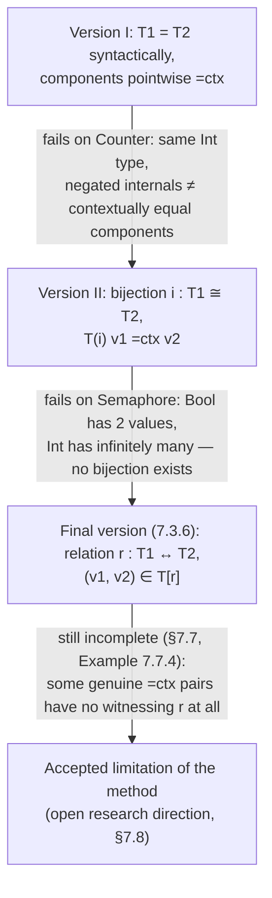
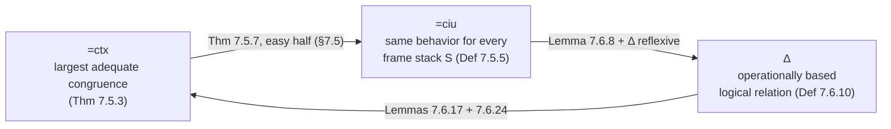

# Typed Operational Reasoning

[[book-guidelines|↩ Back to guidelines]]

## Why does a type system need a theory of "sameness"?

Suppose you implement a counter as an existential package — a hidden representation type plus operations that manipulate it:

```
type Counter = {∃X, {mk:X, inc:X→X, get:X→Int}}

val counter1 = {*Int, {mk = 0, inc = λx:Int.x+1, get = λx:Int.x  }} as Counter
val counter2 = {*Int, {mk = 0, inc = λx:Int.x-1, get = λx:Int.0-x}} as Counter
```

Both instantiate the hidden type `X` with `Int`, but `counter2` counts *downward* internally and negates on read. Any client that only uses `mk`, `inc`, and `get` — which is the only thing an existential type lets a client do — can never tell them apart. `counter1` and `counter2` behave identically under every possible use. This is precisely the promise of information hiding: the representation is invisible, so two representations that agree on observable behavior *are*, for all practical purposes, the same value.

That intuition is easy to state and painful to prove. The obvious definition of "agree under every possible use" is: for every well-typed program context `t[-]` you could drop either counter into, `t[counter1]` and `t[counter2]` produce the same observable result. That's a universal quantifier over *all* program contexts — an infinite, unbounded search space including programs nobody has written yet. You cannot enumerate them. This chapter (Andrew Pitts, in Pierce's ATAPL, Ch. 7, pp. 245–292) is entirely about closing that gap: replacing "quantify over all contexts" with something you can actually check — first a syntactic reformulation (**contextual equivalence**, made precise via **ciu-equivalence**), then a genuinely usable proof method (an **operationally based logical relation**) — and then, honestly, showing where that proof method still falls short.

If you are building a verifier or a Hoare-logic checker, this is not idle philosophy: "does replacing this subterm with an equivalent one preserve all observable behavior" is *exactly* the soundness obligation of any optimization pass, refinement step, or representation-independence argument your checker will ever need to discharge. The machinery in this chapter is the textbook answer to "how do you prove that, for a language with general recursion, without appealing to denotational semantics."

> **What breaks without a defined notion of equivalence at all:** without some formal criterion, "these two representations are interchangeable" is just an intuition a compiler writer has to trust by inspection. There is no way to state — let alone check — that an optimization, a refactor, or a change of internal representation is safe.

---

## Three attempts at an extensionality principle

The chapter builds its central tool (the logical relation of §7.6) by first showing, informally, why three progressively weaker "obvious" proof principles for existential-type equivalence each fail, motivating the next.

### Version I: syntactic identity of the hidden type

The most naive idea: if two packages instantiate the existential with the *same* type `T1 = T2`, and their contents are contextually equivalent under that type, the packages are equivalent.

$$
\textbf{Principle (Version I):}\quad \text{if } T_1 = T_2 \text{ and } v_1 =_{ctx} v_2 : [X \mapsto T_2]T, \text{ then } \{*T_1,v_1\}\text{ as }E =_{ctx} \{*T_2,v_2\}\text{ as }E
$$

This is useless for `Counter`: both `counter1` and `counter2` instantiate `X` with `Int`, but `{mk=0, inc=λx.x+1, get=λx.x}` and `{mk=0, inc=λx.x-1, get=λx.0-x}` are *not* pointwise contextually equivalent record values of the same record type — plugging `0` into `get(inc(·))` gives `1` versus `-1`. Version I demands equivalence of the raw components, which is strictly stronger than equivalence of the packages, and so it can't even prove the motivating example.

### Version II: equivalence up to a bijection

The fix: don't require `T1 = T2`; allow any type-level bijection $i : T_1 \cong T_2$ (a term $i : T_1 \to T_2$ with a two-sided inverse, up to $=_{ctx}$) and require the components to agree *after* transporting one side across $i$. Every type $T$ has an "action" on bijections, $T(i) : [X\mapsto T_1]T \cong [X\mapsto T_2]T$, built by structural recursion — covariant occurrences of $X$ get pushed forward by $i$, contravariant occurrences (e.g. function arguments) get pulled back by $i^{-1}$:

$$
\textbf{Principle (Version II):}\quad \text{if } i : T_1 \cong T_2 \text{ and } T(i)\,v_1 =_{ctx} v_2, \text{ then the packages are } =_{ctx}
$$

For `Counter`, taking $i = \lambda x{:}\mathrm{Int}.\,0{-}x$ (its own inverse) does the job: $T(i)$ negates `mk`'s result, conjugates `inc` by $i$, and post-composes `get` with $i$ — and this transported `counter1` really is `=ctx counter2`.

But Version II still assumes the two representations are *isomorphic as types*, which fails as soon as the representations don't have the same "shape." The book's next example is a `Semaphore` existential where one implementation represents its bit as `Bool` and the other as `Int` (counting parity of successive `flip`s): there is no bijection `Bool ≅ Int` at all — `Bool` has two values, `Int` has infinitely many — yet the packages are still contextually equivalent, because only *some* of the integers ever actually arise as reachable states. Bijection is the wrong shape of evidence; what's needed is a possibly-partial, possibly-non-injective **relation**.

### Final version: an arbitrary relation between representations

$$
\textbf{Principle 7.3.6 (Final version):}\quad \text{if } r : T_1 \leftrightarrow T_2 \text{ and } (v_1,v_2)\in T[r], \text{ then } \{*T_1,v_1\}\text{ as }E =_{ctx} \{*T_2,v_2\}\text{ as }E : \{\exists X,T\}
$$

Here `T[r]` — the **action of a type on a term-relation** — generalizes `T(i)` from bijections to arbitrary relations $r \subseteq T_1 \times T_2$. This is the crux of the whole chapter: precisely defining $T[r]$, for a language with general recursion, so that this principle is both *provable* and strong enough to be useful. The book proves the `Semaphore` equivalence rigorously in §7.7 using the relation

$$
r = \{(\mathit{true}, m) \mid m = (-2)^n,\ n \text{ even}, n\ge 0\} \cup \{(\mathit{false}, m) \mid m = (-2)^n,\ n \text{ odd}, n \ge 0\}
$$

— i.e. `Bool`'s two values are related to exactly the integers that are ever *reachable* by repeated `flip`s from the two representations' respective initial bits. This is the operational content of a simulation relation, stated between concrete run-time values rather than between denotational meanings.



> **What breaks without generalizing to relations:** you'd be unable to prove representation independence for any two ADT implementations that don't share an isomorphic internal representation — which rules out most real refactorings (swapping a doubly linked list for an array, a `Bool` flag for a signed counter's parity, etc). Version II's bijection requirement is the same restriction a naive "newtype coercion" check in a compiler would impose; real data-structure substitution needs a relation, not an isomorphism.

---

## The language: FML — strict ML meets System F

To make "$T[r]$" precise, Pitts fixes a concrete language, $F^{ML}$ (called `FML` throughout): Girard's System F (the polymorphic lambda calculus) combined with ML-style strict (call-by-value, left-to-right) evaluation, recursive functions, and records. It deliberately *excludes* mutable state and recursive types, to keep the technical development tractable while retaining the two features that make it hard — general recursion (so evaluation may diverge) and impredicative polymorphism (so `∀X.T` can itself be instantiated at `∀X.T`).

Terms are kept in **A-normal form** (also called "reduced form"): every intermediate computation step is bound to a variable via `let`, so ordinary application

$$
t_1\,t_2 \;\stackrel{\text{def}}{=}\; \text{let } x_1{=}t_1 \text{ in } (\text{let } x_2{=}t_2 \text{ in } x_1\,x_2)
$$

is sugar over a core where the *only* place evaluation ever "does work" is at a `let`. This isn't a stylistic choice — it's what lets the operational semantics be given syntax-directedly via an explicit stack data structure instead of an implicit grammar of contexts, which is exactly what a real interpreter or bytecode compiler does (this is the same A-normal-form transformation used by real compiler front-ends, e.g. an ML or Scheme compiler lowering to a CPS or ANF intermediate representation before codegen).

### The value restriction

Type abstraction, $\lambda X.v$, is restricted to *values* — you can't write $\lambda X.t$ for an arbitrary non-value term $t$. This matters because a non-value term might still have effects (well, only nontermination here, but the restriction generalizes to real effects), and $\lambda X.(-)$ needs to push evaluation *inside* the abstraction, working on terms whose type still mentions the bound variable $X$. Restricting to values sidesteps this by making sure nothing under a $\lambda X.(-)$ needs further evaluation before it's a legitimate polymorphic value. It is the *exact* analogue of the 1997 Standard ML/OCaml value restriction on let-polymorphism, but applied to the term-level $\lambda X$ rather than to `let`.

One striking consequence: because of the value restriction, the type $\forall X.X$ is **provably empty** — no closed value has this type (Exercise 7.7.6). Without the restriction there *would* be a value of this type (a suitably rigged higher-order function using `Bool`), so the restriction genuinely changes which types are inhabited. This emptiness turns out to be load-bearing later — it is the mechanism behind the chapter's one genuinely surprising negative result (§below, "The crack in the foundation").

### Frame stacks: evaluation contexts made into data

Because of A-normal form, every evaluation context — "everything left to do once the current subterm becomes a value" — has the shape of a chain of nested `let`s:

$$
E[-] = \text{let } x_1 {=} (\ldots(\text{let } x_n {=} (-) \text{ in } t_n)\ldots) \text{ in } t_1
$$

The book reifies this as a **frame stack**, a first-class piece of syntax:

$$
S ::= \mathrm{Id} \;\mid\; S \circ (x.t)
$$

<svg viewBox="0 0 760 340" xmlns="http://www.w3.org/2000/svg" font-family="Georgia, serif" role="img" aria-label="Correspondence between nested let evaluation contexts and frame stacks">
  <text x="180" y="28" text-anchor="middle" font-size="16" fill="#e2e8f0" font-weight="bold">Nested evaluation context E[-]</text>
  <text x="580" y="28" text-anchor="middle" font-size="16" fill="#e2e8f0" font-weight="bold">Frame stack S</text>

  <rect x="20" y="45" width="320" height="270" rx="10" fill="#2d3748" stroke="#718096" stroke-width="1.5"/>
  <text x="40" y="75" font-size="14" fill="#f7fafc">let x1 = (</text>
  <rect x="55" y="90" width="270" height="205" rx="8" fill="#374254" stroke="#718096" stroke-width="1.2"/>
  <text x="70" y="115" font-size="14" fill="#f7fafc">let x2 = (</text>
  <rect x="85" y="130" width="220" height="140" rx="8" fill="#42506a" stroke="#a0aec0" stroke-width="1.2"/>
  <text x="100" y="155" font-size="14" fill="#f7fafc">let x3 = ( [ - ] )</text>
  <text x="100" y="180" font-size="14" fill="#f7fafc">in t3</text>
  <text x="70" y="250" font-size="14" fill="#f7fafc">) in t2</text>
  <text x="40" y="300" font-size="14" fill="#f7fafc">) in t1</text>

  <line x1="360" y1="180" x2="420" y2="180" stroke="#a0aec0" stroke-width="2" marker-end="url(#arrow)"/>
  <defs>
    <marker id="arrow" markerWidth="10" markerHeight="10" refX="8" refY="3" orient="auto">
      <path d="M0,0 L8,3 L0,6 Z" fill="#a0aec0"/>
    </marker>
  </defs>

  <rect x="430" y="45" width="310" height="270" rx="10" fill="#2d3748" stroke="#718096" stroke-width="1.5"/>
  <rect x="450" y="65" width="270" height="40" rx="8" fill="#4a5568" stroke="#a0aec0" stroke-width="1.2"/>
  <text x="585" y="90" text-anchor="middle" font-size="14" fill="#f7fafc">Id  (nil stack)</text>
  <rect x="450" y="115" width="270" height="40" rx="8" fill="#4a5568" stroke="#a0aec0" stroke-width="1.2"/>
  <text x="585" y="140" text-anchor="middle" font-size="14" fill="#f7fafc">∘ (x1 . t1)   — pushed first</text>
  <rect x="450" y="165" width="270" height="40" rx="8" fill="#4a5568" stroke="#a0aec0" stroke-width="1.2"/>
  <text x="585" y="190" text-anchor="middle" font-size="14" fill="#f7fafc">∘ (x2 . t2)</text>
  <rect x="450" y="215" width="270" height="40" rx="8" fill="#5a6578" stroke="#cbd5e0" stroke-width="1.4"/>
  <text x="585" y="240" text-anchor="middle" font-size="14" fill="#f7fafc">∘ (x3 . t3)   — nearest the hole</text>
  <text x="585" y="290" text-anchor="middle" font-size="13" fill="#cbd5e0" font-style="italic">⟨S, t⟩⇓ replays this list</text>
  <text x="585" y="308" text-anchor="middle" font-size="13" fill="#cbd5e0" font-style="italic">one substitution at a time</text>
</svg>

The termination judgment $\langle S, t \rangle{\downarrow}$ — "term $t$ terminates when handed to frame stack $S$" — is then defined by simple structure-directed rules: a value at the bottom of the stack (`Id`) always terminates (`S-NilVal`); a value handed to a non-empty stack gets substituted into the top frame and evaluation continues (`S-ConsVal`); a `let` grows the stack (`S-Seq`); anything else takes one primitive reduction step (`S-Red`). Crucially, the book observes only **termination**, not the resulting value — `t↓` means "some value exists," full stop. This is a deliberate simplification: FML has enough deconstructors (projections, pattern-unpack, etc.) that observing termination alone gives the same notion of equivalence you'd get by observing final values (Exercise 7.5.10).

In Rust terms, a frame stack is exactly the explicit continuation/control stack an interpreter maintains instead of relying on the host language's native call stack — the same representation you'd reach for if you wanted a step-limited, resumable, or introspectable evaluator (which a verifier's symbolic executor typically needs to be):

```rust
#[derive(Clone)]
enum Term {
    Value(Value),
    If(Value, Box<Term>, Box<Term>),
    App(Value, Value),
    Seq(Box<Term>, String, Box<Term>), // let x = t1 in t2
}

#[derive(Clone)]
enum Value {
    Var(String),
    Const(i64),
    Fun { f: String, x: String, body: Box<Term> },
}

// A frame stack: the explicit representation of "everything left to do"
// once the current term reduces to a value. Figure 7-2's grammar
// S ::= Id | S ◦ (x.t) is exactly this list.
#[derive(Clone)]
enum Frame {
    Nil,
    Cons(Box<Frame>, String, Box<Term>), // S ◦ (x.t)
}

fn substitute(_body: &Term, _x: &str, _v: &Value) -> Term { todo!() }
fn step(_t: &Term) -> Option<Term> { todo!() } // one primitive reduction, t ⤳ t'

// ⟨S, t⟩⇓  ("t terminates when handed to frame stack S")
fn terminates(stack: &Frame, term: &Term) -> bool {
    match (stack, term) {
        // S-NilVal: ⟨Id, v⟩⇓ always holds
        (Frame::Nil, Term::Value(_)) => true,
        // S-ConsVal: hand the value to the waiting top frame
        (Frame::Cons(rest, x, body), Term::Value(v)) => {
            terminates(rest, &substitute(body, x, v))
        }
        // S-Seq: `let x = t1 in t2` grows the stack, doesn't consume it
        (s, Term::Seq(t1, x, t2)) => {
            terminates(&Frame::Cons(Box::new(s.clone()), x.clone(), t2.clone()), t1)
        }
        // S-Red: take one primitive reduction step, or get stuck / diverge
        (s, t) => match step(t) {
            Some(t_next) => terminates(s, &t_next),
            None => false,
        },
    }
}
```

Frame stacks aren't just a convenience — §7.6 will use them as one *half* of the logical relation itself (a relation on stacks is the dual of a relation on terms), so this representation choice quietly does double duty for the rest of the chapter.

### The Unwinding Theorem: syntactic Scott induction

Recursive function values, `fun f(x:T1)=t:T2`, are handled by an operational analogue of denotational fixed-point reasoning. Denotationally, a recursive function's meaning is the least upper bound of finite unfoldings starting from $\bot$ (the totally undefined function); **Scott induction** lets you prove a property of that least fixed point by showing it holds of $\bot$ and is preserved by one unfolding. The **Unwinding Theorem (7.4.4)** gives the syntactic mirror image: for a recursive value $F = \texttt{fun } f(x{:}T_1)=u{:}T_2$, define

$$
F_0 \stackrel{\text{def}}{=} \texttt{fun } f(x{:}T_1) = (f\,x) : T_2 \qquad F_{n+1} \stackrel{\text{def}}{=} \texttt{fun } f(x{:}T_1) = [f\mapsto F_n]u : T_2
$$

($F_0$ is the divergent function; each $F_{n+1}$ is one more syntactic unfolding of the body). Then for any term $t$: $[f\mapsto F]t{\downarrow}$ **iff** $(\exists n)\,[f\mapsto F_n]t{\downarrow}$. Termination with the *real*, fully recursive $F$ happens exactly when termination happens for *some finite unwinding*. If you've ever reasoned about a recursive function by induction on "the number of unfoldings before it returns," this is that intuition made rigorous — and, in Lean terms, it's the same idea as proving a property of a well-founded/fuel-based recursive definition by induction on the fuel parameter, rather than needing genuine structural well-foundedness of the recursion itself.

> **What breaks without the Unwinding Theorem:** the logical relation built in §7.6 needs an **admissibility** property — if all finite unwindings of two recursive functions are logically related, so is the true fixed point. Without a syntactic way to connect "the real recursive function" to "its finite unwindings," there would be no way to lift a proof from finite approximations to the actual (possibly divergent) recursive value, and the whole logical-relations method would only work for terminating fragments of the language.

---

## Contextual equivalence, formalized

Rather than fight with substitution-under-a-hole and variable capture in literal program contexts $t[-]$ (which the book flags as a genuine technical headache — renaming a context's bound variables can change *which* free variables of the plugged-in term get captured), Pitts defines $=_{ctx}$ abstractly, following Gordon and Lassen: as **the largest type-respecting congruence relation that is adequate for observing termination**.

- **Type-respecting relation:** a set of quadruples $(\Gamma, t, t', T)$ with $\Gamma \vdash t : T$ and $\Gamma \vdash t' : T$.
- **Congruence:** reflexive, symmetric, transitive, *and* closed under substitution and under every term-forming construct (Figure 7-4 spells this out per syntax rule — e.g. if $v \mathrel{R} v'$ then $v.l \mathrel{R} v'.l$, if the branches and scrutinee are related then the `if`s are related, and so on).
- **Adequate:** $\emptyset \vdash t \mathrel{R} t' : T \Rightarrow (t{\downarrow} \Leftrightarrow t'{\downarrow})$.

**Theorem 7.5.3** shows such a largest relation exists (it's the union of all adequate, compatible, substitutive relations, which is itself all three, hence a congruence — the technical work is in showing these closure properties survive taking unions). This gives $=_{ctx}$ a clean characterization, but *not yet* a usable proof method: it's still "the largest relation with these properties," which doesn't directly tell you how to check whether two particular terms belong to it.

### ciu-equivalence: quantify over uses, not contexts

**Definition 7.5.5** replaces "quantify over program contexts" with "quantify over frame stacks":

$$
t =_{ciu} t' : T \quad\text{iff}\quad \forall S.\ \langle S, t\rangle{\downarrow} \Leftrightarrow \langle S, t'\rangle{\downarrow}
$$

("ciu" = closed instantiations of uses.) This is a genuinely smaller search space than arbitrary contexts — a frame stack only records *what happens to the result*, not an entire program with the term embedded arbitrarily deep inside arbitrary subexpressions — and, via **Lemma 7.5.6** (every frame stack $S$ corresponds to a term $S[t]$ built by nested `let`s, with $\langle S,t\rangle{\downarrow} \Leftrightarrow S[t]{\downarrow}$), it is provably no *less* discriminating either.

**Theorem 7.5.7 (the CIU Theorem)** states $=_{ctx}$ and $=_{ciu}$ coincide. The chapter proves one direction immediately (substitutivity + compatibility + adequacy of $=_{ctx}$ gets you $=_{ctx}\subseteq{=_{ciu}}$ in a few lines) and *defers* the other direction — the hard one — until the logical relation of §7.6 is built. This deferral is itself instructive: ciu-equivalence alone is strong enough to derive basic computation laws (**Corollary 7.5.8**: `if true then t1 else t2 =ctx t1`, beta/projection/unpack/let-associativity conversions, etc.) essentially "for free," because checking a ciu-equivalence only requires reasoning about the two sides' behavior against arbitrary stacks — a local, syntactic argument. But it cannot, on its own, prove *extensionality* facts (e.g. "two functions are equivalent iff they agree on all arguments") without descending into the tedious "termination induction" the book has to resort to later for the one place ciu-equivalence alone isn't enough (Example 7.7.4's proof).

> **What breaks without ciu-equivalence as a stepping stone:** you'd be stuck trying to prove even trivial facts like $\texttt{if true then } t_1 \texttt{ else } t_2 =_{ctx} t_1$ directly from the "largest adequate congruence" definition, which gives no leverage for actually checking membership. ciu-equivalence is what turns an existence theorem into a workable proof method for the *easy* facts — the logical relation (next section) is needed only for the *hard* facts (extensionality, parametricity).

---

## An operationally based logical relation

This is the technical heart of the chapter (§7.6) — the machinery that makes precise what "the action of a type on a relation," $T[r]$, from Principle 7.3.6 actually means.

### Term-relations, value-relations, stack-relations

For closed types $T, T'$, define (Notation 7.6.1):

- $\mathrm{TRel}(T,T')$ — subsets of $\mathrm{Term}(T)\times\mathrm{Term}(T')$ ("term-relations"),
- $\mathrm{VRel}(T,T')$ — subsets of $\mathrm{Val}(T)\times\mathrm{Val}(T')$ ("value-relations"),
- $\mathrm{SRel}(T,T')$ — subsets of $\mathrm{Stack}(T)\times\mathrm{Stack}(T')$ ("stack-relations").

Every value-relation is trivially a term-relation. Going the other way — restricting a term-relation to just its values — is written $r^v$.

### The Galois connection: closing a relation under "same behavior"

The technical device that makes the whole construction work is a **Galois connection** (Definition 7.6.2 — an adjoint pair of monotone maps $f : P \to Q$, $g : Q \to P$ between posets with $q \le_Q f(p) \Leftrightarrow p \le_P g(q)$) between term-relations and stack-relations (Definition 7.6.3):

$$
(S,S') \in r^s \iff \forall (t,t')\in r.\ \langle S,t\rangle{\downarrow}\Leftrightarrow\langle S',t'\rangle{\downarrow}
\qquad
(t,t') \in s^t \iff \forall (S,S')\in s.\ \langle S,t\rangle{\downarrow}\Leftrightarrow\langle S',t'\rangle{\downarrow}
$$

$r^s$ is "every stack pair that can't distinguish $r$-related terms"; $s^t$ is "every term pair that can't be distinguished by $s$-related stacks." Composing gives $(-)^{st}$ on term-relations, which — being the composite of a Galois connection's two legs — is automatically **monotone**, **inflationary** ($r \subseteq r^{st}$), and **idempotent** ($(r^{st})^{st} = r^{st}$), by the standard general theory (Lemma 7.6.5). This is precisely `Mathlib`'s `GaloisConnection` machinery in Lean, applied to the concrete order $(\mathrm{TRel}, \subseteq)$ and $(\mathrm{SRel}, \subseteq)$:

```lean
-- Definition 7.6.2, specialized: the book's (r ↦ rˢ, s ↦ sᵗ) pair is
-- exactly a `GaloisConnection` on (TRel(T,T'), ⊆) and (SRel(T,T'), ⊆),
-- and (7.18) `s ⊆ rˢ ↔ r ⊆ sᵗ` is its defining adjunction law.
example {α β : Type} [Preorder α] [Preorder β]
    (l : α → β) (u : β → α) (gc : GaloisConnection l u) (a : α) :
    a ≤ u (l a) :=
  -- this is Lemma 7.6.5's "(-)ˢᵗ is inflationary", read off the general theory
  gc.le_u_l a
```

A term-relation $r$ is **closed** if $r = r^{st}$, and **valuable** if $r = r^{vst}$ (close its value-restriction). Every valuable relation is closed (Corollary 7.6.6), and closed relations enjoy two properties (**Lemma 7.6.8**) that are exactly what the rest of the proof needs: they're **equivalence-respecting** (you can swap in ciu-equivalent terms without leaving the relation) and — via the Unwinding Theorem — **admissible** (if all finite unwindings of two recursive functions are related, so is the true recursive pair). This is where the machinery of §7.4 pays off directly: admissibility is Scott induction, syntactically.

### The action of types on term-relations, $T[r]$

**Definition 7.6.9** defines $T[r]$ by induction on the structure of $T$ (Figure 7-5), building a value-relation first and then closing it with $(-)^{st}$ so the result is always a valuable term-relation (hence closed, hence equivalence-respecting and admissible):

$$
\begin{aligned}
X_i[\vec r] &= (r_i)^{vst} \\
\mathrm{Gnd}[\vec r] &= (\mathrm{Id}_{\mathrm{Gnd}})^{st} && \text{constants related to themselves} \\
(T_1{\to}T_2)[\vec r] &= \mathrm{fun}(T_1[\vec r], T_2[\vec r])^{st} && \text{functions send related args to related results} \\
\{l_i{:}T_i\}[\vec r] &= \{l_i = T_i[\vec r]\}^{st} && \text{records related fieldwise} \\
(\forall X.T)[\vec r] &= (\lambda r.\, T[\vec r, r])^{st} && \text{related at every instantiating relation } r \\
\{\exists X,T\}[\vec r] &= \{\exists r,\, T[\vec r, r]\}^{st} && \text{related iff SOME } r \text{ relates their contents}
\end{aligned}
$$

This is worth reading twice, because it is the formal payoff of everything so far: the $\forall X.T$ clause says a polymorphic value is related to another *at every possible way of relating the instantiating types* — that's relational parametricity, built directly into the definition. The $\{\exists X,T\}$ clause says a package is related to another iff *some* relation witnesses it — that's Principle 7.3.6, made into a definition instead of an aspiration. And every clause bottoms out through $(-)^{st}$, so every $T[r]$ is automatically valuable (Lemma 7.6.12) — you get admissibility for free at every type, without having to re-derive it structurally.

The $(-)^{st}$ closure isn't cosmetic. **Lemma 7.6.13** proves the non-trivial fact that $\mathrm{fun}(r_1, (r_2)^{st})^{st\,v} = \mathrm{fun}(r_1,(r_2)^{st})$ — i.e. closing-then-restricting-to-values gives back exactly the value-relation you started with. Without this, the inductive definition wouldn't even be well-typed as "always producing a valuable relation" — the machinery has to be self-consistent at every step, and that consistency is proved, not assumed.

If you've written a kernel type-checker's `isDefEq`, this recursion should look familiar in shape, if not in content: `isDefEq` walks two terms/types structurally and recurses into corresponding subterms, bottoming out at variables and constants — exactly the recursion pattern of $T[r]$, just checking a *fixed* equivalence (definitional equality) instead of parameterizing over an arbitrary witnessing relation $r$.

```lean
-- Simplified stand-in for Definition 7.6.9 / Figure 7-5, stripped of the
-- (-)ˢᵗ closure machinery FML needs for non-termination. The RECURSION
-- SHAPE — walk the type, thread relations through positive/negative
-- positions — is the same shape a kernel's structural equality check uses.
inductive Ty where
  | var  (i : Nat)
  | fn   (dom cod : Ty)
  | prod (l r : Ty)
  deriving Repr

def TermRel := Nat → Nat → Prop

def action : Ty → List TermRel → TermRel
  | .var i,     rs => rs.getD i (fun _ _ => False)
  | .fn _ cod,  rs => fun a b => action cod rs a b   -- stand-in for fun(T1[r],T2[r])
  | .prod l r,  rs => fun a b => action l rs a b ∧ action r rs a b
```

### The logical relation on open terms, and the Fundamental Property

**Definition 7.6.10** lifts $T[r]$ from closed to open terms the standard way: $\Gamma \vdash t\;\Delta\;t' : T$ holds if, for every pair of closing substitutions $\sigma,\sigma'$ and every family of term-relations witnessing how the free type variables of $\Gamma$ are related, substituting related values for the free value variables of $\Gamma$ yields terms in $T[\vec r]$.

**Lemma 7.6.17 (the Fundamental Property)** is the workhorse: $\Delta$ is **substitutive** and **compatible** — i.e. it satisfies every closure condition a congruence needs (Figure 7-4), checked case by case over FML's syntax. This is the classical "logical relations proof" shape: one clause per term/value constructor, each reducing (via the careful algebraic properties like Lemma 7.6.13) to "if the pieces are related, the whole is related." **Lemma 7.6.24 (Adequacy)** closes the loop: $\Delta$-related closed terms of the same type have the same termination behavior, essentially immediately from $T[\,]$ being valuable.

### The payoff: three characterizations of one relation

**Theorem 7.6.25** is the chapter's central result:

$$
{=_{ctx}} \;=\; \Delta \;=\; {=_{ciu}}
$$

proved as a cycle of inclusions ${=_{ctx}} \subseteq {=_{ciu}} \subseteq \Delta \subseteq {=_{ctx}}$ (the first was already shown in §7.5; the second uses Lemma 7.6.8's equivalence-respecting property plus $\Delta$'s reflexivity; the third uses that $\Delta$ is compatible+substitutive+adequate, hence contained in the *union* that defined $=_{ctx}$ in Theorem 7.5.3). This finally completes the deferred half of the CIU Theorem.



Each of the three characterizations earns its keep for a different purpose: $=_{ctx}$ is the *definition* you actually care about (largest congruence — safe to substitute anywhere); $=_{ciu}$ is what you use to get basic conversion laws cheaply; $\Delta$ is what you use to prove extensionality and parametricity, which is impractical to get from $=_{ciu}$ alone.

> **What breaks without the coincidence theorem:** Principle 7.3.6 — the entire motivating goal of the chapter — is stated in terms of $T[r]$, but $T[r]$ is a relation over *term-relations*, an object with no obvious connection to $=_{ctx}$ until you prove they coincide. Without Theorem 7.6.25, "$(v_1,v_2)\in T[r]$ implies the packages are $=_{ctx}$" would be an unverifiable conjecture rather than a theorem.

---

## Operational extensionality: what the machinery buys you

**Theorem 7.7.1** cashes in Theorem 7.6.25 as concrete, per-value-form extensionality principles — the kind of "obviously true" facts a working programmer assumes without proof, now actually proved from first principles:

1. **Constants** are $=_{ctx}$ iff syntactically equal.
2. **Functions**: $v =_{ctx} v'$ iff they agree (up to $=_{ctx}$) on every argument.
3. **Records**: $=_{ctx}$ iff fieldwise $=_{ctx}$.
4. **Type abstractions**: $\lambda X.v =_{ctx} \lambda X.v'$ iff they agree at every closed instantiation.
5. **Packages**: **sufficient** (not, in general, necessary — see below) that some relation $r$ witnesses $(v_1,v_2)\in T[r]$.

Note that only the package case is asymmetric — a one-directional implication rather than an iff. That asymmetry is not a proof artifact; it is the chapter's real finding, worked out fully in the next section.

Applying clause 5 to `Semaphore` (**Example 7.7.3**) reduces the whole proof to three concrete, checkable facts about the witnessing relation $r$ (the `(true,1) ∈ r`, and that `flip`/`read` map $r$-related inputs to $r$-related/equal outputs) — exactly the "simulation relation" argument sketched informally back in §7.3, now fully justified by the machinery of §7.6.

> **What breaks without Theorem 7.7.1:** you'd have Theorem 7.6.25 (an abstract coincidence of three relations) but no operational recipe for actually *using* it on a concrete example — you'd still have to reconstruct, by hand, the "check the pieces agree" argument for every equivalence you wanted to prove, rather than invoking a reusable per-type-former principle.

---

## The crack in the foundation: incompleteness at existential types

Here is the chapter's most striking negative result, and it's worth sitting with because it's a genuine limitation, not a proof-technique artifact.

**Example 7.7.4** constructs two package values of type $Q = \{\exists X, (X{\to}\mathrm{Bool}){\to}\mathrm{Bool}\}$, using $N \stackrel{\text{def}}{=} \forall X.X$ (which, recall, has **no closed values at all**, thanks to the value restriction):

$$
G \stackrel{\text{def}}{=} \texttt{fun } g(f{:}N{\to}\mathrm{Bool}) = \mathit{diverge} : \mathrm{Bool}
\qquad
G' \stackrel{\text{def}}{=} \texttt{fun } g(f{:}\mathrm{Bool}{\to}\mathrm{Bool}) = \begin{cases}\mathit{true} & f = (\mathit{true}\mapsto\mathit{true},\,\mathit{false}\mapsto\mathit{false})\\ \mathit{diverge}& \text{otherwise}\end{cases}
$$

$G$ diverges on *every* argument (there are no closed values of type $N$ to apply it to anyway — it's vacuously "safe"). $G'$ diverges on every `Bool→Bool` function except the identity-like one that maps `true↦true, false↦false`. The book proves two facts:

- **(i)** No relation $r \in \mathrm{TRel}(N,\mathrm{Bool})$ witnesses $(G,G') \in P[r]$ — because $N$ has no values, $r^v = \emptyset$ for *every* candidate $r$, which forces $P[r]^v$ to require $G\,v_1 =_{ctx} G'\,v_1'$ for *every* pair of functions $v_1 : N{\to}\mathrm{Bool}$, $v_1' : \mathrm{Bool}{\to}\mathrm{Bool}$ — but taking $v_1' = \mathrm{id}$ makes $G'\,v_1'$ terminate while $G\,v_1$ (applied to anything) diverges. No witnessing relation can possibly exist.
- **(ii)** Yet $\{*N,G\}\text{ as }Q \;=_{ctx}\; \{*\mathrm{Bool},G'\}\text{ as }Q$ genuinely holds.

The proof of (ii) can't use Theorem 7.7.1(5) at all (there's no witness!) — it falls back to *direct* ciu-equivalence reasoning by brute-force "termination induction" over the definition of $\downarrow$, the exact tedious technique that Theorem 7.7.1 was supposed to make unnecessary. The key supporting fact (**Lemma 7.7.5**) is itself proved *using* the logical relation (applied to a genuinely different, cleverly chosen relation on `Bool`) — so the logical-relations machinery isn't useless here, it's just not sufficient to directly witness this particular equivalence via clause 5.

**Remark 7.7.7** makes the diagnosis explicit: although this example exploits general recursion (`diverge`), the *real* source of incompleteness appears to be the existence of **empty types** like $\forall X.X$, not non-termination per se — Sumii's variant of the example, built in a terminating fragment of the language, exhibits the same incompleteness. The intuition: an "abstract" polymorphic argument of an uninhabited type gives the client *zero* actual values to interact with, so two functions can trivially "agree on all instantiations" (there being nothing to disagree on) while genuinely differing in how they'd behave if the type *weren't* empty — and no *relation* between values can capture "this type happens to be empty," because relations only talk about the values that exist.

> **What this means for a working type theorist:** representation-independence proofs via logical relations are a **sound but incomplete** proof method. If you fail to find a witnessing relation for two implementations you believe are equivalent, that failure is not evidence the implementations differ — it might just mean the method's reach has run out. This is analogous to how a decision procedure being incomplete doesn't mean the underlying fact is false; it means you need a different (often much more expensive) argument. The open research question the book leaves (Exercise 7.8.1) — extending this to recursive types, where the domain equation has $X$ occurring both positively and negatively — is precisely the frontier where even more powerful machinery (step-indexed logical relations, developed after this book was written) becomes necessary.

---

## Relational parametricity for $\forall$-types

Where Theorem 7.7.1(4) tells you *when two type abstractions are equivalent*, **Theorem 7.7.8** flips the lens: given a *single* polymorphic value $X \vdash v : T$, reflexivity of $=_{ctx}$ (via Theorem 7.6.25) automatically gives you, for **every** pair of types $T_1,T_1'$ and **every** relation $r \in \mathrm{TRel}(T_1,T_1')$:

$$
([X\mapsto T_1]v,\ [X\mapsto T_1']v) \in T[r]
$$

This is Reynolds's relational parametricity, delivered as a corollary of the coincidence theorem rather than postulated separately — the same "free theorem" phenomenon familiar from Haskell/Rust generics (a function of type `∀X. X → X` can only be the identity; a function `∀X. Vec<X> → Vec<X>` can only permute/filter/duplicate elements, never inspect them) but here derived, not assumed, from the operational semantics of a *specific, concrete* language.

One place this parametricity is *not* as strong as you might expect from the polymorphic-lambda-calculus literature: the isomorphism $\{\exists X,T\} \cong \forall Y.(\forall X.T{\to}Y){\to}Y$ — the standard Church-encoding of existentials in terms of universals, which *does* hold in (lazy, terminating) polymorphic PCF — **fails** in strict FML (Exercise 7.7.10), precisely because the value restriction changes which types are inhabited and how eagerly things get forced. Strictness is not a free modification to a language's metatheory; it changes what equations hold.

---

## Where this leads

This chapter is a self-contained deep dive, but it plugs into the rest of the book (and the broader field) at a few explicit points:

- **Chapter 8 (ML-style module systems)** reuses existential types as *the* type-theoretic account of data abstraction and sealing — "representation independence" there is the module-system-level restatement of exactly the extensionality problem this chapter solves at the term level.
- **§7.8's Notes** flag that ciu-equivalence, unlike the logical relation, is known to extend robustly to richer languages (mutable state, recursive types) — so ciu-equivalence is the more portable *definition*, while the logical-relation *proof technique* is powerful but fragile, breaking down exactly at "recursive features" (domain equations where a type occurs both positively and negatively, e.g. references to functions, or recursive types built from function types). The book leaves this as an open exercise (7.8.1); the field's actual answer, developed afterward, is **step-indexed logical relations** (Appel–McAllester and successors), which repair exactly this fragility by indexing relations by an approximation "fuel" — a direct technical descendant of this chapter's Unwinding Theorem idea, generalized from "unwind one recursive function" to "unwind the whole language's evaluation by $k$ steps."
- **Applicative bisimilarity** (Howe's method) is noted as an alternative route to the same destination (a congruence coinciding with $=_{ctx}$), with a complementary trade-off: extensionality is built into its definition (so properties 1–4 of Theorem 7.7.1 come for free), but it doesn't obviously reach property 5 for existential packages the way the logical relation does.

## Synthesis: why this matters for building a verifier and an elaborator

Two threads here are directly load-bearing for the standing projects behind this vault, not just thematically adjacent:

**For the Rust verifier/checker.** ciu-equivalence is, structurally, exactly the right *specification* of what "safe to replace this subterm" means for a compiler pass or a Hoare-triple soundness argument: two program fragments are interchangeable iff they behave the same *for every possible way the surrounding computation could consume their result* — which is precisely "every possible continuation/frame stack." A refinement-checking or optimization-soundness proof in a verifier is, at bottom, a ciu-equivalence argument, and the frame-stack representation of evaluation contexts (§7.4) is the same data structure a symbolic executor or step-limited interpreter needs internally to make "what happens to this value next" a first-class, inspectable object rather than an implicit call stack.

**For the elaborator/kernel.** The type-directed recursion defining $T[r]$ (Definition 7.6.9) has the identical *shape* to structural definitional-equality checking (`isDefEq`) — walk the type, recurse into corresponding positions, bottom out at base cases — except it's parameterized by an arbitrary witnessing relation instead of a fixed equivalence. This is precisely the generalization from "checking one specific equality" to "proving a family of representation-independence facts," and it's the same conceptual move that separates an elaborator's *definitional* equality (built into the kernel, always available, checked by computation) from *propositional* equality that a user proves by hand using a relation like the one Principle 7.3.6 asks for. Relational parametricity (Theorem 7.7.8, Corollary 7.7.9) is the formal justification for "free theorems" that a sufficiently expressive type system gives you automatically — worth remembering the next time an elaborator's generic/implicit-argument machinery seems to be getting more mileage out of a polymorphic signature than the code itself seems to justify.
