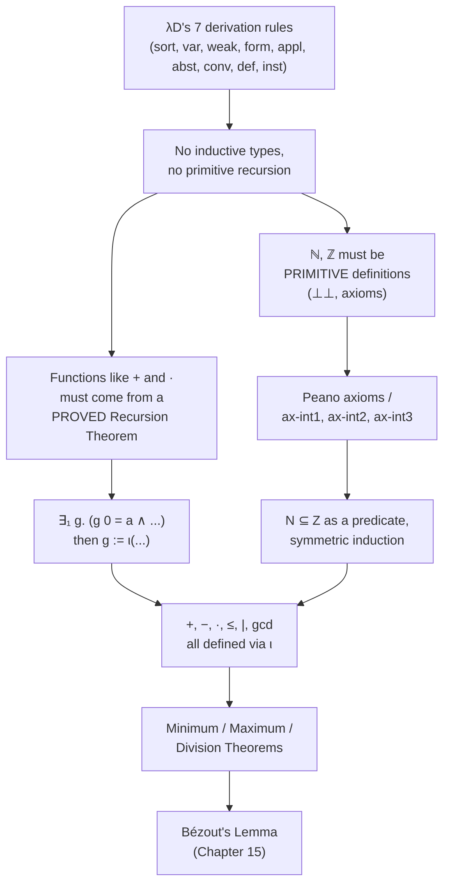
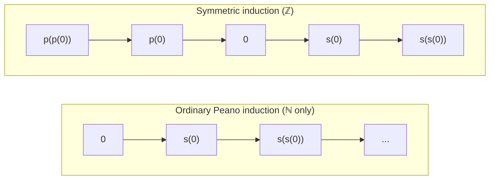
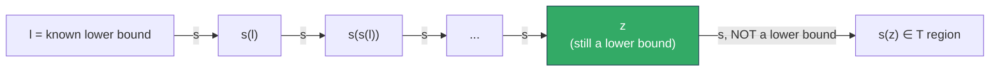

# Arithmetic in Type Theory

[[book-guidelines|↩ Back to guidelines]]

## Why this is a real engineering problem, not a formality

By the time $\lambda D$ reaches Chapter 14, it already has logic (Chapter 7/11), equality (Chapter 12), and sets-as-predicates (Chapter 13). It would be reasonable to expect that "now add arithmetic" is a two-page afterthought — after all, every programming language ships integers as a primitive, and every logic textbook writes $\mathbb{N}$ and $\mathbb{Z}$ without a second thought. Nederpelt and Geuvers spend an entire chapter on it, and for a precise reason: **$\lambda D$'s definition mechanism has no primitive recursion, no inductive types, and no built-in numbers.** Every one of those has to be *earned* from the seven derivation rules of $\lambda D$ (Appendix D) plus whatever primitive (axiomatic) definitions you're willing to add and justify externally.

This is the same wall you hit if you're building a verifier's trusted kernel: you don't want to hardcode "here is how natural number recursion works" into the kernel, because every hardcoded feature is something that could be wrong and that you can never remove from the trusted computing base. The point of $\lambda D$ (and of Lean's kernel, and of any de-Bruijn-style checker) is to keep the kernel's primitive vocabulary as small as possible — a handful of rules for $\Pi$-types, application, abstraction, conversion, and definitions — and build *everything else*, including "$1+2=3$," as a derived consequence. Chapter 14 is the book's demonstration that this actually scales to something as basic and as load-bearing as arithmetic.

Three design pressures fall out of this constraint, and they structure the whole chapter:

1. **You can't just declare an inductive type.** $\lambda D$ has no `data Nat = Zero | Succ Nat` construct. So $\mathbb{N}$ has to be introduced as a *primitive definition* — an opaque constant with a type and no computational content ($\bot\bot$, "no defining body, trust me") — together with axioms that pin down its behavior.
2. **You can't write recursive function definitions directly.** There is no syntax in $\lambda D$ for "define $f$ by cases on how its argument was built." Recursive functions like addition have to be manufactured from a **proved existence-and-uniqueness theorem** (the Recursion Theorem) plus the $\iota$-descriptor from Chapter 12, which turns "there exists a unique $x$ such that $P(x)$" into an actual term denoting that $x$.
3. **Every arithmetic fact costs a derivation.** There's no built-in evaluator. Proving $1+2=3$ formally takes an eleven-line proof object chaining `eq-refl`, `eq-cong1`, and `eq-trans`. This isn't a bug in the presentation — it's the direct, honest cost of rule (1) and (2): if computation isn't a kernel primitive, every computed fact must be a proved fact.

Keep those three pressures in mind — they explain almost every design choice in what follows.



## 1. The Peano axioms for the natural numbers

The book first considers reusing Church numerals from Chapter 1 (or their typed cousins, the polymorphic Church numerals of $\lambda 2$, §3.8). It rejects them, and the reasons are worth internalizing because they are exactly the reasons any encoding-based number system eventually breaks:

- **Induction is not derivable.** Geuvers (2001) shows induction cannot be proved for the polymorphic Church numerals in $\lambda 2$, $\lambda P2$, or $\lambda D$. Church numerals give you *iteration*, not *primitive recursion* — you can fold over them, but you can't extract "the previous numeral" or reason "for all $n$, if $P$ holds of $n$ then it holds of $n+1$" as a theorem about the encoding.
- **Predecessor is awkward.** The classic Church-numeral predecessor trick is a well-known headache (Exercise 32.11 in a companion text) — it's a workaround, not a clean primitive.
- **Church numerals don't extend to negative numbers**, so you'd need an entirely different, incompatible encoding for $\mathbb{Z}$.

So the book falls back on Peano's 1889 axiomatization: postulate a set $N$, an element $0$, and a function $s : N \to N$, then add exactly enough axioms to prevent $s$ from looping back on itself:

$$
\begin{aligned}
ax\text{-}nat_1 &: \forall x{\in}N\ \big(s(x) \neq 0\big) \\
ax\text{-}nat_2 &: \forall x,y{\in}N\ \big(s(x) = s(y) \Rightarrow x = y\big) \\
ax\text{-}nat_3 &: \big(P(0) \wedge \forall x{\in}N (P(x) \Rightarrow P(s(x)))\big) \Rightarrow \forall x{\in}N\, P(x)
\end{aligned}
$$

In $\lambda D$ these become six primitive definitions (Figure 14.1) — each written with the empty definiens $\bot\bot$, meaning "this constant has a type, but no defining body; take it on faith":

$$
\begin{aligned}
N &:= \bot\bot : *_s \\
0 &:= \bot\bot : N \\
s &:= \bot\bot : N \to N \\
ax\text{-}nat_1 &:= \bot\bot : \forall x{:}N.\ \neg(s\,x =_N 0) \\
ax\text{-}nat_2 &:= \bot\bot : \forall x{:}N.\ \forall y{:}N.\ (s\,x =_N s\,y \Rightarrow x =_N y) \\
ax\text{-}nat_3(P) &:= \bot\bot : (P\,0 \wedge \forall x{:}N.(P\,x \Rightarrow P(s\,x))) \Rightarrow \forall x{:}N.\ P\,x
\end{aligned}
$$

The book flags something important here (Remark 14.1.2 / 14.1.3): the *name* `ax-nat1` doesn't refer to the axiom-as-proposition — it refers to a **proof object inhabiting that proposition**. This is the propositions-as-types discipline all the way down: even your axioms are just typed constants, syntactically indistinguishable from any other assumption. And because these are primitive (not descriptive) definitions, there's no formal check that they're *sensible* — the same syntax that lets you postulate $N, 0, s$ would just as happily accept $0 =_N s(0)$ (which collapses the whole system, since it forces all naturals to be equal) or $\bot \equiv \neg\bot$ (which collapses logic itself). Type-correctness guarantees nothing about mathematical content; it only guarantees that *if* your primitives are sound, everything built from them is too.

**Grounding.** Two languages carry this idea very differently, and the gap between them *is* the point.

- **Lean.** This is the most literal match. Lean has an `axiom` keyword that does exactly what $\bot\bot$ does — declares a constant with a type and no proof term, trusted rather than checked:
  ```lean
  axiom MyNat : Type
  axiom myZero : MyNat
  axiom mySucc : MyNat → MyNat
  axiom ax_nat1 : ∀ x : MyNat, mySucc x ≠ myZero
  axiom ax_nat2 : ∀ x y : MyNat, mySucc x = mySucc y → x = y
  axiom ax_nat3 : ∀ P : MyNat → Prop, P myZero →
      (∀ x, P x → P (mySucc x)) → ∀ x, P x
  ```
  Lean's *actual* `Nat` is not built this way — it's a genuine inductive type, and `Nat.rec` (the induction principle) is *derived* from the inductive definition, not postulated. That contrast is exactly the book's point: $\lambda D$ has no inductive types in its kernel, so what Lean gets for free from its kernel, $\lambda D$ has to buy with an axiom whose soundness is an *external*, human responsibility — precisely the caution the book raises in Remark 14.1.3.

- **Rust.** There's no faithful way to write "opaque axiomatic type with postulated properties" in Rust's type system directly, but the *spirit* — a sealed, primitive boundary that the rest of the program must trust without re-deriving — maps onto a `trait` with no default methods, implemented once in a `core` module and never re-verified by callers:
  ```rust
  trait PeanoNat: Sized + PartialEq {
      const ZERO: Self;
      fn succ(&self) -> Self;
      // ax-nat1, ax-nat2 are properties the implementor promises,
      // not something the type system checks for you.
  }
  ```
  This is a useful negative lesson for the compiler/verifier project: Rust's trait system can express the *interface* of a Peano structure, but it cannot express "and these two properties hold" as a checked obligation the way $\lambda D$'s axioms — or Lean's — can. That gap between "interface" and "verified interface" is exactly what a custom prover embedded in a Rust toolchain would need to close.

## 2. Axiomatic integers: successor as a bijection, predecessor via $\iota$

Rather than build $\mathbb{Z}$ as pairs of naturals modulo an equivalence relation (the standard textbook move, via $(k,l) \sim (m,n) \iff k+n = l+m$), the book chooses to axiomatize $\mathbb{Z}$ directly, following Margaris (1961). The stated reason is blunt and pragmatic: the quotient construction "works fine" in ordinary mathematics but is "cumbersome" in type theory, because *every* function on the quotient has to be checked to respect the equivalence relation — a proof obligation you'd have to discharge over and over. The axiomatic route sidesteps this entirely at the cost of five primitive definitions (Figure 14.3):

$$
Z := \bot\bot : *_s, \qquad 0 := \bot\bot : Z, \qquad s := \bot\bot : Z \to Z, \qquad ax\text{-}int_1 := \bot\bot : bijective(Z,Z,s)
$$

The key upgrade from the Peano axioms is $ax\text{-}int_1$: $s$ is not just injective (as before) but a full **bijection**. Surjectivity means every $y \in Z$ has *some* $x$ with $s(x) = y$; injectivity means that $x$ is *unique*. Put together, $\forall y{:}Z\ \exists_1 x{:}Z\ (s\,x = y)$ — and this is where the $\iota$-descriptor from §12.7 earns its keep for the first time in the chapter: since the predecessor of $y$ is a *uniquely existing* object, you're licensed to name it,

$$
p(y) := \iota x{:}Z.\ (s\,x =_Z y) : Z \to Z,
$$

and then `ι-prop` (the defining property of $\iota$) hands you the annihilation laws for free: $s(p(y)) =_Z y$ and (via injectivity) $p(s(y)) =_Z y$. Notice what just happened: **predecessor was never postulated — it was constructed**, entirely mechanically, from the bijectivity axiom. This is the chapter's first demonstration that the $\iota$-descriptor is not a cosmetic notation but the actual mechanism that turns "we can show one exists and it's unique" into "here's the object, with the equations you'd expect."

**Grounding.**

- **Lean.** This is structurally identical to `Exists.choose` / `Classical.choose` — the standard Lean idiom for "extract the witness of a unique-existence proof as a term":
  ```lean
  axiom Zint : Type
  axiom zzero : Zint
  axiom zsucc : Zint → Zint
  axiom ax_int1 : Function.Bijective zsucc

  noncomputable def pred (y : Zint) : Zint :=
    (ax_int1.2 y).choose          -- surjectivity gives ∃ x, zsucc x = y
  -- pred is defined exactly the way p is: pull the witness out of a
  -- proof of unique existence. Lean marks it `noncomputable` because,
  -- just like λD's ι, `choose` has no reduction behavior — you only
  -- get equations about it (`(ax_int1.2 y).choose_spec`), never a
  -- normal form, exactly mirroring λD's ι-prop / ι-conv split.
  ```
  The `noncomputable` annotation is worth dwelling on: it is Lean's admission of the same fact the book is careful about with $\iota$ — a term introduced by unique-existence extraction is not something you can run; it's something you can only reason about via its specification.

- **Rust.** There is no analog to a non-computational witness-extraction operator in Rust — `Option::unwrap` or a manual search loop are the closest things, but they're actual algorithms, not axiomatic descriptions. That mismatch is instructive on its own: a Rust *implementation* of predecessor for a bijective successor would have to be a concrete search (walk backward until you find $x$ with `succ(x) == y`), whereas $\lambda D$/Lean only assert existence and reason about the result structurally, never computing it. If your compiler/verifier project needs "the unique $x$ satisfying $P$" as a specification-level object (e.g. in a Hoare-triple postcondition), it behaves like Lean's `choose`, not like a Rust function — you may need to keep those two layers (spec-level description vs. executable witness search) explicitly distinct in the toolchain.

### Symmetric induction

The ordinary Peano induction axiom only lets you climb *upward* from $0$. Over $\mathbb{Z}$, that's not enough — you need to reach negative numbers too. So the induction axiom for $\mathbb{Z}$ requires **both** directions simultaneously:

$$
ax\text{-}int_2(P) : \big[P(0) \wedge \forall x{:}Z.\ (P(x) \Rightarrow (P(s(x)) \wedge P(p(x))))\big] \Rightarrow \forall x{:}Z.\ P(x)
$$

This is *symmetric induction*: the inductive step has to prove the property survives stepping to *both* the successor and the predecessor. Every place the book later needs induction over all of $\mathbb{Z}$ (commutativity of $+$, the recursion equations, the Minimum Theorem's climbing argument) goes through this one axiom.



**Grounding.** In Lean, symmetric induction is the natural principle you'd state for `Int` if you didn't have it as a derived theorem from Lean's actual `Int := Nat ⊕ Nat`-style definition:
```lean
axiom ax_int2 : ∀ P : Zint → Prop,
    (P zzero ∧ ∀ x, P x → (P (zsucc x) ∧ P (pred x))) → ∀ x, P x
```
This is directly the shape of a *bidirectional* well-founded recursion/induction principle — worth flagging against the workbench's standing interest in bidirectional typing, because the *structure* is the same move: you need two "modes" (climb up, climb down) covering both directions before you can discharge the universal claim, just as bidirectional type checking needs both an inference mode and a checking mode to cover all terms.

### $\mathbb{N}$ recovered as the smallest subset of $\mathbb{Z}$

With $\mathbb{Z}$ axiomatized independently, $\mathbb{N}$ has to be *recovered* as a subset — using exactly the subsets-as-predicates machinery from Chapter 13 (§13.1: subsets can't be types in $\lambda D$ without breaking Uniqueness of Types, so they're predicates instead):

$$
nat\text{-}cond(P) := P(0) \wedge \forall y{:}Z.\ (P(y) \Rightarrow P(s(y))) \qquad N := \lambda x{:}Z.\ \Pi P{:}Z{\to}*_p.\ (nat\text{-}cond(P) \Rightarrow P\,x)
$$

Read this the way the book suggests (Remark 14.2.2): each predicate $P$ satisfying `nat-cond` describes some interval $[x, \infty)$ that contains $0$ and all its successors. $N$ is defined as satisfying *every such* $P$ — i.e., $N$ is the **intersection** of all sets closed under $0$ and successor. This is second-order impredicative quantification doing genuine work: it's the exact same trick used in Chapter 7 to encode $\wedge$, $\vee$, $\exists$ as $\Pi$-types (their book-imposed second-order encodings), applied here to get an "inductively smallest set" out of a system with no native inductive types.

But there's a subtlety the book is honest about: this definition alone doesn't rule out **finite models**. Concretely, take $S = \{a,b,c,d\}$ with $0 := a$ and $s$ cycling $a \to b \to c \to d \to a$. This model satisfies bijective successor and symmetric induction — and under it, $N$ (as just defined) collapses to all of $Z$! The fix is one more primitive axiom, chosen specifically to break cycles:

$$
ax\text{-}int_3 := \bot\bot : \neg(p(0) \,\varepsilon\, N)
$$

"The predecessor of $0$ is not a natural number." In a cyclic model, $p(0)$ *would* eventually be reached by iterating $s$ from $0$, so it *would* be forced into $N$ — this axiom is precisely what makes all models of the theory infinite (Exercise 14.4). This is a sharp illustration of how axiomatic theories can silently under-determine their intended model, and how much care "obvious" primitive definitions actually require — exactly the caution flagged in §14.1's Remark 14.1.3.

With $ax\text{-}int_3$ in place, all three Peano axioms become *provable theorems* about the new $N \subseteq Z$ (`nat-prop1`, `nat-prop2`, `nat-ind` in Figures 14.7–14.8), and induction over $N$-as-subset takes the relativized shape

$$
\big(P(0) \wedge \forall x{:}Z.\,(x\varepsilon N \Rightarrow (P(x) \Rightarrow P(s\,x)))\big) \Rightarrow \forall x{:}Z.\,(x\varepsilon N \Rightarrow P(x)),
$$

proved (Figure 14.8) by the "upgrade the predicate" trick that recurs throughout the book: define $Q(z) := z\varepsilon N \wedge P(z)$, prove $Q$ satisfies `nat-cond`, and let the *definition* of $N$ (its universal-over-all-closed-predicates content) do the real work by instantiating it at $Q$.

**Grounding.** In Lean/Mathlib terms, `N := λx:Z. ΠP:Z→*p. (nat-cond(P) ⇒ P x)` is the impredicative encoding of "the least fixed point of the successor-closure operator" — structurally the same move as encoding an inductive `Nat` via its Church-style eliminator, `∀ P, P 0 → (∀ n, P n → P (n+1)) → P x`. In Rust, the closest honest analog is a predicate closure combined with a manual well-foundedness argument — Rust has no impredicative quantification over predicates, so `N` would have to be represented concretely (e.g. as "reachable from 0 by finitely many `succ` calls," an actual inductive enum) rather than as this intersection-of-all-closed-sets description; that's a reminder that the book's move is possible *because* $\lambda D$ has impredicative $\Pi$-types over $*_p$ (inherited from $\lambda2$/CC), a feature Rust's generics simply don't have.

## 3. The Recursion Theorem for $\mathbb{Z}$: how "define by recursion" gets licensed

This is the mechanical heart of the chapter, and the clearest payoff of the "no primitive recursion" constraint stated at the top. The ordinary recursive scheme for addition,

$$
(i)\ +_m(0) = m \qquad (ii)\ +_m(s(n)) = s(+_m(n)),
$$

*looks* like a function definition, but $\lambda D$ has no syntax that accepts "define $g$ by pattern-matching on how its argument was constructed." The book's solution is to prove, once, a general-purpose theorem that licenses *any* such scheme:

> **Theorem 14.4.3 (Recursion Theorem for $\mathbb{Z}$).** Let $A$ be a type, $a : A$, $f_1, f_2 : A \to A$. Then there exists exactly one function $g : Z \to A$ such that $g(0) =_A a$, $g(s(x)) =_A f_1(g(x))$ whenever $pos(s(x))$, and $g(p(x)) =_A f_2(g(x))$ whenever $neg(p(x))$.

Notice the shape: it's an $\exists_1$ statement — existence *and* uniqueness of a function satisfying the recursive equations. That's exactly the form the $\iota$-descriptor needs. So a recursive definition in $\lambda D$ is always a two-step dance: **(1)** invoke the Recursion Theorem to get a proof of $\exists_1 g.\, \text{rec-prop}(g)$, then **(2)** apply $\iota$ to that proof to actually name $g$. For addition specifically, the book uses a simpler corollary that applies whenever the step function is a *bijection* (Theorem 14.4.5 — take $f_1 = f$, $f_2 = f^{-1}$), since $s$ itself is a bijection by $ax\text{-}int_1$:

$$
plus(m) := \iota\big(Z{\to}Z,\ \lambda g.\,(g\,0 =_Z m \wedge \forall x{:}Z.\,g(s\,x) =_Z s(g\,x)),\ \text{rec-add-lem}(m)\big) : Z \to Z
$$

with `+m` as notation for `plus(m)`, and the binary `+` finally just $\lambda x\,y.\ (+_x\,y)$. The equations `plus-i` ($x + 0 = x$) and `plus-ii` ($x + s\,y = s(x+y)$) then *follow* from `ι-prop`; they are not definitions, they are theorems about a definition. A pleasant side observation the book makes (§14.4): the "downward" equation $m + p(n) = p(m+n)$ that you'd naively expect to need as a *third* recursive clause is actually *derivable* from $(ii)$ alone, using the annihilation laws — so two clauses were always enough, even once you extend from $\mathbb{N}$ to $\mathbb{Z}$.

The general Recursion Theorem is stated in $\lambda D$ (Figure 14.10, `spec-rec-th`) but *not* proved in the book — Nederpelt and Geuvers explicitly defer the proof to a companion paper (Geuvers 2014b), noting only that it is provable from the machinery already built. That's an honest and important admission: even in a book about doing everything from first principles, some theorems are cited rather than fully re-derived, because the proof effort would swamp the pedagogical point.

**Grounding — this is the section where Lean should be primary, not Rust, because it's exactly what Lean's elaborator does under the hood.**

- **Lean.** When you write an ordinary recursive `def` in Lean over a type without a structural recursor readily available — or over `Int`, which (like $\lambda D$'s $Z$) isn't simply "build up from 0," — Lean's elaborator doesn't take your pattern-match at face value. It compiles it into a call to `WellFounded.fix`, discharging a termination *proof obligation* behind the scenes, and produces equation lemmas (`foo.eq_1`, `foo.eq_2`, ...) that are *theorems about* the resulting function, not definitional unfoldings. That is structurally identical to the book's two-step dance:
  ```lean
  -- What you write:
  def addZ (m : Zint) : Zint → Zint
    | .ofNat 0        => m
    | .succ n         => (addZ m n).succ
    -- etc.

  -- What actually gets manufactured, conceptually:
  --  1. A proof that the step relation is well-founded (the termination check)
  --  2. addZ m := WellFounded.fix termination_proof (fun n rec => ...)
  --  3. addZ_eq1 : addZ m 0 = m           -- a THEOREM, from unfolding fix
  --     addZ_eq2 : addZ m (n+1) = s (addZ m n)   -- also a THEOREM
  ```
  `plus-i` and `plus-ii` in the book are exactly Lean's auto-generated equation lemmas: derived facts about a function built from a termination proof, not primitive reduction rules. If you're building the meta-programming elaborator from the workbench's standing project, this correspondence is close to load-bearing: **the Recursion Theorem + $\iota$ pattern is the specification-level description of what `WellFounded.fix` implements operationally.** Understanding one is understanding the other from a different altitude.

- **Rust.** Rust has honest structural recursion (the borrow checker doesn't care about termination, but a `fn` written with real pattern matching on an `enum` just runs). The useful exercise is to write the addition recursion *directly*, and notice what's missing compared to the $\lambda D$/Lean version — no proof that this is the *unique* function satisfying those equations, and no way to state "this equation holds" as a checked, inspectable fact separate from "this is how the function computes":
  ```rust
  enum ZInt { Zero, Succ(Box<ZInt>), Pred(Box<ZInt>) }

  fn plus(m: &ZInt, n: &ZInt) -> ZInt {
      match n {
          ZInt::Zero => m.clone(),                 // plus-i, unconditionally
          ZInt::Succ(k) => ZInt::Succ(Box::new(plus(m, k))),  // plus-ii
          ZInt::Pred(k) => ZInt::Pred(Box::new(plus(m, k))),  // plus-iii
      }
  }
  ```
  This is what "recursion as a language primitive" buys you for free — and losing sight of *why* $\lambda D$ can't just do this (no inductive `enum`, no pattern-match primitive in the kernel) is the surest way to underrate how much is being reconstructed by hand in Chapter 14.

### $1 + 2 = 3$: what recursion-by-theorem actually costs

The book includes an eleven-line formal derivation (Figure 14.13) that $1+2=3$, purely to make the cost of this approach concrete. Chained through `eq-refl`, `eq-cong1` (congruence: rewriting under a context), and `eq-trans` (transitivity), the condensed form is:

$$
1+2 \overset{(1)}{=} 1+s\,1 \overset{(2)}{=} s(1+1) \overset{(3)}{=} s(1+s\,0) \overset{(4)}{=} s(s(1+0)) \overset{(5)}{=} s(s\,1) \overset{(6)}{=} 3
$$

Only steps $(2)$, $(4)$, $(5)$ are "real" (uses of `plus-i`/`plus-ii`); the rest is bookkeeping to unfold the numerals $1 := s\,0$, $2 := s\,1$, $3 := s\,2$ and re-fold them. A human writer infers $A = G$ from a chain $A=B=\cdots=G$ instantly; formally, transitivity has to be applied five separate times. The book's own remedy — defining `eq-trans-4`, `eq-trans-5`, ..., "many-fold transitivity" lemmas — is a small but real design lesson: **in a system with no free structural sugar, you build your own sugar as derived lemmas**, exactly the way a real proof-assistant library accumulates convenience combinators on top of a minimal kernel.

**Grounding.** Python is the right tool for the contrast here, precisely because it shows what the *informal* computation looks like when you don't have to justify each step:
```python
def s(n): return n + 1
one, two, three = s(0), s(s(0)), s(s(s(0)))
assert one + two == three   # true "by computation" — no proof object needed
```
The entire eleven-line $\lambda D$ derivation exists to formally justify the single line `assert one + two == three`. That gap — one line of trusted computation vs. eleven lines of proof — *is* the tradeoff of working inside a system with a minimal, fully-checked kernel instead of a runtime that just trusts its own arithmetic ALU.

## 4. Subtraction and opposites, built the same way

Subtraction reuses $\iota$ rather than a fresh recursion: the difference $x - y$ is *defined* as the unique $z$ with $z + y = x$, after proving that such a $z$ exists and is unique (Lemma 14.8.1, by symmetric induction on $y$, existence witness $z = p(z')$ or $z = s(z')$ depending on direction):

$$
x - y := \iota z{:}Z.\ (z + y = x)
$$

This immediately gives `subtr-prop1`: $(x-y)+y = x$ — not by unfolding a recursive definition, but again by `ι-prop`, the generic property every $\iota$-defined object satisfies by construction. The opposite is then defined as a *special case of subtraction* rather than independently: $-x := 0 - x$, which the book flags as the more implementation-friendly of two equally valid mathematical choices (the other being: define $-x$ directly as "the number that added to $x$ gives $0$," and separately prove existence/uniqueness). Choosing "reuse a definition you already have" over "introduce a parallel one" is a small but real API-design decision the book makes explicitly — a decision every library author building an arithmetic layer on a verifier will recognize as recurring constantly.

**Grounding.** In Lean, this is precisely `Sub` reusing `Neg` and `Add` at the typeclass level (`sub_eq_add_neg` is a *theorem*, not a definition, in `Mathlib`, for exactly the same "derive, don't duplicate" reason). In Rust, it's the difference between implementing `Sub` from scratch versus implementing it as `impl Sub for T { fn sub(self, other: T) -> T { self.add(other.neg()) } }` — the same reuse discipline, minus any proof obligation that the reuse is *correct*, since Rust's trait system has no equivalent of `ι-prop` to certify it.

## 5. Multiplication and distributivity

Multiplication follows the identical two-step pattern — recursion scheme, then Recursion Theorem, then $\iota$ — but with a twist worth noticing: the step function isn't $s$ itself, but $f := \lambda v.\,(v+m)$, and you have to separately establish that *this* $f$ is a bijection (its inverse being $\lambda v.\,(v-m)$) before Theorem 14.4.5 applies:

$$
(i)\ \times_m(0) = 0 \qquad (ii)\ \times_m(s(n)) = \times_m(n) + m
$$

Once `times-i`/`times-ii`/`times-iii` are in hand, **Right Distributivity** — $x\cdot(y+z) = (x\cdot y)+(x\cdot z)$ — falls out as a lemma (14.11.2), and commutativity/associativity of $\cdot$ follow as consequences of distributivity plus the recursion equations (Lemma 14.11.3), not as separately postulated facts. This is worth flagging because it's a genuinely economical piece of formal engineering: rather than prove commutativity of $\times$ from scratch by yet another induction, the book gets it "for free" by composing already-proved facts about $+$ and the recursive equations for $\times$ — the kind of lemma-reuse discipline that keeps a large formalization from becoming an endless string of near-duplicate inductions.

A representative result showing how the sign rules get established, entirely from what precedes: $x\cdot(-y) = -(x\cdot y)$ (Lemma 14.11.4) is proved by showing *both* $x\cdot(-y)+x\cdot y$ and $-(x\cdot y)+x\cdot y$ equal $0$, then invoking **Right Cancellation** to conclude the two left-hand sides are equal. Right Cancellation itself — "$x+z=y+z \Rightarrow x=y$" — recurs as the workhorse closing move throughout the entire chapter; almost every non-trivial equation in §§14.6–14.12 ends with an appeal to it.

**Grounding.** This is squarely Rust/checker-shaped territory in the learning-goals sense: sign rules and distributivity are exactly the kind of arithmetic lemma library a Hoare-triple verifier needs baked in as trusted (or re-derivable) simplification rules before it can discharge numeric side-conditions automatically. A Rust proof-obligation simplifier would want `x * (y + z) == x*y + x*z` as a rewrite rule in its normalization pass, with the *justification* for that rule being exactly Lemma 14.11.2's derivation chain, not a re-proof from first principles every time.

## 6. Inequality relations

$\le$ is defined directly from subtraction and the natural numbers, sidestepping an existential quantifier the book notes is an equally valid but less convenient alternative:

$$
x \le_Z y := (y - x)\,\varepsilon\, N \qquad x <_Z y := (x \le_Z y \wedge x \ne y)
$$

$\ge$ and $>$ are literally defined as the reverses ($x \ge y := y \le x$), rather than independently — again the "reuse over duplicate" discipline from §4. The book proves $\le$ is a partial order on $\mathbb{Z}$ (reflexivity from $x - x = 0 \varepsilon N$ via Lemma 14.8.4; transitivity from closure of $N$ under addition, Lemma 14.7.1) and derives the translation lemma $(x+z \le y+z) \Leftrightarrow (x \le y)$ that later underwrites almost every inequality manipulation in Chapter 15's Bézout proof.

**Grounding.** In Lean, `x ≤ y := (y - x) ∈ (N : Set Int)` is *not* how `Int`'s order is actually defined in core Lean (it's built from the underlying `Nat` representation), but it is exactly how you'd axiomatize order for an *abstract* ordered-ring-like structure — this is the shape of `OrderedAddCommGroup` instances in Mathlib, where `≤` is characterized via a "positive cone" (here: $N$) rather than given primitively. Recognizing $N$ as the positive cone of $Z$ is a genuinely useful bridge concept if the compiler/verifier project ever needs to support ordered numeric types generically rather than one type at a time.

## 7. Divisibility and the greatest common divisor

Divisibility gets the expected existential definition, and `gcd` gets a third, structurally different appeal to $\iota$ — this time depending on a theorem (the Maximum Theorem) not yet proved at the point it's invoked:

$$
div(m,n) := \exists q{:}Z.\ (m\cdot q = n) \qquad (\text{notation } m \mid n)
$$
$$
gcd\text{-}prop(k,m,n) := com\text{-}div(k,m,n) \wedge \forall l{:}Z.\ (com\text{-}div(l,m,n) \Rightarrow l \le k)
$$
$$
gcd(m,n,s,t) := \iota k{:}Z.\ gcd\text{-}prop(k,m,n) \quad \text{given } s{:}m>0,\ t{:}n>0
$$

The uniqueness half of `gcd-unq` is cited "according to a fact about integers that we mention without proof: each non-empty subset of $Z$ that has an upper bound also has a (unique) maximum" — i.e. the Maximum Theorem, proved later, in §15.8, as the mirror image of the Minimum Theorem. The set being maximized over here is *the set of all common divisors of $m$ and $n$*, which is nonempty (it always contains $1$) and bounded above (by $m$, since $m,n$ are positive) — so the machinery applies. This forward reference is a nice illustration of how a formalization's dependency graph doesn't have to be strictly linear: `gcd` is *defined* in Chapter 14 using a theorem whose *proof* only appears in Chapter 15, because what matters for using $\iota$ is having the existence-and-uniqueness *statement*, not yet its derivation.

### Proof irrelevance

The chapter closes (§14.13) on a subtlety that matters more than its brief treatment suggests: `gcd(m,n,s,t)` takes *proofs* `s : m>0` and `t : n>0` as explicit arguments — under proofs-as-terms, that's unavoidable, since the type of `gcd`'s defining property genuinely depends on those facts holding. But mathematically, the *value* of the gcd obviously shouldn't depend on *which* proof of positivity you happened to supply. The book's resolution: because `gcd` (like every object introduced in this chapter) is defined via $\iota$, and $\iota(S,P,u_1) =_S \iota(S,P,u_2)$ is provable for *any* two proofs $u_1, u_2$ of the same uniqueness statement (Remark 12.7.2), proof-irrelevance for these definitions is a **derived fact**, not something that needs to be separately axiomatized. The book explicitly declines to add a general proof-irrelevance principle to $\lambda D$ — not every construct is guaranteed to get this property automatically, only ones built through $\iota$.

**Grounding.** Lean has genuine, kernel-level **proof irrelevance for `Prop`**: any two proofs of the same proposition are *definitionally equal*, full stop, no derivation required — a stronger, built-in version of what $\lambda D$ has to derive case-by-case for $\iota$-defined objects. This is worth naming explicitly for the elaborator project, since unification in Lean's kernel exploits this: when the elaborator needs to check two terms are definitionally equal and they differ only in a `Prop`-typed subterm (e.g. two different proofs threaded through as the `s`/`t` arguments above), it can short-circuit immediately rather than trying to unify the proof terms structurally. `gcd(m,n,s1,t1) =?= gcd(m,n,s2,t2)` is *exactly* the shape of unification problem where Lean's proof irrelevance pays for itself — and understanding that $\lambda D$ has to *derive* the same guarantee via $\iota$, rather than get it as a kernel rule, is a genuinely useful contrast for judging design tradeoffs in a from-scratch elaborator.

## 8. Minimum, Maximum, and the Division Theorem (Chapter 15, §§15.2, 15.7–15.8)

These three results are technically outside Chapter 14, but the book itself treats them as the chapter's direct continuation — introduced in §15.2 as missing "foreknowledge," proved in §§15.7–15.8, purely because Bézout's Lemma needs them and Chapter 14 didn't yet.

**The minimum of a subset**, generalized from the earlier global-type version of §12.7 to subsets:

$$
least(S,R,T,m) := m\,\varepsilon\,T \wedge lw\text{-}bnd(S,R,T,m), \qquad
min(S,R,T,r,w) := \iota m{:}S.\ least(S,R,T,m)
$$

**Minimum Theorem.** Every non-empty $T \subseteq Z$ bounded below has a minimum. The proof strategy (§15.7) is genuinely elegant and worth internalizing on its own terms, not just as a means to Bézout: rather than searching directly, it proves the *equivalent* existential statement

$$
\exists y{:}Z.\ \big(lw\text{-}bnd_Z(T,y) \wedge \neg lw\text{-}bnd_Z(T,s\,y)\big)
$$

by **contradiction using symmetric induction**: assume no such $y$ exists (equivalently, every lower bound's successor is still a lower bound), then induct — starting from *any* known lower bound $l$ — to show *every* integer is a lower bound of $T$, which is absurd once you recall $T$ is nonempty (take $n \in T$; then $s\,n$ can't be a lower bound, since $n < s\,n$ and $n \in T$). This is the "climbing" argument the book describes informally: start at a lower bound, walk upward one successor at a time, and the induction shows you must eventually hit a lower bound whose successor *isn't* — and that one is the minimum.



**Division Theorem.** Rather than re-derive an analogous "climbing" argument from scratch, §15.8 reuses the Minimum Theorem's *mirror image*, the **Maximum Theorem** (every non-empty subset of $Z$ bounded above has a maximum — proved directly from the Minimum Theorem, Exercise 15.7), applied to the set of multiples of $d$ not exceeding $m$:

$$
D := \{x{:}Z \mid (\exists k{:}Z.\ x = k\cdot d) \wedge x \le m\}
$$

$D$ is nonempty ($0 \in D$, since $d>0 \Rightarrow m \ge 0$) and bounded above (by $m$), so it has a maximum $l = q\cdot d$ for a unique $q$ (unique because $d \ne 0$, via multiplication's Right Cancellation). Setting $r := m - q\cdot d$ gives $r \ge 0$ immediately (since $l \le m$); $r < d$ is shown by contradiction — if $r \ge d$, then $(q+1)\cdot d \in D$ too, but exceeds $l$, contradicting $l$'s maximality. This produces exactly the quotient-remainder statement:

$$
div\text{-}the(m,d,u,v) : \exists q,r{:}Z.\ (m = q\cdot d + r \wedge 0 \le r < d)
$$

The book explicitly chose *not* to redo the Minimum Theorem's induction argument for the Division Theorem — instead deriving the Maximum Theorem as a corollary and reusing it. That's the same "derive, don't duplicate" discipline seen with subtraction-from-addition and opposite-from-subtraction, applied now at the level of entire theorems rather than definitions — a strong signal about how to structure a lemma library for a real prover: prove the general, reusable shape once (Minimum Theorem), then get its mirror image almost for free by a relation-reversal argument, rather than re-running the whole proof machinery.

**Grounding.** The climbing argument is precisely a **well-founded search bounded by a measure** — in Rust, this is the shape of a bounded linear scan with a loop invariant (`lower_bound` climbs while it stays a lower bound; termination follows because $T$ is nonempty and bounded, so the scan can't run forever); the *formal* content that a Rust `while` loop doesn't give you for free is the invariant-preservation and termination *proof*, which is exactly what symmetric induction supplies here and what a Hoare-triple verifier would need to check automatically for a loop implementing this search. In Lean, the whole Minimum/Maximum/Division-Theorem trio is close in spirit to `Nat.find` and `Nat.findGreatest` (Mathlib's "least/greatest element satisfying a decidable predicate" combinators) — the same existence-by-search pattern, generalized here to unbounded $\mathbb{Z}$ instead of `Nat`, which is precisely why the book needs an explicit boundedness hypothesis that `Nat.find` gets automatically from $\mathbb{N}$'s well-ordering.

## Where this leads

Chapter 14 (plus the borrowed pieces of Chapter 15 covered above) is explicitly built as **the foreknowledge layer for Bézout's Lemma**, the book's capstone formalization in Chapter 15. Tracing the dependency directly: the restricted Bézout's Lemma proof needs *coprimality* and *divisibility* (§14.12), the *minimum* of $S^+ = S \cap N^+$ where $S$ is the set of linear combinations $mx+ny$ (the Minimum Theorem, §15.7), *division with remainder* of $m$ by that minimum $d$ (the Division Theorem, §15.8), and a whole library of addition/subtraction/multiplication identities (§§14.6–14.11) to carry out the algebraic rewriting inside the proof (e.g. $r = m(1-qx_0) - n(qy_0)$). Nothing in Chapter 15's proof of Bézout's Lemma is arithmetic the reader hasn't already seen justified from first principles in Chapter 14 — the chapter earns every fact it later spends.

For the standing project threads this workbench is tracking: this chapter is a clean, complete worked example of **licensing a recursive definition via a proved existence-uniqueness theorem plus a description operator**, rather than trusting recursion as a language primitive — which is close to the core mechanism a custom theorem prover embedded in a Rust toolchain would need for defining and verifying non-trivial numeric or structural computations without simply assuming termination. It's also a clean worked example of **proof irrelevance emerging as a derived property of $\iota$-based definitions** rather than needing to be a kernel axiom — directly relevant to how a Lean-style elaborator's definitional-equality check can (or, here, cannot automatically) short-circuit on proof-typed subterms during unification. The "derive, don't duplicate" discipline running through subtraction-from-addition, opposite-from-subtraction, and the Maximum-Theorem-from-Minimum-Theorem is, in miniature, the same lemma-reuse discipline any nontrivial verifier's standard library has to adopt to stay maintainable at scale.
