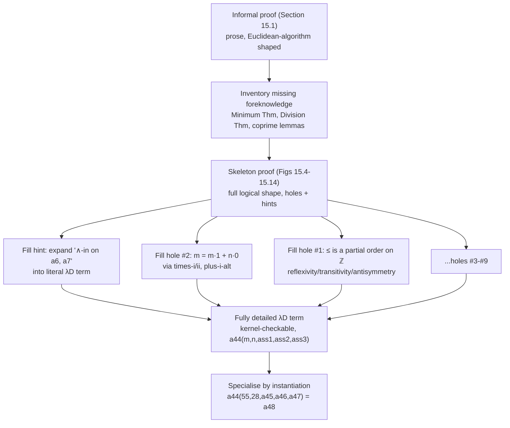

# Formal Proof Development in Practice

[[book-guidelines|↩ Back to guidelines]]

## The problem this chapter actually solves

Every earlier chapter of the book proves things that fit on a page. Chapter 15 does something different: it takes a genuine, non-trivial theorem — Bézout's Lemma — and walks it all the way from informal mathematical prose to a fully typed $\lambda D$ term. The point isn't the theorem. The point is the *process*, because the process is where a huge, silent assumption of the earlier chapters finally gets tested: that a working formalizer can actually get from "I believe this" to "the kernel accepts this" without either (a) writing the whole 40-line proof term in one uninterrupted pass, top-down, with every subterm nailed down before moving to the next, or (b) drowning in administrative detail before the shape of the argument is even visible.

Neither (a) nor (b) is how anyone — human or machine — actually builds a formal proof. What the chapter shows instead, concretely, with a real example, is the alternative: write the *skeleton* of the proof first, in the order the informal argument suggests, and mark every piece you don't want to think about yet with a placeholder — a **hole**. Fill the holes later, each one a small, self-contained proof obligation with its own known type. This is incremental construction with deferred obligations, and it's worth pausing on why it's forced rather than a stylistic choice.

**What breaks without holes.** Try to write $\lambda D$'s formalization of "$m$, the number itself, is a witness that $S^+$ is non-empty" strictly top-down. To state that $m$ witnesses non-emptiness you first need $m \in S^+$; to get that you need $m \in S$ and $m \in \mathbb N^+$; to get $m \in S$ you need a proof that $m = m \cdot 1 + n \cdot 0$ — a short arithmetic fact, but one that unpacks (per the book, §15.6.II) into three lemma applications and roughly half a dozen intermediate equalities once fully spelled out. If you insist on resolving that arithmetic fact *before* writing down the surrounding structure (the $\exists$-introduction, the $\wedge$-introduction, the appeal to the Minimum Theorem), you lose track of the shape of the argument you're actually trying to build, and a single wrong turn in the arithmetic derails work on the logic around it. The book's approach is the opposite: write `hole#2 : m = m · 1 + n · 0`, keep going, and the type checker still confirms that *everything surrounding the hole* is correctly assembled. The hole is a typed IOU, not a gap in rigor — its type is fixed and known the moment it's introduced, only the inhabitant is deferred.

```rust
// The shape of a "hole" as an engineer already understands it:
// a value whose *type* is fixed and checked, but whose construction
// is deferred. Rust's `todo!()` is the closest untyped-hole analogue —
// it type-checks the surrounding code and panics only if actually run.
fn hole_2() -> Proof<Eq<i64>> {
    // : m = m * 1 + n * 0
    todo!("arithmetic: times-ii, times-i, plus-i-alt")
}

fn a4(m: i64, n: i64) -> Proof<Eq<i64>> {
    hole_2() // surrounding proof term type-checks against hole_2's declared type
}
```

This is the chapter's real subject matter, and it's why the learning-goals thread about metavariables and elaboration is directly on point here: a $\lambda D$ hole *is* a metavariable in an elaborator, in every sense that matters — a named placeholder of known type, sitting inside a partially-built term, waiting to be unified with (or explicitly filled by) a concrete inhabitant, while the surrounding term is checked as if it were already solved. Lean's `sorry` and `?goal` metavariables, and the `_` placeholders that Rust's or Lean's elaborators solve by unification, are the direct engineering descendants of exactly this mechanism. The rest of this article works through the book's own example — Bézout's Lemma — to make that mechanism concrete.

---

## Bézout's Lemma: the theorem and the proof text being formalized

The chapter formalizes a restricted version (§15.1):

> **Theorem (Bézout's Lemma, restricted).** Let $m, n \in \mathbb N^+$ be coprime. Then $\exists_{x,y \in \mathbb Z}(mx + ny = 1)$.

and the informal proof it sets out to translate, verbatim (reproduced from Figure 8.6):

> Let $m$ and $n$ be positive natural numbers that have no other positive common divisor than 1. Consider the set of all integers $mx + ny$, where $x \in \mathbb Z$ and $y \in \mathbb Z$. Call this set $S$. Define $S^+$ as $S \cap \mathbb N^+$. This $S^+$ has a minimum, call it $d$. Since $d \in S^+$, also $d \in S$, hence (i) $d = mx_0 + ny_0$ for certain $x_0, y_0 \in \mathbb Z$. Moreover, $d > 0$ since $d \in \mathbb N^+$. Divide $m$ by $d$. This gives $q$ and $r$ such that (ii) $m = qd + r$, with $0 \le r < d$. By inserting $d$ of (i) into (ii) we get $m = q(mx_0 + ny_0) + r$, from which follows that $r = m(1-qx_0) - n(qy_0)$. Hence $r \in S$. Suppose $r > 0$. Then $r \in S^+$, so $r \ge d$ since $d = \min(S^+)$. But $r < d$: contradiction. Hence, $r = 0$. From (ii) now follows that $m = qd$, hence $d \mid m$. In a similar manner we can prove that $d \mid n$. Since $m$ and $n$ are coprime, $d$ must be 1, implying that $1 \in S$. Hence there exist $x, y \in \mathbb Z$ such that $mx + ny = 1$.

Every reader recognizes this proof strategy immediately: it's the Euclidean algorithm dressed as an existence argument. What the chapter demonstrates is that *recognizing* the strategy and *formalizing* it are separated by a surprising number of implicit assumptions the informal text simply glides over. Finding and naming those assumptions is the first job of formal proof development, done *before* writing a single line of $\lambda D$.

### What the informal proof leaves implicit

The book (§15.1) inventories the missing foreknowledge by close reading:

- **Two number systems are mixed**: integers ($\mathbb Z$) and positive naturals ($\mathbb N^+$), silently treated as compatible. Since $\mathbb N^+ \subseteq \mathbb Z$, the book's earlier decision (Chapter 14) to build $\mathbb Z$ axiomatically and recover $\mathbb N$ as a *subset*, not a separate type, pays off here — everything lives in one ambient type $\mathbb Z$, and $S, S^+$ are just predicates on it (subsets-as-predicates, from Chapter 13).
- **"$S^+$ has a minimum"** is asserted, not justified. Formally this needs a **Minimum Theorem** — every non-empty, bounded-below subset of $\mathbb Z$ has a (unique) minimum — and *that* needs the informal proof's silent assumption that $S^+$ is both non-empty and bounded below made explicit and proved.
- **"Divide $m$ by $d$"** invokes a **Division Theorem** (existence of quotient and remainder) that the informal text treats as common knowledge, not something requiring its own proof.
- Every arithmetic manipulation ("$m = q(mx_0+ny_0)+r$ ... hence $r = m(1-qx_0) - n(qy_0)$") is "obvious" informally but expands into several formal steps once commutativity, associativity, and distributivity have to be invoked by name.

This inventory *is* the plan for the rest of the chapter: first supply the missing foreknowledge (§15.2, minimum-of-a-subset, the two theorems stated but not yet proved), then formalize the main argument using them as black boxes (§§15.3–15.5), then go back and discharge everything deferred (§§15.6–15.8). That ordering — state what you need before you need it, prove the deep lemmas last — is itself a lesson about proof development: the *dependency structure* of a formalization is usually not the same as its narrative order, and good formal development exploits that gap rather than fighting it.

---

## Proof specialisation by parameter instantiation

Before diving into holes, it's worth seeing the payoff the book leads with, because it explains *why* the whole apparatus of definitions-with-parameter-lists (from [[Formal-Definitions-in-Type-Theory]]) exists. The finished proof of Bézout's Lemma is named and parameterized over its assumptions:

$$
a_{44}(m, n, ass_1, ass_2, ass_3) : \exists x, y : \mathbb Z.\, (m \cdot x + n \cdot y = 1)
$$

where $ass_1 : m > 0$, $ass_2 : n > 0$, $ass_3 : \mathit{coprime}(m,n)$. This is a **general proof** — a function from a coprime pair (with evidence) to a witness pair. To use it for a concrete case, say $m = 55$, $n = 28$, you don't re-derive anything. You supply concrete arguments (Figure 15.15):

$$
a_{48} := a_{44}(55, 28, a_{45}, a_{46}, a_{47}) : \exists x, y : \mathbb Z.\, (55x + 28y = 1)
$$

where $a_{45} : 55 > 0$, $a_{46} : 28 > 0$, $a_{47} : \mathit{coprime}(55, 28)$ are small, separately-checkable proofs. This is **instantiation** — literally $\beta\delta$-reduction applied to a defined constant, exactly the mechanism from Chapter 9 ([[Formal-Definitions-in-Type-Theory]]) — but seeing it applied to a *hard* theorem rather than a toy example is the point: it's what makes a theorem library work at all. Without this, "applying Bézout's Lemma at $55, 28$" would mean re-running the entire 44-line derivation with $55$ and $28$ substituted everywhere by hand, and if you needed it again at $12, 7$ you'd do it a third time. With a parameterized definition, it's one line, and the kernel's job is only to check that the supplied arguments have the right types — cheap, mechanical, and exactly what a type checker is good at.

```lean
-- The Lean-shaped reading of a44: a function whose *type* is a
-- universally quantified statement, whose *body* is a proof term,
-- and which specializes by ordinary function application — no
-- separate "instantiation" mechanism needed because in a
-- Curry–Howard system, applying a theorem IS applying a function.
theorem bezout (m n : ℤ) (h1 : m > 0) (h2 : n > 0)
    (h3 : Nat.Coprime m.natAbs n.natAbs) :
    ∃ x y : ℤ, m * x + n * y = 1 := by
  sorry -- corresponds to a44's proof body

-- specialisation: literally application, corresponding to a48
example : ∃ x y : ℤ, 55 * x + 28 * y = 1 :=
  bezout 55 28 (by norm_num) (by norm_num) (by decide)
```

The book makes a sharper point still (end of §15.5): $a_{44}(m,n,ass_1,ass_2,ass_3)$ *is* the entire 44-line proof — condensed. Unfolding it (repeated $\delta$-reduction) recovers all 44 lines in full; leaving it folded gives you a one-line certificate. Neither extreme is useful on its own: the folded form hides what's actually being claimed, the fully unfolded form is unreadable. The flag-style presentation the chapter builds (Figures 15.4–15.14) is deliberately the readable middle ground — this is the same tradeoff a compiler engineer recognizes as choosing an inlining threshold: fully inline everything and you can't read the assembly; never inline and you can't see what actually executes.

---

## Holes and deferred proof obligations

The mechanism itself, precisely: whenever the informal proof invokes a fact whose formal justification is either (a) routine but tedious, or (b) genuinely substantial and better proved separately, the chapter writes a **hole** — a named placeholder, e.g. `hole#2`, `hole#4`, with a fully specified type, and moves on. Across the whole chapter, the main derivation of Bézout's Lemma alone accumulates **nine holes** (§15.6), catalogued precisely because cataloguing them is itself part of doing the proof:

| Hole | Line | What it must prove |
|---|---|---|
| #1 | Fig. 15.2 (2) | $\le$ is a partial order on $\mathbb Z$ |
| #2 | Fig. 15.7 (4) | $m = m \cdot 1 + n \cdot 0$ |
| #3 | Fig. 15.7 (11) | $S^+$ is bounded below |
| #4 | Fig. 15.10 (24) | algebraic rewrite: $m = q(mx_0+ny_0)+r \Rightarrow r = m(1-qx_0) - n(qy_0)$ |
| #5 | Fig. 15.10 (25) | $r = m(1-qx_0) - n(qy_0) \Rightarrow r = m(1-qx_0) + n(-(qy_0))$ |
| #6 | Fig. 15.11 (30) | $r < d \wedge d \le r \Rightarrow \bot$ |
| #7 | Fig. 15.11 (32) | $0 \le r \wedge \neg(r>0) \Rightarrow r = 0$ |
| #8 | Fig. 15.12 (33) | $m = qd+r \wedge r = 0 \Rightarrow d \cdot q = m$ |
| #9 | Fig. 15.13 (38) | $\mathit{coprime}(m,n) \Rightarrow \mathit{coprime}(n,m)$ |

Two things stand out about this table, and both matter for building a real checker.

**First, holes have no uniform difficulty.** Some (#1, #9) are single, nearly-free applications of an existing lemma. Others (#4) are, in the book's own words, "the result of simple computation steps," but with a caveat worth taking seriously: writing out hole #4 fully — associativity and commutativity of both $+$ and $\cdot$ made explicit — "would add about ten more steps to the chain of computations" (§15.6.IV). None of the nine holes is conceptually hard. Several are merely *long*. This is the normal shape of real formalization: the interesting mathematical content is a small fraction of the total proof term, and the rest is bookkeeping that a competent automation layer (a `ring`-style tactic, or a simple congruence closure procedure) should discharge without a human ever looking at it. This is exactly the gap that later chapters (Ch. 16, on proof assistants and automation) exist to address, and it's exactly the gap a "custom automated theorem prover embedded in the toolchain" — one of the stated project targets here — would need to close for arithmetic side-conditions specifically.

**Second, holes are typed, and their type is fixed the moment they're declared.** This is the crucial difference between a hole and merely "an English sentence describing what remains to be proved." `hole#6 : ⊥` from `r < d` and `d ≤ r` isn't a comment — it's a term of a specific type sitting in a specific position in a specific derivation, and everything built on top of it (lines 31–44) type-checks *against that stated type*, independent of how the hole eventually gets filled. That's what lets the rest of the proof proceed with confidence before hole #6 is resolved: the kernel already knows the shape of what's missing.

```rust
// A hole as a typed goal-state, in the elaborator sense: the type
// is fixed, the term is not. This is the load-bearing abstraction —
// everything downstream of the hole only ever depends on its type.
struct Hole<T> {
    id: &'static str,
    goal: std::marker::PhantomData<T>, // the *type*, known now
    // the actual proof term is supplied later, out of band
}

fn hole6() -> Hole<Absurd> { Hole { id: "hole#6", goal: Default::default() } }
// downstream code can be written and type-checked using hole6()'s
// *type* without hole6() ever being "filled" — exactly what makes
// incremental, non-top-down proof construction possible
```

In an elaborator like Lean's, this is precisely a **metavariable**: `?m6 : False` (or its Lean 4 analogue, a synthetic goal produced by `sorry`), created with a known expected type, threaded through the rest of term elaboration, and later solved either by explicit tactic application or by unification with a term the surrounding context forces it to equal. The book's holes never get unified against anything — the human supplies the inhabitant directly — but the *data structure* is identical: an identifier, a type, an empty slot.

---

## Skeleton proofs and proof hints

Holes handle "I know the type of what's missing, I'll fill it later." The chapter uses a second, related shortcut throughout: **hints**, phrases like "use $\wedge$-in on $a_6$ and $a_7$" standing in for the literal $\lambda D$ proof term that natural-deduction rule expands to (see [[Natural-Deduction-in-Flag-Style]] for the underlying rules). Compare line (8) of Figure 15.7 as actually written —

$$
a_8 := \ldots \text{use } \wedge\text{-in on } a_6 \text{ and } a_7 \ldots : m \,\varepsilon\, S^+
$$

— against what it would look like fully spelled out, with $\wedge$ unfolded to its second-order Curry–Howard encoding from Chapter 7:
$$
a_8 := \lambda C : *_p.\, \lambda h : (m\,\varepsilon\,S \to m\,\varepsilon\,\mathbb N^+ \to C).\, h\, a_6\, a_7 : m \,\varepsilon\, S \wedge m \,\varepsilon\, \mathbb N^+
$$

Both terms have the same type and (after unfolding definitions) the same normal form. The hinted version is the one anyone would actually write during development; the fully expanded version is what a kernel ultimately checks. The book is explicit that closing this gap — replacing every "use ... on ..." with its literal term — "can be done straightforwardly; it just requires a certain amount of precise administrative work" (§15.5). That sentence is doing real work: it's the book telling you that hint-expansion is *mechanical*, not a source of new mathematical risk, which is exactly the property you'd want if you were going to automate it.

Put together, holes and hints give the chapter's proof a genuine **skeleton**: a fully-typed outline of the argument's logical shape, with the deep arithmetic and the routine rule-applications both abstracted away, that already type-checks modulo those two kinds of gaps. This is worth naming as a distinct artifact, because it's the thing a real interactive prover actually manipulates. A Lean or Coq "goal state" mid-proof — a list of open goals, each with its own local context and expected type, connected by whatever tactics have already run — *is* a skeleton proof in exactly this sense: a term with metavariable holes, elaborated as far as it currently can be, with the remaining structure fully determined even though the remaining content isn't.



---

## Discharging the deep holes: the Minimum and Division Theorems

Two of the nine holes aren't routine at all — they're full theorems in their own right, and the chapter proves both (§§15.7–15.8) to show what "filling a hole" looks like when the hole is genuinely hard, not merely tedious.

**The Minimum Theorem** (every non-empty, bounded-below $T \subseteq \mathbb Z$ has a minimum) is proved by an elegant contradiction-inside-induction argument worth walking through because it's a template for a whole family of similar results. Start from a lower bound $l$ of $T$. If $T$ had *no* least element reachable by "climbing" from $l$, then — the key move — every integer would be a lower bound of $T$: assume $\forall y.\, (\text{lb}(T,y) \Rightarrow \text{lb}(T, sy))$ (no lower bound's successor fails to be a lower bound), run the book's variant of [[Arithmetic-in-Type-Theory#Symmetric induction|symmetric induction]] (both successor and predecessor steps, since $\mathbb Z$, not $\mathbb N$, is the ambient type) starting at $l$, and conclude $\forall x.\, \text{lb}(T,x)$. But $T$ is non-empty — pick $n \in T$ — and $sn$ can't be a lower bound of $T$ since $n \in T$ and $n < sn$. Contradiction. So some $z$ exists with $\text{lb}(T,z) \wedge \neg\text{lb}(T,sz)$ — a lower bound one step from failing to be one — and a short further argument (again by contradiction: if $z \notin T$, $sz$ would still be a lower bound, contradicting the choice of $z$) shows $z \in T$, making $z$ the minimum.

**The Division Theorem** ($m = qd + r$, $0 \le r < d$, for $m, d > 0$) is then obtained *without redoing this work* — the book explicitly declines to "redo the work we already have done before" and instead derives a **Maximum Theorem** as the mirror image of the Minimum Theorem (swap $\le$ for $\ge$), then applies it to the set of multiples of $d$ not exceeding $m$. The maximum such multiple $q \cdot d$ pins down the quotient $q$; $r := m - qd$ is the remainder, non-negative because $qd \le m$, and $< d$ by a contradiction argument: if $r \ge d$, then $(q{+}1)d \le m$ too, contradicting maximality of $qd$.

The methodological lesson the book draws out explicitly (implicit in its choice to derive the Maximum Theorem *from* the Minimum Theorem rather than proving it from scratch) is a form of proof reuse: once you have one instance of a general pattern (extremal-element-of-a-bounded-set arguments), get every other instance by a definitional trick — instantiate the same theorem at the reversed relation — rather than re-proving the pattern. This is the same "specialize a general proof by instantiation" idea from the top of this article, applied recursively to the chapter's own supporting lemmas.

---

## Fully detailed formal proofs — and why you (mostly) don't want one

By the end of §15.5, the skeleton — Figures 15.4 through 15.14, forty-four numbered lines — type-checks with nine typed holes and a scattering of rule-application hints standing in for literal terms. The book is explicit about what remains before this is a computer-checkable object (§15.5, end): every hint needs its literal term, and every hole needs an inhabitant. Both are done — the hints "straightforwardly," the holes across §§15.6–15.8 as walked through above — and the result is, in principle, one single closed $\lambda D$ term with no holes and no hints, checkable by a kernel that does nothing but type-check.

The chapter's closing observation (§15.5, restated in §15.9) is the one worth carrying forward: that fully-unfolded term is *not* the object anyone should actually read. Between the fully-collapsed one-liner $a_{44}(m,n,ass_1,ass_2,ass_3)$ and the fully-unfolded, everything-inlined mega-term "containing all the details reviewed in this chapter," the flag-style presentation actually built across the chapter is deliberately the readable middle. This isn't a concession to human weakness — it's the correct engineering position: a checker needs the fully-detailed term (or something $\delta\beta$-equivalent to it) to verify correctness; a human developing or reviewing the proof needs the skeleton, with hints readable as "the standard step here" and holes readable as "routine, elsewhere." A real interactive prover's job is to make both views of the *same underlying term* available simultaneously — which is exactly what a tactic-state / fully-elaborated-term pair gives you in Lean or Coq.

```python
# The "two views, one term" idea, sketched structurally.
# The skeleton and the fully-elaborated term are the SAME object;
# what differs is how much of it you choose to force/render.
class Term:
    def __init__(self, name, hint_or_hole, expand):
        self.name = name
        self.summary = hint_or_hole   # e.g. "use ∧-in on a6, a7"
        self._expand = expand         # thunk: produces the literal term

    def elaborated(self):
        return self._expand()         # forces full detail, kernel-checkable

    def __repr__(self):
        return f"{self.name} := {self.summary}"  # skeleton view, human-readable
```

---

## Where this leads

This chapter is the book's proof that everything built in Chapters 7–14 — Curry–Howard encodings, flag-style natural deduction, the definition mechanism with parameter lists and $\delta$-reduction, and the axiomatic arithmetic of $\mathbb Z$ — actually composes into something that can formalize a real theorem, not just toy examples. It closes the book's central methodological arc before Chapter 16 zooms out to ask what tool support this process needs in general (tactics, automation, proof assistants, the de Bruijn criterion).

For the two engineering targets this study is aimed at, the chapter is close to a direct blueprint rather than background reading:

- **For the verifier/checker project**: the nine holes are a small, realistic corpus of exactly the kind of side-conditions a Hoare-triple or dependent-contract checker will spend most of its time on — arithmetic rewrites (#4, #5, #8), order-theoretic facts (#1, #6, #7), and one purely logical symmetry (#9). None require creativity; all require the kind of congruence-closure / `ring`-normalization automation that separates a usable verifier from an unusable one. The chapter is, in effect, a worked example of the *load* your automation layer needs to carry.
- **For the elaborator/unification project**: holes are metavariables in every load-bearing respect — named, typed at creation, threaded through a partially-built term, resolved out-of-band. The book's holes are always solved by explicit human-supplied terms rather than unification, but the data structure and the "type known now, content known later" discipline are identical to what a bidirectional elaborator maintains for `?goal`-style metavariables. Building a minimal version of Lean's elaboration discipline means, in large part, building exactly this — plus a unifier that can sometimes fill the hole automatically instead of waiting for a human.

The next chapter in the book, "[[Proof-Assistants-and-the-Future-of-Formalisation|Proof Assistants and the Future of Formalisation]]" (Chapter 16), takes the process demonstrated concretely here — informal proof → skeleton with holes → filled holes → fully detailed term → kernel check — and names it as the general schema underlying every modern proof assistant, with tactics as the mechanism that automates hole-filling and the de Bruijn criterion as the guarantee that no amount of tactic cleverness can compromise the final kernel check.
