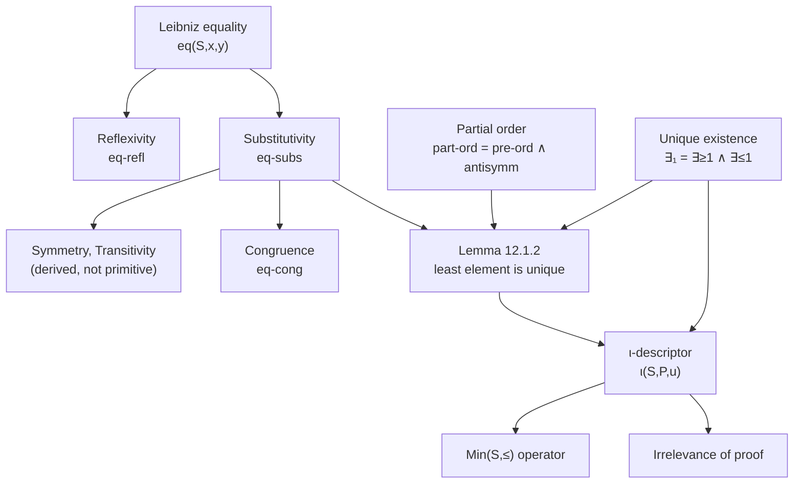

[[book-guidelines|↩ Back to guidelines]]

## Why this chapter exists: a lemma you already know, that you cannot yet write down

Here is a lemma that feels almost too obvious to prove: *a partially ordered set has at most one least element*. You've internalized this since your first proof-based course. The informal argument is three lines: suppose $m_1$ and $m_2$ are both least elements; then $m_1 \le m_2$ and $m_2 \le m_1$; antisymmetry gives $m_1 = m_2$. Done.

Now try to hand that proof to λD — the system built up over the previous eleven chapters, where propositions are types and proofs are terms. You immediately hit a wall, and it's an instructive wall. The book's own first attempt (Figure 12.1) gets exactly two lines in before stalling:

$$a_3(S, m_1, m_2, u, v) := t_3 : m_1 = m_2$$

What is $t_3$? You don't know, because **you don't have `=` yet**. Nothing in the previous eleven chapters defined equality. Nor do you have a way to say "$S$ has a least element" as a single proposition, nor a way to say that element is *unique*, nor — even if you did — a way to *name* it (to call it "the minimum" rather than awkwardly re-deriving "a least element" every time you need it).

This is the chapter's real subject. It isn't really about this one lemma — it's about the fact that **ordinary mathematical prose quietly assumes a pile of formal machinery that has to be built before you can formalize anything else**: equality, order, "exactly one," and naming. The book poses this as five explicit questions in §12.1 (Q1–Q5): what is `=`, what proves $m_1 = m_2$, how do you say "has a least element," how do you say "unique," and what's the actual proof object. This article follows the chapter as it answers each one in turn, and ends with the mechanism (the $\iota$-descriptor) that lets you name a thing once you've proved it's the only one of its kind.



## Leibniz equality: definition before axiom

### The intuition

The book poses the core question directly: *what does it mean for $x$ and $y$ (both of type $S$) to be "equal"?* The answer it adopts is due to Leibniz: two objects are equal exactly when they are **indiscernible** — there is no property that one has and the other lacks. If you cannot cook up any predicate $P$ that tells them apart, they're the same thing.

That's a definition you could just *postulate* as an axiom ("Leibniz's law"). The elegant move in λD is that you don't have to — because $\lambda D$ already has the machinery to state "for every predicate $P$, ..." as a $\Pi$-type, indiscernibility becomes something you can **write down and prove things about**, not something you must assume.

### The formal definition

$$\mathrm{eq}(S, x, y) :\equiv \Pi P {:} S \to *_p.\, (P\,x \Leftrightarrow P\,y) \qquad : *_p$$

with the notation $x =_S y$ for $\mathrm{eq}(S,x,y)$. Note this is a **second-order** definition — the $\Pi$ quantifies over predicates $P : S \to *_p$, not over elements of $S$. That's structurally different from the first-order $\forall$ used for ordinary mathematical statements (Ch. 5, 7); it needs the impredicative machinery of $\lambda C$/$\lambda D$ to even typecheck.

Reflexivity is nearly free once you have this: to inhabit $x =_S x$ you need, for arbitrary $P$, a proof of $P\,x \Leftrightarrow P\,x$ — which is just the identity function used twice:

$$\mathrm{eq\text{-}refl}(S,x) := \lambda P {:} S \to *_p.\, {\Leftrightarrow}\text{-}\mathrm{in}(Px, Px, \lambda u{:}Px.\,u,\ \lambda u{:}Px.\,u) : x =_S x$$

**What breaks without this precision:** an *ad hoc*, informally-stated notion of equality lets you silently assume properties of `=` that you never actually established (symmetry, congruence, substitutivity) — exactly the kind of gap a proof checker cannot tolerate. Leibniz equality forces you to *derive* every one of those properties from a single two-line definition, so nothing sneaks in unproved.

### Grounding

Lean is the most literal match here, because Lean's own kernel equality, `Eq`, *is* essentially this idea (Lean actually defines `Eq` inductively with a single constructor `Eq.refl`, but the Leibniz formulation and the inductive formulation are provably equivalent — Leibniz equality is the "motive" you get by taking $P$ to be a general elimination motive). More importantly for your elaborator project: when Lean's kernel needs to check `x = y`, it isn't running the Leibniz $\Pi$-quantifier over all predicates — that would be computationally hopeless. It runs **definitional equality** (`isDefEq`): reduce both sides and compare syntactically up to $\alpha\beta\delta$-conversion. Leibniz/propositional equality (`Eq`, what you *prove*) and definitional equality (what the kernel *computes*) are two different, related notions — this chapter is entirely about the former, but keep the distinction sharp, because Chapter 9's $\delta$-conversion was building the latter.

```lean
-- Lean's own equality is (up to definitional unfolding) the inductive
-- version of exactly this Leibniz definition:
theorem eq_is_leibniz {S : Type} (x y : S) :
    (x = y) ↔ (∀ P : S → Prop, P x ↔ P y) := by
  constructor
  · intro h P; rw [h]  -- rfl-based rewriting: definitional equality doing the work
  · intro h; exact (h (· = x)).mpr rfl |>.symm
```

```python
# Python has no type-level Pi, so the closest you can get is a
# *runtime* indiscernibility check over a finite battery of predicates —
# illustrative only, not load-bearing, since it can never be exhaustive:
def leibniz_equal(x, y, predicates):
    return all(p(x) == p(y) for p in predicates)
```

Rust doesn't have a natural analogue for second-order quantification over predicates as a *type-level* proposition (no dependent $\Pi$), so this construct is intentionally skipped on the Rust side — forcing a strained `trait`-based encoding would obscure rather than illuminate the point, per the book's own admission that this quantifier "cannot be covered by the first order $\forall$-symbol."

## Substitutivity: the operational content of equality

### The intuition

Leibniz equality as *stated* is a universal claim over all predicates. Substitutivity is what you actually *use* day to day: "if $x =_S y$ and $P$ holds of $x$, then $P$ holds of $y$." It's the license to replace $t_1$ by $t_2$ anywhere in a proposition once you know $t_1 =_S t_2$, without worrying about truth value changing.

### The formal derivation

Substitutivity isn't a new axiom — it drops straight out of the definition of `eq` by unfolding and applying one direction of the biimplication:

$$\mathrm{eq\text{-}subs}(S, P, x, y, u, v) := ({\Leftrightarrow}\text{-}\mathrm{el}_1(Px, Py, u\,P))\,v \;:\; P\,y$$

where $u : x =_S y$ (so $u\,P : Px \Leftrightarrow Py$, by instantiating the $\Pi$ at $P$) and $v : Px$.

**What breaks without this:** without a derived substitutivity lemma, every single "replace equals by equals" step in a later proof would require re-deriving indiscernibility from scratch by hand-crafting a fresh $\Pi$-instantiation — utterly unworkable at any real proof scale. This is the single most-used lemma in the rest of the book (it directly derives symmetry, transitivity, and congruence, all below).

### Grounding

```rust
// Rust has no propositions-as-types by default, but this is exactly what
// a verifier's substitution rule looks like as a checker function: given a
// proof token that x == y (opaque, not runtime-inspectable) and a proof that
// P(x) holds, produce a proof that P(y) holds — a pure rewrite, no computation.
struct Eq<S> { lhs: S, rhs: S } // proof-carrying witness, not a bool

fn eq_subs<S, P>(_u: &Eq<S>, proof_px: P) -> P {
    // in a real verifier this would be a typed AST rewrite guarded by `_u`,
    // never actual runtime substitution of values
    proof_px
}
```

```lean
-- This is Lean's `▸` (triangle) rewrite operator, almost verbatim:
example {S : Type} {P : S → Prop} {x y : S} (u : x = y) (v : P x) : P y :=
  u ▸ v
```

## Congruence: substitutivity applied to functions, not predicates

### The intuition

Substitutivity replaces terms *inside propositions*. Congruence is the companion fact for ordinary functions: if $f : S \to T$ and $x =_S y$, then $f\,x =_T f\,y$ — "equality is a congruence for function application." It looks similar to substitutivity but is a distinct property (functions with a *set* codomain, versus predicates with a *proposition* codomain), and the book derives it from substitutivity in two different ways — worth walking through both, because the *second* method is the one you'll reuse constantly.

### Proof 1: unfold the goal

$f\,x =_T f\,y$ unfolds (by definition of `eq`) to $\Pi Q{:}T\to *_p.\,(Q(f\,x) \Leftrightarrow Q(f\,y))$. Raise a flag $Q : T \to *_p$; substitutivity on the predicate $\lambda z{:}S.\,Q(f\,z)$, using $x=_Sy$, turns a proof of $Q(fx)$ into one of $Q(fy)$:

$$\mathrm{eq\text{-}cong}_1(S,T,f,x,y,u) := \lambda Q{:}T{\to}*_p.\,\lambda v{:}Q(fx).\, \mathrm{eq\text{-}subs}(S,\lambda z{:}S.\,Q(fz),x,y,u,v) \;:\; fx =_T fy$$

### Proof 2: the "clever predicate" trick — the one to internalize

Instead of unfolding, apply substitutivity *directly* to the goal, choosing a predicate that makes the goal fall out by mere $\beta$-conversion. Define $Q_1(S,T,f,x) := \lambda z{:}S.\,(fx =_T fz)$. Note $Q_1\,x \to_\beta (fx =_T fx)$, provable by reflexivity, and $Q_1\,y \to_\beta (fx =_T fy)$, exactly the goal:

$$\mathrm{eq\text{-}cong}_2(S,T,f,x,y,u) := \mathrm{eq\text{-}subs}(S,\, Q_1(S,T,f,x),\, x,\, y,\, u,\, \mathrm{eq\text{-}refl}(T,fx)) \;:\; fx =_T fy$$

This "find a predicate $Q$ such that $Qx$ is definitionally the thing you already have and $Qy$ is definitionally the goal" pattern recurs throughout the chapter — it's exactly how symmetry and transitivity of equality get derived below (§12.5), by choosing $Q_2(S,x) := \lambda z{:}S.\,(z =_S x)$ and $Q_3(S,x) := \lambda w{:}S.\,(x =_S w)$ respectively, rather than treating symmetry/transitivity as separate primitives.

**What breaks without this:** if congruence weren't derivable from substitutivity, you'd need it as a *second* primitive axiom about equality, duplicating proof effort every time a new type of "structure-preserving" replacement showed up (function congruence, relation congruence, ...). Deriving it once, generically over any $f : S \to T$, is what makes the equality machinery reusable instead of ad hoc per-theorem.

### Grounding

```rust
// congruence is the mathematical justification behind `.map()` preserving
// meaningful equalities: if x == y then f(x) == f(y) is exactly what lets
// you refactor `f(x)` to `f(y)` anywhere without changing program behavior —
// the "clever predicate" trick is the abstract shape of an equational
// rewrite/lemma-application pass in a compiler.
fn congruence_preserves_eq<S: PartialEq, T: PartialEq>(f: impl Fn(&S) -> T, x: &S, y: &S) -> bool {
    x != y || f(x) == f(y) // vacuously true unless x == y; the real content
                            // is the *proof*, not this runtime check
}
```

```lean
-- Lean's `congrArg` is literally eq-cong: propagate an equality through a function.
example {S T : Type} (f : S → T) {x y : S} (u : x = y) : f x = f y :=
  congrArg f u
```

## Partial orders: the second relation the lemma needs

The lemma also uses $\le$, which the book formalizes generically as any relation $\le : S \to S \to *_p$ satisfying the familiar package (Figure 12.7):

$$
\begin{aligned}
\mathrm{refl}(S,\le) &:\equiv \forall x{:}S.\,(x \le_S x) \\
\mathrm{trans}(S,\le) &:\equiv \forall x,y,z{:}S.\,(x\le_S y \Rightarrow y\le_S z \Rightarrow x\le_S z) \\
\mathrm{pre\text{-}ord}(S,\le) &:\equiv \mathrm{refl}(S,\le) \wedge \mathrm{trans}(S,\le) \\
\mathrm{antisymm}(S,\le) &:\equiv \forall x,y{:}S.\,(x\le_S y \Rightarrow y \le_S x \Rightarrow x =_S y) \\
\mathrm{part\text{-}ord}(S,\le) &:\equiv \mathrm{pre\text{-}ord}(S,\le) \wedge \mathrm{antisymm}(S,\le)
\end{aligned}
$$

Nothing exotic here, but notice the payoff structure: `part-ord` is defined as a *[[The-Curry-Howard-Isomorphism#Conjunction|conjunction]] of propositions*, which is itself a type (via the second-order encoding of $\wedge$ from Chapter 7). So `r : part-ord(S, ≤)` is a single proof object that packages reflexivity, transitivity, *and* antisymmetry together — and $\wedge$-elimination is how you pull the piece you need out of it, as the proof below does.

### Assembling the lemma: skeleton first, then fill

The book's methodology (already previewed in Chapter 11, §11.7's parameter-list conventions) is to write a **skeleton proof** — just the flags and the goal types, with `...` for proof objects — before filling anything in (Figure 12.8):

```
S : *s
  ≤ : S → S → *p
    r : part-ord(S, ≤)
      m₁, m₂ : S
        u : ∀n:S.(m₁ ≤ n) | v : ∀n:S.(m₂ ≤ n)
(1)          ... : m₁ ≤ m₂
(2)          ... : m₂ ≤ m₁
(3)          ... : pre-ord(S,≤) ∧ antisymm(S,≤)
(4)          ... : antisymm(S,≤)
(5)          ... : ∀x,y:S.(x≤y ⇒ y≤x ⇒ x=y)
(6)          ... : m₁≤m₂ ⇒ m₂≤m₁ ⇒ m₁=m₂
(7)          ... : m₂≤m₁ ⇒ m₁=m₂
(8)          ... : m₁=m₂
```

Filling in (Figure 12.9): (1) is `u m₂` (instantiate the $\forall$-hypothesis directly at $m_2$), (2) is `v m₁`, (3)–(5) pull `antisymm` out of `r` via $\wedge$-elimination, (6)–(8) are three ordinary function applications chaining implication. Every `...` gets replaced by an actual term:

$$a_9(S,\le,r) := \lambda m_1,m_2{:}S.\,\lambda u{:}\ldots.\,\lambda v{:}\ldots.\,a_8 \;:\; \forall m_1,m_2{:}S.\big((\forall n.\,m_1\le n)\Rightarrow(\forall n.\,m_2\le n)\Rightarrow m_1=_Sm_2\big)$$

**What breaks without the skeleton-then-fill discipline:** without deliberately separating "what type does each step need to have" from "what term inhabits it," a formalizer conflates two genuinely different questions (proof search and proof-object construction) and ends up stuck on both simultaneously. This same two-phase discipline scales up to the book's capstone (Bézout's Lemma, Ch. 15), which is developed with nine explicit *holes* left open exactly this way.

### Grounding

```rust
// A checker/verifier encoding of a partial order as a trait contract —
// this is the shape your Hoare-triple verifier's order reasoning will take:
trait PartialOrderProof<S> {
    fn refl(&self, x: &S) -> bool;
    fn trans(&self, x: &S, y: &S, z: &S) -> bool;
    fn antisymm(&self, x: &S, y: &S) -> bool; // x<=y && y<=x => x==y
}
```

```lean
-- Lean/mathlib's `PartialOrder` class is definitionally this same bundle:
-- le_refl, le_trans, le_antisymm — the book's part-ord is the mathlib
-- typeclass minus the syntactic sugar.
example {S : Type} [PartialOrder S] (a b : S) (h1 : a ≤ b) (h2 : b ≤ a) : a = b :=
  le_antisymm h1 h2
```

## Unique existence: from "at least one" to "exactly one"

### The intuition

The lemma's conclusion — "the least element is unique" — needs a quantifier the book hasn't built yet. Plain $\exists$ only says "at least one." "At most one" is a *separate* idea, standardly phrased as "any two witnesses coincide":

$$\forall y,z{:}S.\,(Py \Rightarrow Pz \Rightarrow y=_Sz)$$

"Exactly one" is just the conjunction of both halves (Figure 12.14):

$$
\begin{aligned}
\exists_{\ge 1}(S,P) &:\equiv \exists(S,P) \\
\exists_{\le 1}(S,P) &:\equiv \forall y,z{:}S.\,(Py \Rightarrow Pz \Rightarrow y=_Sz) \\
\exists_1(S,P) &:\equiv \exists_{\ge 1}(S,P) \wedge \exists_{\le 1}(S,P)
\end{aligned}
$$

with $\exists^{\le 1} x{:}S.\,Px$ and $\exists_1 x{:}S.\,Px$ as infix sugar for the same thing.

Here's the payoff: the type in the earlier proof, line (9) of Figure 12.9 — $\forall m_1,m_2{:}S.\,((\forall n.\,m_1\le n)\Rightarrow(\forall n.\,m_2\le n)\Rightarrow m_1=_Sm_2)$ — is *literally* $\exists_{\le 1}x{:}S.\,\mathrm{Least}(S,\le,x)$ once you take $P := \lambda m{:}S.\,\mathrm{Least}(S,\le,m)$ and unfold. The proof you already built for Lemma 12.1.2's core is, up to $\mathrm{conv}$-rule unfolding, already a proof of "at most one least element." Adding the assumption $w : \exists_{\ge 1}x{:}S.\,\mathrm{Least}(S,\le,x)$ ("there is one") and combining with $\wedge$-in gives the complete lemma (Figure 12.15):

$$a_{11}(S,\le,r,w) := \wedge\text{-}\mathrm{in}(\exists_{\ge 1}\ldots,\ \exists_{\le 1}\ldots,\ w,\ a_{10}) \;:\; \exists_1 x{:}S.\,\mathrm{Least}(S,\le,x)$$

This is a good moment to internalize the book's general theorems-as-definitions observation: if $\Gamma \Vdash a(\overline{x}) := N : *_p$ and $\Gamma \Vdash b(\overline{x}) := M : N$ are both derivable, then $a$ (or $N$) *is* a theorem and $b$ (or $M$) *is* its proof, in context $\Gamma$ — the same PAT-interpretation from Chapter 5, just made explicit as a naming convention. This directly connects back to Chapter 8's transformation of ordinary judgements $\Gamma \vdash M : N$ into definition format $\Gamma \Vdash a(\ldots) := M : N$: a formalized mathematical text really is nothing more than a growing list of such definitions.

### Grounding

```lean
-- Lean's ∃! binder is precisely ∃₁, and `ExistsUnique.intro`/`.elim`
-- mirror the ∧-in/∧-el bookkeeping the book does by hand:
example {S : Type} (P : S → Prop) (w : ∃! x, P x) :
    ∃ x, P x ∧ ∀ y, P y → y = x :=
  w
```

```rust
// Rust doesn't have propositions, but the *pattern* — "at most one"
// checked separately from "at least one" — is exactly how you'd implement
// a uniqueness-checked lookup:
fn find_unique<T: PartialEq>(items: &[T], pred: impl Fn(&T) -> bool) -> Option<&T> {
    let mut found: Option<&T> = None;
    for item in items {
        if pred(item) {
            if found.is_some() { return None; } // "at most one" violated
            found = Some(item);
        }
    }
    found // Some(x) only if existence *and* uniqueness both hold
}
```

## The $\iota$-descriptor: naming the thing you proved is unique

### The intuition

Once you know a least element is unique, ordinary mathematical practice does something informal proofs take for granted: it gives the thing a *name* — "the minimum," $\mathrm{Min}(S)$ — and starts treating that name as an ordinary term, not as "some element satisfying such-and-such property, remembered alongside a uniqueness proof." The book's $\iota$-operator (pronounced "iota," due to Frege, later used by Russell and Church for "definite descriptions") formalizes exactly this move: $\iota_{x\in S}(P(x))$ denotes *the* unique $x{:}S$ satisfying $P$.

**Why unique existence has to come first, structurally, not just pedagogically:** $\iota$ is only well-defined given a proof of $\exists_1$. Without uniqueness, "the element satisfying $P$" would be ambiguous — which is precisely why the previous section had to exist before this one could.

### The formal machinery — and why it's primitive

λD adds $\iota$ as a **primitive** constant (Figure 12.16), not a descriptive (unfoldable) one:

$$
\begin{aligned}
\iota(S,P,u) &:= \bot\!\!\bot : S \qquad \text{(notation: } \iota_{x:S}^u(Px) \text{)}\\
\iota\text{-}\mathrm{prop}(S,P,u) &:= \bot\!\!\bot : P(\iota_{x:S}^u(Px))
\end{aligned}
$$

The $\bot\!\!\bot$ (from Chapter 10's primitive-definition machinery) marks that there is no definiens to unfold to — you cannot compute $\iota(S,P,u)$ down to some canonical normal form; it's simply *assumed* to exist as an inhabitant of $S$, together with a primitively-assumed proof (`ι-prop`) that it actually satisfies $P$. This mirrors exactly how Chapter 10 introduced the natural numbers themselves ($N, 0, s$) as primitive, unfoldable-to-nothing constants justified externally rather than derived internally.

With this, the minimum operator is one line (Figure 12.18):

$$\mathrm{Min}(S,\le,r,w) := \iota\big(S,\ \lambda m{:}S.\,\mathrm{Least}(S,\le,m),\ a_{11}(S,\le,r,w)\big) : S$$

and Lemma 12.7.1 — "if $\exists_1 x{:}S.\,Px$, then any $z$ satisfying $P$ equals the described element" — cashes out the whole point: once you know something is unique, *anything* satisfying the defining property must be *that same thing*, provable by pulling the "at most one" half out of the $\exists_1$ proof and instantiating it against the witness $\iota_{x:S}^u(Px)$ (which is itself guaranteed to satisfy $P$, via `ι-prop`).

### Load-bearing for the elaborator project

This is one of the most directly relevant mechanisms in the book for the metaprogramming-elaborator target: $\iota$ is, structurally, exactly what a metavariable-resolution step does when unification determines there is exactly one admissible solution. The book's own further-reading section explicitly contrasts $\iota$ with Hilbert's weaker $\varepsilon$-operator (which only needs *existence*, not uniqueness — closer to unconstrained metavariable assignment) and with the Axiom of Choice (arbitrary choice from a family of nonempty sets, with no uniqueness or definability guarantee at all — the *least* constrained of the three). When your elaborator resolves an implicit argument via Miller-pattern unification, the "pattern" restriction is precisely what buys you the $\iota$-style guarantee — a *unique* most-general solution — rather than merely an $\varepsilon$-style "some solution exists, pick one." Keeping these three operators ($\iota$, $\varepsilon$, choice) distinct in your head is worth the effort; conflating them is a common source of subtly broken elaborator designs.

### Irrelevance of proof

A sharp question follows immediately: does $\iota(S,P,u)$ depend on *which* proof $u$ of $\exists_1 x{:}S.\,Px$ you happened to supply? If $u_1 \ne u_2$ are two different uniqueness proofs, could $\iota(S,P,u_1)$ and $\iota(S,P,u_2)$ actually be different elements? The book proves not: both satisfy $P$ (via `ι-prop`), and since there's *exactly one* element satisfying $P$ (which both proofs independently certify), $\iota(S,P,u_1) =_S \iota(S,P,u_2)$ follows using either proof. This is called **irrelevance of proof**: the described element depends on the *existence* of a uniqueness proof, not on the proof's internal content. Note carefully — the book adds no *global* proof-irrelevance axiom (that would collapse all proofs of any one proposition to a single value everywhere); irrelevance is established locally, case by case, as a *consequence* of $\iota$'s definition. (It resurfaces in Chapter 14, §14.13, for `gcd` and subtraction, both defined via $\iota$.)

### Grounding

```lean
-- Lean's closest primitive is `Classical.choose`, but note the mismatch:
-- Classical.choose only needs ∃ (Hilbert's ε-flavor), not ∃!, and Lean's
-- own proof irrelevance for Prop is a *global*, built-in axiom — stronger
-- than what the book deliberately chooses to assume here.
noncomputable def theMin {S : Type} (P : S → Prop) (u : ∃! x, P x) : S :=
  u.choose  -- Lean derives this from Exists.choose plus the uniqueness half

-- Global proof irrelevance is baked into Lean's `Prop` universe already:
example {p : Prop} (h1 h2 : p) : h1 = h2 := rfl
```

```rust
// There is no honest Rust encoding of a *primitive, non-computable*
// description operator — Rust values must be constructed, not merely
// asserted to exist. The nearest real-world analogue is a checked
// "resolve or panic if not unique" API used at the boundary between
// proof search and execution:
fn the_unique<T, P: Fn(&T) -> bool>(candidates: Vec<T>, p: P) -> T {
    let mut matches: Vec<T> = candidates.into_iter().filter(|x| p(x)).collect();
    assert_eq!(matches.len(), 1, "description operator requires unique witness");
    matches.pop().unwrap()
}
```

## Where this leads

This chapter is small in surface area — one definition, one lemma, one operator — but nearly everything downstream depends on it:

- **Chapter 13 (Sets, Relations, Maps)** reuses `eq` immediately for subset equality on the powerset, and reuses partial-order-style relational packaging for equivalence relations.
- **Chapter 14 (Arithmetic)** leans on $\iota$ constantly and non-optionally: the integer predecessor $p(y) := \iota x{:}Z.\,(sx=y)$, subtraction $x-y := \iota z{:}Z.\,(z+y=x)$, and `gcd` are *all* defined via $\iota$ applied to a uniquely-existing witness, with irrelevance of proof invoked by name in §14.13 to justify that these operators are well-defined regardless of which uniqueness proof was used to construct them.
- **Chapter 15 (Bézout's Lemma)** builds its entire capstone proof around a `minimum` operator defined exactly as `Min` is here, applied to a subset of $\mathbb{Z}$ — this chapter's Figure 12.18 is a direct template for that later, much larger, construction.

More broadly, this chapter is the moment the book demonstrates something the earlier, purely logical chapters (5–11) couldn't show on their own: that $\lambda D$'s definition mechanism isn't just a convenience for shortening proof terms — it's the thing that lets ordinary mathematical *vocabulary* ("the minimum," "equal," "at most one") exist as first-class, nameable objects in the formal text, rather than as informal shorthand papered over an underlying mess of raw $\Pi$-terms.
