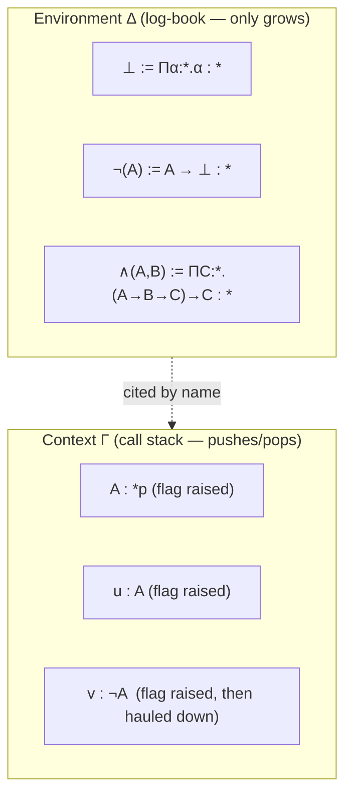

[[book-guidelines|↩ Back to guidelines]]

# Natural Deduction in Flag Style

## The bookkeeping problem tree-style proofs create

Every logical connective in the book has already been given a Curry–Howard encoding by the time Chapter 11 opens: $\bot \equiv \Pi\alpha{:}{*}.\alpha$, $\neg A \equiv A \to \bot$, $A \wedge B \equiv \Pi C{:}{*}.(A \to B \to C) \to C$, and so on (Chapter 7). Under that encoding, every logical proof *is* a $\lambda C$-derivation, built line by line with the seven rules (sort), (var), (weak), (form), (appl), (abst), (conv). That works, but it comes with a cost the book is candid about: "when using the tree format of the $\lambda D$-rules, one is obliged to proceed in a meticulous manner" (§11.12) — every single step, including the administrative ones that just thread the type-formation machinery through, has to be written out and justified against a specific rule name.

Concretely: a term like $u\,y\,v$ arising from a chain of two applications gets annotated with **(appl)** twice in a row. But logically, the first application is a use of $\forall$-elimination (instantiating a universally quantified statement at a witness) and the second is a use of $\Rightarrow$-elimination (modus ponens). The rule name `(appl)` is *true* but it is not *informative* — it tells you a function got applied to an argument, not which logical inference that application encodes. Symmetrically, every `(abst)` conceals whichever introduction rule — $\Rightarrow$-intro, $\forall$-intro, $\neg$-intro — happens to be riding on top of the raw lambda-abstraction.

**What breaks without flag-style natural deduction:** nothing breaks *formally* — a bare $\lambda C$/$\lambda D_0$ derivation is complete and correct — but it becomes opaque to the human reading it. You can verify each step is a legal instance of (appl) or (abst), yet lose the thread of *why* the proof works, because the connection to modus ponens, universal instantiation, or proof-by-contradiction has been erased by the encoding. That's precisely the gap Chapter 11 closes: it doesn't add expressive power (the underlying $\lambda D$ system is unchanged), it adds a *presentation* layer — named constants for each natural-deduction rule, and the flag notation for tracking scope — that makes the logical skeleton of a derivation visible again.

This is worth contrasting with a compiler analogy from the outset, since it recurs throughout this article: the situation is exactly the difference between reading raw assembly (every step correct, structure invisible) and reading a stack trace annotated with source-level function names (`parse_expr`, `unify`, `elaborate_binder`). The underlying computation is identical; only the *names attached to the steps* differ, and that's the whole value proposition of flag-style natural deduction in $\lambda D$.

## Flags: contexts as a visual stack

The book's flag notation was already introduced back in §2.5 for plain typing derivations, and Chapter 11 (§11.3) formalizes exactly how it interacts with the *definition* mechanism introduced in Chapters 8–10. A flag is a vertical bar with a pole: raising a flag corresponds to extending the context $\Gamma$ with a new declaration (either a fresh variable $x : A$, or a hypothesis to be discharged later), and every line written under that flag's pole is implicitly proved relative to that extended context. When the flag is "hauled down" — the proof exits its scope — the corresponding declaration is dropped from $\Gamma$ again.

The book states this precisely as an evolving pair $\{\Delta \mid \Gamma\}$ of an *environment* $\Delta$ (the accumulated list of definitions — logical rules, lemma names, everything proved so far) and a *context* $\Gamma$ (the currently active local assumptions):

```
{∅ | ∅}
(a)  x1 : A1
       {∅ | x1 : A1}
(b)    x2 : A2
         {∅ | x1 : A1, x2 : A2}
(1)     a(x1, x2) := M1 : N1
         {x1:A1, x2:A2 ⊢ a(x1,x2):=M1:N1 | x1:A1, x2:A2}
       {x1:A1, x2:A2 ⊢ a(x1,x2):=M1:N1 | x1:A1}
(2)   b(x1) := M2 : N2
       {x1:A1,x2:A2 ⊢ a(x1,x2):=M1:N1, x1:A1 ⊢ b(x1):=M2:N2 | x1:A1}
```

The critical asymmetry, stated explicitly as **Remark 11.3.1**, is: *the context $\Gamma$ grows and shrinks like a stack; the environment $\Delta$ only ever grows.* Once a definition is added to $\Delta$ — whether it's a basic logical connective, an introduction rule, or a proved lemma — it is never erased. There is, the book notes, no derivation rule for deleting a definition (though the Condensing Lemma of §10.4 shows dropping unused ones is *semantically* safe, it's just not part of the official machinery). The intuitive picture the book offers: $\Delta$ behaves like the growing "log-book" of a mathematics text — once a fact is on the page, later pages may cite it by name — while $\Gamma$ behaves like the call stack of the *specific proof currently being read*, which pushes an assumption when you write "suppose $A$" and pops it when that sub-argument is closed off.



### Grounding: contexts as a Rust call stack, definitions as a crate

The $\Gamma$/$\Delta$ split maps almost literally onto a familiar pattern. Think of $\Gamma$ as the stack of local bindings visible at the point of a recursive-descent proof search — every time you open a new scope (`{ ... }` in Rust, a `fun`/`let` binder, or here, raising a flag with `assume A : Prop`), you push a frame; when the scope closes, the frame pops and those bindings are gone. $\Delta$, by contrast, is like a crate of already-compiled, already-typechecked items: `pub fn and_intro(...)`, `pub fn or_elim(...)` — once compiled, they stay linkable from anywhere for the rest of the program, regardless of which local scope you're currently inside.

```rust
// Γ: a stack of local hypotheses, pushed/popped like scopes
fn prove_a_implies_not_not_a(a_type: Prop) -> Proof<Implies> {
    // flag raised: A : *p is already in scope as `a_type`
    let u: Proof<A>;                       // (b) flag: u : A
    {
        let v: Proof<Not<A>>;              // (c) flag: v : ¬A  -- pushed
        let a1 = not_el(v, u);             // uses Δ-definition ¬-el, cited by name
        // (c) flag hauled down: v drops out of scope here
    }
    let a2 = not_in(/* λv. a1 */);         // Δ-definition ¬-in
    implies_in(/* λu. a2 */)               // Δ-definition ⇒-in
}
```

`not_el`, `not_in`, `implies_in` are exactly $\Delta$-citizens: defined once (in Chapter 11's rule figures), reusable everywhere, never "un-defined." `u` and `v` are exactly $\Gamma$-citizens: scoped, pushed, popped.

### Grounding: the same shape in Lean

Lean's tactic-mode proof state is the flag notation with the serial numbers filed off — a Lean goal state literally displays as a growing local context above a turnstile, and `intro` / done-block-closing directly mirror flag-raising / flag-hauling:

```lean
theorem a_implies_not_not_a (A : Prop) : A → ¬¬A := by
  intro u        -- flag raised: u : A
  intro v        -- flag raised: v : ¬A
  exact v u      -- ¬-el, cited from the (Δ-resident) library
  -- both flags haul down as the tactic block closes
```

Lean's *environment* (the set of declared theorems and definitions available for citation, accumulated across the whole file/import graph) is a direct, essentially unmetaphorical analogue of the book's $\Delta$: it only grows, and every `theorem`/`def` you state becomes citable by name from that point forward, exactly like the book's growing log-book.

## The core convention: every line is a definition

Chapter 11's most consequential stylistic decision (§11.3, end) is this rule, stated as a boxed convention:

> *In a flag derivation, we turn every statement relative to a certain context into a definition, by choosing a new defined name and appending that name in front of the statement.*

So instead of writing a bare judgement $\Gamma \vdash M : N$, a flag derivation always writes $\Gamma \vdash c(\overline{x}) := M : N$ — giving the term $M$ a name $c$, parametrized over the free variables $\overline{x}$ currently on the flagpole. This single convention is what turns $\lambda D$'s formal rule set (which distinguishes plain judgements from definitions via separate rules (form)/(appl)/(abst) versus (def)/(par)) into the streamlined, "all one format" presentation used from here to the end of the book. A line of the form $c(\overline{x}) := M : N$ carries three claims simultaneously (§11.3):

1. $M : N$ is derivable relative to $\Delta$ and $\Gamma$;
2. the definition itself gets appended to $\Delta$;
3. as a consequence, $c(\overline{x}) : N$ is now *also* derivable, in the (slightly larger) environment $\Delta, D$.

The book's own worked micro-example (§11.1–11.2) shows this convention actually collapsing real derivation steps. A four-line official $\lambda D_0$ derivation of $\neg$'s definition —

```
(3)  Πα:*.α : *                     (form)
(D1) ⊥() := Πα:*.α : *              definition
(4)  ⊥() : *                        (par) on (3),(D1)
(a)  A:*
(6)   A:*                           (var)
(b)     y:A
(8)      ⊥() : *                    (weak), twice
(9)    A → ⊥() : *                  (form) on (6),(8)
(D2)   ¬(A) := A → ⊥() : *          definition
(10)   ¬(A) : *                     (par) on (9),(D2)
```

condenses, once the "almost-duplicate" triples like (3)-(D1)-(4) are collapsed and the merely-mechanical lines (6),(8) are dropped, into just:

```
(D1) ⊥() := Πα:*.α : *        (form) and (par)
(a)  A:*
(D2)  ¬(A) := A → ⊥() : *     (form) and (par)
```

— which is, verbatim, the presentation the book already used informally for $\bot$ and $\neg$ back in §11.1 and Chapter 7. The formal apparatus and the "obviously correct" informal shorthand turn out to be the same thing once you know the convention that licenses the compression.

## Introduction and elimination rules for the connectives

With the convention fixed, Chapter 11 works systematically through the constructive rules, naming each one as a $\Delta$-resident constant. All of them are *literal repackagings* of the second-order encodings from Chapter 7 — nothing new is proved, existing proof terms are just given rule-shaped names.

**$\Rightarrow$** (§11.5, Fig. 11.5) — since $A \Rightarrow B$ is by definition $A \to B$:
$$
\Rightarrow\text{-in}(A,B,u) := u : A \Rightarrow B \qquad (u : A \to B)
$$
$$
\Rightarrow\text{-el}(A,B,u,v) := u\,v : B \qquad (u : A \Rightarrow B,\ v : A)
$$
This is modus ponens, spelled out as function application — $\Rightarrow$-elimination *is* the (appl) rule, just given a logical name.

**$\bot$ and $\neg$** (§11.5, Figs. 11.6–11.7): with $\bot \equiv \Pi A{:}{*_p}.A$,
$$
\bot\text{-in}(A,u,v) := v\,u : \bot \qquad (u:A,\ v:A\Rightarrow\bot) \qquad\qquad \bot\text{-el}(A,u) := u\,A : A \qquad (u:\bot)
$$
$\bot$-elimination — "from a contradiction, anything follows" (*ex falso quodlibet*) — is exactly instantiating the universally-quantified $\bot$ at the desired proposition $A$; it falls straight out of the second-order encoding. $\neg$-in and $\neg$-el are literally special cases of $\Rightarrow$-in/el with $B := \bot$.

**$\wedge$ and $\vee$** (§11.5, Figs. 11.10–11.11) — these are the connectives where the natural-deduction rule name earns its keep, because the raw proof objects are genuinely longer than the rule names:
$$
\wedge(A,B) := \Pi C{:}{*_p}.(A\Rightarrow B\Rightarrow C)\Rightarrow C
$$
$$
\wedge\text{-in}(A,B,u,v) := \lambda C{:}{*_p}.\lambda w{:}A\Rightarrow B\Rightarrow C.\,w\,u\,v : A\wedge B \qquad (u:A,\ v:B)
$$
$$
\wedge\text{-el}_1(A,B,u) := u\,A\,(\lambda v{:}A.\lambda w{:}B.\,v) : A \qquad\qquad \wedge\text{-el}_2(A,B,u) := u\,B\,(\lambda v{:}A.\lambda w{:}B.\,w) : B
$$
$$
\vee(A,B) := \Pi C{:}{*_p}.(A\Rightarrow C)\Rightarrow(B\Rightarrow C)\Rightarrow C
$$
$$
\vee\text{-in}_1(A,B,u):=\lambda C{:}{*_p}.\lambda v{:}A\Rightarrow C.\lambda w{:}B\Rightarrow C.\,v\,u : A\vee B \qquad (u:A)
$$
$$
\vee\text{-el}(A,B,C,u,v,w) := u\,C\,v\,w : C \qquad (u:A\vee B,\ v:A\Rightarrow C,\ w:B\Rightarrow C)
$$
Note the reversal the book flags explicitly: for $\vee$-elimination, the *rule-named* proof object ($u\,C\,v\,w$) is actually *shorter* than for the connectives above — an exception the book calls out precisely because it's atypical.

**$\Leftrightarrow$** (§11.5, Fig. 11.12) is defined as $(A\Rightarrow B)\wedge(B\Rightarrow A)$, so its four rules are literally $\wedge$'s rules pre-applied to that pair of implications — nothing new, just composition.

### Two styles, and when each wins

The book draws out an important tension (§11.5, contrasting Figs. 11.8 and 11.9): the *natural deduction style* (naming every rule) makes the logical structure legible but can produce longer terms; the *type-theoretic style* (writing raw unfolded lambda terms) is often shorter and is preferred specifically for $\Rightarrow$, $\bot$, $\neg$, $\forall$ — where unfolded proof objects are typically *smaller* than their rule-named counterparts. For $\wedge$, $\vee$, $\Leftrightarrow$, $\exists$ the balance flips because their second-order definientia are large, so naming the rule genuinely compresses the term. This is a real engineering trade-off, not a stylistic flourish — it is the same trade-off a compiler author faces choosing between inlining a helper and calling it by name: inline when the body is trivial, name it when the body is large and the *name* communicates more than the expansion would.

### Grounding: introduction/elimination rules as trait methods

Rust's trait system gives a strikingly literal analogue for "introduction rule constructs the value, elimination rule consumes it":

```rust
trait And<A, B> {
    fn intro(a: A, b: B) -> Self;      // ∧-in
    fn el1(self) -> A;                  // ∧-el1
    fn el2(self) -> B;                  // ∧-el2
}

trait Or<A, B> {
    fn in1(a: A) -> Self;               // ∨-in1
    fn in2(b: B) -> Self;               // ∨-in2
    fn elim<C>(self, f: impl Fn(A) -> C, g: impl Fn(B) -> C) -> C; // ∨-el
}
```

`Or::elim` is exactly $\vee$-el's shape: consume a proof of $A \vee B$ together with a way to produce $C$ from either disjunct, and produce $C$ — this is Rust's `match` on an `enum Either<A,B>` in everything but name, which is itself the Curry–Howard image of $\vee$'s second-order encoding.

### Grounding: the constructive rules in Lean

Lean's `Prop`-level `And`/`Or` in its core library are *definitionally* the introduction/elimination pattern above (`And.intro`, `And.left`, `And.right`, `Or.inl`, `Or.inr`, `Or.elim`), and Lean's kernel checks proof terms built from them by exactly the same $\beta\delta$-style unfolding the book describes for $\lambda D$'s definitions — `Or.elim` unfolds to a `match`, which unfolds to the underlying eliminator, all checked by `isDefEq`.

## Constructive vs. classical propositional logic, and proof by contradiction

Everything so far is provable *without* any extra axiom — this is constructive (intuitionistic) logic, and $\lambda D_0$ (no primitive definitions) suffices. Classical logic requires one more ingredient: excluded middle or double negation, added as a genuine **axiom** — a primitive definition with empty definiens $\bot\!\!\bot$ (§11.8, Fig. 11.16):
$$
A:*_p \;\vdash\; \mathsf{exc\text{-}thrd}(A) := \bot\!\!\bot : A \vee \neg A
$$
From this single primitive, the book derives double negation elimination as a *theorem*, not a second axiom:
$$
\mathsf{doub\text{-}neg}(A) := \lambda u{:}\neg\neg A.\ \mathsf{exc\text{-}thrd}(A)\ A\ (\lambda v{:}A.v)\ (\lambda v{:}\neg A.\,\mathsf{doub\text{-}neg\text{-}helper})) : \neg\neg A \Rightarrow A
$$
(the full five-line derivation is Fig. 11.16; the shape is: case-split on $A \vee \neg A$ via $\vee$-el, and in the $\neg A$ branch derive a contradiction with the $\neg\neg A$ hypothesis, then eliminate $\bot$ into $A$). This licenses two extra named rules, $\neg\neg\text{-in}$ and $\neg\neg\text{-el}$ (Fig. 11.17) — $\neg\neg$-in is actually *constructive* (any $A$ constructively yields $\neg\neg A$, already shown in Fig. 11.9), while $\neg\neg$-el genuinely needs the axiom.

This gives the book's crisp statement of **proof by contradiction** (Remark 11.8.1) — worth quoting because it is the general pattern behind most of the classical examples that follow:

> To prove $A$, it suffices to assume $\neg A$, derive $\bot$, and conclude — because $\neg$-in followed by $\neg\neg$-el then yields $A$.

```
     ¬A
      ⋮
      ⊥
   ───────  (¬-in, then ¬¬-el)
      A
```

The book demonstrates this on a genuinely non-constructive tautology, $(\neg A \Rightarrow B) \Rightarrow (A \vee B)$ (Fig. 11.18): assume $\neg A \Rightarrow B$, then to reach the goal $A \vee B$, assume its negation $\neg(A\vee B)$ and drive both disjuncts to contradictions, landing on $\neg\neg(A\vee B)$, and finally apply $\neg\neg$-el. Note the explicit editorial warning attached to this pattern (Remark 11.8.1, continued): proof by contradiction should be used "with considerable care — namely only when no direct proof appears to be at hand," because reaching for it reflexively tends to produce needlessly indirect proofs.

### What breaks without the axiom

Without `exc-thrd` or `doub-neg`, $\neg\neg$-el is simply not derivable — this is the textbook boundary between intuitionistic and classical logic, and $\lambda D_0$ sits exactly on the intuitionistic side of it. This matters concretely for anyone building a proof checker: a kernel that only implements $\lambda D_0$'s rules is automatically a *constructive* logic checker, and classical reasoning becomes something a user must explicitly opt into by asserting the axiom (exactly as Lean's `Classical.em` is an opt-in axiom, not baked into the kernel).

### Grounding: proof by contradiction and `Classical.em` in Lean

```lean
theorem contradiction_pattern (A : Prop) (h : ¬A → False) : A := by
  by_contra hna   -- assume ¬A, goal becomes False
  exact h hna
-- under the hood, `by_contra` invokes Classical.byContradiction,
-- which is built from Classical.em — the exc-thrd axiom, named explicitly
```

Lean keeps `Classical.em` as a real, citable axiom (`#print axioms` will show it in a theorem's dependency list) rather than folding it silently into the kernel — the same design choice the book makes by introducing `exc-thrd` as a primitive definition rather than baking excluded middle into $\lambda D_0$'s rule set.

## Alternative rules for disjunction — trading witnesses for implications

Combining Figs. 11.13 and 11.18 gives a derivable biimplication, $(A \vee B) \Leftrightarrow (\neg A \Rightarrow B)$ (§11.9). The book leverages this to add a *second* set of introduction/elimination rules for $\vee$ (Fig. 11.19), justified purely as derived shorthand, not new logic:
$$
\vee\text{-in-alt}_1(A,B,u) : A\vee B \qquad (u : \neg A \Rightarrow B)
$$
$$
\vee\text{-in-alt}_2(A,B,v) : A\vee B \qquad (v : \neg B \Rightarrow A)
$$
$$
\vee\text{-el-alt}_1(A,B,u,v) : B \qquad (u : A\vee B,\ v : \neg A) \qquad\qquad \vee\text{-el-alt}_2(A,B,u,w) : A \qquad (u:A\vee B,\ w:\neg B)
$$

**Why this matters practically**: the ordinary $\vee$-in rule demands you already know *which* disjunct holds — a witness. That's frequently unavailable during proof search even when the [[The-Curry-Howard-Isomorphism#Disjunction|disjunction]] itself is true. The alternative rule sidesteps this: instead of proving $A$ or proving $B$ outright, you prove the strictly weaker $\neg A \Rightarrow B$ (if $A$ fails, $B$ holds) — a statement often much easier to establish directly. The book works two examples using exactly this move (Figs. 11.20–11.21) to establish the classical De Morgan biimplication $\neg(A\wedge B) \Leftrightarrow (\neg A \vee \neg B)$, where the forward direction needs $\vee$-in-alt precisely because no direct witness for $\neg A \vee \neg B$ is available from a bare $\neg(A\wedge B)$ hypothesis.

### Grounding: alt-rules as a fallback proof-search strategy

This is a proof-search heuristic worth encoding directly in a tactic engine: when a `∨`-goal resists direct introduction (no witness derivable), try instead to derive the goal as an implication from the negation of one side. In Rust-flavored pseudocode for a toy tactic dispatcher:

```rust
enum Tactic { OrIntroDirect, OrIntroAlt }

fn try_prove_or(goal: &Or, ctx: &Context) -> Option<Proof> {
    prove_left(goal.a, ctx)
        .map(Proof::or_in1)
        .or_else(|| prove_right(goal.b, ctx).map(Proof::or_in2))
        // direct witness search failed — fall back to the alt rule:
        .or_else(|| prove_implication(&not(goal.a.clone()), &goal.b, ctx)
                        .map(Proof::or_in_alt1))
}
```

This mirrors real tactic-engine design (e.g. Lean's `tauto`/`decide` internally try several rule shapes before giving up), and is a direct instance of the "weight toward mechanism" idea: the alt-rules aren't just a logical curiosity, they're literally a second dispatch branch a proof-search procedure needs.

## Predicate logic: $\forall$ and $\exists$

**$\forall$** (§11.10, Fig. 11.22) is definitionally $\Pi$, so its rules are close to trivial — $\forall$-in is (abst) and $\forall$-el is (appl), named:
$$
\forall(S,P) := \Pi x{:}S.\,P\,x \qquad\qquad \forall\text{-in}(S,P,u):=u:\forall x{:}S.Px\ \ (u:\Pi x{:}S.Px) \qquad\qquad \forall\text{-el}(S,P,u,v):=u\,v:Pv\ \ (u:\forall x{:}S.Px,\,v:S)
$$

**$\exists$** (§11.10, Fig. 11.23) uses the same second-order trick as $\wedge/\vee$:
$$
\exists(S,P) := \Pi A{:}{*_p}.\big((\forall x{:}S.(Px\Rightarrow A))\Rightarrow A\big)
$$
$$
\exists\text{-in}(S,P,u,v) := \lambda A{:}{*_p}.\lambda w{:}(\forall x{:}S.(Px\Rightarrow A)).\,w\,u\,v : \exists x{:}S.Px \qquad (u:S,\ v:Pu)
$$
$$
\exists\text{-el}(S,P,u,A,v) := u\,A\,v : A \qquad (u:\exists x{:}S.Px,\ v:\forall x{:}S.(Px\Rightarrow A))
$$

$\exists$-elimination is where a genuine *proof-search strategy* emerges, and the book states it as a reusable schema (§11.10):

```
    ⋮
    a(...) := ... : ∃x:S.Px
       x : S
         u : Px
           ⋮
           b(...,x,u) := ... : A
       c(...,x) := λu:Px. b(...,x,u) : Px ⇒ A
    d(...) := λx:S. c(...,x) : ∀x:S.(Px⇒A)
    e(...) := ∃-el(S,P,a(...),A,d(...)) : A
```

In words: given $\exists x{:}S.\,P(x)$ and a *goal* $A$ (that does not mention $x$ freely — the crucial side condition, inherited from §7.5), it suffices to *assume an arbitrary witness* $x{:}S$ together with $u : P(x)$, and derive $A$ from that assumption alone. This is exactly how "let $x$ be such an element" reasoning works informally in mathematics, made syntactically precise: raise the flags $x{:}S$ and $u{:}Px$, prove the goal, then discharge both flags via $\exists$-el.

**Why the side condition matters**: Remark 11.10.2 flags a concrete trap — given $u{:}\exists x{:}S.Px$ and $v{:}\forall y{:}S.(Py\Rightarrow Qy)$, it is *tempting* to directly conclude $Qy$, but this is illegal because $y$ occurs free in the putative conclusion $Q\,y$. Fig. 11.24's correct derivation instead concludes the properly $x$-independent $\exists z{:}S.\,Qz$, exactly by running the $\exists$-elimination schema above with goal $\exists z{:}S.Qz$ (which doesn't mention the bound witness variable).

### What breaks without the freshness side condition

This is the exact same "variable capture" hazard the book fought all the way back in Chapter 1's treatment of substitution — if $\exists$-elimination allowed the conclusion to mention the witness variable, you could "prove" false statements by accidentally smuggling a specific-but-arbitrary witness's properties into a general conclusion. It is the proof-theoretic sibling of capture-avoiding substitution, and it is exactly the kind of context-validity condition a Hoare-triple soundness proof needs to track explicitly, since existential witnesses in program logic are subject to precisely this scoping discipline.

### Grounding: ∃-elimination as Rust's `if let` / pattern-match with existential erasure

```rust
// ∃x:S. P(x) modeled as a witness-carrying enum: exists a witness, opaque type
fn exists_elim<S, A>(
    proof_exists: ExistsProof<S>,          // u : ∃x:S. P x
    cont: impl FnOnce(S, Proof) -> A,      // ∀x:S.(P x ⇒ A), as a closure
) -> A {
    let (witness, p) = proof_exists.unpack();  // "let x be such a witness"
    cont(witness, p)                            // A must not leak `witness`'s identity
}
```

The closure `cont`'s return type `A` is not allowed to depend on the specific `witness` value — that's the Rust-level echo of "$x$ must not occur free in $A$." This is structurally the same discipline Rust's own existential/opaque types (`impl Trait` return positions) enforce: the caller gets *a* value of some type satisfying a bound, but cannot observe *which* concrete type it is.

### Grounding: ∃-elimination in Lean

```lean
theorem exists_elim_pattern {S : Type} {P : S → Prop} {A : Prop}
    (h : ∃ x, P x) (k : ∀ x, P x → A) : A := by
  obtain ⟨x, hx⟩ := h    -- flags raised: x : S, hx : P x
  exact k x hx            -- A must not mention x — Lean's elaborator enforces this
```

Lean's `obtain`/`rcases` on an `Exists` proof is a direct implementation of the book's $\exists$-el schema, and Lean's own elaborator rejects attempts to let the extracted witness `x` escape into the ambient goal's type — the mechanized version of the side condition Remark 11.10.2 states informally.

## Classical predicate logic and the alternative $\exists$ rules

Symmetrically to $\vee$, once DN/ET is available, $\exists$ and $\neg\forall\neg$ become interchangeable: $\exists x{\in}S(P(x)) \Leftrightarrow \neg\forall x{\in}S(\neg P(x))$ (§11.11). The constructive half, $\neg\exists \Rightarrow \forall\neg$, needs no axiom (Fig. 11.26); the converse, $\neg\forall\neg \Rightarrow \exists$ (Fig. 11.27), is genuinely classical — it is proved by contradiction, assuming $\neg\exists y{:}S.Py$ and deriving $\bot$ from the outer hypothesis $\neg\forall x{:}S.\neg Px$, then invoking $\neg\neg$-el. This mirrors $\vee$'s constructive/classical split exactly: one direction is "free," the other costs an axiom.

The same practical motivation as for $\vee$-in-alt applies here even more sharply, because $\exists$-in demands an actual *witness* $u : S$ satisfying $P$, and "existence without a producible witness" is exactly the everyday classical-mathematics situation (e.g. pigeonhole-style existence proofs). Fig. 11.28 gives the alternative rules:
$$
\exists\text{-in-alt}(S,P,u) : \exists x{:}S.Px \qquad (u : \neg\forall x{:}S.\neg Px)
$$
$$
\exists\text{-el-alt}(S,P,u) : \neg\forall x{:}S.\neg Px \qquad (u : \exists x{:}S.Px)
$$
— i.e., to get an existential without a witness, it suffices to refute "for all $x$, not $P(x)$." Fig. 11.29 works a full example, $\neg\forall x{\in}S(P(x)) \Rightarrow \exists x{\in}S(\neg P(x))$, where the natural bottom-up search lands on the *wrong-shaped* goal $\exists y{:}S.\neg(Py)$ and the proof deliberately swaps to the classically-equivalent $\neg\forall y{:}S.\neg\neg(Py)$ specifically because that shape is what $\exists$-in-alt consumes — a concrete illustration of "restate the goal in the form your available rule wants," a proof-search move that recurs constantly in interactive theorem proving.

### Grounding: the mechanism-level takeaway for a proof-search engine

For the compiler/verifier project, the load-bearing observation from this whole section is: **a classical prover needs at least two dispatch strategies per quantifier/connective — the constructive introduction (needs a witness/case) and the classical alternative (needs a refutation of the complement)** — and choosing between them is exactly the kind of decision a tactic-combinator (`first [exact ?_, by_contra; ...]` in Lean, or an `orelse` combinator in a hand-rolled Rust prover) has to make automatically. This is not incidental color; it's the shape any embedded automated theorem prover built on this logic will have to encode as backtracking search over rule alternatives.

## Suppressing parameter lists — the ergonomic layer on top

One more convention rounds out the chapter's toolkit (§11.7): when a defined constant's parameter list is a verbatim copy of the current context (e.g. `a3(A,B,x,y)` where the context really is exactly $A,B,x,y$), the list carries zero information and may be dropped entirely — both at the point of definition and at every later use-site. Compare the full Fig. 11.13 derivation of $(A\vee B)\Rightarrow(\neg A\Rightarrow B)$ against its condensed form in Fig. 11.15: seven lines shrink from fully-parametrized constants like `a3(A,B,x,y) := ⇒-in(A,B,λu:A.a2(A,B,x,y,u)) : A⇒B` down to `a3 := λu:A.a2 : A⇒B`. The book is candid about the cost: "this convention makes it harder to distinguish between variables and constants: some constants now deceptively resemble variables" — a readability/verbosity trade-off with a real analogue in every real proof assistant's handling of implicit arguments (Lean elaborates most parameter lists silently, exactly this convention, and pays exactly this cost when a user genuinely needs to see what got inferred).

## Where this leads

Flag-style natural deduction is not new logical power on top of $\lambda D$ — the underlying Calculus of Constructions plus definitions from Chapters 9–10 already has everything needed. What Chapter 11 adds is a *presentation discipline*: name every judgement as a definition, track scope visually with flags, and give the natural-deduction rule names to what would otherwise be anonymous (appl)/(abst) steps. This is precisely what makes the book's later, much larger formalizations tractable — Chapter 12's proof about partial orders, and above all Chapter 15's full Bézout's Lemma derivation, are large derivations built almost entirely by chaining named lemmas from a growing $\Delta$, exactly the log-book discipline established here. Appendix A (pp. 391–396) collects the complete rule catalogue from this chapter as a standing reference for that later work.

For the standing compiler/verifier project, this chapter is close to maximally load-bearing: the $\Gamma$/$\Delta$ split *is* the architecture of any proof checker's judgment form — a growing global environment of checked definitions plus a scoped local context — and the constructive/classical rule pairs (direct vs. alternative) are literally the dispatch table a tactic engine or automated prover needs to implement. The $\exists$-elimination freshness side condition is the same discipline Hoare-triple soundness proofs need for existentially-quantified program variables, and the definitional convention ("every judgement becomes a named, citable constant") is the exact shape of how Lean's own kernel treats declared theorems: opaque, closed, referenced by name, never re-checked once elaborated. The chapter that comes next, Chapter 7's material having already supplied the *semantics* of the connectives, is best read as: Chapter 7 tells you *what the rules mean* (as $\lambda C$ terms); Chapter 11 tells you *how to write proofs with them so a human can follow along* — the same split as "what does this bytecode compute" versus "what does this stack trace tell the debugging engineer."
