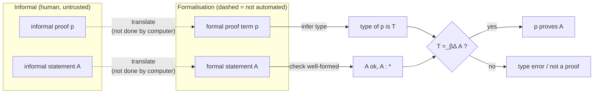

# Proof Assistants and the Future of Formalisation

[[book-guidelines|↩ Back to guidelines]]

## Why this chapter is the payoff of the whole book

Fifteen chapters, and here is the thing they were all building toward: **proof checking is type checking**. Not "similar to" or "modeled on" — literally the same algorithm, running on the same data structure. You have watched this book construct $\lambda D$ piece by piece — $\lambda$-calculus, then simple types, then the cube's three independent extensions, then definitions, then logic, then arithmetic, then a full 30-page proof of Bézout's Lemma — and at every step the payoff was deferred. Chapter 16 cashes it in. It asks: given all this machinery, what do you *do* with it, and what does "doing it" look like as software?

The answer starts from an observation the book has been quietly leaning on since Chapter 5's PAT-interpretation: a proposition $A$ is a type, and a proof of $A$ is a term $p$ such that $p : A$. That means the question "is $p$ a valid proof of $A$?" is *exactly* the question "does $p$ have type $A$?" — and that second question, unlike "is this proof mathematically insightful" or "is this proof elegant," is mechanically decidable. Chapter 2 already proved Uniqueness of Types for $\lambda\to$; Chapter 10 extended that to Uniqueness of Types up to $\beta\delta$-conversion for the full $\lambda D$. So there is a terminating algorithm: given $p$, compute its unique type $T$ (if it exists), then check $T =_{\Delta\beta} A$. If both steps succeed, $p$ proves $A$. Full stop — no human referee, no "I'm pretty sure this step is fine," no ambiguity about what counts as a gap.

This is why the chapter matters practically and not just as a nice closing remark: it is the bridge from "I understand this formalism on paper" to "I could build a piece of software that checks proofs against it." If you are building a verifier or an elaborator, this chapter is the part of the book that tells you what you are actually building and why the thing you build can be trusted even when you don't trust the code that produced its input.

## The checking pipeline, made explicit

The book gives a small diagram (Figure 16.1) that is worth internalizing as a literal architecture diagram, not a metaphor:



Two steps are dashed in the book's own diagram because they are *not* mechanized: turning an informal proof into a candidate term $p$, and turning an informal statement into a candidate formula $A$. That translation step is where all of human mathematical judgment, creativity, and error-proneness still lives. Everything downstream of it — inferring $p$'s type, checking $A$'s well-formedness, comparing the two — is exactly the type-checking algorithm this book has been developing since Chapter 2, extended with $\delta$-conversion for definitions (Chapter 9) and $\beta\delta$-conversion for the full system (Chapter 10).

**What breaks without this separation.** If you conflate "finding a proof" with "checking a proof," you get a system where trusting the output requires trusting the (large, complicated, bug-prone) search/construction machinery. Keeping them separate — construct however you like, but always re-derive a term that a small independent checker verifies — is what makes the next two sections' machinery safe to build aggressively.

### Grounding: the checking pipeline as a Rust function signature

The pipeline above is not an analogy for a Rust type checker — it *is* one, with "proposition" renamed to "type" and "proof" renamed to "value." A minimal bidirectional kernel captures the whole diagram in two mutually recursive functions:

```rust
enum Expr {
    Var(String),
    App(Box<Expr>, Box<Expr>),
    Lam(String, Box<Expr>, Box<Expr>),   // λx:A. body
    Pi(String, Box<Expr>, Box<Expr>),    // Πx:A. B
    Sort(Sort),                          // * or □
}

// "infer" mode: compute T such that ctx ⊢ p : T, or fail.
// This is the "?" arrow out of `formal proof p` in Figure 16.1.
fn infer(ctx: &Context, p: &Expr) -> Result<Expr, TypeError> { /* ... */ }

// "check" mode: does ctx ⊢ p : A hold?
// This is the final "T =_βΔ A ?" comparison — infer p's type,
// then compare against A up to β(δ)-conversion (normalize-and-compare
// or a smarter definitional-equality check).
fn check(ctx: &Context, p: &Expr, expected: &Expr) -> Result<(), TypeError> {
    let inferred = infer(ctx, p)?;
    if is_beta_delta_convertible(ctx, &inferred, expected) {
        Ok(())
    } else {
        Err(TypeError::Mismatch { expected: expected.clone(), got: inferred })
    }
}
```

Nothing here is exotic — this is a standard bidirectional type checker, the kind described in Chapter 2's "kinds of problems" (Type Checking vs. Type Assignment). The whole conceptual weight of "proof checking is type checking" cashes out as: your Hoare-triple verifier's `check` function *is* your proof checker, provided the specifications compile down to $\lambda D$-style propositions-as-types.

### Grounding: Lean's kernel is a direct implementation of Figure 16.1

If Rust shows you the shape, Lean shows you the literal, load-bearing correspondence, because Lean's own architecture is split exactly along the dashed/solid line in the book's diagram. Everything upstream — elaboration, tactic execution, metavariable resolution, notation — is Lean's *elaborator*, and it is large, complex, and (by design) not fully trusted. What it produces is a fully explicit term. That term is handed to Lean's *kernel*, a small, independently-implemented type checker whose only job is exactly `check` above: infer the term's type, compare it to the expected statement up to definitional equality (`isDefEq`, Lean's name for $\beta\delta$-conversion), and accept or reject. When you write `#print axioms my_theorem` or trust a `#eval`-free `theorem`, you are trusting the kernel, not the elaborator — this is Lean's version of "the type of $p$ is computed and compared to $A$."

## Automath and the de Bruijn criterion

The book is explicit that this is not a modern invention: the entire idea — build a computer program that checks whether an expression is well-formed and, for proofs, what they prove — is the Automath project, started around 1970 by N.G. de Bruijn. $\lambda D$, the system this whole book builds, is explicitly a direct successor of the Automath systems. That lineage matters: the "propositions as types, proofs as terms" idea long predates the phrase "Curry-Howard" becoming common currency in this context, and Automath's insistence on *machine-checkable* formal texts (not just formalizable-in-principle ones) is what turned type theory from a logician's curiosity into engineering.

Out of that lineage comes a naming the book attributes to H.P. Barendregt: the **de Bruijn criterion**. A proof assistant satisfies it if every proof term it produces — no matter how it was generated, no matter how clever or opaque the search procedure — gets independently re-checked by a small, separate type-checking kernel before being accepted. The tactic language, the automation, the term-refinement UI: all of that can be as complicated, heuristic, and untrustworthy as you like, because none of it is *load-bearing* for correctness. Correctness rests entirely on the kernel being right, and the kernel is small enough to actually audit.

**What breaks without it.** Imagine instead a system where a "smart" proof-search procedure directly asserts `theorem_proved = true` without producing an inspectable term for an independent checker to verify. Every bug in that search procedure — and search procedures for anything complex enough to be interesting *will* have bugs — becomes a soundness hole. You'd have to trust thousands of lines of heuristic code instead of a few hundred lines of type-checking code. The de Bruijn criterion is precisely the architectural decision that makes "the tactic engine can be buggy and that's fine" a true statement.

### Grounding: de Bruijn criterion as a typestate boundary in Rust

```rust
// The tactic engine can be arbitrarily large and heuristic —
// it just produces a syntax tree, nothing here is trusted yet.
mod tactics {
    pub fn elaborate(goal: &Goal) -> Expr { /* huge, heuristic, possibly buggy */ }
}

// The kernel is small, separately audited, and is the ONLY
// thing whose correctness the soundness of the whole system depends on.
mod kernel {
    pub struct Checked(Expr); // can only be constructed by `verify`

    pub fn verify(ctx: &Context, candidate: Expr, goal: &Expr) -> Result<Checked, TypeError> {
        check(ctx, &candidate, goal)?; // same `check` as above
        Ok(Checked(candidate))
    }
}

fn prove(ctx: &Context, goal: &Goal) -> Result<kernel::Checked, TypeError> {
    let candidate = tactics::elaborate(goal);           // untrusted
    kernel::verify(ctx, candidate, &goal.statement)      // trusted gate
}
```

The `Checked` newtype pattern here is exactly the de Bruijn criterion as a typestate: the only way to obtain a `Checked` value is to pass through `kernel::verify`, so no matter how baroque `tactics::elaborate` gets, nothing downstream can accept an unverified term. This is directly relevant if you are building a Rust verifier with an embedded automated theorem prover: the prover can be as aggressive and unsound-feeling as you want internally, as long as its output is *always* funneled through a minimal, separately-maintained kernel check before anything treats a goal as discharged.

## Interactive proving: holes, refinement, and tactics

The book distinguishes two eras of the same underlying algorithm. The first era is pure *checking*: a human (or another program) supplies a complete term $p$, and the system's only job is to verify it, exactly as Automath did. The second era — where Coq, Nuprl, and Agda live — is *interactive construction*: instead of supplying a complete term up front, you start with a **hole** (an "open place" of a given type $A$ in a given context $\Gamma$) and the system provides **term refinement** steps that progressively fill it in, tracking the remaining holes and their contexts as bookkeeping.

The book draws a sharp distinction between two UI philosophies for the same mechanism:

- **Agda-style**: you edit the term directly. You start with a hole, replace it with a term-shaped skeleton that still has sub-holes, and keep refining until no holes remain. You always see the term.
- **Coq-style**: you never see the term under construction. You only ever see the current sequence of holes (goals) and their contexts; refinement steps ("tactics") transform the goal list, and the underlying term is assembled invisibly in the background.

Either way, the crucial point — and this is where the de Bruijn criterion re-enters — is that no matter how the tactic was written or how convoluted its internal logic, the *result* still has to be a term that type-checks against the original goal. The tactic language is convenience; the kernel is truth.

**What breaks without holes/refinement as a first-class notion.** Without an explicit "incomplete term with typed holes" representation, you are forced to write every proof in one shot, bottom-up, the way Chapter 15's Bézout proof was originally presented complete. The book's own methodology in Chapter 15 — proof holes, hints, and skeleton proofs, filled in incrementally — is precisely interactive proving done by hand on paper; Coq and Agda mechanize exactly that workflow.

### Grounding: holes as metavariables (Lean-primary, since this is elaboration-shaped)

This is squarely in the territory the workbench's learning goals flag as high-priority: a "hole" is a **metavariable**, and term refinement is metavariable assignment — the same mechanism used for implicit-argument elaboration. Lean's elaborator represents an in-progress proof as a term with metavariables `?m1, ?m2, ...` standing in for not-yet-constructed subterms, each tagged with its expected type and local context — exactly the book's "open place of type $A$ in context $\Gamma$." A tactic like `intro x` or `apply f` doesn't magically produce a finished term; it *assigns* one metavariable (possibly introducing new, smaller ones), the same operation Miller pattern unification uses to solve `?m x y =?= f x y` by assigning `?m := λ x y. f x y` when the arguments are distinct bound variables (a *pattern*). Building your own elaborator means building this metavariable-context-and-assignment machinery first; tactics are just a scripting layer on top of it.

```
-- Lean sketch: a proof under construction is a term with metavariables,
-- each carrying its own context and expected type — literally Γ ⊢ ?h : A
theorem and_comm' (p q : Prop) (h : p ∧ q) : q ∧ p := by
  -- goal: ?g : q ∧ p, context: p q : Prop, h : p ∧ q
  constructor        -- assigns ?g := ⟨?g1, ?g2⟩, splits into two smaller holes
  · exact h.2         -- assigns ?g1 : q
  · exact h.1         -- assigns ?g2 : p
```

### Grounding: a five-line sketch of refinement state in Python

For a quick illustration of what "the system tracks holes and their contexts" means as a data structure, without Rust's ceremony:

```python
# A minimal goal-state, à la the Coq-style "you only see the holes" UI.
goals = [{"ctx": {"p": "Prop", "q": "Prop", "h": "p /\\ q"}, "goal": "q /\\ p"}]

def apply_constructor(goals):
    g = goals.pop(0)
    return [{"ctx": g["ctx"], "goal": "q"}, {"ctx": g["ctx"], "goal": "p"}] + goals
```

That is, structurally, the entire idea of a tactic: pop a goal, push zero or more smaller goals, and eventually the list is empty and the (invisible, background-assembled) term is complete.

## Automation, tactics, and the limits of what a machine will do for you

The book is careful to separate two very different kinds of "automation" that get lumped together casually:

1. **Structural tactics**, like Coq's — reusable, composable term-construction procedures, some built into the system, some written by users in a dedicated tactic language (or the host implementation language). These make proof construction faster but never change what counts as a valid proof, because of the de Bruijn criterion: whatever a tactic builds still has to pass the kernel.
2. **Technical assistance features** — infix notation for defined operators, shorthand for standard proof patterns, pull-down tactic menus, lemma search by shape or by involved relation. The book is explicit that these are *interface* features: they don't touch the underlying type theory or the stored formalised mathematics at all, they just make the human's job more pleasant.

Chapter 16's forward-looking section ("Future of the field") names automation as the first of the open challenges: current systems can't skip steps a working mathematician would skip without complaint, and they're generally unable to *propose* relevant lemmas from a library rather than merely accept ones the user names. The book's own proposed direction — combining symbolic automated theorem proving with machine-learning-based statistical inference so that a large fragment of undergraduate mathematics becomes "instantly known" to the assistant — reads, in 2026, as a fairly direct description of what LLM-assisted tactic search and premise selection (e.g. learned lemma retrieval, neural-guided proof search) are now doing in systems like Lean's `mathlib` ecosystem. The book is from 2014; this is one of the few places where its "future" framing is now visibly underway rather than purely speculative.

**Load-bearing note for the automated-theorem-prover target:** this section is the book's explicit statement of where a custom prover embedded in a Rust toolchain earns its keep — not in replacing the kernel (which must stay small and trustworthy per the de Bruijn criterion) but in automating the *elaboration* side: proposing tactic applications, filling in "obvious" steps, and suggesting relevant lemmas, all while every output still funnels through `check`.

## Libraries of formalised mathematics

A quieter but structurally important point: once proofs and definitions are named, type-checked objects (Chapter 8's whole apparatus — `a(x̄) := M : N` — exists precisely for this), they can be stored, indexed, and reused, forming a growing **library** — the book's word for what is elsewhere called a "mathlib." Two structural facts make this work smoothly:

- **Proving and defining are the same kind of activity.** Constructing a proof term and constructing a definiens are both "build a term of a given type, then name it." The only asymmetry the book flags: with a mathematical *definition* you usually want to unfold it later (that's what $\delta$-reduction, from Chapter 9, is for); with a *proof*, you almost never want to unfold it — you just want to invoke it by name at a given instantiation.
- **Dependencies are explicit and inspectable.** Because every definition and proof is named and its parameter list is explicit, "what does this result depend on?" is a mechanically answerable question — you can compute the dependency graph of the whole environment $\Delta$.

The book reports concrete evidence this scales: the Four Color Theorem (Gonthier, in Coq), the Feit–Thompson/Odd-Order Theorem (Gonthier et al., in Coq), and the Flyspeck project's formalisation of the Kepler Conjecture (Hales et al., in HOL Light) as the marquee "big formalisation" results as of the book's writing, plus Mizar as (at the time) the system with the largest accumulated library.

The book also names two further open challenges directly tied to libraries: **export between proof assistants** is essentially impossible, because different systems commit to different foundations (set theory vs. higher-order logic vs. type theory) and different internal representations, so a theorem proved in one library cannot simply be transplanted into another; and **high-level explanation** — folding/unfolding proof detail on demand, and relating formal syntax back to the informal mathematical narrative a human would read — remains unsolved, which is part of why fully detailed formal proofs (like the unfolded version of Bézout's Lemma from Chapter 15) are illegible without tooling to hide the boilerplate.

### Grounding: a library as a dependency-checked module system (Rust) with elaboration-time lookup (Lean)

```rust
// A library entry mirrors Chapter 8's definition format exactly:
// Γ ⊩ a(x̄) := M : N, now with an explicit dependency edge list
// so "what does this depend on?" is O(1) to query.
struct LibraryEntry {
    name: String,
    params: Vec<(String, Expr)>, // x̄ : Ā
    definiens: Option<Expr>,      // M — absent for primitive/axiomatic entries
    ty: Expr,                     // N
    depends_on: Vec<String>,      // other entry names occurring in M or N
}

struct Library {
    entries: HashMap<String, LibraryEntry>,
}

impl Library {
    fn instantiate(&self, name: &str, args: &[Expr]) -> Result<Expr, TypeError> {
        let entry = self.entries.get(name).ok_or(TypeError::Unknown)?;
        // check each arg against the corresponding parameter type
        // (Chapter 9's (inst) rule, cumulative typing across the list)
        substitute(&entry.definiens_or_var(name), &entry.params, args)
    }
}
```

In Lean, this is `Environment` lookup: every declared theorem or definition lives in a persistent environment the elaborator consults by name, and `#print axioms foo` walks exactly the `depends_on` graph above to report which primitive axioms a result ultimately rests on — the mechanized version of the book's "which proof depends on which notion or other result?" question.

## Where λD's minimalism differs from Coq's inductive types

One deliberate design choice the book flags explicitly, worth noting because it's a real trade-off rather than an oversight: $\lambda D$ has no primitive scheme for inductive types, unlike Coq's Calculus of Inductive Constructions (CIC). In $\lambda D$, notions like "closure of a property" or "the smallest set satisfying $\Phi$" are defined using higher-order predicate logic (the same second-order encoding trick Chapter 7 used for $\wedge$, $\vee$, $\exists$) rather than built into the kernel. This works for the book's purpose — formalising mathematics — but it costs something: data types encoded this way don't get *computation* as term-reduction the way an inductive natural-number type with structural recursion does in Coq, where evaluating a program is literally part of $\beta$-reduction. In $\lambda D$, recursive functions are specified by equations and reasoned about equationally, but they don't reduce/compute inside the calculus itself. The book judges this an acceptable trade-off for mathematics; it would not be an acceptable trade-off for a general-purpose dependently-typed *programming* language, which is exactly why Coq, Agda, and Lean all bake in inductive types as primitives rather than encoding them.

## Where this leads

This chapter closes the loop the whole book opened in Chapter 1: untyped $\lambda$-calculus was too permissive (self-application, non-termination, universal fixed points), so types were added to tame it; types were then extended along three orthogonal axes until they could express arbitrary propositions (Chapter 5–7); definitions were added because raw proof terms explode combinatorially (Chapter 8–10); and the entire apparatus was stress-tested on real mathematics, culminating in a from-scratch formal proof of Bézout's Lemma (Chapter 15). Chapter 16 is where the book steps back and says: *the reason all of that was worth building is that it is mechanically checkable*, and it walks through what happens when you actually build the machine — Automath's founding insight, the de Bruijn criterion that makes trusting that machine's output tractable, and the still-open problems (automation, explanation, portability, didactics) that define the field's current frontier.

For the two engineering targets this reading is in service of: the checking pipeline in this chapter — infer type, compare via $\beta\delta$-conversion — *is* the core loop of the Rust verifier's kernel, and the de Bruijn criterion is the architectural argument for why an embedded automated theorem prover can be built aggressively (heuristic, possibly unsound-feeling internally) as long as it always terminates in a kernel-checked term. The interactive-proving section — holes, term refinement, the Agda/Coq split on whether the term or the goal list is the user-facing object — is the most direct precedent in the whole book for the metavariable-and-unification machinery a Miller-pattern-style elaborator needs: a "hole of type $A$ in context $\Gamma$" is precisely a metavariable with its local context, and "term refinement" is precisely metavariable assignment. Definitional equality (the book's $\beta\delta$-conversion, Lean's `isDefEq`) is the single mechanism underlying both the kernel's final comparison and the elaborator's unification — the same recurring thread the workbench's learning goals ask to keep surfacing, and nowhere in this book is that thread more explicit than here.
