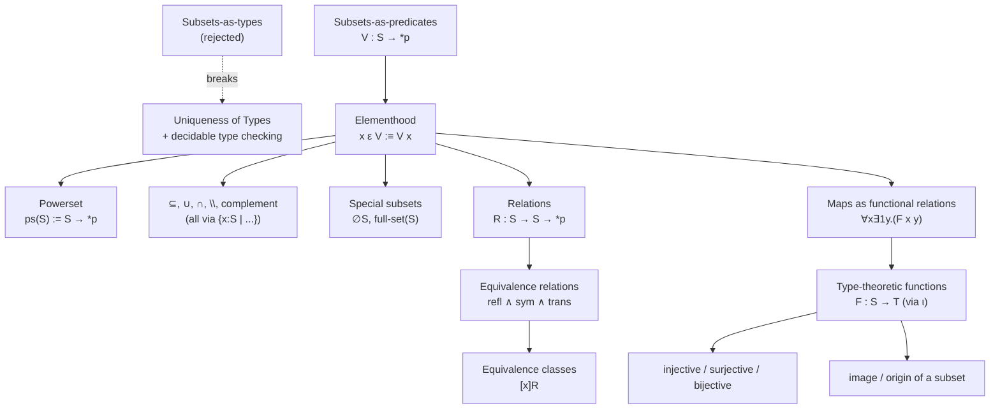

[[book-guidelines|↩ Back to guidelines]]

## Why this chapter exists: a collision between two disciplines

Mathematicians treat set membership the way a librarian treats books on a shelf: the number 3 sits happily in $\mathbb{N}$, in $\mathbb{Z}$, in $\mathbb{R}$, in "the odd naturals," and in "the interval $[-2, 10]$," all at once, without friction. Nobody asks "but which one is it *really* typed as?" — the question doesn't even parse in ordinary mathematical prose.

$\lambda D$ cannot allow that. Every earlier chapter of the book has been building toward — and repeatedly leaning on — **Uniqueness of Types**: a legal term has *one* type, up to conversion (Lemma 10.4.10, first proved back in Chapter 2 for $\lambda\to$). That property is what makes type checking, and therefore proof checking, *decidable*. If $c : S$ and $c : T$ could both hold for a genuine subset $T \subsetneq S$, decidability breaks down the moment you ask "does $M$ have type $\{x : \mathbb{R} \mid x \ge 0\}$?" — because answering that is equivalent to deciding whether $M \ge 0$ is *provable*, which is undecidable in general (the book's own worked example: type-checking a call to the square-root function $F : \{x : \mathbb{R} \mid x \ge 0\} \to \mathbb{R}$ against an arbitrary $M : \mathbb{R}$ would require solving an undecidable problem as a *side effect of type checking*).

So this chapter is a fork in the road, made explicit and irrevocable: **keep decidability of typing (and therefore keep Uniqueness of Types), and accept that subsets cannot be types.** Everything else in the chapter — the predicate encoding, the special new symbol $\varepsilon$, the whole toolkit of unions, intersections, equivalence classes, and maps — is the working-out of what you get to keep, and what extra bookkeeping you pay, once you've made that choice.



## Sets as types, subsets as predicates: the central move

### The intuition

Up through Chapter 12, the book has been quietly treating *sets* as *types*: writing $S : *_s$ meant "$S$ is a set." That correspondence worked fine because as long as you only ever ask "is $x$ an element of $S$?", the question is exactly "does $x$ have type $S$?", and that's decidable — it's ordinary type checking.

The correspondence stops working the instant you need a *subset* $V$ of $S$. The book runs through two failure modes side by side:

1. **Uniqueness of Types breaks.** If $T$ is a genuine subset of $S$, and $c : S$ is also meant to be an element of $T$, you'd want to write $c : T$ *as well as* $c : S$ — but $S \ne T$, so a term with two distinct types directly contradicts a property the whole system depends on.
2. **Decidability breaks.** For a comprehension-defined subset $\{x : S \mid P\,x\}$, checking $c : \{x : S \mid P\,x\}$ would mean *deciding whether $P\,c$ holds* — and provability is not decidable in general (Church, Turing, 1936).

The book is explicit that it *could* abandon Uniqueness of Types instead — let 3 have many types simultaneously, mirroring mathematical practice directly — but declines, because that sacrifices the very thing that makes $\lambda D$ useful as a mechanically checkable foundation: an algorithm that always answers "ok" or "not ok," never "I don't know."

**What breaks without this precision:** if you skip past this fork and just wave your hands at "well, subsets are basically the same as sets," you'll eventually write a definition that silently assumes decidable membership — and then hit a wall exactly like the square-root example, where a routine-looking type check secretly requires solving an open mathematical problem.

Having ruled out subsets-as-types, the fix the book adopts is almost anticlimactic in its simplicity: represent a subset $V$ of $S$ not as a type, but as a **predicate** $P : S \to *_p$. There's already a tight correspondence — for $x : S$, "$x \in V$" and "$P(x)$ holds" say the same thing — and predicates are already first-class citizens of $\lambda D$ (they've been there since Chapter 5). No new primitive notions are required at all; subsets are *free*, given everything already built.

### The formal definition

The book introduces a new symbol, $\varepsilon$, distinguished on purpose from ordinary mathematical $\in$ — a reminder that this is an *encoding*, not the same relation you'd axiomatize directly in ZF set theory:

$$
\begin{aligned}
S &: *_s\\
\mathrm{ps}(S) &:= S \to *_p &&: \Box\\
\mathrm{element}(S, x, V) &:= V\,x &&: *_p \qquad (x : S,\ V : \mathrm{ps}(S))\\
&\quad\text{Notation: } x\ \varepsilon_S\ V \text{ or } x\ \varepsilon\ V \text{ for } \mathrm{element}(S,x,V)
\end{aligned}
$$

The powerset $\mathrm{ps}(S)$ is literally *defined as* the function type $S \to *_p$ — the type of all predicates over $S$. Every subset of $S$, in this encoding, just *is* one of those predicates. Elementhood $x\ \varepsilon\ V$ unfolds, by $\beta$-reduction, to $V\,x$ applied — a proposition, which you inhabit with a genuine proof term, not something you settle by an automatic type-checking judgment. This is the crux distinction the book keeps hammering: $x \in V$ should never be conflated with $x : V$. The first is a proposition you *prove*; the second isn't even well-formed, because $V$ isn't a type.

Inclusion and union follow immediately, quantifying over the ambient type $S$ rather than over $V$ itself (you can't write $\forall x : V.\,(\ldots)$ — $V$ isn't a type, so that would violate rule (form)):

$$
\begin{aligned}
\subseteq(S, V, W) &:= \forall x{:}S.\,(x\ \varepsilon\ V \Rightarrow x\ \varepsilon\ W) &&: *_p\\
\cup(S, V, W) &:= \lambda x{:}S.\,(x\ \varepsilon\ V \vee x\ \varepsilon\ W) &&: \mathrm{ps}(S)
\end{aligned}
$$

with the familiar infix sugar $V \subseteq W$ and $V \cup W$.

### A general pattern: bounded quantification over a non-type

Because subsets aren't types, every "for all $x$ in $V$" or "there exists $x$ in $V$" from ordinary mathematics has to be *translated* into a quantifier over the ambient set $S$, restricted by an explicit membership hypothesis or conjunct:

$$
\begin{aligned}
\forall x\!\in\!V\,(P(x)) &\ \leadsto\ \forall x{:}S.\,(x\ \varepsilon\ V \Rightarrow P\,x)\\
\exists x\!\in\!V\,(P(x)) &\ \leadsto\ \exists x{:}S.\,(x\ \varepsilon\ V \wedge P\,x)
\end{aligned}
$$

Universal quantification restricts with $\Rightarrow$; existential restricts with $\wedge$. The book invites the reader to see why the connective must flip between the two ("$\forall x\!\in\!V(x \in W)$" translated with $\wedge$ instead of $\Rightarrow$ would say "every $x:S$ is simultaneously in $V$ *and* in $W$," which is wrong — it would force $V \subseteq W \subseteq S$ and $V = S$ all at once, rather than expressing "every element of $V$ is also in $W$").

**What breaks without this convention:** writing $\forall x \varepsilon\ V.\,(x \varepsilon\ W)$ directly — as if $\varepsilon\ V$ delimited a sub-domain the way a genuine subtype would — is simply illegal syntax in $\lambda D$; there is no derivation rule that accepts it. Every bounded quantifier has to be manually unpacked into an unbounded quantifier over $S$ plus an explicit hypothesis or conjunct. This is exactly the "extra administration" the chapter's closing sections keep flagging as the price of the subsets-as-predicates choice.

### Grounding

The Rust analogue that actually earns its keep here is not a subtype at all, but a **predicate-carrying wrapper** — Rust's own type system enforces Uniqueness-of-Types-like discipline (a value has exactly one static type), so the honest way to represent "a validated subset of `S`" is a smart constructor plus a runtime-checked invariant, not a genuine sub-*type* relationship:

```rust
// A "subset" as a predicate over S, exactly like ps(S) := S -> *p.
// membership is a *function call*, not a type relation — Rust's own
// type system has no notion of "T is a subtype of S carved out by P".
struct Subset<S> {
    predicate: fn(&S) -> bool,
}

fn element<S>(x: &S, v: &Subset<S>) -> bool {
    (v.predicate)(x) // this *is* x ε v, unfolded
}

// Union, mirroring cup(S, V, W) := {x : S | x ε V ∨ x ε W}
fn union<S: Copy + 'static>(v: Subset<S>, w: Subset<S>) -> Subset<S> {
    Subset { predicate: Box::leak(Box::new(move |x: &S| element(x, &v) || element(x, &w))) as &_ as *const _ as fn(&S) -> bool }
}
```

(That union implementation is deliberately awkward — Rust's `fn` pointers don't close over captured state cleanly; a real implementation would use `Box<dyn Fn(&S) -> bool>`. The awkwardness itself is instructive: it's the same "extra administration" tax the book pays for choosing predicates over primitive subtypes.)

Lean is the more natural fit, because Lean's own standard library makes the *identical* choice for exactly the same reason — `Set α` is *defined* as `α → Prop`:

```lean
-- Lean's `Set` is not a primitive notion; it is defined precisely
-- as ps(S) is here — a predicate over the ambient type:
def MySet (α : Type) := α → Prop

def mem {α : Type} (x : α) (V : MySet α) : Prop := V x
-- Lean's actual `Set.mem` / the `∈` notation for `Set α` is this,
-- verbatim, right down to unfolding by function application.
```

Python has no compile-time type-level analogue of a predicate-as-subset, but the runtime shape is a useful sanity check on the *unfolding* step ($x\ \varepsilon\ \{x : S \mid P\,x\}$ is $\beta$-equal to $P\,x$):

```python
# Illustrative only: a "subset" as a callable, and membership as a call —
# the same unfolding step (x ε {x | P x}) ~ P(x) shown at the value level.
def subset(predicate):
    return predicate

def element(x, v):
    return v(x)

evens = subset(lambda x: x % 2 == 0)
assert element(4, evens) and not element(3, evens)
```

## Basic set operations, comprehension, and $\varepsilon$-in / $\varepsilon$-el

### The intuition

Once membership is nailed down, the rest of naive set algebra — inclusion, equality, union, intersection, difference, complement, comprehension notation — falls out mechanically, because they're all just predicate combinators dressed in familiar clothing. The one thing worth pausing on is that **subset equality has to be *defined*, not inherited** — the book already has a general notion of equality (Leibniz equality, `eq`, from Chapter 12), but it doesn't directly apply to subsets, because subsets aren't elements of a common type $S$ — they're elements of $\mathrm{ps}(S)$, which lives one universe level up.

### The formal definitions

Comprehension notation is introduced as pure sugar for the predicate itself:

$$\{x : S \mid x\ \varepsilon\ V\} \ :\equiv\ \lambda x{:}S.\,V\,x$$

and the full battery of set operations (Figure 13.2 in the book):

$$
\begin{aligned}
\subseteq(S,V,W) &:= \forall x{:}S.\,(x\ \varepsilon\ V \Rightarrow x\ \varepsilon\ W) &&: *_p\\
\mathrm{IS}(S,V,W) &:= V \subseteq W \wedge W \subseteq V &&: *_p &&\text{(subset equality, notation } V = W\text{)}\\
\cup(S,V,W) &:= \{x:S \mid x\ \varepsilon\ V \vee x\ \varepsilon\ W\} &&: \mathrm{ps}(S)\\
\cap(S,V,W) &:= \{x:S \mid x\ \varepsilon\ V \wedge x\ \varepsilon\ W\} &&: \mathrm{ps}(S)\\
\setminus(S,V,W) &:= \{x:S \mid x\ \varepsilon\ V \wedge \neg(x\ \varepsilon\ W)\} &&: \mathrm{ps}(S)\\
{}^c(S,V) &:= \{x:S \mid \neg(x\ \varepsilon\ V)\} &&: \mathrm{ps}(S) &&\text{(complement, notation } V^c\text{)}
\end{aligned}
$$

Subset equality is defined as mutual inclusion — the "$\subseteq$ both ways" pattern familiar from ordinary mathematics — *not* as some direct reuse of `eq`. That gap is deliberate and gets closed carefully in a short but important side development: the book defines a genuine Leibniz-style equality on the powerset itself,

$$V =_{\mathrm{ps}(S)} W \ :\equiv\ \Pi K{:}\mathrm{ps}(S)\to *_p.\,(K\,V \Leftrightarrow K\,W),$$

proves (as an exercise) that this Leibniz-equality *implies* subset-equality, and then, because the converse direction has no proof from what's already available, **adds it as a new axiom**:

$$\mathrm{IS\text{-}prop}(S,V,W,u) := \bot\!\!\bot : V =_{\mathrm{ps}(S)} W \qquad (u : V = W)$$

This is a small but telling moment: not every fact that "should obviously be true" is derivable from the existing machinery, and the book is careful to flag exactly where an axiom, rather than a proof, is doing the work — a discipline carried over directly from Chapter 10's treatment of primitive definitions.

Finally, because $y\ \varepsilon\ \{x:S \mid P\,x\}$ unfolds by $\beta$-reduction to $P\,y$, the book packages that unfolding as explicit introduction/elimination rules for $\varepsilon$ (Figure 13.3) — the connective's own analogue of $\wedge$-in/$\wedge$-el from Chapter 7:

$$
\begin{aligned}
\varepsilon\text{-in}(S,P,y,u) &:= u : y\ \varepsilon\ \{x:S \mid P\,x\} &&(u : P\,y)\\
\varepsilon\text{-el}(S,P,y,v) &:= v : P\,y &&(v : y\ \varepsilon\ \{x:S \mid P\,x\})
\end{aligned}
$$

**What breaks without this:** treating $\varepsilon$ as a magic primitive symbol, rather than as sugar that unfolds to ordinary predicate application, would hide the fact that every set-theoretic fact in this chapter reduces, at bottom, to logic and $\beta$-conversion you already know from Chapters 5–7. The $\varepsilon$-in/-el rules exist precisely to make that unfolding explicit and reusable, rather than something you re-derive by hand every time.

### A worked proof, read as a skeleton

The chapter's running example — for subsets $V, W$ of $S$: if $V \subseteq W^c$, then $V \setminus W = V$ — is proved in two halves (Figure 13.4). The first half, $V \setminus W \subseteq V$, needs *no* hypothesis about $V, W$ at all: unfold $x\ \varepsilon\ (V\setminus W)$ to $x \varepsilon V \wedge \neg(x \varepsilon W)$, take the left conjunct. The second half, $V \subseteq V \setminus W$, is where $V \subseteq W^c$ actually gets used: given $x \varepsilon V$, apply the hypothesis to get $x \varepsilon W^c$, unfold that to $\neg(x \varepsilon W)$, and pair it back up with $x \varepsilon V$ to land in $V \setminus W$. The two halves combine via $\wedge$-in into subset equality, then $\Rightarrow$-in closes the implication.

The book flags a small but sharp observation about this proof (Remark 13.2.2): in the final $\wedge$-in step, one antecedent proof object has a *shorter parameter list* than the other — because the first half's proof genuinely doesn't depend on the hypothesis $u : V \subseteq W^c$, while the second half's does. The parameter list of a proof term is a faithful record of what it actually needed, not a bookkeeping formality — a fact worth carrying forward, since it recurs at scale in the nine-hole Bézout's Lemma proof of Chapter 15.

### Grounding

```rust
// The set-operation algebra as ordinary closures over a predicate type —
// directly analogous to Figure 13.2's definitions, and to Rust's own
// Iterator::filter / HashSet-style combinators, minus the runtime cost:
type Pred<S> = std::rc::Rc<dyn Fn(&S) -> bool>;

fn subset<S: 'static>(v: Pred<S>, w: Pred<S>) -> impl Fn(&S) -> bool {
    move |x| !v(x) || w(x) // ∀x. (x ε V ⇒ x ε W)
}

fn set_minus<S: 'static + Clone>(v: Pred<S>, w: Pred<S>) -> Pred<S> {
    std::rc::Rc::new(move |x: &S| v(x) && !w(x))
}
```

```lean
-- Lean/mathlib defines exactly this algebra over `Set α := α → Prop`,
-- and `Set.ext` is mutual-inclusion subset equality made into a lemma:
example {α : Type} (V W : Set α) (h1 : V ⊆ W) (h2 : W ⊆ V) : V = W :=
  Set.Subset.antisymm h1 h2  -- the book's IS(S,V,W), named
```

## Special subsets: the empty set and the full set

### The intuition

Even the "trivial" subsets need to be built, one per ambient type $S$ — there is no single universal empty set the way naive set theory has one $\emptyset$ shared across all of mathematics. In the predicate encoding, $\emptyset_S$ is *the predicate that's always false on $S$*, and the full subset is *the predicate that's always true on $S$*.

### The formal definitions

$$
\begin{aligned}
\emptyset(S) &:= \{x:S \mid \bot\} &&: \mathrm{ps}(S)\\
\mathrm{full\text{-}set}(S) &:= \{x:S \mid \neg\bot\} &&: \mathrm{ps}(S)
\end{aligned}
$$

The lemma $\emptyset_S \subseteq V \subseteq \mathrm{full\text{-}set}(S)$ (for every subset $V$) follows almost mechanically: an element of $\emptyset_S$ unfolds to a proof of $\bot$, from which anything follows by $\bot$-elimination; an element of $V$ trivially satisfies $\neg\bot$ (the constant function $\lambda y{:}\bot.\,y$), landing it in the full set.

A sharper fact — the empty-set characterization — is where the chapter's first genuinely classical step appears: $V = \emptyset_S \Leftrightarrow \exists x{:}S.\,(x\ \varepsilon\ V)$. Wait — the book actually proves the *non-emptiness* direction, $V \ne \emptyset_S \Rightarrow \exists x.\,(x \varepsilon V)$, and this step is explicitly flagged as **non-constructive**: it uses the alternative existential-introduction rule $\exists\text{-in-alt}$ (from Chapter 11's classical predicate logic, Figure 11.28), which derives a witness from a doubly-negated universal ($\neg\forall x.\neg(x\varepsilon V)$) *without exhibiting the witness*. The book is upfront that this is a deliberate consequence of an earlier decision (§11.4) to adopt classical logic as the working system throughout — not something forced by sets specifically.

**What breaks without this:** if you expected every existence proof in this book to hand you a witness on a silver platter, this is the moment that expectation needs revising — "$V$ is nonempty" only gets you "some $x$ exists such that $x \varepsilon V$" *abstractly*, via excluded-middle-flavored reasoning, with no algorithm attached for finding that $x$.

### Grounding

```lean
-- Lean's excluded middle / Classical.byContradiction is exactly the
-- non-constructive step the book takes here — `Set.nonempty_iff_ne_empty`
-- in mathlib is the direct analogue of this section's Figure 13.8:
example {α : Type} (V : Set α) (h : V ≠ ∅) : ∃ x, x ∈ V :=
  Set.nonempty_iff_ne_empty.mpr h
```

```python
# The empty/full subsets as constant predicates — no analogue of the
# classical existence step is meaningful here, since Python has no
# proposition-vs-proof distinction; this is purely illustrative:
def empty_set():
    return lambda x: False

def full_set():
    return lambda x: True
```

## Relations, equivalence relations, and equivalence classes

### The intuition

A relation on $S$ is nothing exotic in this framework — it's a *binary* predicate, and binary predicates are already handled by Currying (the book leans on the same trick used for binary connectives since Chapter 7): $R : S \to S \to *_p$. The properties you'd expect — reflexivity, symmetry, transitivity — are direct $\Pi$-statements over $R$, and an equivalence relation is simply the [[The-Curry-Howard-Isomorphism#Conjunction|conjunction]] of all three.

### The formal definitions

$$
\begin{aligned}
\mathrm{reflexive}(S,R) &:= \forall x{:}S.\,(R\,x\,x) &&: *_p\\
\mathrm{symmetric}(S,R) &:= \forall x,y{:}S.\,(R\,x\,y \Rightarrow R\,y\,x) &&: *_p\\
\mathrm{transitive}(S,R) &:= \forall x,y,z{:}S.\,(R\,x\,y \Rightarrow R\,y\,z \Rightarrow R\,x\,z) &&: *_p\\
\mathrm{equivalence\text{-}relation}(S,R) &:= \mathrm{reflexive}(S,R) \wedge \mathrm{symmetric}(S,R) \wedge \mathrm{transitive}(S,R) &&: *_p
\end{aligned}
$$

(with $\wedge$ left-associated, per the book's own sugaring remark). Given $u : \mathrm{equivalence\text{-}relation}(S,R)$, the equivalence class of $x$ is the subset of everything $R$-related to $x$:

$$\mathrm{class}(S,R,u,x) := \{y : S \mid R\,x\,y\} : \mathrm{ps}(S), \qquad \text{notation } [x]_R$$

The chapter states three characteristic properties of equivalence classes — no class is empty; overlapping classes coincide; every element belongs to some class (equivalently, the classes cover $S$) — and works through a full derivation of the "overlap $\Rightarrow$ coincide" property in a sharper, equivalent form:

$$\forall x,y,z{:}S.\,(z\ \varepsilon\ [x]_R \Rightarrow z\ \varepsilon\ [y]_R \Rightarrow [x]_R = [y]_R)$$

### Reading the proof as a strategy, not just a term

The book's own commentary on this derivation (§13.4) is worth internalizing as a general strategy for *any* goal of this shape, because it recurs constantly in later, larger proofs: **read the proof bottom-up.** The goal (line 12) is decomposed by successively raising flags for the quantified variables and hypotheses, which turns the single goal into two smaller sub-goals (lines 9 and 10: $[x]_R \subseteq [y]_R$ and $[y]_R \subseteq [x]_R$). The first sub-goal further reduces, via unfolding $\varepsilon$-membership in a class, to a purely relational goal — $R\,y\,m$ — which three combined hypotheses ($R\,x\,m$, $R\,x\,z$, $R\,y\,z$) deliver via one use of symmetry and two uses of transitivity (lines 4–6). Notably, *reflexivity is never invoked* — the "overlap implies coincide" property is a fact about symmetric-transitive relations, full stop.

The nicest moment in the proof is line (10): rather than re-deriving $[y]_R \subseteq [x]_R$ from scratch, the book gets it from line (9)'s *already-proved* $[x]_R \subseteq [y]_R$ by **swapping two pairs of parameters** — $a_9(S,R,u,y,x,z,v,u)$ instead of $a_9(S,R,u,x,y,z,u,v)$. Because the underlying statement is symmetric in $x \leftrightarrow y$ (matched by swapping the hypotheses $u \leftrightarrow v$), one proof term serves for both directions, for free.

**What breaks without this:** without noticing the parameter-swap trick, you'd write out the mirror-image proof term by hand, doubling the size of the derivation for no mathematical reason — exactly the kind of avoidable blow-up that Chapter 8 introduced the whole definition mechanism to prevent.

Relations generalize immediately to *pairs* of types, $R : S \to T \to *_p$ — "a relation between $S$ and $T$" — which is the shape the next section needs.

### Grounding

Equivalence relations and their quotient classes are the single most Lean-native concept in this chapter — `Setoid` is a first-class structure in Lean's core library, built for exactly this:

```lean
-- Lean's `Setoid` bundles reflexivity, symmetry, transitivity — literally
-- the book's equivalence-relation(S, R) — and `Quotient` builds the
-- classes automatically:
example {S : Type} (R : S → S → Prop)
    (hrefl : ∀ x, R x x) (hsymm : ∀ x y, R x y → R y x)
    (htrans : ∀ x y z, R x y → R y z → R x z) :
    Setoid S where
  r := R
  iseqv := ⟨hrefl, @hsymm, @htrans⟩
```

```rust
// The "swap parameters, reuse the proof" trick has a genuine Rust
// analogue: a symmetric relation checker only needs to be implemented
// once, with the mirror case obtained structurally, not re-coded:
trait Equivalence<S> {
    fn refl(&self, x: &S) -> bool;
    fn symm(&self, x: &S, y: &S) -> bool; // R x y -> R y x, used both ways
    fn trans(&self, x: &S, y: &S, z: &S) -> bool;
}

fn classes_overlap_implies_coincide<S: PartialEq, R: Equivalence<S>>(
    r: &R, x: &S, y: &S, z: &S, r_xz: bool, r_yz: bool,
) -> bool {
    // exactly the book's a4-a6: symmetry then transitivity, no reflexivity used
    r_xz && r_yz // (placeholder for the actual chained relational proof)
}
```

## Maps as functional relations, and back again

### The intuition

A map (function) $F$ from $S$ to $T$ can be seen two ways, and this section is about the *bridge* between them, which turns out to be exactly the $\iota$-descriptor from Chapter 12. View one: $F$ *is* a relation $S \to T \to *_p$, with the extra property that every $x$ relates to *exactly one* $y$ — a **functional relation**. View two: $F$ is an ordinary type-theoretic function, $F : S \to T$, i.e. an inhabitant of $\Pi x{:}S.\,T$ — the notion of "function" $\lambda D$ has used natively since Chapter 2.

$$\forall x\!\in\!S\ \exists_1 y\!\in\!T\,(F\,x\,y)$$

is the defining property of view one. The book calls out a variant worth knowing by name — a *partial* map allows *at most* one related $y$ (possibly none) — but commits to totality throughout the rest of the book.

### The formal bridge

Given a genuine type-theoretic $F : S \to T$, the corresponding functional relation is immediate — "$y$ is the value $F$ assigns to $x$" just *is* $y =_T F\,x$:

$$R(S,T,F) := \lambda x{:}S.\,\lambda y{:}T.\,(y =_T F\,x) : S \to T \to *_p$$

Going the other way is where $\iota$ earns its keep. Given a relation $R : S \to T \to *_p$ together with a proof $u$ that it's functional, you *build* the type-theoretic function by describing, for each $x$, the unique $y$ that $\iota$ guarantees exists:

$$F(S,T,R,u) := \lambda x{:}S.\,\iota^{u\,x}_{y:T}(R\,x\,y) : S \to T$$

This is a direct, concrete instance of the general pattern from Chapter 12's $\iota$-descriptor: unique existence (here, per $x$, packaged inside $u$) licenses naming "the" related element. The book is explicit that it will keep using the type-theoretic ($\Pi$-type) format as the *primary* representation of functions going forward — the functional-relation view exists mainly to connect $\lambda D$'s notion of function back to how mathematics usually phrases "a relation that happens to be a function."

### Properties of maps

With $F : S \to T$ fixed, the familiar trio is direct $\Pi$/$\exists$ statements (Figure 13.13):

$$
\begin{aligned}
\mathrm{injective}(S,T,F) &:= \forall x_1,x_2{:}S.\,(F\,x_1 =_T F\,x_2 \Rightarrow x_1 =_S x_2) &&: *_p\\
\mathrm{surjective}(S,T,F) &:= \forall y{:}T.\,\exists x{:}S.\,(F\,x =_T y) &&: *_p\\
\mathrm{bijective}(S,T,F) &:= \mathrm{injective}(S,T,F) \wedge \mathrm{surjective}(S,T,F) &&: *_p
\end{aligned}
$$

Given a proof $u$ of bijectivity, the book upgrades surjectivity (mere existence) to *unique* existence — routine once injectivity is available to rule out a second witness — and then, exactly as with the map-relation bridge above, uses $\iota$ again to *build* the inverse function directly out of that unique-existence proof:

$$\mathrm{inv}(S,T,F,u) := \lambda y{:}T.\,\iota^{a_4(S,T,F,u)\,y}_{x:S}(F\,x =_T y) : T \to S$$

$\iota$ is doing exactly the same job it did in Chapter 12 for `Min`: turn a proof of unique existence into a genuine, usable term.

### Maps restricted to a subset

When $F$'s domain is only a subset $V$ of $S$ rather than all of $S$, the price of the predicate encoding shows up concretely: $F$'s type has to carry an extra hypothesis argument, $F : \Pi x{:}S.\,((x\ \varepsilon\ V) \to T)$, and every property built on top inherits that extra argument. Injectivity on a subset (Figure 13.14) needs *two* membership proofs, one per compared element:

$$\mathrm{inj\text{-}subset}(S,T,V,F) := \forall x_1,x_2{:}S.\,\Pi p{:}(x_1\ \varepsilon\ V).\,\Pi q{:}(x_2\ \varepsilon\ V).\,\big((F\,x_1\,p =_T F\,x_2\,q) \Rightarrow x_1 =_S x_2\big)$$

**What breaks without this administration:** if you tried to state injectivity on a subset the way you'd state it on the full type — $\forall x_1, x_2 : S.\,(F\,x_1 =_T F\,x_2 \Rightarrow \ldots)$ — the statement wouldn't even typecheck, because $F\,x_1$ isn't well-formed without first supplying a proof that $x_1 \varepsilon\ V$. This is the concrete, recurring cost the book flagged back in §13.1 as the trade for keeping decidability: every "restricted" statement needs its restriction spelled out explicitly, everywhere, rather than being absorbed silently into a subtype.

### Grounding

```lean
-- Lean's Function.Injective / Surjective / Bijective are these
-- definitions verbatim; and Function.invFun (classically) mirrors
-- the book's ι-built inverse:
example {S T : Type} (F : S → T) (h : Function.Bijective F) :
    ∃ G : T → S, Function.LeftInverse G F ∧ Function.RightInverse G F :=
  ⟨Function.invFun F, Function.leftInverse_invFun h.1, Function.rightInverse_invFun h.2⟩
```

```rust
// Injectivity/surjectivity/bijectivity as checkable properties over
// a finite domain — this is the *decidable, finite* shadow of the
// book's general (possibly infinite-domain) definitions, useful as
// the shape a checker/verifier's finite-model-checking mode would take:
fn is_injective<S: PartialEq, T: PartialEq>(domain: &[S], f: impl Fn(&S) -> T) -> bool {
    for (i, x1) in domain.iter().enumerate() {
        for x2 in &domain[i + 1..] {
            if f(x1) == f(x2) { return false; }
        }
    }
    true
}
```

## Image and origin of a subset

### The intuition

Given $F : S \to T$, two everyday constructions round out the chapter: the **image** of a subset $V \subseteq S$ — everything $F$ actually maps $V$'s elements *to* — and the **origin** (preimage) of a subset $W \subseteq T$ — everything that $F$ maps *into* $W$. Both are subsets, so both are, unsurprisingly by now, predicates built with comprehension.

### The formal definitions

$$
\begin{aligned}
\mathrm{image}(S,T,F,V) &:= \{y : T \mid \exists x{:}S.\,(x\ \varepsilon\ V \wedge F\,x =_T y)\} &&: \mathrm{ps}(T)\\
\mathrm{origin}(S,T,F,W) &:= \{x : S \mid F\,x\ \varepsilon\ W\} &&: \mathrm{ps}(S)
\end{aligned}
$$

The chapter closes its technical development with a small proof that shows the whole toolkit working together in miniature: for $F : S \to T$ and $V \subseteq S$, $V \subseteq \mathrm{origin}(\mathrm{image}(V))$. The idea is a one-line chase: take $s \varepsilon\ V$; then $F\,s$ is trivially in $\mathrm{image}(V)$ (witnessed by $s$ itself, plus reflexivity of equality); and *that* is exactly the defining condition for $s$ to be in $\mathrm{origin}(\mathrm{image}(V))$. Formally (Figure 13.16), it's four short lines: `eq-refl` supplies $F s =_T F s$, $\wedge$-in packages it with $s \varepsilon V$, $\exists$-in produces the image-membership witness, and that term is — *by unfolding, with no further work* — already a proof of origin-membership, because `origin` was defined exactly to make that unfolding trivial.

**What breaks without this:** notice that the proof needs *no* injectivity, surjectivity, or any special property of $F$ at all — $V \subseteq \mathrm{origin}(\mathrm{image}(V))$ holds for every function. (The reverse inclusion does *not* hold in general — a non-injective $F$ can map two different points into the same image point, pulling extra elements into the origin — which is exactly the content of Exercise 13.16(b), left to the reader with the added hypothesis that $F$ is injective.) This is a good checkpoint for how much mileage the predicate encoding buys for free: once elementhood, comprehension, and equality are nailed down, a genuinely useful lemma about arbitrary functions falls out in four lines, no special machinery required.

### Grounding

```rust
// image/origin over a finite domain, computed directly — the
// decidable, "run it" analogue of the book's general comprehension-
// based definitions:
fn image<S: Clone, T: PartialEq + Clone>(f: impl Fn(&S) -> T, v: &[S]) -> Vec<T> {
    v.iter().map(f).collect() // {y : T | ∃x ∈ V. F x = y}, materialized
}

fn origin<S: Clone, T: PartialEq>(f: impl Fn(&S) -> T, w: &[T], domain: &[S]) -> Vec<S> {
    domain.iter().filter(|x| w.contains(&f(x))).cloned().collect() // {x : S | F x ε W}
}
```

```lean
-- Set.image and Set.preimage are exactly this, and Set.subset_preimage_image
-- is the book's V ⊆ origin(image(V)) lemma by name:
example {S T : Type} (F : S → T) (V : Set S) : V ⊆ F ⁻¹' (F '' V) :=
  Set.subset_preimage_image F V
```

## Representation of mathematical notions: a deliberate ambiguity

The chapter's penultimate section (§13.6) pauses to name something that's been happening quietly throughout: the *same* $\lambda D$ construct, $\lambda x{:}A.\,t$, encodes several genuinely different mathematical notions depending on the sorts of $A$ and $t$ — a function ($A, t : *_s$), a predicate ($A : *_s$, $t : *_p$), or a subset ($A : *_s$, $t : *_p$ — *the same signature as a predicate*). This is a deliberate, acknowledged **many-to-one map** from mathematical vocabulary into $\lambda D$-code: it keeps the underlying system small (no new symbols needed for "subset" beyond what "predicate" already provides), at the cost of the raw $\lambda D$ term alone not telling you, unambiguously, which of several intended readings you're looking at. The book's answer is the $*_s$/$*_p$ sugaring introduced back in §8.7 — annotating *which kind of* $*$ a sort lives in resolves every ambiguity in the table except one irreducible case: a predicate on $A$ and a subset of $A$ are, and remain, syntactically identical, by the chapter's own choice in §13.1.

## Where this leads

This chapter's central decision — subsets as predicates, elementhood as unfolding, everything else as derived sugar — is a load-bearing choice for a large fraction of the rest of the book, not a self-contained detour:

- **Chapter 14 (Arithmetic)** defines $\mathbb{N}$ itself as a *subset* of $\mathbb{Z}$ — $\lambda x{:}Z.\,\Pi P{:}Z\to *_p.\,(\mathrm{nat\text{-}cond}(P) \Rightarrow P\,x)$ — and constantly reasons about closure of $\mathbb{N}$ under addition, positivity, and negativity using exactly the $\varepsilon$-machinery, comprehension, and bounded-quantifier translation conventions built here.
- **Chapter 15 (Bézout's Lemma)** builds its capstone proof around the *minimum* of a subset $S^+ \subseteq \mathbb{Z}$, using `least`, the Minimum Theorem, and set-difference/intersection reasoning that is a direct continuation of §§13.1–13.4's toolkit, applied at scale.
- More structurally, this chapter is the moment the book demonstrates that its earlier commitment to decidable typing (first argued for all the way back in Chapter 2, and re-litigated at each stage of the $\lambda$-cube) is not merely preserved but actively *load-bearing* for how ordinary mathematics — sets, relations, functions — has to be phrased once you take that commitment seriously.

For the elaborator/unification project specifically: the map-as-functional-relation bridge (§13.5) is a clean, self-contained instance of $\iota$ doing exactly the job a metavariable-resolution step does — turning a proof of unique existence into a genuine, usable term — worth revisiting alongside Chapter 12's `Min` as a second worked example of the same mechanism, this time applied pointwise across an entire function rather than once. And the injectivity/surjectivity/bijectivity definitions here are a good sanity check for a Hoare-triple-style verifier: any specification language for "this function is a bijection" is, under the hood, going to bottom out in exactly the $\Pi/\exists$ shapes given in Figure 13.13, whether or not the surface syntax makes that visible.
