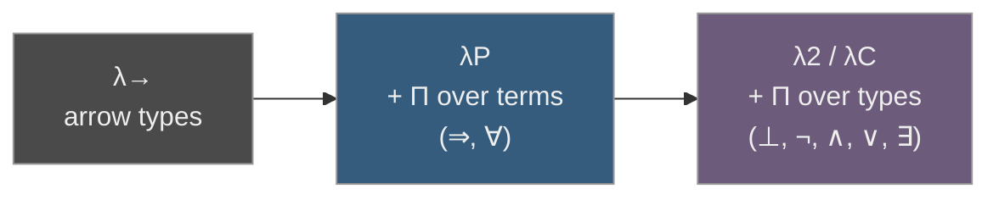

[[book-guidelines|↩ Back to guidelines]]

## Why proofs and programs turn out to be the same thing

Here's the question the book is quietly building toward across Chapters 2–4: once you have a typed λ-calculus with strong normalisation and decidable type checking, what is it actually *for*? The mechanics — abstraction, application, β-reduction, contexts, judgements $\Gamma \vdash M : A$ — are elegant, but elegant machinery still needs a job.

The answer Nederpelt and Geuvers give, and the one this whole book is organized around, is: **a typed λ-calculus can encode logic itself, so precisely that "checking a proof" and "checking a type" become the same algorithm.** That's not a metaphor or a teaching device — it's a theorem-shaped correspondence with a name (Curry–Howard, or more fully Curry–Howard–de Bruijn) and a very concrete payoff: if you can build a type checker, you already know how to build a proof checker. This is the seed from which every proof assistant — Coq, Agda, Lean — grows.

[[Formalising-Elementary-Mathematics#The intuition|The intuition]], before any notation: a proof of "if $A$ then $B$" is a *procedure* that turns evidence for $A$ into evidence for $B$. That's exactly what a function of type $A \to B$ is. A proof that "for every $x$ in $S$, $P(x)$ holds" is a procedure that, given any particular $x$, produces evidence that $P(x)$ holds for that $x$ — exactly what a (dependently-typed) function $\Pi x{:}S.\, P\,x$ is. Once you see functions-as-proofs, the rest of predicate logic — conjunction, disjunction, existence, absurdity — becomes a question of "what function type captures this connective's introduction and elimination rules?" Chapters 5 and 7 answer that question, connective by connective, in successively more powerful systems along the λ-cube ($\lambda P$, then $\lambda 2$, then $\lambda \omega$, then $\lambda C$).

This article follows the book's own path: first the propositions-as-types idea and its two easiest connectives (Ch. 5, in $\lambda P$), then the harder connectives that need second-order encodings (Ch. 7, in $\lambda C$), then classical logic as a deliberate, axiomatic add-on.

---

## Propositions as types: the core insight

The book calls it the **PAT-interpretation** (propositions-as-types *and* proofs-as-terms — the acronym does double duty). The idea, stated as directly as the book states it:

- A **proposition** $A$ is coded as a **type**: $A : *$.
- A **proof** of $A$ is coded as a **term** $p$ inhabiting that type: $p : A$.
- $A$ is **true** exactly when $A$ is **inhabited** (some term has that type); $A$ is **false** exactly when no such term exists.

This is stated formally in the book as a biconditional (Section 5.4):

$$
\text{Proposition } B \text{ is inhabited} \iff B \text{ is true}.
$$

Notice what this buys you operationally: proving a theorem and finding an inhabitant of a type are the *same activity*. There's no separate "logic layer" bolted onto the type system — the type system *is* the logic, once you read `:` as "is a proof of" instead of "has the type."

**What breaks without this reading.** If you only think of `:` as "has the runtime shape of," then a term like `f : Πx : A . P x` is just a function. But the moment you also allow yourself to read `A` as a proposition, `f` stops being merely code — it becomes a certificate. This dual reading is the entire reason type checking can substitute for proof checking: the checker doesn't know or care whether you're compiling a program or verifying a theorem. It only ever does one thing — check that a term has a claimed type — and PAT is the decision to let that one operation carry two meanings at once.

### Mechanism: this is exactly what a checker does

For the Rust-verifier project, this is the load-bearing idea. A **type checker** and a **proof checker** are not two different pieces of software that happen to look similar — under PAT they are literally the same algorithm running over the same judgement form $\Gamma \vdash M : A$. Nederpelt and Geuvers say this outright in Chapter 7's conclusions: *"proof checking = type checking."* If you're building a Rust tool that checks program correctness against logic-clause specifications, this chapter is telling you that the specification-checker and the type-checker you'd write anyway are not two components to keep in sync — done right, they're one component with two readings of its inputs.

```rust
// The judgement Γ ⊢ M : A shows up, unmodified, as the signature
// of a single function — whether A is "read" as a type or a proposition
// is a matter of what the caller does with the Ok(()) result, not
// a difference in what this function does.
fn check(ctx: &Context, term: &Term, claimed_type: &Type) -> Result<(), TypeError> {
    let inferred = infer(ctx, term)?;
    if defeq(&inferred, claimed_type, ctx) {
        Ok(())   // "M is well-typed" AND "M proves A" — same fact.
    } else {
        Err(TypeError::Mismatch { expected: claimed_type.clone(), found: inferred })
    }
}
```

```lean
-- Lean's kernel literally works this way: `example : A := proof_term`
-- is type-checked by the same `isDefEq`/`infer` machinery as
-- `def f : Nat → Nat := fun n => n + 1`. There is no separate
-- "theorem-checking mode."
theorem imp_refl (A : Prop) : A → A := fun a => a
def    id_nat            : Nat → Nat := fun n => n
```

---

## Proofs as terms — proof objects

The second half of PAT is that a proof is not just an abstract guarantee that something holds — it's a concrete *term*, called a **proof object**, that you can inspect, pass around, and recompute the type of. The book stresses (Remark 5.5.2) that a proof object $M$ *codes the full proof*: from $M$ alone, a checker can reconstruct the entire derivation, because every application and abstraction in $M$ corresponds one-to-one with an elimination or introduction step in the underlying natural-deduction proof.

This has a concrete consequence the book flags directly: proof objects can get *long*. In the worked derivation of $\neg\exists x{:}S.\,P\,x \Rightarrow \forall y{:}S.\,\neg P\,y$ at the end of Chapter 7, the final term is

$$
\lambda u {:} \neg(\exists x{:}S.\,P\,x).\; \lambda y{:}S.\; \lambda v{:}P\,y.\;\; u\,(\lambda \alpha{:}*.\,\lambda w{:}(\Pi x{:}S.\,(P\,x \to \alpha)).\,w\,y\,v)
$$

— five nested binders for a proposition that reads as one short sentence in English. The book uses this explicitly as motivation for Chapter 8's definition mechanism: proof objects need names, the same way a compiler pass needs functions instead of one giant inlined expression.

**Mechanism note.** This is the part of PAT most directly useful for a verifier: a proof object is a *data structure*, not a boolean. A checker that "verifies a Hoare triple" isn't asking a yes/no oracle — it's synthesizing or checking a term of the specification-as-type, and that term is exactly the certificate you'd want to store, replay, or ship to an independent checker (the "de Bruijn criterion" the book returns to in Chapter 16: a small, trusted kernel re-derives everything from the term alone).

```rust
// A "proof" isn't a bool — it's evidence you can hold onto.
// This mirrors b : B in the book: b is inspectable data, not a verdict.
struct Proof<Prop> { term: Term, _witness: std::marker::PhantomData<Prop> }
```

---

## Implication as function type

The first connective, and the one the book derives most carefully (Section 5.4, part IV), is implication. The argument is a chain of equivalences, each step licensed by the PAT reading:

$$
\begin{aligned}
A \Rightarrow B \text{ is true} \\
\iff{}& \text{if } A \text{ is true, then } B \text{ is true} \\
\iff{}& \text{if } A \text{ is inhabited, then } B \text{ is inhabited} \\
\iff{}& \text{there is a function mapping inhabitants of } A \text{ to inhabitants of } B \\
\iff{}& \text{there is } f \text{ with } f : A \to B \\
\iff{}& A \to B \text{ is inhabited.}
\end{aligned}
$$

So: **code $A \Rightarrow B$ as the function type $A \to B$.** And the payoff the book highlights (this is the "remarkable thing," in their words) is that you get the natural-deduction rules for implication *for free*, because they're just special cases of rules you already have:

| Natural deduction | $\lambda P$ rule |
|---|---|
| $(\Rightarrow\text{-elim})$: from $A \Rightarrow B$ and $A$, conclude $B$ | (appl): from $M : A \to B$ and $N : A$, get $M\,N : B$ |
| $(\Rightarrow\text{-intro})$: assume $A$, derive $B$, conclude $A \Rightarrow B$ | (abst): from $\Gamma, x{:}A \vdash M : B$, get $\lambda x{:}A.\,M : A \to B$ |

You didn't have to add anything to the type system to get implication. Modus ponens *is* function application; conditional proof *is* lambda abstraction. This is the cheapest, most convincing piece of evidence for the whole isomorphism.

### Grounding

```rust
// A → B is a function type. A proof of A → B is a function.
// (⇒-elim) = calling the function. (⇒-intro) = writing it.
fn implies<A, B>(proof_a_implies_b: impl Fn(A) -> B, proof_a: A) -> B {
    proof_a_implies_b(proof_a)   // this call IS the (⇒-elim) step
}
```

```lean
-- Lean makes the identification total: `→` is simultaneously
-- "function type" and "implication." There is no second symbol for implication.
theorem modus_ponens {A B : Prop} (h1 : A → B) (h2 : A) : B := h1 h2
--                                            ^^^^^^^^^^^^^^^ this is (appl)
```

```python
# Even untyped, the shape survives: a proof of A -> B is just a callable.
def modus_ponens(a_implies_b, proof_of_a):
    return a_implies_b(proof_of_a)
```

---

## Universal quantification as Π type

$\lambda \to$ only has non-dependent function types $A \to B$, where $B$ can't mention the argument. That's fine for implication ($A$ and $B$ are "independent" propositions — Remark 5.4.1), but it's not enough for $\forall$, because $\forall x{\in}S(P(x))$ needs the *conclusion type* to depend on *which* $x$ you picked. That dependency is exactly what Chapter 5 adds: $\Pi x{:}A.\,B$, where $B$ may mention $x$ freely. This is the extension that defines $\lambda P$ (the "P" is for **predicate**).

The same chain-of-equivalences argument that justified $\Rightarrow \leadsto \to$ justifies $\forall \leadsto \Pi$:

$$
\forall x{\in}S(P(x)) \text{ is true} \iff \text{there is } f \text{ with } f : \Pi x{:}S.\,P\,x \iff \Pi x{:}S.\,P\,x \text{ is inhabited.}
$$

And again the rules come for free:

$$
\text{(∀-elim)} \;\frac{\forall x{\in}S(P(x)) \quad N \in S}{P(N)}
\qquad\longleftrightarrow\qquad
\text{(appl)} \;\frac{\Gamma \vdash M : \Pi x{:}A.\,B \quad \Gamma \vdash N : A}{\Gamma \vdash M\,N : B[x:=N]}
$$

$$
\text{(∀-intro)} \;\frac{x \in S \vdash P(x)}{\forall x{\in}S(P(x))}
\qquad\longleftrightarrow\qquad
\text{(abst)} \;\frac{\Gamma, x{:}A \vdash M : B \quad \Gamma \vdash \Pi x{:}A.\,B : s}{\Gamma \vdash \lambda x{:}A.\,M : \Pi x{:}A.\,B}
$$

Applying $M : \Pi x{:}A.\,B$ to $N$ specializes the *type itself* by substitution ($B[x:=N]$) — this is the mechanism that makes $\forall$-elimination pick out the right instance $P(N)$ automatically. The book's summary table (Figure 5.2) lays out the full dictionary so far:

| Minimal predicate logic | Type theory of $\lambda P$ |
|---|---|
| $S$ is a set | $S : *$ |
| $A$ is a proposition | $A : *$ |
| $a \in S$ | $a : S$ |
| $p$ proves $A$ | $p : A$ |
| $P$ is a predicate on $S$ | $P : S \to *$ |
| $A \Rightarrow B$ | $A \to B \; (= \Pi x{:}A.\,B)$ |
| $\forall x{\in}S(P(x))$ | $\Pi x{:}S.\,P\,x$ |
| $(\Rightarrow\text{-elim})$, $(\Rightarrow\text{-intro})$ | (appl), (abst) |
| $(\forall\text{-elim})$, $(\forall\text{-intro})$ | (appl), (abst) |

Chapter 5 closes by naming exactly what's missing: negation, conjunction, disjunction, and $\exists$ **cannot be coded in $\lambda P$**. That gap is the hook into Chapter 7.

### Worked example, faithfully reproduced

The book's canonical demonstration (Section 5.5) proves $\forall x{\in}S\,\forall y{\in}S(Q(x,y)) \Rightarrow \forall u{\in}S(Q(u,u))$ — from "$Q$ holds for every pair" conclude "$Q$ holds on the diagonal." In context $S:*,\, Q:S\to S\to *$, the shortened $\lambda P$-derivation is:

$$
\lambda z{:}(\Pi x{:}S.\,\Pi y{:}S.\,Q\,x\,y).\; \lambda u{:}S.\; z\,u\,u \;:\; \Pi x{:}S.\,\Pi y{:}S.\,Q\,x\,y \to \Pi u{:}S.\,Q\,u\,u
$$

Reading the proof term: `z` is the assumed proof of the universal statement (a function from any $x,y{:}S$ to a proof of $Q\,x\,y$); applying it twice, `z u u`, instantiates both quantifiers at $u$. That's the whole proof — one function, applied twice.

```rust
// Same shape, Rust generics standing in for Π (no true dependent
// types, but the *pattern* — instantiate a universal at a chosen value — is identical).
fn diagonal<S: Copy, Q>(z: impl Fn(S, S) -> Q, u: S) -> Q {
    z(u, u)   // z instantiated twice at the same argument
}
```

```lean
-- Lean: the literal translation, dependent Π and all.
theorem diagonal {S : Type} {Q : S → S → Prop}
    (z : ∀ x y : S, Q x y) (u : S) : Q u u :=
  z u u
```

---

## Beyond $\lambda P$: second-order encodings of $\wedge$, $\vee$, $\exists$

Chapter 7 opens by pointing out exactly what $\lambda P$ lacks: negation, conjunction, disjunction, and $\exists$. To get them, you need $\lambda 2$ or $\lambda C$ — systems where types can themselves be quantified over (`ΠC : ∗ . ...`). The technique the book uses throughout is the **second-order (impredicative) encoding**: define a connective not by what it *contains*, but by what you can *do* with it — i.e., by its elimination principle, quantified over every possible result type.



### Conjunction

$$
A \wedge B \;\equiv\; \Pi C{:}*.\,(A \to B \to C) \to C
$$

Read it aloud: "for every proposition $C$, if $(A$ and $B$ together imply $C)$, then $C$ holds." The book's argument for why this *is* conjunction: the "for every $C$" clause is only satisfiable for *all* $C$ if the hypothesis $A \to B \to C$ is trivially dischargeable — which happens exactly when $A$ and $B$ both actually hold. It's a generalization over every possible "continuation," which is why it's called a *second-order* encoding: $C$ ranges over propositions (themselves types), so this quantifies one level up from ordinary first-order values.

This is precisely the **Church encoding of a pair**, and it's worth naming that connection explicitly: an inhabitant of $A \wedge B$ isn't a box holding an $A$ and a $B$ — it's a function that, given *any* way to consume an $A$ and a $B$ to produce a $C$, produces that $C$. This is a *visitor*, not a *struct*.

```rust
// Church-encoded pair: exactly the ∀C.(A→B→C)→C shape.
// No primitive product type used — the encoding *is* the pair.
trait AndProof<A, B> {
    fn elim<C>(&self, use_both: impl FnOnce(A, B) -> C) -> C;
}

struct Pair<A: Clone, B: Clone>(A, B);
impl<A: Clone, B: Clone> AndProof<A, B> for Pair<A, B> {
    fn elim<C>(&self, use_both: impl FnOnce(A, B) -> C) -> C {
        use_both(self.0.clone(), self.1.clone())   // ∧-intro's witnesses, consumed
    }
}
// ∧-elim-left: instantiate C = A, use_both = |a, _| a.
// ∧-elim-right: instantiate C = B, use_both = |_, b| b.
```

```python
# The same encoding, untyped — good for seeing the mechanism with no ceremony.
def make_and(a, b):
    def and_(use_both):
        return use_both(a, b)
    return and_

def and_elim_left(and_proof):
    return and_proof(lambda a, b: a)
```

The book's own $\lambda C$-derivation for `∧-intro-sec` (Section 7.2, part I), in context $\Gamma \equiv A{:}*,\,B{:}*$:

$$
\lambda x{:}A.\,\lambda y{:}B.\,\lambda C{:}*.\,\lambda z{:}(A\to B\to C).\; z\,x\,y \;:\; \Pi C{:}*.\,(A\to B\to C)\to C
$$

— read innermost-out: given a consumer `z` of type $A\to B\to C$, feed it `x` and `y`. That's `elim` in the Rust snippet above, spelled out as a raw term.

### Disjunction

$$
A \vee B \;\equiv\; \Pi C{:}*.\,(A \to C) \to (B \to C) \to C
$$

"For every $C$: if ($A$ implies $C$) and ($B$ implies $C$), then $C$." This is a Church-encoded `Either` / sum type — case analysis is baked directly into the type, because to consume an $A \vee B$ you must supply handlers for *both* cases.

```rust
trait OrProof<A, B> {
    fn elim<C>(&self, if_a: impl FnOnce(A) -> C, if_b: impl FnOnce(B) -> C) -> C;
}
// This is Rust's `Result<A, B>` (or `Either`) with `match` compiled down
// to exactly this visitor shape — enum + match *is* the second-order
// encoding, just with a primitive tag instead of a raw closure.
```

```lean
-- Lean's real `Or` is an inductive type with two constructors and a
-- recursor — which computes to the *same* elimination principle the
-- book derives by hand in λC. The book is doing manually, via Π-types,
-- what an inductive-type kernel gives you for free.
theorem or_comm {A B : Prop} : A ∨ B → B ∨ A :=
  fun h => h.elim (fun a => Or.inr a) (fun b => Or.inl b)
```

That Lean comparison is worth dwelling on: the book is working in a system (λC) *without* primitive inductive types, so it has to hand-build $\vee$ out of $\Pi$ and $*$. Lean (and Coq) instead take inductive types as primitive and get the elimination principle (the recursor) generated automatically. The book's second-order encodings are the "what would you do without inductive types" answer — genuinely useful to know if you're ever implementing a kernel from scratch, since it tells you inductive types aren't *load-bearing* for expressiveness, only for compactness and definitional computation behavior.

The book also proves the encoding satisfies the real elimination rule, with a full $\lambda C$-derivation for $(\vee\text{-elim-sec})$ — worth reproducing because it's short and shows the case-split pattern precisely:

$$
\begin{array}{lll}
(a) & S{:}* & \\
(d) & x : \Pi D{:}*.\,(A\to D)\to(B\to D)\to D & \text{— the disjunction proof} \\
(e) & y : A \to C & \\
(f) & z : B \to C & \\
(1) & x\,C : (A\to C)\to(B\to C)\to C & \text{(appl)} \\
(2) & x\,C\,y : (B\to C)\to C & \text{(appl)} \\
(3) & x\,C\,y\,z : C & \text{(appl)}
\end{array}
$$

Instantiate the disjunction's universal at your target type $C$, then feed it both handlers. Three applications, no primitives beyond $\Pi$ and `appl`.

### Existence

$$
\exists x{\in}S(P(x)) \;\equiv\; \Pi\alpha{:}*.\,(\Pi x{:}S.\,(P\,x \to \alpha)) \to \alpha
$$

"For every $\alpha$: if (for every $x$ in $S$, $P(x)$ implies $\alpha$), then $\alpha$." An inhabitant is a function that takes *any* uniform way to extract an $\alpha$ from a witness-plus-proof pair, and produces that $\alpha$ — this is precisely "give me the witness and the proof, generically." The book emphasizes ($\S$7.5) that this second-order version, unlike the classical first-order definition $\exists x.P(x) \equiv \neg\forall x.\neg P(x)$, works **constructively** — a witness genuinely has to be supplied to build the term, it's not smuggled in through double-negation.

```rust
// "Exists" as an existential trait object — Rust's closest native idiom
// to Πα:*.(Πx:S.(Px→α))→α, using `dyn Any` in place of dependent typing
// (Rust can't express "the witness's specific type," so this is an
// approximation, flagged honestly per the book's own caveat about λP2 vs λC).
trait ExistsProof<S> {
    fn elim<C>(&self, use_witness: impl FnOnce(S) -> C) -> C;
}
struct Witness<S: Clone>(S);   // the witness + implicit proof of P(witness)
impl<S: Clone> ExistsProof<S> for Witness<S> {
    fn elim<C>(&self, use_witness: impl FnOnce(S) -> C) -> C {
        use_witness(self.0.clone())
    }
}
```

```lean
-- Lean's real ∃ is `Exists.intro (witness) (proof)`, eliminated by
-- `Exists.elim` — semantically identical to the Πα encoding, but built
-- from a two-field inductive type (Σ-like) instead of raw impredicativity.
theorem exists_from_all {S : Type} {P Q : S → Prop}
    (h : ∃ x, P x) (f : ∀ x, P x → Q x) : ∃ x, Q x :=
  h.elim (fun x hx => ⟨x, f x hx⟩)
```

The book's own capstone derivation for $\neg\exists x{:}S.\,P\,x \Rightarrow \forall y{:}S.\,\neg P\,y$ ends in the five-binder term quoted earlier in this article — worth re-reading now that you've seen the $\exists$ encoding, since `w y v` in that term is exactly `use_witness(y)` applied where `v : P y` is the accompanying proof.

**What breaks without second-order quantification.** The book is explicit (Remark 7.2.1, Remark 7.5.3) that these encodings genuinely need `Πα:*. ...` — quantifying a term over *all propositions*, not just all terms of one fixed type. $\lambda P$ alone (Π over terms only) cannot express any of $\bot$, $\wedge$, $\vee$, $\exists$: there is no way inside $\lambda P$ to write "for every proposition $C$." That's the technical reason these connectives force you up the cube to $\lambda 2$ or $\lambda C$ — not a stylistic choice, a strict expressiveness gap.

---

## Absurdity and negation

The last piece before classical logic. The characteristic property of $\bot$ (absurdity) is *ex falso quodlibet*: if $\bot$ holds, everything holds. The book turns this into a coding puzzle: what type, if inhabited, forces every proposition to be inhabited? Answer:

$$
\bot \;\equiv\; \Pi\alpha{:}*.\,\alpha
$$

If $f : \Pi\alpha{:}*.\,\alpha$, then for any proposition $A$, `(appl)` gives $f\,A : \alpha[\alpha{:=}A] \equiv A$ — so $f$ inhabits *every* type. That is exactly ex falso, and — as with implication and $\forall$ — you get $\bot$-elimination for free once $\bot$ is defined this way:

$$
\text{(⊥-elim)}\;\frac{\bot}{A} \qquad\longleftrightarrow\qquad f : \Pi\alpha{:}*.\,\alpha \;\Rightarrow\; f\,A : A \;\;\text{(appl)}
$$

Negation then falls out immediately:

$$
\neg A \;\equiv\; A \to \bot
$$

— "$A$ implies absurdity." The book notes (Remark 7.1.2) that once you've made this identification, the natural-deduction rules $(\neg\text{-intro})$/$(\neg\text{-elim})$ *and* $(\bot\text{-intro})$ collapse into special cases of $(\Rightarrow\text{-intro})$/$(\Rightarrow\text{-elim})$ you already have — no new primitive rules needed anywhere in the system.

**Mechanism note (grounding, and a real divergence worth flagging).** This is one of the cleanest places to compare the book's *impredicative* encoding against how a real system does it, because the two approaches genuinely differ, and the difference matters if you're implementing a kernel:

```rust
// Rust's `!` (never type) and empty enums are the closest native
// analogue to ⊥: a type that, by construction, has no inhabitants.
enum Void {}   // uninhabited — exactly "no proof of ⊥ exists"

type Not<A> = fn(A) -> Void;   // ¬A ≡ A → ⊥, verbatim

// ex falso, for free, because Void has no variants to match on:
fn ex_falso<A>(absurd: Void) -> A {
    match absurd {}   // exhaustive: there are zero cases
}
```

```lean
-- Lean's `False` is a genuinely different construction from the book's
-- Πα:∗.α: it's a primitive INDUCTIVE type with zero constructors, and
-- `False.elim` is its (degenerate) recursor — not a universally
-- quantified term. Both give you ex falso; they get there by different
-- routes. This is the same "hand-encode vs. take-as-primitive" split
-- seen with ∨ and ∃ above.
theorem ex_falso {A : Prop} (h : False) : A := False.elim h
-- `Not A` in Lean is *literally* `A → False` — the book's definition,
-- word for word.
#check (Not : Prop → Prop)   -- Not A : Prop := A → False
```

Rust's `Void`/`!` is structurally closer to Lean's inductive `False` (a type defined by having *no constructors*) than to the book's $\Pi\alpha{:}*.\alpha$ (a type defined by *impredicative quantification*). Both encodings are sound and both yield the same theorems, but only the book's route is available in a system like $\lambda 2$/$\lambda C$ that has no inductive types at all — which is precisely the point Chapter 7 is making: everything up through $\exists$ can be built from nothing but $\Pi$ and impredicative polymorphism, no inductive-type primitives required.

---

## Classical logic: excluded middle and double negation

Everything so far — $\Rightarrow$, $\forall$, $\wedge$, $\vee$, $\exists$, $\bot$, $\neg$ — is **constructive** (intuitionistic) logic: every proof term genuinely constructs its witness, with no shortcuts. Classical logic adds two extra principles, neither derivable from the rules above:

- **Excluded middle (ET):** $A \vee \neg A$, for every $A$.
- **Double negation (DN):** $\neg\neg A \Rightarrow A$, for every $A$.

The book proves (by citation) that neither is derivable in pure constructive $\lambda C$, and that the two are interderivable: ET + constructive logic gives DN, and DN + constructive logic gives ET. Getting either one is a matter of **adding an axiom** — a declared, unproven inhabitant sitting in front of the context, available everywhere:

$$
i_{ET} : \Pi\alpha{:}*.\,\alpha \vee \neg\alpha
$$

This is worth sitting with: the book does not — cannot — construct a term of this type from what came before. It *postulates* one, exactly the way a real system declares an `axiom`. This is the one place in the whole PAT story where "the type is inhabited" stops being something you prove and becomes something you simply assert.

The book's derivation of DN from ET (Section 7.4) is a compact, satisfying piece of proof-term engineering — instantiate $i_{ET}$ at the goal proposition $\beta$, apply the resulting disjunction proof to two handlers (identity for the "$\beta$ holds" case, ex-falso-via-contradiction for the "$\neg\beta$ holds" case):

$$
\lambda\beta{:}*.\,\lambda x{:}\neg\neg\beta.\;\; i_{ET}\,\beta\,\beta\,(\lambda y{:}\beta.\,y)\,(\lambda z{:}\neg\beta.\,x\,z\,\beta) \;:\; \Pi\beta{:}*.\,\neg\neg\beta \to \beta
$$

Reading the two handlers: if $\beta$ holds directly (`y : β`), just return it. If $\neg\beta$ holds (`z : ¬β`), then `x z : ⊥` (contradiction with the assumed `x : ¬¬β`), and `x z β` uses ex-falso to manufacture the needed `β` anyway.

### Grounding: this is a real axiom in a real kernel, not a metaphor

```lean
-- Lean's own classical axiom is, almost verbatim, i_ET:
-- Classical.em : ∀ (p : Prop), p ∨ ¬p
theorem double_negation {A : Prop} (h : ¬¬A) : A :=
  Classical.byCases (fun ha => ha) (fun hna => absurd hna h)
  -- or, even more directly mirroring the book's own DN-from-ET proof:
theorem double_negation' {A : Prop} (h : ¬¬A) : A :=
  (Classical.em A).elim (fun ha => ha) (fun hna => absurd hna h)
```

```rust
// A Rust type-checker has no "axiom" declaration mechanism the way
// a proof kernel does — but the *pattern* (an unproven, trusted
// primitive slotted into an otherwise-closed derivation system) is
// exactly what an `unsafe` block or a `trait` with no derivable impl
// represents: a place where the system takes your word for it.
fn excluded_middle<A>() -> Either<A, fn(A) -> Void> {
    unimplemented!("classically true, not constructively derivable")
}
```

**Why this belongs in the elaborator project too.** Section 7.4's mechanism — declare an inhabitant of a proposition as a standing assumption in front of the context, then let ordinary (appl)/(abst) machinery use it like any other hypothesis — is the same mechanism $\lambda D$ later formalizes as *primitive definitions* (Chapter 10, the `⊥⊥` empty-definiens axioms). If you're modeling how a kernel distinguishes "derived by the rules" from "trusted by declaration," Chapter 7's excluded-middle axiom is the smallest possible example of that distinction, stripped of all the definition-unfolding machinery Chapter 8 onward adds around it.

---

## A full worked proof, to see the mechanism end to end

The book's Figure 7.1 proves $(A \vee B) \Rightarrow (\neg A \Rightarrow B)$ entirely in terms of the encodings above — a good closing example because it touches $\vee$, $\neg$, $\Rightarrow$, and $\bot$ all at once. Unfolding all the encodings, the goal type is:

$$
\big(\Pi C{:}*.\,(A\to C)\to(B\to C)\to C\big) \to (A\to\bot) \to B
$$

The book's derivation, condensed:

$$
\begin{array}{lll}
(c) & x : \Pi C{:}*.\,(A\to C)\to(B\to C)\to C & \text{— assume } A \vee B\\
(d) & y : A \to \bot & \text{— assume } \neg A\\
(1) & x\,B : (A\to B)\to(B\to B)\to B & \text{instantiate the disjunction at goal } B\\
(4) & \lambda u{:}A.\,y\,u\,B \;:\; A \to B & \text{if } A, \text{ contradiction via } y, \text{ then ex-falso to } B\\
(7) & \lambda v{:}B.\,v \;:\; B \to B & \text{if } B, \text{ trivially } B\\
(8) & x\,B\,(\lambda u{:}A.\,y\,u\,B)\,(\lambda v{:}B.\,v) : B & \text{feed both handlers to the disjunction}
\end{array}
$$

Every step is `(appl)` or `(abst)`; nothing exotic. This is the whole point of the chapter made concrete: propositional logic, run entirely as function application and abstraction over encoded types.

---

## Where this leads

Chapter 5 and Chapter 7 give you the *type-theoretic content* of natural deduction. **Chapter 6** ([[Natural-Deduction-in-Flag-Style|Natural Deduction in Flag Style]]) takes exactly these correspondences and turns them into a disciplined proof-writing notation — the flag-style derivations you've seen throughout this article, cleaned up and given their own conventions, with the constructive/classical split from Section 7.4 organizing that chapter's structure (constructive rules first, then classical rules layered on via ET/DN).

More importantly for the two target projects: this chapter is the reason "type checker" and "proof checker" can be the same artifact — a fact the book states outright and this article has tried to make concrete at every connective. If the Rust verifier is going to check Hoare-triple-style specifications, the specifications themselves want to live as *types* (propositions-as-types), and checking a program against them wants to be *type checking* against those types, not a bolted-on second pass. The second-order encodings of $\wedge$, $\vee$, $\exists$ are also worth remembering concretely if the verifier ever needs connectives without adding inductive types to its core calculus — this chapter is the reference for how to get them "for free" from nothing but $\Pi$ and impredicative quantification, at the cost of the readability problem the book itself flags (proof terms that grow long fast, motivating Chapter 8's definitions).

One more thread, smaller but genuinely [[Formalising-Elementary-Mathematics#Load-bearing for the elaborator project|load-bearing for the elaborator project]]: Remark 7.3.2 shows the `(conv)` rule firing to β-reduce an *encoded* connective's type before an application can type-check (`(λα:∗.λβ:∗.…) A B` has to reduce before its Π-shape is visible to `(appl)`). That's not a side detail — it's the same job Lean's `isDefEq` does constantly during elaboration: unfolding definitions and reducing terms until two types are recognizably equal. Every second-order encoding in this chapter is, from the elaborator's point of view, a definitional-unfolding problem waiting to happen.
