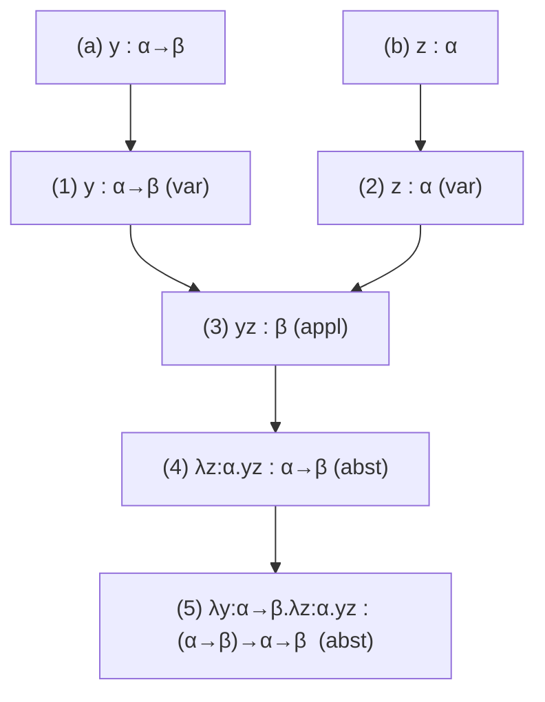

[[book-guidelines|↩ Back to guidelines]]

# The Simply Typed Lambda Calculus

## Why types at all?

Chapter 1 built the untyped $\lambda$-calculus: abstraction, application, $\beta$-reduction, and a proof (Church–Rosser) that reduction order never matters for the eventual answer. It's an elegant machine — and an *unrestrained* one. Nothing stops you from applying a term to itself. Nothing stops a term from having a fixed point (every $\lambda$-term $F$ satisfies $F X =_\beta X$ for some $X$, via the $Y$ combinator). Nothing stops a reduction sequence from running forever.

Those aren't bugs you can patch locally — they're structural consequences of letting *any* term be applied to *any* term. A function and its own argument live in the same undifferentiated soup of "terms." If you want the calculus to behave the way functions behave in ordinary mathematics or programming — where `square` is a function on $\mathbb{N}$ and simply doesn't accept `"hello"` as input — you need a mechanism that partitions terms into compatible families and *rejects* combinations that don't fit. That mechanism is a **type system**, and Chapter 2 builds the simplest one that works: simple types, $\lambda\to$.

The payoff, proved rigorously by the end of the chapter: self-application becomes literally untypable, every well-typed term reduces to a normal form in finitely many steps (no matter which redex you pick), and not every function has a fixed point. The three pathologies of Chapter 1, gone — at the cost of expressive power we'll spend the rest of the book buying back through richer type systems ($\lambda 2$, $\lambda\omega$, $\lambda P$, $\lambda C$).

**What breaks without this:** in Rust, if `x` weren't restricted to `Fn(Self) -> Self`-shaped values, `x(x)` would type-check for arbitrary `x`, and the type checker could never rule out `x(x(x(x(...))))` looping forever. Untyped $\lambda$-calculus is exactly this "if it parses, it runs" world — and the price is that termination and self-consistency are simply not guaranteed.

## Simple types: the grammar

The book's Definition 2.2.1 gives simple types the smallest inductive definition that could possibly work:

$$T = V \mid T \to T$$

Concretely: start from an infinite set of **type variables** $V = \{\alpha, \beta, \gamma, \dots\}$ (these stand for base types — think `nat`, `bool`, `list` — kept abstract because the chapter doesn't care about their internals yet). Then close under one production rule: if $\sigma, \tau \in T$, so is the **arrow type** $(\sigma \to \tau)$.

Two notational conventions matter for reading the book's derivations fluently:
- Outermost parentheses are dropped.
- The arrow is **right-associative**: $\alpha_1 \to \alpha_2 \to \alpha_3 \to \alpha_4$ abbreviates $(\alpha_1 \to (\alpha_2 \to (\alpha_3 \to \alpha_4)))$.

This is the opposite convention from application, which is left-associative ($x_1 x_2 x_3 x_4 \equiv (((x_1 x_2) x_3) x_4)$). The book points out (Remark 2.2.8) that these two choices are not independent: if $f : \rho \to \sigma \to \tau$ and $x : \rho$, $y : \sigma$, then $f x : \sigma \to \tau$ and $(f x) y : \tau$ — so writing $f x y : \tau$ with all parentheses dropped is unambiguous precisely *because* the two associativity conventions are duals of each other. Currying (splitting $f(x,y)$ into $f x y$) and the right-associative arrow are two faces of the same design decision.

**Rust grounding.** An arrow type $\sigma \to \tau$ is, almost literally, a function-pointer or closure type: `fn(Sigma) -> Tau`, or more idiomatically `impl Fn(Sigma) -> Tau`. Currying shows up exactly as it does in the book: a Rust closure returning a closure, `impl Fn(Sigma) -> impl Fn(Tau) -> Upsilon`, is the direct image of $\sigma \to \tau \to \upsilon \equiv \sigma \to (\tau \to \upsilon)$.

**Lean grounding.** Lean's own arrow type is written identically, `σ → τ`, right-associates identically, and Lean's kernel really does build up richer types (`Type`, dependent products) from this same base grammar extended step by step — which is exactly the trajectory this book will take over the coming chapters ($\lambda 2$ adds quantification over types, $\lambda P$ adds types depending on terms, culminating in $\lambda C$).

## Typing statements and two ways to assign types

To say "term $M$ has type $\sigma$" the book introduces a **statement** $M : \sigma$. The typing rules for the two term-forming operations of $\lambda$-calculus fall out almost by staring at what an application and an abstraction *mean*:

- **Application**: if $M$ maps $\sigma$-things to $\tau$-things (i.e. $M : \sigma \to \tau$) and $N : \sigma$, then $MN : \tau$.
- **Abstraction**: if, assuming $x : \sigma$, the body $M$ has type $\tau$, then $\lambda x . M$ (a function from $\sigma$ to $\tau$) has type $\sigma \to \tau$.

This is exactly what makes $x\,x$ untypable (Example 2.2.6(3)): if it had a type, $x$ would need to be simultaneously $\sigma \to \tau$ (as the function position) and $\sigma$ (as the argument position) — and since every variable is stipulated to have a *unique* type, $\sigma \to \tau \equiv \sigma$, "which is obviously impossible" (an arrow type can never be syntactically identical to its own left-hand side).

Now the book raises a genuinely important design fork: **who decides the type of each variable?**

- **Church-typing (explicit)**: every variable gets a type at the moment it's introduced, written directly into the term: $\lambda x : \sigma . M$. This is Church's own 1940 formulation, and it's what the rest of the book uses (Section 2.3, and confirmed in Section 2.13's conclusions).
- **Curry-typing (implicit)**: variables carry no annotation; you search for types that make the whole term work, effectively solving a system of type equations. Example 2.3.1(2) works through $(\lambda zu.z)(yx)$ by hand: from the shape of the term alone, unification of the constraints yields the general scheme $x:E,\ y:E\to A,\ z:A,\ u:C$, with the whole term at type $C \to A$. Crucially, this scheme has *many* instances — $x:\beta, y:\beta\to\alpha, z:\alpha, u:\delta$ is one; $x:\alpha, y:\alpha\to\alpha\to\beta, z:\alpha\to\beta, u:\alpha\to\alpha$ is another — so **a Curry-typed term does not have a unique type**. This is the one property Church-typing gets for free (Section 2.10's Uniqueness of Types) and Curry-typing gives up.

**Rust grounding.** This is precisely the difference between writing `let f: fn(i32) -> i32 = |x| x + 1;` (Church-style — you commit to the type up front) and writing `let f = |x| x + 1;` and letting Rust's inference engine solve for the type (Curry-style — the compiler runs essentially the same constraint-propagation the book does by hand in Example 2.3.1). Rust's closures are Curry-typed at the surface but the compiler always settles on one monomorphic type per closure; true Curry-style *multiple* valid typings is closer to unannotated ML/Haskell code before generalization.

**Lean grounding.** Lean's elaborator is fundamentally Curry-style from the user's perspective — `fun x => x + 1` has its type inferred — but internally it does so via metavariables and unification, not by "guessing," which is a more disciplined version of exactly the constraint-solving the book sketches informally. This chapter's Curry/Church fork is the ancestor of every "inference vs. checking" design decision a type-checker author has to make.

## The derivation system for Church's $\lambda\to$

Because variables now carry types, the term grammar itself changes. The book defines **pre-typed $\lambda$-terms** $\Lambda^T$:

$$\Lambda^T = V \mid (\Lambda^T \Lambda^T) \mid (\lambda V : T . \Lambda^T)$$

— identical to untyped $\Lambda$ except the abstraction case now demands a type annotation on the bound variable.

A **context** $\Gamma$ (also called a *basis*) is a list of declarations $x_1:\sigma_1, \ldots, x_n:\sigma_n$ with distinct subject variables, recording the types of the *free* variables in scope. A **judgement** $\Gamma \vdash M : \sigma$ then packages "in context $\Gamma$, term $M$ has type $\sigma$." Three derivation rules generate exactly the derivable judgements (Definition 2.4.5):

$$
(\mathrm{var})\ \ \Gamma \vdash x : \sigma \ \text{ if } x:\sigma \in \Gamma
\qquad\qquad
(\mathrm{appl})\ \ \dfrac{\Gamma \vdash M : \sigma \to \tau \quad \Gamma \vdash N : \sigma}{\Gamma \vdash MN : \tau}
$$

$$
(\mathrm{abst})\ \ \dfrac{\Gamma, x:\sigma \vdash M : \tau}{\Gamma \vdash \lambda x:\sigma.M : \sigma \to \tau}
$$

Notice the exact one-to-one match with the term grammar: one rule per syntactic constructor (variable / application / abstraction). This is not an accident — it's what makes the system **syntax-directed**, and it's the property (formalized later as the Generation Lemma) that makes type checking mechanically tractable: given a term, its outermost syntactic shape tells you which single rule could possibly have produced it.

A term is **legal** if some $\Gamma$ and $\sigma$ make $\Gamma \vdash M : \sigma$ derivable (Definition 2.4.10).

**The logic reading (Curry–Howard, previewed).** The book flags the correspondence explicitly in Examples 2.4.8–2.4.9: (appl) is *modus ponens* ($A \Rightarrow B,\ A \vdash B$) and (abst) is $\Rightarrow$-introduction (assume $A$, derive $B$, conclude $A \Rightarrow B$) — with the context extension $\Gamma, x:\sigma$ playing the role of the natural-deduction "flag" marking a scoped assumption. This chapter is where propositions-as-types first becomes visible mechanically, well before Chapter 5 names it PAT.

**Rust grounding.** These three rules are a type checker's `match` on term shape:
```rust
enum Term { Var(String), App(Box<Term>, Box<Term>), Abs(String, Type, Box<Term>) }

fn typecheck(ctx: &Context, t: &Term) -> Option<Type> {
    match t {
        Term::Var(x) => ctx.lookup(x),                         // (var)
        Term::App(m, n) => {                                   // (appl)
            let (sigma, tau) = typecheck(ctx, m)?.as_arrow()?;
            (typecheck(ctx, n)? == sigma).then_some(tau)
        }
        Term::Abs(x, sigma, m) => {                             // (abst)
            let tau = typecheck(&ctx.extend(x, sigma), m)?;
            Some(Type::Arrow(Box::new(sigma.clone()), Box::new(tau)))
        }
    }
}
```
This is not an analogy — it's what Sections 2.7–2.9 do by hand, and it's the literal shape any bidirectional type checker for a simply typed language takes.

**Lean grounding.** The three rules are exactly Lean's kernel's core inference judgments restricted to the non-dependent fragment (`Expr.app`, `Expr.lam` typing rules in `infer`/`check`). The (abst) rule's premiss "$\Gamma, x:\sigma \vdash M : \tau$" is precisely what Lean's kernel does when it pushes a local declaration onto the local context before recursing into a lambda body.

## Two ways to write a derivation: tree and flag style

A derivation built strictly bottom-up from the rules naturally forms a **tree**, each node one rule application, leaves at the (var)-rule. The book's running example — $\vdash \lambda y:\alpha\to\beta.\lambda z:\alpha.yz : (\alpha\to\beta)\to\alpha\to\beta$ — is worked as a five-step tree (Example 2.4.6), then the same steps are laid out **linearly**, numbered (i)–(v), each line annotated with which rule and which earlier lines it used.

Linear format still repeats contexts verbatim on every line, which becomes unwieldy fast. The book's fix, and the format it commits to using "in the text to come," is **flag notation**: each context declaration is written once inside a box (a "flag"), and every judgement line drawn below and to the right of that flag implicitly inherits it — with the flag's vertical pole marking the scope, exactly mirroring a natural-deduction "assume $A$ ... ⊢ ..." block.

```
  (a)    y : α → β
  (b)      z : α
  (1)       y : α → β                                    (var) on (a)
  (2)       z : α                                         (var) on (b)
  (3)       y z : β                                       (appl) on (1) and (2)
  (4)     λz:α.y z : α → β                                (abst) on (3)
  (5)   λy:α→β.λz:α.y z : (α→β) → α → β                    (abst) on (4)
```

The book also permits a further shortening: silently omitting (var)-rule steps once their content is obvious, collapsing (1)–(2) directly into the (appl) applied to flags (a) and (b). This is the format the rest of the book (and this article's grounding examples below) will use whenever a derivation needs to be shown.

**Diagram note.** The dependency structure among derivation lines — line $J$ must follow every line it was built from — forms a strict partial order (irreflexive, asymmetric, transitive), visualized as the tree shape. Below is that dependency shape for the example above:



## The three canonical problems

Section 2.6 names the recurring shapes a type-theory question can take — a taxonomy worth memorizing because it recurs at every layer of the book:

1. **Well-typedness** (Typability): $?\vdash \text{term} : ?$ — find *some* context and type that work, or show none exist. A variant, **Type Assignment**, fixes the context and asks only for the type: $\text{context}\vdash \text{term}:?$.
2. **Type Checking**: $\text{context}\overset{?}{\vdash}\text{term}:\text{type}$ — context, term, and type are all given; just verify.
3. **Term Finding** (Term Construction, Inhabitation): $\text{context}\vdash ?:\text{type}$ — given a context and a target type, find (or refute the existence of) an inhabiting term. The special case $\emptyset \vdash ? : \text{type}$ asks whether a type is inhabited *at all* in the empty context — which, under the PAT reading, is exactly asking whether a proposition is a theorem.

All three are proved **decidable** in $\lambda\to$ (Theorem 2.10.10) — a fact the book flags as special: in the richer systems built in later chapters, Term Finding in particular becomes undecidable in general (this is where automated theorem proving hits a hard wall).

Sections 2.7–2.9 work each problem by hand on running examples, and the book highlights a structural mirror-image between them (Remark 2.9.2, Figure 2.2): Well-typedness and Type Checking proceed *term-first* — decompose the term into simpler subterms (upward), find their types, then recombine (downward) until the original term's type falls out. Term Finding proceeds *type-first* — decompose the target type, find inhabitants of the pieces, then recombine into an inhabitant of the whole.

Term Finding's worked example is the tautology $A \to B \to A$: driven purely by matching the target type's shape against the (abst) rule twice, then closing with (var), the derivation *mechanically produces* $\lambda x:A.\lambda y:B.x$ — the term whose PAT reading is "assume a proof of $A$, assume a proof of $B$, hand back the proof of $A$ you already had," i.e., a proof of $A \Rightarrow (B \Rightarrow A)$.

**Rust grounding.** Type Checking is what `rustc` does on every function body against its declared signature. Term Finding, restricted to $\emptyset \vdash ? : \text{type}$, is exactly what a **proof-search / program-synthesis** tool does — Rust doesn't have this built in for arbitrary types, but tools like `hoogle`-for-types (search by signature) in Haskell, or Lean's `exact?`/`apply?` tactics, are Term-Finding engines for exactly this problem shape.

**Lean grounding.** This taxonomy maps directly onto Lean's tactic-mode workflow: writing a `theorem foo : P := by ...` and letting tactics like `exact?` or `apply` search is literally Term Finding against the goal type; `#check` on a fully-elaborated term is Type Checking; elaborating a term with `_` placeholders and letting Lean infer missing pieces sits at Type Assignment. The book's own note that Term Finding "boils down to" checking provability in natural deduction is the precise statement of Curry–Howard that makes Lean's `exact?` a theorem-prover.

## General properties: what makes the system trustworthy

Section 2.10 assembles the metatheoretic toolkit — proved by **structural induction on derivations**, the recurring proof technique the book introduces here and reuses for the rest of the book (assume the property for the premisses used to build a judgement, show it survives one more rule application).

- **Free Variables Lemma** (2.10.3): $\Gamma \vdash L : \sigma \implies FV(L) \subseteq \mathrm{dom}(\Gamma)$. Every free variable in a legal term is accounted for in the context — no dangling, unexplained names.
- **Thinning / Condensing / Permutation Lemmas** (2.10.5): a context can be padded with irrelevant declarations (Thinning) or trimmed to only the free variables actually used (Condensing) without affecting derivability, and reordered arbitrarily (Permutation) — "one may add or remove junk to/from a context... without affecting derivability."
- **Generation Lemma** (2.10.7): the converse of the three derivation rules — read *backwards*, syntax-directed. If $\Gamma \vdash MN : \tau$, there *must* exist a $\sigma$ with $\Gamma \vdash M:\sigma\to\tau$ and $\Gamma \vdash N:\sigma$; similarly for abstraction. This is what turns "guess a rule" into "the term's shape tells you the rule" — the formal justification for why type checking is an algorithm and not a search.
- **Subterm Lemma** (2.10.8): every subterm of a legal term is itself legal (in some context).
- **Uniqueness of Types** (2.10.9): if $\Gamma \vdash M:\sigma$ and $\Gamma \vdash M:\tau$, then $\sigma \equiv \tau$. This is Church-typing's headline win over Curry-typing, and it's what makes proof-checking-as-type-checking well-defined: a term codes exactly one proposition.

**Load-bearing note (for the elaborator project):** Uniqueness of Types and the Generation Lemma together are the two properties that make a bidirectional (infer/check) type checker deterministic rather than a search procedure. Any Rust type-checker or Lean-style elaborator built later inherits its termination and determinism guarantees from exactly these two lemmas, proved here in miniature before the book scales the same argument up through $\lambda2, \lambda\omega, \lambda P, \lambda C$ (where Uniqueness gets weakened to "up to conversion" once types themselves can reduce — Chapter 4).

## Reduction meets typing: Substitution Lemma, Subject Reduction, Strong Normalisation

Section 2.11 extends $\beta$-reduction to $\Lambda^T$ — mechanically the same as Chapter 1, just carrying the type annotation through the abstraction case of substitution: $(\lambda y:\sigma.P)[x:=N] \equiv \lambda z:\sigma.(P^{y\to z}[x:=N])$ for a suitably fresh $z$.

Three results anchor the whole chapter:

**Substitution Lemma** (2.11.1). If $\Gamma', x:\sigma, \Gamma'' \vdash M:\tau$ and $\Gamma', \Gamma'' \vdash N:\sigma$, then $\Gamma', \Gamma'' \vdash M[x:=N] : \tau$. Plugging a term of the right type into a hole preserves the type of the whole — the load-bearing lemma underneath Subject Reduction's proof, proved (like everything here) by induction on the derivation, with the abstraction case doing the real work.

**Subject Reduction** (2.11.5). If $\Gamma \vdash L:\rho$ and $L \twoheadrightarrow_\beta L'$, then $\Gamma \vdash L' : \rho$. Computation (β-reduction) never changes a term's type — "$3+5$ is a natural number, and it remains so after evaluation to $8$." Proved by induction on the reduction, with the interesting (Basis) case leaning directly on Generation (twice) plus Substitution.

**Strong Normalisation / Termination Theorem** (2.11.6). Every legal term in $\lambda\to$ is strongly normalising: *every* reduction sequence from it is finite, regardless of which redex you contract at each step. (The book doesn't reprove this in full — it cites a positive integer-valued measure that strictly decreases with each $\beta$-step — but flags that this is historically subtle: weak normalisation was proved by Turing in the 1940s but only written up decades later by his student Gandy; strong normalisation is due to Sanchis (1965), with Tait's semantic-interpretation proof the most famous.)

**Consequences (Section 2.12) — closing the loop on Chapter 1's pathologies:**
1. **No self-application**: if $MM$ were legal, Generation + Uniqueness would force $\sigma\to\tau \equiv \sigma$ for some $M:\sigma\to\tau$ and $M:\sigma$ simultaneously — impossible.
2. **Normal forms always exist** — immediate from Strong Normalisation.
3. **Not every function has a fixed point**: the $Y$-combinator's untyped proof relied on self-application ($xx$-shaped subterms), which is now unavailable; the book gives a direct argument that a legal $F:\sigma\to\tau$ with $\sigma \not\equiv \tau$ cannot satisfy $FM =_\beta M$, using Confluence + Subject Reduction + Uniqueness of Types together.

**What breaks without Subject Reduction, concretely:** a type-checker that only checks the *source* program but not what it reduces to during evaluation would be unsound if reduction could change a term's type — you'd get a program that "type-checks" but crashes at runtime with a type mismatch. Subject Reduction is precisely the theorem that rules this out; it's the formal content of "well-typed programs don't go wrong" restricted to $\lambda\to$'s pure computation model (no crashes possible here since there's no primitive operation to apply to the wrong type — but the *proof technique* is exactly what a soundness proof for a real language reuses).

**Rust grounding.** Subject Reduction is the theorem-shaped justification for why `rustc` only needs to type-check *source*, never re-check after every optimization/inlining pass — reduction (in Rust's case, `mir-opt` transformations, constant folding, monomorphization) is guaranteed not to change a term's type. Strong Normalisation is why a total, effect-free fragment of a language (no recursion, no loops) is guaranteed to terminate — this is exactly the guarantee `const fn` evaluation and macro expansion need, and exactly what's given up the moment you add general recursion (Section 2.14 notes PCF's fixed-point constant $Y_\sigma : (\sigma\to\sigma)\to\sigma$ restores Turing-completeness precisely by breaking this guarantee).

**Lean grounding.** Subject Reduction is one of the properties Lean's kernel soundness rests on: definitional equality (`isDefEq`, driven by weak-head reduction) must never let a term's type "drift," or `rfl`-based proofs and `Eq.mpr` casts could be unsound. Strong Normalisation is the deeper reason Lean's kernel *type-checking* — as opposed to arbitrary tactic execution — is decidable and terminates: this is precisely the property that gets carefully preserved (via strict positivity conditions on inductive types, and no unrestricted general recursion in the kernel's core calculus) as Lean's type theory is built up from something in this book's lineage.

## Where this leads

Chapter 2 buys correctness (no self-application, guaranteed normal forms, no universal fixed points) but at a real expressivity cost the book is upfront about (Section 2.13): $\lambda\to$ can encode Church numerals but only the *generalised polynomial* functions on them — nowhere near enough for real mathematics. Every subsequent typed system in this book is a controlled relaxation that restores expressivity while trying to keep as much of this chapter's metatheory intact:

- **Chapter 3** ($\lambda2$) lets *terms* depend on *types* (polymorphism), needing a new binder ($\Pi$) because the arrow alone can't express "for all types $\alpha$."
- **Chapter 4** ($\lambda\omega$) lets *types* depend on *types* (type constructors, kinds), which is also where Uniqueness of Types has to be relaxed to "up to $\beta$-conversion" (Chapter 4's Conversion rule) — a direct consequence of types themselves now being reducible.
- **Chapter 5** ($\lambda P$) lets *types* depend on *terms* — the PAT-interpretation glimpsed informally here in Section 2.9 becomes the chapter's organizing principle, and $\forall$ becomes literally the $\Pi$-type over terms.
- **Chapter 6** ($\lambda C$) unifies all three extensions into the Calculus of Constructions, the basis of the rest of the book's formalization project (definitions, sets, arithmetic, Bézout's Lemma).

For the standing project threads: the (var)/(appl)/(abst) rule triple proved here is the shared ancestor this book will keep extending rather than replacing — every later chapter's derivation system is literally these three rules plus new cases, so the syntax-directedness (Generation Lemma) and structural-induction proof technique established in Section 2.10 is the template every later metatheorem reuses. And the Church/Curry fork in Section 2.3 is the first appearance of the inference-vs-explicit-annotation design tension that a bidirectional elaborator has to resolve at every single term-forming construct it supports.
