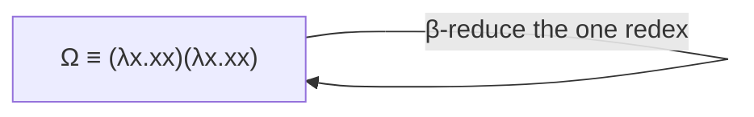
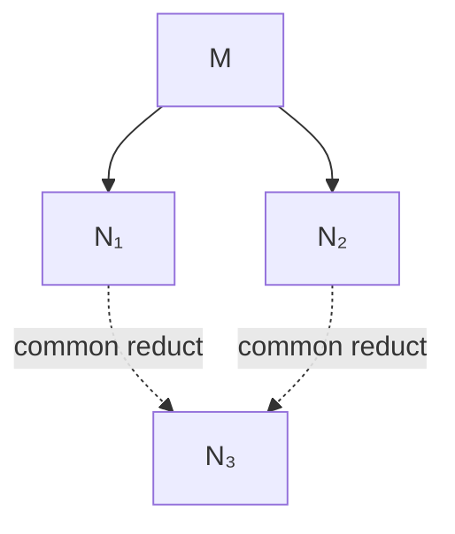
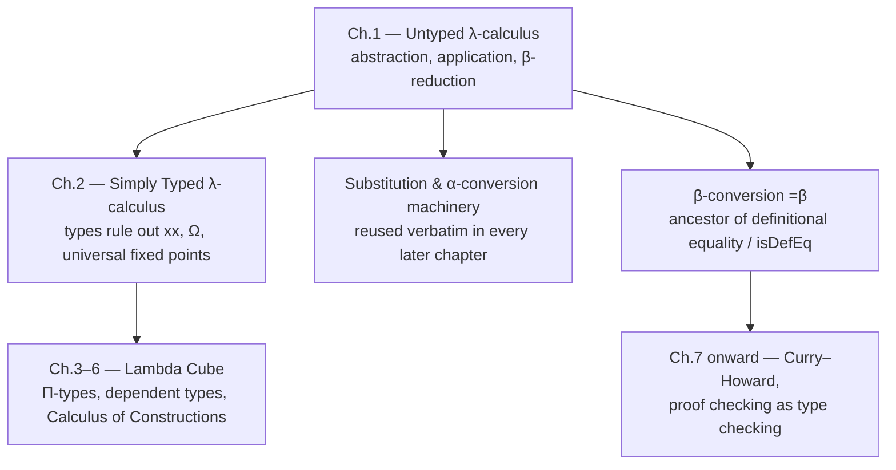

[[book-guidelines|↩ Back to guidelines]]

## Why build a calculus with no numbers, no booleans, nothing but functions?

Suppose you wanted to strip "function" down to its absolute minimum — no
built-in arithmetic, no data types, nothing except the bare act of *taking an
input and producing an output*. What's left? Two things: a way to *build* a
function (abstraction), and a way to *use* one (application). Everything
else — numbers, truth values, loops, recursion — you'd have to construct out
of those two primitives alone.

That's the bet Alonzo Church made in the 1930s, and it turned out to be
extraordinarily well-placed: this minimal system, the **untyped
$\lambda$-calculus**, is exactly as powerful as any other notion of
"computable" ever devised (Turing machines, general recursive functions,
Herbrand–Gödel computability — they all coincide, a fact enshrined as the
**Church–Turing thesis**). Chapter 1 of Nederpelt & Geuvers builds this
calculus from scratch, and — crucially for the rest of the book — ends by
cataloguing exactly what goes *wrong* with it. Those failures are not a dead
end; they're the reason chapters 2 onward exist at all. Type theory is best
understood as a *repair* of the untyped calculus, not a system built in a
vacuum, so understanding what breaks here is just as important as
understanding what works.

If you've written a compiler, an interpreter, or even just a recursive
descent parser, most of this chapter will feel like formalizing things you
already do informally. The payoff is that "formalizing things you already do
informally" is precisely what makes precise proof possible later.

## Two ways to build a term, one way to run it

### Abstraction and application

Take an ordinary expression like $x^2 + 1$. It's ambiguous in an interesting
way: is it "the number you get by squaring $x$ and adding one," or is it "the
*function* that does this to any $x$"? Ordinary math notation elides the
distinction. $\lambda$-calculus refuses to.

Writing $\lambda x . x^2 + 1$ says explicitly: *this is a function*, and $x$
is not a fixed value but a placeholder for "whatever gets plugged in later."
This is **abstraction**: from an expression $M$ and a variable $x$, you build
a new expression $\lambda x . M$.

The complementary move is **application**: from two expressions $M$ and $N$,
you build $M N$ — "apply $M$, treating it as a function, to $N$." Note
carefully: constructing $M N$ is *not* the same as running the function. It's
just syntax, a new term. Whether it ever "does anything" is a separate
question, answered by the evaluation rule below.

```rust
// The two construction principles, made literal as an enum.
// This *is* the untyped lambda calculus's AST — nothing more, nothing less.
enum Term {
    Var(String),
    App(Box<Term>, Box<Term>),
    Abs(String, Box<Term>), // λx . M
}
```

**What breaks without abstraction/application as separate primitives:** if
you only had application (no way to name "the function that squares"), every
function would have to be a built-in primitive — you couldn't define your
own. If you only had abstraction (no way to actually call anything), you
could describe functions but never run them. You need both, and you need
them to compose freely — a function can itself be the input or output of
another function. That "functions as first-class values" property is exactly
what a language like Rust gets for free from closures, and it's not an
accident that closures look like $\lambda$-terms.

### Beta-reduction: the one evaluation rule

Given a term $(\lambda x . M) N$ — an abstraction applied to an argument —
there's exactly one way to "run" it: substitute $N$ for every occurrence of
$x$ inside $M$. This is **$\beta$-reduction**, and $(\lambda x . M)N$ is
called a **redex** (*reducible expression*); the result $M[x := N]$ is its
**contractum**.

$$(\lambda x . x^2 + 1)(3) \to_\beta (x^2+1)[x := 3] = 3^2+1$$

That's it. That one rule, applied wherever a redex appears (even nested
inside a bigger term — the *compatibility rules* extend reduction to
subterms), is the entire "computation" mechanism of the calculus. Everything
you'd recognize as "running a program" — recursion, arithmetic, control flow —
gets encoded as some sequence of $\beta$-reductions.

```python
# Illustrative only — real capture-avoiding substitution needs the machinery below.
def beta_reduce_naive(term):
    if is_redex(term):           # (λx.M) N
        x, M, N = unpack(term)
        return substitute(M, x, N)
    return term
```

## Currying: functions of one argument are enough

The $\lambda$-notation only takes one argument at a time. A two-argument
function like $f(x,y) = x^2 + y$ doesn't fit directly — but rather than
extending the notation, Nederpelt & Geuvers show it's unnecessary: write
$f$ as $\lambda x . (\lambda y . x^2 + y)$, a function that takes $x$ and
*returns another function* waiting for $y$. This is **Currying** (after H.B.
Curry, though the idea traces to Schönfinkel).

There's a real behavioral difference between the pair-taking version and the
curried version: $g := \lambda x.(\lambda y. x^2+y)$ lets you apply *one*
argument and stop — $g(3)$ is a perfectly good term, reducing to
$\lambda y . (3^2+y)$ — a *partially applied* function. This is exactly
Rust's (and every functional language's) closures-as-partial-application:

```rust
fn curry_add(x: i32) -> impl Fn(i32) -> i32 {
    move |y| x * x + y   // returning a closure = returning a λ-term
}
let g = curry_add(3);    // g(3) in the book's notation — stops here, valid on its own
let result = g(5);        // second argument comes later
```

**What breaks without currying:** without it, every $n$-argument function
needs its own bespoke multi-argument construct, and partial application
becomes impossible to express uniformly. Currying buys you a uniform
one-argument calculus at essentially no cost in expressiveness.

## The syntax, precisely: $\Lambda$, subterms, and free/bound variables

### The inductive definition of terms

Formally, the set $\Lambda$ of all $\lambda$-terms is defined inductively —
assuming an infinite supply of variables $V = \{x, y, z, \ldots\}$:

$$\Lambda = V \mid (\Lambda\,\Lambda) \mid (\lambda V . \Lambda)$$

i.e. every term is either a bare variable, an application of two terms, or an
abstraction over a term. This grammar *is* the AST from the Rust snippet
above — Definition 1.3.2 in the book is, syntactically, exactly a
context-free grammar for an expression language.

The book also defines $\mathrm{Sub}(M)$, the multiset of all subterms of $M$,
recursively over the same three cases. It's a multiset (not a set) because a
term like $(x\,x)$ has *two occurrences* of the subterm $x$ — they count
separately, which matters once you start reasoning about which occurrence of
a variable gets bound or substituted.

```lean
-- The book's grammar transcribed directly as a Lean inductive type.
-- This is, almost verbatim, how a real proof assistant's term type starts.
inductive Term where
  | var : String → Term
  | app : Term → Term → Term
  | abs : String → Term → Term
```

### Free, bound, and binding occurrences

A variable occurrence in a term falls into one of three categories:

- **Binding**: the $x$ immediately after a $\lambda$, as in $\lambda x . M$.
- **Bound**: an occurrence of $x$ inside $M$ that is "caught" by that $\lambda x$.
- **Free**: an occurrence not caught by any enclosing $\lambda$.

Formally, $FV(L)$ (the free variables of $L$) is defined recursively:

$$FV(x) = \{x\}, \quad FV(MN) = FV(M) \cup FV(N), \quad FV(\lambda x . M) = FV(M) \setminus \{x\}$$

A term with no free variables at all is **closed**, also called a
**combinator**; the set of all closed terms is written $\Lambda^0$.

**What breaks without tracking free/bound status precisely:** if you don't
distinguish free from bound occurrences, you can't tell whether renaming a
variable, or substituting into a term, is safe. This distinction is the
entire reason the next two sections (α-conversion, substitution) need to
exist as *careful*, not *casual*, definitions — and it's exactly the
distinction a real typechecker's scope-resolution pass has to get right, or
variables silently alias things they shouldn't.

## Alpha-conversion: names don't matter, but renaming them safely is subtle

$\lambda x . x^2$ and $\lambda u . u^2$ mean the same function — "square its
input" — regardless of what you call the input. This identification is
**α-conversion**: two terms that differ only in a systematic renaming of
bound variables are considered the same term.

The formal definition (1.5.1) is more careful than "just rename it,"
though, because naive renaming can go wrong in two distinct ways:

1. **Capturing a free variable.** Renaming the bound $x$ in $\lambda x . y$
   to $y$ gives $\lambda y . y$ — but now the *free* $y$ from the original
   term has become *bound*. That's a different function: the first always
   returns the free variable $y$ regardless of input; the second returns
   whatever you feed it. The fix: only rename $x$ to $y$ if $y$ doesn't
   already occur free in the body.
2. **Colliding with an existing binder.** Renaming $x$ to $y$ in
   $\lambda x . \lambda y . x$ gives $\lambda y . \lambda y . y$ — but now the
   inner $\lambda y$ has hijacked the renamed variable, changing which
   binder captures it. The fix: only rename $x$ to $y$ if $y$ isn't already
   a binding variable somewhere inside.

```rust
// A renaming function that respects both side-conditions from Def. 1.5.1.
// This is not a toy: get either check wrong and your "compiler" silently
// changes program meaning under alpha-renaming — a real, embarrassing bug class.
fn rename(term: &Term, x: &str, y: &str) -> Result<Term, CaptureError> {
    if free_vars(term).contains(y) {
        return Err(CaptureError::WouldCaptureFreeVariable);
    }
    if binding_vars(term).contains(y) {
        return Err(CaptureError::WouldCollideWithBinder);
    }
    Ok(replace_free_occurrences(term, x, y))
}
```

Once α-equivalence is established as an equivalence relation (reflexive,
symmetric, transitive, plus compatibility with application/abstraction), the
book adopts **Convention 1.7.2**: from here on, α-convertible terms are
simply *identified* — treated as the same term, full stop. This is why, from
Chapter 1 §1.7 onward, you'll see $\lambda x . x \equiv \lambda y . y$ written
with plain syntactic identity ($\equiv$), not $=_\alpha$.

A companion convention worth internalizing: the **Barendregt convention**
says to always pick binder names so that every binding variable in a term is
distinct from every other binder *and* from every free variable in scope.
This is exactly what a real compiler's "uniquify" or "alpha-rename" pass does
before any further analysis — it eliminates an entire class of shadowing bugs
by construction, at the cost of some fresh-name bookkeeping.

## Substitution: harder than it looks

Substitution, $M[x := N]$ — "replace free $x$'s in $M$ with $N$" — was used
informally above to state $\beta$-reduction. Definition 1.6.1 makes it
precise, by recursion on the structure of $M$:

$$
\begin{aligned}
x[x := N] &\equiv N \\
y[x := N] &\equiv y \quad (x \not\equiv y) \\
(PQ)[x := N] &\equiv (P[x := N])(Q[x := N]) \\
(\lambda y . P)[x := N] &\equiv \lambda z . (P^{y \to z}[x := N]), \quad \text{if needed, } z \notin FV(N)
\end{aligned}
$$

The first three clauses are exactly what you'd guess: substitute directly
into a variable, leave other variables alone, distribute through
application. The fourth clause is where the real content lives: pushing a
substitution *through a binder* risks the same capture problem as
α-conversion. If $N$ contains a free variable $y$ that happens to match the
binder in $\lambda y . P$, naively substituting would let that free $y$
become accidentally bound.

Example 1.6.4 makes this concrete: computing $(\lambda y . yx)[x := xy]$
naively (without renaming $y$) gives $\lambda y . y(xy)$ — but the free $y$
inside $xy$ has now been captured by the outer $\lambda y$. The fix,
required by clause (4), is to first rename the bound $y$ to a fresh variable
(say $z$) that doesn't occur free in $N$, *then* substitute:

$$(\lambda y . yx)[x := xy] \equiv \lambda z . (zx)[x := xy] \equiv \lambda z . z(xy)$$

**What breaks without capture-avoidance:** this is not a pedantic edge case —
it's the single most common source of soundness bugs in real interpreters,
elaborators, and program logics. If your evaluator's substitution function
doesn't rename bound variables away from the free variables of the thing
being substituted in, you get programs that behave differently after
"equivalent" rewriting steps. For the Hoare-triple verifier this book's
learning goals point toward: capture-avoiding substitution is *exactly* the
mechanism that has to be airtight for a substitution-based proof rule (e.g.
the assignment axiom $\{P[x := e]\} \; x := e \; \{P\}$) to be sound. Get
substitution wrong and your "proof" can certify something false.

```rust
fn substitute(term: &Term, x: &str, n: &Term) -> Term {
    match term {
        Term::Var(v) if v == x => n.clone(),
        Term::Var(v) => Term::Var(v.clone()),
        Term::App(p, q) => Term::App(
            Box::new(substitute(p, x, n)),
            Box::new(substitute(q, x, n)),
        ),
        Term::Abs(y, p) if y == x => Term::Abs(y.clone(), p.clone()), // x shadowed, stop
        Term::Abs(y, p) if !free_vars(n).contains(y) => {
            Term::Abs(y.clone(), Box::new(substitute(p, x, n)))
        }
        Term::Abs(y, p) => {
            // capture would occur — rename the binder to something fresh first
            let z = fresh_name(y, &free_vars(n));
            let p_renamed = rename(p, y, &z).unwrap();
            Term::Abs(z, Box::new(substitute(&p_renamed, x, n)))
        }
    }
}
```

One more subtlety, worth flagging because it recurs in every substitution-
heavy system: substitutions don't commute freely. In general
$M[x:=N][y:=L] \not\equiv M[y:=L][x:=N]$ — order matters, because performing
$[x:=N]$ first can introduce new free occurrences of $y$ (hidden inside $N$)
that then get caught by the second substitution. Lemma 1.6.5 gives the
correct swap rule:

$$M[x := N][y := L] \equiv M[y := L][x := N[y := L]], \quad \text{provided } x \notin FV(L)$$

This "substitution commutation lemma" pattern reappears, nearly verbatim, as
one of the foundational metatheoretic lemmas in every subsequent chapter of
the book — it's load-bearing infrastructure, not a one-off exercise.

## Beta-reduction, formally: one step, many steps, and equality

With substitution nailed down, $\beta$-reduction can finally be stated precisely.

**One-step reduction** ($\to_\beta$): $(\lambda x . M)N \to_\beta M[x := N]$,
extended to subterms by compatibility rules (reduce inside an application or
under a binder).

**Zero-or-more-step reduction** ($\twoheadrightarrow_\beta$): the reflexive-
transitive closure of $\to_\beta$ — a whole chain of single steps,
$M \equiv M_0 \to_\beta M_1 \to_\beta \cdots \to_\beta M_n \equiv N$.

**Conversion** ($=_\beta$): the equivalence relation generated by
$\to_\beta$ in *either direction* — you're allowed to reduce forward, or
"un-reduce" backward, in any combination, as long as the two terms are
connected by *some* zigzagging chain of single steps. This models the
intuition that $10 \times (8-2)$ and $10 \times 6$ are "the same value,"
even though getting from one to the other in a derivation might require a
step that looks like it's going "backward."

```lean
-- The Lean analogue: `=β` is, structurally, exactly what `Eq` (definitional
-- equality up to reduction) is doing under the hood. When Lean's kernel
-- checks `rfl`, it is checking `=β`-style convertibility, not syntactic identity.
example : (fun x => x + 1) 3 = 4 := by rfl
```

This is the single most important conceptual bridge for the elaborator/
unifier project in view: what the book calls $=_\beta$ — β-conversion — is
*precisely* the relation that a real proof assistant's `isDefEq`
(definitional equality check) has to decide. When Lean's kernel accepts
`rfl` for `(fun x => x + 1) 3 = 4`, it is running exactly this
reduce-and-compare process: normalize both sides under $\to_\beta$ (plus,
later, δ-reduction for definitions — Chapter 8 territory) and check they
land on the same term. Understanding $=_\beta$ *is* understanding what
`isDefEq` computes.

Reduction is nondeterministic — a term can contain multiple redexes, and
which one you contract first is a free choice (Example 1.8.2 shows a term
with two redexes, reducing to two syntactically different — though still
$\alpha$-distinct — intermediate results). The natural question this raises:
does the *choice* of reduction order matter for the final answer?

## Normal forms, confluence, and why the order of evaluation doesn't matter

A term is in **$\beta$-normal form** if it contains no redex — no more
reduction is possible, so it's a genuine "final answer." A term **has** a
normal form if some chain of reductions reaches one; it's **weakly
normalising** if *some* reduction path terminates, **strongly normalising**
if *every* reduction path terminates (no infinite reduction sequence exists
at all, no matter which redex you keep choosing).

Not every term normalizes. The canonical counterexample is
$\Omega := (\lambda x . xx)(\lambda x . xx)$ — a term that, when reduced,
produces *itself*, forever:

$$\Omega \to_\beta \Omega \to_\beta \Omega \to_\beta \cdots$$



This already tells you something important: the untyped calculus contains
terms with *no meaningful outcome at all* — the formal analogue of an
infinite loop, expressible without any explicit "loop" construct.

The deep theorem that redeems the nondeterminism of reduction order is the
**Church–Rosser theorem** (also called **confluence**, abbreviated **CR**):

> If $M \twoheadrightarrow_\beta N_1$ and $M \twoheadrightarrow_\beta N_2$,
> then there exists some $N_3$ with $N_1 \twoheadrightarrow_\beta N_3$ and
> $N_2 \twoheadrightarrow_\beta N_3$.



In words: however far apart two reduction paths from the same starting term
have diverged, they can always be brought back together. This is exactly
the property that makes "the outcome of a calculation" well-defined
regardless of which redex you happen to pick first — mirroring, e.g.,
$(3+5) \times (7-3)$ reaching $32$ whether you simplify the left or right
factor first.

The immediate corollary — and the one that actually matters in practice — is
**uniqueness of normal forms** (Lemma 1.9.10): a $\lambda$-term has *at most
one* $\beta$-normal form. If it has one at all, every reduction strategy
that terminates will find the *same* one. This is the formal justification
for something every programmer already relies on informally: "the value of
an expression doesn't depend on evaluation order" (in a pure, terminating
setting) — confluence is the theorem that makes that intuition rigorous.

**What breaks without confluence:** without it, "the meaning of a program"
would depend on implementation-specific choices about which redex to reduce
first, and two implementations of the same calculus could legitimately
disagree about the answer. Confluence is what makes $=_\beta$ a *sensible*
notion of equality rather than an accident of evaluation strategy.

## Fixed points: every term has one, and that's both a feature and a warning sign

Here's a genuinely strange fact about the untyped calculus, with no analogue
in ordinary function theory: **every** $\lambda$-term $L$ has a fixed point —
some $M$ with $LM =_\beta M$. Compare with ordinary functions on the
naturals: $\mathrm{square}$ has fixed points $0$ and $1$, but
$\mathrm{successor}$ has *none* — no $n$ satisfies $n+1 = n$. In the
$\lambda$-calculus, by contrast, fixed points always exist, for *every*
function, with no exceptions (Theorem 1.10.1). The proof is a direct
construction:

$$M := (\lambda x . L(xx))(\lambda x . L(xx))$$

Unwinding one step confirms $M \to_\beta L(M)$, hence $LM =_\beta M$. Pulling
$L$ out as a parameter of this construction yields the celebrated **fixed
point combinator**:

$$Y := \lambda y . (\lambda x . y(xx))(\lambda x . y(xx))$$

with $Y L$ a fixed point of $L$ for *any* $L$. This isn't just a curiosity —
it's the mechanism that lets the untyped calculus express **recursion**
without any built-in recursive-definition syntax. A recursive equation like

$$\mathrm{fac}\ x =_\beta \text{if}\ (\mathrm{iszero}\ x)\ \text{then}\ 1\ \text{else}\ \mathrm{mult}\ x\ (\mathrm{fac}\ (\mathrm{pred}\ x))$$

is solved by abstracting the recursive call into a fresh variable, wrapping
in a $\lambda$, and applying $Y$:

```python
# Illustrating the *shape* of the encoding, not real untyped-lambda syntax.
def Y(L):
    def make_fixed_point(x):
        return L(lambda *args: x(x)(*args))
    return make_fixed_point(make_fixed_point)

def fac_step(self_fac):
    return lambda n: 1 if n == 0 else n * self_fac(n - 1)

factorial = Y(fac_step)   # recursion, with no `def factorial` self-reference anywhere
```

**What breaks — or rather, what this signals — about the untyped calculus:**
this universal existence of fixed points is exactly the same phenomenon
underlying $\Omega$'s non-termination, and it is the formal fingerprint of a
system with *no restrictions on self-application*. A term like $xx$ — a
variable applied to itself — is perfectly well-formed syntax, and it's
precisely self-application ($x$ applied to $x$ inside $Y$'s own definition)
that manufactures the fixed point. The same mechanism that gives you
recursion "for free" is what makes the system Turing-complete — and Turing-
complete systems necessarily contain non-terminating terms and undecidable
questions (you cannot, in general, decide whether an arbitrary $\lambda$-term
has a normal form; that's equivalent to the halting problem).

## Conclusions: the pathologies that motivate everything that follows

The chapter closes (§1.11) with an explicit ledger. On the positive side:
a clean, minimal formalization of function behavior; rigorous (if subtle)
substitution; confluence; unique normal forms; solvable recursive equations;
Turing-completeness. On the negative side, three specific pathologies:

1. **Self-application is unrestricted.** Terms like $xx$ or $MM$ are
   syntactically valid with no special treatment, despite having no
   sensible "type" — a function applied to itself, in ordinary mathematics,
   doesn't typecheck.
2. **Normal forms aren't guaranteed.** $\Omega$ and similar terms loop
   forever; there's no way, from the syntax alone, to rule this out.
3. **Every term has a fixed point.** This is deeply at odds with how
   *specific* mathematical functions (successor, e.g.) actually behave —
   the untyped calculus's uniformity is bought at the price of encoding
   things that shouldn't be possible.

All three trace back to the same root cause: nothing in the untyped grammar
prevents a term from being applied to itself, or to things it "shouldn't"
apply to. The entire project of the next chapter — adding **simple types** —
is a targeted response to exactly this: a type system is, at bottom, a
syntactic discipline that rules out self-application and the pathological
terms it enables, while (ideally) keeping everything else about the
calculus's good behavior (confluence, well-defined substitution, and so on)
intact.

## Where this leads



Chapter 1's machinery isn't scaffolding to be discarded — the definitions of
$FV$, α-conversion, capture-avoiding substitution, and $\beta$-reduction
survive essentially unchanged into every typed system the rest of the book
builds. What changes starting in Chapter 2 is that a **typing relation** gets
layered on top, restricting which terms are even well-formed enough to
reduce in the first place — ruling out $\Omega$ and $xx$ not by special-
casing them, but by making them simply un-typeable.

For the standing goals this vault is tracking: the substitution machinery
here — get it wrong and you get variable capture — is *the* mechanism a
Hoare-triple-style verifier's assignment rule depends on for soundness, and
$\beta$-conversion is the direct ancestor of the definitional-equality check
(`isDefEq`) any elaborator needs to decide when two terms "mean the same
thing" without being syntactically identical. Confluence is what guarantees
that check is well-defined in the first place — regardless of which
reduction strategy the implementation happens to use.
