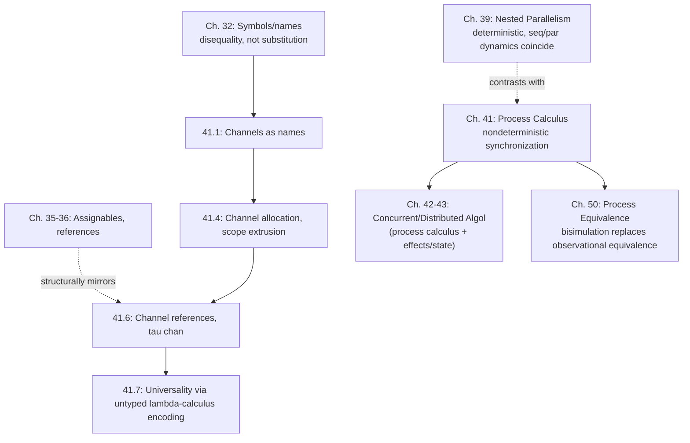

# Concurrency and Process Calculus

[[book-guidelines|↩ Back to guidelines]]

## The problem: a program that must talk to the world, not just compute a value

Everything up to this chapter has studied programs *in isolation*: given an input, what value does it compute, and how fast. But real programs — servers, UIs, protocols — don't just compute values, they *interact* with other independent agents over time, and the whole point of the interaction is often that neither side fully controls or predicts the other's timing. [[Parallelism|The previous chapter]] deliberately proved fork-join computation is *deterministic* — parallel and sequential [[Exceptions#Dynamics|dynamics]] coincide, so scheduling never affects meaning. Process calculus is the chapter that abandons that guarantee on purpose: **concurrency is about composition of interacting agents, not efficiency, and its semantics is nondeterministic by design**, because the whole reason to model interaction is that you genuinely don't know in advance which agent will act first.

**What breaks without a formalism for this:** without a calculus that treats interaction as a first-class semantic phenomenon, "concurrent programming" degenerates into ad hoc reasoning about interleavings, races, and lock orderings — the kind of informal argument that is notoriously easy to get wrong. Harper's process calculus gives interaction the same rigorous treatment (syntax, [[Symbols-and-Dynamic-Binding#Statics|statics]], dynamics) that the rest of the book gave sequential computation.

## 41.1 Actions and events — a process as "what I'm willing to do next"

The calculus starts minimal, with **sequential processes** — processes that don't yet compose with anything, they just describe a menu of possible next actions:

$$
\begin{aligned}
\mathrm{Proc}\ P &::= \mathtt{await}(E) \quad (\$E) && \text{synchronize} \\
\mathrm{Evt}\ E &::= \mathtt{null} \mid \mathtt{or}(E_1;E_2) \mid \mathtt{que}[a](P) \mid \mathtt{sig}[a](P) && \text{null, choice, query, signal}
\end{aligned}
$$

Read $\$E$ as "await one of the events offered by $E$." An event is a *choice* ($E_1 + E_2$) among signaling ($!a;P$ — "I offer to signal on channel $a$, then continue as $P$") or querying ($?a;P$ — "I offer to receive a signal on $a$, then continue as $P$") a channel $a$. Two processes interact precisely when one offers to *signal* on a channel the other is offering to *query* — a handshake, not a one-sided send.

Events are considered only up to **structural congruence** ($\equiv$, Rules 41.1) — associativity/commutativity of $+$, and $E + 0 \equiv E$ — which lets you think of any event as an unordered sum of signal/query alternatives, mirroring how a real process genuinely doesn't commit to an ordering among the actions it's willing to take.

**[[Plotkins-PCF-and-Partial-Computation#Grounding|Grounding]] — Milner's vending machine**, the book's running example, is worth internalizing before any Rust/Lean translation, because it's the cleanest possible illustration of *why* recursive process definitions matter:

$$V = \$\,(?2p;\$\,(!\mathtt{tea};V + ?2p;\$\,(!\mathtt{cof};V)))$$

Take a 2p coin; then either dispense tea, or take a second 2p and dispense coffee; then loop. Crucially, $V$ has **no dynamics of its own** — a sequential process is inert until something else (a customer) initiates one of the events it's willing to synchronize on. This is the conceptual heart of the whole chapter: meaning here is *relational*, not a function from input to output.

## 41.2 Interaction — composition and synchronization

Concurrency proper begins once processes can run *alongside* each other:

$$\mathrm{Proc}\ P ::= \$E \mid \mathtt{stop}\ (1) \mid \mathtt{par}(P_1;P_2)\ (P_1 \parallel P_2)$$

$1$ is the inert process (equivalently $\$0$, awaiting an event that never arrives); $P_1 \parallel P_2$ is concurrent composition. Structural congruence (41.2) makes $\parallel$ a commutative monoid with unit $1$ — so up to $\equiv$, every process is just a "bag" $\$E_1 \parallel \cdots \parallel \$E_n$ of sequential processes running side by side.

The dynamics has two judgment forms working together:

- $P \mapsto P'$ — an unlabeled, silent internal step.
- $P \xrightarrow{\alpha} P'$ — a **labeled** step, where $\alpha$ ranges over $\mathtt{que}[a]$ ($a?$), $\mathtt{sig}[a]$ ($a!$), or $\mathtt{sil}$ ($\varepsilon$). Complementarity flips orientation: $\overline{a?} = a!$, $\overline{a!} = a?$, $\overline{\varepsilon} = \varepsilon$.

$$
\dfrac{}{\$(!a;P + E) \xrightarrow{a!} P} \quad
\dfrac{}{\$(?a;P + E) \xrightarrow{a?} P} \quad
\dfrac{P_1 \xrightarrow{\alpha} P_1'}{P_1 \parallel P_2 \xrightarrow{\alpha} P_1' \parallel P_2} \quad
\dfrac{P_1 \xrightarrow{\alpha} P_1' \quad P_2 \xrightarrow{\overline{\alpha}} P_2' \quad \alpha \ne \varepsilon}{P_1 \parallel P_2 \mapsto P_1' \parallel P_2'}
$$

The last rule is the whole mechanism in one line: **synchronization is a rendezvous on complementary labels**, producing a *silent* (unlabeled) step once it happens — the outside world only ever sees "something happened internally," never which specific channel mediated it. Tracing $V$ against a user $U = \$\,!2p;\$\,!2p;\$\,?\mathtt{cof};1$ shows exactly this: each silent transition of the composed system corresponds to a matched pair of complementary labeled transitions, one per participant.

**What breaks without labeled transitions:** if the dynamics only had the unlabeled $\mapsto$, you could observe *that* two processes synchronized but never *characterize* what capability made the synchronization possible — you'd lose the compositional structure needed to reason about one process's behavior independent of its eventual partner. The labeled system is what lets later work (bisimulation, Chapter 50) compare processes by their *potential* interactions rather than only their end states.

## 41.3 Replication — unbounded copies without an explicit recursion primitive

Rather than baking recursive process definitions in as primitive, Harper shows they're derivable from a single **replication** construct, $*P$ — "as many concurrent copies of $P$ as needed" — via the structural congruence $*P \equiv P \parallel {*P}$ (41.4), or the more operational unfolding rule $*P \mapsto P \parallel {*P}$ (41.5).

Naive replication is a *nondeterministic* mess in practice, though: nothing constrains when or how often to unfold, so a naive implementation would have to *guess*. The book's fix is elegant: fuse replication with synchronization into an atomic combined form, **replicated synchronization**,

$$\dfrac{}{*\$(!a;P+E) \xrightarrow{a!} P \parallel {*\$(!a;P+E)}} \qquad \dfrac{}{*\$(?a;P+E) \xrightarrow{a?} P \parallel {*\$(?a;P+E)}}$$

Now a new copy is spawned *only exactly when* a synchronization actually happens — the "guess when to replicate" nondeterminism vanishes, because replication and the triggering interaction are a single indivisible step. This is precisely how you'd want to model a server: it only ever "forks a handler" in the same atomic moment a client connects, never speculatively.

**[[Recursive-Types#Grounding|Grounding]] (Rust) — replicated synchronization is a listener loop, not a generic spawn-forever.**

```rust
// *$(?a;P + E), specialized: replicated synchronization on a channel
loop {
    let msg = channel.recv().unwrap();   // blocks until a?, exactly Rule (41.9b)
    let handler_channel = channel.clone();
    std::thread::spawn(move || handle(msg, handler_channel)); // spawn P, "in the same step" as the recv
}
```

The key discipline the rule captures — spawn a new instance *exactly when and because* a synchronization occurred, never eagerly, never speculatively — is what separates a well-behaved server loop from a runaway thread-spawner; naive `*P` (spawn unconditionally, then separately try to synchronize) is the bug this rule structurally prevents.

## 41.4 Allocating channels — private names and scope extrusion

So far channels have been assumed global. Real protocols need *fresh, private* channels — think of a TCP connection's ephemeral port, invisible outside the two endpoints. The chapter adds channel declaration:

$$\mathrm{Proc}\ P ::= \mathtt{new}(a.P)\ (\nu a.P)$$

with $a$ bound in $P$ — the usual $\alpha$-equivalence machinery from [[Syntactic-Objects-and-Binding|Chapter 1]] applies, so $a$ can be renamed freely to avoid capture. Structural congruence gets four new rules (41.10a–d), of which one is genuinely the star of the section:

$$\dfrac{a \notin P_2}{(\nu a.P_1) \parallel P_2 \equiv \nu a.(P_1 \parallel P_2)} \tag{41.10c, scope extrusion}$$

**Scope extrusion** says a channel private to $P_1$ can have its scope *widened* to also cover $P_2$, as long as $P_2$ doesn't already mention $a$ — i.e., you can always "let the private channel's scope grow outward" without changing meaning, provided no name clash. This single structural rule is what makes channel-passing (§41.6) possible at all: it's the formal mechanism by which a channel that started private to two processes can be legitimately shared with a third, once its identity is communicated.

A companion **static semantics** (41.11–41.13) tracks well-scopedness explicitly via a signature $\Sigma$ (a finite set of declared channels) — $\vdash_\Sigma P\ \mathsf{proc}$ — and the dynamics is correspondingly indexed by $\Sigma$, with Rule (41.14e) making the scoping discipline airtight: *no* process outside $\nu a.P$ can interact along $a$, because doing so would require $a \in \Sigma$, which the freshness convention on binders precludes by construction. Privacy here isn't a convention programmers must remember to respect — it's a theorem the type system enforces.

**What breaks without scope extrusion:** without a principled way to widen a channel's scope, "sharing a private resource with a new party" would have no formal meaning — you'd either have to declare every channel globally up front (destroying privacy entirely) or invent an ad hoc side-channel mechanism outside the calculus. Scope extrusion is precisely the formal counterpart of "here's the address, now you can talk to it too."

## 41.5 Communication — from bare synchronization to typed message passing

Synchronization alone only tells you *that* two processes rendezvoused, not *what* they exchanged. The chapter generalizes signal/query into **send/receive** events carrying a value:

$$\mathrm{Evt}\ E ::= \mathtt{snd}[a](e;P)\ (!a(e;P)) \mid \mathtt{rcv}[a](x.P)\ (?a(x.P))$$

Channel declaration is generalized to carry a type, $\nu a{\sim}\tau.P$ — the type $\tau$ of data communicable on $a$. Statics ((41.15)–(41.16)) is a routine but important extension: $\Gamma \vdash_\Sigma e:\tau$ must hold for a value sent on a $\tau$-typed channel, so **[[Type-Safety|type safety]] extends to interprocess communication** — a well-typed process can never receive a value of the wrong type from a well-typed sender, the concurrent analogue of function-argument type checking.

**Synchronous communication** is genuinely a two-party handshake — both sender and receiver block until the value transfers (Rules 41.18b–c). The book then makes an important observation: synchronous send secretly requires an *implicit reply channel*, because the sender must somehow learn the message was received. This motivates **asynchronous send**, $!a(e)$ (Rule 41.19–41.20): fire-and-forget, the sender terminates immediately without waiting for receipt, modeled as depositing the message into an implicit buffer for whoever queries next. This is the formal ancestor of the sync-vs-async distinction that shows up in essentially every real messaging system (an async send is a channel with an implicit unbounded buffer; a sync send is a rendezvous with none).

**Grounding (Rust) — this is exactly `std::sync::mpsc` vs. an unbuffered handoff.**

```rust
// Asynchronous send, Rule (41.19)-(41.20): fire, don't wait
let (tx, rx) = std::sync::mpsc::channel::<i32>();
tx.send(42).unwrap();               // returns immediately, buffered

// Synchronous send, Rules (41.18b)-(41.18c): sender blocks until receipt
let (tx, rx) = std::sync::mpsc::sync_channel::<i32>(0); // capacity 0 = true rendezvous
tx.send(42).unwrap(); // blocks until rx.recv() is called on the other end
```

`sync_channel(0)` is the honest Rust equivalent of Harper's synchronous send: a zero-capacity buffer forces a true rendezvous, matching Rule (41.18b)'s requirement that the sender's continuation only proceeds once the labeled $a!e$ transition has actually synchronized with a matching $a?e$.

## 41.6 Channel passing — the mechanism behind the $\pi$-calculus name

The deepest idea in the chapter: what if a *channel itself* is data you can send over another channel? Given private channel $a$ shared between $P$ and $Q$, and a third process $R$ initially excluded from that conversation, $P$ and $Q$ can *invite* $R$ in by sending a **reference** to $a$ along a pre-arranged channel $b$:

$$\nu b{\sim}\tau\,\mathtt{chan}.\big((\nu a{\sim}\tau.(P \parallel Q)) \parallel R\big)$$

This is only well-formed because of scope extrusion (§41.4): before $R$ can receive and use a reference to $a$, $a$'s scope must first be extruded to include $R$ — the calculus doesn't let you "leak" a name to a party outside its scope without that scope legitimately widening first. The mechanics require a new type, $\tau\ \mathtt{chan}$, of *channel references* — values (`ch[a]`/`&a`) that stand for a channel, together with **dynamic** send/receive forms ($!!(e_1;e_2;P)$, $??(e;x.P)$, Rules 41.21–41.22) where *which channel to use* is determined by evaluating an expression at run time, rather than being a static syntactic parameter of the event.

This is precisely the feature that gives the **$\pi$-calculus** (Milner's name for exactly this extension of CCS) its distinctive expressive power over plain CCS: the *interconnection topology* of a system of processes — who can talk to whom — is no longer fixed at "compile time," it can be rearranged dynamically as channel references propagate. The book flags the direct analogy explicitly: **channels correspond to assignables (Ch. 35), and channel types correspond to reference types (Ch. 36)** — a channel reference is structurally the same idea as a mutable-cell reference, just with "send/receive" playing the role of "get/set."

## 41.7 Universality — the process calculus can simulate any computation

The chapter's capstone result: with channel references and [[Recursive-Types|recursive types]], this process calculus is a **universal** model of computation — it can encode the untyped $\lambda$-calculus (Chapter 15) under call-by-name. The encoding, $u @ z$, represents an untyped term $u$ relative to a channel reference $z$ standing for *its continuation* (what happens with the result). Because untyped terms are always potentially functions, the type of a continuation, $\pi$, satisfies the recursive isomorphism

$$\pi \cong (\pi\ \mathtt{chan} \times \pi)\ \mathtt{chan}$$

— a continuation is a channel on which you receive *both* an argument (itself a $\pi\,\mathtt{chan}$, since by-name arguments are represented as servers) *and* the next continuation. Variables become server processes listening for call sites; abstraction becomes a receive that unpacks an argument-and-continuation pair; application allocates a fresh private channel to mediate the call:

$$
\begin{aligned}
x @ z &= {!!}(x;z) \\
\lambda(x)\,u @ z &= \$\,{??}(\mathtt{unfold}(z);\langle x,z'\rangle.\,u @ z') \\
u_1(u_2) @ z &= \nu a_1{\sim}(\pi\,\mathtt{chan}\times\pi).\big(u_1 @ \mathtt{fold}(\&a_1)\big) \parallel \nu a{\sim}\pi.{*}\$\,{?}a(z_2.\,u_2 @ z_2) \parallel {!}a_1(\langle\&a,z\rangle)
\end{aligned}
$$

The point isn't to memorize this encoding — it's to internalize what it *proves*: a calculus built from nothing but synchronization, replication, private-name allocation, and channel passing has exactly the computational power of the untyped $\lambda$-calculus, hence is Turing-complete. Interaction alone, with no built-in notion of "compute a value," suffices to express arbitrary computation — computation is a special case of interaction, not the other way around.

## Synthesis: where this sits in the book, and what it feeds



Process calculus sits at the confluence of two threads the book built up separately: **names** (Ch. 32, symbols with disequality but no substitution semantics) become channels, and **references** (Ch. 35–36, assignables) become channel references — interaction turns out to need exactly the same two primitive concepts that mutable state needed, repurposed for communication instead of storage. The chapter that follows (42, Concurrent Algol) integrates this calculus with the imperative Algol core built across Chapters 34–36, and Chapter 50 replaces the notion of program equivalence used everywhere else in the book (observational/logical equivalence, defined via *what a program computes*) with **bisimulation** — equivalence defined via *what a process can interact with*, because for genuinely interactive processes "the same final value" isn't even the right question to ask.

**Bearing on the stated learning goals:** this chapter isn't directly load-bearing for the Rust verifier or the Lean-style elaborator — proof search and unification are not modeled as interacting concurrent agents, so there's no natural connection to force here. What *is* worth carrying forward as a transferable technique is the labeled-transition-system discipline itself (§41.2): characterizing a system's behavior via what it's *capable of doing next*, tagged by a label, rather than only its eventual outcome, is the same underlying idea as characterizing a proof-search state by which inference rules are *applicable* at that state — both are ways of making "potential next steps" a first-class, inspectable part of the semantics rather than an implementation detail.
