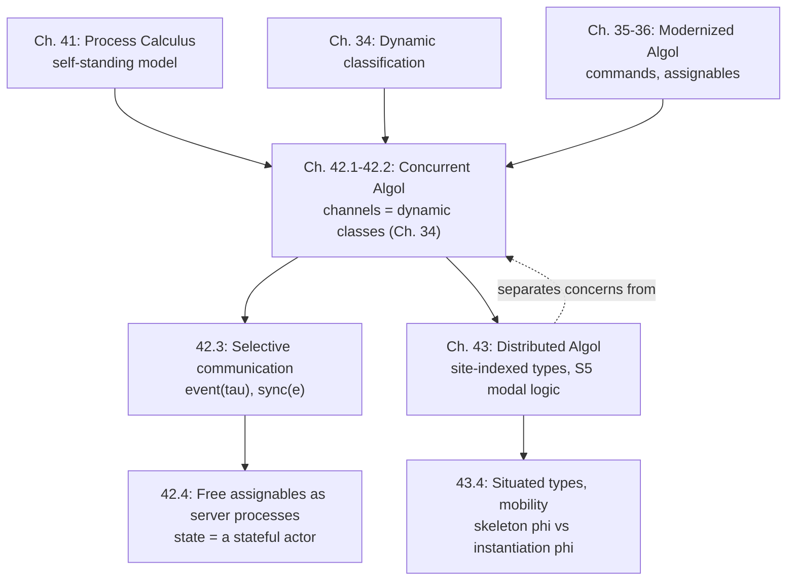

# Concurrent and Distributed Algol

[[book-guidelines|↩ Back to guidelines]]

## The problem: a bare process calculus is a model, not a programming language

[[Concurrency-and-Process-Calculus|Chapter 41]] built process calculus as a *self-standing* mathematical model of interaction — channels, synchronization, replication, universality. Useful for proving what's possible in principle, but it doesn't integrate with the rest of the book's machinery: there's no notion of *computing a value while also interacting*, no reuse of the type structure already built for classification (Chapter 34) or command/expression separation (the Modernized Algol of Chapters 34–36). Chapter 42's project is to fuse process calculus into an actual practical language — **Concurrent Algol**, $L\{\mathtt{nat}\ \mathtt{cmd}\ {*}\ \mathtt{k}\}$ — by *reusing*, not duplicating, machinery the book already has. Chapter 43 then asks a genuinely new question that Chapter 41's calculus never had a vocabulary for: *where* does a computation happen, when resources are scattered across a network?

**[[Control-Stacks-and-Abstract-Machines#What breaks without this|What breaks without this]] integration:** a process calculus bolted onto a language as an unrelated add-on would duplicate the classification/typing machinery already built for other purposes, and would give you no principled way to reason about a program that both computes values *and* interacts — you'd need two disjoint type disciplines glued together ad hoc. Harper's move — identify channels with dynamic classes — collapses two concepts the reader has already learned into one, rather than teaching a third.

## 42.1 Concurrent Algol — commands as the interface between computation and interaction

Concurrent Algol strips assignables out of Modernized Algol entirely (they'll be recovered for free in §42.4) and adds a layer of **processes** on top of the existing command/expression modal split:

$$
\begin{aligned}
\mathrm{Proc}\ p &::= \mathtt{stop}\ (1) \mid \mathtt{proc}(m)\ (\texttt{proc}(m)) \mid \mathtt{par}(p_1;p_2)\ (p_1 \parallel p_2) \mid \mathtt{new}[\tau](a.p)\ (\nu a{\sim}\tau.p)
\end{aligned}
$$

$\mathtt{proc}(m)$ is an **atomic process executing command $m$** — the bridge from the command layer (sequential, effectful, from Chapter 35) into the process layer (concurrent, interacting, from Chapter 41). Everything else — parallel composition, channel declaration — is lifted directly from the process calculus.

The key structural rule shows how a command's execution can spawn concurrency:

$$\dfrac{m \xRightarrow[\Sigma]{\alpha} \nu\Sigma'\{m' \parallel p\}}{\mathtt{proc}(m) \xrightarrow[\Sigma]{\alpha} \nu\Sigma'\{\mathtt{proc}(m') \parallel p\}} \tag{42.2a}$$

Read this carefully: stepping the *command* $m$ can, as a side effect, allocate new channels $\Sigma'$ *and* spawn a new concurrent process $p$ — command execution and process spawning are unified into a single judgment, $m \xRightarrow[\Sigma]{\alpha} \nu\Sigma'\{m' \parallel p\}$ (42.3), rather than kept as two disconnected mechanisms. This single rule is quietly doing exactly what scope extrusion (§41.4) did before — expanding a channel's scope outward to the context where the command executes — but now folded into the ordinary command-stepping judgment instead of being a separate structural-congruence rule.

**What breaks without unifying these into one judgment:** if command execution and process creation were separate, unrelated relations, you'd need an extra bookkeeping layer to track "which channels did this command just allocate, and which process did it just spawn" — exactly the kind of state a naive implementation gets wrong. Folding both into $\xRightarrow{\alpha}$ makes the invariant ("every command step carries its full effect on the process pool") syntactically inescapable.

## 42.2 Broadcast communication — channels *are* dynamic classes

Here's the chapter's central simplifying move, and it's worth sitting with because it's genuinely elegant: rather than treat channels as their own primitive concept (as Chapter 41 did), **Harper identifies a channel with a dynamic class** (Chapter 34's mechanism for classifying values at runtime with unforgeable tags). A message is a value of type $\mathtt{clsfd}$ — a classified value, tagged with its channel/class. **Broadcast** is the resulting synchronization discipline: any process can `emit` a classified message, and any process can `acc`(ept) *any* pending message — but only a process that actually holds the class (channel) can *decode* the payload once accepted. Four new commands do the work:

$$\mathtt{Cmd}\ m ::= \mathtt{spawn}(e) \mid \mathtt{emit}(e) \mid \mathtt{acc} \mid \mathtt{newch}[\tau]$$

$$
\dfrac{}{\mathtt{spawn}(\mathtt{cmd}(m)) \xRightarrow[\Sigma]{\varepsilon} \mathtt{ret}\,\langle\rangle \parallel \mathtt{proc}(m)} \qquad
\dfrac{e\,\mathsf{val}_\Sigma}{\mathtt{emit}(e) \xRightarrow[\Sigma]{e!} \mathtt{ret}\,\langle\rangle} \qquad
\dfrac{e\,\mathsf{val}_\Sigma}{\mathtt{acc} \xRightarrow[\Sigma]{e?} \mathtt{ret}\,e}
$$

This is a deliberately weak, *unfiltered* form of communication — `acc` accepts whatever's being broadcast, with no way to say "only messages on channel $a$." That weakness is the whole point: it's the minimal mechanism from which everything richer (§42.3) is *built*, not the final design. It also directly reuses Chapter 34's confidentiality story: a message broadcast in the clear is nonetheless opaque to any process lacking the class — the book notes this gives, for free, "an abstract account of encryption and decryption in a network," which is a genuinely nice payoff of the channel-as-class identification.

**[[Type-Safety|Type safety]].** Preservation (Theorem 42.2) is routine given Lemma 42.1's typing of the execution judgment. Progress (Theorem 42.3) has an honest caveat worth internalizing: a well-typed process is guaranteed to be able to take *some* labeled step (unless it's already `1`), but that's weaker than the usual "progress" guarantee — a process might be permanently unable to make an *unlabeled* (synchronizing) step, simply because no complementary partner exists. **This is the concurrency analogue of a stuck-but-not-wrong state**: type [[Dynamic-Classification#Safety|safety]] here promises the process is *always ready to interact*, not that a partner will show up.

## 42.3 Selective communication — from "accept anything" to "accept exactly this"

Broadcast alone forces a genuinely painful pattern to filter for a specific channel — poll in a loop, re-broadcasting anything that doesn't match:

$$\mathtt{fix\ loop}{:}\tau\ \mathtt{cmd}\ \mathtt{is}\ \{x \leftarrow \mathtt{acc}\,;\ \mathtt{match}\ x\ \mathtt{as}\ a\cdot y \Rightarrow \mathtt{ret}\ y\ |\ \mathtt{ow} \Rightarrow \mathtt{emit}(x)\,;\ \mathtt{do}\ \mathtt{loop}\}$$

**What breaks without a fix here:** polling is not just inefficient, it's *semantically leaky* — every process doing this has to re-emit messages it doesn't want, meaning every non-matching message bounces around the whole system until someone claims it. Worse, this doesn't compose: two processes both polling for different channels will endlessly re-broadcast each other's messages at each other.

The fix is a new type, $\mathtt{event}(\tau)$ — a finite choice of channels a process is willing to accept from, generalizing Chapter 41's event grammar into a first-class *value*:

$$\mathrm{Typ}\ \tau ::= \mathtt{event}(\tau) \qquad \mathrm{Exp}\ e ::= \mathtt{rcv}[a]\ (?a) \mid \mathtt{never}[\tau] \mid \mathtt{or}(e_1;e_2)\ (e_1\ \mathtt{or}\ e_2) \qquad \mathrm{Cmd}\ m ::= \mathtt{sync}(e)$$

$\mathtt{sync}(e)$ blocks until *one specific channel among those named in $e$* has a matching message — no re-broadcasting, no polling loop, and the "which action fires" nondeterminism is now confined to a principled judgment, $e \xRightarrow[\Sigma]{\alpha} m$ ("event value $e$ engenders action $\alpha$, activating $m$"), rather than smeared across an ad hoc retry loop.

This is directly, recognizably `select`/epoll-style multiplexed I/O — and the chapter says so explicitly by cross-referencing Chapter 41's asynchronous process calculus events. The one genuine wrinkle: in the process calculus, *each* branch of a choice carried its own continuation; here, because commands already have an ambient sequential structure (the `bnd`/`sync` modal layer), all branches of an `or` share the *same* continuation — the type system's existing command-sequencing machinery absorbs work that Chapter 41 needed a separate mechanism for.

**[[Plotkins-PCF-and-Partial-Computation#Grounding|Grounding]] (Rust) — this is `tokio::select!` line for line.**

```rust
// sync(rcv[a] or rcv[b]) — selective communication over two channels
tokio::select! {
    msg = channel_a.recv() => handle_a(msg),   // matches rcv[a], Rule (42.13a)
    msg = channel_b.recv() => handle_b(msg),   // or(e1; e2), Rule (42.13b): either may engender the action
}
```

`select!` resolves to whichever branch's channel is ready first, exactly matching Rule (42.13b)'s "any event among a set of choices may engender an action" — the branch that fires determines which continuation runs, with no polling, no re-broadcast, and no requirement that the loser branch's message be consumed or discarded.

## 42.4 Free assignables as processes — mutable state is a special case of a server

The chapter's payoff for stripping out assignables at the start: **a mutable cell is definable as a tiny stateful server process**, recovering everything Chapter 35 needed without adding a single new primitive. An assignable of type $\rho$ is represented by a channel $a$ of "server type" $\tau_{\mathtt{srvr}} = [\mathtt{get}\hookrightarrow\rho\ \mathtt{class}, \mathtt{set}\hookrightarrow\rho\times\rho\ \mathtt{class}]$, and a recursive server process that:

1. selectively accepts on $a$ (§42.3's mechanism, exactly),
2. dispatches on whether the request is `get` (respond with current contents on a reply channel) or `set` (update contents, respond on a reply channel with the new value),
3. loops, calling itself with the (possibly updated) contents as its new state.

$$\lambda(u{:}\tau_{\mathtt{srvr}}\ \mathtt{class})\ \mathtt{fix}\ \mathtt{srvr}{:}\rho\to\mathtt{void}\ \mathtt{cmd}\ \mathtt{is}\ \lambda(x{:}\rho)\ \mathtt{cmd}\{y \leftarrow \mathtt{sync}({??}\,u)\,;\ \cdots\}$$

Reads and writes (`ref e₀`, `*e₀`, `e₀ := e₁`) become send/synchronize protocols against this server (Rules 42.19–42.21) — allocate a reply channel, emit a request tagged `get`/`set`, synchronize on the reply.

**Why this matters beyond "a cute encoding":** it's a genuine conceptual unification, not a trick. The book has now shown that *mutable state and concurrent servers are the same phenomenon* — an assignable is nothing more than a process whose sole job is answering `get`/`set` requests, with the "current contents" literally *being* the recursive server's own local argument. This is precisely the model behind Erlang/actor-style "state lives in a process, mutate it by message-passing" designs — Harper derives that architecture as a theorem, not a design pattern you adopt on faith.

## Chapter 43: Distributed Algol — location becomes a type

Concurrent Algol answers "how do independent processes interact" but says nothing about *where* they run. Chapter 43's premise: a distributed computation has resources genuinely tied to physical (or logical) **sites** — only code executing *at* a site may touch that site's resources — so accessing a remote resource means literally moving the *locus of execution* there and back, not just sending a message.

### 43.1 Statics — types indexed by *possible worlds*

The formalization borrows directly from **modal logic's possible-worlds semantics**, interpreted here as: worlds are network sites, and accessibility between worlds models network connectivity. The book takes the accessibility relation to be reflexive, symmetric, and transitive — an *equivalence relation* — which places $L\{\mathtt{nat}\ \mathtt{cmd}\ {*}\ \mathtt{k}\ @\}$ squarely in modal logic **S5**, the logic where "possibly possibly $P$" collapses to "possibly $P$" (every world reaches every world it can reach reach). Types for commands, channels, and events all get an explicit **site index**:

$$\mathrm{Typ}\ \tau ::= \mathtt{cmd}[w](\tau) \mid \mathtt{chan}[w](\tau) \mid \mathtt{event}[w](\tau) \qquad \mathrm{Cmd}\ m ::= \mathtt{at}[w](m)\ (\texttt{at}\ w\ \{m\})$$

Two typing judgments carry the split cleanly: $\Gamma \vdash_\Sigma e:\tau$ (expression typing) is **site-independent** — a value of type $\mathtt{nat}$ means the same thing everywhere, exactly as you'd hope — while $\Gamma \vdash_\Sigma m \sim \tau @ w$ (command typing) is **site-indexed**, because a command's meaning depends on the state and resources *at its site*. This is the same eager/lazy-style, "which judgment carries what information" discipline the book uses throughout — here it's the formal expression of "data is portable, computation is located."

The `at` construct is the one mechanism for changing where execution happens:

$$\dfrac{\Gamma \vdash_\Sigma m_0 \sim \tau_0 @ w_0}{\Gamma \vdash_\Sigma \mathtt{at}[w_0](m_0) \sim \tau_0 @ w} \tag{43.1h}$$

Read as: to execute $m_0$ (which requires site $w_0$) from *your* current site $w$, wrap it in `at`; the type system tracks that the command as a whole is well-formed *at $w$*, even though its body genuinely runs elsewhere and its result is shipped back.

### 43.2–43.3 Dynamics and safety — no cross-site synchronization, ever

The [[Exceptions#Dynamics|dynamics]] generalizes atomic processes to $\mathtt{proc}[w](m)$ — a process tagged with the site it's executing at — and the pivotal design decision is that **synchronization only ever happens between processes located at the same site**:

$$\dfrac{}{\mathtt{sync}(e) \xRightarrow[\Sigma,w]{\alpha} m} \tag{43.3e, only when } e \text{ engenders } \alpha \text{ at } w\text{)}$$

There is deliberately no rule letting a process at site $w$ synchronize on an event located at $w' \ne w$. Movement is handled entirely separately, by `at`, which physically relocates the command, runs it, and ships the *value* back — never the synchronization itself. **Concurrency (nondeterministic composition) and distribution (locality of resources) are cleanly separated concerns** — exactly the book's recurring habit of factoring orthogonal design axes into independent, individually-simple mechanisms rather than one entangled one.

[[State-and-Assignables#Safety|Safety]] follows the book's standard two-theorem shape, but with a distinctly spatial flavor:

- **Preservation (43.2):** requires the crucial invariant that an atomic process $\mathtt{proc}[w](m)$ is well-formed only when $m$ itself is well-typed *at $w$* (Rule 43.4) — so a step can never silently relocate a command to a site it isn't typed for.
- **Progress (43.3):** a well-typed process is always able to take *some* step, or is inert — and because cross-site synchronization is syntactically impossible, **the safety theorem is simultaneously a security guarantee**: a resource local to site $w$ can genuinely never be touched by code that isn't, at the moment of the touch, actually executing at $w$ — no matter how freely *references* to that resource have circulated across the network beforehand.

**[[Data-Abstraction-and-Existential-Types#What breaks without this|What breaks without this]] discipline:** without site-indexed types, a channel reference passed to a remote site could be used to synchronize *from* that remote site directly — silently bypassing whatever access control the "resource lives at site $w$" model was supposed to enforce. The type system turns "only access resources through code physically located there" from a convention a distributed-systems programmer must remember into an invariant the type checker verifies at every use site.

**[[Recursive-Types#Grounding|Grounding]] — this is capability-based security and location transparency by construction.** The book flags this itself: sites can equally be read as *security principals*, and `at w {m}` as "execute this on behalf of principal $w$, returning the result to me." A Rust analogue that captures the *spirit*, if not the full modal-logic machinery, is an actor/RPC boundary where a handle can be freely passed around but every genuine access still round-trips through the owning actor:

```rust
// A resource "located" at site w — only reachable through its owning actor
struct Located<T> { owner: ActorHandle, resource: T }

// at w0 { m } — relocate execution, run m at w0, ship the result back
async fn at<T>(site: &ActorHandle, cmd: impl FnOnce() -> T + Send) -> T {
    site.run(cmd).await   // the command's body only ever executes inside `site`'s actor
}
```

The Rust type system doesn't enforce this the way S5-indexed types do (nothing stops you from smuggling a raw resource handle out of the actor if you try), which is precisely why Harper's approach — baking the site into the *type*, not just an API convention — is the stronger guarantee: it's checked, not merely encouraged.

### 43.4 Situated types — factoring the site out of the type, to stop repeating yourself

Site-indexed types are precise but verbose: `nat cmd[w]`, `nat chan[w]`, `nat event[w]` each repeat the same "$w$" everywhere a construct is used at a fixed site. Harper introduces **situated types**: a **skeleton** $\varphi$ (the shape of a type, abstracting over *which* site) paired with an *instantiation* operation $\varphi\langle w\rangle$ that fills in the site:

$$\mathrm{Fam}\ \varphi ::= \mathtt{nat} \mid \mathtt{arr}(\varphi_1;\varphi_2) \mid \mathtt{cmd}(\varphi) \mid \mathtt{chan}(\varphi) \mid \mathtt{event}(\varphi) \mid \mathtt{at}[w](\varphi)\ (\varphi\ \mathtt{at}\ w)$$

$$\mathtt{nat}\langle w\rangle = \mathtt{nat} \qquad (\varphi\ \mathtt{cmd})\langle w\rangle = \varphi\langle w\rangle\ \mathtt{cmd}[w] \qquad (\varphi\ \mathtt{at}\ w_0)\langle w\rangle = \varphi\langle w_0\rangle$$

That last equation is the interesting one — a *situated* family $\varphi\ \mathtt{at}\ w_0$ ignores the site you're instantiating it at and always resolves to its interpretation at $w_0$: "this thing is pinned to $w_0$ no matter where you ask about it."

The genuinely useful derived concept is **mobility**: a family $\varphi$ is **mobile** exactly when its instantiation doesn't depend on the site at all — $\varphi\langle w\rangle = \varphi\langle w'\rangle$ for every $w, w'$ (Rules 43.8, e.g. $\mathtt{nat}$ and function types built from mobile pieces are mobile; anything already pinned via `at` is automatically mobile). Mobility earns its keep in the typing rule for `at` itself:

$$\dfrac{\Phi \vdash_\Sigma m_0 \sim \varphi_0 @ w_0 \quad \varphi_0\ \mathtt{mobile}}{\Phi \vdash_\Sigma \mathtt{at}\ w_0\{m_0\} \sim \varphi_0 @ w}$$

The *why* here is exactly the subtlety a careless reader would miss: the result of `at w0 {m0}` must have the *same* meaning back at the calling site $w$ as it did at $w_0$ where it was actually computed — and that's only guaranteed if the result's type doesn't itself vary by site. **A command yielding, say, "a channel located at $w_0$" cannot be safely `at`-transported and reinterpreted at $w$** — the channel is meaningful only at $w_0$, so its type is *not* mobile, and the rule correctly rejects trying to smuggle it home as if it were.

**What breaks without the mobility restriction:** allowing `at` to return a non-mobile result would let a program compute "a reference to a resource local to $w_0$" while running at $w_0$, then blithely treat that reference as if it were equally valid back at $w$ — silently re-introducing exactly the cross-site-access hole the whole spatial type system was built to close. Mobility is the precise, checkable condition that closes that loophole.

## Synthesis: where this sits in the book, and what it feeds



The chapter's deepest structural move is one Harper flags explicitly in the notes: **concurrency (nondeterministic composition) and distribution (locality of resources) are cleanly separated** — Concurrent Algol handles the former, Distributed Algol layers the latter on top via a spatial modality, without re-solving synchronization along the way. This mirrors the whole book's methodology of factoring seemingly-entangled concerns ([[Symbols-and-Dynamic-Binding#Statics|statics]]/dynamics, values/computations, meaning/cost) into independently-simple pieces that compose. Chapter 44 (Components and Linking) picks up an entirely different thread — modularity — but reuses the same substitution-as-linking discipline that channel scope extrusion here already hinted at: resources, modules, and channels are all, at bottom, hypotheses that get discharged by a controlled act of substitution or scope-widening.

**Bearing on the stated learning goals:** the site-indexed / situated-type machinery of §43.1–43.4 is a directly transferable pattern for the Rust verifier and Lean-style elaborator, even though the book's application (network locality) is unrelated to either target. The general technique — **factor a judgment into a site/context-independent skeleton plus an explicit instantiation, and identify exactly which instances are "mobile" (context-independent) versus genuinely tied to a specific context** — is structurally the same problem as tracking which parts of a typing derivation are valid under *any* metavariable instantiation versus pinned to a particular one during elaboration, or which parts of a Hoare-triple precondition survive substitution into an arbitrary calling context versus are tied to a specific call site. The mobility judgment (43.8) is a clean, minimal worked example of exactly the kind of "is this generalizable, or is it context-bound" analysis a unification-based elaborator has to perform constantly and usually only informally.
