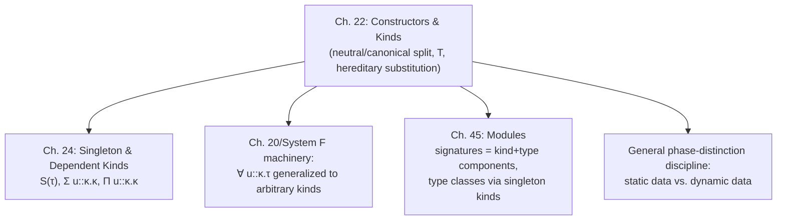

[[book-guidelines|↩ Back to guidelines]]

## Why you need a layer above types

Look at `nat → nat` and `nat list`. Both are types built by applying something to something: an arrow constructor to two type arguments, a `list` constructor to one. `nat` itself, with no arguments, fits the same pattern if you're willing to call it a zero-argument constructor. Push a bit further and even the quantifiers `∀(t.τ)` and `∃(t.τ)` from earlier chapters look like higher-order operators that take a *type family* and return a type.

Once you see it this way, "type" stops being a primitive syntactic category and starts looking like the output of a small, well-behaved calculus of its own — a calculus of **constructors**, classified by **kinds**, sitting one level up from ordinary expressions. That's the move this chapter makes: enrich the language with a new syntactic layer whose job is to build and classify *static data* (types, and — later in the book — other compile-time objects), separately from the layer that builds and classifies *dynamic data* (expressions).

**[[Control-Stacks-and-Abstract-Machines#What breaks without this|What breaks without this]].** If you don't separate constructors from expressions and give constructors their own classifiers, you have no principled way to stop someone writing `list nat nat` (list applied to two arguments) or `→ nat` (arrow applied to one). You'd be relying on ad hoc arity checks bolted onto the parser instead of a typing discipline for types themselves. Kinds are exactly "types, for types" — the same idea of classification, one level up. Harper calls this the **phase distinction**: constructors are manipulated during the *static* phase of processing (type checking, elaboration), expressions during the *dynamic* phase (execution) — and because we only ever run well-typed programs, the dynamic phase always follows a completed static phase.

If you're building a Rust type-checker or a Lean-style elaborator, this is exactly the layer that becomes your kind-checker for type constructors — `Vec<T>`, `Option<T>`, and a hypothetical `HKT<F, T>` in Rust all live at this level, and Lean's own `Sort`/`Type`-indexed universes are close cousins of the kind `T` defined here.

## Kinds: the grammar of static classifiers

The book gives kinds a small, closed grammar (§22.1, p. 202):

$$
\kappa ::= \mathsf{T} \mid \mathsf{Unit} \mid \kappa_1 \times \kappa_2 \mid \kappa_1 \to \kappa_2
$$

- $\mathsf{T}$ — the distinguished kind of *types*. Constructors of kind $\mathsf{T}$ are exactly the things that can classify expressions.
- $\mathsf{Unit}$ (written $\mathbf{1}$) — the nullary product kind, classifying only the trivial constructor.
- $\kappa_1 \times \kappa_2$ — product kinds, for pairs of constructors (this is what lets you eventually build things like a signature bundling several type components).
- $\kappa_1 \to \kappa_2$ — function kinds, for constructors that take a constructor argument and return one — this is how `list`, a one-argument type operator, gets classified: `list :: T → T`.

This is deliberately a *simply-kinded* calculus at this stage (no kind depends on a constructor's value yet — that's Chapter 24's job with [[Singleton-and-Dependent-Kinds|singleton and dependent kinds]]). Think of it as System F's types re-derived one level up, with $\mathsf{T}$ playing the role that `Prop`/`Type` plays as the "base" classifier.

**Rust [[Plotkins-PCF-and-Partial-Computation#Grounding|grounding]].** There's no first-class kind system in Rust, but the *shape* is familiar from generics-of-generics: `Option<T>` has kind (informally) `T → T`; `Result<T, E>` has kind `T × T → T` if you think of it as taking two type arguments; a trait like `trait Functor<F>` where `F` ranges over one-argument type constructors is Rust programmers' closest brush with `T → T` as a first-class kind (this is what higher-kinded-type proposals for Rust would formalize).

**Lean grounding.** Lean's `Sort u` hierarchy is the closer analogue of $\mathsf{T}$: `Sort 0` (`Prop`), `Type` (`Sort 1`), etc. classify *types* the way $\mathsf{T}$ classifies constructors-as-types here. A Lean definition like `def Pair (A B : Type) : Type := A × B` has kind `Type → Type → Type` in exactly the sense of this chapter's `κ₁ → κ₂`.

## Neutral vs. canonical: why constructors need two syntactic sorts

Here's the chapter's central technical move, and it's worth sitting with the motivating problem before the grammar (§22.1, p. 202–203).

**What breaks without this.** Suppose you allow arbitrary constructors, including projecting out of a pair: `⟨nat, str⟩ · l` should obviously simplify to `nat` — the elimination form (`· l`) is supposed to be a *post-inverse* of the introduction form (`⟨-, -⟩`). But now you have a choice: either (a) admit this constructor as legal syntax and add a notion of *definitional equality* saying `⟨c₁,c₂⟩ · l ≡ c₁`, and prove that equality is decidable, or (b) simply forbid ill-formed combinations like "projection from something that's syntactically a pair" from arising in the first place, so that two constructors are equivalent exactly when they're *identical* as syntax. Harper takes route (b) — it's more restrictive up front, but it sidesteps having to build and verify a whole decision procedure for constructor equality. The price is that substitution gets more interesting (see the next section).

To make route (b) work you split constructor syntax into two sorts:

$$
\begin{aligned}
\text{NCon}\quad a &::= u \mid a\cdot l \mid a\cdot r \mid a_1[c_2] &&\text{neutral}\\
\text{CCon}\quad c &::= \hat a \mid \langle\rangle \mid \langle c_1, c_2\rangle \mid \lambda u.\,c &&\text{canonical}
\end{aligned}
$$

- **Neutral** constructors ($a$) are things that are "stuck" on a variable: a bare variable $u$, a projection $a \cdot l$ / $a \cdot r$ out of something already neutral, or an application $a_1[c_2]$ of a neutral function-kinded constructor to a canonical argument. Neutral constructors are *elimination-form-headed*.
- **Canonical** constructors ($c$) are fully-built values: the atomic inclusion $\hat a$ of a neutral constructor of kind $\mathsf T$, the unit $\langle\rangle$, pairs $\langle c_1, c_2\rangle$, and $\lambda$-abstractions. Canonical constructors are *introduction-form-headed* (or atomic).

The key syntactic fact: you simply cannot *write down* $\langle c_1, c_2 \rangle \cdot l$ in this grammar, because $\cdot l$ demands a neutral argument, and a pair is only ever canonical. The ill-formed term is excluded by the grammar itself, not by a side condition you have to remember to check.

There's a subtlety in the inclusion rule: $\hat a$ (atomic constructor, the neutral-to-canonical coercion) is only legal when $a$ has kind $\mathsf T$ — rule (22.1e). That means a *variable of function, product, or unit kind is neutral but never canonical*. Only variables of kind $\mathsf T$ can appear as canonical (atomic) constructors. This asymmetry is what makes the canonical-forms lemma (Lemma 22.1) true: every canonical constructor of kind $\mathbf 1$ is literally $\langle\rangle$, every canonical constructor of a product kind is literally a pair of canonical constructors, and every canonical constructor of a function kind is literally a $\lambda$-abstraction. There's no other way to inhabit those kinds canonically — which is exactly the inversion principle you want for a well-behaved elimination form to invert an introduction form.

**Rust grounding.** This neutral/canonical split is the same discipline as a normal-form-only AST in a compiler pass: you define two enum variants, `Neutral` (variable, field-projection, application-still-stuck-on-a-variable) and `Canonical` (struct literal, tuple, closure), and your smart constructors (the functions that build terms) simply don't expose a way to build `Canonical::Pair(..).project_left()` as a canonical value — projecting a *known* pair short-circuits during construction rather than becoming an AST node. This is precisely the "smart constructors normalize eagerly" pattern used in NBE (normalization-by-evaluation)-style evaluators.

**Lean grounding.** This is Lean's own distinction between *neutral* and *whnf* (weak-head-normal-form) terms inside its kernel reduction / definitional-equality checker (`isDefEq` walks exactly this neutral/canonical split when deciding whether two terms reduce to the same normal form). A stuck application `f a` where `f` is a free variable is neutral; a constructor application `Nat.succ n` is canonical (an introduction form). Lean's WHNF reduction loop is, at the meta-level, doing what Harper's grammar does at the syntax level: refusing to let an elimination form sit directly on top of an introduction form without collapsing them.

### The formation judgments

Two mutually-defined judgments give the [[Symbols-and-Dynamic-Binding#Statics|statics]] (§22.1, p. 203):

$$
\Delta \vdash a \Rightarrow \kappa \qquad\text{(neutral constructor $a$ synthesizes kind $\kappa$)}
$$
$$
\Delta \vdash c \Leftarrow \kappa \qquad\text{(canonical constructor $c$ checks against kind $\kappa$)}
$$

where $\Delta$ collects hypotheses $u_1 \Rightarrow \kappa_1, \dots, u_n \Rightarrow \kappa_n$ — note that variables are hypothesized to be *neutral*, matching the grammar. The rules (22.1a–h) are unsurprising given the grammar: a hypothesized variable synthesizes its assumed kind; projections synthesize the corresponding factor kind from a product-kinded neutral term; application synthesizes the codomain kind, checking the argument against the domain kind; and on the canonical side, $\hat a \Leftarrow \mathsf T$ only when $a \Rightarrow \mathsf T$, $\langle\rangle \Leftarrow \mathbf 1$ always, pairs check componentwise, and $\lambda$-abstraction checks its body under an extended hypothesis.

If this bidirectional shape looks familiar — some rules produce ("synthesize") a classifier, others consume ("check") one against a given classifier — that's because it *is* bidirectional typing, one level up. This is exactly the synthesis/checking split (⇒ / ⇐) that a bidirectional elaborator uses for ordinary expressions; Harper is applying the identical discipline to constructors. If your elaborator project already implements inference-mode vs. checking-mode for expressions, the kind-checker for constructors is the same two-judgment machine with a different alphabet.

## Kind T as the classifier of expressions

Constructors of kind $\mathsf T$ are types, and types classify expressions — that's the whole point of building this layer. The connecting rule (22.2, p. 204) is simple:

$$
\frac{\Delta \vdash \tau \Rightarrow \mathsf T}{\Delta \vdash \tau\ \mathsf{type}}
$$

In many languages this is the *only* way to form a type — every classifier is literally a constructor of kind $\mathsf T$. But Harper is careful to show this needn't hold: the chapter contrasts an **impredicative** extension of $\mathcal L\{\to\forall\}$, where the quantifier $\forall$ is itself a constructor constant ($\forall_\kappa \Rightarrow (\kappa \to \mathsf T) \to \mathsf T$, so $\forall u{::}\kappa.\tau$ is literally the application $\forall_\kappa[\lambda u.\tau]$, meaning [[Subtyping#Quantified types|quantified types]] can themselves be quantified over), against a **predicative** extension where quantified types are formed by a separate typing rule

$$
\frac{\Delta, u \Rightarrow \kappa \vdash \tau\ \mathsf{type}}{\Delta \vdash \forall u{::}\kappa.\tau\ \mathsf{type}}
$$

and are *never* constructors of kind $\mathsf T$ — so a predicative $\forall u{::}\kappa.\tau$ is a legitimate classifier that cannot itself be plugged in wherever a kind-$\mathsf T$ constructor is expected (in particular, you cannot instantiate a quantifier at a quantified type). This impredicative/predicative fork is the phase distinction's sharpest consequence: it's a real design choice with real expressiveness/consistency trade-offs (impredicative systems like System F are more expressive but must be handled more carefully; predicative stratification is how many proof assistants, including much of Lean's own hierarchy, stay on safer ground).

The introduction and elimination rules for the generalized quantifier are shared by both fragments (22.5a–b, p. 205):

$$
\frac{\Delta, u \Rightarrow \kappa\ \ \Gamma \vdash e : \tau}{\Delta\ \Gamma \vdash \Lambda(u{::}\kappa.e) : \forall u{::}\kappa.\tau}
\qquad\qquad
\frac{\Delta\ \Gamma \vdash e : \forall u{::}\kappa.\tau \quad \Delta \vdash c \Leftarrow \kappa}{\Delta\ \Gamma \vdash e[c] : [c/u]\tau}
$$

Read the elimination rule slowly: a polymorphic value abstracts over *static data of kind $\kappa$* (not necessarily kind $\mathsf T$ — you could quantify over a product-kinded or function-kinded constructor), and instantiation plugs a canonical constructor $c$ into the body's type via $[c/u]\tau$. That substitution is where the real technical content of the chapter lives.

## Canonizing substitution: why plain substitution doesn't typecheck

Ordinary capture-avoiding substitution (Chapter 1's version) is not well-typed here. Harper's example (§22.3, p. 206): take the family of types

$$
u \Rightarrow \mathsf T \to \mathsf T \ \vdash\ u[d] \Rightarrow \mathsf T, \qquad d \Rightarrow \mathsf T
$$

Now instantiate $u$ at some canonical $c \Leftarrow \mathsf T \to \mathsf T$. By the canonical-forms lemma, $c$ *must* be $\lambda u'.c'$ for some $u', c'$. Plain textual substitution of $c$ for $u$ in $u[d]$ gives $(\lambda u'.c')[d]$ — but that's not a legal neutral constructor! Applications $a_1[c_2]$ require a *neutral* head $a_1$, and $\lambda u'.c'$ is canonical, not neutral. **What breaks without a fix:** the very act of instantiating a polymorphic type can produce syntax that falls outside the grammar you just spent §22.1 carefully restricting.

The fix is **canonizing substitution**: substitution that simplifies these "illegal" neutral/canonical mismatches as it goes, so the case above obeys

$$
[\lambda u'.c' / u : \kappa]\, u[d] = [d/u']\, c'
$$

— i.e., substituting into an application whose function part turns out (after substitution) to be a $\lambda$, you don't just plug the argument in syntactically; you recursively perform the resulting $\beta$-reduction, which itself requires substituting $d$ for $u'$ in $c'$. This is exactly **hereditary substitution**: substitution defined so that whenever it would produce a redex, it eagerly reduces that redex as part of the substitution operation itself, rather than leaving redexes lying around for a separate reduction pass to clean up later.

**Termination argument (why this isn't circular).** The recursive call switches from substituting $u$ in $u[d]$ to substituting $u'$ in $c'$ — a completely different variable, in a constructor that might even be *larger* than what you started with. Why does this terminate? Because the *kind* of $u'$ (the domain kind of $u$'s function kind $\kappa_2 \to \kappa$) is strictly smaller than the kind $\kappa$ of $u$. So the well-definedness proof is a **lexicographic induction**: primary measure is the kind of the target variable (which strictly decreases at exactly the point where the constructor's size might increase), secondary measure is the structure of the constructor being substituted into (which decreases in every other case). This is precisely the termination argument that makes hereditary substitution — as opposed to substitution-plus-separate-normalization — a genuinely useful implementation technique: **you never need a separate confluence/normalization proof for a rewriting system; termination and well-typedness fall out of one structural induction.**

The book defines three mutually recursive substitution judgments (22.6–22.8, pp. 207–208):

$$
\begin{aligned}
[c/u{:}\kappa]\,a &= a' &&\text{canonical into neutral} \to \text{neutral}\\
[c/u{:}\kappa]\,a &= c' \Leftarrow \kappa' &&\text{canonical into neutral} \to \text{canonical (+ its kind!)}\\
[c/u{:}\kappa]\,c_0 &= c_0' &&\text{canonical into canonical} \to \text{canonical}
\end{aligned}
$$

The interesting fork happens on substitution into neutral constructors: substituting into a **non-critical** variable ($u' \ne u$) leaves it neutral (rule 22.7a); substituting into the **critical** variable — the actual target, $u$ itself — immediately produces the canonical replacement $c$ together with its kind $\kappa$ (rule 22.8a). Every other neutral-constructor rule (projections, application) then has to case on whether its *recursive* subcomputation landed in the "still neutral" bucket or the "collapsed to canonical" bucket, and behave differently in each case. Rule (22.8d) is the crux — substituting into an application $a_1[c_2]$ where the substituted head $a_1$ turns out to reduce to $\lambda u'.c'$ of kind $\kappa_2' \to \kappa'$:

$$
\frac{[c/u{:}\kappa]\,a_1 = \lambda u'.c' \Leftarrow \kappa_2' \to \kappa' \quad [c/u{:}\kappa]\,c_2 = c_2' \quad [c_2'/u'{:}\kappa_2']\,c' = c''}{[c/u{:}\kappa]\,a_1[c_2] = c'' \Leftarrow \kappa'}
$$

Three substitutions chained together, the last one being exactly the $\beta$-reduction step the naive approach would have left stuck. This rule is the one that needs the kind $\kappa_2'$ to know *what* to substitute — you can't even state the recursive call without carrying kind information alongside the constructors, which is why the judgment form bundles "produce the constructor" with "and here's its kind" rather than checking the kind separately afterward.

Theorem 22.2 packages the payoff: given well-formed inputs, canonizing substitution always produces a *unique* well-formed output — and for the neutral case, the result is *either* neutral *or* canonical, never ambiguously both. That determinism is exactly what you need if you intend to implement this as an actual algorithm rather than just a relation.

**Rust grounding.** If you've ever implemented a small-step interpreter with closures and had to decide "do I substitute-and-leave-a-redex, or substitute-and-immediately-reduce," this is the formal answer: implement `subst` as a function that pattern-matches on what the *target position* substitutes to, and recursively re-normalizes on the spot when a redex appears — this is the standard implementation strategy for normalization-by-evaluation and is directly applicable to a Rust type-checker's type-substitution routine (e.g. substituting a concrete type into a generic function's associated-type projections, forcing further simplification).

**Lean grounding.** This is structurally identical to how Lean's kernel handles instantiating a `Pi`/`Sort`-classified metavariable or bound variable during `whnf`/definitional-equality checking: substitution isn't a separate textual pass followed by reduction — reduction is interleaved with substitution so that you never build an ill-typed intermediate term. If you're building the Miller-pattern-unification-style elaborator from your learning goals, this hereditary-substitution discipline is precisely the mechanism you need when a metavariable gets solved to a $\lambda$-term and that solution needs to be substituted into a context where it's applied to further arguments — the "eagerly re-normalize on substitution" discipline avoids re-deriving reduction-and-confluence lemmas for your own metavariable-solving substitution.

## Canonization: recovering a relaxed syntax on top of canonical forms

Canonizing substitution buys you a system where you *only* ever work with canonical constructors — but sometimes that's inconvenient. The prototypical awkward case (§22.4, p. 209): the constructor $(\lambda u.c_2)[c_1]$ is *malformed* by the strict grammar of §22.1 (an application's function position must be neutral, and a $\lambda$-abstraction is canonical) even though, semantically, it obviously ought to simplify to $[c_1/u]c_2$.

So the chapter introduces **general-form constructors**: syntax that's well-formed with respect to the kinding rules but *ignoring* the neutral/canonical distinction — written $\Delta \vdash c :: \kappa$. This is the "relaxed" surface syntax a programmer or an implementation might actually want to write, e.g. allowing `(λ u. c) [c1]` to be typed and only requiring it be *reducible* to canonical form, not already *in* canonical form.

Two mutually-defined judgments do the work (22.9a–h, p. 209–210):

1. **Canonization**, $\Delta \vdash c :: \kappa \Downarrow c$ — transform a general-form constructor into its canonical form.
2. **Atomization**, $\Delta \vdash c \Rightarrow c :: \kappa$ — an auxiliary that transforms a general-form constructor into atomic (i.e. neutral) form.

These are mutually recursive by kind: to canonize something of kind $\mathsf T$, atomize it (22.9a); to canonize something of unit kind, produce $\langle\rangle$ regardless of the input (22.9b); to canonize a product-kinded constructor, canonize each of its two projections separately and pair the results (22.9c); to canonize a function-kinded constructor, canonize the body of its application to a fresh variable and re-abstract (22.9d — this is essentially $\eta$-expansion built into the procedure). Atomization handles the neutral shapes directly: a variable atomizes to itself (22.9e); projections and applications atomize their neutral part and canonize their canonical part as needed (22.9f–h).

Harper flags the mode discipline explicitly: canonization has mode $(\forall, \forall, \exists)$ — given a context and a general-form constructor, canonical output is *computed*, not guessed — while atomization has mode $(\forall, \exists, \exists)$. This mode annotation is worth taking seriously if you're implementing this: it tells you directly how to turn the judgment into a recursive function (inputs on the left, outputs computed on the right), exactly the way a Prolog-style or bidirectional-typing mode system tells you which arguments a rule needs bound before it fires.

Once you have canonization, you get **constructor equivalence for free**: $\Delta \vdash c_1 \equiv c_2 :: \kappa$ means $c_1$ and $c_2$ canonize to the *same* canonical form (up to $\alpha$-equivalence) — Lemma 22.3 confirms canonization/atomization only ever produce well-formed canonical/neutral constructors respectively, and Theorem 22.4 confirms every well-formed general-form constructor *does* canonize to something. Deciding whether $\langle \mathsf{int}, \mathsf{bool}\rangle \cdot l \equiv \mathsf{int}$ becomes: canonize both sides, compare the (unique) results syntactically.

**The road not taken, and why.** Harper's closing note (§22.5, p. 211) is worth internalizing: the "classical" approach is the opposite order — define general-form constructors and substitution first (easy), then prove **normalization** (every constructor reduces to an irreducible form in finitely many steps) and **confluence** (the "has a common irreducible form" relation is transitive) as two separate, often-substantial theorems, and use those to decide equivalence. Harper instead builds canonical forms and hereditary substitution *first*, which makes normalization and confluence essentially free consequences of the substitution definition itself rather than theorems you have to prove afterward. This reordering — canonical-forms-first, general-form-as-a-derived-relaxation — is due to Watkins et al. (2008), and it's the same strategic choice you'll find underlying many practical normalization-by-evaluation and bidirectional elaborator implementations: define your core data structures so that the properties you want are structural invariants, not add-on theorems.

## Where this leads

This chapter is a direct prerequisite for **Chapter 24 (Singleton and Dependent Kinds)**: singleton kinds $S(\tau)$ only make sense once you already have a notion of definitional equality of constructors, which is exactly what canonization gives you here — $S(\tau)$ will be defined as "constructors definitionally equal to $\tau$," i.e. constructors whose canonical form matches $\tau$'s. Dependent product/function kinds ($\Sigma$/$\Pi$ over kinds) generalize this chapter's non-dependent product/function kinds the same way dependent types generalize non-dependent ones.

It also directly sets up the machinery for **modules and signatures** later in the book (Ch. 45): a signature bundling both a kind component and a type component is exactly "constructors classified by kinds" being reused as the static description of a module's type interface, with type classes captured as singleton kinds — i.e. this chapter's phase distinction, applied one more level up, becomes the abstract-type/opaque-type machinery of an ML-style module system.

**For your elaborator project specifically:** the neutral/canonical split and hereditary substitution developed here *are* the mechanism — not an analogy for it — that a Miller-pattern-unification-style elaborator needs when a metavariable solution (a canonical $\lambda$-term) has to be substituted into a context where it's still applied to further arguments. Any implementation of definitional equality checking (Lean's `isDefEq`, or your own kernel's) that avoids a separate normalize-then-compare pass is doing exactly what canonization does here: computing canonical forms as a byproduct of a single well-moded recursive judgment, with termination guaranteed by the same kind-indexed lexicographic structure rather than by an external strong-normalization theorem.
