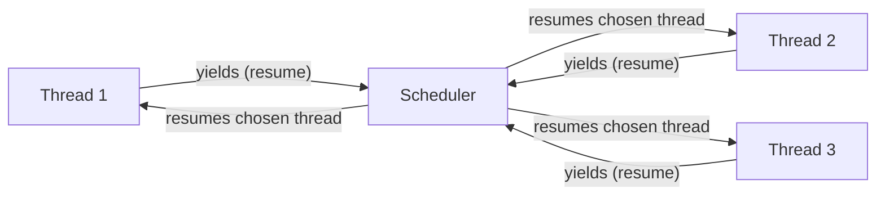

[[book-guidelines|↩ Back to guidelines]]

## Why you'd want a value that *is* "the rest of the program"

Chapter 27 built the $K\{\texttt{nat}{\rightharpoonup}\}$ abstract machine and made the control stack — the record of "what to do with this value once we have it" — an explicit, syntactic object, $k$, rather than something implicit in how a derivation tree is shaped. That move was motivated purely by implementation concerns: an interpreter needs *some* data structure recording where to resume after finishing a sub-computation, and search rules (which reconstruct the surrounding expression at every step) are a bad model of that.

Chapter 29 asks a sharper question: if the control stack is already a first-class syntactic object inside the machine, what stops us from letting the *program* get its hands on one? Not just push and pop frames implicitly via evaluation, but literally capture the current stack as a value, stash it in a variable, return it from a function, store it in a data structure — and later, resume execution exactly as if we'd never left, no matter how much computation has happened in between.

That capability is a **continuation**: a reified control stack, exposed as an ordinary value in the language. Once you have it, a striking number of "special" control constructs fall out as instances of one mechanism:

- **[[Exceptions|Exceptions]]** (Chapter 28) are continuations that jump back to a handler and discard everything in between.
- **Early return** / "short-circuiting" a loop is a continuation captured at the point the computation should return to.
- **Coroutines** are pairs of continuations that keep handing control back and forth to each other, each remembering exactly where its partner left off.
- **Cooperative threads** are coroutines organized around a central scheduler.

The key structural difference from exceptions is *directionality*. A handler in Chapter 28 can only be jumped to — control moves one way, outward, and once you've unwound past a `try`, that context is gone. A continuation, by contrast, can be jumped to as many times as you like, from anywhere, including from *after* the point where it was originally in scope. Harper puts this sharply: "continuations never expire... continuations support unlimited 'time travel'." This is what makes them strictly more powerful than exceptions, and also what makes them harder to reason about — a captured continuation is a value that outlives its own stack frame.

## `letcc` and `throw`: seizing and restoring a stack

The book extends $L\{\rightarrow\}$ with a new type and two new expression forms.

**The type.** $\text{cont}(\tau)$ (book's concrete syntax: `τ cont`) classifies continuations that accept a value of type $\tau$ — i.e., stacks whose "hole," the place currently being filled in by the returned value, expects something of type $\tau$.

**Introduction: `letcc`.**
$$
\text{letcc}[\tau](x.e) \qquad \text{concrete syntax: } \texttt{letcc } x \texttt{ in } e
$$
This binds the *current* control stack — reified as a value of type $\text{cont}(\tau)$ — to $x$, then evaluates $e$. Nothing about control flow changes yet; `letcc` just hands you a first-class handle to "here" before proceeding.

**Elimination: `throw`.**
$$
\text{throw}[\tau](e_1; e_2) \qquad \text{concrete syntax: } \texttt{throw } e_1 \texttt{ to } e_2
$$
This evaluates $e_2$ to a continuation value and $e_1$ to a value of the type that continuation expects, then **replaces the entire current control stack** with the one captured in $e_2$, resuming it with $e_1$'s value. Note the odd-looking typing rule:
$$
\frac{\Gamma \vdash e_1 : \tau_1 \qquad \Gamma \vdash e_2 : \text{cont}(\tau_1)}{\Gamma \vdash \text{throw}[\tau'](e_1;e_2) : \tau'}
\tag{29.1b}
$$
$\tau'$ — the "result type" of the throw expression — is *completely unconstrained*. That's not an oversight; a `throw` never returns to its own call site, so it can be assigned literally any type the surrounding context demands, the same trick used for `raise` in Chapter 28.

**Values.** A reified stack shows up in the syntax as $\text{cont}(k)$, and crucially:
$$
\frac{k \; \text{stack}}{\text{cont}(k)\;\text{val}}
\tag{29.4}
$$
Any stack, once wrapped, is *already a value* — there's no further evaluation to do to "finish computing" a continuation. This is what lets a continuation be passed around, stored, and reused freely, just like a function value.

### The machine semantics

Extending the $K\{\texttt{nat}{\rightharpoonup}\}$ machine from Chapter 27 with two new frame forms — one for "evaluating the target continuation of a throw" and one for "evaluating the value to send once the target is known" — gives the [[Control-Stacks-and-Abstract-Machines#Transition rules|transition rules]]:

$$
k \cdot \text{letcc}[\tau](x.e) \mapsto k \cdot [\text{cont}(k)/x]e \tag{29.5a}
$$
$$
k \cdot \text{throw}[\tau](e_1;e_2) \mapsto k;\text{throw}[\tau](-;e_2) \cdot e_1 \tag{29.5b}
$$
$$
k;\text{throw}[\tau](-;e_2) / e_1 \mapsto k;\text{throw}[\tau](e_1;-) \cdot e_2 \qquad (e_1\;\text{val}) \tag{29.5c}
$$
$$
k;\text{throw}[\tau](v;-) / \text{cont}(k') \mapsto k' / v \tag{29.5d}
$$

Rule (29.5a) is the heart of it: evaluating `letcc` under stack $k$ *duplicates* $k$ — substituting $\text{cont}(k)$, a frozen copy of the current stack, for $x$ — and then continues evaluating $e$ under that same live $k$. The stack isn't consumed or altered; it's copied into a value while evaluation proceeds normally.

Rule (29.5d) is the payoff: once we've evaluated both operands of a `throw` (the value $v$ and the target continuation $\text{cont}(k')$), the current stack $k;\text{throw}[\tau](v;-)$ is simply **discarded**, and evaluation resumes on $k'$ with $v$ — as if $v$ had been the result of whatever computation originally produced $k'$. This is a genuine "goto" at the level of entire evaluation contexts, not just a jump in a flat instruction sequence.

Because $K\{\texttt{nat}{\rightharpoonup}\}$'s rules are already axioms with no premises (that was the whole point of making stacks explicit in Chapter 27), adding `letcc`/`throw` costs only two new frame-typing rules (29.6a, 29.6b) and a canonical-forms lemma:

> **Lemma 29.1 (Canonical Forms).** If $e : \text{cont}(\tau)$ and $e\;\text{val}$, then $e = \text{cont}(k)$ for some $k$ such that $k : \tau$.

and [[Dynamic-Classification#Safety|safety]] extends *unchanged in shape* from Chapter 27:

> **Theorem 29.2 (Safety).**
> 1. If $s\;\text{ok}$ and $s \mapsto s'$, then $s'\;\text{ok}$.
> 2. If $s\;\text{ok}$, then either $s\;\text{final}$ or there exists $s'$ such that $s \mapsto s'$.

The safety proof goes through with only routine additions because a captured continuation $\text{cont}(k)$ is well-typed exactly when the stack $k$ it wraps is well-typed at the matching type — and stacks, once well-typed, stay well-typed forever, since nothing in the language can corrupt one. That fact is precisely what licenses "unlimited extent": there is no notion of a continuation becoming stale, because well-typedness of a stack was never contingent on *when* you use it, only on *what type* it expects.

### Worked example: early return

The book's motivating example is multiplying the first $n$ elements of an infinite sequence $q : \texttt{nat} \rightarrow \texttt{nat}$, short-circuiting to $0$ the moment a zero element is found instead of doing the remaining multiplications:

```
λ q : nat -> nat.
  λ n : nat.
    letcc ret : nat cont in
      let ms be
        fix ms is
          λ q : nat -> nat.
            λ n : nat.
              case n {
                z => s(z)
              | s(n') =>
                case q z {
                  z => throw z to ret
                | s(n'') => (q z) * (ms (q ∘ succ) n')
                }
              }
      in
        ms q n
```

`letcc ret in ...` captures "the point right after this whole function call finishes" as `ret`. Deep inside the recursion, the moment a zero is spotted, `throw z to ret` blows past every pending multiplication frame on the stack and resumes directly at `ret` with the value `0`. Compare this to what you'd have to do with plain structural recursion: propagate a sentinel value up through every stack frame by hand, checking it at every level. `letcc`/`throw` collapses that into "capture where I want to land, then jump there directly from arbitrarily deep."

**[[Control-Stacks-and-Abstract-Machines#What breaks without this|What breaks without this]]:** without a first-class handle on the stack, "returning early from deep within a recursion" requires either restructuring the recursion to thread an explicit early-exit flag through every level (tedious, and easy to get wrong under refactoring), or using exceptions — which work here but, being *strictly less general* than continuations (a handler, once escaped, cannot be re-entered), can't express the coroutine and threading patterns below.

### Rust and Python grounding

Rust has no first-class continuations (no runtime support for reifying "the rest of the stack" as a value — that's precisely the feature this chapter is about, and most mainstream languages omit it because it's expensive to implement well and easy to misuse). The nearest *safe* Rust idiom for the early-return example is exactly what you'd resort to without `letcc`: use `?`/early-`return`, which is really "labeled, restricted, single-shot, upward-only continuation capture" built into the language as syntax rather than as a value:

```rust
fn short_circuit_product(q: impl Fn(u64) -> u64, n: u64) -> u64 {
    for i in 0..n {
        let qi = q(i);
        if qi == 0 {
            return 0; // "throw 0 to the function's own implicit return continuation"
        }
        // multiply qi into an accumulator, recurse/iterate...
    }
    // ... product of q(0)..q(n-1)
    unimplemented!()
}
```

`return` here *is* a throw to an implicit continuation — the one representing "wherever the caller of this function is" — except Rust only lets you capture and use *that one*, and only in the upward, escaping direction. `letcc` generalizes this to: capture *any* point as a first-class value, store it, pass it around, and jump to it more than once, including after the frame that created it is conceptually "gone." Python's generators (`yield`) are a closer (still restricted) analogue — a generator suspends and later resumes exactly where it left off, which is a limited, structured form of continuation capture; the coroutine section below builds the general mechanism generators are a special case of.

## Unlimited extent: why continuations don't expire

This is the property that most sharply separates continuations from exceptions and from ordinary function return. An exception handler's scope ends the moment control passes it; jumping to a "used up" handler is meaningless because the handler frame is gone. A captured continuation has no such lifetime limit — rule (29.5a) makes $\text{cont}(k)$ an ordinary, freely-copyable *value* of type $\text{cont}(\tau)$, and safety (Theorem 29.2) guarantees that throwing to it is well-typed and well-defined regardless of how much computation has happened since it was captured, or how many other continuations have been thrown to in the meantime.

Concretely, this licenses the `compose` example in the book: given $k : \text{cont}(\tau)$ and $f : \tau' \to \tau$, build $k' : \text{cont}(\tau')$ such that throwing $v'$ to $k'$ is equivalent to throwing $f(v')$ to $k$:

```
fun compose (f: τ' -> τ, k: τ cont): τ' cont =
    letcc ret: τ' cont cont in
      throw (f (letcc r in throw r to ret)) to k
```

Read this from the inside out. The inner `letcc r in throw r to ret` seizes "the continuation that, once given a value, applies $f$ and throws to $k$" and immediately throws *that continuation itself* (not a computed value!) out to `ret` — aborting the computation of `f(...)` before it ever runs, and returning the seized continuation as the function's result instead. `ret`'s type is $\tau'\,\text{cont}\,\text{cont}$: a continuation expecting a continuation. This double-`letcc` idiom — capture, then immediately abort-and-return the capture via an *outer* continuation — is the general pattern for "compute a continuation value rather than running its effect," and it only typechecks and behaves correctly because continuations remain valid indefinitely; there's no scoping restriction forcing `ret` to be used before some enclosing frame disappears.

## Coroutines: symmetric, mutually resuming routines

A normal call/return pair is *asymmetric*: the caller hands control to a subroutine, the subroutine eventually hands control straight back, and the caller resumes exactly where it left off. **Coroutines** generalize this to a symmetric relationship: two routines that each treat the other as "my subroutine," repeatedly ceding control back and forth, each one resuming exactly where *it* last left off.

The mechanism: whenever a coroutine cedes control, it doesn't just return — it passes along a continuation that its partner can use to resume *it* later, and it simultaneously receives, from the partner, a continuation to resume the partner in turn. Symmetric passing of "how to get back to me" is exactly the reified-stack idea from §29.2, used in both directions at once.

### The type of a coroutine

If a routine of state-type $\tau$ takes, when resumed, a datum of type $\tau$ and a continuation back to its partner (also a coroutine of the same shape), the type $\tau\,\texttt{coro}$ must satisfy the isomorphism the book states explicitly:
$$
\tau\,\texttt{coro} \;\cong\; (\tau \times \tau\,\texttt{coro})\;\text{cont}
$$
i.e. a coroutine *is*, up to isomorphism, a continuation expecting a pair of (next state, partner coroutine). Since this is self-referential, it's realized as the recursive type
$$
\tau\,\texttt{coro} \;\triangleq\; \mu t.\,(\tau \times t)\;\text{cont}.
$$
This is a clean, concrete instance of the equi-[[Recursive-Types|recursive types]] from earlier chapters — the isomorphism between $\tau\,\texttt{coro}$ and its one-step unfolding $(\tau \times \tau\,\texttt{coro})\,\text{cont}$ is witnessed by the `fold`/`unfold` operations used explicitly in the definitions below.

### `resume`: handing off control

```
resume : τ × τ coro → τ × τ coro
resume = λ (⟨s, r'⟩: τ × τ coro)
           letcc k in throw ⟨s, fold(k)⟩ to unfold(r')
```

Calling `resume(⟨s, r'⟩)`:
1. Seizes the *current* continuation $k$ — "where should control come back to, and with what pair of (result state, new partner-continuation)."
2. Wraps $k$ up as a coroutine value via `fold`, so the callee can later resume *this* call site symmetrically.
3. Unfolds the target coroutine $r'$ back down to its underlying $\text{cont}(\ldots)$ representation and throws the pair $\langle s, \text{fold}(k)\rangle$ to it.

The type $\tau \times \tau\,\texttt{coro} \to \tau \times \tau\,\texttt{coro}$ is telling: calling `resume` looks like an ordinary function call from the caller's point of view (you pass a state and get a state back), but the "return" may not happen until the *other* coroutine calls `resume` back — arbitrarily later, arbitrarily many hops through other coroutines, potentially never for a given call site if the interaction terminates elsewhere. This is only sound because of unlimited extent: the continuation `k` captured at step 1 survives exactly as long as needed, with no scoping worry.

### Bootstrapping a system of coroutines with `run`

A single `resume` call presupposes both partners already exist. Getting the *first* pair running needs a bootstrap, handled by `run`:

```
run = λ (⟨r1, r2⟩) λ (s0)
        letcc x0 in
          let r1' be r1(x0) in
          let r2' be r2(x0) in
            rep(r2')(letcc k in rep(r1')(⟨s0, fold(k)⟩))
```

with the two routines given type
$$
(\rho,\tau)\,\texttt{rout} \;\triangleq\; \rho\,\text{cont} \to \tau \to \tau
$$
($\rho$ = the eventual result type of the whole system, $\tau$ = the shared state type), and the driving loop:

```
rep = λ (t) fix l is λ (⟨s, r⟩) l(resume(⟨t(s), r⟩))
```

Reading `run`: it first seizes a single *common exit continuation* $x_0$ and hands it to *both* routines up front — this is what lets either partner terminate the whole computation by throwing a final result straight to $x_0$, bypassing its partner entirely. It then wires the two routines' infinite `rep` loops together, each resuming the other, seeded with the initial state $s_0$. Once this setup completes, the two `rep` loops keep calling `resume` on each other forever (or until one throws to $x_0$) — that's the "each routine treats the other as its subroutine" symmetry made concrete.

### Worked example: producer/consumer

The book's running illustration is a producer/consumer pipeline, communicating via a shared message-protocol type:
$$
[\,\texttt{OK} \hookrightarrow \tau_i\,\texttt{list} \times \tau_o\,\texttt{list},\;\; \texttt{EMIT} \hookrightarrow \tau_i\,\texttt{opt} \times (\tau_i\,\texttt{list} \times \tau_o\,\texttt{list})\,]
$$
The producer $P$, on receiving `OK` (an acknowledgment plus the current channel state), emits either `EMIT · ⟨null, ...⟩` (input exhausted) or `EMIT · ⟨just(i), ...⟩` (next input item, with it removed from the channel state). The consumer $C$, on receiving `EMIT`, either finishes by throwing the accumulated output to the shared exit continuation $x_0$ (input exhausted), or applies a transform $f : \tau_i \to \tau_o$ to the item, appends it to the output, and replies with `OK`. Each side only ever handles the message it's supposed to receive; the other two branches are `error`, since the protocol guarantees they're unreachable. `run(⟨P, C⟩)(s_0)` bootstraps the pair and drives them to completion.

This is the pattern behind generator-based pipelines in mainstream languages, made fully explicit: instead of the language runtime silently threading "where do I resume this generator" behind the scenes, `resume`/`run` show that machinery as ordinary values built from `letcc`/`throw`.

### Python grounding

Python's generators are the closest mainstream analogue, though restricted to one-directional (caller-drives) resumption plus `.send()`, rather than the fully symmetric picture above:

```python
def producer(items):
    for i in items:
        received = yield ("EMIT", i)   # cede control, wait to be resumed
    yield ("EMIT", None)               # signals exhaustion

def consumer(f, gen):
    output = []
    msg = next(gen)
    while msg[0] == "EMIT" and msg[1] is not None:
        output.append(f(msg[1]))
        msg = gen.send(None)           # resume the producer
    return output
```

`yield` here plays the role of `resume`: it suspends the generator, capturing "where to come back to" implicitly, and returns control to the caller; `.send`/`next` plays `throw`, restoring the generator's suspended point with a value. What Python's runtime does for you automatically and restrictively (single generator, caller always drives), $29.3$ builds explicitly and generally out of `letcc`/`throw`, `fold`/`unfold`, and a recursive type — which is exactly why it generalizes to symmetric $n$-way coroutines and full scheduler-driven threading, discussed next.

## Cooperative multi-threading: coroutines around a scheduler

Two-way coroutine pairs are natural to picture, but the book notes that generalizing directly to $n \geq 2$ mutually-resuming partners quickly becomes unwieldy. The standard fix is to stop connecting routines to each other directly and instead make every routine a coroutine *of a central scheduler*: when a routine wants to cede control, it resumes the scheduler (not its logical "partner"), and the scheduler decides which routine — now called a **thread** — to run next, itself resuming that thread as a coroutine of itself.



This pattern — a thread voluntarily yielding by resuming its scheduler, rather than being interrupted by a timer or external event — is exactly **cooperative multi-threading**. Harper is explicit about the contrast: "This pattern of control is called cooperative multi-threading, because it is based on explicit yields, rather than implicit yields imposed by asynchronous events such as timer interrupts." Nothing here has changed about the underlying mechanism — it's still `letcc`/`throw` reifying stacks as values, and `resume`/`fold`/`unfold` gluing them into the recursive $\tau\,\texttt{coro}$ type. What changed is the *topology*: instead of a fixed pair resuming each other, an arbitrary set of routines all resume one distinguished scheduler routine, which centralizes the "who runs next" decision.

**What breaks without this:** without cooperative scheduling built on coroutines, implementing something like green threads or an event loop from scratch would require either genuine OS-level preemption (expensive, needs kernel support, and reintroduces the very re-entrancy hazards continuations otherwise sidestep) or hand-rolled state machines simulating suspension points — exactly the boilerplate `letcc`/`throw` eliminates by making "where to resume" a value the language already knows how to type-check and manage safely.

## Where this leads

Structurally, Chapter 29 sits directly on top of Chapter 27 (the $K\{\texttt{nat}{\rightharpoonup}\}$ machine, whose control stack is what gets reified) and stands in direct contrast with Chapter 28 (exceptions), of which it is a strict generalization: an exception `raise`/`try` pattern is what you get if you only ever throw *outward*, once, to a handler that's discarded immediately afterward. Continuations drop both restrictions — throw *anywhere* a stack was ever captured, *any number of times*. The chapter's own closing line makes the connection to Chapter 27 explicit: safety "may be established by a simple extension to the safety proof for $K\{\texttt{nat}{\rightharpoonup}\}$ given in Chapter 27" — nothing about the *proof technique* changes, only the machine's syntax grows by two frame forms.

Looking forward, the recursive type $\tau\,\texttt{coro} \triangleq \mu t.(\tau \times t)\,\text{cont}$ is a direct, concrete payoff of the equi-recursive types machinery from earlier in the book — a good checkpoint for how abstract recursive-type theory earns its keep in a real control-flow construct. And the book flags its own sequel: Chapter 37 revisits evaluation of general recursion and stack usage, relevant because rule (27.5d)/(29.x) already noted that recursion unrolling costs *no* stack space in this machine — a fact whose implications the later chapter develops further.

For the standing goal of building a Rust verifier/checker: this chapter is lower-priority mechanism-wise, since idiomatic Rust deliberately has no general first-class continuations (its ownership model is largely incompatible with freely-copyable, multiply-resumable stack captures) — but the *typing discipline* is exactly the transferable part. The typing rule for `throw` (29.1b), where the result type is unconstrained because the expression never returns to its call site, is the same shape as `raise`/`panic`'s type in a checker's typing rules — worth encoding identically (an arbitrary metavariable type, unifiable with anything) rather than as a special case. For the elaborator/unification track, this chapter is mostly background: no metavariables or implicit-argument resolution machinery appears here, though the equi-recursive-type isomorphism handling ($\texttt{fold}$/$\texttt{unfold}$ as *explicit* coercions witnessing $\tau\,\texttt{coro} \cong (\tau\times\tau\,\texttt{coro})\,\text{cont}$) is a clean small example of the same "isomorphism vs. defeq" bookkeeping question that shows up again, at higher stakes, in a dependent kernel's handling of recursive/inductive types.
