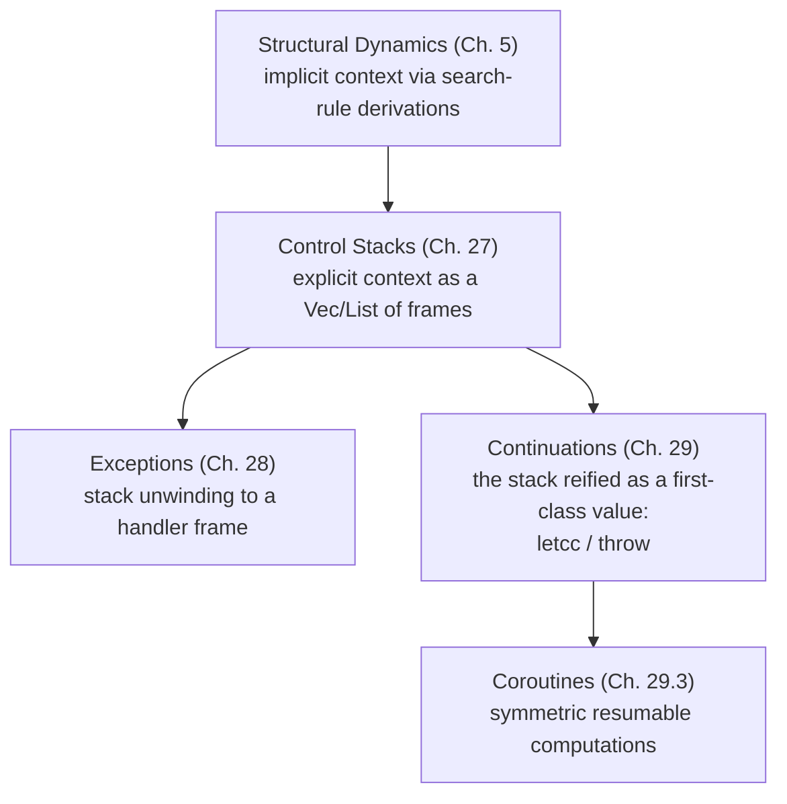

[[book-guidelines|↩ Back to guidelines]]

# Control Stacks and Abstract Machines

## The problem: structural dynamics is a great proof tool and a bad implementation plan

Go back to how [[Statics-And-Dynamics|structural dynamics]] evaluates something like `ap(ap(f; x); y)`. To take a single step deep inside that expression — say, reducing `f` to a value — the *search rules* have to reconstruct the entire surrounding expression around the reduced piece. Concretely, a rule like

$$\frac{e_1 \mapsto e_1'}{\mathsf{ap}(e_1;e_2) \mapsto \mathsf{ap}(e_1';e_2)}$$

says: take a step in $e_1$, then rebuild `ap(e_1'; e_2)` around the result. Every single instruction step anywhere inside a deeply nested expression drags the entire enclosing structure back into the picture just to reattach it. That's fine on paper — it's how you get clean induction principles for [[Type-Safety|type safety]] proofs — but it is a terrible implementation strategy. A real interpreter can't re-walk and rebuild the whole program tree on every micro-step; it needs *some* efficient way to remember "where was I, and what do I do with the answer when it comes back."

That's exactly what a **control stack** is: an explicit, first-class data structure that records the pending work — the surrounding context — so the machine never has to reconstruct it. Harper's own framing (Chapter 27, opening): by making the control stack explicit, *every transition rule becomes an axiom* — no premises at all. The recursive "take a step inside me" structure of search rules is replaced by a flat list of pending obligations that you push and pop.

This is worth sitting with, because it's a genuine change of proof *style*, not just an implementation detail: structural [[Exceptions#Dynamics|dynamics]] encodes context implicitly, in the shape of the derivation tree. An abstract machine encodes context explicitly, as *data* — a value you can inspect, save, and (as Chapters 28–29 will exploit) even hand to the programmer as a first-class continuation.

## The machine: $\mathcal{K}\{\mathtt{nat} \rightharpoonup\}$

Harper defines an abstract machine $\mathcal{K}\{\mathtt{nat} \rightharpoonup\}$ for $\mathcal{L}\{\mathtt{nat}\rightharpoonup\}$ (PCF: naturals, general recursion, functions). A **state** $s$ pairs a control stack $k$ with a closed expression $e$, and comes in exactly two shapes:

- **Evaluation state**, $k \triangleright e$ — "evaluate $e$, and when you're done, return the result to stack $k$."
- **Return state**, $k \triangleleft e$ (with $e\ \mathsf{val}$) — "here is a finished value $e$; resume the pending computation recorded in $k$."

Harper's mnemonic: the separator arrow "points at" the focal component — the expression in an evaluation state, the stack in a return state. This two-mode design is the single most important structural idea in the chapter: **a machine step is always either "descend into subexpressions, recording what's pending" or "a value has arrived, consume one pending obligation."** Everything else is instances of that pattern.

### Control stacks and frames

A control stack is literally a list built from two rules:

$$\frac{}{\varepsilon\ \mathsf{stack}} \qquad \frac{f\ \mathsf{frame} \quad k\ \mathsf{stack}}{k;f\ \mathsf{stack}}$$

$\varepsilon$ is the empty stack (top-level context); $k;f$ pushes frame $f$ onto stack $k$. A **frame** records one pending sub-computation — literally, an expression-shaped context with a hole in the position that's currently being evaluated. For $\mathcal{L}\{\mathtt{nat}\rightharpoonup\}$ the frames are:

$$\mathsf{s}(-)\ \mathsf{frame} \qquad \mathsf{ifz}(-;e_1;x.e_2)\ \mathsf{frame} \qquad \mathsf{ap}(-;e_2)\ \mathsf{frame}$$

Notice the correspondence Harper is explicit about: **each frame shape is exactly one search rule from the structural dynamics, turned inside out.** Where structural dynamics had a rule "if $e \mapsto e'$ then $\mathsf{s}(e) \mapsto \mathsf{s}(e')$," the machine instead has a frame $\mathsf{s}(-)$ that gets pushed once and then just waits. The "$-$" is the hole — the position of the currently-active subcomputation.

### Transition rules

For naturals:

$$k \triangleright \mathsf{z} \mapsto k \triangleleft \mathsf{z}$$
$$k \triangleright \mathsf{s}(e) \mapsto k;\mathsf{s}(-) \triangleright e$$
$$k;\mathsf{s}(-) \triangleleft e \mapsto k \triangleleft \mathsf{s}(e)$$

$\mathsf{z}$ is already a value, so it's returned immediately. To evaluate $\mathsf{s}(e)$, push a frame recording "there's a pending successor here," then descend into $e$. When $e$ finishes and returns, pop the frame and wrap the value in $\mathsf{s}(\cdot)$.

For case analysis (`ifz`):

$$k \triangleright \mathsf{ifz}(e;e_1;x.e_2) \mapsto k;\mathsf{ifz}(-;e_1;x.e_2) \triangleright e$$
$$k;\mathsf{ifz}(-;e_1;x.e_2) \triangleleft \mathsf{z} \mapsto k \triangleright e_1$$
$$k;\mathsf{ifz}(-;e_1;x.e_2) \triangleleft \mathsf{s}(e) \mapsto k \triangleright [e/x]e_2$$

Evaluate the scrutinee first, recording the two branches on the stack; once its value arrives, branch and substitute.

For functions and recursion:

$$k \triangleright \mathsf{lam}[\tau](x.e) \mapsto k \triangleleft \mathsf{lam}[\tau](x.e)$$
$$k \triangleright \mathsf{ap}(e_1;e_2) \mapsto k;\mathsf{ap}(-;e_2) \triangleright e_1$$
$$k;\mathsf{ap}(-;e_2) \triangleleft \mathsf{lam}[\tau](x.e) \mapsto k \triangleright [e_2/x]e$$
$$k \triangleright \mathsf{fix}[\tau](x.e) \mapsto k \triangleright [\mathsf{fix}[\tau](x.e)/x]e$$

A lambda is already a value — return it. Application evaluates the function position first (push the frame recording the pending argument $e_2$), and once a $\mathsf{lam}$ arrives, substitutes the argument in and continues *without pushing anything*. Harper explicitly flags something worth remembering: **`fix` needs no stack space at all** — it's a pure unwinding/substitution step, evaluated in place. (He notes that this innocent-looking fact gets revisited once tail calls and stack-space cost become the object of study, in Chapter 37.)

Initial and final states close the loop:

$$e \triangleright e\ \mathsf{initial} \qquad \frac{e\ \mathsf{val}}{\varepsilon \triangleleft e\ \mathsf{final}}$$

You start with the empty stack pointing at the whole program, and you're done exactly when the stack has emptied back out and you're holding a value.

### What breaks without this

Without frames, the only way to remember "I'm three levels deep inside two nested `ap`s and an `ifz`, and here's what to do with each pending result" is the call stack of whatever language you're *implementing this in* — i.e., you're outsourcing control-flow bookkeeping to your host language's own machinery, which is exactly the "traversal and reconstruction" Harper is trying to make explicit and inspectable. If control is implicit, you cannot save it, suspend it, resume it later, or hand it to the running program as data. That capability — treating the stack as a first-class value — is precisely what [[Continuations|continuations]] (`Continuations`, Chapter 29) do; it is *only possible* because this chapter first makes the stack a well-defined, self-contained mathematical object instead of an artifact of however the metalanguage happens to implement recursion.

### Grounding: this is a bytecode interpreter's inner loop

If you've ever written a stack-based VM, you already know this machine — it's the CEK-style "eval/apply with an explicit continuation stack" pattern. In Rust, the two-state design and the frame set translate almost verbatim:

```rust
enum Expr {
    Zero,
    Succ(Box<Expr>),
    Ifz(Box<Expr>, Box<Expr>, String, Box<Expr>), // e, e1, x, e2
    Lam(String, Box<Expr>),
    Ap(Box<Expr>, Box<Expr>),
    Fix(String, Box<Expr>),
    Var(String),
}

enum Frame {
    Succ,                          // s(-)
    Ifz(Box<Expr>, String, Box<Expr>), // ifz(-; e1; x.e2)
    ApArg(Box<Expr>),              // ap(-; e2)
    ApFun(Box<Expr>),              // ap(v1; -), holding the evaluated function
}

enum State {
    Eval(Vec<Frame>, Expr),   // k ▷ e
    Return(Vec<Frame>, Expr), // k ◁ e   (e is a value)
}

fn step(s: State) -> State {
    match s {
        State::Eval(mut k, Expr::Zero) => State::Return(k, Expr::Zero),
        State::Eval(mut k, Expr::Succ(e)) => {
            k.push(Frame::Succ);
            State::Eval(k, *e)
        }
        State::Return(mut k, v) if matches!(k.last(), Some(Frame::Succ)) => {
            k.pop();
            State::Return(k, Expr::Succ(Box::new(v)))
        }
        State::Eval(mut k, Expr::Ap(e1, e2)) => {
            k.push(Frame::ApArg(e2));
            State::Eval(k, *e1)
        }
        // ... ap(-; e2) frame receiving the function value, then
        //     ap(v1; -) frame receiving the argument value, substituting, etc.
        _ => unreachable!(),
    }
}
```

The `Vec<Frame>` *is* the control stack $k$; `State::Eval` / `State::Return` are literally $k \triangleright e$ and $k \triangleleft e$. This is not an analogy — a tree-walking interpreter written with an explicit `Vec<Frame>` instead of native recursion is, structurally, exactly $\mathcal{K}\{\mathtt{nat}\rightharpoonup\}$. Writing an interpreter this way (rather than via a recursive `eval` function that rides the host call stack) is precisely what buys you the ability to pause, serialize, or resume evaluation mid-computation — the mechanism behind generators, `async`/await desugaring, and effect handlers all trace back to this chapter's move.

## Safety for the machine

Structural dynamics [[Dynamic-Classification#Safety|safety]] needed only a typing judgment on expressions. The machine needs a typing judgment *on stacks*, because a stack is now a piece of runtime state with its own shape that must be checked for coherence with the expression it's paired with.

**Stack typing**, $k : \tau$ — "stack $k$ expects to eventually receive a value of type $\tau$, and will hand back a well-typed final answer":

$$\frac{}{\varepsilon : \tau} \qquad \frac{k : \tau' \quad f : \tau \Rightarrow \tau'}{k;f : \tau}$$

This leans on an auxiliary **frame typing** judgment $f : \tau \Rightarrow \tau'$ — "frame $f$ transforms an incoming value of type $\tau$ into an outgoing value of type $\tau'$":

$$\mathsf{s}(-) : \mathsf{nat} \Rightarrow \mathsf{nat}$$
$$\frac{e_1 : \tau \quad x:\mathsf{nat} \vdash e_2 : \tau}{\mathsf{ifz}(-;e_1;x.e_2) : \mathsf{nat} \Rightarrow \tau}$$
$$\frac{e_2 : \tau_2}{\mathsf{ap}(-;e_2) : \mathsf{arr}(\tau_2;\tau) \Rightarrow \tau}$$

A **well-formed state** matches expression and stack types up:

$$\frac{k:\tau \quad e:\tau}{k \triangleright e\ \mathsf{ok}} \qquad \frac{k:\tau \quad e:\tau \quad e\ \mathsf{val}}{k \triangleleft e\ \mathsf{ok}}$$

With those in place, safety is the same two-part shape you've already seen for [[Type-Safety|structural dynamics]] — *preservation* (a step from a well-formed state lands in a well-formed state) and *progress* (a well-formed state is either final or can step) — restated for machine states:

> **Theorem 27.1 (Safety).**
> 1. If $s\ \mathsf{ok}$ and $s \mapsto s'$, then $s'\ \mathsf{ok}$.
> 2. If $s\ \mathsf{ok}$, then either $s\ \mathsf{final}$ or there exists $s'$ with $s \mapsto s'$.

Harper leaves the proof as an exercise, but the shape should feel entirely familiar by this point in the book: it's structural induction on the transition relation, using the frame-typing rules to line up what's being pushed/popped with what type it's supposed to carry. This is exactly the discipline a real stack-machine implementation needs: the frame typing rules are, essentially, a specification for what invariant your `Vec<Frame>` must satisfy at every point in execution — a fact directly relevant if you're building a checker that has to certify a compiled/staged representation of a program, not just its surface syntax.

## Correctness: does the machine compute the same thing as the dynamics?

This is the heart of the chapter, and it's the part with real proof content. The question: for a given expression $e$, does running it on $\mathcal{K}\{\mathtt{nat}\rightharpoonup\}$ produce the same value as the structural dynamics of $\mathcal{L}\{\mathtt{nat}\rightharpoonup\}$? It splits into two directions:

> **Completeness.** If $e \mapsto^* e'$ with $e'\ \mathsf{val}$, then $\varepsilon \triangleright e \mapsto^* \varepsilon \triangleleft e'$.
> **Soundness.** If $\varepsilon \triangleright e \mapsto^* \varepsilon \triangleleft e'$, then $e \mapsto^* e'$ with $e'\ \mathsf{val}$.

Together these say the machine and the structural dynamics compute *exactly* the same relation between expressions and values — one direction says the machine doesn't do less than the dynamics, the other says it doesn't do more (doesn't "invent" answers the real semantics wouldn't produce).

### Completeness: lean on evaluation dynamics, not induction on multistep

A naive attempt — induct directly on the multistep transition relation $e \mapsto^* e'$ — runs into trouble immediately. Consider $e = \mathsf{ap}(e_1;e_2)$: the very first machine step is $k \triangleright \mathsf{ap}(e_1;e_2) \mapsto k;\mathsf{ap}(-;e_2) \triangleright e_1$, which evaluates $e_1$ **on a non-empty stack**. So the induction can't stay at "the empty stack" — you're forced to generalize to an arbitrary stack $k$, and even then, proving the inductive step for a compound expression like `ap` requires already knowing that its subexpression reaches *some* value, which multistep-transition induction doesn't hand you for free.

The fix is to switch inductive structure entirely and induct on **evaluation dynamics** $e \Downarrow v$ (Chapter 7's big-step relation — recall $e \Downarrow v \iff e \mapsto^* v$) instead of on small-step multistep transition:

> **Lemma 27.2.** If $e \Downarrow v$, then for every stack $k$: $k \triangleright e \mapsto^* k \triangleleft v$.

The `ap` case makes the payoff obvious. Given the evaluation rule
$$\frac{e_1 \Downarrow \mathsf{lam}[\tau_2](x.e) \quad [e_2/x]e \Downarrow v}{\mathsf{ap}(e_1;e_2) \Downarrow v}$$
the two premises are exactly the two inductive hypotheses you need, and you interleave them with two machine steps:

$$k \triangleright \mathsf{ap}(e_1;e_2) \mapsto k;\mathsf{ap}(-;e_2) \triangleright e_1 \mapsto^* k;\mathsf{ap}(-;e_2) \triangleleft \mathsf{lam}[\tau_2](x.e) \mapsto k \triangleright [e_2/x]e \mapsto^* k \triangleleft v.$$

Every evaluation-dynamics rule has exactly this shape: premises give you machine runs by induction, and the corresponding machine axioms glue them together. Big-step evaluation dynamics is the right induction principle here precisely because it already carries "and this subexpression's *final* value is..." as a hypothesis, which is exactly what the naive small-step approach was missing.

### Soundness: unravel machine states back into expressions

The reverse direction has its own wrinkle: a run $\varepsilon \triangleright e \mapsto^* \varepsilon \triangleleft v$ alternates between evaluation and return states in a way that doesn't decompose cleanly by simple induction on the multistep sequence. Harper's fix is to give every machine state a *meaning* as an ordinary expression, and show machine transitions are simulated, step for step (or zero steps), by structural-dynamics transitions on that meaning.

Define **unravelling**, $s \# e$ — "state $s$ unravels to expression $e$" — via an auxiliary "wrap the stack around the expression" judgment $k \Join e = e'$:

$$\frac{k \Join e = e'}{k \triangleright e \,\#\, e'} \qquad \frac{k \Join e = e'}{k \triangleleft e \,\#\, e'}$$

$$\varepsilon \Join e = e$$
$$\frac{k \Join \mathsf{s}(e) = e'}{k;\mathsf{s}(-) \Join e = e'} \qquad \frac{k \Join \mathsf{ifz}(e_1;e_2;x.e_3) = e'}{k;\mathsf{ifz}(-;e_2;x.e_3) \Join e_1 = e'} \qquad \frac{k \Join \mathsf{ap}(e_1;e_2) = e}{k;\mathsf{ap}(-;e_2) \Join e_1 = e}$$

In words: to wrap frame $\mathsf{s}(-)$ around $e$, plug $e$ into the hole to get $\mathsf{s}(e)$, then keep wrapping the rest of the stack around *that*. This literally reconstructs the "big" expression that the machine's stack + focus were standing in for — undoing, layer by layer, exactly the decomposition the search rules used to do. Both judgments are total functions (Lemma 27.5), so it's legitimate to write $k \Join e$ for the unique result.

The crucial lemma is that unravelling commutes with transition:

> **Lemma 27.6.** If $e \mapsto e'$, $k \Join e = d$, $k \Join e' = d'$, then $d \mapsto d'$.

Proved by rule induction on $e \mapsto e'$: inductive cases (rules with premises, like the `ap` congruence rule) push straight through by the induction hypothesis on the unravelled subexpression's frame; base cases (axioms, like $\beta$-reduction itself) require a *second*, inner induction on the shape of $k$, peeling stack frames off one at a time and re-checking that the corresponding structural-dynamics congruence rule applies at each layer.

From there, soundness (Lemma 27.3: $s \mapsto s'$, $s \# e$, $s' \# e'$ implies $e \mapsto^* e'$) and the full correctness statement follow:

> **Corollary 27.4.** $e \mapsto^* n$ iff $\varepsilon \triangleright e \mapsto^* \varepsilon \triangleleft n$.

That corollary is the payoff: the machine and the structural dynamics are *observationally identical* — for any expression, they agree on whether and to what it evaluates. Everything about the machine's internal bookkeeping (frames, pushes, pops) is invisible from the outside; it is purely an implementation-level rearrangement of the same underlying semantics.

### Grounding: why this proof shape matters for building a verifier

This soundness proof — define a "meaning" (unravelling) function from machine states back to source terms, then show each machine step is simulated by zero-or-one steps of the reference semantics under that meaning function — is the standard recipe for **compiler/VM correctness proofs** in general, not just this one chapter. It is exactly the shape of a simulation/bisimulation argument you'd reach for verifying that a lower-level representation (bytecode, an SSA IR, a control-stack machine) faithfully implements a higher-level reference semantics. If you're formalizing this in Lean, $k \Join e$ is a straightforward recursive function on the frame-stack datatype (`List Frame → Expr → Expr`), $s \mathrel{\#} e$ is a thin wrapper matching on the two state constructors, and Lemma 27.6 is a `theorem` proved by `induction` on the derivation of $e \mapsto e'$ with a nested `induction` on `k` in the axiom cases — a direct, line-for-line translation of Harper's two nested inductions. The "unravelling preserves the transition relation" pattern is also precisely what you'd want when arguing that a Hoare-triple checker's compiled intermediate representation still satisfies the same specification as the source-level program it started from: the compiled form's "meaning," via an unravelling-style function, must agree with the source semantics at every step, not just at the end.

## Where this leads



Chapter 27's real contribution is turning "the context of evaluation" from an artifact of a proof technique into a well-typed, well-behaved *value* — something with its own typing judgment ($k:\tau$), its own safety theorem, and a proven-exact correspondence back to the semantics you already trust. That's what makes the next two chapters possible: [[Chapter 28|Exceptions]] (Chapter 28) are literally "pop frames off the control stack until you find a handler" — stack unwinding only makes sense once the stack is explicit data you can search and truncate. And [[Chapter 29|Continuations]] (Chapter 29) go one step further and let the *program itself* capture and later reinstall an entire control stack as an ordinary value (`cont(k)`) — `letcc`/`throw` are only well-typed, safe operations because this chapter already nailed down exactly what a control stack is, how it's typed, and how it relates to the structural semantics it's standing in for. Harper's closing note also places this machine in its historical lineage: it is a modern presentation of Landin's SECD machine (1965), itself a linearization of Plotkin's structural operational semantics — the abstract-machine style is the dominant approach to real interpreter and VM design precisely because of the property proved here.

For the standing project: this chapter is the direct bridge between "a typing/evaluation *specification*" and "an actual interpreter loop you can implement and reason about." If the eventual Rust verifier needs to execute (or symbolically step through) programs against Hoare-triple specifications, the state it manipulates at each step is going to look exactly like $k \triangleright e$ / $k \triangleleft e$ — and the soundness argument here (unravelling + step-simulation) is the template for proving that stepping the *implementation's* representation of a program agrees with stepping its *specification-level* semantics.
