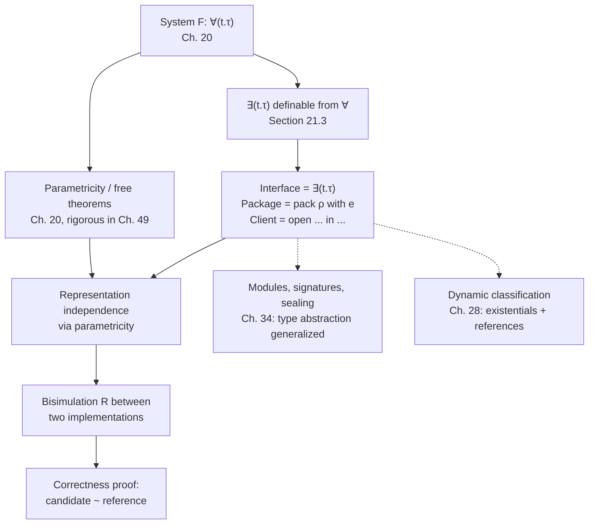

[[book-guidelines|↩ Back to guidelines]]

## What breaks without this

Suppose you write a queue library. Internally you represent a queue as a `list`. You expose `emp`, `ins`, `rem`. Some client uses your library and — because nothing stops them — pattern-matches directly on the list structure you handed back, or compares two queues with list equality. Now you cannot change your representation to the amortized-cost pair-of-lists trick without breaking that client, even though every operation in your interface still behaves identically. The client's correctness has become accidentally coupled to *how* you implemented the queue rather than *what* the queue does. That coupling is the entire disease that data abstraction exists to cure.

The fix people reach for informally is "just don't look at the internals" — a convention enforced by discipline, documentation, or `private` keywords, but not by the type system's actual proof obligations. Harper's move in Chapter 21 is to make representation-hiding a theorem, not a norm: he introduces **existential types**, whose typing rules make it a type error — not a bug you might get away with — for a client to depend on the representation at all. This is the material a Rust `trait` object or a Lean `structure` behind an opaque `def` is *ultimately* justified by.

## The problem stated precisely: interfaces, packages, clients

Harper opens Chapter 21 with the core informal contract:

> "The main idea is to introduce an interface that serves as a contract between the client and the implementor of an abstract type. The interface specifies what the client may rely on for its own work, and, simultaneously, what the implementor must provide to satisfy the contract."

Three roles fall out of this:

- **Interface** — a specification of *what operations exist* and *what their types are*, without saying how they're implemented.
- **Implementation** (the book calls this a **package**) — a concrete representation type together with code realizing each operation over that representation.
- **Client** — code that uses the interface's operations, written *without knowledge of the representation type*.

The punchline of the whole chapter, stated up front: "data abstraction is actually just a form of polymorphism!" Existential types — packages and clients — turn out to be definable purely from the universal types ($\forall$) of System F that you'd have met in Chapter 20. Representation independence, the property that lets you swap implementations freely, is then just a restatement of *parametricity* — the free-theorems property of polymorphic functions.

## Existential types as the formal interface

### Why existential quantification, of all things

Think about what "the client doesn't know the representation" means formally. The client's code must type-check for *some* representation type — it can't be written against a specific one, because the whole point is that the implementor is free to choose. That's an existential statement: "there exists a type $t$ (with certain operations available on it) such that my code is well-typed against $t$." Harper formalizes the interface itself as the existential type:

$$\exists(t.\tau)$$

read as "there exists a type $t$ such that the package's contents have type $\tau$" (where $\tau$ typically mentions $t$ — e.g., $t$ appears in the types of the operations). This is exactly a *type*, playable as the type of any implementation meeting the interface.

### Syntax: packages introduce, open eliminates

The book extends $\mathcal{L}\{\to\forall\}$ (System F) to $\mathcal{L}\{\to\forall\exists\}$ with:

| Role | Abstract syntax | Concrete syntax | Meaning |
|---|---|---|---|
| Type | $\mathsf{some}(t.\tau)$ | $\exists(t.\tau)$ | interface |
| Introduction | $\mathsf{pack}[t.\tau][\rho](e)$ | $\mathsf{pack}\ \rho\ \mathsf{with}\ e\ \mathsf{as}\ \exists(t.\tau)$ | implementation |
| Elimination | $\mathsf{open}[t.\tau][\rho](e_1; t,x.e_2)$ | $\mathsf{open}\ e_1\ \mathsf{as}\ t\ \mathsf{with}\ x{:}\tau\ \mathsf{in}\ e_2$ | client |

A **package** `pack ρ with e as ∃(t.τ)` bundles two things: $\rho$, a concrete type called the **representation type**, and $e$, the **implementation**, an expression of type $[\rho/t]\tau$ (i.e., $\tau$ with the abstract variable $t$ instantiated to the real, concrete $\rho$). The representation type is *inside* the package — that's the crucial asymmetry with a universal type, where the type argument is supplied from outside at the use site.

An **open** expression `open e1 as t with x:τ in e2` is how a client consumes a package: it unpacks $e_1 : \exists(t.\tau)$, binding the (unknown, abstract) representation to the type variable $t$ and the implementation to the value variable $x$, and then runs the client body $e_2$ using only $t$ and $x$ — never the real $\rho$.

### The typing rules — where the guarantee actually lives

$$\dfrac{\Delta, t\ \mathsf{type} \vdash \tau\ \mathsf{type}}{\Delta \vdash \mathsf{some}(t.\tau)\ \mathsf{type}} \tag{21.1a}$$

$$\dfrac{\Delta \vdash \rho\ \mathsf{type} \quad \Delta, t\ \mathsf{type} \vdash \tau\ \mathsf{type} \quad \Delta\ \Gamma \vdash e : [\rho/t]\tau}{\Delta\ \Gamma \vdash \mathsf{pack}[t.\tau][\rho](e) : \mathsf{some}(t.\tau)} \tag{21.1b}$$

$$\dfrac{\Delta\ \Gamma \vdash e_1 : \mathsf{some}(t.\tau) \quad \Delta, t\ \mathsf{type}\ \Gamma, x{:}\tau \vdash e_2 : \tau_2 \quad \Delta \vdash \tau_2\ \mathsf{type}}{\Delta\ \Gamma \vdash \mathsf{open}[t.\tau][\tau_2](e_1; t,x.e_2) : \tau_2} \tag{21.1c}$$

Rule (21.1c) is the one that does all the work, and Harper flags it explicitly as worth studying carefully. Two things to notice, exactly as the book states them:

1. **The result type $\tau_2$ of the client must not mention $t$.** This is enforced by the side condition $\Delta \vdash \tau_2\ \mathsf{type}$ — that judgment is made in $\Delta$ *without* $t$ in scope, so $\tau_2$ syntactically cannot refer to $t$. This prevents the client from smuggling a value of the abstract type back out into a context where $t$ no longer makes sense (there is no "outside" meaning for a type that only exists inside the `open`).
2. **The body $e_2$ is checked in the extended context $\Delta, t\ \mathsf{type}$ — i.e., $t$ is treated as an *arbitrary, unknown* type, not as $\rho$.** This is the formal mechanism that makes the client's code representation-independent: it type-checks under exactly the same hypothesis regardless of which $\rho$ the eventual implementor picks, because the typing rule never looks at $\rho$ at all when checking $e_2$. The client is, in the book's own words, "in effect, polymorphic in the type variable $t$." That sentence is the seed of Section 21.3.

### Dynamics: abstraction vanishes at run time

$$\dfrac{[e\ \mathsf{val}]}{\mathsf{pack}[t.\tau][\rho](e)\ \mathsf{val}} \tag{21.2a}$$
$$\dfrac{e \mapsto e'}{\mathsf{pack}[t.\tau][\rho](e) \mapsto \mathsf{pack}[t.\tau][\rho](e')}\ [e\ \mathsf{val}] \tag{21.2b}$$
$$\dfrac{e_1 \mapsto e_1'}{\mathsf{open}[t.\tau][\tau_2](e_1;t,x.e_2) \mapsto \mathsf{open}[t.\tau][\tau_2](e_1';t,x.e_2)} \tag{21.2c}$$
$$\mathsf{open}[t.\tau][\tau_2](\mathsf{pack}[t.\tau][\rho](e); t,x.e_2) \mapsto [\rho,e/t,x]e_2\ [e\ \mathsf{val}] \tag{21.2d}$$

Rule (21.2d) is the interesting one: opening a package literally *substitutes* the concrete representation type $\rho$ (and the implementation $e$) into the client body. Harper's own observation deserves to be quoted directly, because it's easy to miss:

> "there are no abstract types at run time! The representation type is propagated to the client by substitution when the package is opened, thereby eliminating the abstraction boundary between the client and the implementor. Thus, data abstraction is a compile-time discipline that leaves no traces of its presence at execution time."

This is exactly the phase distinction argument you'll meet again with type classes / dictionary-passing, and it's the theoretical basis for "zero-cost abstraction" claims in languages like Rust: an abstract type is a *static fiction* used to police what the client is allowed to assume; by run time it's gone, substituted away.

[[Dynamic-Classification#Safety|Safety]] is the expected preservation + progress pair, with a canonical forms lemma (21.3): any closed value of type $\exists(t.\tau)$ is, up to evaluation, a package `pack[t.τ][ρ](e0)` for some $\rho$ and $e_0 : [\rho/t]\tau$.

### Grounding: Rust, Lean, Python

**Rust.** The most literal translation of $\exists(t.\tau)$ is `impl Trait` in return position, or a boxed trait object `Box<dyn Trait>`:

```rust
trait Queue {
    fn empty() -> Self where Self: Sized;
    fn insert(self, x: u64) -> Self;
    fn remove(self) -> (Option<u64>, Self);
}

// The interface: ∃(t. { emp: t, ins: nat×t→t, rem: t→nat×t opt })
// Concretely: a value the caller can only use through the Queue trait,
// never by naming the concrete representation type.
fn make_queue() -> impl Queue {
    // representation type ρ = Vec<u64>, hidden by `impl Trait`
    Vec::<u64>::new()
}
```

The caller of `make_queue()` gets back "some type implementing `Queue`" — they cannot pattern-match on it as a `Vec`, cannot compare it to a `Vec`, cannot do anything except call `Queue` methods on it. That is rule (21.1c)'s restriction, enforced by the Rust compiler exactly the way $t \notin \tau_2$ is enforced in the `open` rule. `Box<dyn Queue>` is the same idea with the representation type erased to a vtable pointer at run time rather than monomorphized away at compile time — but *both* forms guarantee the client cannot depend on the representation, which is the actual content of data abstraction. Swapping `Vec<u64>` for a `(Vec<u64>, Vec<u64>)` back/front pair internally, as Harper's chapter does, requires zero changes to any caller of `make_queue()` — that's representation independence, made checkable by the compiler rather than promised in a docstring.

**Lean.** Lean's `structure`/opaque-definition mechanism gives the same guarantee through its own elaborator machinery:

```lean
structure Queue (α : Type) where
  Rep : Type
  emp : Rep
  ins : α → Rep → Rep
  rem : Rep → Option (α × Rep)
```

A term of type `Queue α` is a genuine dependent-pair package — Lean's $\Sigma$-type is precisely the dependently-typed generalization of $\exists(t.\tau)$ (Harper returns to this connection in Chapter 24's dependent kinds and later chapters on modules). Because `Rep` is a field bound existentially inside the structure, code that only has a `Queue α` value in hand, and never unfolds `.Rep`, is exactly Harper's client: type-checked against an abstract, opaque representation. This is also the shape Lean's own module/typeclass system takes when it hides an implementation type behind an interface.

**Python** doesn't have a static type system enforcing any of this, so the analogy is necessarily descriptive rather than load-bearing: a Python class with name-mangled `_rep` attributes and only public methods *behaviorally* mimics representation-hiding, but nothing stops a client from reaching in and reading `queue._rep` directly — there is no rule (21.1c) being checked. Worth naming as the "[[Control-Stacks-and-Abstract-Machines#What breaks without this|what breaks without this]]" case in miniature: Python gives you the convention, Rust and Lean give you the *proof*.

## Definability of existentials from universals (Section 21.3)

Harper doesn't stop at giving existentials their own primitive rules — he shows $\exists(t.\tau)$ is *derivable* from $\forall$, meaning you never needed to add a new type former to System F in the first place. The insight is precisely the observation flagged above: the client in rule (21.1c) is already "in effect polymorphic in $t$" — a function of type $\forall(t.\tau \to \tau_2)$, where $t$ may occur in $\tau$ but is barred from $\tau_2$.

Turn that observation into a definition:

$$\exists(t.\tau) \;\triangleq\; \forall(u.\forall(t.\tau \to u) \to u)$$
$$\mathsf{pack}\ \rho\ \mathsf{with}\ e\ \mathsf{as}\ \exists(t.\tau) \;\triangleq\; \Lambda(u.\lambda(x{:}\forall(t.\tau\to u))\ x[\rho](e))$$
$$\mathsf{open}\ e_1\ \mathsf{as}\ t\ \mathsf{with}\ x{:}\tau\ \mathsf{in}\ e_2 \;\triangleq\; e_1[\tau_2](\Lambda(t.\lambda(x{:}\tau)\ e_2))$$

Read this the way you'd read a continuation-passing-style transform: an existential package doesn't hand you a value directly — it hands you *a function that will call your continuation with the hidden type and value, for whatever result type $u$ your continuation demands*. That's exactly what $\forall(u.\forall(t.\tau\to u)\to u)$ says: "give me the answer type $u$ and a $t$-polymorphic handler, I'll produce a $u$." `open` then is just: package up the client as such a handler ($\Lambda(t.\lambda(x{:}\tau)\ e_2)$), instantiate the existential's result type to $\tau_2$, and apply.

This is the same encoding trick Chapter 20 used for Church-encoding sums and products in System F (worth cross-referencing directly — an existential is structurally closer to a sum than a product: "here's *some* value of *some* type, use it generically" is the same shape as "here's *one* branch of *some* tag, handle it generically"). The practical upshot for a compiler-builder: if your core calculus already has impredicative $\forall$, you get data abstraction for free by desugaring `pack`/`open` to this encoding — you don't need a separate elaboration path or a separate soundness proof.

## Representation independence and bisimilarity (Section 21.4)

Definability of $\exists$ from $\forall$ isn't just a curiosity — it's what lets Harper derive representation independence as a *consequence* of parametricity rather than proving it from scratch. Once you see the client as a polymorphic function $c : \forall(t.\tau \to \tau_2)$, the parametricity theorem for $\forall$ (Chapter 20's free theorems, made rigorous in Chapter 49) says: *the client's behavior on two different instantiations is forced to agree, as long as the two implementations are suitably related.*

"Suitably related" is made precise via **bisimulation**. Given two implementations $e = \langle \mathsf{emp}\mapsto e_m,\ \mathsf{ins}\mapsto e_i,\ \mathsf{rem}\mapsto e_r\rangle$ over representation $\rho$, and $e' = \langle \mathsf{emp}\mapsto e'_m,\ \mathsf{ins}\mapsto e'_i,\ \mathsf{rem}\mapsto e'_r\rangle$ over $\rho'$, a relation $R$ between values of $\rho$ and $\rho'$ makes them **respect $R$** (equivalently, makes the two implementations **bisimilar**) exactly when:

1. **Empty queues are related:** $R(e_m, e'_m)$.
2. **Insert preserves the relation:** if $R(q,q')$ then $R(e_i(d)(q),\ e'_i(d)(q'))$ for every element $d$.
3. **Remove preserves the relation and agrees on observables:** if $R(q,q')$, then either both `rem` return `null`, or both return `just` of the same head element paired with related tails.

This is a coinductive-flavored definition — it says the relation is *preserved by every operation*, which is exactly the definition of a bisimulation in process calculi (the same notion recurs in Chapter 35's discussion of strong/weak bisimilarity for concurrent processes; it's the same mathematical idea applied to sequential abstract types here). The theorem this cashes out ($49.12$, forward-referenced) says: if $e,e'$ respect some $R$, and $c$ is any client, then $c[\rho]e$ and $c[\rho']e'$ behave the same.

### The worked example

Harper's queue interface:
$$\exists\big(t.\langle \mathsf{emp}\mapsto t,\ \mathsf{ins}\mapsto \mathsf{nat}\times t \to t,\ \mathsf{rem}\mapsto t \to (\mathsf{nat}\times t)\ \mathsf{opt}\rangle\big)$$

**Reference implementation**, $\rho = \mathsf{list}$: insert conses to the head, remove reverses the whole list, takes the head, and returns the head paired with the reversed remainder. Correct but $O(n)$ per remove.

**Candidate implementation**, $\rho' = \mathsf{list}\times\mathsf{list}$ (a "back" list and a reversed "front" list): insert conses onto the back; remove pops from the front if nonempty, otherwise reverses the back into a new front first. Amortized $O(1)$ per operation.

The bisimulation that proves the candidate correct: $R(l, \langle b,f\rangle)$ holds iff $l = \mathsf{app}(b)(\mathsf{rev}(f))$ — the reference list equals the back-list followed by the reversed front-list. Check the three respect-conditions against this $R$ (empty matches empty-pair trivially; insert-onto-cons matches insert-onto-back by associativity of append; remove matches by casework on whether the front is empty), and representation independence guarantees: *any* client written against the abstract interface behaves identically whichever implementation it's linked against. You never had to reason about the client at all — the proof is entirely about the two implementations and $R$.

This is precisely the discipline behind "prove your optimized data structure correct against a naive reference implementation" — a technique that generalizes directly to proving a fast verified data structure in Rust correct against a `Vec`-backed reference model, or proving one `Queue` instance in Lean equivalent to another via a `Setoid`/quotient relation.

## Synthesis and where this leads



Structurally, existential types sit downstream of System F (Chapter 20) and upstream of two later developments the guidelines flag explicitly: Chapter 34's treatment of modules and sealing generalizes exactly this package/client structure to whole program units, and Chapter 28 shows dynamic classes are *definable* from existentials plus references — i.e., "generativity," the property that `open`-ing a package generates a type fresh by $\alpha$-equivalence (noted almost in passing in 21.1, "the type... may be thought of as a 'new' type"), is itself a load-bearing mechanism reused elsewhere.

**For the compiler/verifier project:** this chapter is the formal justification for treating an opaque Rust type (behind a trait or a private field) as *actually* sound to reason about via its interface alone — a checker that wants to verify a client against a Hoare-style contract on an abstract type can soundly ignore the representation entirely, exactly because rule (21.1c)'s side condition ($t \notin \tau_2$) guarantees the client's specification cannot depend on it. If you ever need to justify "replacing this data structure with a faster one preserves all proven client properties," the bisimulation methodology here — relate the two representations, check the operations respect the relation — is the literal recipe, not just an analogy.

**For the elaborator project:** definitional-equality-flavored unification doesn't show up directly in this chapter, but the $\exists$-from-$\forall$ encoding (Section 21.3) is a good worked example of what "elaborating away a surface construct into a smaller core calculus" looks like in miniature — `pack`/`open` desugar to plain $\Lambda$/application, exactly the kind of elaboration pass an implementation would want to perform rather than carrying existentials as primitives through the whole pipeline.
