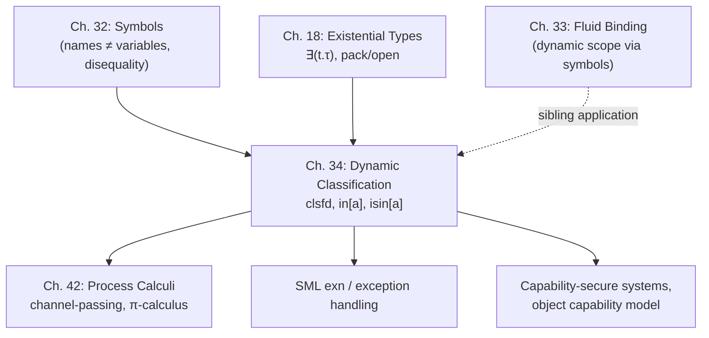

# Dynamic Classification

[[book-guidelines|↩ Back to guidelines]]

## The problem: classes fixed at compile time aren't enough

Chapters 12 and 25 gave you [[Sum-Types|sum types]] as the standard way to classify values of different shapes under one type: a value is tagged with a constructor (`inl`/`inr`, or a named variant), and you recover the underlying data by matching on the tag. That works, but the set of possible tags is baked into the type itself — it's part of the static description of the program, fixed once and for all at compile time.

That's a real limitation. Sometimes you want to mint a *new* case for a classified type *while the program is running* — without touching the type definition, without recompiling, without every other part of the program even knowing the new case exists. Think of plugin systems that register new event kinds after the fact, or exception mechanisms where a library wants to define its own exception "shape" without coordinating with every other library that might also be throwing [[Exceptions|exceptions]] into the same `exn` type.

Harper's move is to notice that this extensibility need is really a *scoping and naming* problem, and that the machinery to solve it is already on the table from Chapter 32's treatment of **symbols** — names distinguishable from each other by generation, not by spelling. A dynamic class, in this chapter, is nothing more than a freshly generated symbol used as a runtime tag.

## What breaks without dynamic generation

If class tags have to be declared statically, two things go wrong:

1. **No extensibility.** A library that wants to add a new "kind of thing" to a shared classified type (a new exception variant, a new event kind) has to modify the shared type definition — impossible if the type lives in a different compilation unit, or if you don't control it at all.
2. **No secrecy.** A statically-named tag is just an identifier anyone can write down and match against. There's no way to hand out the *ability to construct* a tagged value to one party while withholding the *ability to inspect* it from another, because the tag itself, being static, is public knowledge to anyone who can read the source.

Dynamic classification fixes both at once, and the second point turns out to be the more interesting one: because a freshly generated symbol is **unguessable** — indistinguishable from any other symbol except by the equality test the language provides — possessing the symbol becomes a genuine capability, a run-time secret. That reframing is what makes the rest of the chapter (sealing, confidentiality, "perfect encryption") make sense: a dynamic class is not just an extensibility mechanism, it's an access-control primitive.

## 34.1 Dynamic classes

### Statics: the type `clsfd`

The language `clsfd` (Harper's font for "classified") has one type and two term forms:

$$
\begin{aligned}
\mathsf{Typ}\ \tau &::= \mathsf{clsfd} &&\textbf{classified} \\
\mathsf{Exp}\ e &::= \mathsf{in}[a](e) \quad (a \cdot e) &&\textbf{instance} \\
&\phantom{::=}\ \mathsf{isin}[a](e; x.e_1; e_2) \quad (\text{match } e \text{ as } a\cdot x \Rightarrow e_1 \text{ ow} \Rightarrow e_2) &&\textbf{comparison}
\end{aligned}
$$

`in[a](e)` — written `a · e` in the concrete syntax — packages a value `e` together with a **class**, `a`, which is a *symbol* (in the sense of Chapter 32: a parameter, generated fresh, compared for identity, never captured by substitution). `isin[a](e; x.e1; e2)` inspects a classified value: if its class matches `a`, the underlying data is bound to `x` in `e1`; otherwise `e2` runs, where it might test against some *other* known class.

Typing needs the symbol's associated type in the ambient signature $\Sigma$, written $a \sim \rho$:

$$
\frac{\Gamma \vdash_{\Sigma,a\sim\rho} e : \rho}{\Gamma \vdash_{\Sigma,a\sim\rho} \mathsf{in}[a](e) : \mathsf{clsfd}} \tag{34.1a}
$$

$$
\frac{\Gamma \vdash_{\Sigma,a\sim\rho} e : \mathsf{clsfd} \quad \Gamma, x:\rho \vdash_{\Sigma,a\sim\rho} e_1 : \tau \quad \Gamma \vdash_{\Sigma,a\sim\rho} e_2 : \tau}{\Gamma \vdash_{\Sigma,a\sim\rho} \mathsf{isin}[a](e; x.e_1; e_2) : \tau} \tag{34.1b}
$$

Notice what's *not* in the type `clsfd`: no mention of which classes exist. Every classified value has the same static type regardless of its runtime class — the class only shows up as a signature entry, $a \sim \rho$, tracked alongside [[Statics-And-Dynamics#The typing judgment|the typing judgment]]. This is the formal expression of "the set of classes is open": nothing in the type forces you to enumerate them.

### Dynamics: symbol generation must be scope-free

Here's a subtlety worth sitting with. Chapter 32 gave *two* [[Exceptions#Dynamics|dynamics]] for symbols: a scoped one (symbols introduced with `new`, deallocated when their scope ends — good for stack discipline) and a free one (symbols introduced globally, living for the rest of the run). Dynamic classification needs the **free** dynamics, and the reason is instructive.

A classified value can escape the scope in which its class was generated — that's the whole point of using it to build return values, exceptions that propagate up the stack, or capabilities handed to another party. If symbol *generation* were tied to scope, the class would become meaningless (or dangling) the moment control left that scope, which defeats the purpose. So classes must persist for the life of the program once minted; only the *ability to name/use* them can be restricted (by ordinary lexical scoping of the variable holding the symbol reference).

The reduction rules (evaluating within a global symbol signature $\Sigma$, with states written $\nu\Sigma\{e\}$):

$$
\frac{e\ \mathsf{val}_\Sigma}{\mathsf{in}[a](e)\ \mathsf{val}_\Sigma} \tag{34.2a}
\qquad
\frac{\nu\Sigma\{e\} \mapsto \nu\Sigma'\{e'\}}{\nu\Sigma\{\mathsf{in}[a](e)\} \mapsto \nu\Sigma'\{\mathsf{in}[a](e')\}} \tag{34.2b}
$$

$$
\frac{e\ \mathsf{val}_\Sigma}{\nu\Sigma\{\mathsf{isin}[a](\mathsf{in}[a](e); x.e_1; e_2)\} \mapsto \nu\Sigma\{[e/x]e_1\}} \tag{34.2c}
$$

$$
\frac{a \ne a'}{\nu\Sigma\{\mathsf{isin}[a](\mathsf{in}[a'](e'); x.e_1; e_2)\} \mapsto \nu\Sigma\{e_2\}} \tag{34.2d}
$$

$$
\frac{\nu\Sigma\{e\} \mapsto \nu\Sigma'\{e'\}}{\nu\Sigma\{\mathsf{isin}[a](e; x.e_1; e_2)\} \mapsto \nu\Sigma'\{\mathsf{isin}[a](e'; x.e_1; e_2)\}} \tag{34.2e}
$$

Rule (34.2d) — the negative match — is where the *disequality* of symbols does the real work: the elimination form is defined by matching against a specific, syntactically fixed class `a`, and this only makes sense if `a` is a genuine name incapable of being confused with any other name.

**Why the dynamics cannot rely on disequality of *variables*.** Harper flags this explicitly as a design constraint, and it's worth internalizing because it generalizes: variables are given meaning by substitution, and substitution does not preserve disequality. His example: take

```
match b · ⟨⟩ as a · _ ⇒ true ow ⇒ match b · ⟨⟩ as b · _ ⇒ false ow ⇒ true
```

With `a` and `b` distinct variables this evaluates to `false` (the outer match, on class `a`, fails since the value's class is `b`, falling through to the inner match, which succeeds). But now substitute `b` for `a` — a perfectly ordinary thing to do with a variable — and you get

```
match b · ⟨⟩ as b · _ ⇒ true ow ⇒ match b · ⟨⟩ as b · _ ⇒ false ow ⇒ true
```

which evaluates to `true`, because the outer match now succeeds. **The same program, differing only by a substitution that should be semantically inert, produces different answers.** That's a soundness disaster if classes were variables. Symbols avoid it because the language never substitutes for a symbol — a symbol is a parameter, introduced once, compared by identity, and never touched by capture-avoiding substitution the way a variable is. This is precisely the variables-vs-symbols distinction Chapters 32–33 spent building up, now load-bearing for a new feature.

### Safety

[[Type-Safety|Type safety]] is the expected preservation/progress pair, proved "similar to the [[State-and-Assignables#Safety|safety]] proofs given in Chapters 12, 13, and 32" — i.e. it inherits directly from the sum-type and symbol machinery already established; nothing new is needed at the safety-proof level, only at the level of expressiveness.

## 34.2 Class references: two-stage pattern matching

Section 34.1's `isin[a]` bakes the class `a` into the syntax of the match — you can only test against a class you can name lexically at the point of the match. Section 34.2 makes classes into **first-class values** so they can be passed around, stored, and tested against dynamically rather than syntactically.

$$
\begin{aligned}
\mathsf{Typ}\ \tau &::= \mathsf{class}(\tau) &&\textbf{class reference} \\
\mathsf{Exp}\ e &::= \mathsf{cls}[a] \quad (\&a) &&\textbf{reference} \\
&\phantom{::=}\ \mathsf{mk}(e_1;e_2) &&\textbf{instance} \\
&\phantom{::=}\ \mathsf{isofcls}(e_0; e_1; x.e_2; e_3) &&\textbf{dispatch}
\end{aligned}
$$

`cls[a]` is a first-class reference to the symbol `a`, of type `class(τ)` where `τ` is `a`'s associated type. `mk(e1;e2)` builds a classified value using a class *reference* `e1` (rather than a syntactically fixed class name) applied to data `e2`. `isofcls(e0; e1; x.e2; e3)` is a two-stage dispatch: first evaluate `e0` to determine *which* class reference to test against, then use it to match the classified value `e1`.

$$
\frac{}{\Gamma \vdash_{\Sigma,a\sim\tau} \mathsf{cls}[a] : \mathsf{class}(\tau)} \tag{34.3a}
\qquad
\frac{\Gamma \vdash_\Sigma e_1 : \mathsf{class}(\tau) \quad \Gamma \vdash_\Sigma e_2 : \tau}{\Gamma \vdash_\Sigma \mathsf{mk}(e_1;e_2) : \mathsf{clsfd}} \tag{34.3b}
$$

$$
\frac{\Gamma \vdash_\Sigma e_0 : \mathsf{class}(\rho) \quad \Gamma \vdash_\Sigma e_1 : \mathsf{clsfd} \quad \Gamma,x:\rho \vdash_\Sigma e_2 : \tau \quad \Gamma \vdash_\Sigma e_3 : \tau}{\Gamma \vdash_\Sigma \mathsf{isofcls}(e_0;e_1;x.e_2;e_3) : \tau} \tag{34.3c}
$$

Dynamics (structural rules for evaluating the arguments, then the two interesting reductions):

$$
\frac{e\ \mathsf{val}_\Sigma}{\nu\Sigma\{\mathsf{mk}(\mathsf{cls}[a];e)\} \mapsto \nu\Sigma\{\mathsf{in}[a](e)\}} \tag{34.4c}
$$

$$
\nu\Sigma\{\mathsf{isofcls}(\mathsf{cls}[a];e_1;x.e_2;e_3)\} \mapsto \nu\Sigma\{\mathsf{isin}[a](e_1;x.e_2;e_3)\} \tag{34.4e}
$$

The intuition: `isofcls` reduces to `isin` once you know which class you're actually asking about. The "two-stage" character is exactly what lets a class be selected at runtime — passed as a value, stored in a data structure, compared for equality as data — rather than hardwired into the program text.

## 34.3 Definability: classes are existentials plus symbol references

This is the section that answers "do we need a primitive new type for `clsfd` at all, or is it just a familiar idea in disguise?" — and the answer is the latter. Harper shows `clsfd` is *definable* from two mechanisms you already have: existential types (Chapter 16/18) and symbolic references (Chapter 32).

$$
\mathsf{clsfd} \;\triangleq\; \exists(t.\, t\ \mathsf{sym} \times t)
$$

Read the right-hand side: a classified value is a package hiding some type `t`, containing a pair of (a symbol *of* type `t sym`, a value *of* that same type `t`). The type `t` being existentially bound is precisely "the underlying type of the instance data, known to whoever created the value but not necessarily to whoever inspects it" — exactly the abstraction barrier an existential type is built to express (Chapter 18).

**Introduction.** `in[a](e)`, where `a` has associated type `ρ` and `e : ρ`, is defined as the package:

$$
\mathsf{pack}\ \rho\ \mathsf{with}\ \langle \&a, e\rangle\ \mathsf{as}\ \exists(t.\,t\ \mathsf{sym}\times t)
$$

— witness type `ρ`, contents the symbol reference `&a` and the data `e`.

**Elimination.** `isin[a](e; x.e1; e2)` unpacks the existential and then dispatches on whether the revealed symbol is `a`:

$$
\mathsf{open}\ e\ \mathsf{as}\ t\ \mathsf{with}\ \langle x,y\rangle{:}t\ \mathsf{sym}\times t\ \mathsf{in}\ (e_{\mathrm{body}}(y))
$$

`open` destructures the package `e`, giving you an abstract type `t`, a symbol `x : t sym`, and the data `y : t`. The tricky part is `e_body`: it needs type `t → τ` so that applying it to `y` type-checks *without knowing what `t` is* — remember, `t` is existentially bound, so anything you build here has to work uniformly for whatever `t` turns out to be at runtime. It's built from symbol comparison (Chapter 32's `is[a][u.u→τ](x; e1'; e2')`), which itself branches on two possible outcomes with two possibly-different result types unified after substitution:

- **Positive branch** ($x$ found to be $a$): `e1'` gets type $[\rho/u](u\to\tau) = \rho \to \tau$, so it can safely be $\lambda(x{:}\rho)\, e_1 : \rho \to \tau$ — literally the original branch `e1`, now abstracted over the instance-data variable.
- **Negative branch** ($x$ found not to be $a$): `e2'` gets type $[t/u](u\to\tau) = t \to \tau$, so it's $\lambda(\_{:}t)\, e_2 : t \to \tau$ — a function that ignores its argument and just runs `e2`, since `e2` never needed to know the instance data anyway.

The asymmetry here is worth noticing: on the positive branch you *learn* $t = \rho$ (the comparison confirms identity), so you're allowed to use the concrete type $\rho$ in building `e1'`. On the negative branch you learn nothing about $t$'s identity, so `e2'` has to be well-typed for an *arbitrary* abstract $t$ — hence it must ignore the value entirely. This is a beautifully compact instance of a very general theme: information revealed by a runtime check licenses more specific typing on the branch where the check succeeds. It is, in miniature, exactly the shape of reasoning a dependently-typed pattern match or a Lean `Decidable`-driven `if h : p then ... else ...` performs — the branch taken tells you something about a type index, and only that branch is allowed to exploit it.

Once these definitions are in place, Harper notes the [[Statics-And-Dynamics|statics and dynamics]] from Section 34.1 are *derivable* — i.e., `clsfd` doesn't need to be primitive; it's a genuinely reducible abstraction, existential types plus symbols are expressive enough on their own.

### What this buys you as an implementer

If you were building a language runtime and wondered "do I need a special runtime representation for exception-like tagged values, or can I get away with existentials and unique tokens," this section is the answer: **no**, a `Box<dyn Any>`-style or `TypeId`-keyed representation genuinely is just an encoding of an existential paired with a comparable name. In Rust terms, roughly:

```rust
// clsfd ≅ ∃(t. t sym × t)  — an existential package hiding a witness type,
// paired with a runtime-comparable "symbol" for that witness and a value of it.
// Rust's std::any::Any + a private zero-sized marker type is the closest analogue:
// the marker type plays the role of the symbol `a`, TypeId comparison plays the
// role of symbol disequality (34.2d), and Box<dyn Any> erases the witness type.

use std::any::Any;

struct Classified {
    class_id: std::any::TypeId, // stands in for the symbol `a`
    data: Box<dyn Any>,         // the erased instance data of type ρ
}

// "class" struct — a zero-sized private marker, unforgeable outside its module,
// playing the role of a freshly generated symbol.
struct MyClass;

fn make_instance(x: i32) -> Classified {
    Classified { class_id: std::any::TypeId::of::<MyClass>(), data: Box::new(x) }
}

fn try_match(c: &Classified) -> Option<&i32> {
    if c.class_id == std::any::TypeId::of::<MyClass>() {
        c.data.downcast_ref::<i32>() // safe: class_id equality guarantees the type
    } else {
        None
    }
}
```

The crucial correspondence: `TypeId::of::<MyClass>()` is unguessable-in-practice precisely because `MyClass` is a private type nobody outside the module can name — this is the Rust-level shadow of "symbols are unguessable because they're generated fresh, not because of any cryptographic property." And `downcast_ref` being safe *only after* the `TypeId` check succeeds is exactly the positive/negative branch asymmetry from the existential encoding above: the runtime check licenses recovering static knowledge of the erased type.

## 34.4 Classifying secrets: confidentiality and integrity from access control

This is the payoff section, and it reframes everything above as a *security* mechanism rather than merely a data-modeling one.

A value of type `clsfd` can only be **constructed** by sealing it with some class `a` (you need the symbol `a` in hand to write `in[a](e)`), and can only be **deconstructed** by a case analysis that includes a branch testing `a` specifically (you need `a` in hand to write `isin[a](...)`). So *possessing the symbol `a`* is, operationally, possessing two separate capabilities: the capability to construct values of that class, and the capability to open them. Nothing else is needed, and nothing less will do — a party without `a` can neither build nor inspect an `a`-classified value.

Because `a` is generated fresh, unguessable, and never producible by any other means, controlling *who receives a reference to `a`* directly controls:

- **Integrity** — if only trusted code holds the ability to *construct* class-`a` values, then any value classified `a` you encounter was necessarily built by trusted code, so you can trust whatever invariant that code maintains when producing it.
- **Confidentiality** — if only trusted code holds the ability to *deconstruct* class-`a` values, then the instance data inside an `a`-classified value is unreadable to everyone else, even though the classified value itself (as an opaque blob) may be freely passed around, stored, or transmitted.

Harper gives the archetypal protocol: generate a fresh symbol and immediately package up a matched constructor/destructor pair, discarding all other access to the raw symbol:

$$
\begin{aligned}
&\mathsf{newsym}\ a{:}\tau\ \mathsf{in} \\
&\quad \langle \lambda(x{:}\tau)\, a\cdot x, \\
&\quad\ \ \lambda(x{:}\mathsf{clsfd})\, \mathsf{match}\ x\ \mathsf{as}\ a\cdot y \Rightarrow \mathsf{just}(y)\ \mathsf{ow} \Rightarrow \mathsf{null}\rangle
\end{aligned}
$$

of type $(\tau \to \mathsf{clsfd}) \times (\mathsf{clsfd} \to \tau\ \mathsf{opt})$. Outside the scope of this declaration, `a` itself never escapes — only the two functions do — so any party you hand *just the constructor* to can create values but never read them back (a write-only capability, useful for e.g. an untrusted logger that should be able to emit tagged events but never inspect others'), and any party you hand *just the destructor* to can consume values but never forge them (a read-only capability).

This is why Harper calls it "perfect encryption": the security guarantee doesn't rest on computational hardness (there's no adversary trying to factor anything, no probabilistic argument) — it rests on the type-theoretic fact that a fresh symbol literally cannot be produced except by the generation step that created it, and that generation step happened inside a scope the attacker never had access to.¹ It's the same guarantee `newsym`/`new` machinery gives you throughout Chapters 32–33, now read through a security lens rather than a name-management lens.

> One caveat the book is careful to state: this guarantee only holds for programs that respect the type system's abstraction boundaries. If something in the toolchain lets you forge a symbol or bypass the `clsfd` discipline (unsafe casts, reflection, serialization round-tripping that leaks the tag), the guarantee evaporates — the type system's soundness *is* the security proof here, nothing more, nothing less.

### Where this maps directly onto real systems

- **Standard ML's `exn` type** is exactly this mechanism: `exception Foo of int` mints a fresh constructor (a dynamic class), raising builds an `exn` value tagged with it, and `handle Foo x => ...` is `isin` under a different concrete syntax. Harper notes the connection is often obscured by `exn`'s narrow association with error handling — the underlying mechanism is general-purpose dynamic classification, and exceptions are just one application.
- **Capability-secure object systems** (and the "object capability model" more broadly) rest on the identical idea: an unforgeable reference is the unit of authority, and confidentiality/integrity follow from controlling propagation of that reference rather than from any cryptographic mechanism.
- **Rust's private types + `TypeId`**, sketched above, and more directly, sealed traits / newtype wrappers with private constructors: a `pub struct Token(())` with a private field can only be constructed inside its defining module, giving exactly the constructor/destructor-pair discipline above, minus dynamic generation (Rust's version is one class per type definition, chosen at compile time, rather than freshly minted per `newsym`).

## Where this leads



Dynamic classification is where the abstract machinery of symbols (Ch. 32) and existential types (Ch. 18) cashes out as a working **security primitive**, not just a data-modeling trick. The chapter's closing note flags the π-calculus's channel-passing (Chapter 42) as the same idea again — a channel name is a dynamically generated, unforgeable identity used to control who can communicate with whom, exactly as a class here controls who can construct/inspect a value.

For the standing project threads: this chapter is a clean worked example of **existential types doing real encapsulation work**, one step more concrete than the abstract-data-type motivation usually given for `∃`. If your Rust verifier or elaborator project ever needs to model sealed/opaque values with runtime-checked identity (e.g. representing metavariable-scoped fresh names, or giving your elaborator its own notion of "this term was produced under trusted assumption X"), the `∃(t. t sym × t)` encoding here — and the positive/negative-branch type asymmetry it produces — is the precise mechanism to reach for, and it composes directly with definitional-equality-flavored reasoning about "what do we learn on this branch of the match."
