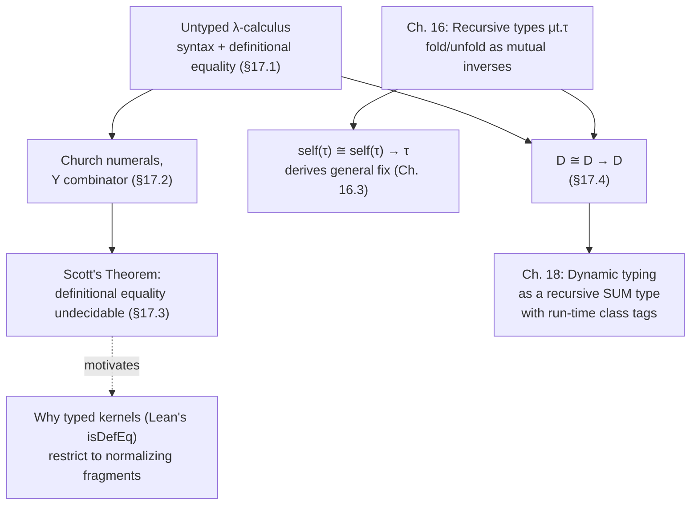

# Dynamic Types and the Untyped Lambda Calculus

[[book-guidelines|↩ Back to guidelines]]

## The problem: is "untyped" actually a thing?

Every language feature we've studied so far in Harper's framework has come with a *[[Symbols-and-Dynamic-Binding#Statics|statics]]* (a typing discipline telling you which expressions are well-formed) and a *[[Exceptions#Dynamics|dynamics]]* (how they execute), bound together by [[Type-Safety|type safety]]. So what do we do with a language like the untyped $\lambda$-calculus, which by name seems to reject the whole premise — no typing judgment at all, just terms and reduction?

Harper's answer is that this framing is a category error. **"Untyped" languages are not languages without types — they are languages with exactly one type.** Not zero types: one. Every value belongs to that single type, and every operation is implicitly total over it (or fails at run time trying). This chapter's payoff, delivered explicitly in §17.4, is that the untyped $\lambda$-calculus embeds *faithfully* into a typed language once you have recursive types (Chapter 16's $\mu t.\tau$), because the single type in question is $D \cong D \to D$ — a type of "things that are also functions on themselves." What looks like the absence of a type system is really type theory pushed to its most extreme, degenerate case: uni-typing.

This reframing matters for more than terminology. It means everything you already know about statics/dynamics/[[Dynamic-Classification#Safety|safety]] still applies to "untyped" languages — they just have a boring, single-case statics. And it sets up Chapter 18's treatment of *dynamically typed* languages as a generalization: instead of one recursive type, you tag values with a few classes (numbers, functions, ...) inside one big recursive sum type, and "run-time type errors" are just a static type system's absence, worn as a feature.

## 17.1 — The calculus itself, and why definitional equality (not a transition system)

**Syntax.** $L\{\lambda\}$ has three expression forms:

$$
u ::= x \mid \lambda(x.u) \mid \mathrm{ap}(u_1; u_2)
$$

written concretely as $x$, $\lambda(x)\,u$, $u_1(u_2)$. That's the entire language — no numbers, no conditionals, no primitives of any kind. Every computation you want to express, you build out of variables, abstraction, and application alone.

**Well-formedness** is a hypothetical judgment $\Gamma \vdash u\ \mathsf{ok}$ (rules 17.1a–c) — pure scoping, nothing about types, because there's exactly one "type" and it's not worth naming in the judgment.

The interesting design choice is in the *dynamics*. Rather than a small-step transition system $u \mapsto u'$ (the pattern used everywhere else in the book), Harper gives $L\{\lambda\}$ an **equational** dynamics: a judgment $\Gamma \vdash u \equiv u'$ of *definitional equality*, closed under reflexivity, symmetry, transitivity, congruence for application and abstraction (17.2a–e), and crucially:

$$
\Gamma, x\,\mathsf{ok} \vdash e_2\,\mathsf{ok} \qquad \Gamma \vdash e_1\,\mathsf{ok}
\over
\Gamma \vdash \mathrm{ap}(\lambda(x.e_2); e_1) \equiv [e_1/x]e_2
$$

This is $\beta$-reduction, but stated as an equation you can apply in either direction, anywhere a congruence rule lets you reach it — not as a directed evaluation step. **[[Control-Stacks-and-Abstract-Machines#What breaks without this|What breaks without this]] choice:** if you tried to give $L\{\lambda\}$ an ordinary transition system instead, you'd have to commit to an evaluation *order* (call-by-value? call-by-name? leftmost-outermost?) before you could even state what a "value" is, since unlike typed PCF there's no static guarantee that reduction terminates or that non-function values don't get applied. Definitional equality sidesteps that: it just says which terms *denote the same thing*, agnostic to strategy, and — as we'll see in §17.3 — this is exactly the relation whose decidability is at stake. (This is precisely the object-level analogue of a proof assistant's `isDefEq`: a kernel doesn't ask "does this term evaluate," it asks "are these two terms interchangeable," and picks a normalization/matching strategy internally. Lean's `whnf`-driven definitional equality check is the typed, terminating cousin of exactly this judgment.)

**Rust [[Plotkins-PCF-and-Partial-Computation#Grounding|grounding]].** There's no faithful Rust encoding of untyped $\beta$-equality at the value level (Rust's type system won't let you write a genuinely self-applicable function without going through `dyn`/trait objects, which is precisely the point of §17.4). But the *shape* of the syntax — three variants, one of them binding — is exactly a small AST enum:

```rust
enum Expr {
    Var(String),
    Lam(String, Box<Expr>),
    App(Box<Expr>, Box<Expr>),
}
```

A definitional-equality checker over this type is a decision procedure you could try to write — and Scott's theorem (§17.3) is precisely the theorem saying that procedure cannot exist in general.

## 17.2 — Definability: the calculus is secretly PCF

Harper's goal here is to show $L\{\lambda\}$ is at least as expressive as PCF (Chapter 10) by encoding PCF's naturals, arithmetic, case analysis, and recursion as pure $\lambda$-terms. This is where "untyped" earns its Turing-completeness bona fides, and it's the chapter's most hands-on section.

**Church numerals.** A natural number $n$ is represented as *the function that applies its second argument $n$ times to its first*:

$$
\underline{0} \triangleq \lambda(b)\,\lambda(s)\, b \qquad\qquad \underline{n+1} \triangleq \lambda(b)\,\lambda(s)\, s(\underline{n}(b)(s))
$$

so that $\underline{n}(u_1)(u_2) \equiv u_2(\cdots(u_2(u_1))\cdots)$, $n$-fold. **The intuitive point, before the symbols:** a number isn't a "thing" in the untyped calculus, it's a *recipe for iteration* — "do this $n$ times." That's a genuinely different ontology from "5 is the successor of the successor of..." and it's the reason `fold`/`reduce`-shaped code feels so natural once you've internalized Church numerals: a Church numeral literally *is* a fold operator baked into data.

```python
# Church numeral as a Python closure: literally "apply s to b, n times"
def church(n):
    return lambda b: lambda s: (lambda acc: [acc := s(acc) for _ in range(n)] and acc or acc)(b) if n else b
# cleaner: numerals are folds
zero = lambda b: lambda s: b
def succ(n):
    return lambda b: lambda s: s(n(b)(s))
```

Successor, addition, and multiplication (17.4–17.6) all reduce to composing this iteration:

$$
\mathrm{succ} \triangleq \lambda(x)\,\lambda(b)\,\lambda(s)\, s(x(b)(s)) \qquad
\mathrm{plus} \triangleq \lambda(x)\,\lambda(y)\, y(x)(\mathrm{succ}) \qquad
\mathrm{times} \triangleq \lambda(x)\,\lambda(y)\, y(\underline{0})(\mathrm{plus}(x))
$$

Note the pattern: $\mathrm{plus}(x)(y)$ is "iterate $\mathrm{succ}$, $y$ times, starting from $x$" — addition *is* repeated succession, made literal by the encoding, not just a metaphor for it.

**Predecessor — the genuinely hard part.** Successor composes forward trivially; predecessor requires *undoing* a fold, and Church numerals give you no way to peek at $n-1$ from $n$ directly. Harper's fix, the "shift register" trick: maintain a running pair $(n{-}1, n)$, and at each iteration step shift left and increment: $(n{-}1,n) \mapsto (n, n{+}1)$. Starting from $(0,0)$ (which encodes "predecessor of 0 is 0" directly into the base case), after $n$ iterations you're holding $(n{-}1, n)$, and predecessor just projects the first component. This needs Church-encoded pairs first:

$$
\langle u_1,u_2\rangle \triangleq \lambda(f)\, f(u_1)(u_2) \qquad u\cdot l \triangleq u(\lambda(x)\lambda(y)\,x) \qquad u\cdot r \triangleq u(\lambda(x)\lambda(y)\,y)
$$

then

$$
u_p' \triangleq \lambda(x)\, x(\langle \underline0,\underline0\rangle)(\lambda(y)\,\langle y\cdot r,\ \mathrm{succ}(y\cdot r)\rangle) \qquad\qquad u_p \triangleq \lambda(x)\, u_p'(x)\cdot l
$$

**What breaks without this trick:** if you tried to compute predecessor by "structural recursion on the numeral," you'd need to pattern-match on whether $n$ is zero or a successor — but a Church numeral *isn't* a data structure you can inspect, it's a function you can only *call*. The shift-register construction is the general technique for extracting "the previous state" out of an iterator that only exposes "apply this many times," and it's the same trick you reach for whenever you need a stateful fold's history rather than just its final accumulator — e.g. implementing a two-pointer / lag window purely via `fold` in Rust:

```rust
// Same shift-register idea: iterate n times, carrying (prev, cur)
fn church_pred(n: u64) -> u64 {
    (0..n).fold((0u64, 0u64), |(_prev, cur), _| (cur, cur + 1)).0
}
```

Finally, `ifz(u; u₀; x.u₁)` — case analysis on zero-vs-successor — is definable as $u(u_0)(\lambda(\_)\,[u_p(u)/x]u_1)$: a Church numeral applied to a "zero branch" and a "step function" *is* case analysis, because $\underline 0$ ignores its step argument entirely while $\underline{n+1}$ invokes it once.

## 17.2 continued — The Y combinator: recursion from self-application alone

PCF's last missing piece is general recursion, `fix`. The untyped calculus has no primitive `fix` — but it doesn't need one, because self-application is already expressible, and that turns out to be exactly enough.

$$
Y \triangleq \lambda(F)\, (\lambda(f)\, F(f(f)))\,(\lambda(f)\, F(f(f)))
$$

with the defining property $Y(F) \equiv F(Y(F))$ — $Y(F)$ is a fixed point of $F$, for *any* $F$.

**Before the symbols — why this should exist at all.** Think about what a recursive function needs: a way to call itself. In a typed language with `fix`, that's built in as a primitive: `fix[τ](x.e)` unrolls to `[fix[τ](x.e)/x]e`, substituting the whole recursive expression for its own name inside its body. Harper's derivation shows this primitive was never load-bearing — it's *derivable* from nothing but application, once you allow a function to be handed *itself* as an argument:

1. Take the function $F$ you want a fixed point of, where normally $F$ would take "myself" as an implicit first argument (call it `this`/`self` convention).
2. Define $F' \triangleq \lambda(f)\, F(f(f))$ — this is $F$ with the "call myself" convention made explicit: instead of assuming $f$ already denotes the whole recursive function, $F'$ arranges that whenever $f$ is applied to itself, $f(f)$, you get back the thing $F$ actually wants to recurse on.
3. Apply $F'$ to itself: $F'(F') \equiv F(F'(F'))$. Unfold the definition of $F'$ once on the left, and the equation falls out by pure $\beta$-reduction — no cleverness needed once $F'$ is in hand.
4. Since nothing here was specific to a particular $F$, abstract over it: $Y \triangleq \lambda(F)\, F'(F')$, i.e. exactly the formula above.

**What breaks without self-application:** in a language where a function could never be applied to itself (e.g. a stratified typed calculus without recursive types — see the isomorphism $D \cong D \to D$ in §17.4), $Y$ cannot be typed, and this is not an accident of notation — it's the same underlying fact as "$\mu t. t \to t$ has no set-theoretic model," discussed in Chapter 16. $Y$ is the untyped calculus's proof, by construction, that unrestricted self-application gives you unbounded recursion for free — which is also exactly why it's dangerous enough to require a recursive type as its typed home.

```rust
// Rust *can't* type Y directly (no infinite type F: F -> F without indirection),
// but the self-application idea is exactly what a `fix`-style combinator via
// explicit recursion boxes captures:
fn fix<A, B>(f: impl Fn(&dyn Fn(A) -> B, A) -> B) -> impl Fn(A) -> B { /* ... */ }
// the `&dyn Fn` is doing the job D -> D does in §17.4: erasing the type
// so that self-application type-checks at all.
```

```lean
-- Lean has no untyped Y either, for the same reason — but its own `WellFoundedRecursion`
-- / structural `fix` is precisely the typed replacement: recursion justified by a
-- termination measure instead of by unchecked self-application.
```

## 17.3 — Scott's theorem: definitional equality is undecidable

This is the chapter's sharpest result, and it's worth sitting with the intuition before the machinery: **the untyped calculus is so expressive that it can encode its own would-be equality-checker, and diagonalize against it.** This is the same move as the halting problem, dressed in $\lambda$-terms instead of Turing machines — and it's the reason a general-purpose "does term $u$ equal term $u'$" checker is impossible for *this* calculus (unlike, say, Lean's `isDefEq`, which is decidable precisely *because* Lean's typed terms are normalizing).

**Setup.** Call a property $A$ of untyped terms *behavioral* if it respects definitional equality: $u \equiv u' \Rightarrow (A\,u \Leftrightarrow A\,u')$. Call two properties $A_0, A_1$ *inseparable* if no decidable property $B$ can consistently classify every term satisfying $A_0$ as $B$ and every term satisfying $A_1$ as not-$B$.

**The two-lemma proof:**

- **Lemma 17.1 (self-representation / a quoting trick).** For any untyped term $u$, there's a $v$ such that $u(\ulcorner v\urcorner) \equiv v$ — where $\ulcorner v \urcorner$ is $v$'s Gödel number, Church-encoded. This is a direct descendant of the $Y$ construction: define $w \triangleq \lambda(x)\, u(\mathrm{ap}(x)(\mathrm{nm}(x)))$ and $v \triangleq w(\ulcorner w\urcorner)$; unwinding $v = w(\ulcorner w \urcorner) \equiv u(\ulcorner w(\ulcorner w\urcorner)\urcorner) \equiv u(\ulcorner v \urcorner)$ gives exactly the needed equation. Intuitively: *any* untyped function $u$ can be handed "a term that denotes its own eventual output" — the calculus is rich enough to build quines against an arbitrary target function.
- **Lemma 17.2 (no separator exists).** If $A_0, A_1$ are non-trivial behavioral properties, there's no term $w$ that decides membership: $w(\ulcorner u\urcorner) \equiv 0$ whenever $A_0\,u$ and $\equiv 1$ whenever $A_1\,u$. *Proof idea:* suppose $w$ existed. Build $v \triangleq \lambda(x)\, \mathrm{ifz}(w(x); u_1; \_.u_0)$ — a term that, given (a representation of) a term, asks $w$ what class it's in and then *deliberately returns a witness of the opposite class*. By Lemma 17.1, find $t$ with $v(\ulcorner t\urcorner) \equiv t$. Now check both cases: if $w(\ulcorner t\urcorner) \equiv 0$ then $t \equiv v(\ulcorner t \urcorner) \equiv u_1$, so (behaviorality) $A_1\,t$, so (by $w$'s defining property) $w(\ulcorner t\urcorner) \equiv 1$ — contradiction. The other case mirrors it. This is a **fixed-point-powered diagonal argument**: $t$ is engineered, via Lemma 17.1, to be exactly the term that makes $w$ contradict its own classification of $t$.
- **Corollary 17.3.** Definitional equality itself is undecidable: fix any $u$, and let $A_0 \triangleq (\cdot \equiv u)$, $A_1 \triangleq \neg(\cdot \equiv u)$ — these are non-trivial and behavioral, hence inseparable by Lemma 17.2, hence there is no algorithm deciding $u' \equiv u$ in general.

**Why this matters for the elaborator/verifier project.** This is precisely the boundary that motivates *typed* definitional equality in the first place. A proof assistant's kernel never attempts to decide equality for an untyped, Turing-complete term language — it restricts to a normalizing, typed fragment (strong normalization, from the typing discipline) specifically so that `isDefEq` *can* terminate by reducing both sides to normal form and comparing. Scott's theorem is the negative result explaining *why* type systems that support general recursion (PCF's `fix`, or Rust's general loops) must give up decidable term-equality entirely, while systems aiming for decidable checking (Lean's kernel, a Hoare-triple verifier restricted to a terminating core language) must correspondingly give up unrestricted recursion, accepting only well-founded / structurally-decreasing definitions. There is no free lunch here — it's the same tradeoff Gödel numbering and diagonalization impose everywhere self-reference meets exhaustive decision procedures.

## 17.4 — Untyped means uni-typed: the embedding

Now the payoff. Harper makes precise the claim from the introduction: $L\{\lambda\}$ embeds *faithfully* into a typed language with recursive types, $L\{+\times*\mu\}$, via a single recursive type

$$
D \triangleq \mu t.\, t \to t
$$

A value of type $D$ is $\mathrm{fold}(e)$ for some $e : D \to D$ — i.e., "$D$ is exactly the type of functions from $D$ to itself," which is precisely the isomorphism from Chapter 16:

$$
D \cong D \to D
$$

impossible as a *set*-theoretic equation (no set can be isomorphic to its own function space by a cardinality argument — Cantor's theorem), but perfectly realizable as a *type*, because $\mathrm{fold}$/$\mathrm{unfold}$ don't need to be honest bijections of sets — they're operationally-witnessed coercions between a recursive type and its one-step unrolling, and that's all recursive types ever promised (see [[Recursive-Types]]).

**The translation** $(-)^\dagger : L\{\lambda\} \to L\{+\times*\mu\}$:

$$
x^\dagger \triangleq x \qquad\qquad (\lambda(x)\,u)^\dagger \triangleq \mathrm{fold}(\lambda(x{:}D)\,u^\dagger) \qquad\qquad (u_1(u_2))^\dagger \triangleq \mathrm{unfold}(u_1^\dagger)(u_2^\dagger)
$$

Every untyped abstraction becomes a *value* of type $D$ (via `fold`); every application first *unrolls* the function position back to its $D \to D$ form before applying it. Check that this respects $\beta$-reduction:

$$
(\lambda(x)\,u_1)(u_2)^\dagger = \mathrm{unfold}(\mathrm{fold}(\lambda(x{:}D)\,u_1^\dagger))(u_2^\dagger) \equiv \lambda(x{:}D)\,u_1^\dagger(u_2^\dagger) \equiv [u_2^\dagger/x]u_1^\dagger = ([u_2/x]u_1)^\dagger
$$

The middle equivalence uses `unfold(fold(e)) ≡ e` (the fold/unfold isomorphism), and the whole chain shows the embedding *commutes with substitution* — meaning translated terms reduce in lockstep with their untyped originals. That's what "faithful" means here: not merely "you can write an interpreter" (which is trivially true of any Turing-complete host language) but "the recursive-type structure of the target *is itself* the untyped calculus's semantics," with no interpretation layer in between.

**What this buys you, and what it costs.** Reading the isomorphism the other direction: an "untyped" language isn't one that discarded typing, it's one that collapsed every type in sight down into a single recursive sum/function type and pushed all the discrimination that used to be static (which case am I in?) into run-time `fold`/`unfold` coercions. Static checking becomes trivial (there's only one type to check against!) at the cost of paying dynamic overhead on every operation to coerce values in and out of $D$. Chapter 18 generalizes this one step further: instead of $D \cong D \to D$ (functions only), a dynamically-typed language uses a recursive **sum** type with one summand per run-time "class" (numbers, functions, ...), and what looks like dynamic type-checking is exactly Chapter 18's `is num` / `isnt fun` judgments dispatching on which summand a value's tag names — i.e., ordinary static typing over a deliberately impoverished type structure.

```rust
// The D ≅ D -> D isomorphism, made literal in Rust via an enum + Box indirection
// (Rust needs the Box because it can't write an infinite/self-referential type directly —
// exactly the role `fold`/`unfold`/μ play in the book's formalism):
enum D {
    Fun(Box<dyn Fn(D) -> D>),
}
fn unroll(d: D) -> Box<dyn Fn(D) -> D> { let D::Fun(f) = d; f }
fn roll(f: impl Fn(D) -> D + 'static) -> D { D::Fun(Box::new(f)) }
// Church-encoded λ(x) u  translates to:  roll(move |x| { /* u using unroll(f)(arg) for application */ })
```

```lean
-- Lean's kernel actually forbids writing `D := D → D` directly (no infinite regress in
-- the type former), which is exactly the "impossible set-theoretically" fact Harper cites.
-- The typed workaround is an inductive wrapper, structurally identical to `fold`/`unfold`:
inductive D where
  | mk : (D → D) → D

def unroll : D → (D → D)
  | D.mk f => f
```

## Where this leads



This chapter is the hinge between the purely static world the book has built up through Chapter 16 and the "dynamic" world of Chapter 18: it shows that the two are not in opposition, just different points on the same static-typing spectrum. Two threads worth carrying forward:

- **Scott's theorem is the load-bearing reason typed kernels restrict recursion.** If you're building a checker/verifier with an embedded prover, the moment you allow unrestricted general recursion in the language you're checking definitional equality *over*, Scott's theorem guarantees your equality-checker cannot be a total algorithm — you either accept incompleteness (timeouts/heuristics), or restrict to a normalizing core (structural recursion, fuel-bounded reduction, or a termination checker) the way Lean's kernel does. This is worth designing for explicitly rather than discovering by way of a hung typechecker.
- **The Y combinator's derivation (self-application, not a primitive) is the cleanest illustration in the book of how a checker's "modes" matter.** Everything in §17.2's `fix`-from-self-application story is really about a bidirectional discipline in disguise: $F'$ takes `f` in an "assume this is me, recursively" mode and *checks* that assumption is honored by construction — the same shape of reasoning a unifier uses when it assumes a metavariable's eventual solution to check the equations that pin it down.
