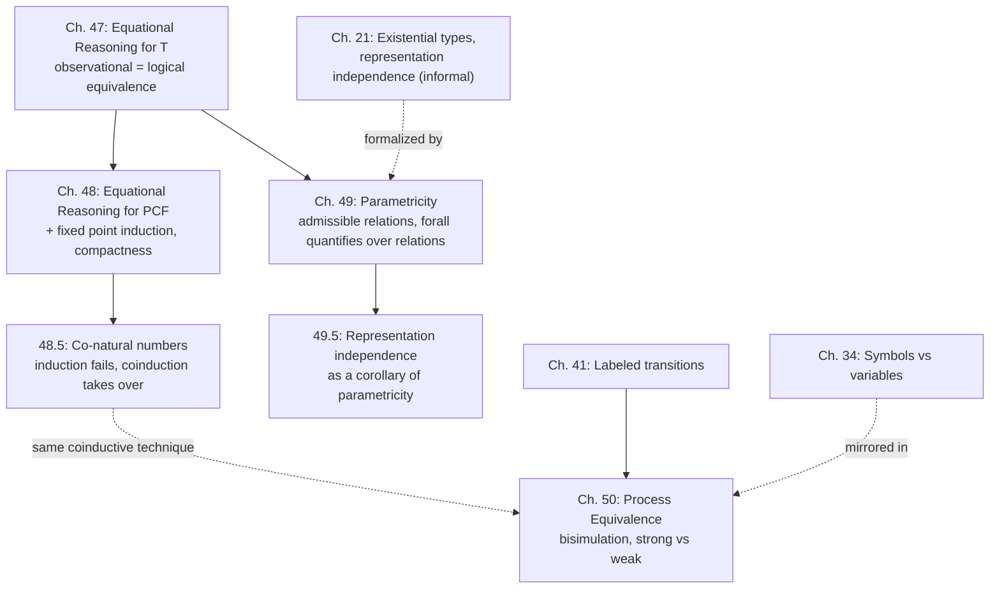

# Equational Reasoning

[[book-guidelines|↩ Back to guidelines]]

## The problem: "equal" needs a definition, and the obvious one is useless

$\lambda(x{:}\mathtt{nat})\lambda(y{:}\mathtt{nat})\,\mathtt{plus}(x)(y)$ and $\lambda(x{:}\mathtt{nat})\lambda(y{:}\mathtt{nat})\,\mathtt{plus}(y)(x)$ compute the same function — addition is commutative — but they are **not** definitionally equivalent: no sequence of symbolic reduction steps turns one into the other, because one recurses on $x$ and the other on $y$. They're different *algorithms* that happen to always agree. So what does it mean, precisely, for two programs to be "the same"? This chapter-quartet answers that question three times, in three settings of increasing difficulty (total functions, partial/recursive functions, polymorphic functions), plus once more for an entirely different kind of "sameness" (interacting processes, where there's no final answer to compare at all).

**What breaks without a rigorous answer:** without a precise notion of program equivalence, "optimization," "refactoring," and "representation independence" (Chapter 21's central promise) are all informal folklore — you can *believe* two implementations behave the same, but you can't *prove* it, and you have no systematic way to derive new valid equalities (like commutativity of `plus`) from the ones the type system already guarantees.

## Chapter 47: Equational reasoning for T — the baseline construction

### 47.1 Observational equivalence — equal means "no experiment can tell them apart"

The starting definition is almost a tautology, deliberately: two expressions are equal *iff no experiment distinguishes them*. Making this precise requires fixing what an experiment is. A **complete program** is a closed expression of type $\mathtt{nat}$ — the observable outcome is the numeral it evaluates to. An **expression context** $C$ is an expression with a hole $\circ$ (which may sit inside a binder's scope — variables exposed to the hole are deliberately subject to *capture* on replacement, which is exactly why "replacement," $C\{e\}$, is a different operation from substitution). A **program context** is a context of type $\mathtt{nat}$ with no free variables once the hole is filled correctly — i.e., a complete program with a hole in it, representing "every possible way to embed $e$ into a full computation and observe the result."

$$e \simeq e' \iff \exists n.\ e \mapsto^* n \text{ and } e' \mapsto^* n \qquad \text{(Kleene equality, on complete programs)}$$
$$\Gamma \vdash e \cong e' : \tau \iff C\{e\} \simeq C\{e'\} \text{ for every program context } C \tag{observational equivalence}$$

This is the honest, unavoidably universally-quantified definition: $e$ and $e'$ are the same *precisely when* dropping either one into *any* complete program yields the same observable outcome. **Theorem 47.6** proves observational equivalence is **the coarsest consistent congruence** — the *largest* equivalence relation that (a) respects every context (congruence) and (b) agrees with Kleene equality on complete programs (consistency). "Coarsest" matters practically: it licenses **proof by coinduction** — to prove $e \cong e'$, you don't need to check every context directly; you need only exhibit *some* consistent congruence relating them, and observational equivalence, being the largest such relation, automatically contains it.

**[[Control-Stacks-and-Abstract-Machines#What breaks without this|What breaks without this]] coarsest-relation framing:** without it, proving any nontrivial equivalence requires directly reasoning about infinitely many program contexts — an intractable, per-context argument. Recognizing observational equivalence as *characterized* by the coinduction principle turns an unbounded universal quantification into a single, checkable relation-exhibition problem.

### 47.2 Logical equivalence — using types to skip most of that quantification

Even with coinduction, exhibiting a consistent congruence directly is hard. The chapter's real engine is **logical equivalence**, defined *by induction on type structure* rather than by quantifying over contexts:

$$e \sim_{\mathtt{nat}} e' \iff e \simeq e' \qquad\qquad e \sim_{\tau_1\to\tau_2} e' \iff \forall e_1\sim_{\tau_1}e_1'.\ e(e_1) \sim_{\tau_2} e'(e_1')$$

The intuition Harper gives is worth internalizing on its own: uses of a value split into **passive** uses (pass it around, store it, return it — never actually inspect it) and **active** uses (apply the elimination form for its type). Only active uses can ever distinguish two values, so it suffices to define equivalence *type-directionally*, checking only the elimination forms — at function type, that means "give equal results on all equal arguments," recursively.

### 47.3 The coincidence theorem — why this shortcut is actually correct

The heart of the chapter is proving **logical and observational equivalence coincide** — the payoff being that you can now prove observational equalities (which need arbitrary-context reasoning) by structural induction on types (which doesn't). The proof chain is a clean two-directional sandwich:

- **Reflexivity** ($\Gamma \vdash e : \tau \implies \Gamma \vdash e \sim e : \tau$, Theorem 47.13) is proved by induction on typing derivations — the interesting case is primitive recursion, handled by ordinary mathematical induction on the natural number the scrutinee evaluates to.
- **Congruence** (Lemma 47.16) shows logical equivalence respects every context, by induction on the context's typing derivation.
- Since logical equivalence is **consistent** (by definition, it's Kleene equality at $\mathtt{nat}$) and **congruent** (just shown), it's a *consistent congruence* — so by Theorem 47.6's coarsest-relation property, **logical equivalence is contained in observational equivalence** (Theorem 47.17).
- The reverse containment (Lemma 47.19, Theorem 47.20) goes through reflexivity again: if $e \cong e'$, apply congruence of observational equivalence to peel back function types one argument at a time, landing back at $\mathtt{nat}$ where the two notions trivially agree.

**Corollary 47.21** nails down the payoff: **$\Gamma \vdash e \cong e' : \tau$ iff $\Gamma \vdash e \sim e' : \tau$** — the two notions are literally the same relation, one defined by an unbounded universal quantification over contexts, the other by finite structural induction on a type. This is a genuinely load-bearing simplification, not a curiosity: it converts "prove this holds for every possible way of using $e$" into "prove this holds by looking at $\tau$'s shape," a mechanically tractable proof technique.

**[[Plotkins-PCF-and-Partial-Computation#Grounding|Grounding]] (Lean) — this is exactly how you'd prove program equivalences by induction on a syntactic type, and it's the discipline behind Lean's `decide`/`simp`-driven equational reasoning at base types plus funext-style reasoning at function types:**

```lean
-- logical equivalence, mirrored directly as an inductive-on-type relation
def LogEquiv : (τ : Ty) → Expr τ → Expr τ → Prop
  | .nat, e, e' => KleeneEq e e'
  | .arr τ1 τ2, e, e' => ∀ e1 e1', LogEquiv τ1 e1 e1' → LogEquiv τ2 (e.app e1) (e'.app e1')
```

Harper's Theorem 47.17/47.20 is the meta-level guarantee that proving equivalence via this inductive definition is *sound and complete* with respect to the "no context can tell them apart" notion an elaborator or verifier would otherwise have to reason about directly and expensively.

### 47.4 Laws of equality — the payoff, cashed out as usable rules

With coincidence established, everyday reasoning principles fall out as *derived*, provable rules rather than assumed axioms: **symbolic evaluation** (definitional equivalence $\implies$ observational equivalence, so you can always reduce, for free), **extensionality at function type** (functions equal on all arguments are equal, Rule 47.9 — every function is observationally a $\lambda$), and the **induction law** — an equation with a free $\mathtt{nat}$ variable can be proved by ordinary mathematical induction on that variable (Rule 47.11). This last rule is precisely what proves `plus` is commutative — not by symbolic execution (which fails, as noted at the top), but by induction, licensed because logical equivalence at $\mathtt{nat}$ was *defined* to coincide with Kleene equality on numerals.

## Chapter 48: Equational reasoning for PCF — the same story, complicated by divergence

### The new wrinkle: general recursion breaks the easy proofs

$L\{\mathtt{nat}\ {*}\}$ (PCF) adds `fix`, hence possible nontermination. Kleene equality must be redefined biconditionally to handle divergence gracefully: $e \simeq e' \iff \forall n.\ e\mapsto^*n \iff e' \mapsto^* n$ — **two divergent programs are automatically Kleene-equal**, since neither ever reaches any numeral, so the biconditional holds vacuously. Logical equivalence gets a matching **strictness** property (Lemma 48.6): if $e,e'$ of the same type both diverge, $e\sim_\tau e'$, proved by structural induction exactly as before.

The genuinely new difficulty: **reflexivity** (the load-bearing lemma that makes the whole coincidence argument work) can no longer be proved by a straightforward structural induction, because `fix x:τ is e` doesn't have finite structure to induct on — it can unroll forever.

### 48.3–48.4 Fixed point induction and compactness — reasoning about infinite unrolling via finite approximations

The fix is **bounded recursion**: $\mathtt{fix}^0\ x{:}\tau\ \mathtt{is}\ e \triangleq \mathtt{fix}\ x{:}\tau\ \mathtt{is}\ x$ (divergent by construction — a black-hole-style stuck self-reference), $\mathtt{fix}^{m+1}\ x{:}\tau\ \mathtt{is}\ e \triangleq [\mathtt{fix}^m\ x{:}\tau\ \mathtt{is}\ e/x]e$ (unroll exactly $m$ times, then give up). This gives **fixed point induction** (Theorem 48.8): to prove $\mathtt{fix}\ x{:}\tau\ \mathtt{is}\ e \sim_\tau \mathtt{fix}\ x{:}\tau\ \mathtt{is}\ e'$, it suffices to prove the *bounded* versions equivalent **for every finite unrolling depth $m$** — turning one infinite-unrolling proof obligation into an infinite family of finite ones, each individually tractable by ordinary structural induction.

But this only works if a genuine computation can *always* be simulated by *some* finite unrolling depth — and that's **compactness** (Theorem 48.16), the technical core of the chapter: *any complete evaluation of a program only ever needs finitely many unrollings of any one `fix`*. Intuitively obvious (a finite computation can't complete infinitely many recursive calls), but Harper is explicit that it's "rather tricky to state and prove rigorously" — the proof works through the Chapter 27 stack machine, augmented with transitions for bounded recursion (48.6), and proceeds by induction on the machine's transition sequence to show any $m$-bound can be incrementally raised without disturbing the outcome (Lemma 48.15), hence some *sufficient* finite $m$ always exists (Corollary 48.17).

**What breaks without compactness:** fixed point induction would be *unsound* without it — you could prove all finite unrollings equivalent while the full, unbounded recursion diverges differently (or one side genuinely needs "infinitely much" unrolling to reveal a difference the finite approximations never show). Compactness is precisely the guarantee that finite approximation never silently loses information relevant to termination.

**[[Recursive-Types#Grounding|Grounding]] — this is exactly Kleene's fixed-point theorem / domain-theoretic continuity, made operational rather than denotational.** Where a domain-theoretic account would say "the least fixed point is the supremum of finite approximants, and continuous functions preserve suprema," Harper's compactness theorem says the *same thing* purely operationally: any terminating run only ever inspects a finite prefix of the (potentially infinite) unrolling. This is worth recognizing as the same idea wearing different clothes — one denotational, one operational — a useful bridge if the reader has encountered domain theory elsewhere.

### 48.5 Co-natural numbers — when induction itself becomes unsound, coinduction takes over

A lazily-evaluated successor makes $\mathtt{s}(e)$ a value *regardless* of whether $e$ is — admitting the "infinite number" $\omega = \mathtt{fix}\ x{:}\mathtt{nat}\ \mathtt{is}\ \mathtt{s}(x)$, an unbounded stack of successors. The type is renamed $\mathtt{conat}$ once this element is admitted, and — crucially — **mathematical induction over $\mathtt{conat}$ is simply invalid**: you can prove "every natural number is finite" by induction and yet $\omega$ is a genuine, well-typed inhabitant that is not finite. The fix is to flip the definitional stance entirely: logical equivalence at $\mathtt{conat}$ is defined **coinductively**, as the *weakest* relation satisfying the consistency conditions (matching outermost `z`/`s` structure, with `s`'s sub-components related by the *same* relation) rather than the *strongest* relation closed under some generating rules. **Proof by coinduction** replaces proof by induction: to show $e \sim_{\mathtt{conat}} e'$, exhibit *any* relation containing the pair and satisfying the consistency conditions — since logical equivalence is the *weakest* such relation, any witness relation is automatically contained in it.

**What breaks without switching to coinduction here:** trying to force an inductive definition onto a type with infinite elements either excludes $\omega$ from the relation entirely (unsound — $\omega \sim_{\mathtt{conat}} \omega$ should certainly hold) or requires infinite proof trees (not a valid inductive definition at all). Coinduction is the principled tool for exactly this situation — reasoning about potentially-infinite data by exhibiting *invariants preserved under one step of unfolding*, rather than well-founded structure.

## Chapter 49: Parametricity — types so strong they nearly determine the program

### 49.1–49.2 The overview, and why polymorphism needs its own answer type

With polymorphism, $\forall(t.t\to t)$ is a genuinely striking type: instantiate it at any $\tau$, and you get a $\tau\to\tau$ function that — because it *cannot depend on the choice of $\tau$* — has no way to do anything to its argument except return it. **The type alone forces it to be the identity.** Similarly $\forall(t.t)$ must be *empty* (no way to conjure a value of an arbitrary, unknown type from nothing). This is the informal content of **parametricity**: polymorphic types constrain programs so tightly that, often, the type essentially *is* the specification. But $L\{\to\forall\}$ has no closed base types — every type is a function type or a polymorphic type — so the observational-equivalence machinery needs an artificial answer type $\mathbf{2} = \{\mathtt{tt},\mathtt{ff}\}$ to serve as the observable outcome of a complete program, exactly analogous to $\mathtt{nat}$'s role in Chapters 47–48.

### 49.3 Parametric logical equivalence — relations between different types, not just equal ones

Here's the genuinely deep technical move, and it's worth pausing on why the obvious approach fails. You might try: "$e\sim_{\forall(t.\tau)}e'$ iff for every closed $\rho$, $e[\rho]\sim_{[\rho/t]\tau}e'[\rho]$" — but this hits two problems. **Technically**, under impredicativity $[\rho/t]\tau$ can be *larger* than $\forall(t.\tau)$ itself, breaking the induction-on-type-structure that made Chapter 47's definition well-founded. **Conceptually**, this definition is far too weak — it only ever compares $e[\rho]$ to $e'[\rho]$ *at the same instantiation*, which says nothing about the "genericity" that makes $\forall(t.t\to t)$ forced to be the identity.

The fix generalizes logical equivalence to be **relative to an admissible relation assignment**, not just a type: instead of asking "are these equal," ask "are these related by *any admissible relation $R$ between two, possibly different, closed types*":

$$
\begin{aligned}
e \sim_{t} e'\ [\eta{:}\delta\leftrightarrow\delta'] &\iff \eta(t)(e,e') \\
e \sim_{\forall(t.\tau)} e'\ [\eta{:}\delta\leftrightarrow\delta'] &\iff \forall \rho,\rho', R{:}\rho\leftrightarrow\rho'\ \text{admissible}.\ e[\rho]\sim_\tau e'[\rho']\ [\eta\otimes t{\mapsto}R : \delta\otimes t{\mapsto}\rho \leftrightarrow \delta'\otimes t{\mapsto}\rho']
\end{aligned}
$$

An **admissible relation** ($R:\rho\leftrightarrow\rho'$) is any relation respecting observational equivalence and closed under converse evaluation — a mild, purely semantic well-behavedness condition, not a restriction to relations of any particular *shape*. The genuinely striking part, which Harper flags explicitly as counterintuitive: quantifying over *literally every admissible relation between every pair of types* sounds like it should force logical equivalence to collapse to nothing — yet it doesn't. **The Parametricity Theorem (49.12)** — every well-typed expression is logically equivalent to itself, $\Delta;\Gamma\vdash e \sim e:\tau$ — is proved by ordinary rule induction on typing, and its content is exactly the formal version of the informal argument in §49.1: because a polymorphic function's *own* self-relatedness must hold *for every possible relation* the caller picks, the function is forced to behave uniformly across all types.

### 49.4–49.5 What parametricity buys you: forced identities, strong definability, representation independence — for free

- **Theorem 49.20:** every $e:\forall(t.t\to t)$ is observationally equal to the polymorphic identity — the informal §49.1 argument, now a theorem, proved by picking a cleverly-constructed admissible relation $S$ tailored to the specific argument in question.
- **§49.4, strong definability:** Chapter 20 showed products, sums, and naturals are *definable* in $L\{\to\forall\}$ via Church encodings — but only in the weak sense that the encoded operations *compute the right answers*. Parametricity upgrades this to **strong definability**: e.g. every $e:\tau_1\times\tau_2$ (Church-encoded) is observationally *equal to* $\langle e{\cdot}l, e{\cdot}r\rangle$ (Lemma 49.21) — the encoding isn't merely operationally correct, it's *the only shape a value of that type can have*, up to observational equivalence. Similarly, the Church-encoded iterator is *unique* — any function satisfying the same recursive equations is forced to coincide with it (the "unicity of iterators" property).
- **§49.5, representation independence, revisited:** this closes a loop opened all the way back in [[Data-Abstraction-and-Existential-Types|Chapter 21]] and touched on again informally throughout [[Modularity-and-Linking|Chapter 45]]'s sealing discussion. Recall existentials are *definable* in $L\{\to\forall\}$ as $\exists t.\tau \triangleq \forall(t.\tau\to\tau_2)$-shaped client code. Because that client is *itself polymorphic*, it automatically satisfies the parametricity theorem — and instantiating that at an *admissible relation* $R$ between two representation types (rather than requiring the representations to be literally equal) is *exactly* the formal statement of "the client cannot distinguish two similar implementations." **What was assumed and argued informally in Chapter 21 — that a queue-as-list and a queue-as-two-lists are interchangeable because a suitable relation $R$ between them is preserved by every operation — is now a direct corollary of the parametricity theorem, not a separate ad hoc argument per abstract type.** This is a genuinely satisfying payoff: one theorem, applied uniformly, replaces what would otherwise be a bespoke bisimulation argument for every individual abstraction.

**What breaks without parametricity:** without this theorem, representation independence for existential types would have to be re-proved, essentially from scratch, for every single abstract data type a programmer defines — there'd be no general principle guaranteeing it, only case-by-case luck. Parametricity converts "representation independence probably holds because the interface only exposes certain operations" into "representation independence is a theorem, provable once, for *any* well-typed polymorphic client."

## Chapter 50: Process equivalence — when there's no final answer to compare at all

### The problem: observational equivalence's whole apparatus assumes a "complete program" with an outcome

Chapters 47–49 all lean on the same scaffold: a complete program, an observable answer type, Kleene equality on that answer. **A process has none of these.** A running server doesn't "finish" with a value — its entire nature is *ongoing potential for interaction*. Equivalence for processes has to be based on **interaction potential**, not outcomes — precisely the shift [[Concurrency-and-Process-Calculus|Chapter 41]] made when it introduced labeled transitions as first-class citizens of the semantics, not mere bookkeeping.

### 50.1–50.2 Bisimulation — equivalence as mutual simulation, step by step

The chapter consolidates the process calculus of Chapters 41–42 (channels as dynamic classes, broadcast communication) and defines **(strong) bisimulation**: a pair of relations $(\mathcal{P},\mathcal{E})$ on processes and events such that whenever $P\,\mathcal{P}_\Sigma\,Q$, *every* labeled step either process can take is matched by a corresponding step of the other, landing back in $\mathcal{P}$ (and symmetrically for event relations). **(Strong) equivalence**, $\approx$, is the *union of all bisimulations* — and Lemma 50.3 shows it is itself a bisimulation, which is what makes coinductive proof work here too: to show $P\approx Q$, exhibit *any* bisimulation relating them.

The proof technique the book highlights (§50.2) is worth internalizing as a pattern, not just a proof trick: to show $P\approx Q$, it often suffices to define $\mathcal{P} = {\approx}\cup\mathcal{P}_0$ for some seed relation $\mathcal{P}_0$ containing the pair of interest, then show *this expanded relation* is a bisimulation — a step of reasoning that gets to **assume** $\approx$ itself while proving the expansion closed. Harper is refreshingly candid about what this is: "this proof method amounts to assuming what we are trying to prove and showing that this assumption is tenable... 'circular reasoning' is a perfectly valid method of proof" — coinduction's defining, initially-uncomfortable feature, stated as plainly as possible.

**A subtle and important asymmetry (Lemmas 50.5 vs. 50.6):** proving congruence for a *variable*-binding construct (`? (x.P)`, Lemma 50.5) requires quantifying over **all substitutions** for $x$ — because a variable's meaning *is* given by substitution. Proving congruence for a *channel/class*-binding construct ($\nu a{\sim}\tau.P$, Lemma 50.6) instead relates the bodies **schematically in the fresh name $a$**, never substituting one class name for another. The book is explicit about why this distinction is load-bearing, not a technicality: *if* you allowed substituting class names for each other, a freshly-allocated class would no longer be reliably "new" within its own scope — you could always identify it with some pre-existing class by substitution, defeating the entire point of [[Dynamic-Classification|dynamic classification]]'s unforgeability. This is the equivalence-theory mirror image of the [[Syntactic-Objects-and-Binding|Chapter 1]] distinction between variables (meaning via substitution) and symbols/names (meaning via disequality) — here showing up as *which proof technique is even sound* for each binder.

### 50.3 Weak equivalence — silent steps shouldn't count the same as real interaction

Strong equivalence treats *every* action symmetrically, including the silent ($\varepsilon$) action — but a silent step is just "a computation happened," not an interaction with the environment, and counting internal computation steps as observationally significant would make `proc(ret 3+4)` and `proc(ret (1+2)+(2+2))` inequivalent purely because one takes more reduction steps — an absurd distinction nobody actually cares about. **Weak bisimulation** relaxes the matching condition: a genuine ($\alpha\ne\varepsilon$) action need only be matched *up to any number of silent steps before and after* it, and a silent step need only be matched by *zero or more* silent steps. **Weak equivalence**, $\sim$, is the resulting coarser relation — genuinely coarser, because it identifies processes that strong equivalence would keep apart purely due to differing internal step counts, while still respecting every *externally observable* interaction exactly.

**What breaks without the weak/strong distinction:** using only strong equivalence throughout would make *every* internal implementation detail — how many silent computation steps something takes to decide what to do next — observationally significant, which is precisely the wrong granularity for reasoning about optimization: you'd be unable to say "these two servers behave the same to any client," only "these two servers execute identical numbers of internal steps," a far less useful and far more fragile guarantee.

## Synthesis: where this sits in the book, and what it feeds



The four chapters trace a single throughline: **define "equal" by induction/coinduction on structure (type structure, or process-transition structure), prove it coincides with the "no experiment tells them apart" definition, then harvest concrete, previously-informal claims as theorems** — commutativity of `plus` (Ch. 47), soundness of unrolling a recursive definition to a finite depth (Ch. 48), and representation independence for abstract types (Ch. 49, closing the loop from Chapter 21 and touched again in [[Modularity-and-Linking|Chapter 45]]). Chapter 50 shows the *same* coinductive methodology generalizes cleanly to a setting (interacting processes) where there's no final value to fall back on at all — proof that the technique, not just the specific relations, is the durable takeaway.

**Bearing on the stated learning goals:** this is arguably the single most directly load-bearing chapter-group in the book for both stated targets. For the **Rust verifier**: the observational/logical-equivalence coincidence proof (Ch. 47–48) is the exact template for proving a program-logic's derived equational rules sound relative to its operational semantics — and fixed point induction plus compactness (§48.3–48.4) is precisely the technique needed to reason about `fix`/recursive-function verification conditions by finite unrolling, which is unavoidable once loops or recursion enter a Hoare-triple system. For the **Lean-style elaborator**: parametricity (Ch. 49) is the formal foundation for exactly the kind of "this term's type alone tells you what it must do" reasoning that makes metavariable resolution tractable — an elaborator implicitly relies on parametricity-style reasoning whenever it assumes a polymorphic function *can't* branch on which type it was instantiated at. The **admissible relation** machinery (§49.3) is also a direct model for how a unification engine should treat *equality up to a chosen relation* rather than only literal syntactic equality — the same shape of problem as deciding when two metavariable instantiations should be treated as interchangeable. And the strong/weak bisimulation distinction (Ch. 50) — matching real actions exactly while abstracting over "how many silent steps it took to get there" — is a reusable pattern for any verifier that needs to reason about a program's observable behavior independent of its internal step count, exactly the granularity a Hoare-triple's postcondition typically cares about.
