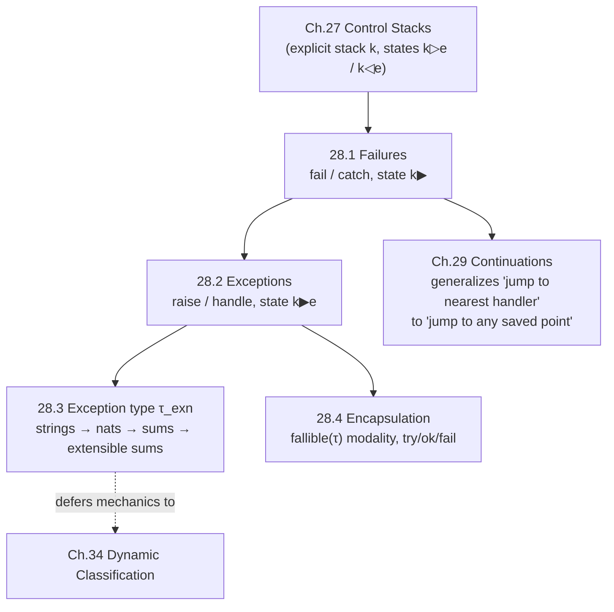

[[book-guidelines|↩ Back to guidelines]]

# Exceptions

## Why bother: what a language without exceptions can't say

Every language so far in this book has only two ways for evaluation to relate to a control stack: push a frame and keep going, or return a value up through the stack. That's already enough to define ordinary sequential computation, but it can't express something programmers need constantly: *give up on this computation and let something else decide what happens next*. If a division fails, or a file isn't found, the code deep inside a helper function has no way to say "abandon what I was doing, someone further up will know what to do about it" — except by threading a special "did it fail?" return value through every single caller by hand. That's the checked-error style: it works, but it pollutes every intermediate function's type and control flow with plumbing that has nothing to do with what that function is actually computing.

Harper's chapter builds the *non-local transfer of control* mechanism that avoids this, in three stages of increasing refinement:

1. **Failures** — an unconditional "give up," caught by the nearest enclosing handler, carrying no information.
2. **Exceptions** — failures generalized to carry a *value* of some fixed exception type, so a handler can discriminate between causes.
3. **Encapsulation** — a type-level modality that tracks, in the type system itself, which expressions can fail and which provably cannot — closing the gap left by ordinary typing rules, which say nothing about failure at all.

This chapter sits right after Chapter 27's control-stack machine, and it leans on that machine directly: everything here is stated as extra transitions on $\mathcal{K}\{\mathtt{nat} \rightharpoonup\}$-style states. It's also the direct ancestor of Chapter 29's [[Continuations|continuations]] — a continuation is what you get when you generalize "jump to the nearest handler" into "jump to *any* saved point," and stop discarding the stack you jump past.

## 28.1 Failures: the bare mechanism

### What breaks without it

Suppose you only have `catch`-like behavior implemented via ordinary conditionals: every fallible operation returns an `Option`, and every caller must pattern-match and re-propagate. This is *sound* but it means a function ten calls deep that wants to bail out has to get every single one of its ten callers to cooperate by checking and forwarding a sentinel value. Miss one check, and the error silently turns into nonsense data instead of aborting. A dedicated non-local jump removes that obligation: the intervening functions don't need to know anything about the possibility of failure at all.

### Syntax and statics

The grammar is minimal:

$$
\mathrm{Exp}\ e ::= \mathtt{fail} \mid \mathtt{catch}(e_1; e_2)
$$

`fail` aborts the current evaluation outright. `catch(e₁; e₂)` evaluates `e₁`, but if it fails, evaluates `e₂` instead.

The typing rules (28.1a, 28.1b) are:

$$
\dfrac{}{\Gamma \vdash \mathtt{fail} : \tau} \qquad (28.1\mathrm{a})
$$

$$
\dfrac{\Gamma \vdash e_1 : \tau \quad \Gamma \vdash e_2 : \tau}{\Gamma \vdash \mathtt{catch}(e_1; e_2) : \tau} \qquad (28.1\mathrm{b})
$$

`fail` can have *any* type — this is the same reasoning as an infinite loop or `panic!`/`unreachable!` in Rust: since `fail` never actually produces a value, there's no consistency requirement to violate by assigning it whatever type the context expects. `catch`'s two branches must agree on type because either one might be the one that ultimately determines the value.

### Dynamics via stack unwinding

This is the part that needs Chapter 27's machine. Recall states there had the shape $k \triangleright e$ (evaluate $e$ against stack $k$) and $k \triangleleft e$ (return value $e$ to stack $k$). Harper adds a third state form:

$$
k \blacktriangleright
$$

— "propagate a failure up the stack $k$," with no payload yet (that comes with exceptions in 28.2). The stack's frame grammar gains a new frame, $\mathtt{catch}(-; e_2)$, recording an installed handler.

The new [[Control-Stacks-and-Abstract-Machines#Transition rules|transition rules]] (28.2a–e):

$$
k \triangleright \mathtt{fail} \mapsto k \blacktriangleright \qquad (28.2\mathrm{a})
$$

$$
k \triangleright \mathtt{catch}(e_1; e_2) \mapsto k;\mathtt{catch}(-;e_2) \triangleright e_1 \qquad (28.2\mathrm{b})
$$

$$
k;\mathtt{catch}(-;e_2) \triangleleft v \mapsto k \triangleleft v \qquad (28.2\mathrm{c})
$$

$$
k;\mathtt{catch}(-;e_2) \blacktriangleright \mapsto k \triangleright e_2 \qquad (28.2\mathrm{d})
$$

$$
k;f \blacktriangleright \mapsto k \blacktriangleright \qquad (28.2\mathrm{e}, \text{ default rule})
$$

Read this operationally, frame by frame: entering `catch` pushes a handler frame and starts evaluating the protected expression (28.2b). If that expression *succeeds*, the handler frame is simply discarded and the value passes on through untouched (28.2c) — the handler is dead weight once you didn't need it. If it *fails* — that is, propagation reaches the handler frame in state $\blacktriangleright$ — the handler frame is popped and the handler expression $e_2$ is installed to run against the *remaining* stack $k$ (28.2d): notice the handler's own failures propagate further up, they are not automatically caught by their own handler. Every other kind of frame ($f$ in rule 28.2e, applied only when none of the more specific rules fire) just gets silently discarded as the failure keeps climbing. This *is* stack unwinding: the machine deletes stack frames one at a time until it hits a `catch` frame — nothing searches the syntax tree, it's a linear walk up the explicit stack that Chapter 27 built.

Final states are extended too. Where before a final state was just $e \triangleleft e$ with $e$ a value, now there's a second final form:

$$
e\ \mathtt{val} \implies e \triangleleft e\ \mathrm{final} \qquad (28.3\mathrm{a})
$$

$$
e \blacktriangleright\ \mathrm{final} \qquad (28.3\mathrm{b})
$$

The second form is a program that failed all the way to the top with nobody left to catch it — an *uncaught exception*.

### Safety, weakened

Progress can no longer say "a well-typed closed program is a value or can step" — it has to admit a third outcome:

> **Theorem 28.1 ([[Dynamic-Classification#Safety|Safety]]).**
> 1. If $s\ \mathsf{ok}$ and $s \mapsto s'$, then $s'\ \mathsf{ok}$.
> 2. If $s\ \mathsf{ok}$, then either $s\ \mathrm{final}$ or there exists $s'$ such that $s \mapsto s'$.

Because "final" now includes the failure state, this is a genuinely weaker guarantee than plain [[Type-Safety|type safety]] — and that's the point: failure is now a *first-class, sanctioned* outcome of a well-typed program, not a violation of typing. This is the crucial conceptual move — a checked run-time "error" (in the terminology of Chapter 5) has been upgraded into something the type system fully accounts for, rather than something that gets stuck.

```rust
// The stack-machine discipline of 28.2 is exactly what `?` and panic
// unwinding implement under the hood in Rust. A `catch(-; e2)` frame
// is a `catch_unwind` boundary; ordinary frames (28.2e) are the stack
// frames that get silently popped during unwinding.
fn risky() -> i32 {
    // ... some computation that may panic ...
    panic!("fail")   // corresponds to rule (28.2a): k ▷ fail ↦ k ▶
}

fn protected() -> i32 {
    std::panic::catch_unwind(risky).unwrap_or_else(|_| {
        // corresponds to rule (28.2d): handler runs on the stack
        // *below* the installed catch frame
        0
    })
}
```

## 28.2 Exceptions: failures that carry a value

### What breaks without it

Plain failures are, in Harper's word, *simplistic*: `catch` cannot tell a division-by-zero failure from a file-not-found failure from a deliberate abort. Every handler has to assume the worst and treat every failure identically, or resort to side channels (mutable "last error" globals — exactly the kind of implicit, non-compositional state this book has spent chapters showing how to avoid). The fix is to let `fail` — renamed `raise` in this generalized form — carry a payload.

### Syntax and statics

$$
\mathrm{Exp}\ e ::= \mathtt{raise}[\tau](e) \mid \mathtt{handle}(e_1; x.e_2)
$$

`raise[τ](e)` evaluates `e` to get the value passed to the handler; the type annotation $\tau$ is the type raise itself takes on (same "can be anything, since it never returns" story as `fail`). `handle(e₁; x.e₂)` binds a fresh variable $x$ inside $e_2$ to whatever value the exception carried, *if* one is raised while running $e_1$.

Both constructs are parameterized by a fixed type $\tau_{\mathrm{exn}}$ — "the" type of exception-carried values, whatever it turns out to be (Section 28.3 is entirely about *how* to choose it). The [[Symbols-and-Dynamic-Binding#Statics|statics]]:

$$
\dfrac{\Gamma \vdash e : \tau_{\mathrm{exn}}}{\Gamma \vdash \mathtt{raise}[\tau](e) : \tau} \qquad (28.4\mathrm{a})
$$

$$
\dfrac{\Gamma \vdash e_1 : \tau \quad \Gamma, x:\tau_{\mathrm{exn}} \vdash e_2 : \tau}{\Gamma \vdash \mathtt{handle}(e_1; x.e_2) : \tau} \qquad (28.4\mathrm{b})
$$

### Dynamics: the same unwinding, now carrying a value

The failure state $k \blacktriangleright$ is generalized to $k \blacktriangleright e$, where $e$ is the exception value riding along as it climbs the stack (this is exactly the kind of generalization Harper likes: don't replace a mechanism, index it by an extra piece of data). Frames now include $\mathtt{raise}[\tau](-)$ and $\mathtt{handle}(-;x.e_2)$:

$$
k \triangleright \mathtt{raise}[\tau](e) \mapsto k;\mathtt{raise}[\tau](-) \triangleright e \qquad (28.5\mathrm{a})
$$

$$
k;\mathtt{raise}[\tau](-) \triangleleft e \mapsto k \blacktriangleright e \qquad (28.5\mathrm{b})
$$

$$
k;\mathtt{raise}[\tau](-) \blacktriangleright e \mapsto k \blacktriangleright e \qquad (28.5\mathrm{c})
$$

$$
k \triangleright \mathtt{handle}(e_1;x.e_2) \mapsto k;\mathtt{handle}(-;x.e_2) \triangleright e_1 \qquad (28.5\mathrm{d})
$$

$$
k;\mathtt{handle}(-;x.e_2) \triangleleft e \mapsto k \triangleleft e \qquad (28.5\mathrm{e})
$$

$$
k;\mathtt{handle}(-;x.e_2) \blacktriangleright e \mapsto k \triangleright [e/x]e_2 \qquad (28.5\mathrm{f})
$$

$$
k;f \blacktriangleright e \mapsto k \blacktriangleright e \qquad (f \neq \mathtt{handle}(-;x.e_2)) \qquad (28.5\mathrm{g})
$$

The pivotal rule is (28.5f): once unwinding reaches a `handle` frame, the payload $e$ is *substituted into* $e_2$ for $x$, and evaluation resumes in place of the handler — with the handler frame itself gone. Everything else is a straightforward re-derivation of 28.2's rules with the payload threaded through. Safety (28.1) extends without new ideas — Harper calls it "a straightforward exercise."

```rust
// Rust's Result<T, E> plus `?` operator statically encode exactly
// this: E plays the role of τ_exn, and ? is sugar for
// "if Err(e), propagate (raise); else, unwrap and continue."
fn divide(a: i32, b: i32) -> Result<i32, String> {
    if b == 0 {
        return Err("division by zero".to_string()); // raise[τ](e)
    }
    Ok(a / b)
}

fn compute() -> Result<i32, String> {
    let x = divide(10, 0)?;   // stack-unwinds to the nearest `?`/handler
    Ok(x + 1)
}

match compute() {
    Ok(v) => println!("{v}"),
    Err(msg) => println!("handled: {msg}"), // handle(e1; x.e2)
}
```

The difference from real exceptions (`panic!`/`catch_unwind`, or Python's `try`/`except`) is that Rust's `Result` is *not* non-local in the operational sense of this chapter — it's ordinary data flow dressed up with sugar. Python's `raise`/`except` is the more literal match to 28.2's mechanism: `raise ValueError("bad")` really does perform a stack-unwind search for the nearest matching `except`, exactly per rules (28.5a)–(28.5g).

```python
def compute():
    try:
        x = divide(10, 0)          # raise[τ](e) inside divide
    except ZeroDivisionError as e: # handle(e1; x.e2)
        return f"handled: {e}"
    return x + 1
```

## 28.3 Choosing the exception type: a design-space tour

This section is Harper doing something the book rarely does elsewhere: walking through a genuine design trade-off, rejecting two options before settling on a third, all applied to a single free parameter — $\tau_{\mathrm{exn}}$.

**Option 1: strings.** `raise "Division by zero error."` — human-readable, but the handler can only recover the cause by parsing the string. "Clearly impractical and inconvenient," in Harper's words: string matching as a dispatch mechanism.

**Option 2: naturals as error codes** (the Unix convention, per the footnote). This lets a handler dispatch numerically, but demands a *globally agreed-upon numbering scheme* — which collides badly with modular development, since two independently written modules have no way to avoid clashing codes. It also can't carry structured data about the failure.

**Option 3: a sum type.** Let $\tau_{\mathrm{exn}}$ be a labeled sum whose injections *are* the distinct failure causes, and whose payload types *are* the associated data:

$$
[\,\mathtt{div} \hookrightarrow \mathtt{unit},\ \mathtt{fnf} \hookrightarrow \mathtt{string},\ \ldots\,]
$$

Now `div` needs no data (an arithmetic fault is self-explanatory) while `fnf` (file-not-found) carries the filename. A handler pattern-matches:

```
try e1 ow x ⇒
  match x {
    div ⟨⟩ ⇒ e_div
  | fnf s ⇒ e_fnf }
```

This is exactly `match` on an enum in Rust, or an ADT in any ML-family language — no coincidence, since Harper is describing precisely that.

**The remaining flaw, and the real fix.** A single, closed sum type still forces *every module in the whole program* to agree, ahead of time, on one exhaustive enumeration of everything that can possibly go wrong anywhere. That's exactly the modularity failure the book has been building toward avoiding since the products/sums chapters: closed sums don't compose across separately-developed units. The resolution is to make $\tau_{\mathrm{exn}}$ an **extensible sum** — a sum type to which *new classes can be added at run time*, so each module can mint its own private exception classes during its own initialization, guaranteed distinct from every other module's, with no central registry required. Harper defers the actual mechanics of this to Chapter 34 ([[Dynamic-Classification|dynamic classification]]) — the connection he draws explicitly in the Notes (28.5) is that this is *the same* dynamic-classification machinery used for other purposes (e.g. generative type abstraction), not a bespoke exception feature. Rust's `std::error::Error` trait object (`Box<dyn Error>`) and Java's exception class hierarchy are the direct descendants of this idea: any module can define a new exception *class* (a new `struct` implementing `Error`, or a new subclass of `Exception`) without touching a shared enum.

```rust
// A trait object stands in for an "extensible sum": any crate can
// define a new variant (a new type implementing Error) without a
// central enum that every crate must agree on ahead of time.
trait MyError: std::error::Error {}

struct DivByZero;
struct FileNotFound { name: String }

impl std::fmt::Display for DivByZero { /* ... */ }
impl std::fmt::Display for FileNotFound { /* ... */ }
// impl Error for each ...
```

## 28.4 Encapsulation: telling fallible and infallible expressions apart

### What breaks without it

Up to this point, the type system says nothing at all about whether an expression can fail — `Γ ⊢ e : τ` looks identical whether or not `e` might `raise`. That's a real loss of information: an *infallible* computation can be freely reordered, duplicated, or run speculatively without changing the observable outcome, because it has no failure behavior to be sensitive to. A *fallible* one cannot — if $e_1$ and $e_2$ are both potentially-failing, which one fails first determines what the whole computation does. If the type system can't distinguish these, the language can't offer any evaluation-order guarantees, and various optimizations or reasoning principles (e.g. "these two independent subexpressions can be evaluated in either order") become unsound to apply blindly.

### The fix: a modality

Harper introduces a genuine modal distinction — two syntactic *classes* of expression, linked by a type constructor:

$$
\mathrm{Type}\ \tau ::= \mathtt{fallible}(\tau)
$$

with two mutually-defined syntactic categories:

$$
\mathrm{Fall}\ f ::= \mathtt{fail} \mid \mathtt{ok}(e) \mid \mathtt{try}(e; x.f_1; f_2)
$$

$$
\mathrm{Infall}\ e ::= x \mid \mathtt{fall}(f) \mid \mathtt{try}(e; x.e_1; e_2)
$$

Read this as: a *fallible* expression $f$ is either an outright `fail`, an infallible expression lifted vacuously into the fallible class via `ok(e)`, or a `try` whose branches may themselves fail. An *infallible* expression $e$ is a variable, an *encapsulated* fallible expression `fall(f)` (this is the modality's introduction form — it seals a fallible computation up into an ordinary infallible value of type `fallible(τ)`, deferring the actual risk of failure until someone unseals it), or a `try` whose branches are both infallible (so the whole `try` is guaranteed not to fail, regardless of what happens inside).

Note the asymmetry Harper flags explicitly: infallibility is the *strict* notion — an infallible expression genuinely cannot fail — while fallibility is *permissive*, since `ok(e)` lets any infallible expression count (vacuously) as fallible too. This is precisely the shape of a comonadic/monadic pair familiar from effect systems: `fallible(τ)` behaves like a monadic "may raise" wrapper, `fall(f)` is the unit/return, and `try` is the bind, matching the effect discipline used elsewhere for encapsulating state or laziness in this book.

### Statics: two judgments

Because there are two syntactic classes, there are two typing judgments: $\Gamma \vdash e : \tau$ for infallible expressions, and $\Gamma \vdash f \sim \tau$ for fallible ones (the $\sim$ marking that this is a *different kind* of typing judgment, not just notation).

$$
\dfrac{}{\Gamma, x:\tau \vdash x : \tau} \qquad (28.6\mathrm{a})
$$

$$
\dfrac{\Gamma \vdash f \sim \tau}{\Gamma \vdash \mathtt{fall}(f) : \mathtt{fallible}(\tau)} \qquad (28.6\mathrm{b})
$$

$$
\dfrac{\Gamma \vdash e : \mathtt{fallible}(\tau) \quad \Gamma, x:\tau \vdash e_1 : \tau' \quad \Gamma \vdash e_2 : \tau'}{\Gamma \vdash \mathtt{try}(e;x.e_1;e_2) : \tau'} \qquad (28.6\mathrm{c})
$$

$$
\dfrac{}{\Gamma \vdash \mathtt{fail} \sim \tau} \qquad (28.6\mathrm{d})
$$

$$
\dfrac{\Gamma \vdash e : \tau}{\Gamma \vdash \mathtt{ok}(e) \sim \tau} \qquad (28.6\mathrm{e})
$$

$$
\dfrac{\Gamma \vdash e : \mathtt{fallible}(\tau) \quad \Gamma, x:\tau \vdash f_1 \sim \tau' \quad \Gamma \vdash f_2 \sim \tau'}{\Gamma \vdash \mathtt{try}(e;x.f_1;f_2) \sim \tau'} \qquad (28.6\mathrm{f})
$$

Rule (28.6c) is the load-bearing one: it says a `try` is a *safe elimination form* for the modality — it unseals a `fallible(τ)` value, and regardless of whether the underlying computation succeeded (binding $x$ in $e_1$) or failed (running $e_2$), the overall result is required to be *infallible*. This is the type-checker mechanically enforcing "no uncaught failure can escape here" — precisely the guarantee the book wants: given rule 28.6c, if you have a value of type $\tau'$ that came from a `try`, you know statically, without running anything, that it did not fail. This is checker-relevant in exactly the sense the type-and-effect literature cares about: `fallible(τ)` is a computationally-tracked effect annotation baked directly into the term's syntactic class, not a comment or a convention.

### Dynamics

The stack machine gains states/frames for `try`, `fall`, and `ok`:

$$
\mathtt{fall}(f)\ \mathtt{val} \qquad (28.7\mathrm{a})
$$

$$
k \triangleright \mathtt{try}(e;x.e_1;e_2) \mapsto k;\mathtt{try}(-;x.e_1;e_2) \triangleright e \qquad (28.7\mathrm{b})
$$

$$
k;\mathtt{try}(-;x.e_1;e_2) \triangleleft \mathtt{fall}(f) \mapsto k;\mathtt{try}(-;x.e_1;e_2);\mathtt{fall}(-) \triangleright f \qquad (28.7\mathrm{c})
$$

$$
k \triangleright \mathtt{fail} \mapsto k \blacktriangleright \qquad (28.7\mathrm{d})
$$

$$
k \triangleright \mathtt{ok}(e) \mapsto k;\mathtt{ok}(-) \triangleright e \qquad (28.7\mathrm{e})
$$

$$
k;\mathtt{ok}(-) \triangleleft e \mapsto k \triangleleft \mathtt{ok}(e) \qquad (28.7\mathrm{f})
$$

$$
e\ \mathtt{val} \implies k;\mathtt{try}(-;x.e_1;e_2);\mathtt{fall}(-) \triangleleft \mathtt{ok}(e) \mapsto k \triangleright [e/x]e_1 \qquad (28.7\mathrm{g})
$$

$$
k;\mathtt{try}(-;x.e_1;e_2);\mathtt{fall}(-) \blacktriangleright \mapsto k \triangleright e_2 \qquad (28.7\mathrm{h})
$$

Reading through: `try` first evaluates $e$ to get an encapsulated `fall(f)` value (28.7b, 28.7c); it then "opens the seal" by evaluating $f$ *inside a fresh stack region* — importantly, the failure state $\blacktriangleright$ produced while running $f$ is caught *right here*, at this specific `try`, not somewhere arbitrary. Success (`ok(e)`, propagated up as a value) triggers the success branch $e_1$ with $x$ bound to $e$ (28.7g); failure triggers $e_2$ (28.7h) — mirroring `catch`'s structure from 28.1 exactly, but now type-tracked. Harper notes the rules for the *fallible* form of `try` (the one producing $f_1/f_2 \sim \tau'$ rather than $e_1/e_2 : \tau'$) are the analogous rules with fallible subexpressions, omitted as routine.

### The safety payoff

Because an initial program state must start as $k \triangleright e$ with $e$ *infallible*, and the only way to introduce a fallible subterm $f$ into evaluation is via a `try`'s handler frame (which the grammar guarantees is always present around it — see the frame shape $k;\mathtt{try}(-;\ldots);\mathtt{fall}(-)$), Harper draws the conclusion directly: **a final state always has the form $e \triangleleft e$ with $e\ \mathtt{val}$ — no uncaught failure can arise.** This is strictly stronger than the safety theorem from 28.1/28.2: those admitted $e \blacktriangleright$ (or $e \blacktriangleright e$) as a legitimate final state; here, that outcome is *ruled out by construction* for any program built only from infallible expressions at the top level. The type system has fully absorbed the possibility of failure into itself.

```rust
// Rust's Result<T, E> at the type level plays the same role as
// fallible(τ): a value of type Result<T, E> is "sealed" — you cannot
// get a T out of it without going through a match/?/unwrap, which is
// exactly the try(e; x.e1; e2) elimination form. Functions that
// return T (not Result<T, _>) are the "infallible" class; functions
// returning Result<T, E> are the "fallible" class. Rust's borrow/type
// checker enforces 28.6c's discipline: you cannot silently treat a
// Result<T, E> as a T.
fn safe_div(a: i32, b: i32) -> Result<i32, String> {   // Fall f ~ τ
    if b == 0 { Err("div by zero".into()) } else { Ok(a / b) }
}

fn use_it(a: i32, b: i32) -> i32 {                      // Infall e : τ
    match safe_div(a, b) {                              // try(e; x.e1; e2)
        Ok(x) => x,
        Err(_) => 0,
    }
}
```

```
-- Lean's Except and Option types are the literal encapsulation
-- modality: `Except ε τ` is `fallible(τ)` with ε playing τ_exn,
-- and pattern matching on it is `try`.
def safeDiv (a b : Nat) : Except String Nat :=
  if b = 0 then Except.error "div by zero" else Except.ok (a / b)

def useIt (a b : Nat) : Nat :=
  match safeDiv a b with        -- try(e; x.e1; e2)
  | Except.ok x => x
  | Except.error _ => 0
```

## Notes (28.5): where this idea comes from, and a warning

Harper traces exceptions back to Lisp dialects and, notably, to the *original* formulation of ML — which used exceptions (there literally called "failures," matching this chapter's own terminology for the base case) to implement tactics and tacticals for mechanized logic, not as a general-purpose error-handling feature. He also flags two things worth remembering explicitly rather than conflating:

- **The exception *mechanism*** (non-local transfer via stack unwinding, this chapter) **is a separate concept from exception *values being dynamically classified*.** Dynamic classification (Chapter 34) has uses far beyond exceptions — the fact that most languages happen to use it for exception classes is incidental, not definitional.
- **Exceptions are not the same thing as fluid (dynamic) binding** (Chapter 33) — a common conflation, since both involve some notion of "reaching up" through a dynamic context, but the mechanisms and their soundness properties are distinct.

## Where this leads



Structurally, this chapter is a direct extension of Chapter 27's stack machine — every new construct here is defined as new frame shapes and new transition rules on the same machine, not a different semantic framework. It also sets up Chapter 29 precisely: `catch`/`handle` only ever jump to the *nearest* handler and then discard everything above it; continuations generalize this by reifying the *entire* stack as a first-class value that can be jumped to (and returned to) more than once. Section 28.3's unresolved thread — how to make $\tau_{\mathrm{exn}}$ extensible — is picked up properly in Chapter 34's treatment of dynamic classification, which the Notes explicitly flag as sharing a mechanism with (but being conceptually broader than) exceptions.

For the standing goals of this study: Section 28.4's encapsulation modality is the most load-bearing piece here. It is a small, self-contained instance of a *type-and-effect system* — a type constructor (`fallible(τ)`) whose introduction/elimination rules statically guarantee a safety property (no uncaught failure) that ordinary typing can't express. That is the same shape of problem a Hoare-triple verifier faces (statically distinguishing "this computation is guaranteed to satisfy its postcondition" from "this one might not"), and the same shape a bidirectional elaborator faces when it needs to track, in a type, whether a term still carries unresolved metavariables or proof obligations. The two mutually-recursive judgments $\Gamma \vdash e : \tau$ / $\Gamma \vdash f \sim \tau$ are worth remembering as a template: whenever a language wants to make an effect a first-class, checkable property of terms rather than an unenforced convention, splitting the syntax and the judgment in two, linked by an explicit modality, is the mechanism the book reaches for.
