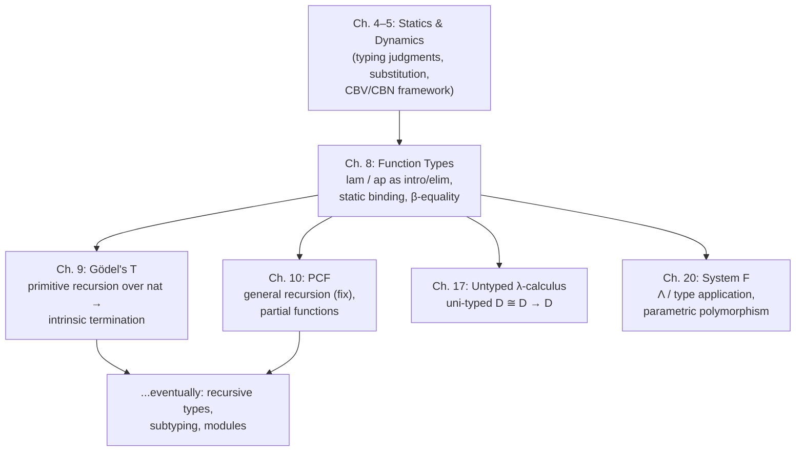

# Function Types and the Lambda Calculus

[[book-guidelines|↩ Back to guidelines]]

## Why this chapter exists

Everything up to this point in Harper's book — $\mathcal{L}\{\mathtt{num\ str}\}$ — lets you *compute*, but not *abstract over a computation*. You can write $x^2 + 2x + 1$ for a specific $x$, but you have no way to name "the operation of doubling" as a thing in its own right, independent of any particular number you apply it to. You can only ever write down instances.

The fix looks obvious from a programmer's chair: add function definitions. But Harper is careful to show that this obvious move can be done two different ways, and the difference between them is the entire content of this chapter:

1. **First-order functions** — a function is a *named binding*, syntactically separate from expressions. It lives in its own namespace, gets its own typing judgment, and can never itself be passed around as data.
2. **Higher-order functions** — a function is *an expression*, of a *type*, just like a number or a string. It can be passed as an argument, returned as a result, stored, and — crucially — the very same substitution machinery that already handles `let` handles function application too.

The chapter's payoff is that (2) is a strict generalization of (1) that costs nothing and buys enormous uniformity: once you have function *types*, you don't need a separate "function definition" construct in your language at all — $\mathtt{let}$ and $\lambda$ are the same idea wearing different clothes. This is also where two of the most consequential design decisions in language semantics show up for the first time: call-by-value vs. call-by-name, and static vs. dynamic binding. Get the second one wrong (as several historical languages did) and your language stops being type-safe.

## 1. First-order function definitions by substitution

Harper's first move, in $\mathcal{L}\{\mathtt{num\ str\ fun}\}$, is deliberately conservative. The grammar adds two new expression forms:

$$
\begin{aligned}
e &::= \mathtt{call}[f](e) && f(e) \quad \text{(call)} \\
e &::= \mathtt{fun}[\tau_1;\tau_2](x_1.e_2;\,f.e) && \mathtt{fun}\ f(x_1{:}\tau_1){:}\tau_2 = e_2\ \mathtt{in}\ e \quad \text{(definition)}
\end{aligned}
$$

Read `fun[τ1;τ2](x1.e2; f.e)` as: "bind the function name $f$, within the scope of $e$, to the pattern $x_1.e_2$" — a parameter $x_1$ paired with a body $e_2$. The domain and range of $f$ are pinned to base types ($\mathtt{num}$ or $\mathtt{str}$) because those are the only types this tiny language has.

The [[Symbols-and-Dynamic-Binding#Statics|statics]] needs **two separate judgment forms**, because a function name $f$ and an expression $e$ are different *kinds* of syntactic object:

$$
\frac{\Gamma, x_1:\tau_1 \vdash e_2 : \tau_2 \qquad \Gamma, f(\tau_1):\tau_2 \vdash e : \tau}{\Gamma \vdash \mathtt{fun}[\tau_1;\tau_2](x_1.e_2; f.e) : \tau} \qquad
\frac{\Gamma \vdash f(\tau_1):\tau_2 \qquad \Gamma \vdash e : \tau_1}{\Gamma \vdash \mathtt{call}[f](e) : \tau_2}
$$

$f(\tau_1):\tau_2$ is called the **function header** — it's a judgment *about a name*, tracked in the context right alongside ordinary variable typings, but it is not itself an expression type. You cannot write `f` where an expression is expected; $f$ only ever occurs as the head of a `call`.

The [[Exceptions#Dynamics|dynamics]] is where the "first-order" restriction really bites. Rather than a reduction rule for `call`, Harper defines **function substitution**, $[[x.e/f]]e'$, by recursion on $e'$ — structurally identical to ordinary capture-avoiding substitution, except it has exactly one interesting case:

$$
[[x.e/f]]\,\mathtt{call}[f](e') = \mathtt{let}([[x.e/f]]e';\, x.e)
$$

Every call site to $f$ unfolds into a `let` that binds the parameter to the (recursively substituted) argument. The whole function definition then reduces in one shot:

$$
\mathtt{fun}[\tau_1;\tau_2](x_1.e_2; f.e) \mapsto [[x_1.e_2/f]]e
$$

There is no separate rule for evaluating a `call` — by the time function substitution has run, every call has already become a `let`. This is the mechanism laid completely bare: a first-order function is nothing but a template for `let`-expansion, applied wherever its name is invoked.

**[[Control-Stacks-and-Abstract-Machines#What breaks without this|What breaks without this]] restriction to base types:** nothing yet — but it reveals the seam. Nothing here lets you write a function whose *argument* is itself a function (a "take a doubling-function and apply it twice" combinator), because $\tau_1$ and $\tau_2$ can only be $\mathtt{num}$ or $\mathtt{str}$. To lift that restriction you'd need function *types* — types whose elements are functions — and once you have those, you no longer need `fun`/`call` as separate primitives at all. That's exactly the move Harper makes next.

**Rust [[Plotkins-PCF-and-Partial-Computation#Grounding|grounding]].** Function substitution's `call → let` rewrite is precisely what a monomorphizing compiler does when it inlines a call site: `f(x1) = e2; ...; f(arg)` becomes `{ let x1 = arg; e2 }`. If you're building a checker, the two judgment forms — expression typing vs. function-header typing — map to two separate symbol tables: a `HashMap<Ident, Type>` for variables and a distinct `HashMap<FuncName, (Type, Type)>` for function headers, exactly because Harper's context $\Gamma$ keeps $x:\tau$ and $f(\tau_1):\tau_2$ as different *shapes* of entry, not two instances of the same one.

```rust
enum CtxEntry {
    Var(Type),
    FuncHeader(Type, Type), // domain, range
}
```

**Lean grounding.** The two-judgment-form setup is the seed of what will later become a single, uniform typing judgment once functions become first class — a preview of why Lean's `Expr` has exactly one case for `.app` and one for `.lam`, with no separate "function definition" AST node. Lean doesn't need `fun`/`call` as primitives because it went straight to the higher-order design in §8.2.

## 2. Higher-order functions as first-class values

Harper's diagnosis: the segregation between "functions" and "expressions" in §8.1 is an artificial wall. A function name $f$ is bound to an abstractor $x.e$; nothing stops you from **reifying that abstractor as an expression itself**. Call it a **λ-abstraction**: $\mathtt{lam}[\tau_1](x.e)$. Correspondingly, generalize application $\mathtt{call}[f](e)$ — which required a *name* — to $\mathtt{ap}(e_1;e_2)$, where $e_1$ can be *any* expression of function type, not just a bound name.

This single move is what makes functions **first-class**: a function is now an ordinary value of an ordinary type, $\mathtt{arr}(\tau_1;\tau_2)$, written $\tau_1 \to \tau_2$. It can appear anywhere an expression can — as an argument, a return value, a component of a pair, stored and later invoked. $\mathcal{L}\{\mathtt{num\ str}\to\}$ replaces the two ad hoc constructs of §8.1 with:

$$
\tau ::= \mathtt{arr}(\tau_1;\tau_2)\ \ (\tau_1 \to \tau_2) \qquad
e ::= \mathtt{lam}[\tau](x.e)\ \ (\lambda(x{:}\tau)\,e) \mid \mathtt{ap}(e_1;e_2)\ \ (e_1(e_2))
$$

**What breaks without this:** without function types, you cannot write `map`, `compose`, or any combinator that abstracts over *which* transformation to apply — you'd need a hand-written first-order function for every transformation, and no way to parameterize a function *by* a function. Harper's whole later development (System T's `it`, higher Ackermann definability, System F's polymorphism) depends on functions being ordinary values from here on.

**Rust grounding.** This is exactly the difference between a free function `fn f(x: i32) -> i32 { .. }` (first-order, can't be passed around without extra machinery) and a closure value `let f: fn(i32) -> i32 = |x| x + x;` or, more generally, `Box<dyn Fn(i32) -> i32>`. Once functions are values, `arr(τ1;τ2)` is just `Fn(τ1) -> τ2` — a trait, not a special AST node. If you're writing a type checker, this is the moment `Type::Fn(Box<Type>, Box<Type>)` becomes a variant of your `Type` enum on exactly the same footing as `Type::Num` or `Type::Str`, rather than a separate table keyed by name.

**Lean grounding.** This is the literal ancestor of Lean's `Expr.lam` and `Expr.app`, and of the arrow type `α → β` being an ordinary `Sort`-classified type, not a special form. Anywhere your elaborator needs to unify a metavariable against a function type, it is working with exactly this `arr(τ1;τ2)` — the uniformity Harper buys here is the same uniformity that lets Lean's kernel treat `fun x => e` and `f a` with one pair of typing rules instead of a zoo of cases.

## 3. λ-abstraction as introduction and application as elimination

Harper explicitly labels $\mathtt{lam}$ and $\mathtt{ap}$ as the **introduction** and **elimination** forms for the function type — vocabulary carried over from Chapter 4's general classification of every type former into "how do you make one" (introduction) vs. "how do you use one" (elimination). The statics makes the pairing precise:

$$
\frac{\Gamma, x:\tau_1 \vdash e : \tau_2}{\Gamma \vdash \mathtt{lam}[\tau_1](x.e) : \mathtt{arr}(\tau_1;\tau_2)} \qquad
\frac{\Gamma \vdash e_1 : \mathtt{arr}(\tau_2;\tau) \qquad \Gamma \vdash e_2 : \tau_2}{\Gamma \vdash \mathtt{ap}(e_1;e_2) : \tau}
$$

Introduction says: to build a function of type $\tau_1 \to \tau_2$, extend the context with a *hypothetical* $x:\tau_1$ and produce a $\tau_2$ under that hypothesis. Elimination says: given a function and an argument of the right type, you get a result of the range type. Two supporting lemmas make this pairing operationally trustworthy — **inversion** (Lemma 8.2: the typing rules are the *only* way to derive a type for a `lam` or `ap`, so you can safely pattern-match on syntax during type-checking) and **substitution** (Lemma 8.3: substituting a well-typed closed(-enough) term for a hypothetical variable preserves typing — the semantic content of "discharging a hypothesis").

**What breaks without introduction/elimination symmetry:** if elimination didn't precisely undo introduction, $\beta$-reduction wouldn't be type-preserving, and preservation (Theorem 8.4) would fail outright. The introduction/elimination discipline is *why* $\mathtt{ap}(\mathtt{lam}[\tau_2](x.e_1); e_2) \mapsto [e_2/x]e_1$ is guaranteed to land you back in a well-typed term — the elimination rule for `arr` is engineered to be exactly the inverse of the introduction rule.

**Rust grounding.** This introduction/elimination discipline is the direct blueprint for writing a type-checker's `infer`/`check` functions: `lam` is a *checking*-mode form (you need the expected `arr(τ1;τ2)` to know what `x` should be typed at, or you must be given `τ1` explicitly as Harper's syntax `lam[τ1](x.e)` does), while `ap` is an *inference*-mode form (you infer $e_1$'s type, require it be an arrow, then check $e_2$ against the domain). This is bidirectional typing already implicit in Harper's rules, even though he doesn't name it that way — a thread worth tracking explicitly if you're building an elaborator, since the domain annotation on `lam[τ1](x.e)` is exactly the kind of information a bidirectional checker either demands from the syntax or must synthesize via unification.

```rust
enum Term { Var(String), Lam(Type, String, Box<Term>), App(Box<Term>, Box<Term>) }

fn infer(ctx: &Ctx, t: &Term) -> Result<Type, TypeError> {
    match t {
        Term::Var(x) => ctx.lookup(x),
        Term::App(e1, e2) => match infer(ctx, e1)? {
            Type::Arr(t1, t2) => { check(ctx, e2, &t1)?; Ok(*t2) }
            other => Err(TypeError::NotAFunction(other)),
        },
        Term::Lam(t1, x, body) => {
            let t2 = infer(&ctx.extend(x.clone(), t1.clone()), body)?;
            Ok(Type::Arr(Box::new(t1.clone()), Box::new(t2)))
        }
    }
}
```

**Lean grounding.** `infer`/`check` above is literally Lean's elaborator's two modes. `Term::Lam` requiring an explicit domain annotation mirrors why Lean sometimes needs `fun (x : α) => e` rather than bare `fun x => e` when it can't synthesize `α` — inference mode alone can't invent a domain type out of nowhere; either the syntax supplies it (as Harper's grammar always does) or a metavariable is created and later solved by unification against the call site.

## 4. Call-by-value versus call-by-name dynamics

The dynamics for `ap` needs one instruction rule and two search rules — but the instruction rule comes in two variants, and the choice between them is a fork in the design of the whole language:

$$
\mathtt{lam}[\tau](x.e)\ \mathtt{val} \qquad
\frac{e_1 \mapsto e_1'}{\mathtt{ap}(e_1;e_2)\mapsto \mathtt{ap}(e_1';e_2)} \qquad
\frac{e_1\ \mathtt{val} \quad e_2 \mapsto e_2'}{\mathtt{ap}(e_1;e_2)\mapsto \mathtt{ap}(e_1;e_2')} \quad [e_2\ \mathtt{val}] \qquad
\frac{[e_2\ \mathtt{val}]}{\mathtt{ap}(\mathtt{lam}[\tau_2](x.e_1);e_2)\mapsto [e_2/x]e_1}
$$

The bracketed premise `[e2 val]` on the search rule and the instruction rule are a matched pair: include both, and you get **call-by-value** — the argument must be fully reduced to a value *before* substitution ever happens, so $x$ is always bound to an already-computed value. Exclude both, and you get **call-by-name** — substitution can fire on an unevaluated argument expression, and if the body never uses $x$, that argument is never evaluated at all.

This is not a cosmetic choice. Under call-by-value, `(λ(x:num) 5)(div(1;0))` gets stuck evaluating the argument before the function body is ever consulted — the whole application diverges/errors even though $x$ is unused. Under call-by-name, the same application reduces straight to `5`, because the divide-by-zero is substituted in unevaluated and simply discarded. **What breaks (or rather, what changes) without picking one:** the operational meaning of *every* program with a side-effecting or non-terminating argument depends on this choice — it's the same fork that separates Rust/OCaml/ML-family evaluation from Haskell's laziness (which is closer to, though not identical to, call-by-name — Haskell is call-by-need, i.e. call-by-name plus memoization, discussed later in the book under laziness).

**Rust grounding.** Rust function calls are eagerly evaluated (call-by-value) by construction — `f(expensive_computation())` always runs `expensive_computation()` first. The call-by-name alternative is what you get if you instead pass a thunk: `f(|| expensive_computation())`, deferring evaluation to whenever (and however many times) the closure body actually invokes it. Writing an interpreter, the two dynamics differ by exactly one guard clause in your `step` function around the `App` case:

```rust
fn step(e: &Term) -> Option<Term> {
    match e {
        Term::App(e1, e2) if !is_value(e1) => Some(Term::App(Box::new(step(e1)?), e2.clone())),
        // call-by-value only: reduce the argument before substituting
        Term::App(e1, e2) if is_value(e1) && !is_value(e2) => Some(Term::App(e1.clone(), Box::new(step(e2)?))),
        Term::App(e1, e2) if is_value(e1) /* && is_value(e2) for CBV */ => {
            if let Term::Lam(_, x, body) = &**e1 { Some(subst(body, x, e2)) } else { None }
        }
        _ => None,
    }
}
```

**[[Continuations#Python grounding|Python grounding]].** A quick illustrative sketch, not load-bearing: Python's default is call-by-value on references (arguments are evaluated before the call), but you can hand-simulate call-by-name with a zero-argument lambda: `def f(thunk): return 5` never forces `thunk`, so `f(lambda: 1/0)` doesn't raise, exactly mirroring the "argument never evaluated" behavior above.

## 5. Static binding versus dynamic binding

This is where Harper turns from "two equally valid dynamics" (§8.3, call-by-value/name) to "one correct choice and one historical mistake." Both static and dynamic binding define application by *replacing* the parameter with the argument in the function body — the difference is entirely in whether that replacement is capture-avoiding.

**Static binding** (what every rule so far has silently assumed) is ordinary substitution $[e_2/x]e_1$: if the argument $e_2$ has a free variable $y$, and the body $e_1$ happens to have a bound variable also called $y$, capture-avoiding substitution *renames the bound occurrence* before substituting, so $y$ in the argument stays free — meaning it refers to whatever $y$ meant at the point the function was *defined*.

**Dynamic binding** defines application the same way but with *replacement* instead of substitution: no renaming, so a bound $y$ inside the function body can capture the argument's free $y$, silently changing which $y$ it refers to based on where the call happens to occur, not where the function was written.

Harper's example makes the failure concrete. Let $e = \lambda(x{:}\mathtt{str})\ y + |x|$ (free variable $y$) and $e' = \lambda(y{:}\mathtt{str})\ f(y)$ (free variable $f$). Substituting $e$ for $f$ in $e'$ correctly $\alpha$-renames $e$'s bound $y$ to a fresh $y'$:

$$
\lambda(y'{:}\mathtt{str})\ (\lambda(x{:}\mathtt{str})\ y + |x|)(y')
$$

— the free $y$ in $e$ stays free, referring to whatever $y : \mathtt{nat}$ meant outside. But *replacing* $f$ by $e$ without renaming gives:

$$
\lambda(y{:}\mathtt{str})\ (\lambda(x{:}\mathtt{str})\ y + |x|)(y)
$$

— the outer binder for $y{:}\mathtt{str}$ now captures the inner occurrence, so the expression that was supposed to add a `nat`-typed $y$ to a string length is now trying to add a *string*-typed $y$ instead. Concretely: $y : \mathtt{nat} \vdash e : \mathtt{str}\to\mathtt{nat}$ and $f:\mathtt{str}\to\mathtt{nat} \vdash e' : \mathtt{str}\to\mathtt{nat}$ jointly type-check, so $y:\mathtt{nat}\vdash [e/f]e' : \mathtt{str}\to\mathtt{nat}$ is derivable by the substitution lemma — yet the *replaced* (dynamically-scoped) term is straightforwardly ill-typed. **This is the load-bearing point: dynamic binding breaks [[Type-Safety|type safety]]**, not just aesthetics. And beyond [[Dynamic-Classification#Safety|safety]], it breaks modularity — the meaning of $e'$ now depends on the *name* $y$ that happens to be free in some client's $e$, so $e$ and $e'$ can no longer be developed independently; renaming a bound variable in one changes the observable behavior of the other, in direct violation of the founding principle from Chapter 1 that bound-variable names are insignificant.

**Why this matters for a checker/elaborator.** This is precisely the reason capture-avoiding substitution — with fresh-variable renaming — is non-negotiable machinery in any type checker or elaborator you build, not an optional correctness nicety. If your Rust verifier's substitution routine for Hoare-triple preconditions, or your elaborator's substitution during metavariable instantiation, ever does textual replacement instead of true capture-avoiding substitution, you reproduce exactly this bug: an unrelated binder in the term being substituted into can silently capture a free variable from the substituted term, silently corrupting soundness. This is the same freshness discipline as Chapter 1's abstract binding trees — this chapter is where you see, concretely, what happens when you skip it.

**Rust grounding.** If your interpreter represents terms with named variables (rather than de Bruijn indices), your `subst` function must generate a fresh name and rename the bound occurrence whenever it would otherwise capture — exactly the branch dynamic binding omits:

```rust
fn subst(body: &Term, x: &str, replacement: &Term) -> Term {
    match body {
        Term::Var(y) if y == x => replacement.clone(),
        Term::Var(y) => Term::Var(y.clone()),
        Term::Lam(t, y, e) if y == x => Term::Lam(t.clone(), y.clone(), e.clone()), // x shadowed, stop
        Term::Lam(t, y, e) if free_vars(replacement).contains(y) => {
            let fresh = gensym(y);           // static binding: rename to avoid capture
            let e_renamed = subst(e, y, &Term::Var(fresh.clone()));
            Term::Lam(t.clone(), fresh, Box::new(subst(&e_renamed, x, replacement)))
        }
        Term::Lam(t, y, e) => Term::Lam(t.clone(), y.clone(), Box::new(subst(e, x, replacement))),
        Term::App(e1, e2) => Term::App(Box::new(subst(e1, x, replacement)), Box::new(subst(e2, x, replacement))),
    }
}
```
Most production compilers sidestep the whole issue by using de Bruijn indices or nameless representations internally — which is worth knowing precisely because it's a way of making capture *structurally impossible* rather than something you have to get right by hand every time.

**Lean grounding.** Lean's kernel substitution (used pervasively during `isDefEq`/unification and beta-reduction) is capture-avoiding by construction — Lean's internal representation uses de Bruijn indices for bound variables specifically so that capture cannot arise, sidestepping the freshness bookkeeping shown above entirely. When you eventually build the minimal elaborator from the learning goals, this is the one piece of "boring" infrastructure that is not allowed to be sloppy.

## 6. Evaluation dynamics and definitional equality for functions

Harper closes the chapter by restating application's dynamics in two more ways, both extending the machinery from Chapter 5.

**Evaluation dynamics** ($e \Downarrow v$) skips intermediate steps and relates expressions directly to values:

$$
\mathtt{lam}[\tau](x.e) \Downarrow \mathtt{lam}[\tau](x.e) \qquad
\frac{e_1 \Downarrow \mathtt{lam}[\tau](x.e) \qquad [e_2/x]e \Downarrow v}{\mathtt{ap}(e_1;e_2) \Downarrow v}
$$

This is the shape of a straightforward recursive interpreter: evaluate $e_1$ down to a lambda, substitute the (unevaluated, in this formulation — this rule as written is call-by-name-flavored, since $e_2$ isn't required to be a value first) argument into the body, and recurse. Theorem 8.7 confirms this agrees with the step-by-step dynamics: $e \Downarrow v$ iff $e \mapsto^\ast v$ and $v\ \mathtt{val}$.

**Definitional equality** ($\Gamma \vdash e \equiv e' : \tau$) extends Chapter 5's equational rules with a $\beta$-rule and congruence rules for `lam`/`ap`:

$$
\Gamma \vdash \mathtt{ap}(\mathtt{lam}[\tau](x.e_2); e_1) \equiv [e_1/x]e_2 : \tau_2 \qquad
\frac{\Gamma \vdash e_1 \equiv e_1' : \tau_2\to\tau \quad \Gamma \vdash e_2\equiv e_2' : \tau_2}{\Gamma \vdash \mathtt{ap}(e_1;e_2) \equiv \mathtt{ap}(e_1';e_2') : \tau} \qquad
\frac{\Gamma, x:\tau_1 \vdash e_2 \equiv e_2' : \tau_2}{\Gamma \vdash \mathtt{lam}[\tau_1](x.e_2) \equiv \mathtt{lam}[\tau_1](x.e_2') : \tau_1\to\tau_2}
$$

This is $\beta$-reduction, stated as an equation rather than a directed step — the same content as the operational rule from §8.2, now usable bidirectionally in [[Equational-Reasoning|equational reasoning]], and (per Chapter 5) as the strongest congruence closed under the $\beta$-rule. For call-by-value, Harper notes the equational judgment needs sharper bookkeeping: the $\beta$-rule must be restricted to require the argument be a value, and the context $\Gamma$ must carry paired hypotheses $x:\tau, x\ \mathtt{val}$ for every variable in scope — because under call-by-value, a bound parameter always *stands for* an already-computed value, so treating an in-scope variable as if it were itself a value is only justified once you track that hypothesis explicitly.

**Why this is the load-bearing piece for the elaborator project.** Definitional equality *is* the formal specification of what a `isDefEq`/unification routine is supposed to decide. The $\beta$-rule above — "an application of a literal lambda is definitionally equal to its substitution instance" — is exactly the equation Lean's kernel checks (and that its elaborator exploits) every time it needs to know whether two terms mean the same thing up to computation, not just up to syntax. Harper is handing you, in miniature, the equational theory your unifier will eventually need to implement and decide over a much richer term language.

**Rust/Lean grounding.** A decision procedure for this fragment of definitional equality is just: normalize both sides by repeatedly applying the $\beta$-rule (and congruence into subterms) until no `ap(lam(...), ...)` redex remains, then compare the normal forms for syntactic (up to $\alpha$) equality — trivial here because simply-typed $\beta$-reduction terminates and is confluent, so normal forms are unique. This is precisely `rfl`-checking in Lean for terms that reduce to each other by $\beta$ alone; Lean's `whnf` (weak head normal form) reduction and its definitional-equality check `isDefEq` are the industrial-strength version of exactly this normalize-and-compare loop, generalized to also handle $\delta$ (unfolding definitions), $\iota$ (recursor computation), and $\eta$.

## Where this leads



Function types are the hinge the rest of the book turns on. System T (Chapter 9) and PCF (Chapter 10) are both just $\mathcal{L}\{\mathtt{num\ str}\to\}$ plus one more primitive (structural vs. general recursion) — nothing about `lam`/`ap` changes. System F (Chapter 20) generalizes the same introduction/elimination pattern one level up, from *value* abstraction to *type* abstraction ($\Lambda(t.e)$ mirrors $\mathtt{lam}[\tau](x.e)$ exactly). And the untyped $\lambda$-calculus (Chapter 17) is revealed to be nothing exotic — just this chapter's function type folded into a single recursive type $D \cong D \to D$.

For the standing projects: the introduction/elimination + inversion + substitution lemma triad here (§3) is the literal template for `infer`/`check` in a Rust type checker, and it is the first place in the book where getting substitution wrong (§5, dynamic binding) has a named, provable failure mode — the exact class of bug that capture-avoiding substitution in a Hoare-triple verifier or an elaborator's metavariable instantiation must never reproduce. Definitional equality's $\beta$-rule (§6) is the minimal seed of the `isDefEq`/unification machinery central to the elaborator target — everything Lean's kernel does with function types is this section, scaled up.
