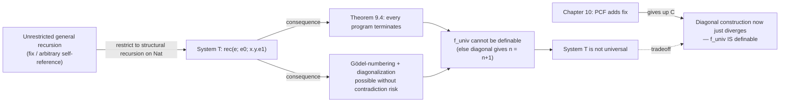

[[book-guidelines|↩ Back to guidelines]]

# Gödel's System T and Total Computation

## The problem: a language that cannot get stuck versus a language that cannot loop

Every language so far in Harper's development has bought [[Type-Safety|type safety]] — "well-typed programs don't get stuck" — cheaply, by simply restricting what expressions can *be*. But [[Dynamic-Classification#Safety|safety]] says nothing about whether a well-typed program actually *finishes*. A well-typed program can still loop forever; it just can't crash while doing so. Chapter 9 asks a much harder question: can we design a language where every well-typed program is not merely safe, but **provably terminating**, and where that termination proof is not something you bolt on afterward but falls straight out of the *shape of the typing rules themselves*?

This is $\mathcal{L}\{\text{nat}\to\}$, better known as **Gödel's System T** (Gödel introduced it to reduce the consistency of arithmetic to the termination of these programs — a genuinely foundational motivation, not just a toy). It combines the natural numbers with higher-order functions, and replaces the *ad hoc* arithmetic primitives of earlier example languages (`+`, `×`, whatever you felt like adding) with a single, disciplined recursion principle: **primitive recursion**. Every arithmetic function you want has to be built from this one principle, and that restriction is precisely what makes termination provable — and, as we'll see, precisely what makes the language *weaker* than a general-purpose language like Python or Rust.

[[Control-Stacks-and-Abstract-Machines#What breaks without this|What breaks without this]] restriction: if you allow a completely unconstrained recursive definition (`f(n) = f(n) + 1`, say), induction on the *structure of the recursion* no longer works as a termination argument, because there's no structure to induct on — the recursive call isn't guaranteed to be "smaller" than the input in any sense the type system can see. System T's whole design is an answer to "how do we build recursion so that this failure mode is impossible by construction."

## Syntax: numbers, functions, and one recursion form

The grammar of $\mathcal{L}\{\text{nat}\to\}$ is small and Harper is exact about it:

$$
\begin{aligned}
\tau &::= \mathsf{nat} \mid \tau_1 \to \tau_2 \\
e &::= x \mid \mathsf{z} \mid \mathsf{s}(e) \mid \mathsf{rec}(e; e_0; x.y.e_1) \mid \lambda(x{:}\tau).e \mid e_1(e_2)
\end{aligned}
$$

Numerals are built from zero ($\mathsf{z}$) and successor ($\mathsf{s}(e)$); write $\bar{n}$ for $n$ applications of $\mathsf{s}$ to $\mathsf{z}$. The one new construct is $\mathsf{rec}(e; e_0; x.y.e_1)$, concretely written

```
rec e { z => e0 | s(x) with y => e1 }
```

Read this as: *case-split on the natural number `e`.* If it's zero, the whole thing evaluates to `e0`. If it's `s(x)` for some predecessor `x`, evaluate to `e1`, in which `x` is bound to the predecessor and — critically — `y` is bound to the *result of recursively calling the whole recursion on `x`*. This is what "primitive" is doing here: the recursive call is not something you write out yourself (as in a general `let rec`); it's *structurally supplied by the elimination form itself*, always on the immediate predecessor. You cannot ask for `rec` on some other, unrelated argument — the form of the construct physically prevents it.

A close cousin, **iteration**, `iter(e; e0; y.e1)`, drops the binding for the predecessor `x` and keeps only the recursive-result binding `y`. Iteration is manifestly a special case of primitive recursion (just ignore `x`). Less obviously, primitive recursion is *derivable from* iteration once you have [[Product-Types|product types]] (Chapter 11) — you iterate a pair `(predecessor-so-far, result-so-far)` instead of just the result, incrementing the first component and applying the step function to both. This is worth flagging early: **iteration and primitive recursion have the same expressive power**; the extra binding in `rec` is a convenience, not a capability.

**Rust [[Plotkins-PCF-and-Partial-Computation#Grounding|grounding]].** The closest structural analogue to `rec` isn't Rust's general recursion (which is exactly what System T refuses to allow) — it's the shape you get from deriving a fold over a custom recursive enum, where the compiler enforces that the recursive call only ever happens on a strictly smaller substructure:

```rust
enum Nat {
    Z,
    S(Box<Nat>),
}

// rec(e; e0; x.y.e1) specialized to a concrete step function,
// mirroring the *shape* the typing rule enforces: the recursive
// result (y) is computed automatically on the predecessor (x).
fn nat_rec<T>(n: Nat, z_case: T, step: impl Fn(&Nat, T) -> T) -> T
where
    T: Clone,
{
    match n {
        Nat::Z => z_case,
        Nat::S(x) => {
            let y = nat_rec(*x.clone(), z_case.clone(), &step); // recursive call, always on the predecessor
            step(&x, y)
        }
    }
}
```

The point of showing this in Rust is that `nat_rec` *cannot be written to loop*: the recursive call is forced onto `*x`, which is structurally one constructor smaller than `Nat::S(x)`. There is no way to instantiate `step` such that `nat_rec` diverges — that's exactly the discipline System T's `rec` bakes into the syntax itself, except System T enforces it at the level of the *typing rule*, not by convention in a hand-written function.

## Typing and dynamics: where the discipline actually lives

The typing rule for `rec` is where the restriction becomes formal:

$$
\dfrac{\Gamma \vdash e : \mathsf{nat} \quad \Gamma \vdash e_0 : \tau \quad \Gamma, x{:}\mathsf{nat}, y{:}\tau \vdash e_1 : \tau}{\Gamma \vdash \mathsf{rec}(e; e_0; x.y.e_1) : \tau}
$$

Notice that $y$, the "recursive result" variable, is given type $\tau$ — the *same* type the whole recursion returns. This is the type system quietly assuming, before any evaluation happens, that the recursive call already succeeded and produced a well-typed answer. That assumption is what later gets cashed out as an actual termination proof (Theorem 9.4) — but at the level of *typing* it looks just like an ordinary induction hypothesis: "assume the property (well-typedness, eventually: termination) holds for the predecessor, and show it's preserved by one more step."

The [[Exceptions#Dynamics|dynamics]] make the recursive structure operational:

$$
\dfrac{}{\mathsf{rec}(\mathsf{z}; e_0; x.y.e_1) \mapsto e_0} \qquad\qquad \dfrac{\mathsf{s}(e)\ \mathsf{val}}{\mathsf{rec}(\mathsf{s}(e); e_0; x.y.e_1) \mapsto [e, \mathsf{rec}(e; e_0; x.y.e_1)/x, y]e_1}
$$

The second rule is the crux: to take one step, you substitute the predecessor `e` for `x`, and — this is the important part — you substitute the *unevaluated recursive call* `rec(e; e0; x.y.e1)` for `y`. Harper is explicit that this recursive call is not forced eagerly; "if the value of `y` is not required in the rest of the computation, the recursive call will not be evaluated." That's a laziness-by-default property of the recursor itself, independent of whether the rest of the language is call-by-value or call-by-name.

**Lean [[Recursive-Types#Grounding|grounding]].** Lean's own structural recursion on `Nat` is close to a literal transcription of this typing rule, because Lean's kernel enforces essentially the same "recursive call only on a structurally smaller argument" discipline via its termination checker:

```lean
def rec_nat {motive : Type} (n : Nat) (z_case : motive) (step : Nat → motive → motive) : motive :=
  match n with
  | .zero => z_case
  | .succ x => step x (rec_nat x z_case step)
```

This is `Nat.rec` (or `Nat.recAux`) under a friendlier name — Lean accepts it *without* asking you to separately prove termination, precisely because the recursive call `rec_nat x z_case step` is on `x`, the immediate predecessor of `.succ x`, and Lean's guard checker can see that syntactically. Chase this thread further and you land exactly on why System T's `rec` is trusted: it isn't that Harper proves each program terminates individually — the *shape* of the eliminator makes an entire termination argument (structural induction on `Nat`) apply uniformly to every program built from it. That is the "intrinsic termination proof" the chapter's opening paragraph promises.

## Definability: what you actually get to compute

Call a mathematical function $f : \mathbb{N} \to \mathbb{N}$ **definable** in $\mathcal{L}\{\text{nat}\to\}$ if there is an expression $e_f : \mathsf{nat}\to\mathsf{nat}$ such that $e_f(\bar n) \equiv \overline{f(n)} : \mathsf{nat}$ for every $n$ — i.e., applying $e_f$ to the numeral for $n$ is *definitionally equal* to the numeral for $f(n)$. Definitional equality here is generated by exactly the two computation rules you'd expect (plus the usual $\beta$-rule for application):

$$
\mathsf{rec}(\mathsf{z}; e_0; x.y.e_1) \equiv e_0 : \tau \qquad\qquad \mathsf{rec}(\mathsf{s}(e); e_0; x.y.e_1) \equiv [e, \mathsf{rec}(e; e_0; x.y.e_1)/x, y]e_1 : \tau
$$

Doubling is the textbook first example: $e_d \triangleq \lambda(x{:}\mathsf{nat}).\ \mathsf{rec}\ x\ \{\mathsf{z} \Rightarrow \mathsf{z} \mid \mathsf{s}(u)\ \mathsf{with}\ v \Rightarrow \mathsf{s}(\mathsf{s}(v))\}$. The proof that this actually computes $n \mapsto 2n$ is a genuine mathematical induction on $n$: base case $e_d(\bar 0) \equiv \bar 0$ is immediate from the $\mathsf{z}$-rule; the inductive step chains the $\mathsf{s}$-rule, the inductive hypothesis $e_d(\bar n) \equiv \overline{2n}$, and ordinary arithmetic to get $e_d(\overline{n+1}) \equiv \mathsf{s}(\mathsf{s}(\overline{2n})) = \overline{2(n+1)}$. This pattern — unfold the recursor by its dynamics, invoke the inductive hypothesis on the smaller case, close with arithmetic — is *the* proof technique for anything built from `rec`, and it will recur constantly.

**What breaks without primitive recursion's discipline:** the far more interesting case is **Ackermann's function**,

$$
A(0,n) = n+1 \qquad A(m+1, 0) = A(m,1) \qquad A(m+1,n+1) = A(m, A(m+1,n))
$$

which grows so explosively ($A(4,2) \approx 2^{65536}$) that it is the standard example of a *total, computable* function that is **not first-order primitive recursive** — no finite composition of the usual first-order schema (recursion on one argument at a time, using only previously-defined first-order functions) can express it. If System T only had first-order primitive recursion, Ackermann's function would be outside its reach entirely, and that would be a real expressiveness gap, not just an inconvenience.

But System T has *higher-order* primitive recursion — recursion where the thing being built at each step, $y$, can itself be a function — and that's exactly enough. The trick is to define an iterated-composition combinator,

$$
\mathrm{it} \triangleq \lambda(f{:}\mathsf{nat}\to\mathsf{nat}).\ \lambda(n{:}\mathsf{nat}).\ \mathsf{rec}\ n\ \{\mathsf{z}\Rightarrow \mathrm{id} \mid \mathsf{s}(\_)\ \mathsf{with}\ g \Rightarrow f \circ g\}
$$

satisfying $\mathrm{it}(f)(n)(m) \equiv f^{(n)}(m)$ ($n$-fold self-composition of $f$, applied to $m$). Then $A(m+1, -)$ is defined as the $n$-fold self-composition of $A(m,-)$ starting from $A(m,1)$ — which is exactly what recursing on $m$, with $y$ bound to the *function* $A(m,-)$ (not a number!), lets you write:

$$
e_a \triangleq \lambda(m{:}\mathsf{nat}).\ \mathsf{rec}\ m\ \{\mathsf{z} \Rightarrow \mathsf{s} \mid \mathsf{s}(\_)\ \mathsf{with}\ f \Rightarrow \lambda(n{:}\mathsf{nat}).\ \mathrm{it}(f)(n)(f(\bar 1))\}
$$

The lesson: **higher-order-ness, not a bigger recursion schema, is what buys the extra power.** System T's `rec` at type $\mathsf{nat}\to\mathsf{nat}$ recursing over $\mathsf{nat}$ is enough to define Ackermann, precisely because "the type $\tau$ being recursed at" is allowed to be a function type. This is a genuinely load-bearing idea for anyone building a verifier: *the strength of an induction/recursion principle is not just about which argument you recurse on, but about what codomain you're allowed to recurse into.*

**[[Continuations#Python grounding|Python grounding]]**, for a quick sanity-check sketch of the mathematics (not meant to be load-bearing, just to see the shape land in familiar syntax):

```python
def A(m, n):
    if m == 0:
        return n + 1
    if n == 0:
        return A(m - 1, 1)
    return A(m - 1, A(m, n - 1))
```

Note this Python version is *not* structurally primitive recursive either — the second recursive call's argument, `A(m, n - 1)`, isn't syntactically smaller by any single obvious measure — yet it terminates by a **lexicographic induction** on the pair $(m,n)$: each call either decreases $m$, or holds $m$ fixed and decreases $n$. Harper uses exactly this lexicographic argument to establish that $A$ is total *as a mathematical function*, which is a separate fact from — and prior to — showing it's *definable in* $\mathcal{L}\{\text{nat}\to\}$ via the `it`-based encoding above.

## Intrinsic termination: the theorem that makes all of this trustworthy

The chapter's centerpiece is stated with almost no fanfare, as **Theorem 9.4**:

> If $e : \tau$, then there exists $v\ \mathsf{val}$ such that $e \equiv v : \tau$.

Every well-typed expression is definitionally equal to a value — every program terminates (the proof is deferred to Corollary 47.15, where Harper develops the general machinery, but the theorem is stated and used here). Notice what this *doesn't* say: it doesn't say every program terminates *quickly*, or that you can compute how long it takes (that's a separate, much stranger question System T doesn't answer). It says only that a value exists at the end of every computation path.

This is the payoff of the design choice made all the way back at `rec`'s typing rule: because every recursive call is forced to be structurally smaller (via the predecessor binding), and because the typing rule for `y` assumes — inductively — that the smaller call already has a value of the right type, the *entire termination argument for the whole language* is one induction on the structure of natural-number values, carried out once, in the metatheory. No individual program in $\mathcal{L}\{\text{nat}\to\}$ needs its own hand-written termination proof; it inherits one automatically, for free, from having been well-typed at all. This is what "intrinsic" means in the topic name — termination isn't proved *about* System T programs from the outside; it's *built into what it means to be a well-typed System T program* in the first place.

**Consequence worth naming explicitly:** functions of type $\mathsf{nat}\to\tau$ now behave exactly like total mathematical functions — apply one to any argument and you're guaranteed a value back, no `Option`, no exception, no `undefined behavior`, no infinite loop. If you've ever wanted a subset of a language where you can *statically* promise "this always terminates, no timeout needed" — for a sandboxed configuration language, a cost-bounded smart-contract VM, a policy-evaluation engine — System T's `rec` is the textbook mechanism for buying that guarantee, and the price (shown next) is exactly what you'd expect.

## Undefinability: the universal function, diagonalization, and the price of termination

Here is the sting in the tail, and it's the deepest part of the chapter. Termination is a *global* guarantee — it holds for every program, uniformly. That uniformity is exactly what a diagonal argument can exploit.

**Gödel-numbering.** First, Harper needs a way to talk about $\mathcal{L}\{\text{nat}\to\}$ *expressions* as $\mathcal{L}\{\text{nat}\to\}$ *data* — i.e., encode syntax as numbers, inside the very numbers the language already manipulates. Fix an enumeration of the language's operators (each gets an index $m \in \mathbb{N}$); for an AST $a = o(a_1,\ldots,a_k)$ with $o$ at index $m$ and children $a_1,\ldots,a_k$ having Gödel numbers $n_1,\ldots,n_k$, define

$$
\ulcorner a \urcorner \triangleq 2^m \cdot 3^{n_1} \cdot 5^{n_2} \cdots p_k^{n_k}
$$

using consecutive primes $p_0 = 2, p_1 = 3, \ldots$ for each argument slot. This is injective and, by unique prime factorization, *reversible*: given a number, you can factor it and reconstruct the unique AST it encodes (or determine it encodes no valid AST, if the factorization shape is wrong). This is a genuinely clever, minimal move — it's the same idea Gödel used for his incompleteness theorems (Harper flags this explicitly), repurposed here to let a total language quote its own programs as first-class numeric data.

**Rust grounding** for the mechanical content of Gödel-numbering (this is squarely the "checker/verifier" shape the reader's compiler project cares about — turning an AST into a canonical, re-parseable integer key):

```rust
enum Expr {
    Var(u32),
    Zero,
    Succ(Box<Expr>),
    Rec(Box<Expr>, Box<Expr>, Box<Expr>), // e, e0, e1 (binder indices elided)
    Lam(Box<Expr>),
    App(Box<Expr>, Box<Expr>),
}

// A Gödel number is just a canonical encoding — the same idea as
// interning an AST into a hashable/comparable key, except Harper's
// version uses prime factorization instead of a hash table so that
// the encoding is *total* and *injective* as a pure function on naturals.
fn godel_number(e: &Expr) -> u64 {
    fn op_index(e: &Expr) -> (u32, Vec<&Expr>) {
        match e {
            Expr::Var(_) => (0, vec![]),
            Expr::Zero => (1, vec![]),
            Expr::Succ(a) => (2, vec![a]),
            Expr::Rec(a, b, c) => (3, vec![a, b, c]),
            Expr::Lam(a) => (4, vec![a]),
            Expr::App(a, b) => (5, vec![a, b]),
        }
    }
    let primes = [2u64, 3, 5, 7, 11, 13];
    let (m, children) = op_index(e);
    let mut code = 1u64 << m; // 2^m
    for (i, child) in children.iter().enumerate() {
        code *= primes[i + 1].pow(godel_number(child) as u32);
    }
    code
}
```

(This is illustrative, not the book's literal construction — the point is just to make "assign a unique reversible integer to a syntax tree" concrete and mechanical, the same operation an elaborator performs whenever it interns terms for definitional-equality caching.)

**The universal function.** With Gödel-numbering in hand, define the *mathematical* function $f_{\mathrm{univ}} : \mathbb{N} \to \mathbb{N} \to \mathbb{N}$ by: $f_{\mathrm{univ}}(\ulcorner e \urcorner)(m) = n$ iff $e(\bar m) \equiv \bar n : \mathsf{nat}$, for $e : \mathsf{nat}\to\mathsf{nat}$. This is a *bona fide, well-defined mathematical function* — it's well-defined precisely *because* Theorem 9.4 guarantees every $e(\bar m)$ reduces to some value, and determinacy of the dynamics guarantees that value is unique. So $f_{\mathrm{univ}}$ exists as an object of ordinary mathematics: it's "the function that interprets $\mathcal{L}\{\text{nat}\to\}$ programs." The question the chapter now poses is sharper than "does this function exist" — it's "is this function *itself definable as an $\mathcal{L}\{\text{nat}\to\}$ program*," i.e., can System T write its own interpreter?

**Diagonalization.** Define $d(m) \triangleq f_{\mathrm{univ}}(m)(m)$ — feed a code to the interpreter it encodes, applied to itself. Suppose, for contradiction, $d$ *were* definable, by some $e_d : \mathsf{nat}\to\mathsf{nat}$, so that $e_d(\ulcorner e\urcorner) \equiv e(\ulcorner e \urcorner) : \mathsf{nat}$ for every $e$. Now build the "spoiler" expression

$$
e_D \triangleq \lambda(x{:}\mathsf{nat}).\ \mathsf{s}(e_d(x))
$$

and evaluate it on *its own* Gödel number:

$$
e_D(\ulcorner e_D \urcorner) \equiv \mathsf{s}(e_d(\ulcorner e_D \urcorner)) \equiv \mathsf{s}(e_D(\ulcorner e_D \urcorner))
$$

By Theorem 9.4, $e_D(\ulcorner e_D\urcorner)$ is definitionally equal to some numeral $\bar n$ — so this chain says $\bar n \equiv \mathsf{s}(\bar n)$, i.e., $n = n + 1$, which is false for every natural number. Contradiction. So $d$ — and hence $f_{\mathrm{univ}}$ — is **not definable** in $\mathcal{L}\{\text{nat}\to\}$.

This is the classic diagonal-argument shape (same skeleton as Cantor's uncountability proof and Turing's halting problem: build an object that disagrees with every candidate on some input by construction, then feed it itself). What makes it land as a genuine impossibility *here*, rather than just producing a divergent program (as the analogous construction will in Chapter 10's PCF, once general recursion is available), is precisely Theorem 9.4: **there is no escape hatch of non-termination for $e_D$ to fall into.** It absolutely must reduce to a value — and that forced termination is what turns the diagonal construction from "loops forever, no contradiction" into "produces an actual false numeric equation."

## Why this matters: the termination/universality tradeoff

Harper is explicit about naming the tradeoff this proves: **a language cannot simultaneously guarantee that every program terminates and be universal** (able to write an interpreter for itself, or equivalently — informally — as expressive as an unrestricted Turing-complete language). System T buys total, provably-terminating computation at the exact price of being unable to define its own evaluator. Chapter 10 (Plotkin's PCF) makes the opposite trade: adding unrestricted general recursion via a fixed-point operator, giving up the termination guarantee, and in return successfully defining a universal interpreter — the same diagonal construction there simply produces a program that fails to terminate, rather than a contradiction, because divergence is now an available, well-typed outcome.



## Where this leads

Structurally, this chapter is a prerequisite for two later threads at once: Chapter 10 (PCF) is defined as *exactly* this language plus general recursion, so everything here — the typing discipline, the Gödel-numbering machinery, the diagonal argument's shape — is reused wholesale, just with the termination theorem removed. And Chapter 11 (Product Types) comes back to redeem the "iteration is a restricted form of recursion" remark by literally deriving `rec` from `iter` plus pairs, showing the two recursion forms really are interchangeable once you have products to carry the extra state.

For the standing project: the `rec` typing rule — "assume the predecessor case already type-checks/terminates, and the induction is done for you by the eliminator's shape" — is the direct ancestor of how a Rust verifier would need to justify accepting recursive functions as terminating without per-function proof obligations (structural/well-founded recursion checking, exactly as Lean's own kernel does it). And Gödel-numbering is worth flagging explicitly as a *general* technique, independent of arithmetic: any time an elaborator or theorem prover needs to treat its own terms as data — to memoize definitional-equality checks, intern terms for a `isDefEq` cache, or reify a proof object for inspection — this "assign a unique, reconstructible integer (or hash) to a syntax tree" move is the same mechanism, just usually implemented with a hash map instead of prime factorization.
