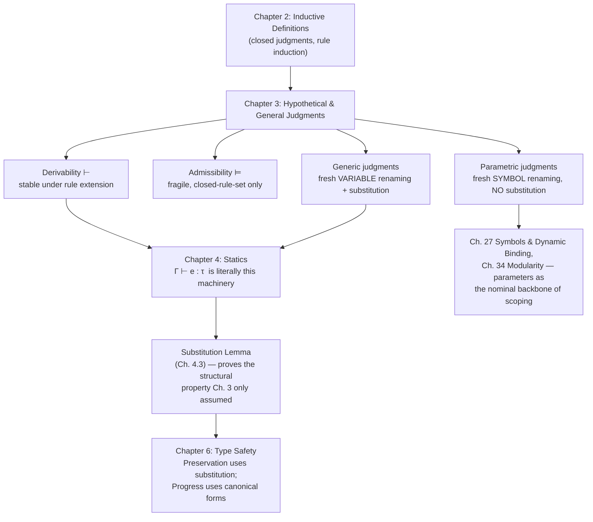

# Hypothetical and General Judgments

[[book-guidelines|↩ Back to guidelines]]

## Why plain inductive definitions aren't enough

Chapter 2 of *Practical Foundations for Programming Languages* gave you inductive definitions: a judgment form, a set of rules, and the judgment closed under those rules is the strongest one consistent with them. That machinery lets you say "`succ(succ(z)) nat` is derivable." It does *not* let you say anything conditional — "*if* `a` is a natural number, *then* so is `succ(succ(a))`, for any `a` whatsoever." That's a completely different kind of claim: it isn't about one fixed object, it's about an open-ended family of arguments, entailments, and variables, and it needs its own theory before it can be trusted.

This matters immediately once you try to build anything real out of inductive definitions — a type checker, for instance. A typing judgment `Γ ⊢ e : τ` is *always* hypothetical (it depends on a context `Γ` of assumptions about free variables) and *always* general (it has to make sense for any `Γ`, any expression built from any variables). If you don't have a precise account of what it means to reason "under hypotheses" and "for all variables," you don't actually have type-checking — you have a pile of intuitions about substitution that will eventually contradict each other. Harper's Chapter 3 is where those intuitions get nailed down. It is short, dense, and arguably the single most load-bearing chapter in the book, because everything from Chapter 4 onward (`Γ ⊢ e : τ` itself) is a hypothetical, general judgment built exactly this way.

The chapter has two independent axes, and it's worth keeping them separate in your head from the start:

1. **Hypothetical** — reasoning *from* assumptions. Two notions: **derivability** (`⊢`) and **admissibility** (`⊨`). They look similar and satisfy the same laws, but they diverge in exactly the way that matters for metatheory.
2. **General** — reasoning *about all instances* of a schematic judgment involving unknowns. Two notions again: **generic** judgments (quantify over *variables*) and **parametric** judgments (quantify over *parameters*, i.e. symbols). They diverge because variables and parameters behave differently under substitution (recall Chapter 1: parameters admit disequality, variables don't).

## Part I — Hypothetical judgments

### Derivability: entailment stable under rule extension

**[[Exceptions#What breaks without it|What breaks without it]].** Suppose you want to state "from `a nat` you can derive `succ(succ(a)) nat`." You can't phrase this as a plain inductive judgment, because `a` isn't a closed term with a derivation of its own — it's an assumption you're reasoning *from*. You need a notion of "provable relative to some temporary axioms."

Harper's answer: given a rule set $R$, the **derivability judgment**

$$J_1, \ldots, J_k \vdash_R K$$

holds when $K$ is derivable using the rules $R$ *plus* each $J_i$ treated as an additional axiom (a rule with no premises). Concretely, you expand $R$ into $R[J_1,\ldots,J_k]$ by adding the axioms $\dfrac{}{J_1} \; \cdots \; \dfrac{}{J_k}$, and ask whether $K$ is derivable from that expanded rule set. Capital Greek letters ($\Gamma, \Delta$) abbreviate finite collections of hypotheses, so this is usually written $\Gamma \vdash_R J$.

Equivalently — and this equivalence is the useful mental model — $J_1,\ldots,J_n \vdash_R J$ says that the **rule**
$$\frac{J_1 \quad \cdots \quad J_n}{J}$$
is *derivable* from $R$: there's an actual derivation tree built from $R$'s rules, with the $J_i$ sitting at the leaves as temporary axioms.

Worked example straight from the text: relative to the rules for `nat` (Rules 2.2: `z nat` and `a nat / succ(a) nat`), the judgment
$$a\ \mathsf{nat} \vdash_{(2.2)} \mathsf{succ}(\mathsf{succ}(a))\ \mathsf{nat}$$
holds for *any* choice of `a`, witnessed by the derivation

$$
\frac{\dfrac{a\ \mathsf{nat}}{\mathsf{succ}(a)\ \mathsf{nat}}}{\mathsf{succ}(\mathsf{succ}(a))\ \mathsf{nat}}
$$

— literally the two `succ` rules stacked on top of the hypothesis `a nat` used as a leaf axiom.

**The defining property.** Because derivability is *defined* as "derivable from $R$ expanded with axioms," adding more rules to $R$ can only ever help, never hurt:

> **Theorem 3.1 (Stability).** If $\Gamma \vdash_R J$, then $\Gamma \vdash_{R \cup R'} J$.

The proof is one sentence: any derivation using $R[\Gamma]$ is automatically a derivation using $(R \cup R')[\Gamma]$, because every rule you used is still there. This is *the* defining feature of derivability, and it's the reason you reach for it whenever you're building a system incrementally — a type checker whose rule set grows as you add language features, say.

Derivability also satisfies three structural properties, proved once and for all independently of what $R$ actually is:

- **Reflexivity** — $\Gamma, J \vdash_R J$. A hypothesis proves itself.
- **Weakening** — if $\Gamma \vdash_R J$ then $\Gamma, K \vdash_R J$. Unused hypotheses are harmless.
- **Transitivity** — if $\Gamma, K \vdash_R J$ and $\Gamma \vdash_R K$, then $\Gamma \vdash_R J$. Splice a derivation of a hypothesis in where that hypothesis was used as an axiom, and it disappears from the leaves.

**[[Plotkins-PCF-and-Partial-Computation#Grounding|Grounding]] — the checker's proof-search reading (Rust).** Derivability is exactly what a proof-search / bidirectional type checker computes: a context of temporary axioms plus a fixed, extensible rule set, searching for a derivation. This maps almost literally onto Rust:

```rust
/// A "rule set" is just an enum of the inference rules available.
/// Stability under extension = adding a new variant never invalidates
/// an existing successful search.
enum Rule {
    NatZero,                 // ────────  z nat
    NatSucc,                 // a nat  ────────  succ(a) nat
    // ... more variants can be added later without breaking old proofs
}

#[derive(Clone)]
struct Judgment(/* e.g. an AST node like `succ(succ(a))` */ String);

/// Γ ⊢_R J : does `target` follow from `hyps` (treated as axioms) using `rules`?
fn derivable(hyps: &[Judgment], rules: &[Rule], target: &Judgment) -> bool {
    // Reflexivity: a hypothesis proves itself.
    if hyps.iter().any(|h| h.0 == target.0) {
        return true;
    }
    // Otherwise try each rule, recursively discharging its premises
    // against the SAME hyps (this is what "temporary axiom" means).
    rules.iter().any(|r| rule_applies(r, hyps, rules, target))
}
```

Theorem 3.1's stability is precisely why you can keep adding `Rule` variants to a language's type checker as the language grows, and every previously-successful `derivable` call still succeeds — nothing you add can *retract* a derivation, because a derivation is just a finite tree of rule applications that's still sitting there.

**[[Recursive-Types#Grounding|Grounding]] — Lean.** Lean's `have h : P := proof_of_P; exact proof_using_h` is transitivity of derivability in miniature: you replace a use of a hypothesis with an actual proof term for it. And Lean's kernel is stable under extension in exactly Harper's sense — adding a new `theorem` or `def` to an environment never invalidates a previously type-checked term, because the old proof only ever used the rules (and prior definitions) that were already there.

### Admissibility: closure under already-derivable judgments

**What breaks without distinguishing this from derivability.** Suppose you prove a "derived rule" as a lemma — say, "if `succ(a) nat` then `a nat`" — by inspecting all the ways `succ(a) nat` could have been derived and noting they all bottom out in a sub-derivation of `a nat`. This feels like a theorem *about* the rule set, not a new axiom *added to* it. If you don't distinguish this from derivability, you'll be tempted to say such lemmas are "just more rules," and that mistake will silently corrupt any later proof that relies on the rule set being *exactly* the rules you started with (rule induction, in particular, needs to know precisely which rules exist).

**The definition.** $\Gamma \models_R J$ (**admissibility**) holds when: *whenever every hypothesis in $\Gamma$ is derivable from $R$ (with no extra axioms), so is $J$.* Equivalently, the rule
$$\frac{J_1 \; \cdots \; J_n}{J}$$
is *admissible* for $R$: given any $R$-derivations of the $J_i$, you can (by some meta-argument, typically inversion on the derivations) construct an $R$-derivation of $J$. Crucially there's no rule-extension going on here — you're not adding $J_1,\ldots,J_n$ as axioms, you're requiring them to already be derivable purely from $R$.

Worked example: `succ(a) nat ⊨_(2.2) a nat`. Why does this hold? Because *any* derivation of `succ(a) nat` from Rules 2.2 must, by the shape of the rules, contain a sub-derivation of `a nat` — there's no other way to conclude `succ(a) nat`. So you can always extract the witness.

**Why it fails to be stable — the punchline of the section.** Extend Rules 2.2 with a junk axiom:
$$\frac{}{\mathsf{succ}(\mathsf{junk})\ \mathsf{nat}}$$
where `junk nat` is *not* itself derivable from the original rules. Now `succ(junk) nat` is derivable (trivially, it's an axiom), but there is no sub-derivation of `junk nat` inside it — the axiom has no premises to extract one from. So the admissibility `succ(a) nat ⊨ a nat` — true for the *original* Rules 2.2 — becomes **false** the moment you add this one new rule. Admissibility is a fact about a *specific, closed* rule set; it can be destroyed by adding rules, not just by removing them.

This is the sharpest sentence in the whole chapter, worth internalizing verbatim: *derivability is stable under rule extension; admissibility is not.* And precisely because derivability implies admissibility (Theorem 3.2, by repeated transitivity) but not conversely — the `junk`/`succ(junk)` example is a derivability that holds vacuously as admissibility even though no real derivation witnesses it directly — admissibility is the strictly weaker, more fragile notion.

There's a genuinely useful payoff, though: **if a rule `r` is admissible for `R`, then `⊢_{R,r} J` iff `⊢_R J`.** Adding an admissible rule changes nothing about what's derivable (only how *conveniently* you can derive it) — one direction is trivial (ignore `r`), the other replaces every use of `r` by its expansion into an `R`-derivation, by rule induction on `R, r`. Practically: once you've shown a rule is admissible, you're free to use it in later proofs by rule induction as if it were primitive, *but the rule induction itself only has to case on the genuinely primitive rules `R`* — you get the convenience without inflating the base case analysis.

**[[Control-Stacks-and-Abstract-Machines#What breaks without this|What breaks without this]] distinction, concretely.** This is exactly the distinction between a language's *primitive* typing/reduction rules and its *derived* rules (the "admissible rules" or "derived forms" you find in the appendix of every PL semantics paper). Confuse the two, and: (a) your rule-induction proofs get needlessly bloated by treating derived rules as extra base cases, or worse (b) you silently assume a derived rule survives when you later *change* the primitive rule set — which, per the `junk` example, it might not.

**Grounding — Rust.** The distinction is exactly *kernel primitives* vs. *library-level derived lemmas* in a verifier:

```rust
// PRIMITIVE rules: the actual match arms the kernel's checker recurses on.
// This is `R`. Extending this enum is always safe (Theorem 3.1).
enum PrimitiveRule { NatZero, NatSucc /* , ... */ }

// An ADMISSIBLE "rule": not a new enum variant, just a theorem about
// what `derivable` already returns for every input satisfying its premise.
// It is only a theorem about *this* `PrimitiveRule` set.
fn admissible_pred_of_succ(hyps: &[Judgment], target_is_succ_a: &Judgment) -> bool {
    // Proved by inversion: every derivation tree for `succ(a) nat`
    // has `a nat` as its sole premise subtree — extract it.
    debug_assert!(derivable(hyps, ALL_PRIMITIVE_RULES, target_is_succ_a));
    derivable(hyps, ALL_PRIMITIVE_RULES, &premise_of(target_is_succ_a))
}
```

If someone later adds `PrimitiveRule::SuccJunk` (an axiom with no premises, mirroring the book's counterexample), `admissible_pred_of_succ`'s *proof* breaks even though its *code* still compiles — this is precisely why admissibility proofs must be re-checked whenever the primitive rule set changes, while derivability facts never need to be.

**Grounding — Lean.** This is the difference between Lean's **kernel reduction/typing rules** (a fixed, small, trusted primitive rule set — literally what Harper calls $R$) and a **derived tactic or lemma**, e.g. a `simp` lemma proved once from the primitives and then reused. A `simp` lemma is admissible relative to the current kernel: it's a theorem *about* what's derivable, not a new primitive. This is also, not coincidentally, why Lean's kernel is deliberately kept tiny — every derived lemma has to cash out, in principle, as a genuine derivation from the small primitive set, exactly as admissibility requires ("we may replace any use of `r` by its expansion in terms of the rules in `R`").

### Hypothetical rules with global and local hypotheses

**[[Data-Abstraction-and-Existential-Types#What breaks without this|What breaks without this]] refinement.** Ordinary inductive definitions (Chapter 2) let a rule's premises be plain judgments. But once you're inside a hypothetical setting, a premise of a rule is naturally *itself* a hypothetical judgment — and different premises of the same rule often need *different* extra assumptions in scope. Think of a typing rule for `let x = e1 in e2`: to type-check the body `e2` you need everything already in scope *plus* the new binding `x : τ1`, but to type-check `e1` you only need what was already in scope. A flat notion of "premises are judgments" can't express that asymmetry.

**The mechanism.** A **hypothetical rule** has the general shape

$$\frac{\Gamma\ \Gamma_1 \vdash J_1 \quad \cdots \quad \Gamma\ \Gamma_n \vdash J_n}{\Gamma \vdash J}$$

$\Gamma$ is the rule's **global hypotheses** — carried into every premise unchanged. Each $\Gamma_i$ is that premise's **local hypotheses** — additional assumptions in force *only* while deriving $J_i$. Deriving the conclusion from $\Gamma$ reduces to deriving each $J_i$ from $\Gamma$ *extended* by $\Gamma_i$: a "context switch" per premise.

Most rules don't care what the ambient global context is — they're stated for *all* choices of $\Gamma$, in which case they're called **uniform** and can be written in the implicit form
$$\frac{\Gamma_1 \vdash J_1 \quad \cdots \quad \Gamma_n \vdash J_n}{J}$$
which stands for the whole family of rules of the explicit form, one per choice of $\Gamma$.

Formally, this hypothetical inductive definition is really just an ordinary inductive definition of a **formal derivability judgment** $\Gamma \vdash J$ (a pair: a finite set of basic judgments $\Gamma$, and a basic judgment $J$), closed under $R$ *and* under three fixed **structural rules**:

$$\frac{}{\Gamma, J \vdash J} \qquad \frac{\Gamma \vdash J}{\Gamma, K \vdash J} \qquad \frac{\Gamma \vdash K \quad \Gamma, K \vdash J}{\Gamma \vdash J}$$

(reflexivity, weakening, transitivity — the same three properties from Section 3.1, now built directly into the definition rather than proved about it). In practice you don't want to carry these three structural rules as extra base cases in every rule-induction proof, so Harper's standard move is: prove reflexivity/weakening/transitivity *admissible* once (which is automatic for weakening and transitivity if every rule in $R$ is uniform), and thereafter do rule induction over $R$ alone.

**Grounding — Rust.** This is precisely how a real type-checker's `Context` gets threaded and extended per-subgoal, not shared mutably:

```rust
#[derive(Clone)]
struct Context { bindings: Vec<(String, Type)> }  // Γ

impl Context {
    fn extend(&self, name: &str, ty: Type) -> Context {   // Γ, Γ_i (local extension)
        let mut c = self.clone();
        c.bindings.push((name.to_string(), ty));
        c
    }
}

fn check(ctx: &Context, expr: &Expr, expected: &Type) -> bool {
    match expr {
        // let x = e1 in e2 : τ2
        //   Γ ⊢ e1 : τ1        (global Γ, NO local extension — premise 1)
        //   Γ, x:τ1 ⊢ e2 : τ2  (global Γ extended with local Γ_1 = {x:τ1} — premise 2)
        Expr::Let { name, e1, e2 } => {
            let ty1 = infer(ctx, e1);                 // premise 1: plain Γ
            let ctx2 = ctx.extend(name, ty1);          // Γ Γ_2, the context switch
            check(&ctx2, e2, expected)                 // premise 2: extended context
        }
        // ... other cases
        _ => unimplemented!(),
    }
}
```

The `ctx.extend(...)` call *is* the local-hypothesis context switch; `ctx` itself flowing unchanged into premise 1 *is* the global hypotheses. That this pattern recurses safely — that extending a context and later "popping back" to the outer one is always sound — is exactly what weakening and the uniform-rule admissibility argument guarantee. Without it, you'd have to justify by hand, at every call site, that adding `x : τ1` to the context can't retroactively break anything already derivable from the smaller context.

**Grounding — Lean.** This is `Lean.Meta`'s `LocalContext`: entering a binder (`intro`, `fun x => ...`, a `Pi`/`forall` premise) extends the local context for that one subgoal only, and popping back out to prove a sibling goal reverts to the outer context — global vs. local hypotheses, live in the elaborator's actual data structures. Lean's `withLocalDecl` combinator is, almost literally, "go derive this premise under `Γ, Γᵢ`."

## Part II — General judgments

### Generic judgments: ranging over fresh variable renamings

**What breaks without this.** Go back to [[Data-Abstraction-and-Existential-Types#The worked example|the worked example]] from Section 3.1: "`a nat ⊢ succ(succ(a)) nat`, for any `a`." What does "for any `a`" actually license? If it just means "for this one derivation with the symbol `a` written in it," you can't safely rename `a` to `b` inside a larger proof without re-deriving everything from scratch, and you have no principle telling you *when* it's safe to introduce a fresh variable at all (e.g., is it safe to reuse `a` if it's already used elsewhere in your derivation? No — and generic judgments are precisely the mechanism that forbids that).

**The definition.** A **generic derivability judgment**, tracking which variables $X$ are already "in play,"

$$\vec{x} \mid \Gamma \vdash_R^X J \quad\text{iff}\quad \forall \pi : \vec{x} \leftrightarrow \vec{x}', \; \pi\cdot\Gamma \vdash_R^{X,\vec{x}'} \pi\cdot J$$

quantified only over *fresh* $\vec{x}'$ not already in $X$. In words: the judgment holds generically in $\vec{x}$ exactly when it holds for *every* fresh renaming $\pi$ of those variables — and evidence for it is a single derivation $\nabla$ (using the "generic" names $\vec{x}$) such that literally *every* renaming $\pi \cdot \nabla$ is a valid derivation of the renamed judgment. This is why the worked derivation from Section 3.1,
$$\frac{\dfrac{x\ \mathsf{nat}}{\mathsf{succ}(x)\ \mathsf{nat}}}{\mathsf{succ}(\mathsf{succ}(x))\ \mathsf{nat}}$$
counts as evidence for $x \mid x\ \mathsf{nat} \vdash^X_{(2.2)} \mathsf{succ}(\mathsf{succ}(x))\ \mathsf{nat}$: it's insensitive to renaming $x$, by construction (it never inspects $x$'s identity, only uses it as an opaque hypothesis).

### Parametric judgments: ranging over fresh symbol renamings

The same generalization applies to **parameters** (Chapter 1's symbolic identifiers that admit disequality), giving a structurally analogous but semantically distinct notion:

$$\vec{u};\vec{x} \mid \Gamma \vdash^{U;X}_R J \quad\text{iff}\quad \forall \rho:\vec{u}\leftrightarrow\vec{u}',\ \forall\pi:\vec{x}\leftrightarrow\vec{x}',\ \rho\cdot\pi\cdot\Gamma \vdash^{U,\vec{u}';X,\vec{x}'}_R \rho\cdot\pi\cdot J$$

**The genuinely important asymmetry.** Because parameters admit disequality but variables don't, *no substitution principle can hold for parametric derivability* — you cannot, in general, plug a concrete object in for a parameter the way you plug one in for a variable (doing so could silently equate two things the rules were relying on staying distinct). Parametric derivability only validates **proliferation** and **renaming**, never **substitution**. This is exactly the "crucial distinction" Harper flags in the Notes as the source of many language-design bugs: confusing a parameter (a scoped, nominal name — like a fresh reference or a bound type variable at the ABT level) with a variable (a substitutable unknown) breaks reasoning that silently assumed substitutivity.

### Structural properties: proliferation, renaming, and substitution

Generic derivability validates three structural principles, and it's worth pinning down exactly what each one buys you and where each one comes from:

- **Proliferation.** If $\vec{x} \mid \Gamma \vdash^X_R J$, then $\vec{x}, x \mid \Gamma \vdash^X_R J$. You can always declare an unused fresh variable without disturbing anything — a direct consequence of rule schemes ranging over *all* expansions of the universe of objects, so adding an unused variable to the universe changes nothing already derived.
- **Renaming.** If $\vec{x}, x \mid \Gamma \vdash^X_R J$, then $\vec{x}, x' \mid [x \leftrightarrow x']\cdot\Gamma \vdash^X_R [x\leftrightarrow x']\cdot J$ for fresh $x'$. This is built directly into the *meaning* of the generic judgment (it's the $\forall \pi$ in the definition) — it isn't proved, it's definitional.
- **Substitution.** If $\vec{x}, x \mid \Gamma \vdash^X_R J$ and $a$ is a well-formed object of the right sort, then $\vec{x} \mid [a/x]\Gamma \vdash^X_R [a/x] J$. This one *does* require a proof — it holds only as long as the rules $R$ themselves are closed under substitution, which is a genuine (if usually satisfied) side condition, not a free consequence of the framework.

Parallel structural rules exist for the *generic inductive definitions* used to build rules-with-variable-premises (Section 3.4, rules of the shape $\vec{x}\,\vec{x}_i \mid \Gamma\,\Gamma_i \vdash J_i$ — the variable-tracking analogue of the global/local-hypothesis rules from Section 3.2): weakening and contraction on hypotheses need only uniformity of the rules to be admissible; identification-up-to-renaming of the formal generic judgment gives renaming for free; but the substitution-shaped structural rule (3.14f) — $\vec{x}, x \mid \Gamma \vdash J$ and $a \in B[\vec{x}]$ implies $\vec{x} \mid [a/x]\Gamma \vdash [a/x]J$ — must be verified by hand for *every* inductive definition, exactly the same caveat as above.

**Grounding — Rust (why this matters for a real checker).** "Proliferation, renaming, substitution" is just a precise name for the three sanity properties every context-manipulating pass in a compiler silently relies on:

```rust
// Proliferation: pushing an unused, genuinely fresh binder never
// invalidates anything already checked against `ctx`.
fn gensym(ctx: &Context) -> String {
    // must be fresh w.r.t. every name already in ctx — this freshness
    // side condition IS the "fresh x' not in X" restriction in the definition.
    let mut i = 0;
    loop {
        let candidate = format!("_x{i}");
        if !ctx.bindings.iter().any(|(n, _)| n == &candidate) { return candidate; }
        i += 1;
    }
}

// Renaming: alpha-equivalent contexts/terms must check identically.
// (This is why a well-behaved AST represents binders so that renaming
// a bound variable is a no-op on meaning — de Bruijn indices, or a
// locally-nameless representation, exist specifically to make this
// structural property true "for free" instead of by an explicit proof.)

// Substitution: THE lemma that makes function application / let-binding
// sound — plugging a well-typed `a : τ` in for `x` in a derivation
// under `Γ, x:τ` yields a valid derivation under `Γ` alone.
fn substitution_lemma_holds(ctx: &Context, x: &str, a_ty: &Type, body_ty: &Type) -> bool {
    // This is a THEOREM about the checker, provable by induction on
    // the typing derivation of `body_ty` — Chapter 4 proves exactly
    // this for L{nat str} (the "substitution lemma").
    true // stated here as documentation of the invariant, not code
}
```

The substitution structural property is, almost word for word, the **substitution lemma** that Chapter 4 will prove for the first real language, and it's the lemma that makes function application type-safe: if you can type-check a function body under `x : τ1` and you have an argument of type `τ1`, substituting the argument for `x` had better preserve well-typedness. Chapter 3 tells you *in the abstract* that this isn't automatic — it's a genuine side condition on the rules — and that's exactly why Chapter 4 has to prove it as a real theorem rather than getting it for free.

**Grounding — Lean.** This triad maps almost one-to-one onto Lean's own binder machinery:
- Proliferation ↔ `Lean.Meta.withLocalDecl` introducing a fresh free variable (`FVarId`) that provably doesn't collide with anything in the current `LocalContext`.
- Renaming ↔ Lean terms being represented so that alpha-equivalent terms are *the same term* under the hood (free variables during elaboration are represented nominally with globally-fresh ids, precisely to make renaming a non-event, mirroring the book's "identification up to renaming" convention for formal generic judgments).
- Substitution ↔ `Expr.instantiate` / the kernel's beta-reduction, and ultimately what `isDefEq` has to preserve when it unifies a metavariable with a term and then substitutes it everywhere the metavariable occurred.

The generic/parametric split also names something Lean's elaborator does constantly without necessarily using this vocabulary: an `FVarId` introduced by entering a binder is a **parameter** in Harper's sense (nominal, freshly generated, never substituted for directly — only ever abstracted back out at the end via `mkLambdaFVars`), whereas a **metavariable** awaiting unification is closer to a **variable** in Harper's sense (an unknown that *will* eventually be substituted for). Keeping these two Lean concepts as distinct as Harper keeps parameters and variables distinct is precisely what prevents a whole class of elaborator bugs — accidentally letting a metavariable "escape its scope" past the point where its defining `FVarId` was introduced is the direct analogue of trying to substitute for something that should only ever be renamed.

## Where this leads



Everything from Chapter 4 onward is, quite literally, an instance of the machinery built here: a typing judgment $\Gamma \vdash e : \tau$ *is* a hypothetical, generic derivability judgment in Harper's exact technical sense — $\Gamma$ is the hypotheses, the free variables of $e$ are what's generic, and "the substitution lemma" that Chapter 4 proves for the first real language is precisely an instance of the structural substitution property this chapter flags as *not* automatic. The derivability/admissibility distinction resurfaces every time the book states a "derived rule" as a lemma about an existing type system (admissible) versus adds a genuinely new primitive rule (extending the derivability relation, always safe). And the parameter/variable distinction — no substitution for parameters, only renaming — is the conceptual seed of Chapter 27's treatment of [[Symbols-and-Dynamic-Binding|symbols and dynamic binding]], and ultimately of how the book handles scope-safe name generation throughout.

For the standing projects this vault is tracking: this chapter *is* the shared ancestor of "a type checker" and "a proof checker" that the learning goals ask to keep surfacing — derivability is what a checker computes (proof search under a context), admissibility is what you prove *about* a checker's derived rules (and must re-verify whenever the primitive rule set changes), and the generic/parametric split is the precise, checkable distinction between a substitutable unification variable and a nominal, freshly-generated binder name — exactly the distinction a metavariable-unification elaborator has to get right to avoid scope-escape bugs.
