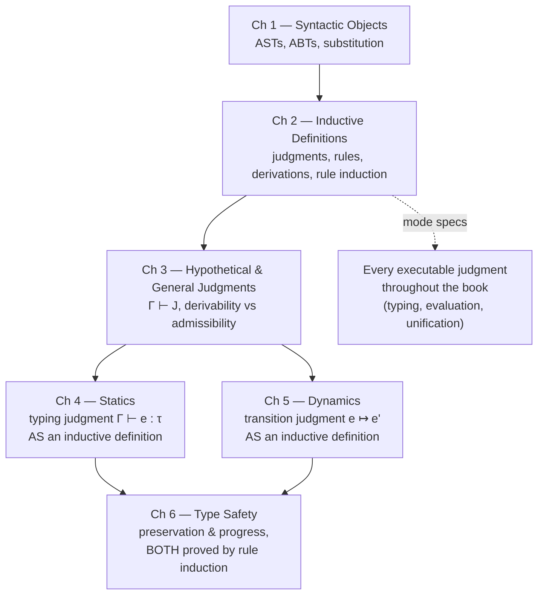

[[book-guidelines|↩ Back to guidelines]]

## Why bother formalizing "defined by rules" at all?

Every serious treatment of a programming language eventually says something like: "$e$ has type $\tau$ if $e$ is one of these forms and its parts have compatible types," or "$e$ steps to $e'$ if $e$ matches one of these patterns." That is, the whole enterprise of [[Statics-And-Dynamics|statics and dynamics]] — the two phases the rest of *Practical Foundations for Programming Languages* (PFPL) is built on — is going to consist of piles of rules like this. Before Harper can write a single typing rule in Chapter 4, he needs to nail down, once and for all, what a "rule" *means*: what it means for a judgment to be defined by a set of rules, what counts as evidence that the judgment holds, and what proof technique lets you say something true about *every* object satisfying the judgment.

This matters because "defined by rules" is dangerously ambiguous if you don't pin it down. Suppose someone hands you two rules for a judgment $a\ \mathsf{nat}$:

$$\dfrac{}{\mathsf{zero}\ \mathsf{nat}} \qquad \dfrac{a\ \mathsf{nat}}{\mathsf{succ}(a)\ \mathsf{nat}}$$

Do these rules describe *exactly* the natural numbers, or could there be some other object — call it $\infty$ — that also happens to satisfy $a\ \mathsf{nat}$, sitting off to the side, not built by the rules but not forbidden by them either? If you can't rule that out, you can't do induction: mathematical induction on $\mathbb{N}$ silently assumes there's nothing outside the numbers generated by zero and successor. Chapter 2's entire job is to make this precise — to say that an inductive definition characterizes the *smallest* (equivalently, the *strongest*) judgment satisfying the rules, and to derive, from that single fact, both a way to *prove* instances of the judgment (derivations) and a way to *reason about* all of them at once (rule induction).

This is exactly the machinery your own "define a judgment, then use it" pattern needs to be trustworthy — whether that judgment is `HasType(Γ, e, τ)` in a Rust type checker or `Provable(Γ, φ)` in a proof checker. Harper's insight, made explicit right at the start of the chapter, is that these are literally the same apparatus: **a type checker and a proof checker are both just implementations of an inductively defined judgment form.**

---

## Judgments and judgment forms

> *A judgment states that one or more syntactic objects have a property or stand in some relation to one another. The property or relation itself is called a judgment form... the objects constituting an instance are its subjects.*

Harper's running examples:

$$n\ \mathsf{nat} \qquad n = n_1 + n_2 \qquad \tau\ \mathsf{type} \qquad e : \tau \qquad e \Downarrow v$$

Each of these is an *instance* of a judgment *form* — $(-)\ \mathsf{nat}$, $(-) = (-) + (-)$, $(-):(-)$, and so on — applied to specific subjects (specific pieces of abstract syntax, in the sense of the [[Syntactic-Objects-and-Binding|previous chapter's]] ASTs/ABTs). The generic notation is $a\ J$ for "$J$ holds of $a$," or just $J$ when the subject doesn't need emphasis.

**What this is, in code terms:** a judgment form is a *relation* — in Rust terms, something like

```rust
// A judgment form is a predicate over syntactic subjects.
// This is the *type* of the relation, not yet its rules.
enum NatJudgment {
    IsNat(Term),                 // a nat
}
enum EqNatJudgment {
    Eq(Term, Term),              // a = b nat
}
```

and in Lean, judgment forms are almost always literally `Prop`-valued inductive families:

```lean
inductive IsNat : Term → Prop
inductive EqNat : Term → Term → Prop
```

Note the shape of the Lean declaration: it declares the *judgment form* (`IsNat : Term → Prop`) with no constructors yet — exactly Harper's move of introducing the judgment before its rules. The rules come next, and in Lean they *are* the constructors.

---

## Inference rules as sufficient conditions

An inductive definition of a judgment form is a set of rules of the shape

$$\dfrac{J_1 \quad \dots \quad J_k}{J} \tag{2.1}$$

$J_1, \dots, J_k$ are the **premises**, $J$ is the **conclusion**. A rule with zero premises ($k=0$) is an **axiom**; otherwise it's a **proper rule**. The crucial reading, stated explicitly: *a rule says its premises are* sufficient *for its conclusion* — not necessary. There can be several different rules with the same conclusion, each giving an independent sufficient condition, so from "$J$ holds" alone you can't conclude which rule (if any) produced it. (That symmetric fact — necessity — only holds for the *whole rule set together*, as the next section shows.)

Two worked examples from the book, which recur throughout the rest of this article:

$$\dfrac{}{\mathsf{zero}\ \mathsf{nat}} \; (2.2\text{a}) \qquad \dfrac{a\ \mathsf{nat}}{\mathsf{succ}(a)\ \mathsf{nat}} \; (2.2\text{b})$$

$$\dfrac{}{\mathsf{empty}\ \mathsf{tree}} \; (2.3\text{a}) \qquad \dfrac{a_1\ \mathsf{tree} \quad a_2\ \mathsf{tree}}{\mathsf{node}(a_1;a_2)\ \mathsf{tree}} \; (2.3\text{b})$$

Rule (2.2b) is actually a **rule scheme**: one rule for every choice of $a$. This is the formal-notation analogue of a generic `impl` or a Lean constructor with a bound variable — the scheme is a template, and each substitution instance is a concrete rule.

**[[Plotkins-PCF-and-Partial-Computation#Grounding|Grounding]] in code.** This is precisely what an inductive type's constructor list *is*:

```rust
enum Nat {
    Zero,             // axiom: zero nat
    Succ(Box<Nat>),   // rule scheme: a nat  ⟹  succ(a) nat
}
```

```lean
inductive Nat where
  | zero : Nat                    -- axiom
  | succ (a : Nat) : Nat          -- rule scheme, "a nat ⟹ succ(a) nat"
```

The correspondence is exact and worth sitting with: **a constructor with $k$ recursive arguments is a rule with $k$ premises of the judgment form the type itself defines.** `Succ(Box<Nat>)` isn't just "a case in an enum" — read logically, it's the rule "if `a` is evidence that some term is a `Nat`, then `Succ(a)` is evidence that its successor is too." This is why building an interpreter/typechecker in Rust by pattern-matching on an `enum` and building a proof/type derivation in Lean by applying constructors are, underneath, the same activity: both are *constructing derivations* of an inductively defined judgment.

### What breaks without "strongest"

If rules were only read as sufficient conditions and nothing more, an inductive definition wouldn't pin down a judgment uniquely — it would only give you a *lower bound* on it (a set the judgment must at least contain). Two different implementers could each satisfy "these rules are sufficient" while disagreeing wildly about what else is in the judgment: one might additionally declare some non-numeral object `Infinity` to satisfy `a nat`, and nothing in "the rules are sufficient" forbids it, since sufficiency never claims to be exhaustive. Without the extra stipulation that the defined judgment is the *strongest* (smallest, most restrictive) judgment closed under the rules, you cannot:

- do induction (there might be extra, non-rule-generated inhabitants induction wouldn't cover),
- trust that pattern-matching over the constructors is exhaustive (there might be inhabitants no constructor produces),
- prove a decision procedure "obviously correct" by just checking it against the rules (checking against rules only verifies soundness, not completeness).

This is exactly the distinction between an **open-world** and a **closed-world** collection of rules. Rust traits are open world by design — any crate can add `impl MyTrait for SomeType`, so "closed under the impls that exist right now" is not a stable fact you can induct over. A Lean/Coq `inductive` declaration is closed world by construction — once declared, no later code can add a constructor, so "these constructors are exhaustive" is a theorem the kernel gets for free, and that's exactly what licenses the `induction` tactic. Harper's "strongest judgment closed under the rules" is the *semantic* content that Lean's `inductive` keyword *operationalizes* syntactically.

---

## Derivations as finite compositions of rules

To *show* an inductively defined judgment holds, you exhibit a **derivation**: a finite tree built by stacking rule instances, axioms at the leaves, the judgment you want at the root. If $\nabla_1, \dots, \nabla_k$ are derivations of $J_1, \dots, J_k$ and $\frac{J_1 \dots J_k}{J}$ is a rule, then

$$\dfrac{\nabla_1 \quad \dots \quad \nabla_k}{J}$$

is a derivation of $J$. A derivation *is* the evidence — this is the proof-relevant reading that makes propositions-as-types (which PFPL covers explicitly in Chapter 30) feel inevitable in hindsight: a derivation of a judgment plays exactly the role a proof term plays for a proposition.

Book example: a derivation of $\mathsf{succ}(\mathsf{succ}(\mathsf{succ}(\mathsf{zero})))\ \mathsf{nat}$ stacks Rule (2.2b) three times on top of Rule (2.2a):

<svg viewBox="0 0 620 260" xmlns="http://www.w3.org/2000/svg" font-family="Georgia, serif" font-size="15">
  <style>
    .lbl { fill: #5b6472; }
    line { stroke: #5b6472; stroke-width: 1.4; }
  </style>
  <text x="290" y="240" text-anchor="middle" fill="currentColor">zero nat</text>
  <line x1="220" y1="222" x2="360" y2="222"/>
  <text x="590" y="235" class="lbl" text-anchor="end">(2.2a)</text>

  <text x="270" y="195" text-anchor="middle" fill="currentColor">succ(zero) nat</text>
  <line x1="170" y1="177" x2="410" y2="177"/>
  <text x="590" y="190" class="lbl" text-anchor="end">(2.2b)</text>

  <text x="250" y="150" text-anchor="middle" fill="currentColor">succ(succ(zero)) nat</text>
  <line x1="110" y1="132" x2="470" y2="132"/>
  <text x="590" y="145" class="lbl" text-anchor="end">(2.2b)</text>

  <text x="230" y="105" text-anchor="middle" fill="currentColor">succ(succ(succ(zero))) nat</text>
  <line x1="40" y1="88" x2="540" y2="88"/>
  <text x="590" y="100" class="lbl" text-anchor="end">(2.2b)</text>
</svg>

**[[Recursive-Types#Grounding|Grounding]].** A derivation is exactly a value of a recursive data type mirroring the judgment's constructors — the same idea as building a proof term in Lean:

```rust
enum NatDerivation {
    Zero,                          // derivation of `zero nat`
    Succ(Box<NatDerivation>),      // derivation of `succ(a) nat`, given one for `a nat`
}

let deriv = NatDerivation::Succ(Box::new(
    NatDerivation::Succ(Box::new(
        NatDerivation::Succ(Box::new(NatDerivation::Zero))
    ))
));
```

```lean
-- In Lean, a "derivation of a nat" for a *specific* a IS the term itself,
-- because Nat's constructors ARE the inference rules:
example : Nat := .succ (.succ (.succ .zero))
-- To derive a *judgment about* a nat you build a Prop-valued proof term the same way:
theorem three_is_pos : 0 < 3 := by decide
```

Note the subtlety: for `Nat` itself, the "derivation that something is a nat" collapses into the term itself, because `nat`-hood is trivial once you're working inside the type. Derivations become interesting as separate objects once the judgment is *about* a term rather than *constituting* it — e.g. `e : τ` (a typing derivation is a separate tree layered over the syntax of `e`), which is exactly the shape Chapter 4's [[Symbols-and-Dynamic-Binding#Statics|statics]] takes.

### Forward and backward chaining

Two dual search strategies for *finding* a derivation:

- **Forward chaining** (bottom-up): maintain a set of judgments already known derivable, start it empty, and repeatedly add the conclusion of any rule whose premises are all already in the set. Stop when the target judgment appears. Undirected — doesn't look at the goal while deciding what to derive next.
- **Backward chaining** (top-down): maintain a queue of open goals, starting with just the target judgment. Repeatedly pop a goal, find a rule whose conclusion matches it, and push that rule's premises as new goals. Stop when the queue is empty.

Both are *complete* (guaranteed to eventually find a derivation of anything derivable) but neither is *decidable* in general — there's no algorithmic way to know when to give up and declare a judgment non-derivable, short of understanding the specific rule set's global structure.

**Why this is directly load-bearing for you:** this is the seed of every proof-search and type-inference algorithm you'll build. Forward chaining is exactly a **Datalog-style fixpoint computation** — the naive way to implement it:

```rust
fn forward_chain_sum_facts(inputs: &[(Nat, Nat)]) -> HashSet<(Nat, Nat, Nat)> {
    let mut derived: HashSet<(Nat, Nat, Nat)> = HashSet::new();
    let mut changed = true;
    while changed {
        changed = false;
        // Rule (2.9a): b nat  ⟹  sum(zero, b, b)
        for b in all_nats(inputs) {
            if derived.insert((Nat::Zero, b.clone(), b.clone())) { changed = true; }
        }
        // Rule (2.9b): sum(a,b,c)  ⟹  sum(succ(a), b, succ(c))
        for (a, b, c) in derived.clone() {
            let fact = (Nat::Succ(Box::new(a)), b, Nat::Succ(Box::new(c)));
            if derived.insert(fact) { changed = true; }
        }
    }
    derived
}
```

Backward chaining is exactly what a Prolog interpreter, a tactic-based prover, or **Lean's elaborator resolving a typing goal via `isDefEq`/`inferType`** are doing — recursively decomposing a goal into subgoals by trying rules whose conclusion could produce it. When you eventually build the "custom automated theorem prover" for the Hoare-triple checker, its proof-search loop *is* backward chaining over an inductively defined provability judgment, exactly as specified here; and the elaborator's implicit-argument resolution is backward chaining over a typing/unification judgment with holes as open goals. This chapter names, in miniature, both search disciplines you'll be implementing at scale.

---

## Rule induction: reasoning over the strongest closed judgment

Because the judgment defined by a rule set is the *strongest* judgment closed under those rules, you get, for free, a proof principle: to show a property $P$ holds of every $J$ derivable by the rules, it suffices to show $P$ is **closed under** each rule — i.e., for every rule $\frac{J_1 \dots J_k}{J}$, that $P(J_1)$ and ... and $P(J_k)$ (the **inductive hypotheses**) together imply $P(J)$ (the **inductive conclusion**).

$$\text{if } P \text{ respects every rule, then } P(J) \text{ holds for every derivable } J$$

This is *not* an extra axiom bolted on to inductive definitions — it's a direct restatement of "strongest judgment closed under the rules": rule-closure gives you the induction step for free, and strongest-ness is exactly what licenses skipping any case not covered by a rule.

Specialized to Rules (2.2), rule induction *is* ordinary mathematical induction on $\mathbb{N}$:

1. $P(\mathsf{zero}\ \mathsf{nat})$,
2. for every $a$: if $a\ \mathsf{nat}$ and $P(a\ \mathsf{nat})$, then $P(\mathsf{succ}(a)\ \mathsf{nat})$.

— which is exactly what Lean's `induction` tactic generates as proof obligations when you write `induction n`, and exactly what a Rust `match` over `enum Nat { Zero, Succ(Box<Nat>) }` performs computationally (minus the logical induction hypothesis, which Rust's type system doesn't track — Rust gives you *structural recursion*, the computational shadow of rule induction, without the accompanying proof obligation).

Harper proves three lemmas by rule induction that are worth internalizing as templates, because their proof *shape* — case-split on which rule produced the judgment, discharge each case using the inductive hypothesis — is the shape every metatheorem in the rest of the book (weakening, substitution, preservation, progress) will take:

**Lemma 2.1.** If $\mathsf{succ}(a)\ \mathsf{nat}$, then $a\ \mathsf{nat}$.
*Proof sketch:* rule-induct on the property "$a\ \mathsf{nat}$, and if $a = \mathsf{succ}(b)$ then $b\ \mathsf{nat}$." The zero case holds vacuously (zero isn't a successor); the successor case is immediate from the inductive hypothesis.

**Lemma 2.2** (reflexivity of $=_{\mathsf{nat}}$). If $a\ \mathsf{nat}$, then $a = a\ \mathsf{nat}$ — rule-induct on Rules (2.2), applying (2.4a)/(2.4b) at each step.

**Lemma 2.3** (injectivity of successor). If $\mathsf{succ}(a_1) = \mathsf{succ}(a_2)\ \mathsf{nat}$, then $a_1 = a_2\ \mathsf{nat}$.

```lean
-- Lemma 2.1 is literally `Nat.succ.inj`'s cousin; the shape of the Lean proof
-- mirrors the shape of the rule-induction proof exactly:
theorem pred_is_nat {a : Nat} (h : IsNat (Nat.succ a)) : IsNat a := by
  cases h with
  | succ h' => exact h'   -- the ONLY way to derive `succ a` is via the succ rule,
                           -- and closed-world-ness is what makes `cases` exhaustive
```

The `cases`/`induction` tactic being total (no "unreachable, but I can't prove it" case) *is* the strongest-judgment property showing up as a compiler guarantee.

---

## Iterated and simultaneous inductive definitions

Two ways a rule set can be built on top of other judgments:

**Iterated:** a rule's premises may cite an *already-defined* judgment form as well as the one being defined. Example: lists of naturals, layering `list` on top of the previously-defined `nat`:

$$\dfrac{}{\mathsf{nil}\ \mathsf{list}} \qquad \dfrac{a\ \mathsf{nat} \quad b\ \mathsf{list}}{\mathsf{cons}(a;b)\ \mathsf{list}}$$

— exactly `enum List { Nil, Cons(Nat, Box<List>) }` / `inductive List where | nil | cons (a : Nat) (b : List)`.

**Simultaneous:** two or more judgment forms are defined by one combined rule set, where any rule's premises may reference *any* of the judgment forms being defined together — none can be considered "defined first." Example: even/odd naturals, mutually:

$$\dfrac{}{\mathsf{zero}\ \mathsf{even}} \qquad \dfrac{a\ \mathsf{odd}}{\mathsf{succ}(a)\ \mathsf{even}} \qquad \dfrac{a\ \mathsf{even}}{\mathsf{succ}(a)\ \mathsf{odd}}$$

Rule induction generalizes cleanly: to prove $P(J)$ for every derivable instance of *either* judgment form, prove $P$ closed under *all three* rules simultaneously (a joint induction, not two separate ones — because the `even`-rule for `succ` needs the `odd` inductive hypothesis and vice versa).

```rust
// Rust can't express this as two mutually recursive *proofs*
// (no proof layer), but it can express it as the mutually recursive
// *data*, which is the computational skeleton of the same idea:
enum Even { Zero, Succ(Box<Odd>) }
enum Odd  { Succ(Box<Even>) }
```

```lean
mutual
  inductive IsEven : Nat → Prop where
    | zero : IsEven .zero
    | succ {a} : IsOdd a → IsEven (.succ a)
  inductive IsOdd : Nat → Prop where
    | succ {a} : IsEven a → IsOdd (.succ a)
end
```

Lean's `mutual inductive` block is the direct formal descendant of Harper's "simultaneous inductive definition" — same reason it's needed (the rule sets are entangled, so no linear "define A, then define B" order works), same proof discipline (a `mutual` induction principle rather than two separate ones).

---

## Defining functions by their graph: existence and uniqueness

This is the section with the sharpest payoff for compiler/interpreter work. Instead of defining a function directly (as an algorithm), Harper defines its **graph** — the relation between inputs and outputs — inductively, and *separately proves* that the relation happens to behave like a function. For addition:

$$\dfrac{b\ \mathsf{nat}}{\mathsf{sum}(\mathsf{zero};b;b)} \; (2.9\text{a}) \qquad \dfrac{\mathsf{sum}(a;b;c)}{\mathsf{sum}(\mathsf{succ}(a);b;\mathsf{succ}(c))} \; (2.9\text{b})$$

**Theorem 2.4.** For every $a\ \mathsf{nat}$ and $b\ \mathsf{nat}$, there exists a *unique* $c\ \mathsf{nat}$ such that $\mathsf{sum}(a;b;c)$.

The proof genuinely has two independent halves, and the *shape* of each is worth extracting as a template you'll reuse constantly:

- **Existence**, by rule induction *on Rules (2.2)* — i.e., induction on the shape of the first argument $a$: base case builds $c := b$ via (2.9a); step case takes the $c$ given by the inductive hypothesis and wraps it, $c' := \mathsf{succ}(c)$, via (2.9b).
- **Uniqueness**, by rule induction *on Rules (2.9) themselves* (the relation's own derivation, not $a$'s structure) — an *outer* induction on which rule produced $\mathsf{sum}(a;b;c_1)$, with an *inner* induction reused to pin down what any other derivation $\mathsf{sum}(a;b;c_2)$ must look like, before combining the two by the outer inductive hypothesis.

This existence/uniqueness split is *exactly* the discharge obligation every time you write a Rust function and claim it "implements" a specification relation, or write a Lean function and want `simp`/`decide` to treat it as computationally faithful to a `Prop`-valued spec:

```rust
// The RELATION (the "spec"):
//   sum(a, b, c) holds iff a + b = c, defined inductively exactly as above.
// The FUNCTION below is only correct because Theorem 2.4 (existence+uniqueness)
// was proved — otherwise "just write a total Rust fn" would be begging the question.
fn sum(a: &Nat, b: &Nat) -> Nat {
    match a {
        Nat::Zero => b.clone(),                         // (2.9a): existence witness
        Nat::Succ(a_pred) => Nat::Succ(Box::new(sum(a_pred, b))),  // (2.9b)
    }
}
```

```lean
-- Lean makes the existence/uniqueness obligation into an actual proof artifact
-- when you define a function via its inductive graph rather than by recursion:
def sum : Nat → Nat → Nat
  | .zero,   b => b
  | .succ a, b => .succ (sum a b)

-- The graph-of-sum relation and Theorem 2.4 correspond to:
theorem sum_graph_exists (a b : Nat) : ∃ c, sum a b = c := ⟨sum a b, rfl⟩
theorem sum_graph_unique (a b c₁ c₂ : Nat)
    (h₁ : sum a b = c₁) (h₂ : sum a b = c₂) : c₁ = c₂ := h₁ ▸ h₂ ▸ rfl
```

The Rust `fn` and the Lean `def` both silently *assume* Theorem 2.4's proof went through; Harper is showing you the proof obligation your type checker's `.unwrap()` and your elaborator's "just call the type-inference function" are quietly resting on. Any judgment you plan to *execute* — a typing judgment, an evaluation judgment, a unification judgment — incurs exactly this obligation before you're licensed to write it as a function instead of a relation.

---

## Mode specifications: which arguments are inputs, which are outputs

A **mode** for a judgment states which of its arguments are universally quantified (given, i.e. *inputs*) and which are existentially quantified (*outputs*), and, for outputs, how many there provably are. Harper's notation for $\mathsf{sum}(a;b;c)$:

| Mode | Meaning |
|---|---|
| $(\forall, \forall, \exists)$ | for all $a, b$, some $c$ with $\mathsf{sum}(a;b;c)$ exists |
| $(\forall, \forall, \exists!)$ | ... and that $c$ is unique |
| $(\forall, \forall, \exists_{\le 1})$ | ... $c$ is unique *if it exists* (existence not claimed) |
| $(\forall, \exists_{\le 1}, \forall)$ | $c$ and $a$ determine $b$ uniquely if at all — i.e., *subtraction* falls out as another mode of the same relation |

The last row is the point that matters most: **the same inductively defined relation can be "run" in more than one direction**, and which direction(s) are legitimate is a theorem to prove, not a default to assume. $\mathsf{sum}$ has a total, functional forward mode (addition) and a partial functional reverse mode (subtraction) — both modes of literally the same three rules.

**Why this is exactly your elaborator's and verifier's bread and butter:** a *mode specification* is the formal predecessor of a function's type signature (which parameters are inputs, which is the return value) — but generalized to *relations*, which is precisely what you need once judgments can have holes. This is the same concept, under a different name, as **Miller's pattern unification**'s notion of which metavariable occurrences are "input" positions to be matched against versus "output" positions to be solved for; and it's the same concept as **bidirectional typing**'s inference-mode-vs-checking-mode split — an inference-mode judgment $\Gamma \vdash e \Rightarrow \tau$ has mode $(\forall,\forall,\exists)$ or $(\forall,\forall,\exists!)$ in $\tau$, while a checking-mode judgment $\Gamma \vdash e \Leftarrow \tau$ treats $\tau$ as an *input*, mode $(\forall,\forall,\forall)$, turning the same underlying relation into a decision procedure instead of a search problem. When you design [[Statics-And-Dynamics#The typing judgment|the typing judgment]] for the Hoare-triple checker, writing down its mode specification *before* writing the checker is exactly this section's discipline, and it's what will tell you in advance whether a given judgment is implementable as a total function, a partial function, or only as a search procedure.

---

## Where this leads



Everything from Chapter 4 onward is, mechanically, an instance of this chapter's apparatus: a typing judgment is an inductively defined judgment form; a typing rule is an inference rule; a typing derivation is a derivation in exactly this sense; and the [[Type-Safety|type safety]] proof in Chapter 6 (preservation by induction on the *[[Exceptions#Dynamics|dynamics]]* derivation, progress by induction on the *statics* derivation) is rule induction, twice, with no additional machinery. Chapter 3 immediately generalizes this chapter's "judgment" to *hypothetical* judgments ($\Gamma \vdash J$) precisely because typing judgments need a context of assumptions — but the induction principle developed here doesn't change, it just gets applied to a context-indexed family of judgments.

For your two target systems, this chapter is not background — it's the specification language you'll be writing in for the rest of both projects. The Rust verifier's Hoare-triple / dependent-[[Subtyping|subtyping]] judgments will be inductive definitions exactly like $\mathsf{sum}$, and before any of them get compiled into runnable checker code, each needs its own version of Theorem 2.4 (does a valid derivation exist? is it unique?) and its own mode specification (is this judgment a decision procedure, a search problem, or genuinely underdetermined?). The elaborator's unification and inference judgments are the same story with metavariables standing in for some of the "inputs": pattern unification's tractability *is* a mode-specification result — showing that a restricted class of unification problems has mode $(\forall, \exists_{\le 1})$ (unique solution if any) where general higher-order unification only has $(\forall, \exists)$ or worse (search, possibly undecidable). Forward and backward chaining, introduced here almost as an aside, are the two search disciplines both your theorem prover and your elaborator will be built from.
