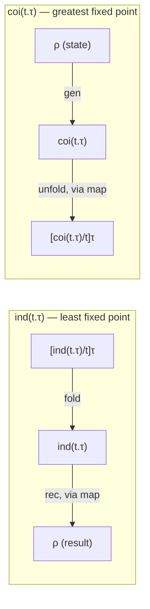

[[book-guidelines|↩ Back to guidelines]]

# Inductive and Coinductive Types

## The problem: `nat` and `stream` are each defined by two separate rules that shouldn't be separate

By Chapter 9 you already have natural numbers: `z` and `s(e)` as the two introductory forms, and `iter`/`rec` as the elimination form that lets you compute a value for every number by giving a base case and a step case. By Chapter 5 (implicitly, via streams as a motivating coinductive example) you have an intuition for an infinite sequence: something with a `hd` and a `tl`. Both of these are *ad hoc* — `nat` has two constructors (`z`, `s`) glued together by a recursor that pattern-matches on which one produced the value; `stream` has two observations (`hd`, `tl`) that happen to be extracted independently.

What breaks without unifying them: every time you want a new inductive type — lists, trees, finitely-branching trees, whatever — you'd have to re-derive its own bespoke recursor from scratch, re-prove its own termination, and re-establish that "the recursor is well-defined precisely because there's nothing else the type could contain." That's exactly the situation Chapter 14's [[Generic-Programming|generic programming]] machinery (the `map[t.τ]` generic extension) was built to avoid: instead of writing one `map` per data structure, you write one `map` *parameterized by a type operator* `t.τ` that says where the recursive occurrences sit. Chapter 15 does the same consolidation one level up: instead of one recursor per inductive type, you get **one recursor scheme**, parameterized by the same kind of type operator, that works for *any* inductive type built from a positive type operator. And dually, one generator scheme for *any* coinductive type.

This is also a change in what "the type" means philosophically. `nat` isn't `z`-or-`s` — it's *the least type closed under the operations `z` and `s`*, characterized entirely by an equation `nat ≅ unit + nat` together with the fact that it's the *smallest* solution to that equation. `stream` isn't "an `hd`-`tl` pair" — it's *the largest type consistent with the equation* `stream ≅ nat × stream`, because unlike a natural number, a stream never bottoms out; there's no smallest thing satisfying the equation (that would just be the empty stream, which no one wants), so you take the *largest* consistent solution instead — the one that admits genuinely infinite, ongoing streams.

## Step 1: Consolidating `nat` into a single introduction and elimination

Harper's move: instead of two constructors `z : nat` and `s : nat → nat`, use **one** constructor that takes a value of type `unit + nat` (either `unit`, standing for "zero", or a `nat`, standing for "this-plus-one"):

$$
\dfrac{\Gamma \vdash e : \mathsf{unit} + \mathsf{nat}}{\Gamma \vdash \mathsf{fold}_{\mathsf{nat}}(e) : \mathsf{nat}}
$$

Now `z` is just sugar for $\mathsf{fold}_{\mathsf{nat}}(\mathsf{l}\cdot\langle\rangle)$ and `s(e)` is sugar for $\mathsf{fold}_{\mathsf{nat}}(\mathsf{r}\cdot e)$. The recursor is similarly consolidated: instead of separate base-case and step-case arguments, it takes **one** abstractor `x.e₁` that receives a value of type $\mathsf{unit}+\tau$ and produces a $\tau$ — the same case split, but folded into a single computation:

$$
\dfrac{\Gamma, x:\mathsf{unit}+\tau \vdash e_1 : \tau \quad \Gamma \vdash e_2 : \mathsf{nat}}{\Gamma \vdash \mathsf{rec}_{\mathsf{nat}}[x.e_1](e_2) : \tau}
$$

The payoff shows up in the [[Exceptions#Dynamics|dynamics]] rule for unwinding the recursor:

$$
\mathsf{rec}_{\mathsf{nat}}[x.e_1](\mathsf{fold}_{\mathsf{nat}}(e_2)) \longmapsto [\mathsf{map}[t.\mathsf{unit}+t](y.\,\mathsf{rec}_{\mathsf{nat}}[x.e_1](y);\ e_2)/x]\,e_1
$$

That's Chapter 14's `map` doing real work: to recurse on the predecessor structure `unit + nat`, apply generic extension with the transformation "recurse again" threaded through exactly the spots marked by `t` in the operator. Expanding it out gives the familiar case split — `l·⟨⟩ ↦ l·⟨⟩` (nothing to recurse into) and `r·y ↦ r·recₙₐₜ[x.e₁](y)` (recurse into the predecessor) — but now it's *derived* from a single generic mechanism rather than hand-written per type.

**What this buys you:** the recursor is no longer bespoke code for `nat` specifically — it's `map` applied to the *same* type operator, `t.unit+t`, that appears in `nat`'s own formation rule. The type operator does double duty: it describes the type's shape *and* it drives the recursor's dynamics.

## Step 2: Consolidating `stream` into a single elimination and introduction (the dual move)

Streams go the opposite direction. Instead of two independent observations `hd(e) : nat` and `tl(e) : stream`, consolidate into **one** destructor returning a pair:

$$
\dfrac{\Gamma \vdash e : \mathsf{stream}}{\Gamma \vdash \mathsf{unfold}_{\mathsf{stream}}(e) : \mathsf{nat}\times\mathsf{stream}}
$$

with $\mathsf{hd}(e) := \mathsf{unfold}_{\mathsf{stream}}(e)\cdot l$ and $\mathsf{tl}(e) := \mathsf{unfold}_{\mathsf{stream}}(e)\cdot r$. The generator (the introduction form, and the dual of the recursor) is the mirror image of `rec`: it takes a *current state* `e₂ : τ` and a step function `x.e₁` that, given the state, produces the next head and the next state:

$$
\dfrac{\Gamma \vdash e_2 : \tau \quad \Gamma, x:\tau \vdash e_1 : \mathsf{nat}\times\tau}{\Gamma \vdash \mathsf{gen}_{\mathsf{stream}}[x.e_1](e_2) : \mathsf{stream}}
$$

Unfolding a generated stream uses `map` again, dually:

$$
\mathsf{unfold}_{\mathsf{stream}}(\mathsf{gen}_{\mathsf{stream}}[x.e_1](e_2)) \longmapsto \mathsf{map}[t.\mathsf{nat}\times t](y.\,\mathsf{gen}_{\mathsf{stream}}[x.e_1](y);\ [e_2/x]e_1)
$$

Read this as: run the step function once to get a `nat × τ`; the `nat` component is the new head, and the `τ` component becomes the new state, wrapped back up in a fresh generator so the *next* unfold repeats the process. A stream is never "all there at once" — it's a promise to keep producing, one step-function call at a time, forever.

**What breaks without consolidating this way:** if `hd` and `tl` were independent primitives with no shared generator, nothing would guarantee that calling `tl` twice gives you a *consistent* continuation of the same underlying process — you'd need to separately verify that every implementation of a stream-like value behaves coherently across both observations. The single generator, parameterized by one state and one step function, makes that coherence automatic: both `hd` and `tl` are computed from the *same* invocation of the step function against the *same* state.

## Step 3: The general form — `ind(t.τ)` and `coi(t.τ)`

Now Harper generalizes both patterns to *any* type operator `t.τ`, not just `unit+t` (naturals) or `nat×t` (streams):

$$
\tau ::= \mathsf{ind}(t.\tau) \mid \mathsf{coi}(t.\tau)
$$

with formation rules requiring the operator to be **positive**:

$$
\dfrac{\Delta,t\ \mathsf{type} \vdash \tau\ \mathsf{type} \quad \Delta \vdash t.\tau\ \mathsf{pos}}{\Delta \vdash \mathsf{ind}(t.\tau)\ \mathsf{type}} \qquad\qquad \dfrac{\Delta,t\ \mathsf{type} \vdash \tau\ \mathsf{type} \quad \Delta \vdash t.\tau\ \mathsf{pos}}{\Delta \vdash \mathsf{coi}(t.\tau)\ \mathsf{type}}
$$

The expressions generalize `fold`/`rec` and `unfold`/`gen` exactly as you'd expect from the two worked examples:

$$
\begin{aligned}
&\dfrac{\Gamma \vdash e : [\mathsf{ind}(t.\tau)/t]\tau}{\Gamma \vdash \mathsf{fold}[t.\tau](e) : \mathsf{ind}(t.\tau)}
&&\dfrac{\Gamma, x:[\rho/t]\tau \vdash e_1 : \rho \quad \Gamma \vdash e_2 : \mathsf{ind}(t.\tau)}{\Gamma \vdash \mathsf{rec}[t.\tau][x.e_1](e_2) : \rho}\\[2ex]
&\dfrac{\Gamma \vdash e : \mathsf{coi}(t.\tau)}{\Gamma \vdash \mathsf{unfold}[t.\tau](e) : [\mathsf{coi}(t.\tau)/t]\tau}
&&\dfrac{\Gamma \vdash e_2 : \rho \quad \Gamma, x:\rho \vdash e_1 : [\rho/t]\tau}{\Gamma \vdash \mathsf{gen}[t.\tau][x.e_1](e_2) : \mathsf{coi}(t.\tau)}
\end{aligned}
$$

And the dynamics, once more via `map`:

$$
\mathsf{rec}[x.e_1](\mathsf{fold}(e_2)) \longmapsto [\mathsf{map}[t.\tau](y.\,\mathsf{rec}[x.e_1](y);\ e_2)/x]\,e_1
\qquad
\mathsf{unfold}(\mathsf{gen}[x.e_1](e_2)) \longmapsto \mathsf{map}[t.\tau](y.\,\mathsf{gen}[x.e_1](y);\ [e_2/x]e_1)
$$

This is why the chapter title pairs the two words that name these operations precisely: `rec` is a **recursor**, or **catamorphism** ("collapsing" a structure — from Greek *kata*, downward — into a single value by folding it up, one layer at a time), and `gen` is a **generator**, or **anamorphism** (the dual — "building up," from Greek *ana*) that unfolds a state into an ever-continuing structure. Categorically (Harper cites Mendler 1987, and points to Mac Lane and Taylor), $\mathsf{ind}(t.\tau)$ is the *initial algebra* and $\mathsf{coi}(t.\tau)$ is the *final coalgebra* for the functor determined by $t.\tau$ — "initial" meaning it's the smallest fixed point (nothing smaller satisfies the equation), "final" meaning it's the largest.



## Positivity: why `t` can only occur on the "output" side

Both formation rules demand $\Delta \vdash t.\tau\ \mathsf{pos}$ — the self-reference variable `t` may occur only in **positive positions**: never in the domain (left) side of a function arrow. This isn't a stylistic restriction — it's what makes the whole scheme well-defined.

**[[Exceptions#What breaks without it|What breaks without it]].** The recursor's dynamics rule literally applies `map[t.τ]` to the transformation `y.rec[x.e₁](y)` — it needs to call itself recursively at *every* occurrence of `t` inside `τ`. If `t` appeared in a *negative* position — say `τ = t → nat` — then to transform a value of `[ind(t.τ)/t]τ = ind(t.τ) → nat` into `[ρ/t]τ = ρ → nat`, generic extension would need to build a function `ρ → nat` out of a function `ind(t.τ) → nat`, which means it would need to go *backwards*: given a `ρ`, produce an `ind(t.τ)` first (to feed the original function), which is exactly the recursive problem you started with, running in the wrong direction. There's no principled way to do that in general — `map` only knows how to push a transformation *forward* through covariant (positive) occurrences. Concretely, Chapter 14 already established that a type operator like `t.τ₁ → τ₂` is only positive when `t` doesn't occur in `τ₁` at all; `ind(t.τ)` and `coi(t.τ)` simply inherit that same restriction because their dynamics is *defined in terms of* `map`.

There's a deeper reason too, gestured at by the categorical framing in the chapter's Notes: if you allowed a genuinely unrestricted self-referential equation — something like `t ≅ t → nat`, with `t` in a negative position — you'd be asking for a type that's simultaneously "no bigger than" and "at least as big as" the space of functions out of itself, a set-theoretic contradiction in the spirit of Cantor's theorem (there's no injection from a set into its own function space, let alone an isomorphism with it). Positivity is exactly the syntactic discipline that keeps `ind`/`coi` inside the region of type operators for which a well-behaved fixed point — smallest for `ind`, largest for `coi` — actually exists.

**Rust [[Plotkins-PCF-and-Partial-Computation#Grounding|grounding]].** Rust's own recursive `enum`s are implicitly positivity-checked by the compiler for a related but stricter reason (they must be finite in *size*, not just well-founded semantically), which is why every self-referential variant needs an indirection like `Box`:

```rust
// t.unit + t, i.e. nat, made concrete:
enum Nat {
    Zero,             // corresponds to l · <>
    Succ(Box<Nat>),   // corresponds to r · e ; Box because Nat can't contain itself unboxed
}

// The recursor, rec[x.e1](e2), written directly:
fn rec_nat<T>(n: Nat, base: T, step: impl Fn(T) -> T) -> T {
    match n {
        Nat::Zero => base,
        Nat::Succ(pred) => step(rec_nat(*pred, base, step)), // "step" only ever consumes T, never Nat again — positive!
    }
}
```

If you tried to write a type where the recursive occurrence sat in a function *argument* — e.g. `enum Bad { Wrap(Box<dyn Fn(Bad) -> i32>) }` — Rust will still compile it, because Rust's positivity story is about representation size (handled by `Box`), not about definability of a structural recursor. But you'd find you *can't* write a total, structurally-recursive function over `Bad` the way `rec_nat` works over `Nat`: to call the closure inside a `Bad`, you'd need to produce a `Bad` to hand it, which needs another closure, which needs another `Bad` — the same infinite regress the positivity rule is designed to rule out at the type-formation stage, before you even try to write the recursor.

**Lean grounding.** This is precisely what Lean's kernel enforces as its **strict positivity** check on `inductive` declarations — a family occurring in a constructor argument's type may not appear to the left of an arrow (nor inside another inductive's negative position, transitively). It's the same rule for the same reason: Lean's kernel *automatically derives* the recursor (`Nat.rec`, or the auto-generated `.rec` for any `inductive`) from the constructor signatures, exactly the way Harper's `rec[t.τ][x.e₁](e₂)` is derived uniformly from `t.τ`. If Lean allowed a non-positive occurrence, the auto-generated recursor would be unsound — you could use it to build a term of an empty type, i.e. prove `False`. Positivity-checking in Lean's kernel *is* Harper's `Δ ⊢ t.τ pos` judgment, implemented as a real termination/soundness gate:

```lean
-- Positive, accepted: t (=Nat) occurs only as a plain argument, never in
-- a function domain that would need to "produce" a Nat to be applied.
inductive Nat where
  | zero : Nat
  | succ : Nat → Nat

-- Coinductive dual: Lean does not let you write general coinductive types
-- with `inductive`, precisely because unrestricted self-reference in the
-- eliminatory direction needs its own machinery (`Stream'` in Lean/Mathlib
-- is built on top of a plain function nat → α, sidestepping the issue by
-- not needing a *generator* primitive at the kernel level).
def Stream' (α : Type) := Nat → α
def hd (s : Stream' α) : α := s 0
def tl (s : Stream' α) : Stream' α := fun n => s (n + 1)
```

**[[Continuations#Python grounding|Python grounding]].** Python has no static positivity checker, but the *symptom* of violating it is visible at runtime: a "callback that needs an instance of the type it's defined on" tends to either need laziness (thunks) or diverges immediately.

```python
# A positive (Harper-legal) shape: recursion is fine, structurally decreasing.
def rec_nat(n, base, step):
    if n == 0:
        return base
    return step(rec_nat(n - 1, base, step))

# A non-positive shape sketched informally: to call `f`, you first need
# a `Bad` value to pass it — but the only way to build one *is* to already
# have called `f`. There is no base case reachable by construction.
```

## Closing synthesis

Chapter 15 sits at the hinge of the book's treatment of recursive data. It *consumes* Chapter 14's generic extension (`map[t.τ]`) as the engine that drives both the recursor's and the generator's dynamics — without a uniform `map`, you'd be back to writing a bespoke recursion principle per data type. It *produces* the general pattern that Chapter 16 immediately relaxes: general [[Recursive-Types|recursive types]] $\mu t.\tau$ drop the initiality/finality distinction (and the positivity requirement on the *formation* side) in exchange for a plain type *isomorphism* $\mu t.\tau \cong [\mu t.\tau/t]\tau$, gaining the ability to encode genuinely self-referential values (and, eventually, general recursion and even state) at the cost of no longer being able to say "this is the *least* solution" or "this is the *greatest* solution" — you just get *a* solution, and it's on you to write terminating code with it.

For the elaborator/kernel-unifier project: this chapter *is* the formal specification of what Lean's `inductive` command and its strict-positivity checker are doing, stated with more explicit dynamics than most kernel implementations bother to expose. When Lean rejects a non-positive `inductive`, it's enforcing exactly $\Delta \vdash t.\tau\ \mathsf{pos}$; when it auto-derives `.rec` from constructors, it's instantiating exactly the `map`-based rule (15.10c) above. If your own verifier ever needs to accept user-defined inductive types and auto-generate sound recursion/induction principles for them (rather than hand-coding recursors per type, the way Chapter 9's `nat` originally did), this is the exact mechanism to implement: check positivity at formation time, derive the eliminator uniformly from the type operator via generic extension.
